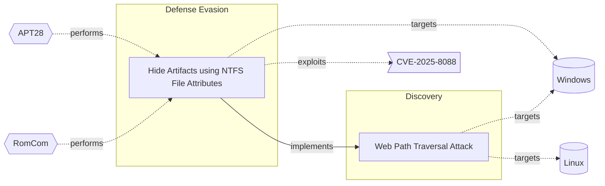

# ☣️ Hide Artifacts using NTFS File Attributes

🔥 **Criticality:High** ⚠️ : A High priority incident is likely to result in a demonstrable impact to public health or safety, national security, economic security, foreign relations, civil liberties, or public confidence. 

🚦 **TLP:CLEAR** ⚪ : Recipients can spread this to the world, there is no limit on disclosure.

🗡️ **ATT&CK Techniques** [T1564.004 : Hide Artifacts: NTFS File Attributes](https://attack.mitre.org/techniques/T1564/004 'Adversaries may use NTFS file attributes to hide their malicious data in order to evade detection Every New Technology File System NTFS formatted part')

---

`🔑 UUID : d15bff6c-b902-4975-ad3a-7a18f3026aca` **|** `🏷️ Version : 1` **|** `🗓️ Creation Date : 2025-06-27` **|** `🗓️ Last Modification : 2025-08-26` **|** `Sharing Organisation : {'uuid': '56b0a0f0-b0bc-47d9-bb46-02f80ae2065a', 'name': 'EC DIGIT CSOC'}` **|** `🧱 Schema Identifier : tvm::2.1`

## 👁️ Description

> Threat actors are using a hiding technique to conceal malicious files,
> folders, or other artifacts on a Windows system by leveraging the attributes
> of the NTFS file system. NTFS provides a range of attributes that can be
> used to hide or obscure files and folders, making them difficult to detect
> ref [1].  
> 
> Threat actors may use NTFS alternate data stream attribute to evade
> detection and deliver binary or other files that would have been otherwise
> blocked by the security controls.
> 
> They may store malicious data or binaries in file attribute metadata instead
> of directly in files. This may be done to evade some defenses, such as
> static indicator scanning tools and anti-virus ref [1], [2].      
> 
> An example is to attach a binary or a DLL as an ADS to a PDF file or text
> file that does not contain anything suspicious (decoy content) and acts just
> a carrier for the malicious payload store into the ADS.
> 
> In one of the malicious campaign a Russian affiliated threat actor is
> observed to use Alternate Data Streams (ADSes) vulnerability `CVE-2025-8088`
> for path traversal. The attackers specially crafted the archive to
> apparently contain only one benign file, while it contains many malicious
> addresses. Once a victim opens this seemingly benign file, WinRAR unpacks it
> along with all its ADSes ref [5].  
> 
> ### Known Techniques used by Threat Actors
> 
> - Setting attributes using the command line - a malicious operator can use
>   the attrib command to set attributes on files and folders.
> - Using API calls -  threat actor can use Windows API calls, such as
>   `SetFileAttributes` or `SetFileAttribute`, to set attributes on files and
>   folders.
> - Exploiting vulnerabilities - exploit vulnerabilities in software or the
>   operating system is another common used technique. Using these type of
>   vulnerabilities a threat actor can set attributes on files and folders
>   without being detected.        
> 

## 🖥️ Terrain 

 > Threat actors need to deliver on the host a file that uses NTFS extended
> attributes.  
> 

 &nbsp;
### ❤️‍🩹 Common Vulnerability Enumeration

⚠️ ERROR : Could not successfully retrieve CVE Details, double check the broken links below to confirm the CVE ID exists.

- [💔 CVE-2025-8088](https://nvd.nist.gov/vuln/detail/CVE-2025-8088)

&nbsp;

---

## 🕸️ Relations

### 🐲 Actors sightings 

| Actor          | Description                                                                                                                                                                                                                                                                                                                                                                                                                                                                                                                                                                                                                                                                                                                                                                                                                                                                                                                                                                                                                                                                                                                                                                                                                                                                                                                                                                                                                                                                                                                                                                                                                                                                                                                                          | Aliases                                                                                                                                                                                                                                                                                                   | Source                     | Sighting                                                                                                                                                                                                       | Reference                                                                                                                   |
|:---------------|:-----------------------------------------------------------------------------------------------------------------------------------------------------------------------------------------------------------------------------------------------------------------------------------------------------------------------------------------------------------------------------------------------------------------------------------------------------------------------------------------------------------------------------------------------------------------------------------------------------------------------------------------------------------------------------------------------------------------------------------------------------------------------------------------------------------------------------------------------------------------------------------------------------------------------------------------------------------------------------------------------------------------------------------------------------------------------------------------------------------------------------------------------------------------------------------------------------------------------------------------------------------------------------------------------------------------------------------------------------------------------------------------------------------------------------------------------------------------------------------------------------------------------------------------------------------------------------------------------------------------------------------------------------------------------------------------------------------------------------------------------------|:----------------------------------------------------------------------------------------------------------------------------------------------------------------------------------------------------------------------------------------------------------------------------------------------------------|:---------------------------|:---------------------------------------------------------------------------------------------------------------------------------------------------------------------------------------------------------------|:----------------------------------------------------------------------------------------------------------------------------|
| [Mobile] APT28 | [APT28](https://attack.mitre.org/groups/G0007) is a threat group that has been attributed to Russia's General Staff Main Intelligence Directorate (GRU) 85th Main Special Service Center (GTsSS) military unit 26165.(Citation: NSA/FBI Drovorub August 2020)(Citation: Cybersecurity Advisory GRU Brute Force Campaign July 2021) This group has been active since at least 2004.(Citation: DOJ GRU Indictment Jul 2018)(Citation: Ars Technica GRU indictment Jul 2018)(Citation: Crowdstrike DNC June 2016)(Citation: FireEye APT28)(Citation: SecureWorks TG-4127)(Citation: FireEye APT28 January 2017)(Citation: GRIZZLY STEPPE JAR)(Citation: Sofacy DealersChoice)(Citation: Palo Alto Sofacy 06-2018)(Citation: Symantec APT28 Oct 2018)(Citation: ESET Zebrocy May 2019)[APT28](https://attack.mitre.org/groups/G0007) reportedly compromised the Hillary Clinton campaign, the Democratic National Committee, and the Democratic Congressional Campaign Committee in 2016 in an attempt to interfere with the U.S. presidential election.(Citation: Crowdstrike DNC June 2016) In 2018, the US indicted five GRU Unit 26165 officers associated with [APT28](https://attack.mitre.org/groups/G0007) for cyber operations (including close-access operations) conducted between 2014 and 2018 against the World Anti-Doping Agency (WADA), the US Anti-Doping Agency, a US nuclear facility, the Organization for the Prohibition of Chemical Weapons (OPCW), the Spiez Swiss Chemicals Laboratory, and other organizations.(Citation: US District Court Indictment GRU Oct 2018) Some of these were conducted with the assistance of GRU Unit 74455, which is also referred to as [Sandworm Team](https://attack.mitre.org/groups/G0034). | FROZENLAKE, Fancy Bear, Forest Blizzard, Group 74, GruesomeLarch, IRON TWILIGHT, Pawn Storm, SNAKEMACKEREL, STRONTIUM, Sednit, Sofacy, Swallowtail, TG-4127, Threat Group-4127, Tsar Team                                                                                                                 | 🗡️ MITRE ATT&CK Groups     | No documented sighting                                                                                                                                                                                         | No documented references                                                                                                    |
| APT28          | The Sofacy Group (also known as APT28, Pawn Storm, Fancy Bear and Sednit) is a cyber espionage group believed to have ties to the Russian government. Likely operating since 2007, the group is known to target government, military, and security organizations. It has been characterized as an advanced persistent threat.                                                                                                                                                                                                                                                                                                                                                                                                                                                                                                                                                                                                                                                                                                                                                                                                                                                                                                                                                                                                                                                                                                                                                                                                                                                                                                                                                                                                                        | Pawn Storm, FANCY BEAR, Sednit, SNAKEMACKEREL, Tsar Team, TG-4127, STRONTIUM, Swallowtail, IRON TWILIGHT, Group 74, SIG40, Grizzly Steppe, G0007, ATK5, Fighting Ursa, ITG05, Blue Athena, TA422, T-APT-12, APT-C-20, UAC-0028, FROZENLAKE, Sofacy, Forest Blizzard, BlueDelta, Fancy Bear, GruesomeLarch | 🌌 MISP Threat Actor Galaxy | APT28, a Russian state-sponsored threat actor, has been known to useNTFS file attributes to hide malware and other artifacts on compromisedsystems. They have saved files with hidden file attributes ref [3]. | https://cyber-kill-chain.ch/techniques/T1564/001                                                                            |
| RomCom         | ROMCOM is an evolving and sophisticated threat actor group that has been using the malware tool ROMCOM for espionage and financially motivated attacks. They have targeted organizations in Ukraine and NATO countries, including military personnel, government agencies, and political leaders. The ROMCOM backdoor is capable of stealing sensitive information and deploying other malware, showcasing the group's adaptability and growing sophistication.                                                                                                                                                                                                                                                                                                                                                                                                                                                                                                                                                                                                                                                                                                                                                                                                                                                                                                                                                                                                                                                                                                                                                                                                                                                                                      | Storm-0978, UAT-5647                                                                                                                                                                                                                                                                                      | 🌌 MISP Threat Actor Galaxy | RomCom uses alternate data streams (ADSes) for path traversal. One oftheir campaigns is related to WinRar exploitation. There is moredetailed information provided in ref [5].                                 | https://www.welivesecurity.com/en/eset-research/update-winrar-tools-now-romcom-and-others-exploiting-zero-day-vulnerability |

### 🌊 OpenTide Objects
🚫 No related OpenTide objects indexed.

 --- 

### ⛓️ Threat Chaining

Expand chaining data

| ☣️ Vector                                                                                                                                                                                                                                                                                | ⛓️ Link                 | 🎯 Target                                                                                                                                                                                                                                             | ⛰️ Terrain                                                                                                                                          | 🗡️ ATT&CK                                                                                                                                                                                                                                  |
|:-----------------------------------------------------------------------------------------------------------------------------------------------------------------------------------------------------------------------------------------------------------------------------------------|:------------------------|:-----------------------------------------------------------------------------------------------------------------------------------------------------------------------------------------------------------------------------------------------------|:----------------------------------------------------------------------------------------------------------------------------------------------------|:-------------------------------------------------------------------------------------------------------------------------------------------------------------------------------------------------------------------------------------------|
| [Hide Artifacts using NTFS File Attributes](../Threat%20Vectors/☣️%20Hide%20Artifacts%20using%20NTFS%20File%20Attributes.md 'Threat actors are using a hiding technique to conceal malicious files,folders, or other artifacts on a Windows system by leveraging the attributesof t...') | `atomicity::implements` | [Web Path Traversal Attack](../Threat%20Vectors/☣️%20Web%20Path%20Traversal%20Attack.md 'Directory traversal also known as file path traversal is a web securityvulnerability that allows an attacker to read arbitrary files on the serverthat...') | A web application vulnerable to path traversal, i.e. which does not sanitize user inputs sufficiently and with unsufficient resource access policy. | [T1083 : File and Directory Discovery](https://attack.mitre.org/techniques/T1083 'Adversaries may enumerate files and directories or may search in specific locations of a host or network share for certain information within a file s') |

&nbsp; 

---

## Model Data

#### **⛓️ Cyber Kill Chain**

 > Cyber attacks are typically phased progressions towards strategic objectives. The Unified Kill Chains provides insight into the tactics that hackers employ to attain these objectives. This provides a solid basis to develop (or realign) defensive strategies to raise cyber resilience.

 [`🏃🏽 Defense Evasion`](https://www.unifiedkillchain.com/assets/The-Unified-Kill-Chain.pdf) : Techniques an attacker may specifically use for evading detection or avoiding other defenses.

---

#### **🛰️ Domains**

 > Infrastructure technologies domain of interest to attackers.

 `🏢 Enterprise` : Generic databases, applications, machines and systems that are usually on premises or on Cloud traditional VMs.

---

#### **🎯 Targets**

 > Granular delimited technical entities holding a value to the organization, that are targeted by adversaries. They might be also involved in the detection coverage as the target of log collection. Partially inspired by Veris.

  - [`🖥️ Desktop`](http://veriscommunity.net/enums.html#section-asset) : User Device - Desktop or workstation
 - [`🖥️ Workstations`](http://veriscommunity.net/enums.html#section-asset) : Placeholder

---

#### **💿 Platforms concerned**

 > Actual technologies used by the organization that will be exploited by adversaries during a successful attack, and eventually of relevance for detection. Are named by commercial designation.

 ` Windows` : Placeholder

---

#### **💣 Severity**

 > The severity summarizes the overall danger of incident the vector will provoke, and is to be derived (WIP) from impact, leverage, and difficulty to execute.

 [`🔫 Localised incident`](https://www.ncsc.gov.uk/news/new-cyber-attack-categorisation-system-improve-uk-response-incidents) : A cyber attack on an individual, or preliminary indications of cyber activity against a small or medium-sized organisation.

---

#### **🪄 Leverage acquisition**

 > Technical aftermath of the attack from the target perspective, differentiated from impact as it does not consider the value of the consequence, only what increased control the vector execution provides to the adversary.

  - [`🦠 Dwelling`](https://owasp.org/www-community/Threat_Modeling_Process#stride) : Active or passive extended presence in the target, which performs adversarial operations continuously.
 - [`💅 Elevation of privilege`](https://owasp.org/www-community/Threat_Modeling_Process#stride) : Capacity to augment leverage over the target system by upgrading the compromised access rights

---

#### **💥 Impact**

 > Analysis of the threat vector from the organizational perspective, in non technical term. This aims at putting a clear denomination on what the attacker will actually be able to act upon if the threat vector is realized.

  - [`🛑 Business disruption`](http://veriscommunity.net/enums.html#section-impact) : Business disruption
 - [`🩼 Impairement`](http://veriscommunity.net/enums.html#section-impact) : Incapacitation of a particular key system that will cause disruptions in day-to-day operations, and eventually service delivery.

---

#### **🎲 Vector Viability**

 > Described with estimative language (likelyhood probability), describes how likely the analyst believes the vector to actually be realized on the organization infrastructure. Estimative language describes quality and credibility of underlying sources, data, and methodologies based Intelligence Community Directive 203 (ICD 203) and JP 2-0, Joint Intelligence.

 [`🧐 Likely`](https://www.dni.gov/files/documents/ICD/ICD%20203%20Analytic%20Standards.pdf) : Probable (probably) - 55-80%

---

### 🔗 References

**🕊️ Publicly available resources**

- [_1_] https://www.atomicredteam.io/atomic-red-team/atomics/T1564.004
- [_2_] https://axelarator.github.io/posts/ntfs
- [_3_] https://cyber-kill-chain.ch/techniques/T1564/001
- [_4_] https://www.cisa.gov/eviction-strategies-tool/info-attack/T1564
- [_5_] https://www.welivesecurity.com/en/eset-research/update-winrar-tools-now-romcom-and-others-exploiting-zero-day-vulnerability

[1]: https://www.atomicredteam.io/atomic-red-team/atomics/T1564.004
[2]: https://axelarator.github.io/posts/ntfs
[3]: https://cyber-kill-chain.ch/techniques/T1564/001
[4]: https://www.cisa.gov/eviction-strategies-tool/info-attack/T1564
[5]: https://www.welivesecurity.com/en/eset-research/update-winrar-tools-now-romcom-and-others-exploiting-zero-day-vulnerability

---

#### 🏷️ Tags

#-, #-, #-, #
, #
, ##, ##, ##, ##, # , #🏷, #️, # , #T, #a, #g, #s, #
, #

