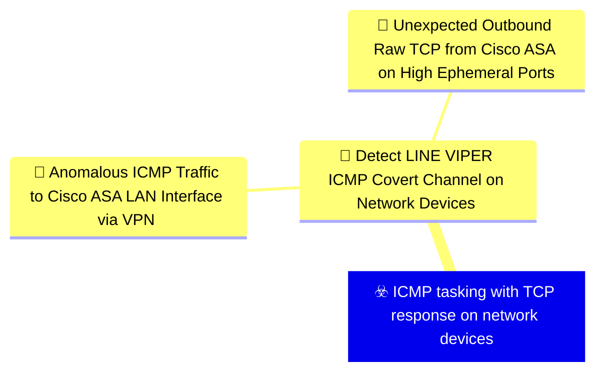
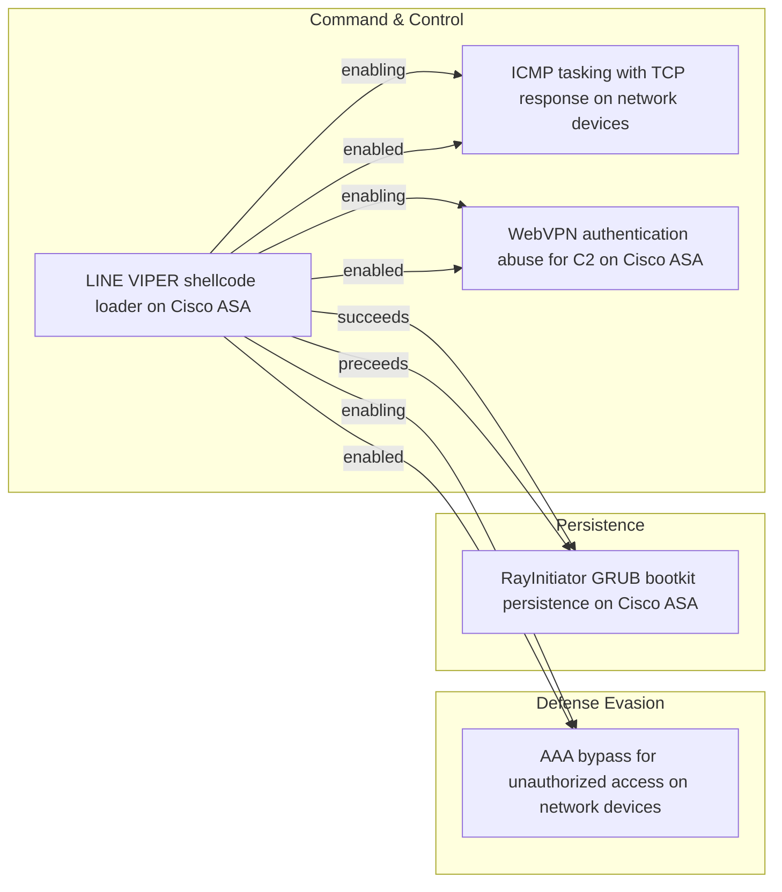

# ☣️ ICMP tasking with TCP response on network devices

🔥 **Criticality:High** ⚠️ : A High priority incident is likely to result in a demonstrable impact to public health or safety, national security, economic security, foreign relations, civil liberties, or public confidence. 

🚦 **TLP:CLEAR** ⚪ : Recipients can spread this to the world, there is no limit on disclosure.

🗡️ **ATT&CK Techniques** [T1095 : Non-Application Layer Protocol](https://attack.mitre.org/techniques/T1095 'Adversaries may use an OSI non-application layer protocol for communication between host and C2 server or among infected hosts within a network The li'), [T1571 : Non-Standard Port](https://attack.mitre.org/techniques/T1571 'Adversaries may communicate using a protocol and port pairing that are typically not associated For example, HTTPS over port 8088Citation Symantec Elf'), [T1573.001 : Encrypted Channel: Symmetric Cryptography](https://attack.mitre.org/techniques/T1573/001 'Adversaries may employ a known symmetric encryption algorithm to conceal command and control traffic rather than relying on any inherent protections p'), [T1573.002 : Encrypted Channel: Asymmetric Cryptography](https://attack.mitre.org/techniques/T1573/002 'Adversaries may employ a known asymmetric encryption algorithm to conceal command and control traffic rather than relying on any inherent protections '), [T1480.001 : Execution Guardrails: Environmental Keying](https://attack.mitre.org/techniques/T1480/001 'Adversaries may environmentally key payloads or other features of malware to evade defenses and constraint execution to a specific target environment ')

---

`🔑 UUID : 2a5faf22-c526-4d49-81b9-6a7b895de58b` **|** `🏷️ Version : 1` **|** `🗓️ Creation Date : 2026-06-18` **|** `🗓️ Last Modification : 2026-06-18` **|** `Sharing Organisation : {'uuid': '56b0a0f0-b0bc-47d9-bb46-02f80ae2065a', 'name': 'EC DIGIT CSOC'}` **|** `🧱 Schema Identifier : tvm::2.1`

## 👁️ Description

> LINE VIPER implements a sophisticated alternative command and
> control mechanism that uses ICMP (Internet Control Message Protocol)
> for receiving tasking commands and raw TCP connections for
> responding with results [1]. This dual-protocol approach provides
> operational flexibility and defence evasion capabilities.
> 
> #### Protocol Design
> 
> The ICMP-based C2 channel operates through a split-protocol design
> where incoming tasking and outgoing responses use different network
> protocols [1]:
> 
> **Incoming Tasking (ICMP):** The malware monitors for specially
> crafted ICMP packets that contain encrypted tasking commands. ICMP
> is commonly used for network diagnostics (ping, traceroute) and is
> typically allowed through firewalls, making it an ideal covert
> channel. The use of ICMP for tasking allows the attacker to send
> commands without establishing TCP connections, reducing the network
> footprint.
> 
> **Outgoing Responses (Raw TCP):** Rather than responding via ICMP,
> LINE VIPER sends results back over raw TCP connections. This
> asymmetric approach provides several advantages:
> - TCP provides reliable delivery for potentially large result sets
> - Raw TCP sockets allow arbitrary port selection
> - Separation of inbound and outbound protocols complicates analysis
> 
> #### Port Usage and Network Behaviour
> 
> LINE VIPER responds to ICMP tasking via raw TCP using
> high-ephemeral ports [1]. Ephemeral ports are typically in the
> range 32768-65535 on Linux systems. The use of high-ephemeral ports
> provides several operational security benefits:
> 
> - **Dynamic Selection:** Different ephemeral ports can be used for
>   each response, avoiding patterns that could be detected through
>   long-term network monitoring.
> 
> - **Legitimate Appearance:** High-ephemeral ports are commonly used
>   for outbound connections from network devices, making the traffic
>   appear normal.
> 
> - **Firewall Traversal:** Most firewall configurations allow
>   outbound connections on ephemeral ports, as blocking them would
>   break legitimate functionality.
> 
> #### Encryption and Authentication
> 
> Like the WebVPN-based C2 channel, the ICMP/TCP method implements
> strong cryptographic protections [1]:
> 
> - **Per-Request AES Encryption:** Tasking commands received via
>   ICMP are encrypted using AES with unique symmetric keys for each
>   request. This prevents replay attacks and ensures confidentiality.
> 
> - **RSA Key Exchange:** LINE VIPER uses per-victim RSA public keys
>   to perform symmetric key exchange. This ensures that only the
>   actor with the corresponding private key can decrypt and verify
>   tasking commands.
> 
> - **Victim-Specific Tokens:** Environmental keying through
>   victim-specific tokens ensures that captured ICMP tasking packets
>   cannot be replayed against different devices or at different
>   times.
> 
> #### Operational Advantages
> 
> The ICMP-based tasking mechanism provides several advantages for
> the attacker [1]:
> 
> - **Stealth:** ICMP traffic is common in networks and often not
>   logged or inspected as thoroughly as application-layer protocols.
> 
> - **Resilience:** Provides an alternative C2 channel if WebVPN-
>   based communication is detected or blocked.
> 
> - **Flexibility:** ICMP packets can often reach devices even when
>   normal network access is restricted, as ICMP is essential for
>   network diagnostics.
> 
> - **Protocol Confusion:** The split-protocol design (ICMP in, TCP
>   out) makes it difficult to correlate incoming commands with
>   outgoing responses, complicating network forensics.
> 
> #### Detection Challenges
> 
> The ICMP/TCP C2 mechanism presents significant detection challenges:
> 
> - **Volume Analysis Limitations:** ICMP is frequently used for
>   legitimate purposes, making volume-based detection unreliable
>   without baseline understanding of normal ICMP patterns.
> 
> - **Payload Encryption:** The encrypted nature of tasking commands
>   prevents signature-based detection of malicious ICMP packets.
> 
> - **Dynamic Ports:** The use of varying high-ephemeral ports for
>   TCP responses makes connection tracking difficult without
>   comprehensive network visibility.
> 
> - **Protocol Legitimacy:** Both ICMP and high-port TCP connections
>   are legitimate network behaviours, requiring behavioural analysis
>   to identify anomalies.
> 
> This dual-protocol C2 mechanism demonstrates sophisticated
> understanding of network protocols and operational security. The
> technique represents an evolution in network device implant
> communication methods, moving beyond simple HTTP/HTTPS-based C2 to
> leverage lower-layer protocols for increased stealth and resilience.
> 

## 🖥️ Terrain 

 > Network configurations where ICMP traffic is permitted to reach
> Cisco ASA LAN interfaces, particularly through established VPN
> tunnels [1]. In observed operations, ICMP tasking is not sent to the
> WAN interface but instead tunnelled through an established VPN
> session to a LAN interface. The VPN connection allows actor-
> controlled systems within the local network to send ICMP Echo
> Requests that bypass traditional WAN-focused network monitoring.
> 

---

## 🕸️ Relations

### 🌊 OpenTide Objects

 **Descendants** 

| 🎯 Detection Objectives                                                                                                                                                                                                                                                                                                            | 📡 Detection Objective Signals (2)                                                                                                                                                                                                                                                                                                                                                                                                                                                                                                                                                                                                                                                                                                                                                                                                                                      | 🛡️ Detection Models    | 🚨 Detection Rules    |
|:----------------------------------------------------------------------------------------------------------------------------------------------------------------------------------------------------------------------------------------------------------------------------------------------------------------------------------|:-----------------------------------------------------------------------------------------------------------------------------------------------------------------------------------------------------------------------------------------------------------------------------------------------------------------------------------------------------------------------------------------------------------------------------------------------------------------------------------------------------------------------------------------------------------------------------------------------------------------------------------------------------------------------------------------------------------------------------------------------------------------------------------------------------------------------------------------------------------------------|:-----------------------|:---------------------|
| [Detect LINE VIPER ICMP Covert Channel on Network Devices](../Detection%20Objectives/🎯%20Detect%20LINE%20VIPER%20ICMP%20Covert%20Channel%20on%20Network%20Devices.md 'This detection objective targets the secondary LINE VIPER commandand control channel that uses crafted ICMP Echo Requests to deliverencrypted tasking ...') | [Detect LINE VIPER ICMP Covert Channel on Network Devices::Unexpected Outbound Raw TCP from Cisco ASA on High Ephemeral Ports](Detect%20LINE%20VIPER%20ICMP%20Covert%20Channel%20on%20Network%20Devices#unexpected-outbound-raw-tcp-from-cisco-asa-on-high-ephemeral-ports.md 'Detects unexpected outbound TCP connections initiated from aCisco ASA device to external IP addresses using high-ephemeralsource andor destination por...') [Detect LINE VIPER ICMP Covert Channel on Network Devices::Anomalous ICMP Traffic to Cisco ASA LAN Interface via VPN](Detect%20LINE%20VIPER%20ICMP%20Covert%20Channel%20on%20Network%20Devices#anomalous-icmp-traffic-to-cisco-asa-lan-interface-via-vpn.md 'Detects unusual ICMP Echo Request traffic directed at the LANinterface of a Cisco ASA device originating from VPN-connectedclients, consistent with LI...') | ❌ No Detection Models  | ❌ No Detection Rules |

 --- 

### ⛓️ Threat Chaining

Expand chaining data

| ☣️ Vector                                                                                                                                                                                                                                                                                                            | ⛓️ Link              | 🎯 Target                                                                                                                                                                                                                                                                                                             | ⛰️ Terrain                                                                                                                                                                                                                                                                                                                                                                                                                                                            | 🗡️ ATT&CK                                                                                                                                                                                                                                                                                                                                                                                                                                                                                                                                                                                                                                                                                                                                                                                                                                                                                                                                                                                                                                                                                                                                                                                                                                                                                                                                                                                                                                                                                                         |
|:---------------------------------------------------------------------------------------------------------------------------------------------------------------------------------------------------------------------------------------------------------------------------------------------------------------------|:---------------------|:---------------------------------------------------------------------------------------------------------------------------------------------------------------------------------------------------------------------------------------------------------------------------------------------------------------------|:----------------------------------------------------------------------------------------------------------------------------------------------------------------------------------------------------------------------------------------------------------------------------------------------------------------------------------------------------------------------------------------------------------------------------------------------------------------------|:------------------------------------------------------------------------------------------------------------------------------------------------------------------------------------------------------------------------------------------------------------------------------------------------------------------------------------------------------------------------------------------------------------------------------------------------------------------------------------------------------------------------------------------------------------------------------------------------------------------------------------------------------------------------------------------------------------------------------------------------------------------------------------------------------------------------------------------------------------------------------------------------------------------------------------------------------------------------------------------------------------------------------------------------------------------------------------------------------------------------------------------------------------------------------------------------------------------------------------------------------------------------------------------------------------------------------------------------------------------------------------------------------------------------------------------------------------------------------------------------------------------|
| [LINE VIPER shellcode loader on Cisco ASA](../Threat%20Vectors/☣️%20LINE%20VIPER%20shellcode%20loader%20on%20Cisco%20ASA.md 'LINE VIPER is a sophisticated user-mode shellcode loader withassociated modules that targets Cisco ASA Adaptive SecurityAppliance devices It represent...')                             | `support::enabling`  | [ICMP tasking with TCP response on network devices](../Threat%20Vectors/☣️%20ICMP%20tasking%20with%20TCP%20response%20on%20network%20devices.md 'LINE VIPER implements a sophisticated alternative command andcontrol mechanism that uses ICMP Internet Control Message Protocolfor receiving tasking c...')         | Network configurations where ICMP traffic is permitted to reach Cisco ASA LAN interfaces, particularly through established VPN tunnels [1]. In observed operations, ICMP tasking is not sent to the WAN interface but instead tunnelled through an established VPN session to a LAN interface. The VPN connection allows actor- controlled systems within the local network to send ICMP Echo Requests that bypass traditional WAN-focused network monitoring.        | [T1095](https://attack.mitre.org/techniques/T1095 'Adversaries may use an OSI non-application layer protocol for communication between host and C2 server or among infected hosts within a network The li'), [T1571](https://attack.mitre.org/techniques/T1571 'Adversaries may communicate using a protocol and port pairing that are typically not associated For example, HTTPS over port 8088Citation Symantec Elf'), [T1573.001](https://attack.mitre.org/techniques/T1573/001 'Adversaries may employ a known symmetric encryption algorithm to conceal command and control traffic rather than relying on any inherent protections p'), [T1573.002](https://attack.mitre.org/techniques/T1573/002 'Adversaries may employ a known asymmetric encryption algorithm to conceal command and control traffic rather than relying on any inherent protections '), [T1480.001](https://attack.mitre.org/techniques/T1480/001 'Adversaries may environmentally key payloads or other features of malware to evade defenses and constraint execution to a specific target environment ')                                                                                                                                                                                                                                                                                                                                                                                                                           |
| [LINE VIPER shellcode loader on Cisco ASA](../Threat%20Vectors/☣️%20LINE%20VIPER%20shellcode%20loader%20on%20Cisco%20ASA.md 'LINE VIPER is a sophisticated user-mode shellcode loader withassociated modules that targets Cisco ASA Adaptive SecurityAppliance devices It represent...')                             | `support::enabling`  | [WebVPN authentication abuse for C2 on Cisco ASA](../Threat%20Vectors/☣️%20WebVPN%20authentication%20abuse%20for%20C2%20on%20Cisco%20ASA.md 'LINE VIPER implements a sophisticated command and control mechanismthat abuses legitimate WebVPN client authentication functionality onCisco ASA devic...')             | Cisco ASA devices with WebVPN functionality enabled and accessible to attacker infrastructure [1]. The WebVPN client authentication mechanism processes XML data containing device-id, version, and form elements through a large codebase in lina. This XML processing does not adequately validate or sanitise crafted authentication requests, allowing arbitrary data to be embedded in standard authentication fields like device-type within the XML structure. | [T1071.001 : Application Layer Protocol: Web Protocols](https://attack.mitre.org/techniques/T1071/001 'Adversaries may communicate using application layer protocols associated with web traffic to avoid detectionnetwork filtering by blending in with exis'), [T1573.001 : Encrypted Channel: Symmetric Cryptography](https://attack.mitre.org/techniques/T1573/001 'Adversaries may employ a known symmetric encryption algorithm to conceal command and control traffic rather than relying on any inherent protections p'), [T1573.002 : Encrypted Channel: Asymmetric Cryptography](https://attack.mitre.org/techniques/T1573/002 'Adversaries may employ a known asymmetric encryption algorithm to conceal command and control traffic rather than relying on any inherent protections '), [T1090 : Proxy](https://attack.mitre.org/techniques/T1090 'Adversaries may use a connection proxy to direct network traffic between systems or act as an intermediary for network communications to a command and')                                                                                                                                                                                                                                                                                                                                                                                                                                                                                           |
| [LINE VIPER shellcode loader on Cisco ASA](../Threat%20Vectors/☣️%20LINE%20VIPER%20shellcode%20loader%20on%20Cisco%20ASA.md 'LINE VIPER is a sophisticated user-mode shellcode loader withassociated modules that targets Cisco ASA Adaptive SecurityAppliance devices It represent...')                             | `support::enabling`  | [AAA bypass for unauthorized access on network devices](../Threat%20Vectors/☣️%20AAA%20bypass%20for%20unauthorized%20access%20on%20network%20devices.md 'LINE VIPER implements a critical capability to bypassAuthentication, Authorization, and Accounting AAA mechanisms oncompromised Cisco ASA devices 1 Th...') | Cisco ASA devices with LINE VIPER malware deployed that has memory- resident hooks in the lina binary [1]. The malware operates with sufficient privileges to modify AAA processing logic at runtime, intercepting authentication requests before they reach legitimate AAA validation routines. This requires prior compromise through bootkit deployment that provides the necessary execution context and privileges.                                              | [T1562.001 : Impair Defenses: Disable or Modify Tools](https://attack.mitre.org/techniques/T1562/001 'Adversaries may modify andor disable security tools to avoid possible detection of their malwaretools and activities This may take many forms, such as'), [T1562 : Impair Defenses](https://attack.mitre.org/techniques/T1562 'Adversaries may maliciously modify components of a victim environment in order to hinder or disable defensive mechanisms This not only involves impair'), [T1556 : Modify Authentication Process](https://attack.mitre.org/techniques/T1556 'Adversaries may modify authentication mechanisms and processes to access user credentials or enable otherwise unwarranted access to accounts The authe'), [T1550 : Use Alternate Authentication Material](https://attack.mitre.org/techniques/T1550 'Adversaries may use alternate authentication material, such as password hashes, Kerberos tickets, and application access tokens, in order to move late')                                                                                                                                                                                                                                                                                                                                                                                                                                                                                                                   |
| [LINE VIPER shellcode loader on Cisco ASA](../Threat%20Vectors/☣️%20LINE%20VIPER%20shellcode%20loader%20on%20Cisco%20ASA.md 'LINE VIPER is a sophisticated user-mode shellcode loader withassociated modules that targets Cisco ASA Adaptive SecurityAppliance devices It represent...')                             | `sequence::succeeds` | [RayInitiator GRUB bootkit persistence on Cisco ASA](../Threat%20Vectors/☣️%20RayInitiator%20GRUB%20bootkit%20persistence%20on%20Cisco%20ASA.md 'RayInitiator is a sophisticated persistent multi-stage bootkit thatfacilitates the deployment of LINE VIPER malware to Cisco ASAAdaptive Security Appl...')         | Cisco ASA 5500-X series devices without secure boot technology, lacking cryptographic verification of early boot software [1]. These models were released in 2012 with an End of Life notice issued by Cisco in 2020. All observed targeted models have either passed their last day of support or reach end of support September 30, 2025 [1]. The absence of secure boot allows arbitrary modification of the GRUB bootloader without cryptographic validation.     | [T1542.003 : Pre-OS Boot: Bootkit](https://attack.mitre.org/techniques/T1542/003 'Adversaries may use bootkits to persist on systems A bootkit is a malware variant that modifies the boot sectors of a hard drive, allowing malicious c'), [T1601.001 : Modify System Image: Patch System Image](https://attack.mitre.org/techniques/T1601/001 'Adversaries may modify the operating system of a network device to introduce new capabilities or weaken existing defensesCitation Killing the myth of '), [T1542.001 : Pre-OS Boot: System Firmware](https://attack.mitre.org/techniques/T1542/001 'Adversaries may modify system firmware to persist on systemsThe BIOS Basic InputOutput System and The Unified Extensible Firmware Interface UEFI or Ex')                                                                                                                                                                                                                                                                                                                                                                                                                                                                                                                                                                                                                                                                                                                                                     |
| [RayInitiator GRUB bootkit persistence on Cisco ASA](../Threat%20Vectors/☣️%20RayInitiator%20GRUB%20bootkit%20persistence%20on%20Cisco%20ASA.md 'RayInitiator is a sophisticated persistent multi-stage bootkit thatfacilitates the deployment of LINE VIPER malware to Cisco ASAAdaptive Security Appl...')         | `sequence::preceeds` | [LINE VIPER shellcode loader on Cisco ASA](../Threat%20Vectors/☣️%20LINE%20VIPER%20shellcode%20loader%20on%20Cisco%20ASA.md 'LINE VIPER is a sophisticated user-mode shellcode loader withassociated modules that targets Cisco ASA Adaptive SecurityAppliance devices It represent...')                             | Compromised Cisco ASA devices running firmware versions 9.12(4)67 and 9.14(4)24, which were fully patched at time of discovery [1]. Requires prior deployment of RayInitiator bootkit which installs hooks into lina binary to intercept WebVPN XML form element processing. The WebVPN traffic handling codebase in lina processes XML data that can be weaponised to load shellcode when specific form elements are encountered.                                    | [T1059.008](https://attack.mitre.org/techniques/T1059/008 'Adversaries may abuse scripting or built-in command line interpreters CLI on network devices to execute malicious command and payloads The CLI is the '), [T1014](https://attack.mitre.org/techniques/T1014 'Adversaries may use rootkits to hide the presence of programs, files, network connections, services, drivers, and other system components Rootkits are'), [T1562.001](https://attack.mitre.org/techniques/T1562/001 'Adversaries may modify andor disable security tools to avoid possible detection of their malwaretools and activities This may take many forms, such as'), [T1562](https://attack.mitre.org/techniques/T1562 'Adversaries may maliciously modify components of a victim environment in order to hinder or disable defensive mechanisms This not only involves impair'), [T1202](https://attack.mitre.org/techniques/T1202 'Adversaries may abuse utilities that allow for command execution to bypass security restrictions that limit the use of command-line interpreters Vario'), [T1040](https://attack.mitre.org/techniques/T1040 'Adversaries may passively sniff network traffic to capture information about an environment, including authentication material passed over the network'), [T1480.001](https://attack.mitre.org/techniques/T1480/001 'Adversaries may environmentally key payloads or other features of malware to evade defenses and constraint execution to a specific target environment ') |
| [WebVPN authentication abuse for C2 on Cisco ASA](../Threat%20Vectors/☣️%20WebVPN%20authentication%20abuse%20for%20C2%20on%20Cisco%20ASA.md 'LINE VIPER implements a sophisticated command and control mechanismthat abuses legitimate WebVPN client authentication functionality onCisco ASA devic...')             | `support::enabled`   | [LINE VIPER shellcode loader on Cisco ASA](../Threat%20Vectors/☣️%20LINE%20VIPER%20shellcode%20loader%20on%20Cisco%20ASA.md 'LINE VIPER is a sophisticated user-mode shellcode loader withassociated modules that targets Cisco ASA Adaptive SecurityAppliance devices It represent...')                             | Compromised Cisco ASA devices running firmware versions 9.12(4)67 and 9.14(4)24, which were fully patched at time of discovery [1]. Requires prior deployment of RayInitiator bootkit which installs hooks into lina binary to intercept WebVPN XML form element processing. The WebVPN traffic handling codebase in lina processes XML data that can be weaponised to load shellcode when specific form elements are encountered.                                    | [T1059.008](https://attack.mitre.org/techniques/T1059/008 'Adversaries may abuse scripting or built-in command line interpreters CLI on network devices to execute malicious command and payloads The CLI is the '), [T1014](https://attack.mitre.org/techniques/T1014 'Adversaries may use rootkits to hide the presence of programs, files, network connections, services, drivers, and other system components Rootkits are'), [T1562.001](https://attack.mitre.org/techniques/T1562/001 'Adversaries may modify andor disable security tools to avoid possible detection of their malwaretools and activities This may take many forms, such as'), [T1562](https://attack.mitre.org/techniques/T1562 'Adversaries may maliciously modify components of a victim environment in order to hinder or disable defensive mechanisms This not only involves impair'), [T1202](https://attack.mitre.org/techniques/T1202 'Adversaries may abuse utilities that allow for command execution to bypass security restrictions that limit the use of command-line interpreters Vario'), [T1040](https://attack.mitre.org/techniques/T1040 'Adversaries may passively sniff network traffic to capture information about an environment, including authentication material passed over the network'), [T1480.001](https://attack.mitre.org/techniques/T1480/001 'Adversaries may environmentally key payloads or other features of malware to evade defenses and constraint execution to a specific target environment ') |
| [AAA bypass for unauthorized access on network devices](../Threat%20Vectors/☣️%20AAA%20bypass%20for%20unauthorized%20access%20on%20network%20devices.md 'LINE VIPER implements a critical capability to bypassAuthentication, Authorization, and Accounting AAA mechanisms oncompromised Cisco ASA devices 1 Th...') | `support::enabled`   | [LINE VIPER shellcode loader on Cisco ASA](../Threat%20Vectors/☣️%20LINE%20VIPER%20shellcode%20loader%20on%20Cisco%20ASA.md 'LINE VIPER is a sophisticated user-mode shellcode loader withassociated modules that targets Cisco ASA Adaptive SecurityAppliance devices It represent...')                             | Compromised Cisco ASA devices running firmware versions 9.12(4)67 and 9.14(4)24, which were fully patched at time of discovery [1]. Requires prior deployment of RayInitiator bootkit which installs hooks into lina binary to intercept WebVPN XML form element processing. The WebVPN traffic handling codebase in lina processes XML data that can be weaponised to load shellcode when specific form elements are encountered.                                    | [T1059.008](https://attack.mitre.org/techniques/T1059/008 'Adversaries may abuse scripting or built-in command line interpreters CLI on network devices to execute malicious command and payloads The CLI is the '), [T1014](https://attack.mitre.org/techniques/T1014 'Adversaries may use rootkits to hide the presence of programs, files, network connections, services, drivers, and other system components Rootkits are'), [T1562.001](https://attack.mitre.org/techniques/T1562/001 'Adversaries may modify andor disable security tools to avoid possible detection of their malwaretools and activities This may take many forms, such as'), [T1562](https://attack.mitre.org/techniques/T1562 'Adversaries may maliciously modify components of a victim environment in order to hinder or disable defensive mechanisms This not only involves impair'), [T1202](https://attack.mitre.org/techniques/T1202 'Adversaries may abuse utilities that allow for command execution to bypass security restrictions that limit the use of command-line interpreters Vario'), [T1040](https://attack.mitre.org/techniques/T1040 'Adversaries may passively sniff network traffic to capture information about an environment, including authentication material passed over the network'), [T1480.001](https://attack.mitre.org/techniques/T1480/001 'Adversaries may environmentally key payloads or other features of malware to evade defenses and constraint execution to a specific target environment ') |
| [ICMP tasking with TCP response on network devices](../Threat%20Vectors/☣️%20ICMP%20tasking%20with%20TCP%20response%20on%20network%20devices.md 'LINE VIPER implements a sophisticated alternative command andcontrol mechanism that uses ICMP Internet Control Message Protocolfor receiving tasking c...')         | `support::enabled`   | [LINE VIPER shellcode loader on Cisco ASA](../Threat%20Vectors/☣️%20LINE%20VIPER%20shellcode%20loader%20on%20Cisco%20ASA.md 'LINE VIPER is a sophisticated user-mode shellcode loader withassociated modules that targets Cisco ASA Adaptive SecurityAppliance devices It represent...')                             | Compromised Cisco ASA devices running firmware versions 9.12(4)67 and 9.14(4)24, which were fully patched at time of discovery [1]. Requires prior deployment of RayInitiator bootkit which installs hooks into lina binary to intercept WebVPN XML form element processing. The WebVPN traffic handling codebase in lina processes XML data that can be weaponised to load shellcode when specific form elements are encountered.                                    | [T1059.008](https://attack.mitre.org/techniques/T1059/008 'Adversaries may abuse scripting or built-in command line interpreters CLI on network devices to execute malicious command and payloads The CLI is the '), [T1014](https://attack.mitre.org/techniques/T1014 'Adversaries may use rootkits to hide the presence of programs, files, network connections, services, drivers, and other system components Rootkits are'), [T1562.001](https://attack.mitre.org/techniques/T1562/001 'Adversaries may modify andor disable security tools to avoid possible detection of their malwaretools and activities This may take many forms, such as'), [T1562](https://attack.mitre.org/techniques/T1562 'Adversaries may maliciously modify components of a victim environment in order to hinder or disable defensive mechanisms This not only involves impair'), [T1202](https://attack.mitre.org/techniques/T1202 'Adversaries may abuse utilities that allow for command execution to bypass security restrictions that limit the use of command-line interpreters Vario'), [T1040](https://attack.mitre.org/techniques/T1040 'Adversaries may passively sniff network traffic to capture information about an environment, including authentication material passed over the network'), [T1480.001](https://attack.mitre.org/techniques/T1480/001 'Adversaries may environmentally key payloads or other features of malware to evade defenses and constraint execution to a specific target environment ') |

&nbsp; 

---

## Model Data

#### **⛓️ Cyber Kill Chain**

 > Cyber attacks are typically phased progressions towards strategic objectives. The Unified Kill Chains provides insight into the tactics that hackers employ to attain these objectives. This provides a solid basis to develop (or realign) defensive strategies to raise cyber resilience.

 [`🕹️ Command & Control`](https://www.unifiedkillchain.com/assets/The-Unified-Kill-Chain.pdf) : Techniques that allow attackers to communicate with controlled systems within a target network.

---

#### **🛰️ Domains [DEPRECATED]**

 > Infrastructure technologies domain of interest to attackers.

  - `🏢 Enterprise` : Generic databases, applications, machines and systems that are usually on premises or on Cloud traditional VMs.
 - `🌐 Networking` : Communications backbone connecting users, applications and machines.

---

#### **🎯 Targets [DEPRECATED]**

 > Granular delimited technical entities holding a value to the organization, that are targeted by adversaries. They might be also involved in the detection coverage as the target of log collection. Partially inspired by Veris.

 [`🌐 Network Equipment`](http://veriscommunity.net/enums.html#section-asset) : Placeholder

---

#### **💿 Platforms concerned [DEPRECATED]**

 > Actual technologies used by the organization that will be exploited by adversaries during a successful attack, and eventually of relevance for detection. Are named by commercial designation.

 ` Network Router` : Placeholder

---

#### **💣 Severity**

 > The severity summarizes the overall danger of incident the vector will provoke, and is to be derived (WIP) from impact, leverage, and difficulty to execute.

 [`🔥 Substantial incident`](https://www.ncsc.gov.uk/news/new-cyber-attack-categorisation-system-improve-uk-response-incidents) : A cyber attack which has a serious impact on a medium-sized organisation, or which poses a considerable risk to a large organisation or wider / local government.

---

#### **🪄 Leverage acquisition**

 > Technical aftermath of the attack from the target perspective, differentiated from impact as it does not consider the value of the consequence, only what increased control the vector execution provides to the adversary.

  - [`💀 Infrastructure Compromise`](https://owasp.org/www-community/Threat_Modeling_Process#stride) : The compromised target is likely to be used to further expand the sphere of influence of the attacker and allow more potent vectors to be executed.
 - [`👁️‍🗨️ Information Disclosure`](https://owasp.org/www-community/Threat_Modeling_Process#stride) : Threat action intending to read a file that one was not granted access to, or to read data in transit.
 - [`👻 Spoofing`](https://owasp.org/www-community/Threat_Modeling_Process#stride) : Threat action aimed at accessing and use of another user’s credentials, such as username and password.

---

#### **💥 Impact**

 > Analysis of the threat vector from the organizational perspective, in non technical term. This aims at putting a clear denomination on what the attacker will actually be able to act upon if the threat vector is realized.

  - [`🔓 Data Breach`](http://veriscommunity.net/enums.html#section-impact) : Non-public information has been accessed from the outside, and successfully extracted.
 - [`🤬 Lose Capabilities`](http://veriscommunity.net/enums.html#section-impact) : Vector execution will remove key functions to the organization, which will not be easily circumvented. Most day-to-day is heavily impaired, but processes can reorganize at a loss.
 - [`🌍 Reputational Damages`](http://veriscommunity.net/enums.html#section-impact) : Damages to the organization public view may be achieved by using directly the access gained, or indirectly with data gathered.
 - [`🎖️ National Security`](http://veriscommunity.net/enums.html#section-impact) : The vector execution will expose or destroy such sufficient critical information infrastructure that the country will have to intervene due to loss to key national  or international functions.

---

#### **🎲 Vector Viability**

 > Described with estimative language (likelyhood probability), describes how likely the analyst believes the vector to actually be realized on the organization infrastructure. Estimative language describes quality and credibility of underlying sources, data, and methodologies based Intelligence Community Directive 203 (ICD 203) and JP 2-0, Joint Intelligence.

 [`🧐 Likely`](https://www.dni.gov/files/documents/ICD/ICD%20203%20Analytic%20Standards.pdf) : Probable (probably) - 55-80%

---

### 🔗 References

**🕊️ Publicly available resources**

- [_1_] https://www.ncsc.gov.uk/static-assets/documents/malware-analysis-reports/RayInitiator-LINE-VIPER/ncsc-mar-rayinitiator-line-viper.pdf

[1]: https://www.ncsc.gov.uk/static-assets/documents/malware-analysis-reports/RayInitiator-LINE-VIPER/ncsc-mar-rayinitiator-line-viper.pdf

---

#### 🏷️ Tags

#-, #-, #-, #
, #
, ##, ##, ##, ##, # , #🏷, #️, # , #T, #a, #g, #s, #
, #

