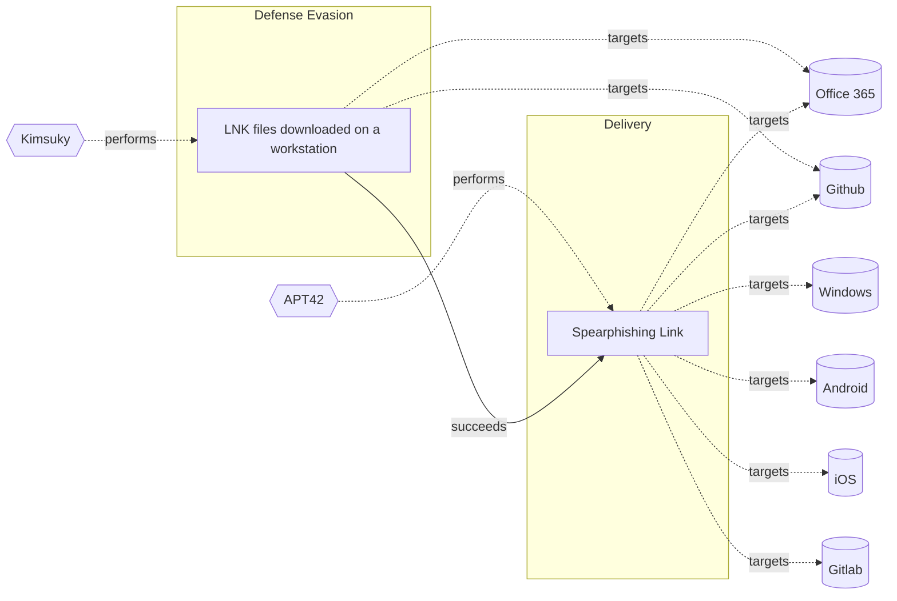

# ☣️ LNK files downloaded on a workstation

🔥 **Criticality:Medium** ❗ : A Medium priority incident may affect public health or safety, national security, economic security, foreign relations, civil liberties, or public confidence. 

🚦 **TLP:CLEAR** ⚪ : Recipients can spread this to the world, there is no limit on disclosure.

🗡️ **ATT&CK Techniques** [T1566.002 : Phishing: Spearphishing Link](https://attack.mitre.org/techniques/T1566/002 'Adversaries may send spearphishing emails with a malicious link in an attempt to gain access to victim systems Spearphishing with a link is a specific'), [T1027 : Obfuscated Files or Information](https://attack.mitre.org/techniques/T1027 'Adversaries may attempt to make an executable or file difficult to discover or analyze by encrypting, encoding, or otherwise obfuscating its contents '), [T1204 : User Execution](https://attack.mitre.org/techniques/T1204 'An adversary may rely upon specific actions by a user in order to gain execution Users may be subjected to social engineering to get them to execute m')

---

`🔑 UUID : 3088db32-843b-439f-9374-f8c04a82b2ec` **|** `🏷️ Version : 1` **|** `🗓️ Creation Date : 2025-05-23` **|** `🗓️ Last Modification : 2025-05-23` **|** `Sharing Organisation : {'uuid': '56b0a0f0-b0bc-47d9-bb46-02f80ae2065a', 'name': 'EC DIGIT CSOC'}` **|** `🧱 Schema Identifier : tvm::2.1`

## 👁️ Description

> A malicious .lnk file can be crafted to execute arbitrary code, download
> malware, or exploit vulnerabilities in the operating system. The threat
> actors can use social engineering tactics to trick users into downloading
> and opening these files, which can lead to some of the following threats
> ref [1], [2]:
> 
> - Malware infection: The .lnk file can download and install malware,
> such as viruses, Trojans, or ransomware, onto the workstation.
> - Code execution: The file can execute malicious code, potentially
> allowing attackers to gain control of the workstation or steal sensitive
> data.
> - Exploitation of vulnerabilities: Malicious .lnk files can exploit known
> vulnerabilities in the operating system or applications, leading to further
> compromise.
> 
> In one of the observed and reported threat actor cyber-espionage campaigns
> a North Korean threat actor spreads spear-phishing e-mails containing a link
> to a password-protected document which contains LNK file.  
> 
> The lure contains a e-mail with a title "Political Advisory Meeting to
> be held at the EU Delegation on May 14." This was both the e-mail subject
> and the name of a zip file sent through a Dropbox link. The mail contains
> a password-protected zip file with included .lnk file in it. Once an end-
> usr click this file, it will download a payload usually from a GitHub 
> repository. Further the payload executes and infect the host.   
> 

## 🖥️ Terrain 

 > Threat actor rely on social engineering techniques for initial access.
> For example, well customised and legitimate looking company e-mail with
> administrative document protected with passwords or titled with ongoing
> meeting or agenda.  
> 

---

## 🕸️ Relations

### 🐲 Actors sightings 

| Actor                | Description                                                                                                                                                                                                                                                                                                                                                                                                                                                                                                                                                                                                                                                                                                                                                                                                                                                                                                                                                                                                                                                                                                                                                                                                                                                                                                                                                                                                                                                                                                                                                                                                                                                                                                                                                                                                                                                                                                                                                                                                                                                | Aliases                                                                                                                                | Source                     | Sighting                                                                                                                                                                               | Reference                                                     |
|:---------------------|:-----------------------------------------------------------------------------------------------------------------------------------------------------------------------------------------------------------------------------------------------------------------------------------------------------------------------------------------------------------------------------------------------------------------------------------------------------------------------------------------------------------------------------------------------------------------------------------------------------------------------------------------------------------------------------------------------------------------------------------------------------------------------------------------------------------------------------------------------------------------------------------------------------------------------------------------------------------------------------------------------------------------------------------------------------------------------------------------------------------------------------------------------------------------------------------------------------------------------------------------------------------------------------------------------------------------------------------------------------------------------------------------------------------------------------------------------------------------------------------------------------------------------------------------------------------------------------------------------------------------------------------------------------------------------------------------------------------------------------------------------------------------------------------------------------------------------------------------------------------------------------------------------------------------------------------------------------------------------------------------------------------------------------------------------------------|:---------------------------------------------------------------------------------------------------------------------------------------|:---------------------------|:---------------------------------------------------------------------------------------------------------------------------------------------------------------------------------------|:--------------------------------------------------------------|
| [Enterprise] Kimsuky | [Kimsuky](https://attack.mitre.org/groups/G0094) is a North Korea-based cyber espionage group that has been active since at least 2012. The group initially focused on targeting South Korean government entities, think tanks, and individuals identified as experts in various fields, and expanded its operations to include the UN and the government, education, business services, and manufacturing sectors in the United States, Japan, Russia, and Europe. [Kimsuky](https://attack.mitre.org/groups/G0094) has focused its intelligence collection activities on foreign policy and national security issues related to the Korean peninsula, nuclear policy, and sanctions. [Kimsuky](https://attack.mitre.org/groups/G0094) operations have overlapped with those of other North Korean cyber espionage actors likely as a result of ad hoc collaborations or other limited resource sharing.(Citation: EST Kimsuky April 2019)(Citation: Cybereason Kimsuky November 2020)(Citation: Malwarebytes Kimsuky June 2021)(Citation: CISA AA20-301A Kimsuky)(Citation: Mandiant APT43 March 2024)(Citation: Proofpoint TA427 April 2024)[Kimsuky](https://attack.mitre.org/groups/G0094) was assessed to be responsible for the 2014 Korea Hydro & Nuclear Power Co. compromise; other notable campaigns include Operation STOLEN PENCIL (2018), Operation Kabar Cobra (2019), and Operation Smoke Screen (2019).(Citation: Netscout Stolen Pencil Dec 2018)(Citation: EST Kimsuky SmokeScreen April 2019)(Citation: AhnLab Kimsuky Kabar Cobra Feb 2019)North Korean group definitions are known to have significant overlap, and some security researchers report all North Korean state-sponsored cyber activity under the name [Lazarus Group](https://attack.mitre.org/groups/G0032) instead of tracking clusters or subgroups.In 2023, [Kimsuky](https://attack.mitre.org/groups/G0094) has used commercial large language models to assist with vulnerability research, scripting, social engineering and reconnaissance.(Citation: MSFT-AI) | APT43, Black Banshee, Emerald Sleet, Springtail, TA427, THALLIUM, Velvet Chollima                                                      | 🗡️ MITRE ATT&CK Groups     | No documented sighting                                                                                                                                                                 | No documented references                                      |
| Kimsuky              | This threat actor targets South Korean think tanks, industry, nuclear power operators, and the Ministry of Unification for espionage purposes.                                                                                                                                                                                                                                                                                                                                                                                                                                                                                                                                                                                                                                                                                                                                                                                                                                                                                                                                                                                                                                                                                                                                                                                                                                                                                                                                                                                                                                                                                                                                                                                                                                                                                                                                                                                                                                                                                                             | Velvet Chollima, Black Banshee, Thallium, Operation Stolen Pencil, G0086, APT43, Emerald Sleet, THALLIUM, Springtail, Sparkling Pisces | 🌌 MISP Threat Actor Galaxy | The analysis and the reports linked a cyberespionage North Koreanthreat actor Kimsuky (Emerald Sleet, APT43), based on the usedpatterns, activities and observed steps and procedures. | https://git.s.cec.eu.int/catch/ec-tide/-/issues/incident/4612 |

### 🌊 OpenTide Objects
🚫 No related OpenTide objects indexed.

 --- 

### ⛓️ Threat Chaining

Expand chaining data

| ☣️ Vector                                                                                                                                                                                                                                                                        | ⛓️ Link              | 🎯 Target                                                                                                                                                                                                                           | ⛰️ Terrain                                                                                                                                                                                                                                                                                                                                                                                                                                                                                                                   | 🗡️ ATT&CK                                                                                                                                                                                                                                                                                                                                                                                                                                                                                                                                                                                                                                                                                                   |
|:---------------------------------------------------------------------------------------------------------------------------------------------------------------------------------------------------------------------------------------------------------------------------------|:---------------------|:-----------------------------------------------------------------------------------------------------------------------------------------------------------------------------------------------------------------------------------|:-----------------------------------------------------------------------------------------------------------------------------------------------------------------------------------------------------------------------------------------------------------------------------------------------------------------------------------------------------------------------------------------------------------------------------------------------------------------------------------------------------------------------------|:------------------------------------------------------------------------------------------------------------------------------------------------------------------------------------------------------------------------------------------------------------------------------------------------------------------------------------------------------------------------------------------------------------------------------------------------------------------------------------------------------------------------------------------------------------------------------------------------------------------------------------------------------------------------------------------------------------|
| [LNK files downloaded on a workstation](../Threat%20Vectors/☣️%20LNK%20files%20downloaded%20on%20a%20workstation.md 'A malicious lnk file can be crafted to execute arbitrary code, downloadmalware, or exploit vulnerabilities in the operating system The threatactors ca...') | `sequence::succeeds` | [Spearphishing Link](../Threat%20Vectors/☣️%20Spearphishing%20Link.md 'Adversaries may send spearphishing emails with a malicious link in anattempt to gain access to victim systems This sub-technique employsthe use of lin...') | Spear phishing requires more preparation and time to achieve success than a phishing attack. That is because spear-phishing attackers attempt to obtain vast amounts of personal information about their victims,   the entities their work for, or their areas of interest.    Attackers can get the personal information they need using different ways: to compromise an email or messaging system trough other means, to use OSINT, scouring Social Media or glean personal information from the user's online presence. | [T1566.002 : Phishing: Spearphishing Link](https://attack.mitre.org/techniques/T1566/002 'Adversaries may send spearphishing emails with a malicious link in an attempt to gain access to victim systems Spearphishing with a link is a specific'), [T1036 : Masquerading](https://attack.mitre.org/techniques/T1036 'Adversaries may attempt to manipulate features of their artifacts to make them appear legitimate or benign to users andor security tools Masquerading '), [T1656 : Impersonation](https://attack.mitre.org/techniques/T1656 'Adversaries may impersonate a trusted person or organization in order to persuade and trick a target into performing some action on their behalf For e') |

&nbsp; 

---

## Model Data

#### **⛓️ Cyber Kill Chain**

 > Cyber attacks are typically phased progressions towards strategic objectives. The Unified Kill Chains provides insight into the tactics that hackers employ to attain these objectives. This provides a solid basis to develop (or realign) defensive strategies to raise cyber resilience.

 [`🏃🏽 Defense Evasion`](https://www.unifiedkillchain.com/assets/The-Unified-Kill-Chain.pdf) : Techniques an attacker may specifically use for evading detection or avoiding other defenses.

---

#### **🛰️ Domains**

 > Infrastructure technologies domain of interest to attackers.

 `🏢 Enterprise` : Generic databases, applications, machines and systems that are usually on premises or on Cloud traditional VMs.

---

#### **🎯 Targets**

 > Granular delimited technical entities holding a value to the organization, that are targeted by adversaries. They might be also involved in the detection coverage as the target of log collection. Partially inspired by Veris.

  - [`👤 Customer`](http://veriscommunity.net/enums.html#section-asset) : People - Customer
 - [`👤 End-user`](http://veriscommunity.net/enums.html#section-asset) : People - End-user
 - [`🖥️ Workstations`](http://veriscommunity.net/enums.html#section-asset) : Placeholder

---

#### **💿 Platforms concerned**

 > Actual technologies used by the organization that will be exploited by adversaries during a successful attack, and eventually of relevance for detection. Are named by commercial designation.

  - ` Office 365` : Placeholder
 - [` Github`](https://docs.github.com/en) : GitHub, Inc. is a provider of Internet hosting for software development and version control using Git. It offers the distributed version control and source code management functionality of Git, plus its own features.

---

#### **💣 Severity**

 > The severity summarizes the overall danger of incident the vector will provoke, and is to be derived (WIP) from impact, leverage, and difficulty to execute.

 [`🧨 Moderate incident`](https://www.ncsc.gov.uk/news/new-cyber-attack-categorisation-system-improve-uk-response-incidents) : A cyber attack on a small organisation, or which poses a considerable risk to a medium-sized organisation, or preliminary indications of cyber activity against a large organisation or the government.

---

#### **🪄 Leverage acquisition**

 > Technical aftermath of the attack from the target perspective, differentiated from impact as it does not consider the value of the consequence, only what increased control the vector execution provides to the adversary.

  - [`💀 Infrastructure Compromise`](https://owasp.org/www-community/Threat_Modeling_Process#stride) : The compromised target is likely to be used to further expand the sphere of influence of the attacker and allow more potent vectors to be executed.
 - [`🐒 Tampering`](https://owasp.org/www-community/Threat_Modeling_Process#stride) : Threat action intending to maliciously change or modify persistent data, such as records in a database, and the alteration of data in transit between two computers over an open network, such as the Internet.

---

#### **💥 Impact**

 > Analysis of the threat vector from the organizational perspective, in non technical term. This aims at putting a clear denomination on what the attacker will actually be able to act upon if the threat vector is realized.

  - [`🛑 Business disruption`](http://veriscommunity.net/enums.html#section-impact) : Business disruption
 - [`🤬 Lose Capabilities`](http://veriscommunity.net/enums.html#section-impact) : Vector execution will remove key functions to the organization, which will not be easily circumvented. Most day-to-day is heavily impaired, but processes can reorganize at a loss.
 - [`🔓 Data Breach`](http://veriscommunity.net/enums.html#section-impact) : Non-public information has been accessed from the outside, and successfully extracted.
 - [`🥸 Identity Theft`](http://veriscommunity.net/enums.html#section-impact) : Acquisition of sufficient information and privileges to profess as a given individual, for the purpose of abusing and deceiving human trust relationships.
 - [`🩼 Impairement`](http://veriscommunity.net/enums.html#section-impact) : Incapacitation of a particular key system that will cause disruptions in day-to-day operations, and eventually service delivery.

---

#### **🎲 Vector Viability**

 > Described with estimative language (likelyhood probability), describes how likely the analyst believes the vector to actually be realized on the organization infrastructure. Estimative language describes quality and credibility of underlying sources, data, and methodologies based Intelligence Community Directive 203 (ICD 203) and JP 2-0, Joint Intelligence.

 [`🧐 Likely`](https://www.dni.gov/files/documents/ICD/ICD%20203%20Analytic%20Standards.pdf) : Probable (probably) - 55-80%

---

### 🔗 References

**🕊️ Publicly available resources**

- [_1_] https://socradar.io/windows-shortcut-zero-day-zdi-can-25373-exploited
- [_2_] https://www.csoonline.com/article/3850346/new-windows-zero-day-feared-abused-in-widespread-espionage-for-years.html
- [_3_] https://windowsforum.com/threads/hidden-windows-vulnerability-the-lnk-shortcut-threat-explained.357280/

[1]: https://socradar.io/windows-shortcut-zero-day-zdi-can-25373-exploited
[2]: https://www.csoonline.com/article/3850346/new-windows-zero-day-feared-abused-in-widespread-espionage-for-years.html
[3]: https://windowsforum.com/threads/hidden-windows-vulnerability-the-lnk-shortcut-threat-explained.357280/

---

#### 🏷️ Tags

#-, #-, #-, #
, #
, ##, ##, ##, ##, # , #🏷, #️, # , #T, #a, #g, #s, #
, #

