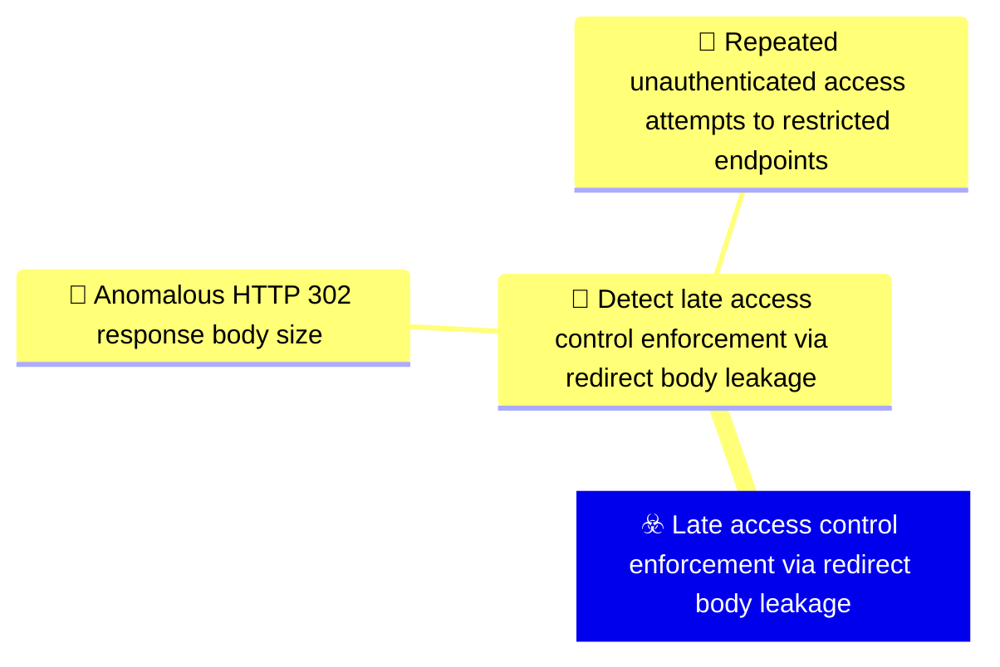
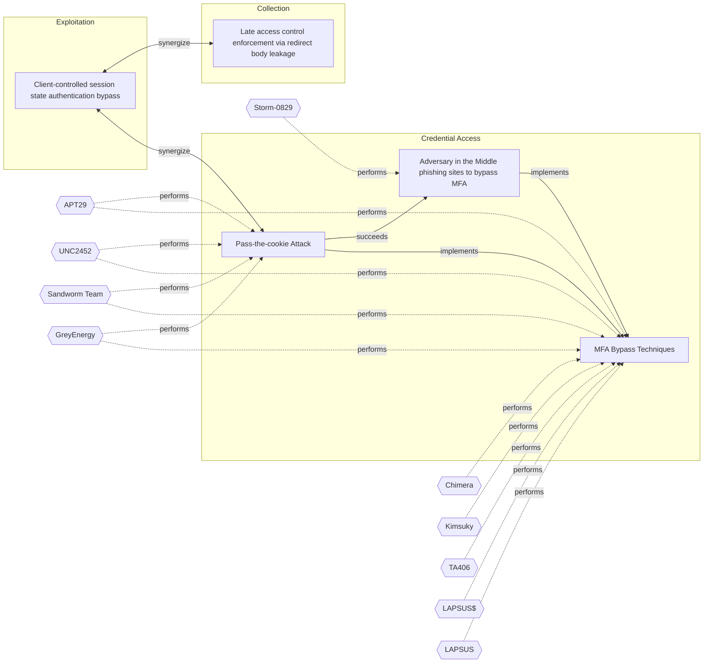

# ☣️ Late access control enforcement via redirect body leakage

🔥 **Criticality:High** ⚠️ : A High priority incident is likely to result in a demonstrable impact to public health or safety, national security, economic security, foreign relations, civil liberties, or public confidence. 

🚦 **TLP:CLEAR** ⚪ : Recipients can spread this to the world, there is no limit on disclosure.

🗡️ **ATT&CK Techniques** [T1190 : Exploit Public-Facing Application](https://attack.mitre.org/techniques/T1190 'Adversaries may attempt to exploit a weakness in an Internet-facing host or system to initially access a network The weakness in the system can be a s')

---

`🔑 UUID : 0663c192-cdeb-49a2-994c-4cc8e98f764e` **|** `🏷️ Version : 1` **|** `🗓️ Creation Date : 2026-03-30` **|** `🗓️ Last Modification : 2026-03-30` **|** `Sharing Organisation : {'uuid': '56b0a0f0-b0bc-47d9-bb46-02f80ae2065a', 'name': 'EC DIGIT CSOC'}` **|** `🧱 Schema Identifier : tvm::2.1`

## 👁️ Description

> An adversary exploits a broken access control pattern in a web application
> where the server constructs and includes the full rendered page content in
> the HTTP response body before enforcing authentication or authorisation
> checks. When the access control check fails, the server issues an HTTP 302
> Found redirect response with a Location header pointing to a login or error
> page — however, the response body still contains the complete protected page
> content.
> 
> Standard web browsers automatically follow the redirect and do not display
> the body content to the user, masking the data leakage. However, an attacker
> using HTTP clients that do not follow redirects (e.g. curl, Burp Suite, or
> custom scripts) can intercept and read the full protected content from the
> redirect response body.
> 
> This vulnerability affects authenticated and role-restricted web pages in a
> pattern-based manner, meaning it is not isolated to a single endpoint but
> rather stems from a systemic flaw in the application's access control
> enforcement architecture. The root cause is a late enforcement model where
> the application constructs the complete response — including sensitive data —
> before determining whether the requesting user is authorised to view it.
> 
> Exploitation is trivial once the pattern is discovered: the adversary simply
> sends HTTP requests to protected endpoints and inspects the response bodies
> of 302 redirect responses. No authentication tokens, session cookies, or
> special headers are required. The attack can be automated to enumerate and
> exfiltrate content from all affected endpoints systematically.
> 
> This aligns with OWASP Top 10 A01:2021 Broken Access Control and CWE-284
> Improper Access Control. The vulnerability represents a fundamental flaw in
> the application's security architecture rather than a simple misconfiguration.
> 

## 🖥️ Terrain 

 > A web application that performs access control checks late in the request
> processing pipeline, after the response body has already been constructed.
> The application must use HTTP redirects (typically 302 Found) for access
> control enforcement rather than blocking the request outright or returning
> a minimal error response. The response body includes the full rendered
> protected page content alongside the redirect Location header. This pattern
> typically arises in framework-level middleware or filter configurations where
> page rendering occurs before authentication and authorisation gates are
> evaluated. The vulnerability is systemic rather than endpoint-specific,
> affecting multiple authenticated or role-restricted routes that share the
> same flawed request processing pipeline.
> 

---

## 🕸️ Relations

### 🌊 OpenTide Objects

 **Descendants** 

| 🎯 Detection Objectives                                                                                                                                                                                                                                                                                                                            | 📡 Detection Objective Signals (2)                                                                                                                                                                                                                                                                                                                                                                                                                                                                                                                                                                                                                                                                                                                                                                                                                          | 🛡️ Detection Models    | 🚨 Detection Rules    |
|:--------------------------------------------------------------------------------------------------------------------------------------------------------------------------------------------------------------------------------------------------------------------------------------------------------------------------------------------------|:-----------------------------------------------------------------------------------------------------------------------------------------------------------------------------------------------------------------------------------------------------------------------------------------------------------------------------------------------------------------------------------------------------------------------------------------------------------------------------------------------------------------------------------------------------------------------------------------------------------------------------------------------------------------------------------------------------------------------------------------------------------------------------------------------------------------------------------------------------------|:-----------------------|:---------------------|
| [Detect late access control enforcement via redirect body leakage](../Detection%20Objectives/🎯%20Detect%20late%20access%20control%20enforcement%20via%20redirect%20body%20leakage.md 'Detect exploitation of a broken access control pattern where web applicationHTTP 302 redirect responses contain the full rendered protected page conte...') | [Detect late access control enforcement via redirect body leakage::Repeated unauthenticated access attempts to restricted endpoints](Detect%20late%20access%20control%20enforcement%20via%20redirect%20body%20leakage#repeated-unauthenticated-access-attempts-to-restricted-endpoints.md 'Detect patterns where a client identified by IP address or sessionrepeatedly sends requests to authenticated or role-restricted endpointsand consisten...') [Detect late access control enforcement via redirect body leakage::Anomalous HTTP 302 response body size](Detect%20late%20access%20control%20enforcement%20via%20redirect%20body%20leakage#anomalous-http-302-response-body-size.md 'Detect HTTP 302 redirect responses that contain unexpectedly largeresponse bodies Legitimate 302 redirects typically have minimal or nobody content us...') | ❌ No Detection Models  | ❌ No Detection Rules |

 --- 

### ⛓️ Threat Chaining

Expand chaining data

| ☣️ Vector                                                                                                                                                                                                                                                                                                            | ⛓️ Link                 | 🎯 Target                                                                                                                                                                                                                                                                                                                     | ⛰️ Terrain                                                                                                                                                                                                                                                                                                                                                                                                                                                                                                                                                                                                                                                                                                                                                                                                   | 🗡️ ATT&CK                                                                                                                                                                                                                                                                                                                                                                                                                                                                                                                                                                                                                                                                                                                                                                                                                                                                                                                                                                                                                                                                               |
|:---------------------------------------------------------------------------------------------------------------------------------------------------------------------------------------------------------------------------------------------------------------------------------------------------------------------|:------------------------|:-----------------------------------------------------------------------------------------------------------------------------------------------------------------------------------------------------------------------------------------------------------------------------------------------------------------------------|:-------------------------------------------------------------------------------------------------------------------------------------------------------------------------------------------------------------------------------------------------------------------------------------------------------------------------------------------------------------------------------------------------------------------------------------------------------------------------------------------------------------------------------------------------------------------------------------------------------------------------------------------------------------------------------------------------------------------------------------------------------------------------------------------------------------|:----------------------------------------------------------------------------------------------------------------------------------------------------------------------------------------------------------------------------------------------------------------------------------------------------------------------------------------------------------------------------------------------------------------------------------------------------------------------------------------------------------------------------------------------------------------------------------------------------------------------------------------------------------------------------------------------------------------------------------------------------------------------------------------------------------------------------------------------------------------------------------------------------------------------------------------------------------------------------------------------------------------------------------------------------------------------------------------|
| [Client-controlled session state authentication bypass](../Threat%20Vectors/☣️%20Client-controlled%20session%20state%20authentication%20bypass.md 'An adversary bypasses authentication or authorisation by injecting or modifying client-controlledsession state in HTTP requests The application treats...')       | `support::synergize`    | [Late access control enforcement via redirect body leakage](../Threat%20Vectors/☣️%20Late%20access%20control%20enforcement%20via%20redirect%20body%20leakage.md 'An adversary exploits a broken access control pattern in a web applicationwhere the server constructs and includes the full rendered page content inth...') | A web application that performs access control checks late in the request processing pipeline, after the response body has already been constructed. The application must use HTTP redirects (typically 302 Found) for access control enforcement rather than blocking the request outright or returning a minimal error response. The response body includes the full rendered protected page content alongside the redirect Location header. This pattern typically arises in framework-level middleware or filter configurations where page rendering occurs before authentication and authorisation gates are evaluated. The vulnerability is systemic rather than endpoint-specific, affecting multiple authenticated or role-restricted routes that share the same flawed request processing pipeline. | [T1190 : Exploit Public-Facing Application](https://attack.mitre.org/techniques/T1190 'Adversaries may attempt to exploit a weakness in an Internet-facing host or system to initially access a network The weakness in the system can be a s')                                                                                                                                                                                                                                                                                                                                                                                                                                                                                                                                                                                                                                                                                                                                                                                                                                         |
| [Client-controlled session state authentication bypass](../Threat%20Vectors/☣️%20Client-controlled%20session%20state%20authentication%20bypass.md 'An adversary bypasses authentication or authorisation by injecting or modifying client-controlledsession state in HTTP requests The application treats...')       | `support::synergize`    | [Pass-the-cookie Attack](../Threat%20Vectors/☣️%20Pass-the-cookie%20Attack.md 'Pass-The-Cookie PTC, also known as token compromise, is a common attack techniqueemployed by threat actors in SaaS environments A PTC is a type of att...')                                                                                   | Attacker must compromise a user endpoint and exfiltrate the browser cookies. Cookies can be found on disk, in the process memory of the browser, and in network traffic to remote systems.  Additionally, other applications on the user endpoint machine might store sensitive authentication cookies in memory (e.g. apps which authenticate to cloud services).                                                                                                                                                                                                                                                                                                                                                                                                                                           | [T1111 : Multi-Factor Authentication Interception](https://attack.mitre.org/techniques/T1111 'Adversaries may target multi-factor authentication MFA mechanisms, ie, smart cards, token generators, etc to gain access to credentials that can be us')                                                                                                                                                                                                                                                                                                                                                                                                                                                                                                                                                                                                                                                                                                                                                                                                                                  |
| [Pass-the-cookie Attack](../Threat%20Vectors/☣️%20Pass-the-cookie%20Attack.md 'Pass-The-Cookie PTC, also known as token compromise, is a common attack techniqueemployed by threat actors in SaaS environments A PTC is a type of att...')                                                                           | `sequence::succeeds`    | [Adversary in the Middle phishing sites to bypass MFA](../Threat%20Vectors/☣️%20Adversary%20in%20the%20Middle%20phishing%20sites%20to%20bypass%20MFA.md 'Threat actors use malicious attachments to send the users to redirection site, which hosts a fake MFA login pageThe MitM page completes the authentica...')         | An adversary needs to target companies and contacts  to distribute the malware, it's used a massive distrigution  technique on a random principle.                                                                                                                                                                                                                                                                                                                                                                                                                                                                                                                                                                                                                                                           | [T1566.002](https://attack.mitre.org/techniques/T1566/002 'Adversaries may send spearphishing emails with a malicious link in an attempt to gain access to victim systems Spearphishing with a link is a specific'), [T1557](https://attack.mitre.org/techniques/T1557 'Adversaries may attempt to position themselves between two or more networked devices using an adversary-in-the-middle AiTM technique to support follow'), [T1539](https://attack.mitre.org/techniques/T1539 'An adversary may steal web application or service session cookies and use them to gain access to web applications or Internet services as an authentic'), [T1556](https://attack.mitre.org/techniques/T1556 'Adversaries may modify authentication mechanisms and processes to access user credentials or enable otherwise unwarranted access to accounts The authe'), [T1078.004](https://attack.mitre.org/techniques/T1078/004 'Valid accounts in cloud environments may allow adversaries to perform actions to achieve Initial Access, Persistence, Privilege Escalation, or Defense')         |
| [Pass-the-cookie Attack](../Threat%20Vectors/☣️%20Pass-the-cookie%20Attack.md 'Pass-The-Cookie PTC, also known as token compromise, is a common attack techniqueemployed by threat actors in SaaS environments A PTC is a type of att...')                                                                           | `atomicity::implements` | [MFA Bypass Techniques](../Threat%20Vectors/☣️%20MFA%20Bypass%20Techniques.md 'MFA is a technique that requires more than one piece of evidence to authorize the user to access a resource If two pieces of evidence are needed to ve...')                                                                                   | Sufficient reconnaissance to identify a target account and MFA technologies being used.                                                                                                                                                                                                                                                                                                                                                                                                                                                                                                                                                                                                                                                                                                                      | [T1111](https://attack.mitre.org/techniques/T1111 'Adversaries may target multi-factor authentication MFA mechanisms, ie, smart cards, token generators, etc to gain access to credentials that can be us'), [T1621](https://attack.mitre.org/techniques/T1621 'Adversaries may attempt to bypass multi-factor authentication MFA mechanisms and gain access to accounts by generating MFA requests sent to usersAdver'), [T1566.001](https://attack.mitre.org/techniques/T1566/001 'Adversaries may send spearphishing emails with a malicious attachment in an attempt to gain access to victim systems Spearphishing attachment is a spe'), [T1566.002](https://attack.mitre.org/techniques/T1566/002 'Adversaries may send spearphishing emails with a malicious link in an attempt to gain access to victim systems Spearphishing with a link is a specific'), [T1566.004](https://attack.mitre.org/techniques/T1566/004 'Adversaries may use voice communications to ultimately gain access to victim systems Spearphishing voice is a specific variant of spearphishing It is ') |
| [Adversary in the Middle phishing sites to bypass MFA](../Threat%20Vectors/☣️%20Adversary%20in%20the%20Middle%20phishing%20sites%20to%20bypass%20MFA.md 'Threat actors use malicious attachments to send the users to redirection site, which hosts a fake MFA login pageThe MitM page completes the authentica...') | `atomicity::implements` | [MFA Bypass Techniques](../Threat%20Vectors/☣️%20MFA%20Bypass%20Techniques.md 'MFA is a technique that requires more than one piece of evidence to authorize the user to access a resource If two pieces of evidence are needed to ve...')                                                                                   | Sufficient reconnaissance to identify a target account and MFA technologies being used.                                                                                                                                                                                                                                                                                                                                                                                                                                                                                                                                                                                                                                                                                                                      | [T1111](https://attack.mitre.org/techniques/T1111 'Adversaries may target multi-factor authentication MFA mechanisms, ie, smart cards, token generators, etc to gain access to credentials that can be us'), [T1621](https://attack.mitre.org/techniques/T1621 'Adversaries may attempt to bypass multi-factor authentication MFA mechanisms and gain access to accounts by generating MFA requests sent to usersAdver'), [T1566.001](https://attack.mitre.org/techniques/T1566/001 'Adversaries may send spearphishing emails with a malicious attachment in an attempt to gain access to victim systems Spearphishing attachment is a spe'), [T1566.002](https://attack.mitre.org/techniques/T1566/002 'Adversaries may send spearphishing emails with a malicious link in an attempt to gain access to victim systems Spearphishing with a link is a specific'), [T1566.004](https://attack.mitre.org/techniques/T1566/004 'Adversaries may use voice communications to ultimately gain access to victim systems Spearphishing voice is a specific variant of spearphishing It is ') |

&nbsp; 

---

## Model Data

#### **⛓️ Cyber Kill Chain**

 > Cyber attacks are typically phased progressions towards strategic objectives. The Unified Kill Chains provides insight into the tactics that hackers employ to attain these objectives. This provides a solid basis to develop (or realign) defensive strategies to raise cyber resilience.

 [`🗃️ Collection`](https://www.unifiedkillchain.com/assets/The-Unified-Kill-Chain.pdf) : Techniques used to identify and gather data from a target network prior to exfiltration.

---

#### **💣 Severity**

 > The severity summarizes the overall danger of incident the vector will provoke, and is to be derived (WIP) from impact, leverage, and difficulty to execute.

 [`🔥 Substantial incident`](https://www.ncsc.gov.uk/news/new-cyber-attack-categorisation-system-improve-uk-response-incidents) : A cyber attack which has a serious impact on a medium-sized organisation, or which poses a considerable risk to a large organisation or wider / local government.

---

#### **🪄 Leverage acquisition**

 > Technical aftermath of the attack from the target perspective, differentiated from impact as it does not consider the value of the consequence, only what increased control the vector execution provides to the adversary.

 [`👁️‍🗨️ Information Disclosure`](https://owasp.org/www-community/Threat_Modeling_Process#stride) : Threat action intending to read a file that one was not granted access to, or to read data in transit.

---

#### **💥 Impact**

 > Analysis of the threat vector from the organizational perspective, in non technical term. This aims at putting a clear denomination on what the attacker will actually be able to act upon if the threat vector is realized.

  - [`🔓 Data Breach`](http://veriscommunity.net/enums.html#section-impact) : Non-public information has been accessed from the outside, and successfully extracted.
 - [`🧠 IP Loss`](http://veriscommunity.net/enums.html#section-impact) : Particular, key data, information and blueprint conducive to the organization capability to gain and retain a commercial or geopolitical advantage has been accessed, and their content potentially used by competitors or other adversaries.

---

#### **🎲 Vector Viability**

 > Described with estimative language (likelyhood probability), describes how likely the analyst believes the vector to actually be realized on the organization infrastructure. Estimative language describes quality and credibility of underlying sources, data, and methodologies based Intelligence Community Directive 203 (ICD 203) and JP 2-0, Joint Intelligence.

 [`🧐 Likely`](https://www.dni.gov/files/documents/ICD/ICD%20203%20Analytic%20Standards.pdf) : Probable (probably) - 55-80%

---

### 🔗 References

**🕊️ Publicly available resources**

- [_1_] https://owasp.org/Top10/A01_2021-Broken_Access_Control/
- [_2_] https://cwe.mitre.org/data/definitions/284.html
- [_3_] https://portswigger.net/web-security/access-control

[1]: https://owasp.org/Top10/A01_2021-Broken_Access_Control/
[2]: https://cwe.mitre.org/data/definitions/284.html
[3]: https://portswigger.net/web-security/access-control

---

#### 🏷️ Tags

#-, #-, #-, #
, #
, ##, ##, ##, ##, # , #🏷, #️, # , #T, #a, #g, #s, #
, #

