# ☣️ Lateral movement using Impacket framework

🔥 **Criticality:High** ⚠️ : A High priority incident is likely to result in a demonstrable impact to public health or safety, national security, economic security, foreign relations, civil liberties, or public confidence. 

🚦 **TLP:CLEAR** ⚪ : Recipients can spread this to the world, there is no limit on disclosure.

🗡️ **ATT&CK Techniques** [T1021 : Remote Services](https://attack.mitre.org/techniques/T1021 'Adversaries may use Valid AccountshttpsattackmitreorgtechniquesT1078 to log into a service that accepts remote connections, such as telnet, SSH, and V'), [T1059.001 : Command and Scripting Interpreter: PowerShell](https://attack.mitre.org/techniques/T1059/001 'Adversaries may abuse PowerShell commands and scripts for execution PowerShell is a powerful interactive command-line interface and scripting environm'), [T1552.002 : Unsecured Credentials: Credentials in Registry](https://attack.mitre.org/techniques/T1552/002 'Adversaries may search the Registry on compromised systems for insecurely stored credentials The Windows Registry stores configuration information tha')

---

`🔑 UUID : 75415bc5-6615-487e-a69c-7a4ffc196996` **|** `🏷️ Version : 1` **|** `🗓️ Creation Date : 2024-09-17` **|** `🗓️ Last Modification : 2024-09-18` **|** `Sharing Organisation : {'uuid': '56b0a0f0-b0bc-47d9-bb46-02f80ae2065a', 'name': 'EC DIGIT CSOC'}` **|** `🧱 Schema Identifier : tvm::2.0`

## 👁️ Description

> Threat actors conduct lateral movement with valid network credentials
> obtained from credential harvesting. To conduct lateral movement more
> efficiently, they typically use modules from the publicly available
> Impacket framework ref [1].    
> 
> Some of the activities during the lateral movement might be:
> 
> - Enumerate the volume of a device (example: PS get-volume), 
>   access volumes via network shares like \\127.0.0.1\ADMINS$\__  
> - Copying critical registry hives that contain password hashes
>   and computer information.  
> - Downloading files directly from actor-owned infrastructure
>   (example: cmdlet: DownloadFile)  
> - Extract both system and security event logs into operational
>   directory (example: Win32_NTEventlogFile cmdlet) 
> 
> Variety of reports and analysis show that the threat actor commonly
> deletes files used during operational phases seen in lateral movement.
> 
> In some cases the threat actors may try to manipulate the Group Policies
> to hide their traces. For example, the registries which are related to
> the access of the System Registries. They may also try to turn off `Audit
> object access` for successful and failed access events. ref [2, 3]  
> 

## 🖥️ Terrain 

 > A threat actor needs initial access to move laterally through the network.  
> 

---

## 🕸️ Relations

### 🐲 Actors sightings 

| Actor                   | Description                                                                                                                                                                                                                                                                                                                                                                                                                                                                                                                                                                                                                                                                                                                                                                                                                                                                                                                                                                                                                                                                                                                                                                                                                                                                                                                                                           | Aliases                                                                 | Source                     | Sighting               | Reference                |
|:------------------------|:----------------------------------------------------------------------------------------------------------------------------------------------------------------------------------------------------------------------------------------------------------------------------------------------------------------------------------------------------------------------------------------------------------------------------------------------------------------------------------------------------------------------------------------------------------------------------------------------------------------------------------------------------------------------------------------------------------------------------------------------------------------------------------------------------------------------------------------------------------------------------------------------------------------------------------------------------------------------------------------------------------------------------------------------------------------------------------------------------------------------------------------------------------------------------------------------------------------------------------------------------------------------------------------------------------------------------------------------------------------------|:------------------------------------------------------------------------|:---------------------------|:-----------------------|:-------------------------|
| [Enterprise] Ember Bear | [Ember Bear](https://attack.mitre.org/groups/G1003) is a Russian state-sponsored cyber espionage group that has been active since at least 2020, linked to Russia's General Staff Main Intelligence Directorate (GRU) 161st Specialist Training Center (Unit 29155).(Citation: CISA GRU29155 2024) [Ember Bear](https://attack.mitre.org/groups/G1003) has primarily focused operations against Ukrainian government and telecommunication entities, but has also operated against critical infrastructure entities in Europe and the Americas.(Citation: Cadet Blizzard emerges as novel threat actor) [Ember Bear](https://attack.mitre.org/groups/G1003) conducted the [WhisperGate](https://attack.mitre.org/software/S0689) destructive wiper attacks against Ukraine in early 2022.(Citation: CrowdStrike Ember Bear Profile March 2022)(Citation: Mandiant UNC2589 March 2022)(Citation: CISA GRU29155 2024) There is some confusion as to whether [Ember Bear](https://attack.mitre.org/groups/G1003) overlaps with another Russian-linked entity referred to as [Saint Bear](https://attack.mitre.org/groups/G1031). At present available evidence strongly suggests these are distinct activities with different behavioral profiles.(Citation: Cadet Blizzard emerges as novel threat actor)(Citation: Palo Alto Unit 42 OutSteel SaintBot February 2022 ) | Bleeding Bear, Cadet Blizzard, DEV-0586, Frozenvista, UAC-0056, UNC2589 | 🗡️ MITRE ATT&CK Groups     | No documented sighting | No documented references |
| DEV-0586                | MSTIC has not found any notable associations between this observed activity, tracked as DEV-0586, and other known activity groups. MSTIC assesses that the malware (WhisperGate), which is designed to look like ransomware but lacking a ransom recovery mechanism, is intended to be destructive and designed to render targeted devices inoperable rather than to obtain a ransom.                                                                                                                                                                                                                                                                                                                                                                                                                                                                                                                                                                                                                                                                                                                                                                                                                                                                                                                                                                                 | Ruinous Ursa, Cadet Blizzard                                            | 🌌 MISP Threat Actor Galaxy | No documented sighting | No documented references |

### 🌊 OpenTide Objects
🚫 No related OpenTide objects indexed.

 --- 

### ⛓️ Threat Chaining

```mermaid

flowchart LR

02810748-52b5-4d3a-a788-29a948538cd2[Admin SMB shares privilege escalation exploit]
75415bc5-6615-487e-a69c-7a4ffc196996[Lateral movement using Impacket framework]
f33a693b-04cd-476e-9067-9deab561e55a[Move laterally with SMB by abusing WMI]
3b1026c6-7d04-4b91-ba6f-abc68e993616[Abusing Lolbins to Enumerate Local and Domain Accounts and Groups]

subgraph Privilege Escalation
02810748-52b5-4d3a-a788-29a948538cd2
end
subgraph Credential Access
75415bc5-6615-487e-a69c-7a4ffc196996
end
subgraph Lateral Movement
f33a693b-04cd-476e-9067-9deab561e55a
end
subgraph Discovery
3b1026c6-7d04-4b91-ba6f-abc68e993616
end

CVE-2025-33073>CVE-2025-33073]
Windows[(Windows)]
AWSEC2[(AWS EC2)]
AWSECS[(AWS ECS)]
AWSEKS[(AWS EKS)]
Linux[(Linux)]
macOS[(macOS)]
APT39{{APT39}}
EmberBear{{Ember Bear}}
DEV-0586{{DEV-0586}}
APT32{{APT32}}
APT29{{APT29}}
UNC2452{{UNC2452}}
BlueMockingbird{{Blue Mockingbird}}
Chimera{{Chimera}}
CobaltGroup{{Cobalt Group}}
Cobalt{{Cobalt}}
FIN6{{FIN6}}
FIN7{{FIN7}}
GALLIUM{{GALLIUM}}
GamaredonGroup{{Gamaredon Group}}
APT38{{APT38}}
LazarusGroup{{Lazarus Group}}
Leviathan{{Leviathan}}
APT40{{APT40}}
MagicHound{{Magic Hound}}
TA453{{TA453}}
menuPass{{menuPass}}
APT10{{APT10}}
MuddyWater{{MuddyWater}}
MustangPanda{{Mustang Panda}}
RedDelta{{RedDelta}}
APT30{{APT30}}
OilRig{{OilRig}}
SandwormTeam{{Sandworm Team}}
GreyEnergy{{GreyEnergy}}
WizardSpider{{Wizard Spider}}
UNC1878{{UNC1878}}
APT1{{APT1}}
Ke3chang{{Ke3chang}}
APT15{{APT15}}

02810748-52b5-4d3a-a788-29a948538cd2 -.->|exploits| CVE-2025-33073
02810748-52b5-4d3a-a788-29a948538cd2 -.->|targets| Windows
75415bc5-6615-487e-a69c-7a4ffc196996 -.->|targets| Windows
f33a693b-04cd-476e-9067-9deab561e55a -.->|targets| Windows
3b1026c6-7d04-4b91-ba6f-abc68e993616 -.->|targets| AWSEC2
3b1026c6-7d04-4b91-ba6f-abc68e993616 -.->|targets| AWSECS
3b1026c6-7d04-4b91-ba6f-abc68e993616 -.->|targets| AWSEKS
3b1026c6-7d04-4b91-ba6f-abc68e993616 -.->|targets| Linux
3b1026c6-7d04-4b91-ba6f-abc68e993616 -.->|targets| macOS
3b1026c6-7d04-4b91-ba6f-abc68e993616 -.->|targets| Windows
APT39 -.-> |performs| 02810748-52b5-4d3a-a788-29a948538cd2
EmberBear -.-> |performs| 75415bc5-6615-487e-a69c-7a4ffc196996
DEV-0586 -.-> |performs| 75415bc5-6615-487e-a69c-7a4ffc196996
APT32 -.-> |performs| f33a693b-04cd-476e-9067-9deab561e55a
APT29 -.-> |performs| f33a693b-04cd-476e-9067-9deab561e55a
UNC2452 -.-> |performs| f33a693b-04cd-476e-9067-9deab561e55a
BlueMockingbird -.-> |performs| f33a693b-04cd-476e-9067-9deab561e55a
Chimera -.-> |performs| f33a693b-04cd-476e-9067-9deab561e55a
CobaltGroup -.-> |performs| f33a693b-04cd-476e-9067-9deab561e55a
Cobalt -.-> |performs| f33a693b-04cd-476e-9067-9deab561e55a
FIN6 -.-> |performs| f33a693b-04cd-476e-9067-9deab561e55a
FIN7 -.-> |performs| f33a693b-04cd-476e-9067-9deab561e55a
GALLIUM -.-> |performs| f33a693b-04cd-476e-9067-9deab561e55a
GamaredonGroup -.-> |performs| f33a693b-04cd-476e-9067-9deab561e55a
APT38 -.-> |performs| f33a693b-04cd-476e-9067-9deab561e55a
LazarusGroup -.-> |performs| f33a693b-04cd-476e-9067-9deab561e55a
Leviathan -.-> |performs| f33a693b-04cd-476e-9067-9deab561e55a
APT40 -.-> |performs| f33a693b-04cd-476e-9067-9deab561e55a
MagicHound -.-> |performs| f33a693b-04cd-476e-9067-9deab561e55a
TA453 -.-> |performs| f33a693b-04cd-476e-9067-9deab561e55a
menuPass -.-> |performs| f33a693b-04cd-476e-9067-9deab561e55a
APT10 -.-> |performs| f33a693b-04cd-476e-9067-9deab561e55a
MuddyWater -.-> |performs| f33a693b-04cd-476e-9067-9deab561e55a
MustangPanda -.-> |performs| f33a693b-04cd-476e-9067-9deab561e55a
RedDelta -.-> |performs| f33a693b-04cd-476e-9067-9deab561e55a
APT30 -.-> |performs| f33a693b-04cd-476e-9067-9deab561e55a
OilRig -.-> |performs| f33a693b-04cd-476e-9067-9deab561e55a
SandwormTeam -.-> |performs| f33a693b-04cd-476e-9067-9deab561e55a
GreyEnergy -.-> |performs| f33a693b-04cd-476e-9067-9deab561e55a
WizardSpider -.-> |performs| f33a693b-04cd-476e-9067-9deab561e55a
UNC1878 -.-> |performs| f33a693b-04cd-476e-9067-9deab561e55a
APT29 -.-> |performs| 3b1026c6-7d04-4b91-ba6f-abc68e993616
UNC2452 -.-> |performs| 3b1026c6-7d04-4b91-ba6f-abc68e993616
APT1 -.-> |performs| 3b1026c6-7d04-4b91-ba6f-abc68e993616
Chimera -.-> |performs| 3b1026c6-7d04-4b91-ba6f-abc68e993616
APT32 -.-> |performs| 3b1026c6-7d04-4b91-ba6f-abc68e993616
Ke3chang -.-> |performs| 3b1026c6-7d04-4b91-ba6f-abc68e993616
APT15 -.-> |performs| 3b1026c6-7d04-4b91-ba6f-abc68e993616

02810748-52b5-4d3a-a788-29a948538cd2 -->|implements| 75415bc5-6615-487e-a69c-7a4ffc196996
02810748-52b5-4d3a-a788-29a948538cd2 -->|succeeds| f33a693b-04cd-476e-9067-9deab561e55a
75415bc5-6615-487e-a69c-7a4ffc196996 -->|succeeds| 3b1026c6-7d04-4b91-ba6f-abc68e993616

```

Expand chaining data

| ☣️ Vector                                                                                                                                                                                                                                                                                        | ⛓️ Link                 | 🎯 Target                                                                                                                                                                                                                                                                                                                                         | ⛰️ Terrain                                                                                                                                                                                   | 🗡️ ATT&CK                                                                                                                                                                                                                                                                                                                                                                                                                                                                                                                                                                                                                                                                                                                                                                                                                                                                                                                                                                                                                                          |
|:-------------------------------------------------------------------------------------------------------------------------------------------------------------------------------------------------------------------------------------------------------------------------------------------------|:------------------------|:-------------------------------------------------------------------------------------------------------------------------------------------------------------------------------------------------------------------------------------------------------------------------------------------------------------------------------------------------|:---------------------------------------------------------------------------------------------------------------------------------------------------------------------------------------------|:---------------------------------------------------------------------------------------------------------------------------------------------------------------------------------------------------------------------------------------------------------------------------------------------------------------------------------------------------------------------------------------------------------------------------------------------------------------------------------------------------------------------------------------------------------------------------------------------------------------------------------------------------------------------------------------------------------------------------------------------------------------------------------------------------------------------------------------------------------------------------------------------------------------------------------------------------------------------------------------------------------------------------------------------------|
| [Admin SMB shares privilege escalation exploit](../Threat%20Vectors/☣️%20Admin%20SMB%20shares%20privilege%20escalation%20exploit.md 'One of the most common ways adversaries leverage SMB and Windows AdminShares is in conjunction with another technique, T1570 Lateral ToolTransfer In o...') | `atomicity::implements` | [Lateral movement using Impacket framework](../Threat%20Vectors/☣️%20Lateral%20movement%20using%20Impacket%20framework.md 'Threat actors conduct lateral movement with valid network credentialsobtained from credential harvesting To conduct lateral movement moreefficiently, ...')                                                           | A threat actor needs initial access to move laterally through the network.                                                                                                                   | [T1021 : Remote Services](https://attack.mitre.org/techniques/T1021 'Adversaries may use Valid AccountshttpsattackmitreorgtechniquesT1078 to log into a service that accepts remote connections, such as telnet, SSH, and V'), [T1059.001 : Command and Scripting Interpreter: PowerShell](https://attack.mitre.org/techniques/T1059/001 'Adversaries may abuse PowerShell commands and scripts for execution PowerShell is a powerful interactive command-line interface and scripting environm'), [T1552.002 : Unsecured Credentials: Credentials in Registry](https://attack.mitre.org/techniques/T1552/002 'Adversaries may search the Registry on compromised systems for insecurely stored credentials The Windows Registry stores configuration information tha')                                                                                                                                                                                                                                                                           |
| [Admin SMB shares privilege escalation exploit](../Threat%20Vectors/☣️%20Admin%20SMB%20shares%20privilege%20escalation%20exploit.md 'One of the most common ways adversaries leverage SMB and Windows AdminShares is in conjunction with another technique, T1570 Lateral ToolTransfer In o...') | `sequence::succeeds`    | [Move laterally with SMB by abusing WMI](../Threat%20Vectors/☣️%20Move%20laterally%20with%20SMB%20by%20abusing%20WMI.md 'Windows management instrumentation WMI is a tool that is implemented as service to locallyand remotely manages data, operations and configuring settin...')                                                             | It is a built-in tool developped by Microsoft and belonging to Sysinternal command-line tools. It should be installed However SMB is a native protocol that do not require any installation. | [T1570 : Lateral Tool Transfer](https://attack.mitre.org/techniques/T1570 'Adversaries may transfer tools or other files between systems in a compromised environment Once brought into the victim environment ie, Ingress Tool T'), [T1047 : Windows Management Instrumentation](https://attack.mitre.org/techniques/T1047 'Adversaries may abuse Windows Management Instrumentation WMI to execute malicious commands and payloads WMI is designed for programmers and is the inf')                                                                                                                                                                                                                                                                                                                                                                                                                                                                                                                                                              |
| [Lateral movement using Impacket framework](../Threat%20Vectors/☣️%20Lateral%20movement%20using%20Impacket%20framework.md 'Threat actors conduct lateral movement with valid network credentialsobtained from credential harvesting To conduct lateral movement moreefficiently, ...')           | `sequence::succeeds`    | [Abusing Lolbins to Enumerate Local and Domain Accounts and Groups](../Threat%20Vectors/☣️%20Abusing%20Lolbins%20to%20Enumerate%20Local%20and%20Domain%20Accounts%20and%20Groups.md 'Adversaries may attempt to enumerate the environment and list alllocal system and domain accounts or groups  To achieve this purpose, they can use var...') | Adversaries can take advantage of already compromised system (Windows or  Linux OS or OSX) to run commands.                                                                                  | [T1087.001 : Account Discovery: Local Account](https://attack.mitre.org/techniques/T1087/001 'Adversaries may attempt to get a listing of local system accounts This information can help adversaries determine which local accounts exist on a syst'), [T1087.002 : Account Discovery: Domain Account](https://attack.mitre.org/techniques/T1087/002 'Adversaries may attempt to get a listing of domain accounts This information can help adversaries determine which domain accounts exist to aid in foll'), [T1069.001 : Permission Groups Discovery: Local Groups](https://attack.mitre.org/techniques/T1069/001 'Adversaries may attempt to find local system groups and permission settings The knowledge of local system permission groups can help adversaries deter'), [T1069.002 : Permission Groups Discovery: Domain Groups](https://attack.mitre.org/techniques/T1069/002 'Adversaries may attempt to find domain-level groups and permission settings The knowledge of domain-level permission groups can help adversaries deter') |

&nbsp; 

---

## Model Data

#### **⛓️ Cyber Kill Chain**

 > Cyber attacks are typically phased progressions towards strategic objectives. The Unified Kill Chains provides insight into the tactics that hackers employ to attain these objectives. This provides a solid basis to develop (or realign) defensive strategies to raise cyber resilience.

 [`🔑 Credential Access`](https://www.unifiedkillchain.com/assets/The-Unified-Kill-Chain.pdf) : Techniques resulting in the access of, or control over, system, service or domain credentials.

---

#### **🛰️ Domains**

 > Infrastructure technologies domain of interest to attackers.

  - `🏢 Enterprise` : Generic databases, applications, machines and systems that are usually on premises or on Cloud traditional VMs.
 - `☁️ Private Cloud` : Infrastructure hosted at a third party, but based on custom specification and managed on a platform level.
 - `☁️ Public Cloud` : Infrastructure handled by a commercial cloud provider. Managed mostly on a service level, and connected over the internet.

---

#### **🎯 Targets**

 > Granular delimited technical entities holding a value to the organization, that are targeted by adversaries. They might be also involved in the detection coverage as the target of log collection. Partially inspired by Veris.

  - [`👤 Customer`](http://veriscommunity.net/enums.html#section-asset) : People - Customer
 - [`💻 Laptop`](http://veriscommunity.net/enums.html#section-asset) : User Device - Laptop
 - [`🖥️ Workstations`](http://veriscommunity.net/enums.html#section-asset) : Placeholder
 - [`👤 End-user`](http://veriscommunity.net/enums.html#section-asset) : People - End-user
 - [` Other`](http://veriscommunity.net/enums.html#section-asset) : Media - Other/Unknown

---

#### **💿 Platforms concerned**

 > Actual technologies used by the organization that will be exploited by adversaries during a successful attack, and eventually of relevance for detection. Are named by commercial designation.

 ` Windows` : Placeholder

---

#### **💣 Severity**

 > The severity summarizes the overall danger of incident the vector will provoke, and is to be derived (WIP) from impact, leverage, and difficulty to execute.

 [`🔫 Localised incident`](https://www.ncsc.gov.uk/news/new-cyber-attack-categorisation-system-improve-uk-response-incidents) : A cyber attack on an individual, or preliminary indications of cyber activity against a small or medium-sized organisation.

---

#### **🪄 Leverage acquisition**

 > Technical aftermath of the attack from the target perspective, differentiated from impact as it does not consider the value of the consequence, only what increased control the vector execution provides to the adversary.

  - [`🦠 Dwelling`](https://owasp.org/www-community/Threat_Modeling_Process#stride) : Active or passive extended presence in the target, which performs adversarial operations continuously.
 - [`💅 Elevation of privilege`](https://owasp.org/www-community/Threat_Modeling_Process#stride) : Capacity to augment leverage over the target system by upgrading the compromised access rights

---

#### **💥 Impact**

 > Analysis of the threat vector from the organizational perspective, in non technical term. This aims at putting a clear denomination on what the attacker will actually be able to act upon if the threat vector is realized.

  - [`🥸 Identity Theft`](http://veriscommunity.net/enums.html#section-impact) : Acquisition of sufficient information and privileges to profess as a given individual, for the purpose of abusing and deceiving human trust relationships.
 - [`🛑 Business disruption`](http://veriscommunity.net/enums.html#section-impact) : Business disruption
 - [`🩼 Impairement`](http://veriscommunity.net/enums.html#section-impact) : Incapacitation of a particular key system that will cause disruptions in day-to-day operations, and eventually service delivery.
 - [`😤 Nuisance`](http://veriscommunity.net/enums.html#section-impact) : Small and mostly inconsequential to day to day operations, but noticed.

---

#### **🎲 Vector Viability**

 > Described with estimative language (likelyhood probability), describes how likely the analyst believes the vector to actually be realized on the organization infrastructure. Estimative language describes quality and credibility of underlying sources, data, and methodologies based Intelligence Community Directive 203 (ICD 203) and JP 2-0, Joint Intelligence.

 [`🧐 Likely`](https://www.dni.gov/files/documents/ICD/ICD%20203%20Analytic%20Standards.pdf) : Probable (probably) - 55-80%

---

### 🔗 References

**🕊️ Publicly available resources**

- [_1_] https://www.microsoft.com/en-us/security/blog/2023/06/14/cadet-blizzard-emerges-as-a-novel-and-distinct-russian-threat-actor/
- [_2_] https://medium.com/threatpunter/detecting-attempts-to-steal-passwords-from-the-registry-7512674487f8
- [_3_] https://learn.microsoft.com/en-us/previous-versions/windows/it-pro/windows-10/security/threat-protection/auditing/basic-audit-object-access

[1]: https://www.microsoft.com/en-us/security/blog/2023/06/14/cadet-blizzard-emerges-as-a-novel-and-distinct-russian-threat-actor/
[2]: https://medium.com/threatpunter/detecting-attempts-to-steal-passwords-from-the-registry-7512674487f8
[3]: https://learn.microsoft.com/en-us/previous-versions/windows/it-pro/windows-10/security/threat-protection/auditing/basic-audit-object-access

---

#### 🏷️ Tags

#-, #-, #-, #
, #
, ##, ##, ##, ##, # , #🏷, #️, # , #T, #a, #g, #s, #
, #

