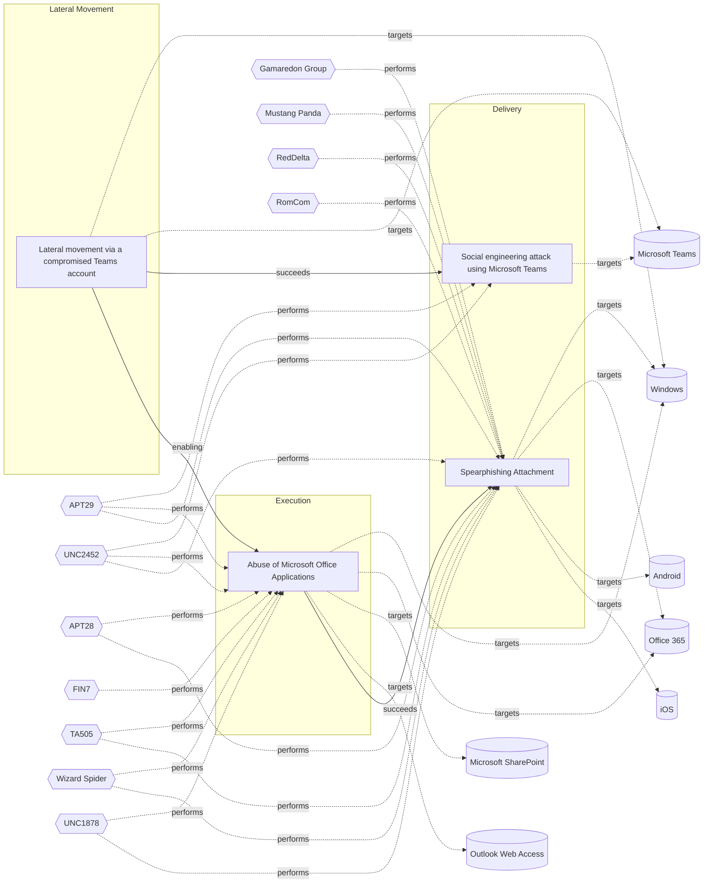

# ☣️ Lateral movement via a compromised Teams account

🔥 **Criticality:High** ⚠️ : A High priority incident is likely to result in a demonstrable impact to public health or safety, national security, economic security, foreign relations, civil liberties, or public confidence. 

🚦 **TLP:CLEAR** ⚪ : Recipients can spread this to the world, there is no limit on disclosure.

🗡️ **ATT&CK Techniques** [T1210 : Exploitation of Remote Services](https://attack.mitre.org/techniques/T1210 'Adversaries may exploit remote services to gain unauthorized access to internal systems once inside of a network Exploitation of a software vulnerabil'), [T1534 : Internal Spearphishing](https://attack.mitre.org/techniques/T1534 'After they already have access to accounts or systems within the environment, adversaries may use internal spearphishing to gain access to additional '), [T1570 : Lateral Tool Transfer](https://attack.mitre.org/techniques/T1570 'Adversaries may transfer tools or other files between systems in a compromised environment Once brought into the victim environment ie, Ingress Tool T'), [T1563 : Remote Service Session Hijacking](https://attack.mitre.org/techniques/T1563 'Adversaries may take control of preexisting sessions with remote services to move laterally in an environment Users may use valid credentials to log i'), [T1550 : Use Alternate Authentication Material](https://attack.mitre.org/techniques/T1550 'Adversaries may use alternate authentication material, such as password hashes, Kerberos tickets, and application access tokens, in order to move late')

---

`🔑 UUID : cc9003f7-a9e3-4407-a1ca-d514af469787` **|** `🏷️ Version : 1` **|** `🗓️ Creation Date : 2025-04-01` **|** `🗓️ Last Modification : 2025-04-01` **|** `Sharing Organisation : {'uuid': '56b0a0f0-b0bc-47d9-bb46-02f80ae2065a', 'name': 'EC DIGIT CSOC'}` **|** `🧱 Schema Identifier : tvm::2.1`

## 👁️ Description

> Lateral movement refers to attackers exploiting compromised accounts or systems 
> to navigate through a network and gain access to sensitive resources. In the context 
> of Microsoft Teams, attackers leverage its collaboration features and integrations 
> to move laterally within an organization environment. Here are the main techniques 
> and risks associated with this threat:    
> 
> ### How Attackers Exploit Teams for Lateral Movement
> 1. **Compromised Accounts**  
>   - Attackers gain access to low-privileged Teams accounts through phishing or 
>   credential theft. These accounts are then used to impersonate trusted users and 
>   escalate privileges.
>   - Sensitive credentials stored on shared systems can be exploited for lateral moves.    
> 
> 2. **File Sharing Abuse**  
>   - Malicious files (e.g., malware-laden executables or scripts) are distributed 
>   through Teams chats or channels, targeting internal users.  
>   - These files can auto-execute or trick users into running them, enabling attackers 
>   to infect other systems.    
> 
> 3. **Federated Trust Exploitation**  
>   - Misconfigured external access settings allow attackers from federated tenants 
>   to infiltrate and move laterally between organizations.    
> 
> 4. **Remote Execution Tools**  
>   - Attackers use Teams-integrated tools like Quick Assist or remote desktop protocols 
>   (RDP) to execute commands on other systems, furthering their movement.    
> 
> 5. **Credential Theft Techniques**  
>   - Methods like Pass-the-Hash (PtH) or Pass-the-Ticket (PtT) are used to steal 
>   authentication data from compromised systems, enabling attackers to impersonate 
>   users across the network.    
> 
> ### Risks of Lateral Movement via Teams
> - **Domain Compromise**: Attackers can move towards domain controllers by exploiting 
> stored credentials or misconfigurations.
> - **Sensitive Data Access**: Lateral movement enables access to high-value assets 
> such as financial records, intellectual property, or administrative accounts.
> - **Stealthy Operations**: Native tools and legitimate credentials make detection 
> harder, as malicious actions appear normal in audit logs.    
> 

## 🖥️ Terrain 

 > Adversaries through different means, they need to compromise an account in order 
> to be able to carry out lateral movement.
> 

---

## 🕸️ Relations

### 🌊 OpenTide Objects
🚫 No related OpenTide objects indexed.

 --- 

### ⛓️ Threat Chaining

Expand chaining data

| ☣️ Vector                                                                                                                                                                                                                                                                                                | ⛓️ Link              | 🎯 Target                                                                                                                                                                                                                                                                                             | ⛰️ Terrain                                                                                                                                                                                                                                                                                                                                                                                                                                                                                                                                                                                                                                                                                                                                                                                                                                                | 🗡️ ATT&CK                                                                                                                                                                                                                                                                                                                                                                                                                                                                                                                                                                                                                                                                                                                                                                                                                                                                                                                                                                                                              |
|:---------------------------------------------------------------------------------------------------------------------------------------------------------------------------------------------------------------------------------------------------------------------------------------------------------|:---------------------|:-----------------------------------------------------------------------------------------------------------------------------------------------------------------------------------------------------------------------------------------------------------------------------------------------------|:----------------------------------------------------------------------------------------------------------------------------------------------------------------------------------------------------------------------------------------------------------------------------------------------------------------------------------------------------------------------------------------------------------------------------------------------------------------------------------------------------------------------------------------------------------------------------------------------------------------------------------------------------------------------------------------------------------------------------------------------------------------------------------------------------------------------------------------------------------|:-----------------------------------------------------------------------------------------------------------------------------------------------------------------------------------------------------------------------------------------------------------------------------------------------------------------------------------------------------------------------------------------------------------------------------------------------------------------------------------------------------------------------------------------------------------------------------------------------------------------------------------------------------------------------------------------------------------------------------------------------------------------------------------------------------------------------------------------------------------------------------------------------------------------------------------------------------------------------------------------------------------------------|
| [Lateral movement via a compromised Teams account](../Threat%20Vectors/☣️%20Lateral%20movement%20via%20a%20compromised%20Teams%20account.md 'Lateral movement refers to attackers exploiting compromised accounts or systems to navigate through a network and gain access to sensitive resources I...') | `sequence::succeeds` | [Social engineering attack using Microsoft Teams](../Threat%20Vectors/☣️%20Social%20engineering%20attack%20using%20Microsoft%20Teams.md 'Adversaries are using compromised Microsoft 365 tenants to create technicalsupport-themed domains and send tech support lures via Microsoft Teams, att...') | Attacker has compromised a valid Microsoft 365 tenant to host the lures, and valid valid credentials in targeted M365 tenant too. Targeted organizations must use an app like Microsoft Authenticator as second factor (app taking the code received after successful authentication granted by  the victim, the user, in previous step).                                                                                                                                                                                                                                                                                                                                                                                                                                                                                                                 | [T1199 : Trusted Relationship](https://attack.mitre.org/techniques/T1199 'Adversaries may breach or otherwise leverage organizations who have access to intended victims Access through trusted third party relationship abuses ')                                                                                                                                                                                                                                                                                                                                                                                                                                                                                                                                                                                                                                                                                                                                                                                     |
| [Lateral movement via a compromised Teams account](../Threat%20Vectors/☣️%20Lateral%20movement%20via%20a%20compromised%20Teams%20account.md 'Lateral movement refers to attackers exploiting compromised accounts or systems to navigate through a network and gain access to sensitive resources I...') | `support::enabling`  | [Abuse of Microsoft Office Applications](../Threat%20Vectors/☣️%20Abuse%20of%20Microsoft%20Office%20Applications.md 'An employee named receives an email that appears to be from a trusted business partner or colleague The email contains an office document The end-user...')                     | Target systems must have Microsoft Office applications installed with macros  enabled or be susceptible to social engineering tactics that prompt users  to enable macros or execute malicious content.                                                                                                                                                                                                                                                                                                                                                                                                                                                                                                                                                                                                                                                   | [T1059.005 : Command and Scripting Interpreter: Visual Basic](https://attack.mitre.org/techniques/T1059/005 'Adversaries may abuse Visual Basic VB for execution VB is a programming language created by Microsoft with interoperability with many Windows technolo'), [T1204.002 : User Execution: Malicious File](https://attack.mitre.org/techniques/T1204/002 'An adversary may rely upon a user opening a malicious file in order to gain execution Users may be subjected to social engineering to get them to open'), [T1137 : Office Application Startup](https://attack.mitre.org/techniques/T1137 'Adversaries may leverage Microsoft Office-based applications for persistence between startups Microsoft Office is a fairly common application suite on'), [T1203 : Exploitation for Client Execution](https://attack.mitre.org/techniques/T1203 'Adversaries may exploit software vulnerabilities in client applications to execute code Vulnerabilities can exist in software due to unsecure coding p') |
| [Abuse of Microsoft Office Applications](../Threat%20Vectors/☣️%20Abuse%20of%20Microsoft%20Office%20Applications.md 'An employee named receives an email that appears to be from a trusted business partner or colleague The email contains an office document The end-user...')                         | `sequence::succeeds` | [Spearphishing Attachment](../Threat%20Vectors/☣️%20Spearphishing%20Attachment.md 'Spearphishing messages are often crafted using pernicious social engineeringtechniquesIn Spearphishing Attachment attacks, recipients receive emails t...')                                                       | Spear phishing requires more preparation and time to achieve success  than a phishing attack. That is because spear-phishing attackers attempt to obtain vast amounts of personal information about their victims.   Attackers can get the personal information they need using different ways:   - to compromise an email or messaging system trough other means, - to use OSINT, sourcing Social Media or glean personal information from the user's online presence. They want to craft emails that look as legitimate and attractive as possible  to increase the chances of fooling their targets, for instance sending a malicious  attachment where the filename references a topic the recipient is interested in. The highly personalized nature of spear-phishing attacks makes it more  difficult to identity than widescale phishing attacks. | [T1566.001 : Phishing: Spearphishing Attachment](https://attack.mitre.org/techniques/T1566/001 'Adversaries may send spearphishing emails with a malicious attachment in an attempt to gain access to victim systems Spearphishing attachment is a spe')                                                                                                                                                                                                                                                                                                                                                                                                                                                                                                                                                                                                                                                                                                                                                               |

&nbsp; 

---

## Model Data

#### **⛓️ Cyber Kill Chain**

 > Cyber attacks are typically phased progressions towards strategic objectives. The Unified Kill Chains provides insight into the tactics that hackers employ to attain these objectives. This provides a solid basis to develop (or realign) defensive strategies to raise cyber resilience.

 [`🌐 Lateral Movement`](https://www.unifiedkillchain.com/assets/The-Unified-Kill-Chain.pdf) : Techniques that enable an adversary to horizontally access and control other remote systems.

---

#### **🛰️ Domains**

 > Infrastructure technologies domain of interest to attackers.

  - `🏢 Enterprise` : Generic databases, applications, machines and systems that are usually on premises or on Cloud traditional VMs.
 - `☁️ Public Cloud` : Infrastructure handled by a commercial cloud provider. Managed mostly on a service level, and connected over the internet.
 - `☁️ Private Cloud` : Infrastructure hosted at a third party, but based on custom specification and managed on a platform level.

---

#### **🎯 Targets**

 > Granular delimited technical entities holding a value to the organization, that are targeted by adversaries. They might be also involved in the detection coverage as the target of log collection. Partially inspired by Veris.

  - [`🖥️ Workstations`](http://veriscommunity.net/enums.html#section-asset) : Placeholder
 - [`🪪 Personal Information`](http://veriscommunity.net/enums.html#section-asset) : Placeholder
 - [`🗃️ Critical Documents`](http://veriscommunity.net/enums.html#section-asset) : Placeholder
 - [`🕹️ Remote access`](http://veriscommunity.net/enums.html#section-asset) : Server - Remote access
 - [`🛠️ Virtual Machines`](http://veriscommunity.net/enums.html#section-asset) : Placeholder
 - [`💻 Laptop`](http://veriscommunity.net/enums.html#section-asset) : User Device - Laptop
 - [`👤 End-user`](http://veriscommunity.net/enums.html#section-asset) : People - End-user

---

#### **💿 Platforms concerned**

 > Actual technologies used by the organization that will be exploited by adversaries during a successful attack, and eventually of relevance for detection. Are named by commercial designation.

  - ` Windows` : Placeholder
 - [` Microsoft Teams`](https://docs.microsoft.com/en-us/microsoftteams/) : Microsoft Teams is a proprietary business communication platform developed by Microsoft, as part of the Microsoft 365 family of products. Teams primarily competes with the similar service Slack, offering workspace chat and videoconferencing, file storage, and application integration.

---

#### **💣 Severity**

 > The severity summarizes the overall danger of incident the vector will provoke, and is to be derived (WIP) from impact, leverage, and difficulty to execute.

 [`⚠️ Significant incident`](https://www.ncsc.gov.uk/news/new-cyber-attack-categorisation-system-improve-uk-response-incidents) : A cyber attack which has a serious impact on a large organisation or on wider / local government, or which poses a considerable risk to central government or (inter)national essential services.

---

#### **🪄 Leverage acquisition**

 > Technical aftermath of the attack from the target perspective, differentiated from impact as it does not consider the value of the consequence, only what increased control the vector execution provides to the adversary.

  - [`🦠 Dwelling`](https://owasp.org/www-community/Threat_Modeling_Process#stride) : Active or passive extended presence in the target, which performs adversarial operations continuously.
 - [`💅 Elevation of privilege`](https://owasp.org/www-community/Threat_Modeling_Process#stride) : Capacity to augment leverage over the target system by upgrading the compromised access rights
 - [`👻 Spoofing`](https://owasp.org/www-community/Threat_Modeling_Process#stride) : Threat action aimed at accessing and use of another user’s credentials, such as username and password.
 - [`👁️‍🗨️ Information Disclosure`](https://owasp.org/www-community/Threat_Modeling_Process#stride) : Threat action intending to read a file that one was not granted access to, or to read data in transit.

---

#### **💥 Impact**

 > Analysis of the threat vector from the organizational perspective, in non technical term. This aims at putting a clear denomination on what the attacker will actually be able to act upon if the threat vector is realized.

  - [`🔓 Data Breach`](http://veriscommunity.net/enums.html#section-impact) : Non-public information has been accessed from the outside, and successfully extracted.
 - [`🩼 Impairement`](http://veriscommunity.net/enums.html#section-impact) : Incapacitation of a particular key system that will cause disruptions in day-to-day operations, and eventually service delivery.
 - [`🧠 IP Loss`](http://veriscommunity.net/enums.html#section-impact) : Particular, key data, information and blueprint conducive to the organization capability to gain and retain a commercial or geopolitical advantage has been accessed, and their content potentially used by competitors or other adversaries.
 - [`😤 Nuisance`](http://veriscommunity.net/enums.html#section-impact) : Small and mostly inconsequential to day to day operations, but noticed.

---

#### **🎲 Vector Viability**

 > Described with estimative language (likelyhood probability), describes how likely the analyst believes the vector to actually be realized on the organization infrastructure. Estimative language describes quality and credibility of underlying sources, data, and methodologies based Intelligence Community Directive 203 (ICD 203) and JP 2-0, Joint Intelligence.

 [`🧐 Likely`](https://www.dni.gov/files/documents/ICD/ICD%20203%20Analytic%20Standards.pdf) : Probable (probably) - 55-80%

---

### 🔗 References

**🕊️ Publicly available resources**

- [_1_] https://www.csoonline.com/article/575349/researchers-show-ways-to-abuse-microsoft-teams-accounts-for-lateral-movement.html
- [_2_] https://learn.microsoft.com/en-us/defender-for-identity/understand-lateral-movement-paths
- [_3_] https://www.linkedin.com/pulse/attackers-leveraging-microsoft-teams-defaults-quick-assist-p1u5c

[1]: https://www.csoonline.com/article/575349/researchers-show-ways-to-abuse-microsoft-teams-accounts-for-lateral-movement.html
[2]: https://learn.microsoft.com/en-us/defender-for-identity/understand-lateral-movement-paths
[3]: https://www.linkedin.com/pulse/attackers-leveraging-microsoft-teams-defaults-quick-assist-p1u5c

---

#### 🏷️ Tags

#-, #-, #-, #
, #
, ##, ##, ##, ##, # , #🏷, #️, # , #T, #a, #g, #s, #
, #

