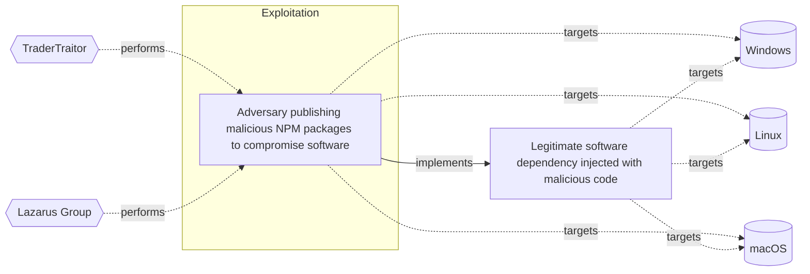

# ☣️ Legitimate software dependency injected with malicious code

🔥 **Criticality:High** ⚠️ : A High priority incident is likely to result in a demonstrable impact to public health or safety, national security, economic security, foreign relations, civil liberties, or public confidence. 

🚦 **TLP:CLEAR** ⚪ : Recipients can spread this to the world, there is no limit on disclosure.

🗡️ **ATT&CK Techniques** [T1195.002 : Supply Chain Compromise: Compromise Software Supply Chain](https://attack.mitre.org/techniques/T1195/002 'Adversaries may manipulate application software prior to receipt by a final consumer for the purpose of data or system compromise Supply chain comprom'), [T1195.001 : Supply Chain Compromise: Compromise Software Dependencies and Development Tools](https://attack.mitre.org/techniques/T1195/001 'Adversaries may manipulate software dependencies and development tools prior to receipt by a final consumer for the purpose of data or system compromi'), [T1204 : User Execution](https://attack.mitre.org/techniques/T1204 'An adversary may rely upon specific actions by a user in order to gain execution Users may be subjected to social engineering to get them to execute m'), [T1218 : System Binary Proxy Execution](https://attack.mitre.org/techniques/T1218 'Adversaries may bypass process andor signature-based defenses by proxying execution of malicious content with signed, or otherwise trusted, binaries B'), [T1499 : Endpoint Denial of Service](https://attack.mitre.org/techniques/T1499 'Adversaries may perform Endpoint Denial of Service DoS attacks to degrade or block the availability of services to users Endpoint DoS can be performed'), [T1559.002 : Inter-Process Communication: Dynamic Data Exchange](https://attack.mitre.org/techniques/T1559/002 'Adversaries may use Windows Dynamic Data Exchange DDE to execute arbitrary commands DDE is a client-server protocol for one-time andor continuous inte'), [T1036 : Masquerading](https://attack.mitre.org/techniques/T1036 'Adversaries may attempt to manipulate features of their artifacts to make them appear legitimate or benign to users andor security tools Masquerading ')

---

`🔑 UUID : b6887f4b-eeae-462c-a2ac-7454efb5eabc` **|** `🏷️ Version : 1` **|** `🗓️ Creation Date : 2025-04-23` **|** `🗓️ Last Modification : 2025-04-23` **|** `Sharing Organisation : {'uuid': '56b0a0f0-b0bc-47d9-bb46-02f80ae2065a', 'name': 'EC DIGIT CSOC'}` **|** `🧱 Schema Identifier : tvm::2.1`

## 👁️ Description

> Legitimate software dependency injected with malicious code refers
> to a type of attack where an adversary compromises a legitimate software
> dependency, such as a library or framework, by injecting malicious code
> into it.  
> 
> The compromise of a legitimate package may occur when an attacker
> manipulates trusted open-source components by injecting malicious payload.
> This is achieved through variety of methods, for example, hijacking the
> credentials of project maintainers or exploiting weaknesses in distribution
> platforms. Since organizations and developers rely heavily on open-source
> software, a compromised package can lead to malicious code being executed
> on end-user systems or within the software development pipeline itself
> ref [1].    
> 
> ### Examples for use cases
> 
> - An adversary compromises a popular open-source library by injecting
> malicious code into it. Examples for open-source libraries could be: NPM
> packages, JavaScript frameworks - React, Angular, Vue.js, PyPI packages, 
> Python frameworks, Java libraries, Git repositories and others ref [2].
> When a developer uses this library in their software, the malicious code
> is executed, allowing the adversary to gain unauthorized access.  
> - A software vendor's build-in process is compromised, allowing an
> adversary to inject malicious code into the software's dependencies.
> When the software is installed and run, the malicious code is executed,
> compromising the user's system.    
> ### Possible malicious software infection methods
> For more information review ref [3]
> - Typosquatting - The threat actor uses subtle typographical errors in
> the malicious package name to resemble a popular package, often going
> unnoticed by the victim. These packages are usually registered in
> repositories such as NPM and PyPI. As prevention of this attack method,
> some developers register names that resemble the legitimate site,
> precluding the typosquatter's opportunities.
> - Masquerading - This attack method completely duplicates the code and
> the metadata of a known package, and a snippet of malicious code is added,
> thereby creating a Trojan package. Unlike the typosquatting method, this
> method uses the exact name of a legitimate package to deceive developers
> through similarity.
> - Dependency confusion - Dependency is a piece of software required for
> a particular program to function. Software dependencies can be either
> internal or external. In this technique, the threat actor employs a
> valid name of an internal package for the malicious package and publishes
> the malicious package on a public repository with a higher version number.
> Since default package managers tend to prioritize higher version numbers,
> this practice increases the vulnerability to malicious package attacks.
> - Dependency hijacking - In this method, the threat actor compromises
> a legitimate package and pushes malicious code into it. This is done by
> taking over maintainers' or developers' accounts or injecting obfuscated
> malicious code into a legitimate open-source project.  
> 

## 🖥️ Terrain 

 > A threat actor uses an already existing vulnerable open-source library
> component to inject malicious code.
> 
> They can use also a build-in or some type of an inherited vulnerability
> in the vendor's process which allows malicious code injection.     
> 

---

## 🕸️ Relations

### 🌊 OpenTide Objects
🚫 No related OpenTide objects indexed.

 --- 

### ⛓️ Threat Chaining

Expand chaining data

| ☣️ Vector                                                                                                                                                                                                                                                                                                                                      | ⛓️ Link                 | 🎯 Target                                                                                                                                                                                                                                                                                                                       | ⛰️ Terrain                                                                                                                                                                                                                                         | 🗡️ ATT&CK                                                                                                                                                                                                                                                                                                                                                                                                                                                                                                                                                                                                                                                                                                                                                                                                                                                                                                                                                                                                                                                                                                                                                                                                                                                                                                                                                                                                                                                                                                         |
|:-----------------------------------------------------------------------------------------------------------------------------------------------------------------------------------------------------------------------------------------------------------------------------------------------------------------------------------------------|:------------------------|:-------------------------------------------------------------------------------------------------------------------------------------------------------------------------------------------------------------------------------------------------------------------------------------------------------------------------------|:---------------------------------------------------------------------------------------------------------------------------------------------------------------------------------------------------------------------------------------------------|:------------------------------------------------------------------------------------------------------------------------------------------------------------------------------------------------------------------------------------------------------------------------------------------------------------------------------------------------------------------------------------------------------------------------------------------------------------------------------------------------------------------------------------------------------------------------------------------------------------------------------------------------------------------------------------------------------------------------------------------------------------------------------------------------------------------------------------------------------------------------------------------------------------------------------------------------------------------------------------------------------------------------------------------------------------------------------------------------------------------------------------------------------------------------------------------------------------------------------------------------------------------------------------------------------------------------------------------------------------------------------------------------------------------------------------------------------------------------------------------------------------------|
| [Adversary publishing malicious NPM packages to compromise software](../Threat%20Vectors/☣️%20Adversary%20publishing%20malicious%20NPM%20packages%20to%20compromise%20software.md 'Threat actors use a technique which includes updating of NPM packageswith malicious code to deceive a developer or an end-user to downloadand install ...') | `atomicity::implements` | [Legitimate software dependency injected with malicious code](../Threat%20Vectors/☣️%20Legitimate%20software%20dependency%20injected%20with%20malicious%20code.md 'Legitimate software dependency injected with malicious code refersto a type of attack where an adversary compromises a legitimate softwaredependency, ...') | A threat actor uses an already existing vulnerable open-source library component to inject malicious code.  They can use also a build-in or some type of an inherited vulnerability in the vendor's process which allows malicious code injection. | [T1195.002](https://attack.mitre.org/techniques/T1195/002 'Adversaries may manipulate application software prior to receipt by a final consumer for the purpose of data or system compromise Supply chain comprom'), [T1195.001](https://attack.mitre.org/techniques/T1195/001 'Adversaries may manipulate software dependencies and development tools prior to receipt by a final consumer for the purpose of data or system compromi'), [T1204](https://attack.mitre.org/techniques/T1204 'An adversary may rely upon specific actions by a user in order to gain execution Users may be subjected to social engineering to get them to execute m'), [T1218](https://attack.mitre.org/techniques/T1218 'Adversaries may bypass process andor signature-based defenses by proxying execution of malicious content with signed, or otherwise trusted, binaries B'), [T1499](https://attack.mitre.org/techniques/T1499 'Adversaries may perform Endpoint Denial of Service DoS attacks to degrade or block the availability of services to users Endpoint DoS can be performed'), [T1559.002](https://attack.mitre.org/techniques/T1559/002 'Adversaries may use Windows Dynamic Data Exchange DDE to execute arbitrary commands DDE is a client-server protocol for one-time andor continuous inte'), [T1036](https://attack.mitre.org/techniques/T1036 'Adversaries may attempt to manipulate features of their artifacts to make them appear legitimate or benign to users andor security tools Masquerading ') |

&nbsp; 

---

## Model Data

#### **🛰️ Domains**

 > Infrastructure technologies domain of interest to attackers.

  - `🏢 Enterprise` : Generic databases, applications, machines and systems that are usually on premises or on Cloud traditional VMs.
 - `☁️ Private Cloud` : Infrastructure hosted at a third party, but based on custom specification and managed on a platform level.
 - `☁️ Public Cloud` : Infrastructure handled by a commercial cloud provider. Managed mostly on a service level, and connected over the internet.

---

#### **🎯 Targets**

 > Granular delimited technical entities holding a value to the organization, that are targeted by adversaries. They might be also involved in the detection coverage as the target of log collection. Partially inspired by Veris.

  - [`🛠️ CI/CD Pipelines`](http://veriscommunity.net/enums.html#section-asset) : CI/CD pipelines automate the process of building, testing, and deploying software, ensuring efficient and reliable software delivery.
 - [`👤 Developer`](http://veriscommunity.net/enums.html#section-asset) : People - Developer
 - [` Other`](http://veriscommunity.net/enums.html#section-asset) : Media - Other/Unknown

---

#### **💿 Platforms concerned**

 > Actual technologies used by the organization that will be exploited by adversaries during a successful attack, and eventually of relevance for detection. Are named by commercial designation.

  - ` Windows` : Placeholder
 - ` macOS` : Placeholder
 - ` Linux` : Placeholder

---

#### **💣 Severity**

 > The severity summarizes the overall danger of incident the vector will provoke, and is to be derived (WIP) from impact, leverage, and difficulty to execute.

 [`⚠️ Significant incident`](https://www.ncsc.gov.uk/news/new-cyber-attack-categorisation-system-improve-uk-response-incidents) : A cyber attack which has a serious impact on a large organisation or on wider / local government, or which poses a considerable risk to central government or (inter)national essential services.

---

#### **🪄 Leverage acquisition**

 > Technical aftermath of the attack from the target perspective, differentiated from impact as it does not consider the value of the consequence, only what increased control the vector execution provides to the adversary.

  - [`💀 Infrastructure Compromise`](https://owasp.org/www-community/Threat_Modeling_Process#stride) : The compromised target is likely to be used to further expand the sphere of influence of the attacker and allow more potent vectors to be executed.
 - [`🐒 Tampering`](https://owasp.org/www-community/Threat_Modeling_Process#stride) : Threat action intending to maliciously change or modify persistent data, such as records in a database, and the alteration of data in transit between two computers over an open network, such as the Internet.

---

#### **💥 Impact**

 > Analysis of the threat vector from the organizational perspective, in non technical term. This aims at putting a clear denomination on what the attacker will actually be able to act upon if the threat vector is realized.

  - [`🩼 Impairement`](http://veriscommunity.net/enums.html#section-impact) : Incapacitation of a particular key system that will cause disruptions in day-to-day operations, and eventually service delivery.
 - [`🛑 Business disruption`](http://veriscommunity.net/enums.html#section-impact) : Business disruption
 - [`🤬 Lose Capabilities`](http://veriscommunity.net/enums.html#section-impact) : Vector execution will remove key functions to the organization, which will not be easily circumvented. Most day-to-day is heavily impaired, but processes can reorganize at a loss.
 - [`📉 Competitive disadvantage`](http://veriscommunity.net/enums.html#section-impact) : Loss of competitive advantage

---

#### **🎲 Vector Viability**

 > Described with estimative language (likelyhood probability), describes how likely the analyst believes the vector to actually be realized on the organization infrastructure. Estimative language describes quality and credibility of underlying sources, data, and methodologies based Intelligence Community Directive 203 (ICD 203) and JP 2-0, Joint Intelligence.

 [`🧐 Likely`](https://www.dni.gov/files/documents/ICD/ICD%20203%20Analytic%20Standards.pdf) : Probable (probably) - 55-80%

---

### 🔗 References

**🕊️ Publicly available resources**

- [_1_] https://learn.snyk.io/lesson/compromise-of-legitimate-package/?ecosystem=python
- [_2_] https://madhureshgupta.home.blog/2020/03/27/what-are-libraries-frameworks-and-packages/
- [_3_] https://www.tripwire.com/state-of-security/understanding-malicious-package-attacks-and-defense-strategies-robust
- [_4_] https://www.microsoft.com/en-us/security/blog/2025/04/15/threat-actors-misuse-node-js-to-deliver-malware-and-other-malicious-payloads

[1]: https://learn.snyk.io/lesson/compromise-of-legitimate-package/?ecosystem=python
[2]: https://madhureshgupta.home.blog/2020/03/27/what-are-libraries-frameworks-and-packages/
[3]: https://www.tripwire.com/state-of-security/understanding-malicious-package-attacks-and-defense-strategies-robust
[4]: https://www.microsoft.com/en-us/security/blog/2025/04/15/threat-actors-misuse-node-js-to-deliver-malware-and-other-malicious-payloads

---

#### 🏷️ Tags

#-, #-, #-, #
, #
, ##, ##, ##, ##, # , #🏷, #️, # , #T, #a, #g, #s, #
, #

