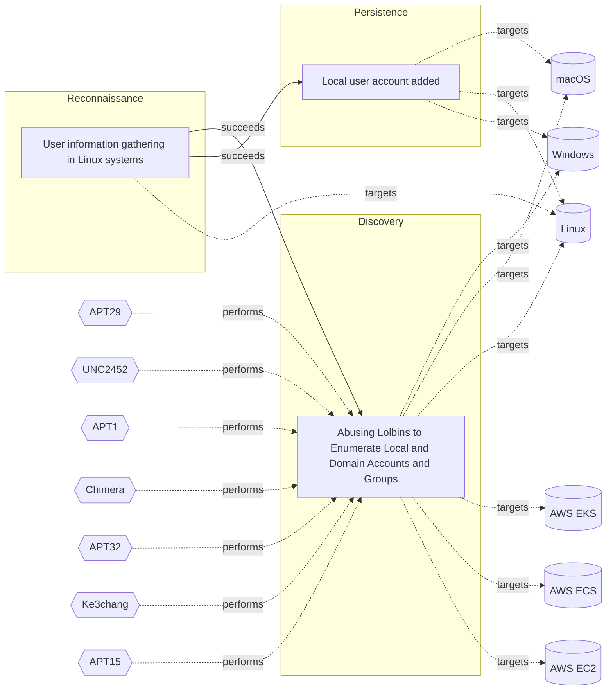

# ☣️ Local user account added

🔥 **Criticality:High** ⚠️ : A High priority incident is likely to result in a demonstrable impact to public health or safety, national security, economic security, foreign relations, civil liberties, or public confidence. 

🚦 **TLP:CLEAR** ⚪ : Recipients can spread this to the world, there is no limit on disclosure.


🗡️ **ATT&CK Techniques** [T1136.001 : Create Account: Local Account](https://attack.mitre.org/techniques/T1136/001 'Adversaries may create a local account to maintain access to victim systems Local accounts are those configured by an organization for use by users, r')


---

`🔑 UUID : e2d8ce6b-f21e-4444-a828-0c6b722a9c93` **|** `🏷️ Version : 1` **|** `🗓️ Creation Date : 2024-12-12` **|** `🗓️ Last Modification : 2024-12-13` **|** `Sharing Organisation : {'uuid': '56b0a0f0-b0bc-47d9-bb46-02f80ae2065a', 'name': 'EC DIGIT CSOC'}` **|** `🧱 Schema Identifier : tvm::2.0`


## 👁️ Description

> Threat actors may add or modify local user accounts on compromised systems to 
> establish persistence, maintain unauthorized access, and potentially 
> escalate privileges. By leveraging administrative permissions—often obtained 
> through credential theft, exploitation of vulnerabilities, or lateral movement—
> adversaries create new user accounts that allow them to re-enter the system 
> at will, even if initial malware implants or other backdoor mechanisms 
> are detected and removed.  
> 
> ## Windows
> 
> Adversaries might run commands like :
> ```bash
> net user /add [username] [password] 
> or 
> net localgroup administrators [username] /add
> ```
> 
> To stealthily provision accounts with elevated permissions. 
> 
> ## Linux or macOS
> 
> Threat actors may modify :
> ```bash
> /etc/passwd
> or 
> /etc/shadow
> ``` 
> or use commands like `useradd` or `dscl` to create new users.
> The changes perfomed by using the above commands can be detected by 
> monitoring certain paths, such as `/usr/sbin/useradd`.  
> In some cases, attackers may script these actions to occur automatically during 
> their post-exploitation phase, making detection more challenging.  
> 
> In practice, once these local accounts are established, the attackers can 
> maintain a foothold within the environment, pivot to other hosts, 
> exfiltrate data, or stage further attacks. The long-term impact of such 
> account additions may lead to data breaches, reputation damage, financial 
> loss and regulatory consequences.  
> 


## 🖥️ Terrain 

 > Adversary must have existing administrative privileges on a compromised host 
> within the targeted infrastructure to create or modify local user accounts.
> 

---

## 🕸️ Relations


### 🌊 OpenTide Objects
🚫 No related OpenTide objects indexed.


 --- 

### ⛓️ Threat Chaining




<details>
<summary>Expand chaining data</summary>

| ☣️ Vector                                                                                                                                                                                                                                                                                    | ⛓️ Link              | 🎯 Target                                                                                                                                                                                                                                                                                                                                         | ⛰️ Terrain                                                                                                                                                | 🗡️ ATT&CK                                                                                                                                                                                                                                                                                                                                                                                                                                                                                                                                                                                                                                                                                                                                                                                                                                                                                                                                                                                                                                          |
|:---------------------------------------------------------------------------------------------------------------------------------------------------------------------------------------------------------------------------------------------------------------------------------------------|:---------------------|:-------------------------------------------------------------------------------------------------------------------------------------------------------------------------------------------------------------------------------------------------------------------------------------------------------------------------------------------------|:----------------------------------------------------------------------------------------------------------------------------------------------------------|:---------------------------------------------------------------------------------------------------------------------------------------------------------------------------------------------------------------------------------------------------------------------------------------------------------------------------------------------------------------------------------------------------------------------------------------------------------------------------------------------------------------------------------------------------------------------------------------------------------------------------------------------------------------------------------------------------------------------------------------------------------------------------------------------------------------------------------------------------------------------------------------------------------------------------------------------------------------------------------------------------------------------------------------------------|
| [User information gathering in Linux systems](../Threat%20Vectors/☣️%20User%20information%20gathering%20in%20Linux%20systems.md 'Threat actors use various methods and tools to collect user data on Linuxsystems Some of them are given below### Common methods used for gathering of ...') | `sequence::succeeds` | [Local user account added](../Threat%20Vectors/☣️%20Local%20user%20account%20added.md 'Threat actors may add or modify local user accounts on compromised systems to establish persistence, maintain unauthorized access, and potentially esc...')                                                                                               | Adversary must have existing administrative privileges on a compromised host  within the targeted infrastructure to create or modify local user accounts. | [T1136.001 : Create Account: Local Account](https://attack.mitre.org/techniques/T1136/001 'Adversaries may create a local account to maintain access to victim systems Local accounts are those configured by an organization for use by users, r')                                                                                                                                                                                                                                                                                                                                                                                                                                                                                                                                                                                                                                                                                                                                                                                                |
| [User information gathering in Linux systems](../Threat%20Vectors/☣️%20User%20information%20gathering%20in%20Linux%20systems.md 'Threat actors use various methods and tools to collect user data on Linuxsystems Some of them are given below### Common methods used for gathering of ...') | `sequence::succeeds` | [Abusing Lolbins to Enumerate Local and Domain Accounts and Groups](../Threat%20Vectors/☣️%20Abusing%20Lolbins%20to%20Enumerate%20Local%20and%20Domain%20Accounts%20and%20Groups.md 'Adversaries may attempt to enumerate the environment and list alllocal system and domain accounts or groups  To achieve this purpose, they can use var...') | Adversaries can take advantage of already compromised system (Windows or  Linux OS or OSX) to run commands.                                               | [T1087.001 : Account Discovery: Local Account](https://attack.mitre.org/techniques/T1087/001 'Adversaries may attempt to get a listing of local system accounts This information can help adversaries determine which local accounts exist on a syst'), [T1087.002 : Account Discovery: Domain Account](https://attack.mitre.org/techniques/T1087/002 'Adversaries may attempt to get a listing of domain accounts This information can help adversaries determine which domain accounts exist to aid in foll'), [T1069.001 : Permission Groups Discovery: Local Groups](https://attack.mitre.org/techniques/T1069/001 'Adversaries may attempt to find local system groups and permission settings The knowledge of local system permission groups can help adversaries deter'), [T1069.002 : Permission Groups Discovery: Domain Groups](https://attack.mitre.org/techniques/T1069/002 'Adversaries may attempt to find domain-level groups and permission settings The knowledge of domain-level permission groups can help adversaries deter') |

</details>
&nbsp; 


---

## Model Data

#### **⛓️ Cyber Kill Chain**

 > Cyber attacks are typically phased progressions towards strategic objectives. The Unified Kill Chains provides insight into the tactics that hackers employ to attain these objectives. This provides a solid basis to develop (or realign) defensive strategies to raise cyber resilience.

 [`🔐 Persistence`](https://www.unifiedkillchain.com/assets/The-Unified-Kill-Chain.pdf) : Any access, action or change to a system that gives an attacker persistent presence on the system.

---

#### **🛰️ Domains**

 > Infrastructure technologies domain of interest to attackers.

  - `🏢 Enterprise` : Generic databases, applications, machines and systems that are usually on premises or on Cloud traditional VMs.
 - `🌐 Networking` : Communications backbone connecting users, applications and machines.

---

#### **🎯 Targets**

 > Granular delimited technical entities holding a value to the organization, that are targeted by adversaries. They might be also involved in the detection coverage as the target of log collection. Partially inspired by Veris.

  - [`🖥️ Workstations`](http://veriscommunity.net/enums.html#section-asset) : Placeholder
 - [`🖥️ Desktop`](http://veriscommunity.net/enums.html#section-asset) : User Device - Desktop or workstation
 - [`💻 Laptop`](http://veriscommunity.net/enums.html#section-asset) : User Device - Laptop
 - [`🖥️ Public-Facing Servers`](http://veriscommunity.net/enums.html#section-asset) : Placeholder
 - [`🗄️ Production Database`](http://veriscommunity.net/enums.html#section-asset) : Placeholder
 - [`🛠️ Virtual Machines`](http://veriscommunity.net/enums.html#section-asset) : Placeholder
 - [`👷 Engineering Workstation`](https://collaborate.mitre.org/attackics/index.php/Engineering_Workstation) : The engineering workstation is usually a high-end very reliable computing platform designed for configuration, maintenance and diagnostics of the control system applications and other control system equipment. The system is usually made up of redundant hard disk drives, high speed network interface, reliable CPUs, performance graphics hardware, and applications that provide configuration and monitoring tools to perform control system application development, compilation and distribution of system modifications.

---

#### **💿 Platforms concerned**

 > Actual technologies used by the organization that will be exploited by adversaries during a successful attack, and eventually of relevance for detection. Are named by commercial designation.

  - ` Windows` : Placeholder
 - ` Linux` : Placeholder
 - ` macOS` : Placeholder

---

#### **💣 Severity**

 > The severity summarizes the overall danger of incident the vector will provoke, and is to be derived (WIP) from impact, leverage, and difficulty to execute.

 [`🔥 Substantial incident`](https://www.ncsc.gov.uk/news/new-cyber-attack-categorisation-system-improve-uk-response-incidents) : A cyber attack which has a serious impact on a medium-sized organisation, or which poses a considerable risk to a large organisation or wider / local government.

---

#### **🪄 Leverage acquisition**

 > Technical aftermath of the attack from the target perspective, differentiated from impact as it does not consider the value of the consequence, only what increased control the vector execution provides to the adversary.

  - [`💅 Elevation of privilege`](https://owasp.org/www-community/Threat_Modeling_Process#stride) : Capacity to augment leverage over the target system by upgrading the compromised access rights
 - [`🔐 New Accounts`](https://owasp.org/www-community/Threat_Modeling_Process#stride) : Ability to create new arbitrary user accounts.
 - [`⚙️ Modify configuration`](https://owasp.org/www-community/Threat_Modeling_Process#stride) : Modify configuration or services

---

#### **💥 Impact**

 > Analysis of the threat vector from the organizational perspective, in non technical term. This aims at putting a clear denomination on what the attacker will actually be able to act upon if the threat vector is realized.

  - [`🔓 Data Breach`](http://veriscommunity.net/enums.html#section-impact) : Non-public information has been accessed from the outside, and successfully extracted.
 - [`🌍 Reputational Damages`](http://veriscommunity.net/enums.html#section-impact) : Damages to the organization public view may be achieved by using directly the access gained, or indirectly with data gathered.
 - [`🥸 Identity Theft`](http://veriscommunity.net/enums.html#section-impact) : Acquisition of sufficient information and privileges to profess as a given individual, for the purpose of abusing and deceiving human trust relationships.
 - [`🛑 Business disruption`](http://veriscommunity.net/enums.html#section-impact) : Business disruption

---

#### **🎲 Vector Viability**

 > Described with estimative language (likelyhood probability), describes how likely the analyst believes the vector to actually be realized on the organization infrastructure. Estimative language describes quality and credibility of underlying sources, data, and methodologies based Intelligence Community Directive 203 (ICD 203) and JP 2-0, Joint Intelligence.

 [`🧐 Likely`](https://www.dni.gov/files/documents/ICD/ICD%20203%20Analytic%20Standards.pdf) : Probable (probably) - 55-80%

---


### 🔗 References


**🕊️ Publicly available resources**

- [_1_] https://research.splunk.com/endpoint/aae66dc0-74b4-4807-b480-b35f8027abb4/
- [_2_] https://research.splunk.com/endpoint/f8c325ea-506e-4105-8ccf-da1492e90115/

[1]: https://research.splunk.com/endpoint/aae66dc0-74b4-4807-b480-b35f8027abb4/
[2]: https://research.splunk.com/endpoint/f8c325ea-506e-4105-8ccf-da1492e90115/

---

#### 🏷️ Tags

#-, #-, #-, #
, #
, ##, ##, ##, ##, # , #🏷, #️, # , #T, #a, #g, #s, #
, #


