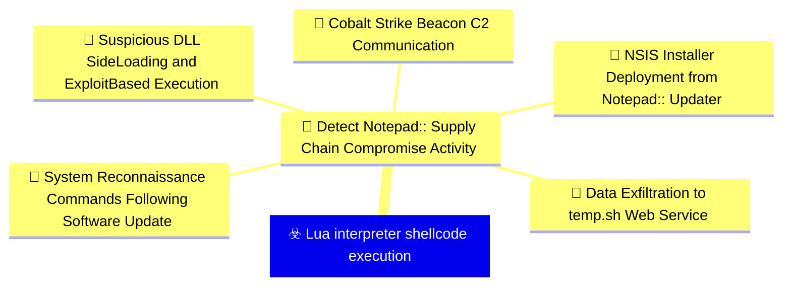
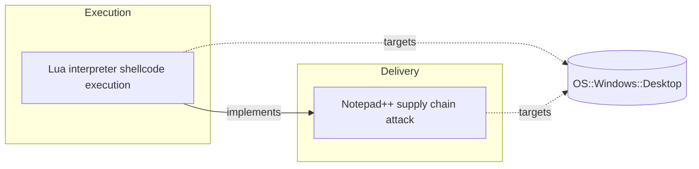

# ☣️ Lua interpreter shellcode execution

🔥 **Criticality:High** ⚠️ : A High priority incident is likely to result in a demonstrable impact to public health or safety, national security, economic security, foreign relations, civil liberties, or public confidence. 

🚦 **TLP:CLEAR** ⚪ : Recipients can spread this to the world, there is no limit on disclosure.


🗡️ **ATT&CK Techniques** [T1059.010 : Command and Scripting Interpreter: AutoHotKey & AutoIT](https://attack.mitre.org/techniques/T1059/010 'Adversaries may execute commands and perform malicious tasks using AutoIT and AutoHotKey automation scripts AutoIT and AutoHotkey AHK are scripting la'), [T1055.001 : Process Injection: Dynamic-link Library Injection](https://attack.mitre.org/techniques/T1055/001 'Adversaries may inject dynamic-link libraries DLLs into processes in order to evade process-based defenses as well as possibly elevate privileges DLL '), [T1106 : Native API](https://attack.mitre.org/techniques/T1106 'Adversaries may interact with the native OS application programming interface API to execute behaviors Native APIs provide a controlled means of calli')


---

`🔑 UUID : bc365789-bdbb-4e78-b2ae-b097a7ccd35f` **|** `🏷️ Version : 1` **|** `🗓️ Creation Date : 2026-02-09` **|** `🗓️ Last Modification : 2026-02-09` **|** `Sharing Organisation : {'uuid': '56b0a0f0-b0bc-47d9-bb46-02f80ae2065a', 'name': 'EC DIGIT CSOC'}` **|** `🧱 Schema Identifier : tvm::2.1`


## 👁️ Description

> ## Executive Summary
> 
> Lua interpreter shellcode execution is an evasion technique that leverages legitimate 
> Lua scripting interpreters to execute malicious compiled Lua scripts containing 
> shellcode payloads. This technique was observed in Chain #2 of the Notepad++ supply 
> chain attack (September-October 2025), where threat actors used a legitimate Lua 
> interpreter (script.exe) to load compiled malicious scripts (alien.ini) that 
> performed in-memory shellcode injection.
> 
> ## Technical Details
> 
> ### Attack Flow
> 
> 1. **File Deployment**: Malicious and legitimate files dropped to %APPDATA%\Adobe\Scripts\:
>    - `alien.dll` (SHA1: 6444dab57d93ce987c22da66b3706d5d7fc226da) - Legitimate library
>    - `lua5.1.dll` (SHA1: 2ab0758dda4e71aee6f4c8e4c0265a796518f07d) - Legitimate Lua library
>    - `script.exe` (SHA1: bf996a709835c0c16cce1015e6d44fc95e08a38a) - Legitimate Lua interpreter
>    - `alien.ini` (SHA1: ca4b6fe0c69472cd3d63b212eb805b7f65710d33) - MALICIOUS compiled Lua script
> 
> 2. **Execution**: Command line execution:
>    ```
>    %APPDATA%\Adobe\Scripts\script.exe %APPDATA%\Adobe\Scripts\alien.ini
>    ```
> 
> 3. **Shellcode Injection**: The malicious alien.ini file:
>    - Allocates executable memory in the process space
>    - Places shellcode into the allocated memory
>    - Launches shellcode by abusing the Windows EnumWindowStationsW API function
> 
> 4. **Payload Delivery**: Shellcode acts as a Metasploit downloader to retrieve Cobalt Strike Beacon
> 
> ### Malicious File Variants
> 
> Multiple variants of the alien.ini compiled Lua script were observed:
> - SHA1: ca4b6fe0c69472cd3d63b212eb805b7f65710d33
> - SHA1: 0d0f315fd8cf408a483f8e2dd1e69422629ed9fd
> - SHA1: 2a476cfb85fbf012fdbe63a37642c11afa5cf020
> 
> ### Download URLs
> 
> Cobalt Strike Beacon downloaded from:
> ```
> https://cdncheck.it[.]com/users/admin
> https://safe-dns.it[.]com/help/Get-Start
> ```
> 
> ### Command and Control Infrastructure
> 
> C2 server URLs:
> ```
> https://cdncheck.it[.]com/api/getInfo/v1
> https://cdncheck.it[.]com/api/FileUpload/submit
> https://safe-dns.it[.]com/resolve
> https://safe-dns.it[.]com/dns-query
> ```
> 
> ## Why This Technique is Effective
> 
> 1. **Living off the Land**: Uses legitimate Lua interpreter (script.exe) that may be trusted
> 2. **File Masquerading**: Malicious payload disguised as configuration file (alien.ini)
> 3. **Directory Camouflage**: Files placed in Adobe Scripts directory to appear legitimate
> 4. **API Abuse**: Leverages legitimate Windows API (EnumWindowStationsW) for shellcode execution
> 5. **Memory-Only Execution**: Shellcode runs in memory, reducing disk-based artifacts
> 6. **Defense Evasion**: Compiled Lua scripts are less commonly analyzed than traditional executables
> 
> ## Detection Opportunities
> 
> 1. **Process Monitoring**:
>    - Monitor for unexpected Lua interpreter (script.exe, lua.exe, lua5.1.exe) execution
>    - Look for Lua interpreters spawned from unusual parent processes
>    - Alert on Lua processes loading .ini or non-standard file extensions
> 
> 2. **Command Line Analysis**:
>    - Detect command lines executing Lua interpreters with suspicious arguments
>    - Monitor for execution from %APPDATA% directories (especially Adobe\Scripts\)
> 
> 3. **File System Monitoring**:
>    - Watch for creation of script.exe, lua5.1.dll, alien.dll in %APPDATA% paths
>    - Alert on .ini files in scripting directories
>    - Monitor for file writes to %APPDATA%\Adobe\Scripts\ directory
> 
> 4. **API Call Monitoring**:
>    - Detect EnumWindowStationsW API calls from scripting interpreters
>    - Monitor for memory allocation patterns (VirtualAlloc, VirtualAllocEx) from Lua processes
>    - Alert on WriteProcessMemory calls from script interpreters
> 
> 5. **Network Monitoring**:
>    - Block/alert on connections to known malicious domains (cdncheck.it[.]com, safe-dns.it[.]com)
>    - Monitor for unusual HTTPS/HTTP traffic from scripting processes
>    - Detect Cobalt Strike Beacon network signatures
> 
> 6. **Behavioral Detection**:
>    - Identify Lua interpreters making network connections
>    - Detect shellcode injection patterns (allocate → write → execute)
>    - Alert on processes with unusual memory protection changes
> 
> ## Mitigation Recommendations
> 
> 1. **Application Whitelisting**:
>    - Restrict execution of scripting interpreters to approved locations
>    - Block execution from %APPDATA% directories where possible
>    - Implement strict execution policies for .exe files in user writable directories
> 
> 2. **Script Execution Controls**:
>    - Monitor and control Lua interpreter usage across the environment
>    - Restrict script interpreters from making network connections
>    - Implement PowerShell Constrained Language Mode and similar controls for other interpreters
> 
> 3. **EDR/XDR Deployment**:
>    - Deploy endpoint detection solutions capable of monitoring API calls
>    - Enable memory scanning to detect shellcode patterns
>    - Implement behavioral analytics for script interpreter abuse
> 
> 4. **Directory Monitoring**:
>    - Implement strict monitoring on %APPDATA% directories
>    - Alert on creation of executable content in user data directories
>    - Monitor for unusual DLL loading from user-writable paths
> 
> 5. **Network Security**:
>    - Block known malicious infrastructure at network perimeter
>    - Implement SSL/TLS inspection for HTTPS traffic analysis
>    - Deploy DNS filtering to block known C2 domains
> 
> 6. **Security Awareness**:
>    - Train users to recognize unusual software installations
>    - Educate on supply chain attack vectors
>    - Implement procedures for verifying software update authenticity
> 
> ## MITRE ATT&CK Mapping
> 
> - **T1059.010** - Command and Scripting Interpreter: Lua
>   - Attackers used legitimate Lua interpreter (script.exe) to execute malicious compiled Lua scripts
> 
> - **T1055.001** - Process Injection: Dynamic-link Library Injection
>   - Malicious Lua script allocated memory and injected shellcode into process memory space
> 
> - **T1106** - Native API
>   - Abused EnumWindowStationsW Windows API function to execute shellcode
>   - Likely used VirtualAlloc/VirtualAllocEx for memory allocation
> 
> ## Indicators of Compromise (IOCs)
> 
> ### File Hashes (SHA1)
> 
> **Legitimate files** (used in attack but not malicious):
> ```
> 6444dab57d93ce987c22da66b3706d5d7fc226da - alien.dll
> 2ab0758dda4e71aee6f4c8e4c0265a796518f07d - lua5.1.dll
> bf996a709835c0c16cce1015e6d44fc95e08a38a - script.exe
> ```
> 
> **Malicious files**:
> ```
> ca4b6fe0c69472cd3d63b212eb805b7f65710d33 - alien.ini
> 0d0f315fd8cf408a483f8e2dd1e69422629ed9fd - alien.ini (variant)
> 2a476cfb85fbf012fdbe63a37642c11afa5cf020 - alien.ini (variant)
> ```
> 
> ### Network Indicators
> 
> **Payload Download URLs**:
> ```
> https://cdncheck.it[.]com/users/admin
> https://safe-dns.it[.]com/help/Get-Start
> ```
> 
> **C2 Infrastructure**:
> ```
> https://cdncheck.it[.]com/api/getInfo/v1
> https://cdncheck.it[.]com/api/FileUpload/submit
> https://safe-dns.it[.]com/resolve
> https://safe-dns.it[.]com/dns-query
> ```
> 
> **Malicious Domains**:
> ```
> cdncheck.it[.]com
> safe-dns.it[.]com
> ```
> 
> ### File System Indicators
> 
> **File Paths**:
> ```
> %APPDATA%\Adobe\Scripts\alien.dll
> %APPDATA%\Adobe\Scripts\lua5.1.dll
> %APPDATA%\Adobe\Scripts\script.exe
> %APPDATA%\Adobe\Scripts\alien.ini
> ```
> 
> **Execution Command**:
> ```
> %APPDATA%\Adobe\Scripts\script.exe %APPDATA%\Adobe\Scripts\alien.ini
> ```
> 
> ## Context within Notepad++ Supply Chain Attack
> 
> This technique represents Chain #2 of the Notepad++ supply chain compromise:
> - **Timeline**: September-October 2025
> - **Position in Kill Chain**: Following initial access through compromised Notepad++ updates
> - **Evolution**: Represented a shift from ProShow exploit (Chain #1) to interpreter-based execution
> - **Parallel Variants**: Operated alongside DLL side-loading technique (Chain #3)
> 
> ## Risk Assessment
> 
> **Threat Level**: HIGH
> 
> **Key Risk Factors**:
> - Confirmed real-world usage in sophisticated supply chain attack
> - Effective defense evasion through legitimate tool abuse
> - Multiple variants indicate active development and testing
> - Integration with commercial post-exploitation frameworks (Cobalt Strike)
> - Targets developer and workstation environments with elevated privileges
> 
> **Target Profile**:
> - Organizations using software with embedded scripting interpreters
> - Development environments with Lua-based tools
> - Enterprises affected by supply chain compromises
> - High-value targets in government and financial sectors
> 
> ## References
> 
> - Kaspersky Securelist: "Notepad++ Supply Chain Attack" (February 2026)
> - Rapid7 Research: "Notepad++ Supply Chain Compromise Analysis" (February 2026)
> - MITRE ATT&CK: T1059.010 (Command and Scripting Interpreter: Lua)
> - MITRE ATT&CK: T1055.001 (Process Injection: Dynamic-link Library Injection)
> - MITRE ATT&CK: T1106 (Native API)
> 


## 🖥️ Terrain 

 > Windows endpoints where adversaries have established initial access and seek to 
> execute shellcode through legitimate scripting interpreters. The technique abuses 
> a legitimate Lua interpreter (script.exe) to load and execute compiled malicious 
> Lua scripts that perform memory allocation and shellcode injection. Commonly seen 
> in supply chain attacks where malicious files are dropped to application data 
> directories (%APPDATA%) to appear as legitimate software components.
> 

---

## 🕸️ Relations


### 🌊 OpenTide Objects




 **Descendants** 

| 🎯 Detection Objectives                                                                                                                                                                                                                                                                                        | 📡 Detection Objective Signals (5)                                                                                                                                                                                                                                                                                                                                                                                                                                                                                                                                                                                                                                                                                                                                                                                                                                                                                                                                                                                                                                                                                                                                                                                                                                                                                                                                                                                                                                                                                                                                                                                                                                                                                                                                                                                                                                                                                                  | 🛡️ Detection Models    | 🚨 Detection Rules    |
|:--------------------------------------------------------------------------------------------------------------------------------------------------------------------------------------------------------------------------------------------------------------------------------------------------------------|:-----------------------------------------------------------------------------------------------------------------------------------------------------------------------------------------------------------------------------------------------------------------------------------------------------------------------------------------------------------------------------------------------------------------------------------------------------------------------------------------------------------------------------------------------------------------------------------------------------------------------------------------------------------------------------------------------------------------------------------------------------------------------------------------------------------------------------------------------------------------------------------------------------------------------------------------------------------------------------------------------------------------------------------------------------------------------------------------------------------------------------------------------------------------------------------------------------------------------------------------------------------------------------------------------------------------------------------------------------------------------------------------------------------------------------------------------------------------------------------------------------------------------------------------------------------------------------------------------------------------------------------------------------------------------------------------------------------------------------------------------------------------------------------------------------------------------------------------------------------------------------------------------------------------------------------|:-----------------------|:---------------------|
| [Detect Notepad++ Supply Chain Compromise Activity](../Detection%20Objectives/🎯%20Detect%20Notepad++%20Supply%20Chain%20Compromise%20Activity.md 'This detection objective addresses the sophisticated supply chain compromiseof Notepad update infrastructure that occurred between July and October 20...') | [Detect Notepad++ Supply Chain Compromise Activity::System Reconnaissance Commands Following Software Update](Detect%20Notepad++%20Supply%20Chain%20Compromise%20Activity#system-reconnaissance-commands-following-software-update.md 'Detects sequences of system reconnaissance commands characteristic of theNotepad supply chain attack discovery phase Attackers executed combinationsof...')<br>[Detect Notepad++ Supply Chain Compromise Activity::Suspicious DLL Side-Loading and Exploit-Based Execution](Detect%20Notepad++%20Supply%20Chain%20Compromise%20Activity#suspicious-dll-side-loading-and-exploit-based-execution.md 'Detects malicious execution via legitimate software abuse, including DLLside-loading and exploitation of vulnerable legitimate executables TheNotepad ...')<br>[Detect Notepad++ Supply Chain Compromise Activity::Data Exfiltration to temp.sh Web Service](Detect%20Notepad++%20Supply%20Chain%20Compromise%20Activity#data-exfiltration-to-temp.sh-web-service.md 'Detects data exfiltration to the tempsh temporary file sharing service,used by attackers to stage reconnaissance data and avoid direct C2 communicatio...')<br>[Detect Notepad++ Supply Chain Compromise Activity::NSIS Installer Deployment from Notepad++ Updater](Detect%20Notepad++%20Supply%20Chain%20Compromise%20Activity#nsis-installer-deployment-from-notepad++-updater.md 'Detects the execution of NSIS Nullsoft Scriptable Install System installerslaunched by GUPexe, the legitimate Notepad update component The maliciousup...')<br>[Detect Notepad++ Supply Chain Compromise Activity::Cobalt Strike Beacon C2 Communication](Detect%20Notepad++%20Supply%20Chain%20Compromise%20Activity#cobalt-strike-beacon-c2-communication.md 'Detects network communication to known Cobalt Strike C2 infrastructureassociated with the Notepad supply chain campaign All observed infectionchains u...') | ❌ No Detection Models  | ❌ No Detection Rules |


 --- 

### ⛓️ Threat Chaining




<details>
<summary>Expand chaining data</summary>

| ☣️ Vector                                                                                                                                                                                                                                                                | ⛓️ Link                 | 🎯 Target                                                                                                                                                                                                                                                     | ⛰️ Terrain                                                                                                                                                                                                                                                                                                                                                                                                    | 🗡️ ATT&CK                                                                                                                                                                                                                                                                                                                                                                                                                                                                                                                                                                                                                                                                                                                                                                                                                                                                                                                                                                                                       |
|:-------------------------------------------------------------------------------------------------------------------------------------------------------------------------------------------------------------------------------------------------------------------------|:------------------------|:-------------------------------------------------------------------------------------------------------------------------------------------------------------------------------------------------------------------------------------------------------------|:--------------------------------------------------------------------------------------------------------------------------------------------------------------------------------------------------------------------------------------------------------------------------------------------------------------------------------------------------------------------------------------------------------------|:----------------------------------------------------------------------------------------------------------------------------------------------------------------------------------------------------------------------------------------------------------------------------------------------------------------------------------------------------------------------------------------------------------------------------------------------------------------------------------------------------------------------------------------------------------------------------------------------------------------------------------------------------------------------------------------------------------------------------------------------------------------------------------------------------------------------------------------------------------------------------------------------------------------------------------------------------------------------------------------------------------------|
| [Lua interpreter shellcode execution](../Threat%20Vectors/☣️%20Lua%20interpreter%20shellcode%20execution.md '## Executive SummaryLua interpreter shellcode execution is an evasion technique that leverages legitimate Lua scripting interpreters to execute malici...') | `atomicity::implements` | [Notepad++ supply chain attack](../Threat%20Vectors/☣️%20Notepad++%20supply%20chain%20attack.md '## Executive SummaryOn February 2, 2026, Notepad developers disclosed a critical supply chain compromise affecting their update infrastructure The att...') | Organizations and individuals using Notepad++ text editor on Windows systems,  particularly those with automatic update mechanisms enabled. The attack targeted  the legitimate update infrastructure, delivering malicious payloads disguised  as authentic software updates. Victims were distributed globally across multiple  sectors including government, financial services, and IT service providers. | [T1195.002 : Supply Chain Compromise: Compromise Software Supply Chain](https://attack.mitre.org/techniques/T1195/002 'Adversaries may manipulate application software prior to receipt by a final consumer for the purpose of data or system compromise Supply chain comprom'), [T1071 : Application Layer Protocol](https://attack.mitre.org/techniques/T1071 'Adversaries may communicate using OSI application layer protocols to avoid detectionnetwork filtering by blending in with existing traffic Commands to'), [T1059 : Command and Scripting Interpreter](https://attack.mitre.org/techniques/T1059 'Adversaries may abuse command and script interpreters to execute commands, scripts, or binaries These interfaces and languages provide ways of interac'), [T1574 : Hijack Execution Flow](https://attack.mitre.org/techniques/T1574 'Adversaries may execute their own malicious payloads by hijacking the way operating systems run programs Hijacking execution flow can be for the purpo') |

</details>
&nbsp; 


---

## Model Data

#### **⛓️ Cyber Kill Chain**

 > Cyber attacks are typically phased progressions towards strategic objectives. The Unified Kill Chains provides insight into the tactics that hackers employ to attain these objectives. This provides a solid basis to develop (or realign) defensive strategies to raise cyber resilience.

 [`⚡ Execution`](https://www.unifiedkillchain.com/assets/The-Unified-Kill-Chain.pdf) : Techniques that result in execution of attacker-controlled code on a local or remote system.

---

#### **💣 Severity**

 > The severity summarizes the overall danger of incident the vector will provoke, and is to be derived (WIP) from impact, leverage, and difficulty to execute.

 [`⚠️ Significant incident`](https://www.ncsc.gov.uk/news/new-cyber-attack-categorisation-system-improve-uk-response-incidents) : A cyber attack which has a serious impact on a large organisation or on wider / local government, or which poses a considerable risk to central government or (inter)national essential services.

---

#### **🪄 Leverage acquisition**

 > Technical aftermath of the attack from the target perspective, differentiated from impact as it does not consider the value of the consequence, only what increased control the vector execution provides to the adversary.

  - [`💅 Elevation of privilege`](https://owasp.org/www-community/Threat_Modeling_Process#stride) : Capacity to augment leverage over the target system by upgrading the compromised access rights
 - [`👁️‍🗨️ Information Disclosure`](https://owasp.org/www-community/Threat_Modeling_Process#stride) : Threat action intending to read a file that one was not granted access to, or to read data in transit.
 - [`🐒 Tampering`](https://owasp.org/www-community/Threat_Modeling_Process#stride) : Threat action intending to maliciously change or modify persistent data, such as records in a database, and the alteration of data in transit between two computers over an open network, such as the Internet.
 - [`🗿 Repudiation`](https://owasp.org/www-community/Threat_Modeling_Process#stride) : Threat action aimed at performing prohibited operations in a system that lacks the ability to trace the operations.

---

#### **💥 Impact**

 > Analysis of the threat vector from the organizational perspective, in non technical term. This aims at putting a clear denomination on what the attacker will actually be able to act upon if the threat vector is realized.

  - [`🔓 Data Breach`](http://veriscommunity.net/enums.html#section-impact) : Non-public information has been accessed from the outside, and successfully extracted.
 - [`🛑 Business disruption`](http://veriscommunity.net/enums.html#section-impact) : Business disruption
 - [`🌍 Reputational Damages`](http://veriscommunity.net/enums.html#section-impact) : Damages to the organization public view may be achieved by using directly the access gained, or indirectly with data gathered.
 - [`💸 Monetary Loss`](http://veriscommunity.net/enums.html#section-impact) : The vector will directly conduct to loss of value directly impacting the bottom line.

---

#### **🎲 Vector Viability**

 > Described with estimative language (likelyhood probability), describes how likely the analyst believes the vector to actually be realized on the organization infrastructure. Estimative language describes quality and credibility of underlying sources, data, and methodologies based Intelligence Community Directive 203 (ICD 203) and JP 2-0, Joint Intelligence.

 [`😱 Almost certain`](https://www.dni.gov/files/documents/ICD/ICD%20203%20Analytic%20Standards.pdf) : Nearly certain - 95-99%

---


## 🌐 Threat Surface

- ` OS::Windows::Desktop` — Microsoft Windows desktop editions


### 🔗 References


**🕊️ Publicly available resources**

- [_1_] https://securelist.com/notepad-supply-chain-attack/115382/
- [_2_] https://www.rapid7.com/blog/post/2026/02/03/notepad-plus-plus-supply-chain-compromise/

[1]: https://securelist.com/notepad-supply-chain-attack/115382/
[2]: https://www.rapid7.com/blog/post/2026/02/03/notepad-plus-plus-supply-chain-compromise/

---

#### 🏷️ Tags

#-, #-, #-, #
, #
, ##, ##, ##, ##, # , #🏷, #️, # , #T, #a, #g, #s, #
, #


