# ☣️ MFA Bypass Techniques

🔥 **Criticality:High** ⚠️ : A High priority incident is likely to result in a demonstrable impact to public health or safety, national security, economic security, foreign relations, civil liberties, or public confidence. 

🚦 **TLP:CLEAR** ⚪ : Recipients can spread this to the world, there is no limit on disclosure.

🗡️ **ATT&CK Techniques** [T1111 : Multi-Factor Authentication Interception](https://attack.mitre.org/techniques/T1111 'Adversaries may target multi-factor authentication MFA mechanisms, ie, smart cards, token generators, etc to gain access to credentials that can be us'), [T1621 : Multi-Factor Authentication Request Generation](https://attack.mitre.org/techniques/T1621 'Adversaries may attempt to bypass multi-factor authentication MFA mechanisms and gain access to accounts by generating MFA requests sent to usersAdver'), [T1566.001 : Phishing: Spearphishing Attachment](https://attack.mitre.org/techniques/T1566/001 'Adversaries may send spearphishing emails with a malicious attachment in an attempt to gain access to victim systems Spearphishing attachment is a spe'), [T1566.002 : Phishing: Spearphishing Link](https://attack.mitre.org/techniques/T1566/002 'Adversaries may send spearphishing emails with a malicious link in an attempt to gain access to victim systems Spearphishing with a link is a specific'), [T1566.004 : Phishing: Spearphishing Voice](https://attack.mitre.org/techniques/T1566/004 'Adversaries may use voice communications to ultimately gain access to victim systems Spearphishing voice is a specific variant of spearphishing It is ')

---

`🔑 UUID : 4a807ac4-f764-41b1-ae6f-94239041d349` **|** `🏷️ Version : 1` **|** `🗓️ Creation Date : 2024-11-04` **|** `🗓️ Last Modification : 2024-11-05` **|** `Sharing Organisation : {'uuid': '56b0a0f0-b0bc-47d9-bb46-02f80ae2065a', 'name': 'EC DIGIT CSOC'}` **|** `🧱 Schema Identifier : tvm::2.0`

## 👁️ Description

> MFA is a technique that requires more than one piece of evidence to authorize the user to 
> access a resource. If two pieces of evidence are needed to verify, this approach is called 2FA.
> The difference between 2FA and MFA is that 2FA requires only two factors; on the other hand,
> MFA can add more layers until the login attempts do not seem suspicious anymore.
> 
> A MFA bypass is a broad term referring to an attack method where a cybercriminal 
> navigates around MFA requirements to gain unauthorized access to an account.
> 

## 🖥️ Terrain 

 > Sufficient reconnaissance to identify a target account and MFA technologies being used.
> 

---

## 🕸️ Relations

### 🐲 Actors sightings 

| Actor                  | Description                                                                                                                                                                                                                                                                                                                                                                                                                                                                                                                                                                                                                                                                                                                                                                                                                                                                                                                                                                                                                                                                                                                                                                                                                                                                                                                                                                                                                                                                                                                                                                                                                                                                                                                                                                                                                                                                                                                                                                                                                                                | Aliases                                                                                                                                                            | Source                     | Sighting               | Reference                |
|:-----------------------|:-----------------------------------------------------------------------------------------------------------------------------------------------------------------------------------------------------------------------------------------------------------------------------------------------------------------------------------------------------------------------------------------------------------------------------------------------------------------------------------------------------------------------------------------------------------------------------------------------------------------------------------------------------------------------------------------------------------------------------------------------------------------------------------------------------------------------------------------------------------------------------------------------------------------------------------------------------------------------------------------------------------------------------------------------------------------------------------------------------------------------------------------------------------------------------------------------------------------------------------------------------------------------------------------------------------------------------------------------------------------------------------------------------------------------------------------------------------------------------------------------------------------------------------------------------------------------------------------------------------------------------------------------------------------------------------------------------------------------------------------------------------------------------------------------------------------------------------------------------------------------------------------------------------------------------------------------------------------------------------------------------------------------------------------------------------|:-------------------------------------------------------------------------------------------------------------------------------------------------------------------|:---------------------------|:-----------------------|:-------------------------|
| [Enterprise] APT29     | [APT29](https://attack.mitre.org/groups/G0016) is threat group that has been attributed to Russia's Foreign Intelligence Service (SVR).(Citation: White House Imposing Costs RU Gov April 2021)(Citation: UK Gov Malign RIS Activity April 2021) They have operated since at least 2008, often targeting government networks in Europe and NATO member countries, research institutes, and think tanks. [APT29](https://attack.mitre.org/groups/G0016) reportedly compromised the Democratic National Committee starting in the summer of 2015.(Citation: F-Secure The Dukes)(Citation: GRIZZLY STEPPE JAR)(Citation: Crowdstrike DNC June 2016)(Citation: UK Gov UK Exposes Russia SolarWinds April 2021)In April 2021, the US and UK governments attributed the [SolarWinds Compromise](https://attack.mitre.org/campaigns/C0024) to the SVR; public statements included citations to [APT29](https://attack.mitre.org/groups/G0016), Cozy Bear, and The Dukes.(Citation: NSA Joint Advisory SVR SolarWinds April 2021)(Citation: UK NSCS Russia SolarWinds April 2021) Industry reporting also referred to the actors involved in this campaign as UNC2452, NOBELIUM, StellarParticle, Dark Halo, and SolarStorm.(Citation: FireEye SUNBURST Backdoor December 2020)(Citation: MSTIC NOBELIUM Mar 2021)(Citation: CrowdStrike SUNSPOT Implant January 2021)(Citation: Volexity SolarWinds)(Citation: Cybersecurity Advisory SVR TTP May 2021)(Citation: Unit 42 SolarStorm December 2020)                                                                                                                                                                                                                                                                                                                                                                                                                                                                                                                                                               | Blue Kitsune, Cozy Bear, CozyDuke, Dark Halo, IRON HEMLOCK, IRON RITUAL, Midnight Blizzard, NOBELIUM, NobleBaron, SolarStorm, The Dukes, UNC2452, UNC3524, YTTRIUM | 🗡️ MITRE ATT&CK Groups     | No documented sighting | No documented references |
| UNC2452                | Reporting regarding activity related to the SolarWinds supply chain injection has grown quickly since initial disclosure on 13 December 2020. A significant amount of press reporting has focused on the identification of the actor(s) involved, victim organizations, possible campaign timeline, and potential impact. The US Government and cyber community have also provided detailed information on how the campaign was likely conducted and some of the malware used.  MITRE’s ATT&CK team — with the assistance of contributors — has been mapping techniques used by the actor group, referred to as UNC2452/Dark Halo by FireEye and Volexity respectively, as well as SUNBURST and TEARDROP malware.                                                                                                                                                                                                                                                                                                                                                                                                                                                                                                                                                                                                                                                                                                                                                                                                                                                                                                                                                                                                                                                                                                                                                                                                                                                                                                                                          | DarkHalo, StellarParticle, NOBELIUM, Solar Phoenix, Midnight Blizzard                                                                                              | 🌌 MISP Threat Actor Galaxy | No documented sighting | No documented references |
| [Mobile] Sandworm Team | [Sandworm Team](https://attack.mitre.org/groups/G0034) is a destructive threat group that has been attributed to Russia's General Staff Main Intelligence Directorate (GRU) Main Center for Special Technologies (GTsST) military unit 74455.(Citation: US District Court Indictment GRU Unit 74455 October 2020)(Citation: UK NCSC Olympic Attacks October 2020) This group has been active since at least 2009.(Citation: iSIGHT Sandworm 2014)(Citation: CrowdStrike VOODOO BEAR)(Citation: USDOJ Sandworm Feb 2020)(Citation: NCSC Sandworm Feb 2020)In October 2020, the US indicted six GRU Unit 74455 officers associated with [Sandworm Team](https://attack.mitre.org/groups/G0034) for the following cyber operations: the 2015 and 2016 attacks against Ukrainian electrical companies and government organizations, the 2017 worldwide [NotPetya](https://attack.mitre.org/software/S0368) attack, targeting of the 2017 French presidential campaign, the 2018 [Olympic Destroyer](https://attack.mitre.org/software/S0365) attack against the Winter Olympic Games, the 2018 operation against the Organisation for the Prohibition of Chemical Weapons, and attacks against the country of Georgia in 2018 and 2019.(Citation: US District Court Indictment GRU Unit 74455 October 2020)(Citation: UK NCSC Olympic Attacks October 2020) Some of these were conducted with the assistance of GRU Unit 26165, which is also referred to as [APT28](https://attack.mitre.org/groups/G0007).(Citation: US District Court Indictment GRU Oct 2018)                                                                                                                                                                                                                                                                                                                                                                                                                                                                                              | APT44, BlackEnergy (Group), ELECTRUM, FROZENBARENTS, IRIDIUM, IRON VIKING, Quedagh, Seashell Blizzard, Telebots, Voodoo Bear                                       | 🗡️ MITRE ATT&CK Groups     | No documented sighting | No documented references |
| GreyEnergy             | ESET research reveals a successor to the infamous BlackEnergy APT group targeting critical infrastructure, quite possibly in preparation for damaging attacks                                                                                                                                                                                                                                                                                                                                                                                                                                                                                                                                                                                                                                                                                                                                                                                                                                                                                                                                                                                                                                                                                                                                                                                                                                                                                                                                                                                                                                                                                                                                                                                                                                                                                                                                                                                                                                                                                              |                                                                                                                                                                    | 🌌 MISP Threat Actor Galaxy | No documented sighting | No documented references |
| [Enterprise] Chimera   | [Chimera](https://attack.mitre.org/groups/G0114) is a suspected China-based threat group that has been active since at least 2018 targeting the semiconductor industry in Taiwan as well as data from the airline industry.(Citation: Cycraft Chimera April 2020)(Citation: NCC Group Chimera January 2021)                                                                                                                                                                                                                                                                                                                                                                                                                                                                                                                                                                                                                                                                                                                                                                                                                                                                                                                                                                                                                                                                                                                                                                                                                                                                                                                                                                                                                                                                                                                                                                                                                                                                                                                                                |                                                                                                                                                                    | 🗡️ MITRE ATT&CK Groups     | No documented sighting | No documented references |
| [Enterprise] Kimsuky   | [Kimsuky](https://attack.mitre.org/groups/G0094) is a North Korea-based cyber espionage group that has been active since at least 2012. The group initially focused on targeting South Korean government entities, think tanks, and individuals identified as experts in various fields, and expanded its operations to include the UN and the government, education, business services, and manufacturing sectors in the United States, Japan, Russia, and Europe. [Kimsuky](https://attack.mitre.org/groups/G0094) has focused its intelligence collection activities on foreign policy and national security issues related to the Korean peninsula, nuclear policy, and sanctions. [Kimsuky](https://attack.mitre.org/groups/G0094) operations have overlapped with those of other North Korean cyber espionage actors likely as a result of ad hoc collaborations or other limited resource sharing.(Citation: EST Kimsuky April 2019)(Citation: Cybereason Kimsuky November 2020)(Citation: Malwarebytes Kimsuky June 2021)(Citation: CISA AA20-301A Kimsuky)(Citation: Mandiant APT43 March 2024)(Citation: Proofpoint TA427 April 2024)[Kimsuky](https://attack.mitre.org/groups/G0094) was assessed to be responsible for the 2014 Korea Hydro & Nuclear Power Co. compromise; other notable campaigns include Operation STOLEN PENCIL (2018), Operation Kabar Cobra (2019), and Operation Smoke Screen (2019).(Citation: Netscout Stolen Pencil Dec 2018)(Citation: EST Kimsuky SmokeScreen April 2019)(Citation: AhnLab Kimsuky Kabar Cobra Feb 2019)North Korean group definitions are known to have significant overlap, and some security researchers report all North Korean state-sponsored cyber activity under the name [Lazarus Group](https://attack.mitre.org/groups/G0032) instead of tracking clusters or subgroups.In 2023, [Kimsuky](https://attack.mitre.org/groups/G0094) has used commercial large language models to assist with vulnerability research, scripting, social engineering and reconnaissance.(Citation: MSFT-AI) | APT43, Black Banshee, Emerald Sleet, Springtail, TA427, THALLIUM, Velvet Chollima                                                                                  | 🗡️ MITRE ATT&CK Groups     | No documented sighting | No documented references |
| TA406                  | TA406 is engaging in malware distribution, phishing, intelligence collection, and cryptocurrency theft, resulting in a wide range of criminal activities.                                                                                                                                                                                                                                                                                                                                                                                                                                                                                                                                                                                                                                                                                                                                                                                                                                                                                                                                                                                                                                                                                                                                                                                                                                                                                                                                                                                                                                                                                                                                                                                                                                                                                                                                                                                                                                                                                                  |                                                                                                                                                                    | 🌌 MISP Threat Actor Galaxy | No documented sighting | No documented references |
| [Mobile] LAPSUS$       | [LAPSUS$](https://attack.mitre.org/groups/G1004) is cyber criminal threat group that has been active since at least mid-2021. [LAPSUS$](https://attack.mitre.org/groups/G1004) specializes in large-scale social engineering and extortion operations, including destructive attacks without the use of ransomware. The group has targeted organizations globally, including in the government, manufacturing, higher education, energy, healthcare, technology, telecommunications, and media sectors.(Citation: BBC LAPSUS Apr 2022)(Citation: MSTIC DEV-0537 Mar 2022)(Citation: UNIT 42 LAPSUS Mar 2022)                                                                                                                                                                                                                                                                                                                                                                                                                                                                                                                                                                                                                                                                                                                                                                                                                                                                                                                                                                                                                                                                                                                                                                                                                                                                                                                                                                                                                                               | DEV-0537, Strawberry Tempest                                                                                                                                       | 🗡️ MITRE ATT&CK Groups     | No documented sighting | No documented references |
| LAPSUS                 | An actor group conducting large-scale social engineering and extortion campaign against multiple organizations with some seeing evidence of destructive elements.                                                                                                                                                                                                                                                                                                                                                                                                                                                                                                                                                                                                                                                                                                                                                                                                                                                                                                                                                                                                                                                                                                                                                                                                                                                                                                                                                                                                                                                                                                                                                                                                                                                                                                                                                                                                                                                                                          | LAPSUS$, DEV-0537, SLIPPY SPIDER, Strawberry Tempest                                                                                                               | 🌌 MISP Threat Actor Galaxy | No documented sighting | No documented references |

### 🌊 OpenTide Objects
🚫 No related OpenTide objects indexed.

 --- 

### ⛓️ Threat Chaining

```mermaid

flowchart LR

a1a17bd4-ec7e-4302-aedf-96ee7c436065[Self-Service Password Reset SSPR abuse in Azure AD]
4a807ac4-f764-41b1-ae6f-94239041d349[MFA Bypass Techniques]
6a7a493a-511a-4c9d-aa9c-4427c832a322[SIM-card swapping]
6e988fa7-69c9-4aef-897c-a34fa5066dac[Ghost logins attempts]
b0d6bf74-b204-4a48-9509-4499ed795771[Pass-the-cookie Attack]
66aafb61-9a46-4287-8b40-4785b42b77a3[Adversary in the Middle phishing sites to bypass MFA]
56500aed-5dec-42a8-a275-f1392abac979[MFA fatigue]
1a68b5eb-0112-424d-a21f-88dda0b6b8df[Spearphishing Link]
dd5d942c-bac4-4000-b9a6-ca4fef6cfb84[Spearphishing Attachment]

subgraph Credential Access
a1a17bd4-ec7e-4302-aedf-96ee7c436065
4a807ac4-f764-41b1-ae6f-94239041d349
6a7a493a-511a-4c9d-aa9c-4427c832a322
6e988fa7-69c9-4aef-897c-a34fa5066dac
b0d6bf74-b204-4a48-9509-4499ed795771
66aafb61-9a46-4287-8b40-4785b42b77a3
56500aed-5dec-42a8-a275-f1392abac979
end
subgraph Delivery
1a68b5eb-0112-424d-a21f-88dda0b6b8df
dd5d942c-bac4-4000-b9a6-ca4fef6cfb84
end

EULogin[(EU Login)]
Android[(Android)]
iOS[(iOS)]
AzureAD[(Azure AD)]
Office365[(Office 365)]
Azure[(Azure)]
Windows[(Windows)]
Github[(Github)]
Gitlab[(Gitlab)]
LAPSUS${{LAPSUS$}}
LAPSUS{{LAPSUS}}
APT29{{APT29}}
UNC2452{{UNC2452}}
SandwormTeam{{Sandworm Team}}
GreyEnergy{{GreyEnergy}}
Chimera{{Chimera}}
Kimsuky{{Kimsuky}}
TA406{{TA406}}
Storm-0829{{Storm-0829}}
APT42{{APT42}}
WizardSpider{{Wizard Spider}}
UNC1878{{UNC1878}}
GamaredonGroup{{Gamaredon Group}}
APT28{{APT28}}
MustangPanda{{Mustang Panda}}
RedDelta{{RedDelta}}
TA505{{TA505}}
RomCom{{RomCom}}

a1a17bd4-ec7e-4302-aedf-96ee7c436065 -.->|targets| EULogin
a1a17bd4-ec7e-4302-aedf-96ee7c436065 -.->|targets| Android
a1a17bd4-ec7e-4302-aedf-96ee7c436065 -.->|targets| iOS
a1a17bd4-ec7e-4302-aedf-96ee7c436065 -.->|targets| AzureAD
4a807ac4-f764-41b1-ae6f-94239041d349 -.->|targets| Android
4a807ac4-f764-41b1-ae6f-94239041d349 -.->|targets| iOS
4a807ac4-f764-41b1-ae6f-94239041d349 -.->|targets| EULogin
4a807ac4-f764-41b1-ae6f-94239041d349 -.->|targets| AzureAD
4a807ac4-f764-41b1-ae6f-94239041d349 -.->|targets| Office365
6a7a493a-511a-4c9d-aa9c-4427c832a322 -.->|targets| EULogin
6a7a493a-511a-4c9d-aa9c-4427c832a322 -.->|targets| Android
6a7a493a-511a-4c9d-aa9c-4427c832a322 -.->|targets| iOS
6e988fa7-69c9-4aef-897c-a34fa5066dac -.->|targets| Azure
6e988fa7-69c9-4aef-897c-a34fa5066dac -.->|targets| Office365
b0d6bf74-b204-4a48-9509-4499ed795771 -.->|targets| EULogin
b0d6bf74-b204-4a48-9509-4499ed795771 -.->|targets| Office365
66aafb61-9a46-4287-8b40-4785b42b77a3 -.->|targets| Office365
56500aed-5dec-42a8-a275-f1392abac979 -.->|targets| EULogin
1a68b5eb-0112-424d-a21f-88dda0b6b8df -.->|targets| Windows
1a68b5eb-0112-424d-a21f-88dda0b6b8df -.->|targets| Office365
1a68b5eb-0112-424d-a21f-88dda0b6b8df -.->|targets| Android
1a68b5eb-0112-424d-a21f-88dda0b6b8df -.->|targets| iOS
1a68b5eb-0112-424d-a21f-88dda0b6b8df -.->|targets| Github
1a68b5eb-0112-424d-a21f-88dda0b6b8df -.->|targets| Gitlab
dd5d942c-bac4-4000-b9a6-ca4fef6cfb84 -.->|targets| Windows
dd5d942c-bac4-4000-b9a6-ca4fef6cfb84 -.->|targets| Office365
dd5d942c-bac4-4000-b9a6-ca4fef6cfb84 -.->|targets| Android
dd5d942c-bac4-4000-b9a6-ca4fef6cfb84 -.->|targets| iOS
LAPSUS$ -.-> |performs| a1a17bd4-ec7e-4302-aedf-96ee7c436065
LAPSUS -.-> |performs| a1a17bd4-ec7e-4302-aedf-96ee7c436065
APT29 -.-> |performs| a1a17bd4-ec7e-4302-aedf-96ee7c436065
UNC2452 -.-> |performs| a1a17bd4-ec7e-4302-aedf-96ee7c436065
APT29 -.-> |performs| 4a807ac4-f764-41b1-ae6f-94239041d349
UNC2452 -.-> |performs| 4a807ac4-f764-41b1-ae6f-94239041d349
SandwormTeam -.-> |performs| 4a807ac4-f764-41b1-ae6f-94239041d349
GreyEnergy -.-> |performs| 4a807ac4-f764-41b1-ae6f-94239041d349
Chimera -.-> |performs| 4a807ac4-f764-41b1-ae6f-94239041d349
Kimsuky -.-> |performs| 4a807ac4-f764-41b1-ae6f-94239041d349
TA406 -.-> |performs| 4a807ac4-f764-41b1-ae6f-94239041d349
LAPSUS$ -.-> |performs| 4a807ac4-f764-41b1-ae6f-94239041d349
LAPSUS -.-> |performs| 4a807ac4-f764-41b1-ae6f-94239041d349
LAPSUS$ -.-> |performs| 6a7a493a-511a-4c9d-aa9c-4427c832a322
LAPSUS -.-> |performs| 6a7a493a-511a-4c9d-aa9c-4427c832a322
APT29 -.-> |performs| 6a7a493a-511a-4c9d-aa9c-4427c832a322
UNC2452 -.-> |performs| 6a7a493a-511a-4c9d-aa9c-4427c832a322
APT29 -.-> |performs| b0d6bf74-b204-4a48-9509-4499ed795771
UNC2452 -.-> |performs| b0d6bf74-b204-4a48-9509-4499ed795771
SandwormTeam -.-> |performs| b0d6bf74-b204-4a48-9509-4499ed795771
GreyEnergy -.-> |performs| b0d6bf74-b204-4a48-9509-4499ed795771
Storm-0829 -.-> |performs| 66aafb61-9a46-4287-8b40-4785b42b77a3
Chimera -.-> |performs| 56500aed-5dec-42a8-a275-f1392abac979
Kimsuky -.-> |performs| 56500aed-5dec-42a8-a275-f1392abac979
TA406 -.-> |performs| 56500aed-5dec-42a8-a275-f1392abac979
LAPSUS$ -.-> |performs| 56500aed-5dec-42a8-a275-f1392abac979
LAPSUS -.-> |performs| 56500aed-5dec-42a8-a275-f1392abac979
APT29 -.-> |performs| 56500aed-5dec-42a8-a275-f1392abac979
UNC2452 -.-> |performs| 56500aed-5dec-42a8-a275-f1392abac979
APT42 -.-> |performs| 1a68b5eb-0112-424d-a21f-88dda0b6b8df
APT29 -.-> |performs| dd5d942c-bac4-4000-b9a6-ca4fef6cfb84
UNC2452 -.-> |performs| dd5d942c-bac4-4000-b9a6-ca4fef6cfb84
WizardSpider -.-> |performs| dd5d942c-bac4-4000-b9a6-ca4fef6cfb84
UNC1878 -.-> |performs| dd5d942c-bac4-4000-b9a6-ca4fef6cfb84
GamaredonGroup -.-> |performs| dd5d942c-bac4-4000-b9a6-ca4fef6cfb84
APT28 -.-> |performs| dd5d942c-bac4-4000-b9a6-ca4fef6cfb84
MustangPanda -.-> |performs| dd5d942c-bac4-4000-b9a6-ca4fef6cfb84
RedDelta -.-> |performs| dd5d942c-bac4-4000-b9a6-ca4fef6cfb84
TA505 -.-> |performs| dd5d942c-bac4-4000-b9a6-ca4fef6cfb84
RomCom -.-> |performs| dd5d942c-bac4-4000-b9a6-ca4fef6cfb84

a1a17bd4-ec7e-4302-aedf-96ee7c436065 -->|implements| 4a807ac4-f764-41b1-ae6f-94239041d349
a1a17bd4-ec7e-4302-aedf-96ee7c436065 -->|succeeds| 6a7a493a-511a-4c9d-aa9c-4427c832a322
6e988fa7-69c9-4aef-897c-a34fa5066dac -->|implements| 4a807ac4-f764-41b1-ae6f-94239041d349
b0d6bf74-b204-4a48-9509-4499ed795771 -->|implements| 4a807ac4-f764-41b1-ae6f-94239041d349
b0d6bf74-b204-4a48-9509-4499ed795771 -->|succeeds| 66aafb61-9a46-4287-8b40-4785b42b77a3
66aafb61-9a46-4287-8b40-4785b42b77a3 -->|implements| 4a807ac4-f764-41b1-ae6f-94239041d349
6a7a493a-511a-4c9d-aa9c-4427c832a322 -->|implements| 4a807ac4-f764-41b1-ae6f-94239041d349
56500aed-5dec-42a8-a275-f1392abac979 -->|implements| 4a807ac4-f764-41b1-ae6f-94239041d349
56500aed-5dec-42a8-a275-f1392abac979 -->|succeeds| 1a68b5eb-0112-424d-a21f-88dda0b6b8df
56500aed-5dec-42a8-a275-f1392abac979 -->|succeeds| dd5d942c-bac4-4000-b9a6-ca4fef6cfb84

```

Expand chaining data

| ☣️ Vector                                                                                                                                                                                                                                                                                                            | ⛓️ Link                 | 🎯 Target                                                                                                                                                                                                                                                                                                             | ⛰️ Terrain                                                                                                                                                                                                                                                                                                                                                                                                                                                                                                                                                                                                                                                                                                                                                                                                                                                | 🗡️ ATT&CK                                                                                                                                                                                                                                                                                                                                                                                                                                                                                                                                                                                                                                                                                                                                                                                                                                                                                                                                                                                                                                                                               |
|:---------------------------------------------------------------------------------------------------------------------------------------------------------------------------------------------------------------------------------------------------------------------------------------------------------------------|:------------------------|:---------------------------------------------------------------------------------------------------------------------------------------------------------------------------------------------------------------------------------------------------------------------------------------------------------------------|:----------------------------------------------------------------------------------------------------------------------------------------------------------------------------------------------------------------------------------------------------------------------------------------------------------------------------------------------------------------------------------------------------------------------------------------------------------------------------------------------------------------------------------------------------------------------------------------------------------------------------------------------------------------------------------------------------------------------------------------------------------------------------------------------------------------------------------------------------------|:----------------------------------------------------------------------------------------------------------------------------------------------------------------------------------------------------------------------------------------------------------------------------------------------------------------------------------------------------------------------------------------------------------------------------------------------------------------------------------------------------------------------------------------------------------------------------------------------------------------------------------------------------------------------------------------------------------------------------------------------------------------------------------------------------------------------------------------------------------------------------------------------------------------------------------------------------------------------------------------------------------------------------------------------------------------------------------------|
| [Self-Service Password Reset (SSPR) abuse in Azure AD](../Threat%20Vectors/☣️%20Self-Service%20Password%20Reset%20(SSPR)%20abuse%20in%20Azure%20AD.md 'Self-service password reset SSPR is an Azure AD feature that allows users toreset their password without the involvement of an administrator or help d...')   | `atomicity::implements` | [MFA Bypass Techniques](../Threat%20Vectors/☣️%20MFA%20Bypass%20Techniques.md 'MFA is a technique that requires more than one piece of evidence to authorize the user to access a resource If two pieces of evidence are needed to ve...')                                                                           | Sufficient reconnaissance to identify a target account and MFA technologies being used.                                                                                                                                                                                                                                                                                                                                                                                                                                                                                                                                                                                                                                                                                                                                                                   | [T1111](https://attack.mitre.org/techniques/T1111 'Adversaries may target multi-factor authentication MFA mechanisms, ie, smart cards, token generators, etc to gain access to credentials that can be us'), [T1621](https://attack.mitre.org/techniques/T1621 'Adversaries may attempt to bypass multi-factor authentication MFA mechanisms and gain access to accounts by generating MFA requests sent to usersAdver'), [T1566.001](https://attack.mitre.org/techniques/T1566/001 'Adversaries may send spearphishing emails with a malicious attachment in an attempt to gain access to victim systems Spearphishing attachment is a spe'), [T1566.002](https://attack.mitre.org/techniques/T1566/002 'Adversaries may send spearphishing emails with a malicious link in an attempt to gain access to victim systems Spearphishing with a link is a specific'), [T1566.004](https://attack.mitre.org/techniques/T1566/004 'Adversaries may use voice communications to ultimately gain access to victim systems Spearphishing voice is a specific variant of spearphishing It is ') |
| [Self-Service Password Reset (SSPR) abuse in Azure AD](../Threat%20Vectors/☣️%20Self-Service%20Password%20Reset%20(SSPR)%20abuse%20in%20Azure%20AD.md 'Self-service password reset SSPR is an Azure AD feature that allows users toreset their password without the involvement of an administrator or help d...')   | `sequence::succeeds`    | [SIM-card swapping](../Threat%20Vectors/☣️%20SIM-card%20swapping.md 'SIM swapping is a malicious technique where threat actors target mobile carriers to gain access tousers bank accounts, virtual currency accounts, and ...')                                                                                     | Attacker must convince the mobile network operator (e.g. through social networking, forged identification, or insider attacks performed by trusted employees) to issue a new SIM card                                                                                                                                                                                                                                                                                                                                                                                                                                                                                                                                                                                                                                                                     | [T1541 : Mobile : Foreground Persistence](https://attack.mitre.org/techniques/T1541 'Adversaries may abuse Androids startForeground API method to maintain continuous sensor access Beginning in Android 9, idle applications running in th')                                                                                                                                                                                                                                                                                                                                                                                                                                                                                                                                                                                                                                                                                                                                                                                                                                           |
| [Ghost logins attempts](../Threat%20Vectors/☣️%20Ghost%20logins%20attempts.md 'Ghost logins is a technique that exploits the fact that SaaS user accountsoften enable multiple simultaneous logins using different sign-in methods Gh...')                                                                           | `atomicity::implements` | [MFA Bypass Techniques](../Threat%20Vectors/☣️%20MFA%20Bypass%20Techniques.md 'MFA is a technique that requires more than one piece of evidence to authorize the user to access a resource If two pieces of evidence are needed to ve...')                                                                           | Sufficient reconnaissance to identify a target account and MFA technologies being used.                                                                                                                                                                                                                                                                                                                                                                                                                                                                                                                                                                                                                                                                                                                                                                   | [T1111](https://attack.mitre.org/techniques/T1111 'Adversaries may target multi-factor authentication MFA mechanisms, ie, smart cards, token generators, etc to gain access to credentials that can be us'), [T1621](https://attack.mitre.org/techniques/T1621 'Adversaries may attempt to bypass multi-factor authentication MFA mechanisms and gain access to accounts by generating MFA requests sent to usersAdver'), [T1566.001](https://attack.mitre.org/techniques/T1566/001 'Adversaries may send spearphishing emails with a malicious attachment in an attempt to gain access to victim systems Spearphishing attachment is a spe'), [T1566.002](https://attack.mitre.org/techniques/T1566/002 'Adversaries may send spearphishing emails with a malicious link in an attempt to gain access to victim systems Spearphishing with a link is a specific'), [T1566.004](https://attack.mitre.org/techniques/T1566/004 'Adversaries may use voice communications to ultimately gain access to victim systems Spearphishing voice is a specific variant of spearphishing It is ') |
| [Pass-the-cookie Attack](../Threat%20Vectors/☣️%20Pass-the-cookie%20Attack.md 'Pass-The-Cookie PTC, also known as token compromise, is a common attack techniqueemployed by threat actors in SaaS environments A PTC is a type of att...')                                                                           | `atomicity::implements` | [MFA Bypass Techniques](../Threat%20Vectors/☣️%20MFA%20Bypass%20Techniques.md 'MFA is a technique that requires more than one piece of evidence to authorize the user to access a resource If two pieces of evidence are needed to ve...')                                                                           | Sufficient reconnaissance to identify a target account and MFA technologies being used.                                                                                                                                                                                                                                                                                                                                                                                                                                                                                                                                                                                                                                                                                                                                                                   | [T1111](https://attack.mitre.org/techniques/T1111 'Adversaries may target multi-factor authentication MFA mechanisms, ie, smart cards, token generators, etc to gain access to credentials that can be us'), [T1621](https://attack.mitre.org/techniques/T1621 'Adversaries may attempt to bypass multi-factor authentication MFA mechanisms and gain access to accounts by generating MFA requests sent to usersAdver'), [T1566.001](https://attack.mitre.org/techniques/T1566/001 'Adversaries may send spearphishing emails with a malicious attachment in an attempt to gain access to victim systems Spearphishing attachment is a spe'), [T1566.002](https://attack.mitre.org/techniques/T1566/002 'Adversaries may send spearphishing emails with a malicious link in an attempt to gain access to victim systems Spearphishing with a link is a specific'), [T1566.004](https://attack.mitre.org/techniques/T1566/004 'Adversaries may use voice communications to ultimately gain access to victim systems Spearphishing voice is a specific variant of spearphishing It is ') |
| [Pass-the-cookie Attack](../Threat%20Vectors/☣️%20Pass-the-cookie%20Attack.md 'Pass-The-Cookie PTC, also known as token compromise, is a common attack techniqueemployed by threat actors in SaaS environments A PTC is a type of att...')                                                                           | `sequence::succeeds`    | [Adversary in the Middle phishing sites to bypass MFA](../Threat%20Vectors/☣️%20Adversary%20in%20the%20Middle%20phishing%20sites%20to%20bypass%20MFA.md 'Threat actors use malicious attachments to send the users to redirection site, which hosts a fake MFA login pageThe MitM page completes the authentica...') | An adversary needs to target companies and contacts  to distribute the malware, it's used a massive distrigution  technique on a random principle.                                                                                                                                                                                                                                                                                                                                                                                                                                                                                                                                                                                                                                                                                                        | [T1566.002](https://attack.mitre.org/techniques/T1566/002 'Adversaries may send spearphishing emails with a malicious link in an attempt to gain access to victim systems Spearphishing with a link is a specific'), [T1557](https://attack.mitre.org/techniques/T1557 'Adversaries may attempt to position themselves between two or more networked devices using an adversary-in-the-middle AiTM technique to support follow'), [T1539](https://attack.mitre.org/techniques/T1539 'An adversary may steal web application or service session cookies and use them to gain access to web applications or Internet services as an authentic'), [T1556](https://attack.mitre.org/techniques/T1556 'Adversaries may modify authentication mechanisms and processes to access user credentials or enable otherwise unwarranted access to accounts The authe'), [T1078.004](https://attack.mitre.org/techniques/T1078/004 'Valid accounts in cloud environments may allow adversaries to perform actions to achieve Initial Access, Persistence, Privilege Escalation, or Defense')         |
| [Adversary in the Middle phishing sites to bypass MFA](../Threat%20Vectors/☣️%20Adversary%20in%20the%20Middle%20phishing%20sites%20to%20bypass%20MFA.md 'Threat actors use malicious attachments to send the users to redirection site, which hosts a fake MFA login pageThe MitM page completes the authentica...') | `atomicity::implements` | [MFA Bypass Techniques](../Threat%20Vectors/☣️%20MFA%20Bypass%20Techniques.md 'MFA is a technique that requires more than one piece of evidence to authorize the user to access a resource If two pieces of evidence are needed to ve...')                                                                           | Sufficient reconnaissance to identify a target account and MFA technologies being used.                                                                                                                                                                                                                                                                                                                                                                                                                                                                                                                                                                                                                                                                                                                                                                   | [T1111](https://attack.mitre.org/techniques/T1111 'Adversaries may target multi-factor authentication MFA mechanisms, ie, smart cards, token generators, etc to gain access to credentials that can be us'), [T1621](https://attack.mitre.org/techniques/T1621 'Adversaries may attempt to bypass multi-factor authentication MFA mechanisms and gain access to accounts by generating MFA requests sent to usersAdver'), [T1566.001](https://attack.mitre.org/techniques/T1566/001 'Adversaries may send spearphishing emails with a malicious attachment in an attempt to gain access to victim systems Spearphishing attachment is a spe'), [T1566.002](https://attack.mitre.org/techniques/T1566/002 'Adversaries may send spearphishing emails with a malicious link in an attempt to gain access to victim systems Spearphishing with a link is a specific'), [T1566.004](https://attack.mitre.org/techniques/T1566/004 'Adversaries may use voice communications to ultimately gain access to victim systems Spearphishing voice is a specific variant of spearphishing It is ') |
| [SIM-card swapping](../Threat%20Vectors/☣️%20SIM-card%20swapping.md 'SIM swapping is a malicious technique where threat actors target mobile carriers to gain access tousers bank accounts, virtual currency accounts, and ...')                                                                                     | `atomicity::implements` | [MFA Bypass Techniques](../Threat%20Vectors/☣️%20MFA%20Bypass%20Techniques.md 'MFA is a technique that requires more than one piece of evidence to authorize the user to access a resource If two pieces of evidence are needed to ve...')                                                                           | Sufficient reconnaissance to identify a target account and MFA technologies being used.                                                                                                                                                                                                                                                                                                                                                                                                                                                                                                                                                                                                                                                                                                                                                                   | [T1111](https://attack.mitre.org/techniques/T1111 'Adversaries may target multi-factor authentication MFA mechanisms, ie, smart cards, token generators, etc to gain access to credentials that can be us'), [T1621](https://attack.mitre.org/techniques/T1621 'Adversaries may attempt to bypass multi-factor authentication MFA mechanisms and gain access to accounts by generating MFA requests sent to usersAdver'), [T1566.001](https://attack.mitre.org/techniques/T1566/001 'Adversaries may send spearphishing emails with a malicious attachment in an attempt to gain access to victim systems Spearphishing attachment is a spe'), [T1566.002](https://attack.mitre.org/techniques/T1566/002 'Adversaries may send spearphishing emails with a malicious link in an attempt to gain access to victim systems Spearphishing with a link is a specific'), [T1566.004](https://attack.mitre.org/techniques/T1566/004 'Adversaries may use voice communications to ultimately gain access to victim systems Spearphishing voice is a specific variant of spearphishing It is ') |
| [MFA fatigue](../Threat%20Vectors/☣️%20MFA%20fatigue.md 'MFA fatigue aka MFA abuse, MFA bombing or MFA spamming is a popular techniquedue to its low complexity and high success rateIt is a social engineering...')                                                                                                 | `atomicity::implements` | [MFA Bypass Techniques](../Threat%20Vectors/☣️%20MFA%20Bypass%20Techniques.md 'MFA is a technique that requires more than one piece of evidence to authorize the user to access a resource If two pieces of evidence are needed to ve...')                                                                           | Sufficient reconnaissance to identify a target account and MFA technologies being used.                                                                                                                                                                                                                                                                                                                                                                                                                                                                                                                                                                                                                                                                                                                                                                   | [T1111](https://attack.mitre.org/techniques/T1111 'Adversaries may target multi-factor authentication MFA mechanisms, ie, smart cards, token generators, etc to gain access to credentials that can be us'), [T1621](https://attack.mitre.org/techniques/T1621 'Adversaries may attempt to bypass multi-factor authentication MFA mechanisms and gain access to accounts by generating MFA requests sent to usersAdver'), [T1566.001](https://attack.mitre.org/techniques/T1566/001 'Adversaries may send spearphishing emails with a malicious attachment in an attempt to gain access to victim systems Spearphishing attachment is a spe'), [T1566.002](https://attack.mitre.org/techniques/T1566/002 'Adversaries may send spearphishing emails with a malicious link in an attempt to gain access to victim systems Spearphishing with a link is a specific'), [T1566.004](https://attack.mitre.org/techniques/T1566/004 'Adversaries may use voice communications to ultimately gain access to victim systems Spearphishing voice is a specific variant of spearphishing It is ') |
| [MFA fatigue](../Threat%20Vectors/☣️%20MFA%20fatigue.md 'MFA fatigue aka MFA abuse, MFA bombing or MFA spamming is a popular techniquedue to its low complexity and high success rateIt is a social engineering...')                                                                                                 | `sequence::succeeds`    | [Spearphishing Link](../Threat%20Vectors/☣️%20Spearphishing%20Link.md 'Adversaries may send spearphishing emails with a malicious link in anattempt to gain access to victim systems This sub-technique employsthe use of lin...')                                                                                   | Spear phishing requires more preparation and time to achieve success than a phishing attack. That is because spear-phishing attackers attempt to obtain vast amounts of personal information about their victims,   the entities their work for, or their areas of interest.    Attackers can get the personal information they need using different ways: to compromise an email or messaging system trough other means, to use OSINT, scouring Social Media or glean personal information from the user's online presence.                                                                                                                                                                                                                                                                                                                              | [T1566.002 : Phishing: Spearphishing Link](https://attack.mitre.org/techniques/T1566/002 'Adversaries may send spearphishing emails with a malicious link in an attempt to gain access to victim systems Spearphishing with a link is a specific'), [T1036 : Masquerading](https://attack.mitre.org/techniques/T1036 'Adversaries may attempt to manipulate features of their artifacts to make them appear legitimate or benign to users andor security tools Masquerading '), [T1656 : Impersonation](https://attack.mitre.org/techniques/T1656 'Adversaries may impersonate a trusted person or organization in order to persuade and trick a target into performing some action on their behalf For e')                                                                                                                                                                                                                                                                                                                                                                             |
| [MFA fatigue](../Threat%20Vectors/☣️%20MFA%20fatigue.md 'MFA fatigue aka MFA abuse, MFA bombing or MFA spamming is a popular techniquedue to its low complexity and high success rateIt is a social engineering...')                                                                                                 | `sequence::succeeds`    | [Spearphishing Attachment](../Threat%20Vectors/☣️%20Spearphishing%20Attachment.md 'Spearphishing messages are often crafted using pernicious social engineeringtechniquesIn Spearphishing Attachment attacks, recipients receive emails t...')                                                                       | Spear phishing requires more preparation and time to achieve success  than a phishing attack. That is because spear-phishing attackers attempt to obtain vast amounts of personal information about their victims.   Attackers can get the personal information they need using different ways:   - to compromise an email or messaging system trough other means, - to use OSINT, sourcing Social Media or glean personal information from the user's online presence. They want to craft emails that look as legitimate and attractive as possible  to increase the chances of fooling their targets, for instance sending a malicious  attachment where the filename references a topic the recipient is interested in. The highly personalized nature of spear-phishing attacks makes it more  difficult to identity than widescale phishing attacks. | [T1566.001 : Phishing: Spearphishing Attachment](https://attack.mitre.org/techniques/T1566/001 'Adversaries may send spearphishing emails with a malicious attachment in an attempt to gain access to victim systems Spearphishing attachment is a spe')                                                                                                                                                                                                                                                                                                                                                                                                                                                                                                                                                                                                                                                                                                                                                                                                                                |

&nbsp; 

---

## Model Data

#### **⛓️ Cyber Kill Chain**

 > Cyber attacks are typically phased progressions towards strategic objectives. The Unified Kill Chains provides insight into the tactics that hackers employ to attain these objectives. This provides a solid basis to develop (or realign) defensive strategies to raise cyber resilience.

 [`🔑 Credential Access`](https://www.unifiedkillchain.com/assets/The-Unified-Kill-Chain.pdf) : Techniques resulting in the access of, or control over, system, service or domain credentials.

---

#### **🛰️ Domains**

 > Infrastructure technologies domain of interest to attackers.

  - `🏢 Enterprise` : Generic databases, applications, machines and systems that are usually on premises or on Cloud traditional VMs.
 - `☁️ Public Cloud` : Infrastructure handled by a commercial cloud provider. Managed mostly on a service level, and connected over the internet.
 - `📱 Mobile` : Smartphones, tablets and applications running these devices.
 - `🕸️ SaaS` : Subscription based access to software.

---

#### **🎯 Targets**

 > Granular delimited technical entities holding a value to the organization, that are targeted by adversaries. They might be also involved in the detection coverage as the target of log collection. Partially inspired by Veris.

  - [`🔐 Auth token`](http://veriscommunity.net/enums.html#section-asset) : User Device - Authentication token or device
 - [`🧩 API Endpoints`](http://veriscommunity.net/enums.html#section-asset) : Placeholder
 - [`☁️ Cloud Portal`](http://veriscommunity.net/enums.html#section-asset) : Placeholder
 - [`👤 End-user`](http://veriscommunity.net/enums.html#section-asset) : People - End-user
 - [`👤 Helpdesk`](http://veriscommunity.net/enums.html#section-asset) : People - Helpdesk
 - [`👤 Identity Services`](http://veriscommunity.net/enums.html#section-asset) : Placeholder
 - [`📱 Mobile phone`](http://veriscommunity.net/enums.html#section-asset) : User Device - Mobile phone or smartphone

---

#### **💿 Platforms concerned**

 > Actual technologies used by the organization that will be exploited by adversaries during a successful attack, and eventually of relevance for detection. Are named by commercial designation.

  - ` Android` : Placeholder
 - ` iOS` : Placeholder
 - ` EU Login` : Placeholder
 - ` Azure AD` : Placeholder
 - ` Office 365` : Placeholder

---

#### **💣 Severity**

 > The severity summarizes the overall danger of incident the vector will provoke, and is to be derived (WIP) from impact, leverage, and difficulty to execute.

 [`🧨 Moderate incident`](https://www.ncsc.gov.uk/news/new-cyber-attack-categorisation-system-improve-uk-response-incidents) : A cyber attack on a small organisation, or which poses a considerable risk to a medium-sized organisation, or preliminary indications of cyber activity against a large organisation or the government.

---

#### **🪄 Leverage acquisition**

 > Technical aftermath of the attack from the target perspective, differentiated from impact as it does not consider the value of the consequence, only what increased control the vector execution provides to the adversary.

  - [`💅 Elevation of privilege`](https://owasp.org/www-community/Threat_Modeling_Process#stride) : Capacity to augment leverage over the target system by upgrading the compromised access rights
 - [`⚙️ Modify configuration`](https://owasp.org/www-community/Threat_Modeling_Process#stride) : Modify configuration or services
 - [`💅 Modify privileges`](https://owasp.org/www-community/Threat_Modeling_Process#stride) : Modify privileges or permissions
 - [`👻 Spoofing`](https://owasp.org/www-community/Threat_Modeling_Process#stride) : Threat action aimed at accessing and use of another user’s credentials, such as username and password.

---

#### **💥 Impact**

 > Analysis of the threat vector from the organizational perspective, in non technical term. This aims at putting a clear denomination on what the attacker will actually be able to act upon if the threat vector is realized.

  - [`🥸 Identity Theft`](http://veriscommunity.net/enums.html#section-impact) : Acquisition of sufficient information and privileges to profess as a given individual, for the purpose of abusing and deceiving human trust relationships.
 - [`🩼 Impairement`](http://veriscommunity.net/enums.html#section-impact) : Incapacitation of a particular key system that will cause disruptions in day-to-day operations, and eventually service delivery.

---

#### **🎲 Vector Viability**

 > Described with estimative language (likelyhood probability), describes how likely the analyst believes the vector to actually be realized on the organization infrastructure. Estimative language describes quality and credibility of underlying sources, data, and methodologies based Intelligence Community Directive 203 (ICD 203) and JP 2-0, Joint Intelligence.

 [`♻️ Environment dependent`](https://www.dni.gov/files/documents/ICD/ICD%20203%20Analytic%20Standards.pdf) : Depends

---

### 🔗 References

**🕊️ Publicly available resources**

- [_1_] https://www.obsidiansecurity.com/blog/behind-the-breach-self-service-password-reset-azure-ad/
- [_2_] https://www.infosecinstitute.com/resources/phishing/consent-phishing-how-attackers-abuse-oauth-2-0-permissions-to-dupe-users/
- [_3_] https://www.csoonline.com/article/656249/the-mgm-resorts-attack-initial-analysis.html
- [_4_] https://krebsonsecurity.com/2018/05/t-mobile-employee-made-unauthorized-sim-swap-to-steal-instagram-account/
- [_5_] https://blog.netwrix.com/2022/11/29/bypassing-mfa-with-pass-the-cookie-attack/

[1]: https://www.obsidiansecurity.com/blog/behind-the-breach-self-service-password-reset-azure-ad/
[2]: https://www.infosecinstitute.com/resources/phishing/consent-phishing-how-attackers-abuse-oauth-2-0-permissions-to-dupe-users/
[3]: https://www.csoonline.com/article/656249/the-mgm-resorts-attack-initial-analysis.html
[4]: https://krebsonsecurity.com/2018/05/t-mobile-employee-made-unauthorized-sim-swap-to-steal-instagram-account/
[5]: https://blog.netwrix.com/2022/11/29/bypassing-mfa-with-pass-the-cookie-attack/

---

#### 🏷️ Tags

#-, #-, #-, #
, #
, ##, ##, ##, ##, # , #🏷, #️, # , #T, #a, #g, #s, #
, #

