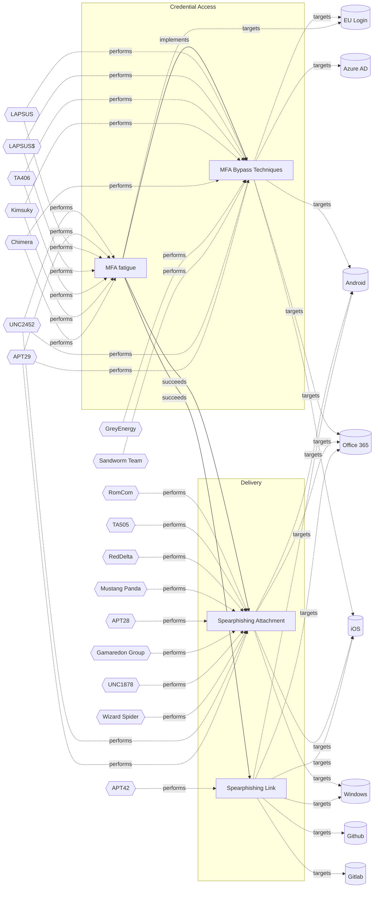

# ☣️ MFA fatigue

🔥 **Criticality:Medium** ❗ : A Medium priority incident may affect public health or safety, national security, economic security, foreign relations, civil liberties, or public confidence. 

🚦 **TLP:CLEAR** ⚪ : Recipients can spread this to the world, there is no limit on disclosure.

🗡️ **ATT&CK Techniques** [T1111 : Multi-Factor Authentication Interception](https://attack.mitre.org/techniques/T1111 'Adversaries may target multi-factor authentication MFA mechanisms, ie, smart cards, token generators, etc to gain access to credentials that can be us'), [T1621 : Multi-Factor Authentication Request Generation](https://attack.mitre.org/techniques/T1621 'Adversaries may attempt to bypass multi-factor authentication MFA mechanisms and gain access to accounts by generating MFA requests sent to usersAdver')

---

`🔑 UUID : 56500aed-5dec-42a8-a275-f1392abac979` **|** `🏷️ Version : 1` **|** `🗓️ Creation Date : 2024-10-21` **|** `🗓️ Last Modification : 2024-11-11` **|** `Sharing Organisation : {'uuid': '56b0a0f0-b0bc-47d9-bb46-02f80ae2065a', 'name': 'EC DIGIT CSOC'}` **|** `🧱 Schema Identifier : tvm::2.0`

## 👁️ Description

> MFA fatigue (aka MFA abuse, MFA bombing or MFA spamming) is a popular technique
> due to its low complexity and high success rate.
> 
> It is a social engineering attack strategy where attackers repeatedly push
> second-factor authentication requests to the target user email, phone, or registered
> devices. The goal is to spam users to the point where they are annoyed by the constant 
> notifications and approve one so it will stop. By doing so, the attacker has effectively 
> bypassed MFA by tricking the user into approving the login attempt.
> 
> The fact that the attacker can trigger MFA push notifications means they obtained
> the credentials of the user. This attack is often preceded by other social engineering
> attack vectors, such as phishing, to gain credentials. Stolen credentials may also
> be acquired from the dark web or via many other attack vectors.
> 
> Attacker may trigger push notifications throughout the day with the hopes that
> one of the attempts will coincide with the user login activity, so the user will
> approve it without suspicion.
> 
> MFA fatigue attack chain unfolds as follows:
> 
> 1. User credentials and information are collected.
> The attack begins with user information already available. The attacker will typically
> have access to a victim username, password, or recovery credentials. This might be
> sourced from preliminary attacks (such as phishing or social engineering) or may have
> been exposed credentials from a larger breach.
> 
> 2. Stolen credentials are used to send MFA push notifications.
> The attackers then use the gained credentials to sign-in to a target account or device
> secured by push multi-factor authentication. Typically, the attacker will attempt
> to activate the authenticating application push notifications in quick succession.
> These push notifications can happen over email, text message, or desktop notification,
> but are generally pushed to the user authenticated mobile device.
> 
> 3. User gets push notifications and becomes fatigued.
> The user will now rapidly receive push notifications as the attacker attempts to
> overwhelm them. The attacker goal is for the victim to push “yes” and confirm their
> identity, allowing the attacker to go further into their account or device.
> Often, the user may think it is a simple application malfunction or a test,
> or just want the notifications to end out of annoyance.
> 

## 🖥️ Terrain 

 > Adversaries must be in possession of the credentials of a valid account. 
> 

---

## 🕸️ Relations

### 🐲 Actors sightings 

| Actor                | Description                                                                                                                                                                                                                                                                                                                                                                                                                                                                                                                                                                                                                                                                                                                                                                                                                                                                                                                                                                                                                                                                                                                                                                                                                                                                                                                                                                                                                                                                                                                                                                                                                                                                                                                                                                                                                                                                                                                                                                                                                                                | Aliases                                                                                                                                                            | Source                     | Sighting               | Reference                |
|:---------------------|:-----------------------------------------------------------------------------------------------------------------------------------------------------------------------------------------------------------------------------------------------------------------------------------------------------------------------------------------------------------------------------------------------------------------------------------------------------------------------------------------------------------------------------------------------------------------------------------------------------------------------------------------------------------------------------------------------------------------------------------------------------------------------------------------------------------------------------------------------------------------------------------------------------------------------------------------------------------------------------------------------------------------------------------------------------------------------------------------------------------------------------------------------------------------------------------------------------------------------------------------------------------------------------------------------------------------------------------------------------------------------------------------------------------------------------------------------------------------------------------------------------------------------------------------------------------------------------------------------------------------------------------------------------------------------------------------------------------------------------------------------------------------------------------------------------------------------------------------------------------------------------------------------------------------------------------------------------------------------------------------------------------------------------------------------------------|:-------------------------------------------------------------------------------------------------------------------------------------------------------------------|:---------------------------|:-----------------------|:-------------------------|
| [Enterprise] Chimera | [Chimera](https://attack.mitre.org/groups/G0114) is a suspected China-based threat group that has been active since at least 2018 targeting the semiconductor industry in Taiwan as well as data from the airline industry.(Citation: Cycraft Chimera April 2020)(Citation: NCC Group Chimera January 2021)                                                                                                                                                                                                                                                                                                                                                                                                                                                                                                                                                                                                                                                                                                                                                                                                                                                                                                                                                                                                                                                                                                                                                                                                                                                                                                                                                                                                                                                                                                                                                                                                                                                                                                                                                |                                                                                                                                                                    | 🗡️ MITRE ATT&CK Groups     | No documented sighting | No documented references |
| [Enterprise] Kimsuky | [Kimsuky](https://attack.mitre.org/groups/G0094) is a North Korea-based cyber espionage group that has been active since at least 2012. The group initially focused on targeting South Korean government entities, think tanks, and individuals identified as experts in various fields, and expanded its operations to include the UN and the government, education, business services, and manufacturing sectors in the United States, Japan, Russia, and Europe. [Kimsuky](https://attack.mitre.org/groups/G0094) has focused its intelligence collection activities on foreign policy and national security issues related to the Korean peninsula, nuclear policy, and sanctions. [Kimsuky](https://attack.mitre.org/groups/G0094) operations have overlapped with those of other North Korean cyber espionage actors likely as a result of ad hoc collaborations or other limited resource sharing.(Citation: EST Kimsuky April 2019)(Citation: Cybereason Kimsuky November 2020)(Citation: Malwarebytes Kimsuky June 2021)(Citation: CISA AA20-301A Kimsuky)(Citation: Mandiant APT43 March 2024)(Citation: Proofpoint TA427 April 2024)[Kimsuky](https://attack.mitre.org/groups/G0094) was assessed to be responsible for the 2014 Korea Hydro & Nuclear Power Co. compromise; other notable campaigns include Operation STOLEN PENCIL (2018), Operation Kabar Cobra (2019), and Operation Smoke Screen (2019).(Citation: Netscout Stolen Pencil Dec 2018)(Citation: EST Kimsuky SmokeScreen April 2019)(Citation: AhnLab Kimsuky Kabar Cobra Feb 2019)North Korean group definitions are known to have significant overlap, and some security researchers report all North Korean state-sponsored cyber activity under the name [Lazarus Group](https://attack.mitre.org/groups/G0032) instead of tracking clusters or subgroups.In 2023, [Kimsuky](https://attack.mitre.org/groups/G0094) has used commercial large language models to assist with vulnerability research, scripting, social engineering and reconnaissance.(Citation: MSFT-AI) | APT43, Black Banshee, Emerald Sleet, Springtail, TA427, THALLIUM, Velvet Chollima                                                                                  | 🗡️ MITRE ATT&CK Groups     | No documented sighting | No documented references |
| TA406                | TA406 is engaging in malware distribution, phishing, intelligence collection, and cryptocurrency theft, resulting in a wide range of criminal activities.                                                                                                                                                                                                                                                                                                                                                                                                                                                                                                                                                                                                                                                                                                                                                                                                                                                                                                                                                                                                                                                                                                                                                                                                                                                                                                                                                                                                                                                                                                                                                                                                                                                                                                                                                                                                                                                                                                  |                                                                                                                                                                    | 🌌 MISP Threat Actor Galaxy | No documented sighting | No documented references |
| [Mobile] LAPSUS$     | [LAPSUS$](https://attack.mitre.org/groups/G1004) is cyber criminal threat group that has been active since at least mid-2021. [LAPSUS$](https://attack.mitre.org/groups/G1004) specializes in large-scale social engineering and extortion operations, including destructive attacks without the use of ransomware. The group has targeted organizations globally, including in the government, manufacturing, higher education, energy, healthcare, technology, telecommunications, and media sectors.(Citation: BBC LAPSUS Apr 2022)(Citation: MSTIC DEV-0537 Mar 2022)(Citation: UNIT 42 LAPSUS Mar 2022)                                                                                                                                                                                                                                                                                                                                                                                                                                                                                                                                                                                                                                                                                                                                                                                                                                                                                                                                                                                                                                                                                                                                                                                                                                                                                                                                                                                                                                               | DEV-0537, Strawberry Tempest                                                                                                                                       | 🗡️ MITRE ATT&CK Groups     | No documented sighting | No documented references |
| LAPSUS               | An actor group conducting large-scale social engineering and extortion campaign against multiple organizations with some seeing evidence of destructive elements.                                                                                                                                                                                                                                                                                                                                                                                                                                                                                                                                                                                                                                                                                                                                                                                                                                                                                                                                                                                                                                                                                                                                                                                                                                                                                                                                                                                                                                                                                                                                                                                                                                                                                                                                                                                                                                                                                          | LAPSUS$, DEV-0537, SLIPPY SPIDER, Strawberry Tempest                                                                                                               | 🌌 MISP Threat Actor Galaxy | No documented sighting | No documented references |
| [Enterprise] APT29   | [APT29](https://attack.mitre.org/groups/G0016) is threat group that has been attributed to Russia's Foreign Intelligence Service (SVR).(Citation: White House Imposing Costs RU Gov April 2021)(Citation: UK Gov Malign RIS Activity April 2021) They have operated since at least 2008, often targeting government networks in Europe and NATO member countries, research institutes, and think tanks. [APT29](https://attack.mitre.org/groups/G0016) reportedly compromised the Democratic National Committee starting in the summer of 2015.(Citation: F-Secure The Dukes)(Citation: GRIZZLY STEPPE JAR)(Citation: Crowdstrike DNC June 2016)(Citation: UK Gov UK Exposes Russia SolarWinds April 2021)In April 2021, the US and UK governments attributed the [SolarWinds Compromise](https://attack.mitre.org/campaigns/C0024) to the SVR; public statements included citations to [APT29](https://attack.mitre.org/groups/G0016), Cozy Bear, and The Dukes.(Citation: NSA Joint Advisory SVR SolarWinds April 2021)(Citation: UK NSCS Russia SolarWinds April 2021) Industry reporting also referred to the actors involved in this campaign as UNC2452, NOBELIUM, StellarParticle, Dark Halo, and SolarStorm.(Citation: FireEye SUNBURST Backdoor December 2020)(Citation: MSTIC NOBELIUM Mar 2021)(Citation: CrowdStrike SUNSPOT Implant January 2021)(Citation: Volexity SolarWinds)(Citation: Cybersecurity Advisory SVR TTP May 2021)(Citation: Unit 42 SolarStorm December 2020)                                                                                                                                                                                                                                                                                                                                                                                                                                                                                                                                                               | Blue Kitsune, Cozy Bear, CozyDuke, Dark Halo, IRON HEMLOCK, IRON RITUAL, Midnight Blizzard, NOBELIUM, NobleBaron, SolarStorm, The Dukes, UNC2452, UNC3524, YTTRIUM | 🗡️ MITRE ATT&CK Groups     | No documented sighting | No documented references |
| UNC2452              | Reporting regarding activity related to the SolarWinds supply chain injection has grown quickly since initial disclosure on 13 December 2020. A significant amount of press reporting has focused on the identification of the actor(s) involved, victim organizations, possible campaign timeline, and potential impact. The US Government and cyber community have also provided detailed information on how the campaign was likely conducted and some of the malware used.  MITRE’s ATT&CK team — with the assistance of contributors — has been mapping techniques used by the actor group, referred to as UNC2452/Dark Halo by FireEye and Volexity respectively, as well as SUNBURST and TEARDROP malware.                                                                                                                                                                                                                                                                                                                                                                                                                                                                                                                                                                                                                                                                                                                                                                                                                                                                                                                                                                                                                                                                                                                                                                                                                                                                                                                                          | DarkHalo, StellarParticle, NOBELIUM, Solar Phoenix, Midnight Blizzard                                                                                              | 🌌 MISP Threat Actor Galaxy | No documented sighting | No documented references |

### 🌊 OpenTide Objects
🚫 No related OpenTide objects indexed.

 --- 

### ⛓️ Threat Chaining

Expand chaining data

| ☣️ Vector                                                                                                                                                                                                            | ⛓️ Link                 | 🎯 Target                                                                                                                                                                                                                                       | ⛰️ Terrain                                                                                                                                                                                                                                                                                                                                                                                                                                                                                                                                                                                                                                                                                                                                                                                                                                                | 🗡️ ATT&CK                                                                                                                                                                                                                                                                                                                                                                                                                                                                                                                                                                                                                                                                                                                                                                                                                                                                                                                                                                                                                                                                               |
|:---------------------------------------------------------------------------------------------------------------------------------------------------------------------------------------------------------------------|:------------------------|:-----------------------------------------------------------------------------------------------------------------------------------------------------------------------------------------------------------------------------------------------|:----------------------------------------------------------------------------------------------------------------------------------------------------------------------------------------------------------------------------------------------------------------------------------------------------------------------------------------------------------------------------------------------------------------------------------------------------------------------------------------------------------------------------------------------------------------------------------------------------------------------------------------------------------------------------------------------------------------------------------------------------------------------------------------------------------------------------------------------------------|:----------------------------------------------------------------------------------------------------------------------------------------------------------------------------------------------------------------------------------------------------------------------------------------------------------------------------------------------------------------------------------------------------------------------------------------------------------------------------------------------------------------------------------------------------------------------------------------------------------------------------------------------------------------------------------------------------------------------------------------------------------------------------------------------------------------------------------------------------------------------------------------------------------------------------------------------------------------------------------------------------------------------------------------------------------------------------------------|
| [MFA fatigue](../Threat%20Vectors/☣️%20MFA%20fatigue.md 'MFA fatigue aka MFA abuse, MFA bombing or MFA spamming is a popular techniquedue to its low complexity and high success rateIt is a social engineering...') | `sequence::succeeds`    | [Spearphishing Link](../Threat%20Vectors/☣️%20Spearphishing%20Link.md 'Adversaries may send spearphishing emails with a malicious link in anattempt to gain access to victim systems This sub-technique employsthe use of lin...')             | Spear phishing requires more preparation and time to achieve success than a phishing attack. That is because spear-phishing attackers attempt to obtain vast amounts of personal information about their victims,   the entities their work for, or their areas of interest.    Attackers can get the personal information they need using different ways: to compromise an email or messaging system trough other means, to use OSINT, scouring Social Media or glean personal information from the user's online presence.                                                                                                                                                                                                                                                                                                                              | [T1566.002 : Phishing: Spearphishing Link](https://attack.mitre.org/techniques/T1566/002 'Adversaries may send spearphishing emails with a malicious link in an attempt to gain access to victim systems Spearphishing with a link is a specific'), [T1036 : Masquerading](https://attack.mitre.org/techniques/T1036 'Adversaries may attempt to manipulate features of their artifacts to make them appear legitimate or benign to users andor security tools Masquerading '), [T1656 : Impersonation](https://attack.mitre.org/techniques/T1656 'Adversaries may impersonate a trusted person or organization in order to persuade and trick a target into performing some action on their behalf For e')                                                                                                                                                                                                                                                                                                                                                                             |
| [MFA fatigue](../Threat%20Vectors/☣️%20MFA%20fatigue.md 'MFA fatigue aka MFA abuse, MFA bombing or MFA spamming is a popular techniquedue to its low complexity and high success rateIt is a social engineering...') | `sequence::succeeds`    | [Spearphishing Attachment](../Threat%20Vectors/☣️%20Spearphishing%20Attachment.md 'Spearphishing messages are often crafted using pernicious social engineeringtechniquesIn Spearphishing Attachment attacks, recipients receive emails t...') | Spear phishing requires more preparation and time to achieve success  than a phishing attack. That is because spear-phishing attackers attempt to obtain vast amounts of personal information about their victims.   Attackers can get the personal information they need using different ways:   - to compromise an email or messaging system trough other means, - to use OSINT, sourcing Social Media or glean personal information from the user's online presence. They want to craft emails that look as legitimate and attractive as possible  to increase the chances of fooling their targets, for instance sending a malicious  attachment where the filename references a topic the recipient is interested in. The highly personalized nature of spear-phishing attacks makes it more  difficult to identity than widescale phishing attacks. | [T1566.001 : Phishing: Spearphishing Attachment](https://attack.mitre.org/techniques/T1566/001 'Adversaries may send spearphishing emails with a malicious attachment in an attempt to gain access to victim systems Spearphishing attachment is a spe')                                                                                                                                                                                                                                                                                                                                                                                                                                                                                                                                                                                                                                                                                                                                                                                                                                |
| [MFA fatigue](../Threat%20Vectors/☣️%20MFA%20fatigue.md 'MFA fatigue aka MFA abuse, MFA bombing or MFA spamming is a popular techniquedue to its low complexity and high success rateIt is a social engineering...') | `atomicity::implements` | [MFA Bypass Techniques](../Threat%20Vectors/☣️%20MFA%20Bypass%20Techniques.md 'MFA is a technique that requires more than one piece of evidence to authorize the user to access a resource If two pieces of evidence are needed to ve...')     | Sufficient reconnaissance to identify a target account and MFA technologies being used.                                                                                                                                                                                                                                                                                                                                                                                                                                                                                                                                                                                                                                                                                                                                                                   | [T1111](https://attack.mitre.org/techniques/T1111 'Adversaries may target multi-factor authentication MFA mechanisms, ie, smart cards, token generators, etc to gain access to credentials that can be us'), [T1621](https://attack.mitre.org/techniques/T1621 'Adversaries may attempt to bypass multi-factor authentication MFA mechanisms and gain access to accounts by generating MFA requests sent to usersAdver'), [T1566.001](https://attack.mitre.org/techniques/T1566/001 'Adversaries may send spearphishing emails with a malicious attachment in an attempt to gain access to victim systems Spearphishing attachment is a spe'), [T1566.002](https://attack.mitre.org/techniques/T1566/002 'Adversaries may send spearphishing emails with a malicious link in an attempt to gain access to victim systems Spearphishing with a link is a specific'), [T1566.004](https://attack.mitre.org/techniques/T1566/004 'Adversaries may use voice communications to ultimately gain access to victim systems Spearphishing voice is a specific variant of spearphishing It is ') |

&nbsp; 

---

## Model Data

#### **⛓️ Cyber Kill Chain**

 > Cyber attacks are typically phased progressions towards strategic objectives. The Unified Kill Chains provides insight into the tactics that hackers employ to attain these objectives. This provides a solid basis to develop (or realign) defensive strategies to raise cyber resilience.

 [`🔑 Credential Access`](https://www.unifiedkillchain.com/assets/The-Unified-Kill-Chain.pdf) : Techniques resulting in the access of, or control over, system, service or domain credentials.

---

#### **🛰️ Domains**

 > Infrastructure technologies domain of interest to attackers.

  - `🏢 Enterprise` : Generic databases, applications, machines and systems that are usually on premises or on Cloud traditional VMs.
 - `☁️ Public Cloud` : Infrastructure handled by a commercial cloud provider. Managed mostly on a service level, and connected over the internet.

---

#### **🎯 Targets**

 > Granular delimited technical entities holding a value to the organization, that are targeted by adversaries. They might be also involved in the detection coverage as the target of log collection. Partially inspired by Veris.

  - [`🔐 Auth token`](http://veriscommunity.net/enums.html#section-asset) : User Device - Authentication token or device
 - [`☁️ Cloud Portal`](http://veriscommunity.net/enums.html#section-asset) : Placeholder
 - [`👤 End-user`](http://veriscommunity.net/enums.html#section-asset) : People - End-user
 - [`👤 Helpdesk`](http://veriscommunity.net/enums.html#section-asset) : People - Helpdesk
 - [`👤 Identity Services`](http://veriscommunity.net/enums.html#section-asset) : Placeholder
 - [`📱 Mobile phone`](http://veriscommunity.net/enums.html#section-asset) : User Device - Mobile phone or smartphone

---

#### **💿 Platforms concerned**

 > Actual technologies used by the organization that will be exploited by adversaries during a successful attack, and eventually of relevance for detection. Are named by commercial designation.

 ` EU Login` : Placeholder

---

#### **💣 Severity**

 > The severity summarizes the overall danger of incident the vector will provoke, and is to be derived (WIP) from impact, leverage, and difficulty to execute.

 [`⚠️ Significant incident`](https://www.ncsc.gov.uk/news/new-cyber-attack-categorisation-system-improve-uk-response-incidents) : A cyber attack which has a serious impact on a large organisation or on wider / local government, or which poses a considerable risk to central government or (inter)national essential services.

---

#### **🪄 Leverage acquisition**

 > Technical aftermath of the attack from the target perspective, differentiated from impact as it does not consider the value of the consequence, only what increased control the vector execution provides to the adversary.

  - [`💅 Elevation of privilege`](https://owasp.org/www-community/Threat_Modeling_Process#stride) : Capacity to augment leverage over the target system by upgrading the compromised access rights
 - [`👻 Spoofing`](https://owasp.org/www-community/Threat_Modeling_Process#stride) : Threat action aimed at accessing and use of another user’s credentials, such as username and password.

---

#### **💥 Impact**

 > Analysis of the threat vector from the organizational perspective, in non technical term. This aims at putting a clear denomination on what the attacker will actually be able to act upon if the threat vector is realized.

 [`🥸 Identity Theft`](http://veriscommunity.net/enums.html#section-impact) : Acquisition of sufficient information and privileges to profess as a given individual, for the purpose of abusing and deceiving human trust relationships.

---

#### **🎲 Vector Viability**

 > Described with estimative language (likelyhood probability), describes how likely the analyst believes the vector to actually be realized on the organization infrastructure. Estimative language describes quality and credibility of underlying sources, data, and methodologies based Intelligence Community Directive 203 (ICD 203) and JP 2-0, Joint Intelligence.

 [`🧐 Likely`](https://www.dni.gov/files/documents/ICD/ICD%20203%20Analytic%20Standards.pdf) : Probable (probably) - 55-80%

---

### 🔗 References

**🕊️ Publicly available resources**

- [_1_] https://www.bleepingcomputer.com/news/microsoft/microsoft-confirms-they-were-hacked-by-lapsus-extortion-group/
- [_2_] https://www.bleepingcomputer.com/news/security/uber-hacked-internal-systems-breached-and-vulnerability-reports-stolen/
- [_3_] https://www.beyondtrust.com/blog/entry/midnight-blizzard-and-modern-identity-based-attacks

[1]: https://www.bleepingcomputer.com/news/microsoft/microsoft-confirms-they-were-hacked-by-lapsus-extortion-group/
[2]: https://www.bleepingcomputer.com/news/security/uber-hacked-internal-systems-breached-and-vulnerability-reports-stolen/
[3]: https://www.beyondtrust.com/blog/entry/midnight-blizzard-and-modern-identity-based-attacks

---

#### 🏷️ Tags

#-, #-, #-, #
, #
, ##, ##, ##, ##, # , #🏷, #️, # , #T, #a, #g, #s, #
, #

