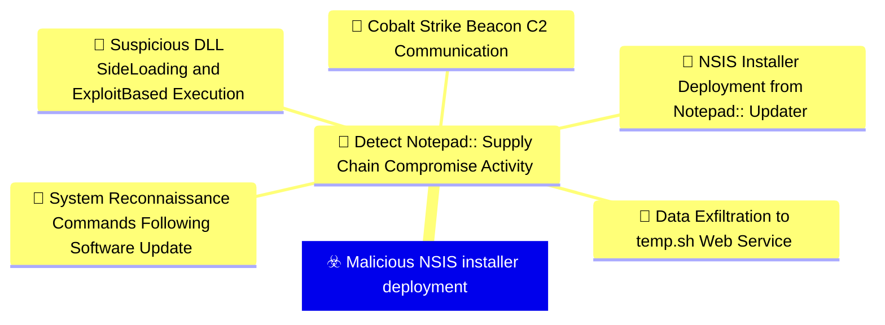
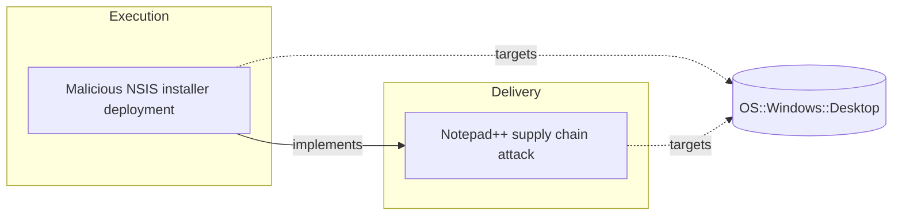

# ☣️ Malicious NSIS installer deployment

🔥 **Criticality:High** ⚠️ : A High priority incident is likely to result in a demonstrable impact to public health or safety, national security, economic security, foreign relations, civil liberties, or public confidence. 

🚦 **TLP:CLEAR** ⚪ : Recipients can spread this to the world, there is no limit on disclosure.


🗡️ **ATT&CK Techniques** [T1204.002 : User Execution: Malicious File](https://attack.mitre.org/techniques/T1204/002 'An adversary may rely upon a user opening a malicious file in order to gain execution Users may be subjected to social engineering to get them to open'), [T1059 : Command and Scripting Interpreter](https://attack.mitre.org/techniques/T1059 'Adversaries may abuse command and script interpreters to execute commands, scripts, or binaries These interfaces and languages provide ways of interac')


---

`🔑 UUID : 52462685-bebb-4e86-94b0-fd46aeacb085` **|** `🏷️ Version : 1` **|** `🗓️ Creation Date : 2026-02-09` **|** `🗓️ Last Modification : 2026-02-09` **|** `Sharing Organisation : {'uuid': '56b0a0f0-b0bc-47d9-bb46-02f80ae2065a', 'name': 'EC DIGIT CSOC'}` **|** `🧱 Schema Identifier : tvm::2.1`


## 👁️ Description

> ## Overview
> 
> Malicious NSIS (Nullsoft Scriptable Install System) installers are being weaponized 
> in supply chain attacks to deploy various payloads on victim systems. This technique 
> was observed in the Notepad++ supply chain attack where three distinct infection 
> chains leveraged NSIS installers with different payloads and behaviors.
> 
> ## Technical Details
> 
> ### NSIS Runtime Behavior
> 
> When executed, NSIS installers create a temporary directory at runtime:
> 
> ```
> %localappdata%\Temp\ns<random>.tmp
> ```
> 
> This directory creation is a key detection indicator for NSIS installer execution, 
> both legitimate and malicious.
> 
> ### Infection Chain #1 - ProShow Exploit (1MB Size)
> 
> **Behavior:**
> - Sends heartbeat with system information to command and control
> - Drops ProShow exploit payload
> - Collects victim telemetry
> 
> **Indicators:**
> - SHA1: 8e6e505438c21f3d281e1cc257abdbf7223b7f5a
> - SHA1: 90e677d7ff5844407b9c073e3b7e896e078e11cd
> 
> ### Infection Chain #2 - Lua Interpreter (140KB Size)
> 
> **Behavior:**
> - Collects detailed system information
> - Drops Lua interpreter with malicious script
> - Establishes persistence mechanism
> 
> **Indicators:**
> - SHA1: 573549869e84544e3ef253bdba79851dcde4963a
> - SHA1: 13179c8f19fbf3d8473c49983a199e6cb4f318f0
> 
> ### Infection Chain #3 - DLL Sideloading
> 
> **Behavior:**
> - Drops BluetoothService DLL sideloading components
> - Establishes stealth execution capability
> - Maintains persistence via legitimate-looking service
> 
> **Indicators:**
> - SHA1: 4c9aac447bf732acc97992290aa7a187b967ee2c
> - SHA1: 821c0cafb2aab0f063ef7e313f64313fc81d46cd
> 
> ## Detection Guidance
> 
> ### File System Monitoring
> 
> Monitor for NSIS temporary directory creation patterns:
> 
> ```
> File Creation: %localappdata%\Temp\ns*.tmp\*
> Parent Process: updater.exe, or unexpected processes
> ```
> 
> ### Hash-Based Detection
> 
> Monitor for known malicious updater.exe hashes:
> - 8e6e505438c21f3d281e1cc257abdbf7223b7f5a
> - 90e677d7ff5844407b9c073e3b7e896e078e11cd
> - 573549869e84544e3ef253bdba79851dcde4963a
> - 13179c8f19fbf3d8473c49983a199e6cb4f318f0
> - 4c9aac447bf732acc97992290aa7a187b967ee2c
> - 821c0cafb2aab0f063ef7e313f64313fc81d46cd
> 
> ### Behavioral Detection
> 
> 1. **Unexpected NSIS Execution**
>    - NSIS installers executing from unusual locations
>    - User directories, temp folders, browser cache
> 
> 2. **Network Communication**
>    - Outbound connections from installer processes
>    - Heartbeat traffic with system telemetry
> 
> 3. **Payload Dropping**
>    - Lua interpreter deployment in non-standard locations
>    - DLL files dropped alongside legitimate executables
>    - ProShow-related files in unexpected directories
> 
> ### Process Monitoring
> 
> ```
> Process: *.exe
> CommandLine Contains: "updater.exe"
> File Size: 140KB or 1MB (typical malicious sizes)
> Parent Process: explorer.exe, browser processes
> Child Processes: lua.exe, rundll32.exe, regsvr32.exe
> ```
> 
> ## Mitigation Recommendations
> 
> 1. **Software Update Controls**
>    - Verify digital signatures on all installers
>    - Implement application control policies
>    - Whitelist legitimate update mechanisms
> 
> 2. **Network Segmentation**
>    - Restrict outbound connections from installer processes
>    - Monitor C2 communication patterns
> 
> 3. **Endpoint Detection**
>    - Deploy EDR solutions with NSIS installer monitoring
>    - Alert on ns*.tmp directory creation from suspicious processes
> 
> 4. **User Awareness**
>    - Train users to verify software sources
>    - Warn against running installers from unexpected locations
>    - Implement prompt for administrator approval on installations
> 


## 🖥️ Terrain 

 > Targeted systems are Windows-based workstations and laptops where legitimate software 
> update mechanisms exist. The attack leverages NSIS (Nullsoft Scriptable Install System) 
> installers to masquerade as legitimate software updates, particularly targeting 
> developer environments and end-user workstations. The NSIS framework creates temporary 
> directories during runtime that can serve as indicators of compromise.
> 

---

## 🕸️ Relations


### 🌊 OpenTide Objects




 **Descendants** 

| 🎯 Detection Objectives                                                                                                                                                                                                                                                                                        | 📡 Detection Objective Signals (5)                                                                                                                                                                                                                                                                                                                                                                                                                                                                                                                                                                                                                                                                                                                                                                                                                                                                                                                                                                                                                                                                                                                                                                                                                                                                                                                                                                                                                                                                                                                                                                                                                                                                                                                                                                                                                                                                                                  | 🛡️ Detection Models    | 🚨 Detection Rules    |
|:--------------------------------------------------------------------------------------------------------------------------------------------------------------------------------------------------------------------------------------------------------------------------------------------------------------|:-----------------------------------------------------------------------------------------------------------------------------------------------------------------------------------------------------------------------------------------------------------------------------------------------------------------------------------------------------------------------------------------------------------------------------------------------------------------------------------------------------------------------------------------------------------------------------------------------------------------------------------------------------------------------------------------------------------------------------------------------------------------------------------------------------------------------------------------------------------------------------------------------------------------------------------------------------------------------------------------------------------------------------------------------------------------------------------------------------------------------------------------------------------------------------------------------------------------------------------------------------------------------------------------------------------------------------------------------------------------------------------------------------------------------------------------------------------------------------------------------------------------------------------------------------------------------------------------------------------------------------------------------------------------------------------------------------------------------------------------------------------------------------------------------------------------------------------------------------------------------------------------------------------------------------------|:-----------------------|:---------------------|
| [Detect Notepad++ Supply Chain Compromise Activity](../Detection%20Objectives/🎯%20Detect%20Notepad++%20Supply%20Chain%20Compromise%20Activity.md 'This detection objective addresses the sophisticated supply chain compromiseof Notepad update infrastructure that occurred between July and October 20...') | [Detect Notepad++ Supply Chain Compromise Activity::System Reconnaissance Commands Following Software Update](Detect%20Notepad++%20Supply%20Chain%20Compromise%20Activity#system-reconnaissance-commands-following-software-update.md 'Detects sequences of system reconnaissance commands characteristic of theNotepad supply chain attack discovery phase Attackers executed combinationsof...')<br>[Detect Notepad++ Supply Chain Compromise Activity::Suspicious DLL Side-Loading and Exploit-Based Execution](Detect%20Notepad++%20Supply%20Chain%20Compromise%20Activity#suspicious-dll-side-loading-and-exploit-based-execution.md 'Detects malicious execution via legitimate software abuse, including DLLside-loading and exploitation of vulnerable legitimate executables TheNotepad ...')<br>[Detect Notepad++ Supply Chain Compromise Activity::Data Exfiltration to temp.sh Web Service](Detect%20Notepad++%20Supply%20Chain%20Compromise%20Activity#data-exfiltration-to-temp.sh-web-service.md 'Detects data exfiltration to the tempsh temporary file sharing service,used by attackers to stage reconnaissance data and avoid direct C2 communicatio...')<br>[Detect Notepad++ Supply Chain Compromise Activity::NSIS Installer Deployment from Notepad++ Updater](Detect%20Notepad++%20Supply%20Chain%20Compromise%20Activity#nsis-installer-deployment-from-notepad++-updater.md 'Detects the execution of NSIS Nullsoft Scriptable Install System installerslaunched by GUPexe, the legitimate Notepad update component The maliciousup...')<br>[Detect Notepad++ Supply Chain Compromise Activity::Cobalt Strike Beacon C2 Communication](Detect%20Notepad++%20Supply%20Chain%20Compromise%20Activity#cobalt-strike-beacon-c2-communication.md 'Detects network communication to known Cobalt Strike C2 infrastructureassociated with the Notepad supply chain campaign All observed infectionchains u...') | ❌ No Detection Models  | ❌ No Detection Rules |


 --- 

### ⛓️ Threat Chaining




<details>
<summary>Expand chaining data</summary>

| ☣️ Vector                                                                                                                                                                                                                                                                | ⛓️ Link                 | 🎯 Target                                                                                                                                                                                                                                                     | ⛰️ Terrain                                                                                                                                                                                                                                                                                                                                                                                                    | 🗡️ ATT&CK                                                                                                                                                                                                                                                                                                                                                                                                                                                                                                                                                                                                                                                                                                                                                                                                                                                                                                                                                                                                       |
|:-------------------------------------------------------------------------------------------------------------------------------------------------------------------------------------------------------------------------------------------------------------------------|:------------------------|:-------------------------------------------------------------------------------------------------------------------------------------------------------------------------------------------------------------------------------------------------------------|:--------------------------------------------------------------------------------------------------------------------------------------------------------------------------------------------------------------------------------------------------------------------------------------------------------------------------------------------------------------------------------------------------------------|:----------------------------------------------------------------------------------------------------------------------------------------------------------------------------------------------------------------------------------------------------------------------------------------------------------------------------------------------------------------------------------------------------------------------------------------------------------------------------------------------------------------------------------------------------------------------------------------------------------------------------------------------------------------------------------------------------------------------------------------------------------------------------------------------------------------------------------------------------------------------------------------------------------------------------------------------------------------------------------------------------------------|
| [Malicious NSIS installer deployment](../Threat%20Vectors/☣️%20Malicious%20NSIS%20installer%20deployment.md '## OverviewMalicious NSIS Nullsoft Scriptable Install System installers are being weaponized in supply chain attacks to deploy various payloads on vic...') | `atomicity::implements` | [Notepad++ supply chain attack](../Threat%20Vectors/☣️%20Notepad++%20supply%20chain%20attack.md '## Executive SummaryOn February 2, 2026, Notepad developers disclosed a critical supply chain compromise affecting their update infrastructure The att...') | Organizations and individuals using Notepad++ text editor on Windows systems,  particularly those with automatic update mechanisms enabled. The attack targeted  the legitimate update infrastructure, delivering malicious payloads disguised  as authentic software updates. Victims were distributed globally across multiple  sectors including government, financial services, and IT service providers. | [T1195.002 : Supply Chain Compromise: Compromise Software Supply Chain](https://attack.mitre.org/techniques/T1195/002 'Adversaries may manipulate application software prior to receipt by a final consumer for the purpose of data or system compromise Supply chain comprom'), [T1071 : Application Layer Protocol](https://attack.mitre.org/techniques/T1071 'Adversaries may communicate using OSI application layer protocols to avoid detectionnetwork filtering by blending in with existing traffic Commands to'), [T1059 : Command and Scripting Interpreter](https://attack.mitre.org/techniques/T1059 'Adversaries may abuse command and script interpreters to execute commands, scripts, or binaries These interfaces and languages provide ways of interac'), [T1574 : Hijack Execution Flow](https://attack.mitre.org/techniques/T1574 'Adversaries may execute their own malicious payloads by hijacking the way operating systems run programs Hijacking execution flow can be for the purpo') |

</details>
&nbsp; 


---

## Model Data

#### **⛓️ Cyber Kill Chain**

 > Cyber attacks are typically phased progressions towards strategic objectives. The Unified Kill Chains provides insight into the tactics that hackers employ to attain these objectives. This provides a solid basis to develop (or realign) defensive strategies to raise cyber resilience.

 [`⚡ Execution`](https://www.unifiedkillchain.com/assets/The-Unified-Kill-Chain.pdf) : Techniques that result in execution of attacker-controlled code on a local or remote system.

---

#### **💣 Severity**

 > The severity summarizes the overall danger of incident the vector will provoke, and is to be derived (WIP) from impact, leverage, and difficulty to execute.

 [`⚠️ Significant incident`](https://www.ncsc.gov.uk/news/new-cyber-attack-categorisation-system-improve-uk-response-incidents) : A cyber attack which has a serious impact on a large organisation or on wider / local government, or which poses a considerable risk to central government or (inter)national essential services.

---

#### **🪄 Leverage acquisition**

 > Technical aftermath of the attack from the target perspective, differentiated from impact as it does not consider the value of the consequence, only what increased control the vector execution provides to the adversary.

  - [`📦 Software installation`](https://owasp.org/www-community/Threat_Modeling_Process#stride) : Software installation or code modification
 - [`💀 Infrastructure Compromise`](https://owasp.org/www-community/Threat_Modeling_Process#stride) : The compromised target is likely to be used to further expand the sphere of influence of the attacker and allow more potent vectors to be executed.
 - [`🐒 Tampering`](https://owasp.org/www-community/Threat_Modeling_Process#stride) : Threat action intending to maliciously change or modify persistent data, such as records in a database, and the alteration of data in transit between two computers over an open network, such as the Internet.

---

#### **💥 Impact**

 > Analysis of the threat vector from the organizational perspective, in non technical term. This aims at putting a clear denomination on what the attacker will actually be able to act upon if the threat vector is realized.

  - [`🔓 Data Breach`](http://veriscommunity.net/enums.html#section-impact) : Non-public information has been accessed from the outside, and successfully extracted.
 - [`🤬 Lose Capabilities`](http://veriscommunity.net/enums.html#section-impact) : Vector execution will remove key functions to the organization, which will not be easily circumvented. Most day-to-day is heavily impaired, but processes can reorganize at a loss.
 - [`🛑 Business disruption`](http://veriscommunity.net/enums.html#section-impact) : Business disruption
 - [`🌍 Reputational Damages`](http://veriscommunity.net/enums.html#section-impact) : Damages to the organization public view may be achieved by using directly the access gained, or indirectly with data gathered.

---

#### **🎲 Vector Viability**

 > Described with estimative language (likelyhood probability), describes how likely the analyst believes the vector to actually be realized on the organization infrastructure. Estimative language describes quality and credibility of underlying sources, data, and methodologies based Intelligence Community Directive 203 (ICD 203) and JP 2-0, Joint Intelligence.

 [`🧐 Likely`](https://www.dni.gov/files/documents/ICD/ICD%20203%20Analytic%20Standards.pdf) : Probable (probably) - 55-80%

---


## 🌐 Threat Surface

- ` OS::Windows::Desktop` — Microsoft Windows desktop editions


### 🔗 References


**🕊️ Publicly available resources**

- [_1_] https://securelist.com/notepad-supply-chain-attack/115382/
- [_2_] https://www.rapid7.com/blog/post/2026/02/03/notepad-plus-plus-supply-chain-compromise/

[1]: https://securelist.com/notepad-supply-chain-attack/115382/
[2]: https://www.rapid7.com/blog/post/2026/02/03/notepad-plus-plus-supply-chain-compromise/

---

#### 🏷️ Tags

#-, #-, #-, #
, #
, ##, ##, ##, ##, # , #🏷, #️, # , #T, #a, #g, #s, #
, #


