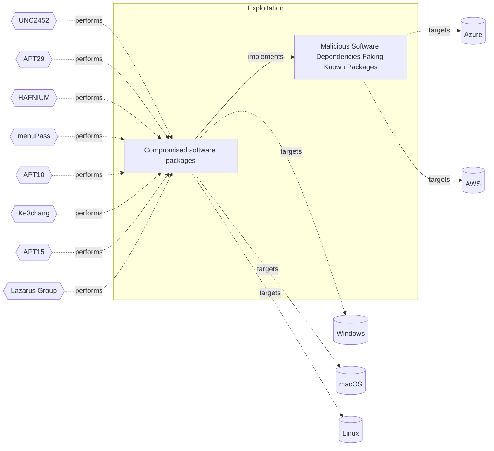

# ☣️ Malicious Software Dependencies Faking Known Packages

🔥 **Criticality:Medium** ❗ : A Medium priority incident may affect public health or safety, national security, economic security, foreign relations, civil liberties, or public confidence. 

🚦 **TLP:CLEAR** ⚪ : Recipients can spread this to the world, there is no limit on disclosure.

🗡️ **ATT&CK Techniques** [T1195 : Supply Chain Compromise](https://attack.mitre.org/techniques/T1195 'Adversaries may manipulate products or product delivery mechanisms prior to receipt by a final consumer for the purpose of data or system compromiseSu')

---

`🔑 UUID : 78683822-44dc-41ac-8fef-b5f0968743c9` **|** `🏷️ Version : 3` **|** `🗓️ Creation Date : 2022-04-05` **|** `🗓️ Last Modification : 2025-10-01` **|** `Sharing Organisation : {'uuid': '56b0a0f0-b0bc-47d9-bb46-02f80ae2065a', 'name': 'EC DIGIT CSOC'}` **|** `🧱 Schema Identifier : tvm::2.0`

## 👁️ Description

> Adversaries maymimick known and trusted software packages and
> distributors, with the intent to be mistaken for the original developer,
> and thus deliver malicious code that will be embedded in the
> victim's applications. They may use sophisticated automation
> to appear convincing and fool the target. Once delivered, the package may
> contain any payload, from crypto mining, to credential theft, command and control etc.

## 🖥️ Terrain 

 > Software development performed internally need to rely on
> external dependencies, and sources are not rigorously checked.
> 

---

## 🕸️ Relations

### 🌊 OpenTide Objects
🚫 No related OpenTide objects indexed.

 --- 

### ⛓️ Threat Chaining

Expand chaining data

| ☣️ Vector                                                                                                                                                                                                                                                  | ⛓️ Link                 | 🎯 Target                                                                                                                                                                                                                                                                                                         | ⛰️ Terrain                                                                                                               | 🗡️ ATT&CK                                                                                                                                                                                                                             |
|:-----------------------------------------------------------------------------------------------------------------------------------------------------------------------------------------------------------------------------------------------------------|:------------------------|:-----------------------------------------------------------------------------------------------------------------------------------------------------------------------------------------------------------------------------------------------------------------------------------------------------------------|:-------------------------------------------------------------------------------------------------------------------------|:--------------------------------------------------------------------------------------------------------------------------------------------------------------------------------------------------------------------------------------|
| [Compromised software packages](../Threat%20Vectors/☣️%20Compromised%20software%20packages.md 'Compromised software packages in a supply chain attack refer to theintentional or unintentional inclusion of malicious code or vulnerabilitiesin softw...') | `atomicity::implements` | [Malicious Software Dependencies Faking Known Packages](../Threat%20Vectors/☣️%20Malicious%20Software%20Dependencies%20Faking%20Known%20Packages.md 'Adversaries maymimick known and trusted software packages anddistributors, with the intent to be mistaken for the original developer,and thus deliver ...') | Software development performed internally need to rely on external dependencies, and sources are not rigorously checked. | [T1195 : Supply Chain Compromise](https://attack.mitre.org/techniques/T1195 'Adversaries may manipulate products or product delivery mechanisms prior to receipt by a final consumer for the purpose of data or system compromiseSu') |

&nbsp; 

---

## Model Data

#### **⛓️ Cyber Kill Chain**

 > Cyber attacks are typically phased progressions towards strategic objectives. The Unified Kill Chains provides insight into the tactics that hackers employ to attain these objectives. This provides a solid basis to develop (or realign) defensive strategies to raise cyber resilience.

 [`💥 Exploitation`](https://www.unifiedkillchain.com/assets/The-Unified-Kill-Chain.pdf) : Techniques to exploit vulnerabilities in systems that may, amongst others, result in code execution.

---

#### **🛰️ Domains**

 > Infrastructure technologies domain of interest to attackers.

  - `🏢 Enterprise` : Generic databases, applications, machines and systems that are usually on premises or on Cloud traditional VMs.
 - `☁️ Public Cloud` : Infrastructure handled by a commercial cloud provider. Managed mostly on a service level, and connected over the internet.
 - `☁️ Private Cloud` : Infrastructure hosted at a third party, but based on custom specification and managed on a platform level.

---

#### **🎯 Targets**

 > Granular delimited technical entities holding a value to the organization, that are targeted by adversaries. They might be also involved in the detection coverage as the target of log collection. Partially inspired by Veris.

  - [`🛠️ Software Containers`](http://veriscommunity.net/enums.html#section-asset) : Placeholder
 - [`💿 Production Software`](http://veriscommunity.net/enums.html#section-asset) : Placeholder
 - [`🛠️ CI/CD Pipelines`](http://veriscommunity.net/enums.html#section-asset) : CI/CD pipelines automate the process of building, testing, and deploying software, ensuring efficient and reliable software delivery.
 - [`🛠️ Code Repositories`](http://veriscommunity.net/enums.html#section-asset) : Code repositories provide a centralized location for storing and managing source code, enabling version control, collaboration, and code sharing among developers.
 - [`🛠️ Software Development Tools`](http://veriscommunity.net/enums.html#section-asset) : Placeholder

---

#### **💿 Platforms concerned**

 > Actual technologies used by the organization that will be exploited by adversaries during a successful attack, and eventually of relevance for detection. Are named by commercial designation.

  - ` Azure` : Placeholder
 - ` AWS` : Placeholder

---

#### **💣 Severity**

 > The severity summarizes the overall danger of incident the vector will provoke, and is to be derived (WIP) from impact, leverage, and difficulty to execute.

 [`🔥 Substantial incident`](https://www.ncsc.gov.uk/news/new-cyber-attack-categorisation-system-improve-uk-response-incidents) : A cyber attack which has a serious impact on a medium-sized organisation, or which poses a considerable risk to a large organisation or wider / local government.

---

#### **🪄 Leverage acquisition**

 > Technical aftermath of the attack from the target perspective, differentiated from impact as it does not consider the value of the consequence, only what increased control the vector execution provides to the adversary.

  - [`💅 Elevation of privilege`](https://owasp.org/www-community/Threat_Modeling_Process#stride) : Capacity to augment leverage over the target system by upgrading the compromised access rights
 - [`💀 Infrastructure Compromise`](https://owasp.org/www-community/Threat_Modeling_Process#stride) : The compromised target is likely to be used to further expand the sphere of influence of the attacker and allow more potent vectors to be executed.
 - [`👁️‍🗨️ Information Disclosure`](https://owasp.org/www-community/Threat_Modeling_Process#stride) : Threat action intending to read a file that one was not granted access to, or to read data in transit.

---

#### **💥 Impact**

 > Analysis of the threat vector from the organizational perspective, in non technical term. This aims at putting a clear denomination on what the attacker will actually be able to act upon if the threat vector is realized.

  - [`🔓 Data Breach`](http://veriscommunity.net/enums.html#section-impact) : Non-public information has been accessed from the outside, and successfully extracted.
 - [`🩼 Impairement`](http://veriscommunity.net/enums.html#section-impact) : Incapacitation of a particular key system that will cause disruptions in day-to-day operations, and eventually service delivery.

---

#### **🎲 Vector Viability**

 > Described with estimative language (likelyhood probability), describes how likely the analyst believes the vector to actually be realized on the organization infrastructure. Estimative language describes quality and credibility of underlying sources, data, and methodologies based Intelligence Community Directive 203 (ICD 203) and JP 2-0, Joint Intelligence.

 [`🧐 Likely`](https://www.dni.gov/files/documents/ICD/ICD%20203%20Analytic%20Standards.pdf) : Probable (probably) - 55-80%

---

### 🔗 References

**🕊️ Publicly available resources**

- [_1_] https://jfrog.com/blog/large-scale-npm-attack-targets-azure-developers-with-malicious-packages/

[1]: https://jfrog.com/blog/large-scale-npm-attack-targets-azure-developers-with-malicious-packages/

---

#### 🏷️ Tags

#-, #-, #-, #
, #
, ##, ##, ##, ##, # , #🏷, #️, # , #T, #a, #g, #s, #
, #

