# ☣️ Mimikatz browser cookie extraction

🔥 **Criticality:High** ⚠️ : A High priority incident is likely to result in a demonstrable impact to public health or safety, national security, economic security, foreign relations, civil liberties, or public confidence. 

🚦 **TLP:CLEAR** ⚪ : Recipients can spread this to the world, there is no limit on disclosure.

🗡️ **ATT&CK Techniques** [T1111 : Multi-Factor Authentication Interception](https://attack.mitre.org/techniques/T1111 'Adversaries may target multi-factor authentication MFA mechanisms, ie, smart cards, token generators, etc to gain access to credentials that can be us')

---

`🔑 UUID : 630f420b-b844-42f1-8be1-d367b3734024` **|** `🏷️ Version : 1` **|** `🗓️ Creation Date : 2024-11-05` **|** `🗓️ Last Modification : 2024-11-05` **|** `Sharing Organisation : {'uuid': '56b0a0f0-b0bc-47d9-bb46-02f80ae2065a', 'name': 'EC DIGIT CSOC'}` **|** `🧱 Schema Identifier : tvm::2.0`

## 👁️ Description

> We describe how an attacker could extract cookies using the example of the Chrome browser.
> 
> Chrome stores cookies in the following location in a SQLite database:
> %localappdata%GoogleChromeUser DataDefaultCookies
> 
> The cookies for a given user are encrypted using keys tied to that user via the
> Microsoft Data Protection API (DPAPI). To access the cookie database and decrypt 
> the cookies, an adversary can use the following mimikatz command:
> 
> dpapi::chrome /in:"%localappdata%GoogleChromeUser DataDefaultCookies" /unprotect
> 
> Alternatively, adversaries could execute the following from the command line:
> mimikatz.exe privilege::debug log "dpapi::chrome /in:%localappdata%googlechromeUSERDA~1defaultcookies /unprotect" exit
> 
> Using either of these options will provide the browser cookies.
> 
> 
> ## PtC attack scenario
> 
> 1. A sysadmin uses regularly the Azure management portal, MFA is enabled with the authenticator
>    app on his mobile device.
>     
>    He has clicked on a phishing email or his system has been compromised by some other means,
>    and now an attacker is able to execute code within the user context.
> 
> 2. Execute Mimikatz when running as the user
>    mimikatz.exe privilege::debug log "dpapi::chrome /in:%localappdata%googlechromeUSERDA~1defaultcookies /unprotect" exit
>     
>    Attackers look for the Azure authentication cookies, including ESTSAUTH, ESTSAUTHPERSISTENT and ESTSAUTHLIGHT.
>     
> 3. To pass the cookies into another session to take over the user account, opening Chrome on another server
>    and use the “Inspect” interface to insert a cookie.
>     
>     Add the ESTSAUTH or If ESTSAUTHPERSISTENT cookie. If ESTSAUTHPERSISTENT is available, it is preferred because
>     it is generated by the “Stay Signed In” option.     
> 
> 4. Refresh the page and now attackers are logged into Azure as the user — no MFA required.
> 

## 🖥️ Terrain 

 > Attacker must compromise a user endpoint and exfiltrate the browser cookies.
> Cookies can be found on disk, in the process memory of the browser, and in
> network traffic to remote systems.
> 

---

## 🕸️ Relations

### 🐲 Actors sightings 

| Actor                  | Description                                                                                                                                                                                                                                                                                                                                                                                                                                                                                                                                                                                                                                                                                                                                                                                                                                                                                                                                                                                                                                                                                                                                                                                                                                                                                                                                                                                                                                                                                                                                                   | Aliases                                                                                                                                                            | Source                     | Sighting               | Reference                |
|:-----------------------|:--------------------------------------------------------------------------------------------------------------------------------------------------------------------------------------------------------------------------------------------------------------------------------------------------------------------------------------------------------------------------------------------------------------------------------------------------------------------------------------------------------------------------------------------------------------------------------------------------------------------------------------------------------------------------------------------------------------------------------------------------------------------------------------------------------------------------------------------------------------------------------------------------------------------------------------------------------------------------------------------------------------------------------------------------------------------------------------------------------------------------------------------------------------------------------------------------------------------------------------------------------------------------------------------------------------------------------------------------------------------------------------------------------------------------------------------------------------------------------------------------------------------------------------------------------------|:-------------------------------------------------------------------------------------------------------------------------------------------------------------------|:---------------------------|:-----------------------|:-------------------------|
| [Enterprise] APT29     | [APT29](https://attack.mitre.org/groups/G0016) is threat group that has been attributed to Russia's Foreign Intelligence Service (SVR).(Citation: White House Imposing Costs RU Gov April 2021)(Citation: UK Gov Malign RIS Activity April 2021) They have operated since at least 2008, often targeting government networks in Europe and NATO member countries, research institutes, and think tanks. [APT29](https://attack.mitre.org/groups/G0016) reportedly compromised the Democratic National Committee starting in the summer of 2015.(Citation: F-Secure The Dukes)(Citation: GRIZZLY STEPPE JAR)(Citation: Crowdstrike DNC June 2016)(Citation: UK Gov UK Exposes Russia SolarWinds April 2021)In April 2021, the US and UK governments attributed the [SolarWinds Compromise](https://attack.mitre.org/campaigns/C0024) to the SVR; public statements included citations to [APT29](https://attack.mitre.org/groups/G0016), Cozy Bear, and The Dukes.(Citation: NSA Joint Advisory SVR SolarWinds April 2021)(Citation: UK NSCS Russia SolarWinds April 2021) Industry reporting also referred to the actors involved in this campaign as UNC2452, NOBELIUM, StellarParticle, Dark Halo, and SolarStorm.(Citation: FireEye SUNBURST Backdoor December 2020)(Citation: MSTIC NOBELIUM Mar 2021)(Citation: CrowdStrike SUNSPOT Implant January 2021)(Citation: Volexity SolarWinds)(Citation: Cybersecurity Advisory SVR TTP May 2021)(Citation: Unit 42 SolarStorm December 2020)                                                                  | Blue Kitsune, Cozy Bear, CozyDuke, Dark Halo, IRON HEMLOCK, IRON RITUAL, Midnight Blizzard, NOBELIUM, NobleBaron, SolarStorm, The Dukes, UNC2452, UNC3524, YTTRIUM | 🗡️ MITRE ATT&CK Groups     | No documented sighting | No documented references |
| UNC2452                | Reporting regarding activity related to the SolarWinds supply chain injection has grown quickly since initial disclosure on 13 December 2020. A significant amount of press reporting has focused on the identification of the actor(s) involved, victim organizations, possible campaign timeline, and potential impact. The US Government and cyber community have also provided detailed information on how the campaign was likely conducted and some of the malware used.  MITRE’s ATT&CK team — with the assistance of contributors — has been mapping techniques used by the actor group, referred to as UNC2452/Dark Halo by FireEye and Volexity respectively, as well as SUNBURST and TEARDROP malware.                                                                                                                                                                                                                                                                                                                                                                                                                                                                                                                                                                                                                                                                                                                                                                                                                                             | DarkHalo, StellarParticle, NOBELIUM, Solar Phoenix, Midnight Blizzard                                                                                              | 🌌 MISP Threat Actor Galaxy | No documented sighting | No documented references |
| [Mobile] Sandworm Team | [Sandworm Team](https://attack.mitre.org/groups/G0034) is a destructive threat group that has been attributed to Russia's General Staff Main Intelligence Directorate (GRU) Main Center for Special Technologies (GTsST) military unit 74455.(Citation: US District Court Indictment GRU Unit 74455 October 2020)(Citation: UK NCSC Olympic Attacks October 2020) This group has been active since at least 2009.(Citation: iSIGHT Sandworm 2014)(Citation: CrowdStrike VOODOO BEAR)(Citation: USDOJ Sandworm Feb 2020)(Citation: NCSC Sandworm Feb 2020)In October 2020, the US indicted six GRU Unit 74455 officers associated with [Sandworm Team](https://attack.mitre.org/groups/G0034) for the following cyber operations: the 2015 and 2016 attacks against Ukrainian electrical companies and government organizations, the 2017 worldwide [NotPetya](https://attack.mitre.org/software/S0368) attack, targeting of the 2017 French presidential campaign, the 2018 [Olympic Destroyer](https://attack.mitre.org/software/S0365) attack against the Winter Olympic Games, the 2018 operation against the Organisation for the Prohibition of Chemical Weapons, and attacks against the country of Georgia in 2018 and 2019.(Citation: US District Court Indictment GRU Unit 74455 October 2020)(Citation: UK NCSC Olympic Attacks October 2020) Some of these were conducted with the assistance of GRU Unit 26165, which is also referred to as [APT28](https://attack.mitre.org/groups/G0007).(Citation: US District Court Indictment GRU Oct 2018) | APT44, BlackEnergy (Group), ELECTRUM, FROZENBARENTS, IRIDIUM, IRON VIKING, Quedagh, Seashell Blizzard, Telebots, Voodoo Bear                                       | 🗡️ MITRE ATT&CK Groups     | No documented sighting | No documented references |
| GreyEnergy             | ESET research reveals a successor to the infamous BlackEnergy APT group targeting critical infrastructure, quite possibly in preparation for damaging attacks                                                                                                                                                                                                                                                                                                                                                                                                                                                                                                                                                                                                                                                                                                                                                                                                                                                                                                                                                                                                                                                                                                                                                                                                                                                                                                                                                                                                 |                                                                                                                                                                    | 🌌 MISP Threat Actor Galaxy | No documented sighting | No documented references |

### 🌊 OpenTide Objects
🚫 No related OpenTide objects indexed.

 --- 

### ⛓️ Threat Chaining

```mermaid

flowchart LR

630f420b-b844-42f1-8be1-d367b3734024[Mimikatz browser cookie extraction]
7351e2ca-e198-427c-9cfa-202df36f6e2a[Mimikatz execution on compromised endpoint]
b0d6bf74-b204-4a48-9509-4499ed795771[Pass-the-cookie Attack]
66aafb61-9a46-4287-8b40-4785b42b77a3[Adversary in the Middle phishing sites to bypass MFA]
4a807ac4-f764-41b1-ae6f-94239041d349[MFA Bypass Techniques]

subgraph Credential Access
630f420b-b844-42f1-8be1-d367b3734024
7351e2ca-e198-427c-9cfa-202df36f6e2a
b0d6bf74-b204-4a48-9509-4499ed795771
66aafb61-9a46-4287-8b40-4785b42b77a3
4a807ac4-f764-41b1-ae6f-94239041d349
end

EULogin[(EU Login)]
Office365[(Office 365)]
AzureAD[(Azure AD)]
ActiveDirectory[(Active Directory)]
Azure[(Azure)]
Windows[(Windows)]
Android[(Android)]
iOS[(iOS)]
APT29{{APT29}}
UNC2452{{UNC2452}}
SandwormTeam{{Sandworm Team}}
GreyEnergy{{GreyEnergy}}
WizardSpider{{Wizard Spider}}
UNC1878{{UNC1878}}
APT41{{APT41}}
Kimsuky{{Kimsuky}}
TA406{{TA406}}
ThreatGroup-3390{{Threat Group-3390}}
APT27{{APT27}}
CobaltGroup{{Cobalt Group}}
Cobalt{{Cobalt}}
menuPass{{menuPass}}
APT10{{APT10}}
Dragonfly{{Dragonfly}}
ENERGETICBEAR{{ENERGETIC BEAR}}
Whitefly{{Whitefly}}
TontoTeam{{Tonto Team}}
Chimera{{Chimera}}
CopyKittens{{CopyKittens}}
MagicHound{{Magic Hound}}
TA453{{TA453}}
APT38{{APT38}}
LazarusGroup{{Lazarus Group}}
GALLIUM{{GALLIUM}}
APT39{{APT39}}
APT30{{APT30}}
BlueMockingbird{{Blue Mockingbird}}
BackdoorDiplomacy{{BackdoorDiplomacy}}
APT1{{APT1}}
APT20{{APT20}}
APT32{{APT32}}
FIN6{{FIN6}}
Ke3chang{{Ke3chang}}
APT15{{APT15}}
MuddyWater{{MuddyWater}}
TA505{{TA505}}
Turla{{Turla}}
TEMP.Veles{{TEMP.Veles}}
FIN7{{FIN7}}
APT28{{APT28}}
OilRig{{OilRig}}
BRONZEBUTLER{{BRONZE BUTLER}}
Tick{{Tick}}
PittyTiger{{PittyTiger}}
APT24{{APT24}}
CuttingKitten{{Cutting Kitten}}
Leafminer{{Leafminer}}
RASPITE{{RASPITE}}
APT33{{APT33}}
Storm-0829{{Storm-0829}}
LAPSUS${{LAPSUS$}}
LAPSUS{{LAPSUS}}

630f420b-b844-42f1-8be1-d367b3734024 -.->|targets| EULogin
630f420b-b844-42f1-8be1-d367b3734024 -.->|targets| Office365
630f420b-b844-42f1-8be1-d367b3734024 -.->|targets| AzureAD
7351e2ca-e198-427c-9cfa-202df36f6e2a -.->|targets| ActiveDirectory
7351e2ca-e198-427c-9cfa-202df36f6e2a -.->|targets| Azure
7351e2ca-e198-427c-9cfa-202df36f6e2a -.->|targets| Windows
b0d6bf74-b204-4a48-9509-4499ed795771 -.->|targets| EULogin
b0d6bf74-b204-4a48-9509-4499ed795771 -.->|targets| Office365
66aafb61-9a46-4287-8b40-4785b42b77a3 -.->|targets| Office365
4a807ac4-f764-41b1-ae6f-94239041d349 -.->|targets| Android
4a807ac4-f764-41b1-ae6f-94239041d349 -.->|targets| iOS
4a807ac4-f764-41b1-ae6f-94239041d349 -.->|targets| EULogin
4a807ac4-f764-41b1-ae6f-94239041d349 -.->|targets| AzureAD
4a807ac4-f764-41b1-ae6f-94239041d349 -.->|targets| Office365
APT29 -.-> |performs| 630f420b-b844-42f1-8be1-d367b3734024
UNC2452 -.-> |performs| 630f420b-b844-42f1-8be1-d367b3734024
SandwormTeam -.-> |performs| 630f420b-b844-42f1-8be1-d367b3734024
GreyEnergy -.-> |performs| 630f420b-b844-42f1-8be1-d367b3734024
WizardSpider -.-> |performs| 7351e2ca-e198-427c-9cfa-202df36f6e2a
UNC1878 -.-> |performs| 7351e2ca-e198-427c-9cfa-202df36f6e2a
APT41 -.-> |performs| 7351e2ca-e198-427c-9cfa-202df36f6e2a
Kimsuky -.-> |performs| 7351e2ca-e198-427c-9cfa-202df36f6e2a
TA406 -.-> |performs| 7351e2ca-e198-427c-9cfa-202df36f6e2a
ThreatGroup-3390 -.-> |performs| 7351e2ca-e198-427c-9cfa-202df36f6e2a
APT27 -.-> |performs| 7351e2ca-e198-427c-9cfa-202df36f6e2a
CobaltGroup -.-> |performs| 7351e2ca-e198-427c-9cfa-202df36f6e2a
Cobalt -.-> |performs| 7351e2ca-e198-427c-9cfa-202df36f6e2a
menuPass -.-> |performs| 7351e2ca-e198-427c-9cfa-202df36f6e2a
APT10 -.-> |performs| 7351e2ca-e198-427c-9cfa-202df36f6e2a
Dragonfly -.-> |performs| 7351e2ca-e198-427c-9cfa-202df36f6e2a
ENERGETICBEAR -.-> |performs| 7351e2ca-e198-427c-9cfa-202df36f6e2a
Whitefly -.-> |performs| 7351e2ca-e198-427c-9cfa-202df36f6e2a
TontoTeam -.-> |performs| 7351e2ca-e198-427c-9cfa-202df36f6e2a
Chimera -.-> |performs| 7351e2ca-e198-427c-9cfa-202df36f6e2a
CopyKittens -.-> |performs| 7351e2ca-e198-427c-9cfa-202df36f6e2a
MagicHound -.-> |performs| 7351e2ca-e198-427c-9cfa-202df36f6e2a
TA453 -.-> |performs| 7351e2ca-e198-427c-9cfa-202df36f6e2a
APT38 -.-> |performs| 7351e2ca-e198-427c-9cfa-202df36f6e2a
LazarusGroup -.-> |performs| 7351e2ca-e198-427c-9cfa-202df36f6e2a
GALLIUM -.-> |performs| 7351e2ca-e198-427c-9cfa-202df36f6e2a
APT39 -.-> |performs| 7351e2ca-e198-427c-9cfa-202df36f6e2a
APT30 -.-> |performs| 7351e2ca-e198-427c-9cfa-202df36f6e2a
BlueMockingbird -.-> |performs| 7351e2ca-e198-427c-9cfa-202df36f6e2a
BackdoorDiplomacy -.-> |performs| 7351e2ca-e198-427c-9cfa-202df36f6e2a
APT1 -.-> |performs| 7351e2ca-e198-427c-9cfa-202df36f6e2a
APT20 -.-> |performs| 7351e2ca-e198-427c-9cfa-202df36f6e2a
APT32 -.-> |performs| 7351e2ca-e198-427c-9cfa-202df36f6e2a
FIN6 -.-> |performs| 7351e2ca-e198-427c-9cfa-202df36f6e2a
Ke3chang -.-> |performs| 7351e2ca-e198-427c-9cfa-202df36f6e2a
APT15 -.-> |performs| 7351e2ca-e198-427c-9cfa-202df36f6e2a
MuddyWater -.-> |performs| 7351e2ca-e198-427c-9cfa-202df36f6e2a
TA505 -.-> |performs| 7351e2ca-e198-427c-9cfa-202df36f6e2a
Turla -.-> |performs| 7351e2ca-e198-427c-9cfa-202df36f6e2a
TEMP.Veles -.-> |performs| 7351e2ca-e198-427c-9cfa-202df36f6e2a
FIN7 -.-> |performs| 7351e2ca-e198-427c-9cfa-202df36f6e2a
APT28 -.-> |performs| 7351e2ca-e198-427c-9cfa-202df36f6e2a
OilRig -.-> |performs| 7351e2ca-e198-427c-9cfa-202df36f6e2a
SandwormTeam -.-> |performs| 7351e2ca-e198-427c-9cfa-202df36f6e2a
GreyEnergy -.-> |performs| 7351e2ca-e198-427c-9cfa-202df36f6e2a
APT29 -.-> |performs| 7351e2ca-e198-427c-9cfa-202df36f6e2a
UNC2452 -.-> |performs| 7351e2ca-e198-427c-9cfa-202df36f6e2a
BRONZEBUTLER -.-> |performs| 7351e2ca-e198-427c-9cfa-202df36f6e2a
Tick -.-> |performs| 7351e2ca-e198-427c-9cfa-202df36f6e2a
PittyTiger -.-> |performs| 7351e2ca-e198-427c-9cfa-202df36f6e2a
APT24 -.-> |performs| 7351e2ca-e198-427c-9cfa-202df36f6e2a
CuttingKitten -.-> |performs| 7351e2ca-e198-427c-9cfa-202df36f6e2a
Leafminer -.-> |performs| 7351e2ca-e198-427c-9cfa-202df36f6e2a
RASPITE -.-> |performs| 7351e2ca-e198-427c-9cfa-202df36f6e2a
APT33 -.-> |performs| 7351e2ca-e198-427c-9cfa-202df36f6e2a
APT29 -.-> |performs| b0d6bf74-b204-4a48-9509-4499ed795771
UNC2452 -.-> |performs| b0d6bf74-b204-4a48-9509-4499ed795771
SandwormTeam -.-> |performs| b0d6bf74-b204-4a48-9509-4499ed795771
GreyEnergy -.-> |performs| b0d6bf74-b204-4a48-9509-4499ed795771
Storm-0829 -.-> |performs| 66aafb61-9a46-4287-8b40-4785b42b77a3
APT29 -.-> |performs| 4a807ac4-f764-41b1-ae6f-94239041d349
UNC2452 -.-> |performs| 4a807ac4-f764-41b1-ae6f-94239041d349
SandwormTeam -.-> |performs| 4a807ac4-f764-41b1-ae6f-94239041d349
GreyEnergy -.-> |performs| 4a807ac4-f764-41b1-ae6f-94239041d349
Chimera -.-> |performs| 4a807ac4-f764-41b1-ae6f-94239041d349
Kimsuky -.-> |performs| 4a807ac4-f764-41b1-ae6f-94239041d349
TA406 -.-> |performs| 4a807ac4-f764-41b1-ae6f-94239041d349
LAPSUS$ -.-> |performs| 4a807ac4-f764-41b1-ae6f-94239041d349
LAPSUS -.-> |performs| 4a807ac4-f764-41b1-ae6f-94239041d349

630f420b-b844-42f1-8be1-d367b3734024 -->|succeeds| 7351e2ca-e198-427c-9cfa-202df36f6e2a
630f420b-b844-42f1-8be1-d367b3734024 -->|implements| b0d6bf74-b204-4a48-9509-4499ed795771
b0d6bf74-b204-4a48-9509-4499ed795771 -->|succeeds| 66aafb61-9a46-4287-8b40-4785b42b77a3
b0d6bf74-b204-4a48-9509-4499ed795771 -->|implements| 4a807ac4-f764-41b1-ae6f-94239041d349
66aafb61-9a46-4287-8b40-4785b42b77a3 -->|implements| 4a807ac4-f764-41b1-ae6f-94239041d349

```

Expand chaining data

| ☣️ Vector                                                                                                                                                                                                                                                                                                            | ⛓️ Link                 | 🎯 Target                                                                                                                                                                                                                                                                                                             | ⛰️ Terrain                                                                                                                                                                                                                                                                                                                                                         | 🗡️ ATT&CK                                                                                                                                                                                                                                                                                                                                                                                                                                                                                                                                                                                                                                                                                                                                                                                                                                                                                                                                                                                                                                                                                                                                                                                                                                                                                                                                                                                                                                                                                                                                                                                                                                                                                                                                                                                                                                                                                                                                                                                                                                                                                                                                                                                                                                                                                                                                                                                                                                                                                                                                                                                                                                                                                                                                                                                                                                                                                                                                                                                                                                                                                                                                                                                                                                                                                                 |
|:---------------------------------------------------------------------------------------------------------------------------------------------------------------------------------------------------------------------------------------------------------------------------------------------------------------------|:------------------------|:---------------------------------------------------------------------------------------------------------------------------------------------------------------------------------------------------------------------------------------------------------------------------------------------------------------------|:-------------------------------------------------------------------------------------------------------------------------------------------------------------------------------------------------------------------------------------------------------------------------------------------------------------------------------------------------------------------|:----------------------------------------------------------------------------------------------------------------------------------------------------------------------------------------------------------------------------------------------------------------------------------------------------------------------------------------------------------------------------------------------------------------------------------------------------------------------------------------------------------------------------------------------------------------------------------------------------------------------------------------------------------------------------------------------------------------------------------------------------------------------------------------------------------------------------------------------------------------------------------------------------------------------------------------------------------------------------------------------------------------------------------------------------------------------------------------------------------------------------------------------------------------------------------------------------------------------------------------------------------------------------------------------------------------------------------------------------------------------------------------------------------------------------------------------------------------------------------------------------------------------------------------------------------------------------------------------------------------------------------------------------------------------------------------------------------------------------------------------------------------------------------------------------------------------------------------------------------------------------------------------------------------------------------------------------------------------------------------------------------------------------------------------------------------------------------------------------------------------------------------------------------------------------------------------------------------------------------------------------------------------------------------------------------------------------------------------------------------------------------------------------------------------------------------------------------------------------------------------------------------------------------------------------------------------------------------------------------------------------------------------------------------------------------------------------------------------------------------------------------------------------------------------------------------------------------------------------------------------------------------------------------------------------------------------------------------------------------------------------------------------------------------------------------------------------------------------------------------------------------------------------------------------------------------------------------------------------------------------------------------------------------------------------------|
| [Mimikatz browser cookie extraction](../Threat%20Vectors/☣️%20Mimikatz%20browser%20cookie%20extraction.md 'We describe how an attacker could extract cookies using the example of the Chrome browserChrome stores cookies in the following location in a SQLite d...')                                               | `sequence::succeeds`    | [Mimikatz execution on compromised endpoint](../Threat%20Vectors/☣️%20Mimikatz%20execution%20on%20compromised%20endpoint.md 'Mimikatz is a very versatile tool that comes with a lot of options and capabilities Detection of known Atomic IOCs of the mimikatz tool itself or the ...')                             | Mimikatz is used on a Windows endpoint where a threat actor has  gained a foothold to elevate privileges and move laterally                                                                                                                                                                                                                                        | [T1134.005](https://attack.mitre.org/techniques/T1134/005 'Adversaries may use SID-History Injection to escalate privileges and bypass access controls The Windows security identifier SID is a unique value that'), [T1098](https://attack.mitre.org/techniques/T1098 'Adversaries may manipulate accounts to maintain andor elevate access to victim systems Account manipulation may consist of any action that preserves o'), [T1547.005](https://attack.mitre.org/techniques/T1547/005 'Adversaries may abuse security support providers SSPs to execute DLLs when the system boots Windows SSP DLLs are loaded into the Local Security Author'), [T1555.003](https://attack.mitre.org/techniques/T1555/003 'Adversaries may acquire credentials from web browsers by reading files specific to the target browserCitation Talos Olympic Destroyer 2018 Web browser'), [T1555.004](https://attack.mitre.org/techniques/T1555/004 'Adversaries may acquire credentials from the Windows Credential Manager The Credential Manager stores credentials for signing into websites, applicati'), [T1003.001](https://attack.mitre.org/techniques/T1003/001 'Adversaries may attempt to access credential material stored in the process memory of the Local Security Authority Subsystem Service LSASS After a use'), [T1003.002](https://attack.mitre.org/techniques/T1003/002 'Adversaries may attempt to extract credential material from the Security Account Manager SAM database either through in-memory techniques or through t'), [T1003.004](https://attack.mitre.org/techniques/T1003/004 'Adversaries with SYSTEM access to a host may attempt to access Local Security Authority LSA secrets, which can contain a variety of different credenti'), [T1003.006](https://attack.mitre.org/techniques/T1003/006 'Adversaries may attempt to access credentials and other sensitive information by abusing a Windows Domain Controllers application programming interfac'), [T1207](https://attack.mitre.org/techniques/T1207 'Adversaries may register a rogue Domain Controller to enable manipulation of Active Directory data DCShadow may be used to create a rogue Domain Contr'), [T1558.001](https://attack.mitre.org/techniques/T1558/001 'Adversaries who have the KRBTGT account password hash may forge Kerberos ticket-granting tickets TGT, also known as a golden ticketCitation AdSecurity'), [T1558.002](https://attack.mitre.org/techniques/T1558/002 'Adversaries who have the password hash of a target service account eg SharePoint, MSSQL may forge Kerberos ticket granting service TGS tickets, also k'), [T1552.004](https://attack.mitre.org/techniques/T1552/004 'Adversaries may search for private key certificate files on compromised systems for insecurely stored credentials Private cryptographic keys and certi'), [T1550.002](https://attack.mitre.org/techniques/T1550/002 'Adversaries may pass the hash using stolen password hashes to move laterally within an environment, bypassing normal system access controls Pass the h'), [T1550.003](https://attack.mitre.org/techniques/T1550/003 'Adversaries may pass the ticket using stolen Kerberos tickets to move laterally within an environment, bypassing normal system access controls Pass th') |
| [Mimikatz browser cookie extraction](../Threat%20Vectors/☣️%20Mimikatz%20browser%20cookie%20extraction.md 'We describe how an attacker could extract cookies using the example of the Chrome browserChrome stores cookies in the following location in a SQLite d...')                                               | `atomicity::implements` | [Pass-the-cookie Attack](../Threat%20Vectors/☣️%20Pass-the-cookie%20Attack.md 'Pass-The-Cookie PTC, also known as token compromise, is a common attack techniqueemployed by threat actors in SaaS environments A PTC is a type of att...')                                                                           | Attacker must compromise a user endpoint and exfiltrate the browser cookies. Cookies can be found on disk, in the process memory of the browser, and in network traffic to remote systems.  Additionally, other applications on the user endpoint machine might store sensitive authentication cookies in memory (e.g. apps which authenticate to cloud services). | [T1111 : Multi-Factor Authentication Interception](https://attack.mitre.org/techniques/T1111 'Adversaries may target multi-factor authentication MFA mechanisms, ie, smart cards, token generators, etc to gain access to credentials that can be us')                                                                                                                                                                                                                                                                                                                                                                                                                                                                                                                                                                                                                                                                                                                                                                                                                                                                                                                                                                                                                                                                                                                                                                                                                                                                                                                                                                                                                                                                                                                                                                                                                                                                                                                                                                                                                                                                                                                                                                                                                                                                                                                                                                                                                                                                                                                                                                                                                                                                                                                                                                                                                                                                                                                                                                                                                                                                                                                                                                                                                                                    |
| [Pass-the-cookie Attack](../Threat%20Vectors/☣️%20Pass-the-cookie%20Attack.md 'Pass-The-Cookie PTC, also known as token compromise, is a common attack techniqueemployed by threat actors in SaaS environments A PTC is a type of att...')                                                                           | `sequence::succeeds`    | [Adversary in the Middle phishing sites to bypass MFA](../Threat%20Vectors/☣️%20Adversary%20in%20the%20Middle%20phishing%20sites%20to%20bypass%20MFA.md 'Threat actors use malicious attachments to send the users to redirection site, which hosts a fake MFA login pageThe MitM page completes the authentica...') | An adversary needs to target companies and contacts  to distribute the malware, it's used a massive distrigution  technique on a random principle.                                                                                                                                                                                                                 | [T1566.002](https://attack.mitre.org/techniques/T1566/002 'Adversaries may send spearphishing emails with a malicious link in an attempt to gain access to victim systems Spearphishing with a link is a specific'), [T1557](https://attack.mitre.org/techniques/T1557 'Adversaries may attempt to position themselves between two or more networked devices using an adversary-in-the-middle AiTM technique to support follow'), [T1539](https://attack.mitre.org/techniques/T1539 'An adversary may steal web application or service session cookies and use them to gain access to web applications or Internet services as an authentic'), [T1556](https://attack.mitre.org/techniques/T1556 'Adversaries may modify authentication mechanisms and processes to access user credentials or enable otherwise unwarranted access to accounts The authe'), [T1078.004](https://attack.mitre.org/techniques/T1078/004 'Valid accounts in cloud environments may allow adversaries to perform actions to achieve Initial Access, Persistence, Privilege Escalation, or Defense')                                                                                                                                                                                                                                                                                                                                                                                                                                                                                                                                                                                                                                                                                                                                                                                                                                                                                                                                                                                                                                                                                                                                                                                                                                                                                                                                                                                                                                                                                                                                                                                                                                                                                                                                                                                                                                                                                                                                                                                                                                                                                                                                                                                                                           |
| [Pass-the-cookie Attack](../Threat%20Vectors/☣️%20Pass-the-cookie%20Attack.md 'Pass-The-Cookie PTC, also known as token compromise, is a common attack techniqueemployed by threat actors in SaaS environments A PTC is a type of att...')                                                                           | `atomicity::implements` | [MFA Bypass Techniques](../Threat%20Vectors/☣️%20MFA%20Bypass%20Techniques.md 'MFA is a technique that requires more than one piece of evidence to authorize the user to access a resource If two pieces of evidence are needed to ve...')                                                                           | Sufficient reconnaissance to identify a target account and MFA technologies being used.                                                                                                                                                                                                                                                                            | [T1111](https://attack.mitre.org/techniques/T1111 'Adversaries may target multi-factor authentication MFA mechanisms, ie, smart cards, token generators, etc to gain access to credentials that can be us'), [T1621](https://attack.mitre.org/techniques/T1621 'Adversaries may attempt to bypass multi-factor authentication MFA mechanisms and gain access to accounts by generating MFA requests sent to usersAdver'), [T1566.001](https://attack.mitre.org/techniques/T1566/001 'Adversaries may send spearphishing emails with a malicious attachment in an attempt to gain access to victim systems Spearphishing attachment is a spe'), [T1566.002](https://attack.mitre.org/techniques/T1566/002 'Adversaries may send spearphishing emails with a malicious link in an attempt to gain access to victim systems Spearphishing with a link is a specific'), [T1566.004](https://attack.mitre.org/techniques/T1566/004 'Adversaries may use voice communications to ultimately gain access to victim systems Spearphishing voice is a specific variant of spearphishing It is ')                                                                                                                                                                                                                                                                                                                                                                                                                                                                                                                                                                                                                                                                                                                                                                                                                                                                                                                                                                                                                                                                                                                                                                                                                                                                                                                                                                                                                                                                                                                                                                                                                                                                                                                                                                                                                                                                                                                                                                                                                                                                                                                                                                                                                   |
| [Adversary in the Middle phishing sites to bypass MFA](../Threat%20Vectors/☣️%20Adversary%20in%20the%20Middle%20phishing%20sites%20to%20bypass%20MFA.md 'Threat actors use malicious attachments to send the users to redirection site, which hosts a fake MFA login pageThe MitM page completes the authentica...') | `atomicity::implements` | [MFA Bypass Techniques](../Threat%20Vectors/☣️%20MFA%20Bypass%20Techniques.md 'MFA is a technique that requires more than one piece of evidence to authorize the user to access a resource If two pieces of evidence are needed to ve...')                                                                           | Sufficient reconnaissance to identify a target account and MFA technologies being used.                                                                                                                                                                                                                                                                            | [T1111](https://attack.mitre.org/techniques/T1111 'Adversaries may target multi-factor authentication MFA mechanisms, ie, smart cards, token generators, etc to gain access to credentials that can be us'), [T1621](https://attack.mitre.org/techniques/T1621 'Adversaries may attempt to bypass multi-factor authentication MFA mechanisms and gain access to accounts by generating MFA requests sent to usersAdver'), [T1566.001](https://attack.mitre.org/techniques/T1566/001 'Adversaries may send spearphishing emails with a malicious attachment in an attempt to gain access to victim systems Spearphishing attachment is a spe'), [T1566.002](https://attack.mitre.org/techniques/T1566/002 'Adversaries may send spearphishing emails with a malicious link in an attempt to gain access to victim systems Spearphishing with a link is a specific'), [T1566.004](https://attack.mitre.org/techniques/T1566/004 'Adversaries may use voice communications to ultimately gain access to victim systems Spearphishing voice is a specific variant of spearphishing It is ')                                                                                                                                                                                                                                                                                                                                                                                                                                                                                                                                                                                                                                                                                                                                                                                                                                                                                                                                                                                                                                                                                                                                                                                                                                                                                                                                                                                                                                                                                                                                                                                                                                                                                                                                                                                                                                                                                                                                                                                                                                                                                                                                                                                                                   |

&nbsp; 

---

## Model Data

#### **⛓️ Cyber Kill Chain**

 > Cyber attacks are typically phased progressions towards strategic objectives. The Unified Kill Chains provides insight into the tactics that hackers employ to attain these objectives. This provides a solid basis to develop (or realign) defensive strategies to raise cyber resilience.

 [`🔑 Credential Access`](https://www.unifiedkillchain.com/assets/The-Unified-Kill-Chain.pdf) : Techniques resulting in the access of, or control over, system, service or domain credentials.

---

#### **🛰️ Domains**

 > Infrastructure technologies domain of interest to attackers.

  - `🏢 Enterprise` : Generic databases, applications, machines and systems that are usually on premises or on Cloud traditional VMs.
 - `☁️ Public Cloud` : Infrastructure handled by a commercial cloud provider. Managed mostly on a service level, and connected over the internet.
 - `☁️ Private Cloud` : Infrastructure hosted at a third party, but based on custom specification and managed on a platform level.
 - `🕸️ SaaS` : Subscription based access to software.

---

#### **🎯 Targets**

 > Granular delimited technical entities holding a value to the organization, that are targeted by adversaries. They might be also involved in the detection coverage as the target of log collection. Partially inspired by Veris.

  - [`🔐 Auth token`](http://veriscommunity.net/enums.html#section-asset) : User Device - Authentication token or device
 - [`☁️ Cloud Portal`](http://veriscommunity.net/enums.html#section-asset) : Placeholder
 - [`👤 End-user`](http://veriscommunity.net/enums.html#section-asset) : People - End-user
 - [`👤 Identity Services`](http://veriscommunity.net/enums.html#section-asset) : Placeholder

---

#### **💿 Platforms concerned**

 > Actual technologies used by the organization that will be exploited by adversaries during a successful attack, and eventually of relevance for detection. Are named by commercial designation.

  - ` EU Login` : Placeholder
 - ` Office 365` : Placeholder
 - ` Azure AD` : Placeholder

---

#### **💣 Severity**

 > The severity summarizes the overall danger of incident the vector will provoke, and is to be derived (WIP) from impact, leverage, and difficulty to execute.

 [`🧨 Moderate incident`](https://www.ncsc.gov.uk/news/new-cyber-attack-categorisation-system-improve-uk-response-incidents) : A cyber attack on a small organisation, or which poses a considerable risk to a medium-sized organisation, or preliminary indications of cyber activity against a large organisation or the government.

---

#### **🪄 Leverage acquisition**

 > Technical aftermath of the attack from the target perspective, differentiated from impact as it does not consider the value of the consequence, only what increased control the vector execution provides to the adversary.

  - [`💅 Elevation of privilege`](https://owasp.org/www-community/Threat_Modeling_Process#stride) : Capacity to augment leverage over the target system by upgrading the compromised access rights
 - [`👻 Spoofing`](https://owasp.org/www-community/Threat_Modeling_Process#stride) : Threat action aimed at accessing and use of another user’s credentials, such as username and password.

---

#### **💥 Impact**

 > Analysis of the threat vector from the organizational perspective, in non technical term. This aims at putting a clear denomination on what the attacker will actually be able to act upon if the threat vector is realized.

  - [`🥸 Identity Theft`](http://veriscommunity.net/enums.html#section-impact) : Acquisition of sufficient information and privileges to profess as a given individual, for the purpose of abusing and deceiving human trust relationships.
 - [`🩼 Impairement`](http://veriscommunity.net/enums.html#section-impact) : Incapacitation of a particular key system that will cause disruptions in day-to-day operations, and eventually service delivery.

---

#### **🎲 Vector Viability**

 > Described with estimative language (likelyhood probability), describes how likely the analyst believes the vector to actually be realized on the organization infrastructure. Estimative language describes quality and credibility of underlying sources, data, and methodologies based Intelligence Community Directive 203 (ICD 203) and JP 2-0, Joint Intelligence.

 [`♻️ Environment dependent`](https://www.dni.gov/files/documents/ICD/ICD%20203%20Analytic%20Standards.pdf) : Depends

---

### 🔗 References

**🕊️ Publicly available resources**

- [_1_] https://news.sophos.com/en-us/2022/08/18/cookie-stealing-the-new-perimeter-bypass/
- [_2_] https://medium.com/@CyberChiX/understanding-pass-the-cookie-attacks-strengthening-security-with-mfa-layered-protection-c6df92c32d3b
- [_3_] https://www.coresecurity.com/core-labs/articles/reading-dpapi-encrypted-keys-mimikatz

[1]: https://news.sophos.com/en-us/2022/08/18/cookie-stealing-the-new-perimeter-bypass/
[2]: https://medium.com/@CyberChiX/understanding-pass-the-cookie-attacks-strengthening-security-with-mfa-layered-protection-c6df92c32d3b
[3]: https://www.coresecurity.com/core-labs/articles/reading-dpapi-encrypted-keys-mimikatz

---

#### 🏷️ Tags

#-, #-, #-, #
, #
, ##, ##, ##, ##, # , #🏷, #️, # , #T, #a, #g, #s, #
, #

