# ☣️ Mimikatz execution on compromised endpoint

🔥 **Criticality:Emergency** ☢️ : An Emergency priority incident poses an imminent threat to the provision of wide-scale critical infrastructure services, national government stability, or human lives. 

🚦 **TLP:CLEAR** ⚪ : Recipients can spread this to the world, there is no limit on disclosure.

🗡️ **ATT&CK Techniques** [T1134.005 : Access Token Manipulation: SID-History Injection](https://attack.mitre.org/techniques/T1134/005 'Adversaries may use SID-History Injection to escalate privileges and bypass access controls The Windows security identifier SID is a unique value that'), [T1098 : Account Manipulation](https://attack.mitre.org/techniques/T1098 'Adversaries may manipulate accounts to maintain andor elevate access to victim systems Account manipulation may consist of any action that preserves o'), [T1547.005 : Boot or Logon Autostart Execution: Security Support Provider](https://attack.mitre.org/techniques/T1547/005 'Adversaries may abuse security support providers SSPs to execute DLLs when the system boots Windows SSP DLLs are loaded into the Local Security Author'), [T1555.003 : Credentials from Password Stores: Credentials from Web Browsers](https://attack.mitre.org/techniques/T1555/003 'Adversaries may acquire credentials from web browsers by reading files specific to the target browserCitation Talos Olympic Destroyer 2018 Web browser'), [T1555.004 : Credentials from Password Stores: Windows Credential Manager](https://attack.mitre.org/techniques/T1555/004 'Adversaries may acquire credentials from the Windows Credential Manager The Credential Manager stores credentials for signing into websites, applicati'), [T1003.001 : OS Credential Dumping: LSASS Memory](https://attack.mitre.org/techniques/T1003/001 'Adversaries may attempt to access credential material stored in the process memory of the Local Security Authority Subsystem Service LSASS After a use'), [T1003.002 : OS Credential Dumping: Security Account Manager](https://attack.mitre.org/techniques/T1003/002 'Adversaries may attempt to extract credential material from the Security Account Manager SAM database either through in-memory techniques or through t'), [T1003.004 : OS Credential Dumping: LSA Secrets](https://attack.mitre.org/techniques/T1003/004 'Adversaries with SYSTEM access to a host may attempt to access Local Security Authority LSA secrets, which can contain a variety of different credenti'), [T1003.006 : OS Credential Dumping: DCSync](https://attack.mitre.org/techniques/T1003/006 'Adversaries may attempt to access credentials and other sensitive information by abusing a Windows Domain Controllers application programming interfac'), [T1207 : Rogue Domain Controller](https://attack.mitre.org/techniques/T1207 'Adversaries may register a rogue Domain Controller to enable manipulation of Active Directory data DCShadow may be used to create a rogue Domain Contr'), [T1558.001 : Steal or Forge Kerberos Tickets: Golden Ticket](https://attack.mitre.org/techniques/T1558/001 'Adversaries who have the KRBTGT account password hash may forge Kerberos ticket-granting tickets TGT, also known as a golden ticketCitation AdSecurity'), [T1558.002 : Steal or Forge Kerberos Tickets: Silver Ticket](https://attack.mitre.org/techniques/T1558/002 'Adversaries who have the password hash of a target service account eg SharePoint, MSSQL may forge Kerberos ticket granting service TGS tickets, also k'), [T1552.004 : Unsecured Credentials: Private Keys](https://attack.mitre.org/techniques/T1552/004 'Adversaries may search for private key certificate files on compromised systems for insecurely stored credentials Private cryptographic keys and certi'), [T1550.002 : Use Alternate Authentication Material: Pass the Hash](https://attack.mitre.org/techniques/T1550/002 'Adversaries may pass the hash using stolen password hashes to move laterally within an environment, bypassing normal system access controls Pass the h'), [T1550.003 : Use Alternate Authentication Material: Pass the Ticket](https://attack.mitre.org/techniques/T1550/003 'Adversaries may pass the ticket using stolen Kerberos tickets to move laterally within an environment, bypassing normal system access controls Pass th')

---

`🔑 UUID : 7351e2ca-e198-427c-9cfa-202df36f6e2a` **|** `🏷️ Version : 2` **|** `🗓️ Creation Date : 2022-08-05` **|** `🗓️ Last Modification : 2022-11-11` **|** `Sharing Organisation : {'uuid': '56b0a0f0-b0bc-47d9-bb46-02f80ae2065a', 'name': 'EC DIGIT CSOC'}` **|** `🧱 Schema Identifier : tvm::2.0`

## 👁️ Description

> Mimikatz is a very versatile tool that comes with a lot of 
> options and capabilities. Detection of known Atomic IOCs of 
> the mimikatz tool itself or the atomic IOCs of invoke-mimikatz 
> powershell scripts, is very important, as it both signals a 
> compromised endpoint, plus shows a noisy threat actor trying 
> to EoP and move laterally. 
> 

## 🖥️ Terrain 

 > Mimikatz is used on a Windows endpoint where a threat actor has 
> gained a foothold to elevate privileges and move laterally
> 

---

## 🕸️ Relations

### 🐲 Actors sightings 

| Actor                          | Description                                                                                                                                                                                                                                                                                                                                                                                                                                                                                                                                                                                                                                                                                                                                                                                                                                                                                                                                                                                                                                                                                                                                                                                                                                                                                                                                                                                                                                                                                                                                                                                                                                                                                                                                                                                                                                                                                                                                                                                                                                                | Aliases                                                                                                                                                                                                                                                                                                                                                                                                                                                                                                                                                | Source                     | Sighting               | Reference                |
|:-------------------------------|:-----------------------------------------------------------------------------------------------------------------------------------------------------------------------------------------------------------------------------------------------------------------------------------------------------------------------------------------------------------------------------------------------------------------------------------------------------------------------------------------------------------------------------------------------------------------------------------------------------------------------------------------------------------------------------------------------------------------------------------------------------------------------------------------------------------------------------------------------------------------------------------------------------------------------------------------------------------------------------------------------------------------------------------------------------------------------------------------------------------------------------------------------------------------------------------------------------------------------------------------------------------------------------------------------------------------------------------------------------------------------------------------------------------------------------------------------------------------------------------------------------------------------------------------------------------------------------------------------------------------------------------------------------------------------------------------------------------------------------------------------------------------------------------------------------------------------------------------------------------------------------------------------------------------------------------------------------------------------------------------------------------------------------------------------------------|:-------------------------------------------------------------------------------------------------------------------------------------------------------------------------------------------------------------------------------------------------------------------------------------------------------------------------------------------------------------------------------------------------------------------------------------------------------------------------------------------------------------------------------------------------------|:---------------------------|:-----------------------|:-------------------------|
| [ICS] Wizard Spider            | [Wizard Spider](https://attack.mitre.org/groups/G0102) is a Russia-based financially motivated threat group originally known for the creation and deployment of [TrickBot](https://attack.mitre.org/software/S0266) since at least 2016. [Wizard Spider](https://attack.mitre.org/groups/G0102) possesses a diverse arsenal of tools and has conducted ransomware campaigns against a variety of organizations, ranging from major corporations to hospitals.(Citation: CrowdStrike Ryuk January 2019)(Citation: DHS/CISA Ransomware Targeting Healthcare October 2020)(Citation: CrowdStrike Wizard Spider October 2020)                                                                                                                                                                                                                                                                                                                                                                                                                                                                                                                                                                                                                                                                                                                                                                                                                                                                                                                                                                                                                                                                                                                                                                                                                                                                                                                                                                                                                                  | DEV-0193, FIN12, GOLD BLACKBURN, Grim Spider, ITG23, Periwinkle Tempest, TEMP.MixMaster, UNC1878                                                                                                                                                                                                                                                                                                                                                                                                                                                       | 🗡️ MITRE ATT&CK Groups     | No documented sighting | No documented references |
| UNC1878                        | UNC1878 is a financially motivated threat actor that monetizes network access via the deployment of RYUK ransomware. Earlier this year, Mandiant published a blog on a fast-moving adversary deploying RYUK ransomware, UNC1878. Shortly after its release, there was a significant decrease in observed UNC1878 intrusions and RYUK activity overall almost completely vanishing over the summer. But beginning in early fall, Mandiant has seen a resurgence of RYUK along with TTP overlaps indicating that UNC1878 has returned from the grave and resumed their operations.                                                                                                                                                                                                                                                                                                                                                                                                                                                                                                                                                                                                                                                                                                                                                                                                                                                                                                                                                                                                                                                                                                                                                                                                                                                                                                                                                                                                                                                                           |                                                                                                                                                                                                                                                                                                                                                                                                                                                                                                                                                        | 🌌 MISP Threat Actor Galaxy | No documented sighting | No documented references |
| [Mobile] APT41                 | [APT41](https://attack.mitre.org/groups/G0096) is a threat group that researchers have assessed as Chinese state-sponsored espionage group that also conducts financially-motivated operations. Active since at least 2012, [APT41](https://attack.mitre.org/groups/G0096) has been observed targeting various industries, including but not limited to healthcare, telecom, technology, finance, education, retail and video game industries in 14 countries.(Citation: apt41_mandiant) Notable behaviors include using a wide range of malware and tools to complete mission objectives. [APT41](https://attack.mitre.org/groups/G0096) overlaps at least partially with public reporting on groups including BARIUM and [Winnti Group](https://attack.mitre.org/groups/G0044).(Citation: FireEye APT41 Aug 2019)(Citation: Group IB APT 41 June 2021)                                                                                                                                                                                                                                                                                                                                                                                                                                                                                                                                                                                                                                                                                                                                                                                                                                                                                                                                                                                                                                                                                                                                                                                                   | BARIUM, Brass Typhoon, Wicked Panda                                                                                                                                                                                                                                                                                                                                                                                                                                                                                                                    | 🗡️ MITRE ATT&CK Groups     | No documented sighting | No documented references |
| APT41                          | APT41 is a prolific cyber threat group that carries out Chinese state-sponsored espionage activity in addition to financially motivated activity potentially outside of state control.                                                                                                                                                                                                                                                                                                                                                                                                                                                                                                                                                                                                                                                                                                                                                                                                                                                                                                                                                                                                                                                                                                                                                                                                                                                                                                                                                                                                                                                                                                                                                                                                                                                                                                                                                                                                                                                                     | G0096, TA415, Blackfly, Grayfly, LEAD, BARIUM, WICKED SPIDER, WICKED PANDA, BRONZE ATLAS, BRONZE EXPORT, Red Kelpie, G0044, Earth Baku, Amoeba, HOODOO, Brass Typhoon, Winnti, Double Dragon, TG-2633, Leopard Typhoon                                                                                                                                                                                                                                                                                                                                 | 🌌 MISP Threat Actor Galaxy | No documented sighting | No documented references |
| [Enterprise] Kimsuky           | [Kimsuky](https://attack.mitre.org/groups/G0094) is a North Korea-based cyber espionage group that has been active since at least 2012. The group initially focused on targeting South Korean government entities, think tanks, and individuals identified as experts in various fields, and expanded its operations to include the UN and the government, education, business services, and manufacturing sectors in the United States, Japan, Russia, and Europe. [Kimsuky](https://attack.mitre.org/groups/G0094) has focused its intelligence collection activities on foreign policy and national security issues related to the Korean peninsula, nuclear policy, and sanctions. [Kimsuky](https://attack.mitre.org/groups/G0094) operations have overlapped with those of other North Korean cyber espionage actors likely as a result of ad hoc collaborations or other limited resource sharing.(Citation: EST Kimsuky April 2019)(Citation: Cybereason Kimsuky November 2020)(Citation: Malwarebytes Kimsuky June 2021)(Citation: CISA AA20-301A Kimsuky)(Citation: Mandiant APT43 March 2024)(Citation: Proofpoint TA427 April 2024)[Kimsuky](https://attack.mitre.org/groups/G0094) was assessed to be responsible for the 2014 Korea Hydro & Nuclear Power Co. compromise; other notable campaigns include Operation STOLEN PENCIL (2018), Operation Kabar Cobra (2019), and Operation Smoke Screen (2019).(Citation: Netscout Stolen Pencil Dec 2018)(Citation: EST Kimsuky SmokeScreen April 2019)(Citation: AhnLab Kimsuky Kabar Cobra Feb 2019)North Korean group definitions are known to have significant overlap, and some security researchers report all North Korean state-sponsored cyber activity under the name [Lazarus Group](https://attack.mitre.org/groups/G0032) instead of tracking clusters or subgroups.In 2023, [Kimsuky](https://attack.mitre.org/groups/G0094) has used commercial large language models to assist with vulnerability research, scripting, social engineering and reconnaissance.(Citation: MSFT-AI) | APT43, Black Banshee, Emerald Sleet, Springtail, TA427, THALLIUM, Velvet Chollima                                                                                                                                                                                                                                                                                                                                                                                                                                                                      | 🗡️ MITRE ATT&CK Groups     | No documented sighting | No documented references |
| TA406                          | TA406 is engaging in malware distribution, phishing, intelligence collection, and cryptocurrency theft, resulting in a wide range of criminal activities.                                                                                                                                                                                                                                                                                                                                                                                                                                                                                                                                                                                                                                                                                                                                                                                                                                                                                                                                                                                                                                                                                                                                                                                                                                                                                                                                                                                                                                                                                                                                                                                                                                                                                                                                                                                                                                                                                                  |                                                                                                                                                                                                                                                                                                                                                                                                                                                                                                                                                        | 🌌 MISP Threat Actor Galaxy | No documented sighting | No documented references |
| [Enterprise] Threat Group-3390 | [Threat Group-3390](https://attack.mitre.org/groups/G0027) is a Chinese threat group that has extensively used strategic Web compromises to target victims.(Citation: Dell TG-3390) The group has been active since at least 2010 and has targeted organizations in the aerospace, government, defense, technology, energy, manufacturing and gambling/betting sectors.(Citation: SecureWorks BRONZE UNION June 2017)(Citation: Securelist LuckyMouse June 2018)(Citation: Trend Micro DRBControl February 2020)                                                                                                                                                                                                                                                                                                                                                                                                                                                                                                                                                                                                                                                                                                                                                                                                                                                                                                                                                                                                                                                                                                                                                                                                                                                                                                                                                                                                                                                                                                                                           | APT27, BRONZE UNION, Earth Smilodon, Emissary Panda, Iron Tiger, LuckyMouse, TG-3390                                                                                                                                                                                                                                                                                                                                                                                                                                                                   | 🗡️ MITRE ATT&CK Groups     | No documented sighting | No documented references |
| APT27                          | A China-based actor that targets foreign embassies to collect data on government, defence, and technology sectors.                                                                                                                                                                                                                                                                                                                                                                                                                                                                                                                                                                                                                                                                                                                                                                                                                                                                                                                                                                                                                                                                                                                                                                                                                                                                                                                                                                                                                                                                                                                                                                                                                                                                                                                                                                                                                                                                                                                                         | GreedyTaotie, TG-3390, EMISSARY PANDA, TEMP.Hippo, Red Phoenix, Budworm, Group 35, ZipToken, Iron Tiger, BRONZE UNION, Lucky Mouse, G0027, Iron Taurus, Earth Smilodon, Circle Typhoon, Linen Typhoon                                                                                                                                                                                                                                                                                                                                                  | 🌌 MISP Threat Actor Galaxy | No documented sighting | No documented references |
| [Enterprise] Cobalt Group      | [Cobalt Group](https://attack.mitre.org/groups/G0080) is a financially motivated threat group that has primarily targeted financial institutions since at least 2016. The group has conducted intrusions to steal money via targeting ATM systems, card processing, payment systems and SWIFT systems. [Cobalt Group](https://attack.mitre.org/groups/G0080) has mainly targeted banks in Eastern Europe, Central Asia, and Southeast Asia. One of the alleged leaders was arrested in Spain in early 2018, but the group still appears to be active. The group has been known to target organizations in order to use their access to then compromise additional victims.(Citation: Talos Cobalt Group July 2018)(Citation: PTSecurity Cobalt Group Aug 2017)(Citation: PTSecurity Cobalt Dec 2016)(Citation: Group IB Cobalt Aug 2017)(Citation: Proofpoint Cobalt June 2017)(Citation: RiskIQ Cobalt Nov 2017)(Citation: RiskIQ Cobalt Jan 2018) Reporting indicates there may be links between [Cobalt Group](https://attack.mitre.org/groups/G0080) and both the malware [Carbanak](https://attack.mitre.org/software/S0030) and the group [Carbanak](https://attack.mitre.org/groups/G0008).(Citation: Europol Cobalt Mar 2018)                                                                                                                                                                                                                                                                                                                                                                                                                                                                                                                                                                                                                                                                                                                                                                                                                      | Cobalt Gang, Cobalt Spider, GOLD KINGSWOOD                                                                                                                                                                                                                                                                                                                                                                                                                                                                                                             | 🗡️ MITRE ATT&CK Groups     | No documented sighting | No documented references |
| Cobalt                         | A criminal group dubbed Cobalt is behind synchronized ATM heists that saw machines across Europe, CIS countries (including Russia), and Malaysia being raided simultaneously, in the span of a few hours. The group has been active since June 2016, and their latest attacks happened in July and August.                                                                                                                                                                                                                                                                                                                                                                                                                                                                                                                                                                                                                                                                                                                                                                                                                                                                                                                                                                                                                                                                                                                                                                                                                                                                                                                                                                                                                                                                                                                                                                                                                                                                                                                                                 | Cobalt Group, Cobalt Gang, GOLD KINGSWOOD, COBALT SPIDER, G0080, Mule Libra                                                                                                                                                                                                                                                                                                                                                                                                                                                                            | 🌌 MISP Threat Actor Galaxy | No documented sighting | No documented references |
| [Enterprise] menuPass          | [menuPass](https://attack.mitre.org/groups/G0045) is a threat group that has been active since at least 2006. Individual members of [menuPass](https://attack.mitre.org/groups/G0045) are known to have acted in association with the Chinese Ministry of State Security's (MSS) Tianjin State Security Bureau and worked for the Huaying Haitai Science and Technology Development Company.(Citation: DOJ APT10 Dec 2018)(Citation: District Court of NY APT10 Indictment December 2018)[menuPass](https://attack.mitre.org/groups/G0045) has targeted healthcare, defense, aerospace, finance, maritime, biotechnology, energy, and government sectors globally, with an emphasis on Japanese organizations. In 2016 and 2017, the group is known to have targeted managed IT service providers (MSPs), manufacturing and mining companies, and a university.(Citation: Palo Alto menuPass Feb 2017)(Citation: Crowdstrike CrowdCast Oct 2013)(Citation: FireEye Poison Ivy)(Citation: PWC Cloud Hopper April 2017)(Citation: FireEye APT10 April 2017)(Citation: DOJ APT10 Dec 2018)(Citation: District Court of NY APT10 Indictment December 2018)                                                                                                                                                                                                                                                                                                                                                                                                                                                                                                                                                                                                                                                                                                                                                                                                                                                                                                     | APT10, BRONZE RIVERSIDE, CVNX, Cicada, HOGFISH, POTASSIUM, Red Apollo, Stone Panda                                                                                                                                                                                                                                                                                                                                                                                                                                                                     | 🗡️ MITRE ATT&CK Groups     | No documented sighting | No documented references |
| APT10                          | menuPass is a threat group that has been active since at least 2006. Individual members of menuPass are known to have acted in association with the Chinese Ministry of State Security's (MSS) Tianjin State Security Bureau and worked for the Huaying Haitai Science and Technology Development Company.                                                                                                                                                                                                                                                                                                                                                                                                                                                                                                                                                                                                                                                                                                                                                                                                                                                                                                                                                                                                                                                                                                                                                                                                                                                                                                                                                                                                                                                                                                                                                                                                                                                                                                                                                 | STONE PANDA, Menupass Team, happyyongzi, POTASSIUM, Red Apollo, CVNX, HOGFISH, Cloud Hopper, BRONZE RIVERSIDE, ATK41, G0045, Granite Taurus, TA429, Cicada, Purple Typhoon                                                                                                                                                                                                                                                                                                                                                                             | 🌌 MISP Threat Actor Galaxy | No documented sighting | No documented references |
| [ICS] Dragonfly                | [Dragonfly](https://attack.mitre.org/groups/G0035) is a cyber espionage group that has been attributed to Russia's Federal Security Service (FSB) Center 16.(Citation: DOJ Russia Targeting Critical Infrastructure March 2022)(Citation: UK GOV FSB Factsheet April 2022) Active since at least 2010, [Dragonfly](https://attack.mitre.org/groups/G0035) has targeted defense and aviation companies, government entities, companies related to industrial control systems, and critical infrastructure sectors worldwide through supply chain, spearphishing, and drive-by compromise attacks.(Citation: Symantec Dragonfly)(Citation: Secureworks IRON LIBERTY July 2019)(Citation: Symantec Dragonfly Sept 2017)(Citation: Fortune Dragonfly 2.0 Sept 2017)(Citation: Gigamon Berserk Bear October 2021)(Citation: CISA AA20-296A Berserk Bear December 2020)(Citation: Symantec Dragonfly 2.0 October 2017)                                                                                                                                                                                                                                                                                                                                                                                                                                                                                                                                                                                                                                                                                                                                                                                                                                                                                                                                                                                                                                                                                                                                           | BROMINE, Berserk Bear, Crouching Yeti, DYMALLOY, Energetic Bear, Ghost Blizzard, IRON LIBERTY, TEMP.Isotope, TG-4192                                                                                                                                                                                                                                                                                                                                                                                                                                   | 🗡️ MITRE ATT&CK Groups     | No documented sighting | No documented references |
| ENERGETIC BEAR                 | A Russian group that collects intelligence on the energy industry.                                                                                                                                                                                                                                                                                                                                                                                                                                                                                                                                                                                                                                                                                                                                                                                                                                                                                                                                                                                                                                                                                                                                                                                                                                                                                                                                                                                                                                                                                                                                                                                                                                                                                                                                                                                                                                                                                                                                                                                         | BERSERK BEAR, ALLANITE, CASTLE, DYMALLOY, TG-4192, Dragonfly, Crouching Yeti, Group 24, Havex, Koala Team, IRON LIBERTY, G0035, ATK6, ITG15, BROMINE, Blue Kraken, Ghost Blizzard                                                                                                                                                                                                                                                                                                                                                                      | 🌌 MISP Threat Actor Galaxy | No documented sighting | No documented references |
| [Enterprise] Whitefly          | [Whitefly](https://attack.mitre.org/groups/G0107) is a cyber espionage group that has been operating since at least 2017. The group has targeted organizations based mostly in Singapore across a wide variety of sectors, and is primarily interested in stealing large amounts of sensitive information. The group has been linked to an attack against Singapore’s largest public health organization, SingHealth.(Citation: Symantec Whitefly March 2019)                                                                                                                                                                                                                                                                                                                                                                                                                                                                                                                                                                                                                                                                                                                                                                                                                                                                                                                                                                                                                                                                                                                                                                                                                                                                                                                                                                                                                                                                                                                                                                                              |                                                                                                                                                                                                                                                                                                                                                                                                                                                                                                                                                        | 🗡️ MITRE ATT&CK Groups     | No documented sighting | No documented references |
| Whitefly                       | In July 2018, an attack on Singapore’s largest public health organization, SingHealth, resulted in a reported 1.5 million patient records being stolen. Until now, nothing was known about who was responsible for this attack. Symantec researchers have discovered that this attack group, which we call Whitefly, has been operating since at least 2017, has targeted organizations based mostly in Singapore across a wide variety of sectors, and is primarily interested in stealing large amounts of sensitive information.                                                                                                                                                                                                                                                                                                                                                                                                                                                                                                                                                                                                                                                                                                                                                                                                                                                                                                                                                                                                                                                                                                                                                                                                                                                                                                                                                                                                                                                                                                                        |                                                                                                                                                                                                                                                                                                                                                                                                                                                                                                                                                        | 🌌 MISP Threat Actor Galaxy | No documented sighting | No documented references |
| [Enterprise] Tonto Team        | [Tonto Team](https://attack.mitre.org/groups/G0131) is a suspected Chinese state-sponsored cyber espionage threat group that has primarily targeted South Korea, Japan, Taiwan, and the United States since at least 2009; by 2020 they expanded operations to include other Asian as well as Eastern European countries. [Tonto Team](https://attack.mitre.org/groups/G0131) has targeted government, military, energy, mining, financial, education, healthcare, and technology organizations, including through the Heartbeat Campaign (2009-2012) and Operation Bitter Biscuit (2017).(Citation: Kaspersky CactusPete Aug 2020)(Citation: ESET Exchange Mar 2021)(Citation: FireEye Chinese Espionage October 2019)(Citation: ARS Technica China Hack SK April 2017)(Citation: Trend Micro HeartBeat Campaign January 2013)(Citation: Talos Bisonal 10 Years March 2020)                                                                                                                                                                                                                                                                                                                                                                                                                                                                                                                                                                                                                                                                                                                                                                                                                                                                                                                                                                                                                                                                                                                                                                               | BRONZE HUNTLEY, CactusPete, Earth Akhlut, Karma Panda                                                                                                                                                                                                                                                                                                                                                                                                                                                                                                  | 🗡️ MITRE ATT&CK Groups     | No documented sighting | No documented references |
| Tonto Team                     | Tonto Team is a Chinese-speaking APT group that has been active since at least 2013. They primarily target military, diplomatic, and infrastructure organizations in Asia and Eastern Europe. The group has been observed using various malware, including the Bisonal RAT and ShadowPad. They employ spear-phishing emails with malicious attachments as their preferred method of distribution.                                                                                                                                                                                                                                                                                                                                                                                                                                                                                                                                                                                                                                                                                                                                                                                                                                                                                                                                                                                                                                                                                                                                                                                                                                                                                                                                                                                                                                                                                                                                                                                                                                                          | CactusPete, KARMA PANDA, BRONZE HUNTLEY, COPPER, Red Beifang, G0131, PLA Unit 65017, Earth Akhlut, TAG-74                                                                                                                                                                                                                                                                                                                                                                                                                                              | 🌌 MISP Threat Actor Galaxy | No documented sighting | No documented references |
| [Enterprise] Chimera           | [Chimera](https://attack.mitre.org/groups/G0114) is a suspected China-based threat group that has been active since at least 2018 targeting the semiconductor industry in Taiwan as well as data from the airline industry.(Citation: Cycraft Chimera April 2020)(Citation: NCC Group Chimera January 2021)                                                                                                                                                                                                                                                                                                                                                                                                                                                                                                                                                                                                                                                                                                                                                                                                                                                                                                                                                                                                                                                                                                                                                                                                                                                                                                                                                                                                                                                                                                                                                                                                                                                                                                                                                |                                                                                                                                                                                                                                                                                                                                                                                                                                                                                                                                                        | 🗡️ MITRE ATT&CK Groups     | No documented sighting | No documented references |
| [Enterprise] CopyKittens       | [CopyKittens](https://attack.mitre.org/groups/G0052) is an Iranian cyber espionage group that has been operating since at least 2013. It has targeted countries including Israel, Saudi Arabia, Turkey, the U.S., Jordan, and Germany. The group is responsible for the campaign known as Operation Wilted Tulip.(Citation: ClearSky CopyKittens March 2017)(Citation: ClearSky Wilted Tulip July 2017)(Citation: CopyKittens Nov 2015)                                                                                                                                                                                                                                                                                                                                                                                                                                                                                                                                                                                                                                                                                                                                                                                                                                                                                                                                                                                                                                                                                                                                                                                                                                                                                                                                                                                                                                                                                                                                                                                                                    |                                                                                                                                                                                                                                                                                                                                                                                                                                                                                                                                                        | 🗡️ MITRE ATT&CK Groups     | No documented sighting | No documented references |
| CopyKittens                    | None                                                                                                                                                                                                                                                                                                                                                                                                                                                                                                                                                                                                                                                                                                                                                                                                                                                                                                                                                                                                                                                                                                                                                                                                                                                                                                                                                                                                                                                                                                                                                                                                                                                                                                                                                                                                                                                                                                                                                                                                                                                       | Slayer Kitten, G0052                                                                                                                                                                                                                                                                                                                                                                                                                                                                                                                                   | 🌌 MISP Threat Actor Galaxy | No documented sighting | No documented references |
| [Enterprise] Magic Hound       | [Magic Hound](https://attack.mitre.org/groups/G0059) is an Iranian-sponsored threat group that conducts long term, resource-intensive cyber espionage operations, likely on behalf of the Islamic Revolutionary Guard Corps. They have targeted European, U.S., and Middle Eastern government and military personnel, academics, journalists, and organizations such as the World Health Organization (WHO), via complex social engineering campaigns since at least 2014.(Citation: FireEye APT35 2018)(Citation: ClearSky Kittens Back 3 August 2020)(Citation: Certfa Charming Kitten January 2021)(Citation: Secureworks COBALT ILLUSION Threat Profile)(Citation: Proofpoint TA453 July2021)                                                                                                                                                                                                                                                                                                                                                                                                                                                                                                                                                                                                                                                                                                                                                                                                                                                                                                                                                                                                                                                                                                                                                                                                                                                                                                                                                          | APT35, COBALT ILLUSION, Charming Kitten, ITG18, Mint Sandstorm, Newscaster, Phosphorus, TA453                                                                                                                                                                                                                                                                                                                                                                                                                                                          | 🗡️ MITRE ATT&CK Groups     | No documented sighting | No documented references |
| TA453                          | TA453 has employed the use of compromised accounts, malware, and confrontational lures to go after targets with a range of backgrounds from medical researchers to realtors to travel agencies.                                                                                                                                                                                                                                                                                                                                                                                                                                                                                                                                                                                                                                                                                                                                                                                                                                                                                                                                                                                                                                                                                                                                                                                                                                                                                                                                                                                                                                                                                                                                                                                                                                                                                                                                                                                                                                                            |                                                                                                                                                                                                                                                                                                                                                                                                                                                                                                                                                        | 🌌 MISP Threat Actor Galaxy | No documented sighting | No documented references |
| [ICS] APT38                    | [APT38](https://attack.mitre.org/groups/G0082) is a North Korean state-sponsored threat group that specializes in financial cyber operations; it has been attributed to the Reconnaissance General Bureau.(Citation: CISA AA20-239A BeagleBoyz August 2020) Active since at least 2014, [APT38](https://attack.mitre.org/groups/G0082) has targeted banks, financial institutions, casinos, cryptocurrency exchanges, SWIFT system endpoints, and ATMs in at least 38 countries worldwide. Significant operations include the 2016 Bank of Bangladesh heist, during which [APT38](https://attack.mitre.org/groups/G0082) stole $81 million, as well as attacks against Bancomext (Citation: FireEye APT38 Oct 2018) and Banco de Chile (Citation: FireEye APT38 Oct 2018); some of their attacks have been destructive.(Citation: CISA AA20-239A BeagleBoyz August 2020)(Citation: FireEye APT38 Oct 2018)(Citation: DOJ North Korea Indictment Feb 2021)(Citation: Kaspersky Lazarus Under The Hood Blog 2017)North Korean group definitions are known to have significant overlap, and some security researchers report all North Korean state-sponsored cyber activity under the name [Lazarus Group](https://attack.mitre.org/groups/G0032) instead of tracking clusters or subgroups.                                                                                                                                                                                                                                                                                                                                                                                                                                                                                                                                                                                                                                                                                                                                                                 | BeagleBoyz, Bluenoroff, COPERNICIUM, NICKEL GLADSTONE, Sapphire Sleet, Stardust Chollima                                                                                                                                                                                                                                                                                                                                                                                                                                                               | 🗡️ MITRE ATT&CK Groups     | No documented sighting | No documented references |
| Lazarus Group                  | Since 2009, HIDDEN COBRA actors have leveraged their capabilities to target and compromise a range of victims; some intrusions have resulted in the exfiltration of data while others have been disruptive in nature. Commercial reporting has referred to this activity as Lazarus Group and Guardians of Peace. Tools and capabilities used by HIDDEN COBRA actors include DDoS botnets, keyloggers, remote access tools (RATs), and wiper malware. Variants of malware and tools used by HIDDEN COBRA actors include Destover, Duuzer, and Hangman.                                                                                                                                                                                                                                                                                                                                                                                                                                                                                                                                                                                                                                                                                                                                                                                                                                                                                                                                                                                                                                                                                                                                                                                                                                                                                                                                                                                                                                                                                                     | Operation DarkSeoul, Dark Seoul, Hidden Cobra, Hastati Group, Andariel, Unit 121, Bureau 121, NewRomanic Cyber Army Team, Bluenoroff, Subgroup: Bluenoroff, Group 77, Labyrinth Chollima, Operation Troy, Operation GhostSecret, Operation AppleJeus, APT38, APT 38, Stardust Chollima, Whois Hacking Team, Zinc, Appleworm, Nickel Academy, APT-C-26, NICKEL GLADSTONE, COVELLITE, ATK3, G0032, ATK117, G0082, Citrine Sleet, DEV-0139, DEV-1222, Diamond Sleet, ZINC, Sapphire Sleet, COPERNICIUM, TA404, Lazarus group, BeagleBoyz, Moonstone Sleet | 🌌 MISP Threat Actor Galaxy | No documented sighting | No documented references |
| [Enterprise] GALLIUM           | [GALLIUM](https://attack.mitre.org/groups/G0093) is a cyberespionage group that has been active since at least 2012, primarily targeting telecommunications companies, financial institutions, and government entities in Afghanistan, Australia, Belgium, Cambodia, Malaysia, Mozambique, the Philippines, Russia, and Vietnam. This group is particularly known for launching Operation Soft Cell, a long-term campaign targeting telecommunications providers.(Citation: Cybereason Soft Cell June 2019) Security researchers have identified [GALLIUM](https://attack.mitre.org/groups/G0093) as a likely Chinese state-sponsored group, based in part on tools used and TTPs commonly associated with Chinese threat actors.(Citation: Cybereason Soft Cell June 2019)(Citation: Microsoft GALLIUM December 2019)(Citation: Unit 42 PingPull Jun 2022)                                                                                                                                                                                                                                                                                                                                                                                                                                                                                                                                                                                                                                                                                                                                                                                                                                                                                                                                                                                                                                                                                                                                                                                                | Granite Typhoon                                                                                                                                                                                                                                                                                                                                                                                                                                                                                                                                        | 🗡️ MITRE ATT&CK Groups     | No documented sighting | No documented references |
| GALLIUM                        | GALLIUM, is a threat actor believed to be targeting telecommunication providers over the world, mostly South-East Asia, Europe and Africa. To compromise targeted networks, GALLIUM target unpatched internet-facing services using publicly available exploits and have been known to target vulnerabilities in WildFly/JBoss.                                                                                                                                                                                                                                                                                                                                                                                                                                                                                                                                                                                                                                                                                                                                                                                                                                                                                                                                                                                                                                                                                                                                                                                                                                                                                                                                                                                                                                                                                                                                                                                                                                                                                                                            | Red Dev 4, Alloy Taurus, Granite Typhoon, PHANTOM PANDA                                                                                                                                                                                                                                                                                                                                                                                                                                                                                                | 🌌 MISP Threat Actor Galaxy | No documented sighting | No documented references |
| [Enterprise] APT39             | [APT39](https://attack.mitre.org/groups/G0087) is one of several names for cyber espionage activity conducted by the Iranian Ministry of Intelligence and Security (MOIS) through the front company Rana Intelligence Computing since at least 2014. [APT39](https://attack.mitre.org/groups/G0087) has primarily targeted the travel, hospitality, academic, and telecommunications industries in Iran and across Asia, Africa, Europe, and North America to track individuals and entities considered to be a threat by the MOIS.(Citation: FireEye APT39 Jan 2019)(Citation: Symantec Chafer Dec 2015)(Citation: FBI FLASH APT39 September 2020)(Citation: Dept. of Treasury Iran Sanctions September 2020)(Citation: DOJ Iran Indictments September 2020)                                                                                                                                                                                                                                                                                                                                                                                                                                                                                                                                                                                                                                                                                                                                                                                                                                                                                                                                                                                                                                                                                                                                                                                                                                                                                              | Chafer, ITG07, Remix Kitten                                                                                                                                                                                                                                                                                                                                                                                                                                                                                                                            | 🗡️ MITRE ATT&CK Groups     | No documented sighting | No documented references |
| APT39                          | APT39 was created to bring together previous activities and methods used by this actor, and its activities largely align with a group publicly referred to as "Chafer." However, there are differences in what has been publicly reported due to the variances in how organizations track activity. APT39 primarily leverages the SEAWEED and CACHEMONEY backdoors along with a specific variant of the POWBAT backdoor. While APT39's targeting scope is global, its activities are concentrated in the Middle East. APT39 has prioritized the telecommunications sector, with additional targeting of the travel industry and IT firms that support it and the high-tech industry.                                                                                                                                                                                                                                                                                                                                                                                                                                                                                                                                                                                                                                                                                                                                                                                                                                                                                                                                                                                                                                                                                                                                                                                                                                                                                                                                                                       | Chafer, REMIX KITTEN, COBALT HICKMAN, G0087, Radio Serpens, TA454, ITG07, Burgundy Sandstorm                                                                                                                                                                                                                                                                                                                                                                                                                                                           | 🌌 MISP Threat Actor Galaxy | No documented sighting | No documented references |
| [Enterprise] APT30             | [APT30](https://attack.mitre.org/groups/G0013) is a threat group suspected to be associated with the Chinese government. While [Naikon](https://attack.mitre.org/groups/G0019) shares some characteristics with [APT30](https://attack.mitre.org/groups/G0013), the two groups do not appear to be exact matches.(Citation: FireEye APT30)(Citation: Baumgartner Golovkin Naikon 2015)                                                                                                                                                                                                                                                                                                                                                                                                                                                                                                                                                                                                                                                                                                                                                                                                                                                                                                                                                                                                                                                                                                                                                                                                                                                                                                                                                                                                                                                                                                                                                                                                                                                                     |                                                                                                                                                                                                                                                                                                                                                                                                                                                                                                                                                        | 🗡️ MITRE ATT&CK Groups     | No documented sighting | No documented references |
| APT30                          | APT30 is a threat group suspected to be associated with the Chinese government. While Naikon shares some characteristics with APT30, the two groups do not appear to be exact matches                                                                                                                                                                                                                                                                                                                                                                                                                                                                                                                                                                                                                                                                                                                                                                                                                                                                                                                                                                                                                                                                                                                                                                                                                                                                                                                                                                                                                                                                                                                                                                                                                                                                                                                                                                                                                                                                      | G0013                                                                                                                                                                                                                                                                                                                                                                                                                                                                                                                                                  | 🌌 MISP Threat Actor Galaxy | No documented sighting | No documented references |
| [Enterprise] Blue Mockingbird  | [Blue Mockingbird](https://attack.mitre.org/groups/G0108) is a cluster of observed activity involving Monero cryptocurrency-mining payloads in dynamic-link library (DLL) form on Windows systems. The earliest observed Blue Mockingbird tools were created in December 2019.(Citation: RedCanary Mockingbird May 2020)                                                                                                                                                                                                                                                                                                                                                                                                                                                                                                                                                                                                                                                                                                                                                                                                                                                                                                                                                                                                                                                                                                                                                                                                                                                                                                                                                                                                                                                                                                                                                                                                                                                                                                                                   |                                                                                                                                                                                                                                                                                                                                                                                                                                                                                                                                                        | 🗡️ MITRE ATT&CK Groups     | No documented sighting | No documented references |
| [Enterprise] BackdoorDiplomacy | [BackdoorDiplomacy](https://attack.mitre.org/groups/G0135) is a cyber espionage threat group that has been active since at least 2017. [BackdoorDiplomacy](https://attack.mitre.org/groups/G0135) has targeted Ministries of Foreign Affairs and telecommunication companies in Africa, Europe, the Middle East, and Asia.(Citation: ESET BackdoorDiplomacy Jun 2021)                                                                                                                                                                                                                                                                                                                                                                                                                                                                                                                                                                                                                                                                                                                                                                                                                                                                                                                                                                                                                                                                                                                                                                                                                                                                                                                                                                                                                                                                                                                                                                                                                                                                                      |                                                                                                                                                                                                                                                                                                                                                                                                                                                                                                                                                        | 🗡️ MITRE ATT&CK Groups     | No documented sighting | No documented references |
| BackdoorDiplomacy              | An APT group that we are calling BackdoorDiplomacy, due to the main vertical of its victims, has been targeting Ministries of Foreign Affairs and telecommunication companies in Africa and the Middle East since at least 2017.                                                                                                                                                                                                                                                                                                                                                                                                                                                                                                                                                                                                                                                                                                                                                                                                                                                                                                                                                                                                                                                                                                                                                                                                                                                                                                                                                                                                                                                                                                                                                                                                                                                                                                                                                                                                                           | BackDip, CloudComputating, Quarian                                                                                                                                                                                                                                                                                                                                                                                                                                                                                                                     | 🌌 MISP Threat Actor Galaxy | No documented sighting | No documented references |
| [Enterprise] APT1              | [APT1](https://attack.mitre.org/groups/G0006) is a Chinese threat group that has been attributed to the 2nd Bureau of the People’s Liberation Army (PLA) General Staff Department’s (GSD) 3rd Department, commonly known by its Military Unit Cover Designator (MUCD) as Unit 61398. (Citation: Mandiant APT1)                                                                                                                                                                                                                                                                                                                                                                                                                                                                                                                                                                                                                                                                                                                                                                                                                                                                                                                                                                                                                                                                                                                                                                                                                                                                                                                                                                                                                                                                                                                                                                                                                                                                                                                                             | Comment Crew, Comment Group, Comment Panda                                                                                                                                                                                                                                                                                                                                                                                                                                                                                                             | 🗡️ MITRE ATT&CK Groups     | No documented sighting | No documented references |
| APT1                           | PLA Unit 61398 (Chinese: 61398部队, Pinyin: 61398 bùduì) is the Military Unit Cover Designator (MUCD)[1] of a People's Liberation Army advanced persistent threat unit that has been alleged to be a source of Chinese computer hacking attacks                                                                                                                                                                                                                                                                                                                                                                                                                                                                                                                                                                                                                                                                                                                                                                                                                                                                                                                                                                                                                                                                                                                                                                                                                                                                                                                                                                                                                                                                                                                                                                                                                                                                                                                                                                                                              | COMMENT PANDA, PLA Unit 61398, Comment Crew, Byzantine Candor, Group 3, TG-8223, Comment Group, Brown Fox, GIF89a, ShadyRAT, G0006                                                                                                                                                                                                                                                                                                                                                                                                                     | 🌌 MISP Threat Actor Galaxy | No documented sighting | No documented references |
| APT20                          | We’ve uncovered some new data and likely attribution regarding a series of APT watering hole attacks this past summer. Watering hole attacks are an increasingly popular component of APT campaigns, as many people are more aware of spear phishing and are less likely to open documents or click on links in unsolicited emails. Watering hole attacks offer a much better chance of success because they involve compromising legitimate websites and installing malware intended to compromise website visitors. These are often popular websites frequented by people who work in specific industries or have political sympathies to which the actors want to gain access.In contrast to many other APT campaigns, which tend to rely heavily on spear phishing to gain victims, “th3bug” is known for compromising legitimate websites their intended visitors are likely to frequent. Over the summer they compromised several sites, including a well-known Uyghur website written in that native language.                                                                                                                                                                                                                                                                                                                                                                                                                                                                                                                                                                                                                                                                                                                                                                                                                                                                                                                                                                                                                                      | VIOLIN PANDA, TH3Bug, Crawling Taurus                                                                                                                                                                                                                                                                                                                                                                                                                                                                                                                  | 🌌 MISP Threat Actor Galaxy | No documented sighting | No documented references |
| [Enterprise] APT32             | [APT32](https://attack.mitre.org/groups/G0050) is a suspected Vietnam-based threat group that has been active since at least 2014. The group has targeted multiple private sector industries as well as foreign governments, dissidents, and journalists with a strong focus on Southeast Asian countries like Vietnam, the Philippines, Laos, and Cambodia. They have extensively used strategic web compromises to compromise victims.(Citation: FireEye APT32 May 2017)(Citation: Volexity OceanLotus Nov 2017)(Citation: ESET OceanLotus)                                                                                                                                                                                                                                                                                                                                                                                                                                                                                                                                                                                                                                                                                                                                                                                                                                                                                                                                                                                                                                                                                                                                                                                                                                                                                                                                                                                                                                                                                                              | APT-C-00, BISMUTH, Canvas Cyclone, OceanLotus, SeaLotus                                                                                                                                                                                                                                                                                                                                                                                                                                                                                                | 🗡️ MITRE ATT&CK Groups     | No documented sighting | No documented references |
| APT32                          | Cyber espionage actors, now designated by FireEye as APT32 (OceanLotus Group), are carrying out intrusions into private sector companies across multiple industries and have also targeted foreign governments, dissidents, and journalists. FireEye assesses that APT32 leverages a unique suite of fully-featured malware, in conjunction with commercially-available tools, to conduct targeted operations that are aligned with Vietnamese state interests.                                                                                                                                                                                                                                                                                                                                                                                                                                                                                                                                                                                                                                                                                                                                                                                                                                                                                                                                                                                                                                                                                                                                                                                                                                                                                                                                                                                                                                                                                                                                                                                            | OceanLotus Group, Ocean Lotus, OceanLotus, Cobalt Kitty, APT-C-00, SeaLotus, Sea Lotus, APT-32, APT 32, Ocean Buffalo, POND LOACH, TIN WOODLAWN, BISMUTH, ATK17, G0050, Canvas Cyclone                                                                                                                                                                                                                                                                                                                                                                 | 🌌 MISP Threat Actor Galaxy | No documented sighting | No documented references |
| [ICS] FIN6                     | [FIN6](https://attack.mitre.org/groups/G0037) is a cyber crime group that has stolen payment card data and sold it for profit on underground marketplaces. This group has aggressively targeted and compromised point of sale (PoS) systems in the hospitality and retail sectors.(Citation: FireEye FIN6 April 2016)(Citation: FireEye FIN6 Apr 2019)                                                                                                                                                                                                                                                                                                                                                                                                                                                                                                                                                                                                                                                                                                                                                                                                                                                                                                                                                                                                                                                                                                                                                                                                                                                                                                                                                                                                                                                                                                                                                                                                                                                                                                     | Camouflage Tempest, ITG08, Magecart Group 6, Skeleton Spider, TAAL                                                                                                                                                                                                                                                                                                                                                                                                                                                                                     | 🗡️ MITRE ATT&CK Groups     | No documented sighting | No documented references |
| FIN6                           | FIN is a group targeting financial assets including assets able to do financial transaction including PoS.                                                                                                                                                                                                                                                                                                                                                                                                                                                                                                                                                                                                                                                                                                                                                                                                                                                                                                                                                                                                                                                                                                                                                                                                                                                                                                                                                                                                                                                                                                                                                                                                                                                                                                                                                                                                                                                                                                                                                 | SKELETON SPIDER, ITG08, MageCart Group 6, White Giant, GOLD FRANKLIN, ATK88, G0037, Camouflage Tempest, TA4557, Storm-0538                                                                                                                                                                                                                                                                                                                                                                                                                             | 🌌 MISP Threat Actor Galaxy | No documented sighting | No documented references |
| [Enterprise] Ke3chang          | [Ke3chang](https://attack.mitre.org/groups/G0004) is a threat group attributed to actors operating out of China. [Ke3chang](https://attack.mitre.org/groups/G0004) has targeted oil, government, diplomatic, military, and NGOs in Central and South America, the Caribbean, Europe, and North America since at least 2010.(Citation: Mandiant Operation Ke3chang November 2014)(Citation: NCC Group APT15 Alive and Strong)(Citation: APT15 Intezer June 2018)(Citation: Microsoft NICKEL December 2021)                                                                                                                                                                                                                                                                                                                                                                                                                                                                                                                                                                                                                                                                                                                                                                                                                                                                                                                                                                                                                                                                                                                                                                                                                                                                                                                                                                                                                                                                                                                                                  | APT15, GREF, Mirage, NICKEL, Nylon Typhoon, Playful Dragon, RoyalAPT, Vixen Panda                                                                                                                                                                                                                                                                                                                                                                                                                                                                      | 🗡️ MITRE ATT&CK Groups     | No documented sighting | No documented references |
| APT15                          | This threat actor uses phishing techniques to compromise the networks of foreign ministries of European countries for espionage purposes.                                                                                                                                                                                                                                                                                                                                                                                                                                                                                                                                                                                                                                                                                                                                                                                                                                                                                                                                                                                                                                                                                                                                                                                                                                                                                                                                                                                                                                                                                                                                                                                                                                                                                                                                                                                                                                                                                                                  | VIXEN PANDA, Ke3Chang, Playful Dragon, Metushy, Lurid, Social Network Team, Royal APT, BRONZE PALACE, BRONZE DAVENPORT, BRONZE IDLEWOOD, NICKEL, G0004, Red Vulture, Nylon Typhoon, Mirage                                                                                                                                                                                                                                                                                                                                                             | 🌌 MISP Threat Actor Galaxy | No documented sighting | No documented references |
| [Enterprise] MuddyWater        | [MuddyWater](https://attack.mitre.org/groups/G0069) is a cyber espionage group assessed to be a subordinate element within Iran's Ministry of Intelligence and Security (MOIS).(Citation: CYBERCOM Iranian Intel Cyber January 2022) Since at least 2017, [MuddyWater](https://attack.mitre.org/groups/G0069) has targeted a range of government and private organizations across sectors, including telecommunications, local government, defense, and oil and natural gas organizations, in the Middle East, Asia, Africa, Europe, and North America.(Citation: Unit 42 MuddyWater Nov 2017)(Citation: Symantec MuddyWater Dec 2018)(Citation: ClearSky MuddyWater Nov 2018)(Citation: ClearSky MuddyWater June 2019)(Citation: Reaqta MuddyWater November 2017)(Citation: DHS CISA AA22-055A MuddyWater February 2022)(Citation: Talos MuddyWater Jan 2022)                                                                                                                                                                                                                                                                                                                                                                                                                                                                                                                                                                                                                                                                                                                                                                                                                                                                                                                                                                                                                                                                                                                                                                                             | Earth Vetala, MERCURY, Mango Sandstorm, Seedworm, Static Kitten, TA450, TEMP.Zagros                                                                                                                                                                                                                                                                                                                                                                                                                                                                    | 🗡️ MITRE ATT&CK Groups     | No documented sighting | No documented references |
| MuddyWater                     | The MuddyWater attacks are primarily against Middle Eastern nations. However, we have also observed attacks against surrounding nations and beyond, including targets in India and the USA. MuddyWater attacks are characterized by the use of a slowly evolving PowerShell-based first stage backdoor we call “POWERSTATS”. Despite broad scrutiny and reports on MuddyWater attacks, the activity continues with only incremental changes to the tools and techniques.                                                                                                                                                                                                                                                                                                                                                                                                                                                                                                                                                                                                                                                                                                                                                                                                                                                                                                                                                                                                                                                                                                                                                                                                                                                                                                                                                                                                                                                                                                                                                                                   | TEMP.Zagros, Static Kitten, Seedworm, MERCURY, COBALT ULSTER, G0069, ATK51, Boggy Serpens, Mango Sandstorm, TA450, Earth Vetala                                                                                                                                                                                                                                                                                                                                                                                                                        | 🌌 MISP Threat Actor Galaxy | No documented sighting | No documented references |
| [Enterprise] TA505             | [TA505](https://attack.mitre.org/groups/G0092) is a cyber criminal group that has been active since at least 2014. [TA505](https://attack.mitre.org/groups/G0092) is known for frequently changing malware, driving global trends in criminal malware distribution, and ransomware campaigns involving [Clop](https://attack.mitre.org/software/S0611).(Citation: Proofpoint TA505 Sep 2017)(Citation: Proofpoint TA505 June 2018)(Citation: Proofpoint TA505 Jan 2019)(Citation: NCC Group TA505)(Citation: Korean FSI TA505 2020)                                                                                                                                                                                                                                                                                                                                                                                                                                                                                                                                                                                                                                                                                                                                                                                                                                                                                                                                                                                                                                                                                                                                                                                                                                                                                                                                                                                                                                                                                                                        | CHIMBORAZO, Hive0065, Spandex Tempest                                                                                                                                                                                                                                                                                                                                                                                                                                                                                                                  | 🗡️ MITRE ATT&CK Groups     | No documented sighting | No documented references |
| TA505                          | TA505, the name given by Proofpoint, has been in the cybercrime business for at least four years. This is the group behind the infamous Dridex banking trojan and Locky ransomware, delivered through malicious email campaigns via Necurs botnet. Other malware associated with TA505 include Philadelphia and GlobeImposter ransomware families.                                                                                                                                                                                                                                                                                                                                                                                                                                                                                                                                                                                                                                                                                                                                                                                                                                                                                                                                                                                                                                                                                                                                                                                                                                                                                                                                                                                                                                                                                                                                                                                                                                                                                                         | SectorJ04, SectorJ04 Group, GRACEFUL SPIDER, GOLD TAHOE, Dudear, G0092, ATK103, Hive0065, CHIMBORAZO, Spandex Tempest                                                                                                                                                                                                                                                                                                                                                                                                                                  | 🌌 MISP Threat Actor Galaxy | No documented sighting | No documented references |
| [Enterprise] Turla             | [Turla](https://attack.mitre.org/groups/G0010) is a cyber espionage threat group that has been attributed to Russia's Federal Security Service (FSB).  They have compromised victims in over 50 countries since at least 2004, spanning a range of industries including government, embassies, military, education, research and pharmaceutical companies. [Turla](https://attack.mitre.org/groups/G0010) is known for conducting watering hole and spearphishing campaigns, and leveraging in-house tools and malware, such as [Uroburos](https://attack.mitre.org/software/S0022).(Citation: Kaspersky Turla)(Citation: ESET Gazer Aug 2017)(Citation: CrowdStrike VENOMOUS BEAR)(Citation: ESET Turla Mosquito Jan 2018)(Citation: Joint Cybersecurity Advisory AA23-129A Snake Malware May 2023)                                                                                                                                                                                                                                                                                                                                                                                                                                                                                                                                                                                                                                                                                                                                                                                                                                                                                                                                                                                                                                                                                                                                                                                                                                                       | BELUGASTURGEON, Group 88, IRON HUNTER, Krypton, Secret Blizzard, Snake, Venomous Bear, Waterbug, WhiteBear                                                                                                                                                                                                                                                                                                                                                                                                                                             | 🗡️ MITRE ATT&CK Groups     | No documented sighting | No documented references |
| Turla                          | A 2014 Guardian article described Turla as: 'Dubbed the Turla hackers, initial intelligence had indicated western powers were key targets, but it was later determined embassies for Eastern Bloc nations were of more interest. Embassies in Belgium, Ukraine, China, Jordan, Greece, Kazakhstan, Armenia, Poland, and Germany were all attacked, though researchers from Kaspersky Lab and Symantec could not confirm which countries were the true targets. In one case from May 2012, the office of the prime minister of a former Soviet Union member country was infected, leading to 60 further computers being affected, Symantec researchers said. There were some other victims, including the ministry for health of a Western European country, the ministry for education of a Central American country, a state electricity provider in the Middle East and a medical organisation in the US, according to Symantec. It is believed the group was also responsible for a much - documented 2008 attack on the US Central Command. The attackers - who continue to operate - have ostensibly sought to carry out surveillance on targets and pilfer data, though their use of encryption across their networks has made it difficult to ascertain exactly what the hackers took.Kaspersky Lab, however, picked up a number of the attackers searches through their victims emails, which included terms such as Nato and EU energy dialogue Though attribution is difficult to substantiate, Russia has previously been suspected of carrying out the attacks and Symantecs Gavin O’ Gorman told the Guardian a number of the hackers appeared to be using Russian names and language in their notes for their malicious code. Cyrillic was also seen in use.'                                                                                                                                                                                                                                                                                | Snake, VENOMOUS Bear, Group 88, Waterbug, WRAITH, Uroburos, Pfinet, TAG_0530, KRYPTON, Hippo Team, Pacifier APT, Popeye, SIG23, IRON HUNTER, MAKERSMARK, ATK13, G0010, ITG12, Blue Python, SUMMIT, UNC4210, Secret Blizzard, UAC-0144, UAC-0024, UAC-0003                                                                                                                                                                                                                                                                                              | 🌌 MISP Threat Actor Galaxy | No documented sighting | No documented references |
| [ICS] TEMP.Veles               | [TEMP.Veles](https://attack.mitre.org/groups/G0088) is a Russia-based threat group that has targeted critical infrastructure. The group has been observed utilizing [TRITON](https://attack.mitre.org/software/S0609), a malware framework designed to manipulate industrial safety systems.(Citation: FireEye TRITON 2019)(Citation: FireEye TEMP.Veles 2018)(Citation: FireEye TEMP.Veles JSON April 2019)                                                                                                                                                                                                                                                                                                                                                                                                                                                                                                                                                                                                                                                                                                                                                                                                                                                                                                                                                                                                                                                                                                                                                                                                                                                                                                                                                                                                                                                                                                                                                                                                                                               | XENOTIME                                                                                                                                                                                                                                                                                                                                                                                                                                                                                                                                               | 🗡️ MITRE ATT&CK Groups     | No documented sighting | No documented references |
| TEMP.Veles                     | TEMP.Veles is a Russia-based threat group that has targeted critical infrastructure. The group has been observed utilizing TRITON, a malware framework designed to manipulate industrial safety systems.                                                                                                                                                                                                                                                                                                                                                                                                                                                                                                                                                                                                                                                                                                                                                                                                                                                                                                                                                                                                                                                                                                                                                                                                                                                                                                                                                                                                                                                                                                                                                                                                                                                                                                                                                                                                                                                   | Xenotime, G0088, ATK91                                                                                                                                                                                                                                                                                                                                                                                                                                                                                                                                 | 🌌 MISP Threat Actor Galaxy | No documented sighting | No documented references |
| [ICS] FIN7                     | [FIN7](https://attack.mitre.org/groups/G0046) is a financially-motivated threat group that has been active since 2013. [FIN7](https://attack.mitre.org/groups/G0046) has primarily targeted the retail, restaurant, hospitality, software, consulting, financial services, medical equipment, cloud services, media, food and beverage, transportation, and utilities industries in the U.S. A portion of [FIN7](https://attack.mitre.org/groups/G0046) was run out of a front company called Combi Security and often used point-of-sale malware for targeting efforts. Since 2020, [FIN7](https://attack.mitre.org/groups/G0046) shifted operations to a big game hunting (BGH) approach including use of [REvil](https://attack.mitre.org/software/S0496) ransomware and their own Ransomware as a Service (RaaS), Darkside. FIN7 may be linked to the [Carbanak](https://attack.mitre.org/groups/G0008) Group, but there appears to be several groups using [Carbanak](https://attack.mitre.org/software/S0030) malware and are therefore tracked separately.(Citation: FireEye FIN7 March 2017)(Citation: FireEye FIN7 April 2017)(Citation: FireEye CARBANAK June 2017)(Citation: FireEye FIN7 Aug 2018)(Citation: CrowdStrike Carbon Spider August 2021)(Citation: Mandiant FIN7 Apr 2022)                                                                                                                                                                                                                                                                                                                                                                                                                                                                                                                                                                                                                                                                                                                                                          | Carbon Spider, ELBRUS, GOLD NIAGARA, ITG14, Sangria Tempest                                                                                                                                                                                                                                                                                                                                                                                                                                                                                            | 🗡️ MITRE ATT&CK Groups     | No documented sighting | No documented references |
| FIN7                           | Groups targeting financial organizations or people with significant financial assets.                                                                                                                                                                                                                                                                                                                                                                                                                                                                                                                                                                                                                                                                                                                                                                                                                                                                                                                                                                                                                                                                                                                                                                                                                                                                                                                                                                                                                                                                                                                                                                                                                                                                                                                                                                                                                                                                                                                                                                      | CARBON SPIDER, GOLD NIAGARA, Calcium, ATK32, G0046, G0008, Coreid, Carbanak, Sangria Tempest, ELBRUS, Carbon Spider, JokerStash                                                                                                                                                                                                                                                                                                                                                                                                                        | 🌌 MISP Threat Actor Galaxy | No documented sighting | No documented references |
| [Mobile] APT28                 | [APT28](https://attack.mitre.org/groups/G0007) is a threat group that has been attributed to Russia's General Staff Main Intelligence Directorate (GRU) 85th Main Special Service Center (GTsSS) military unit 26165.(Citation: NSA/FBI Drovorub August 2020)(Citation: Cybersecurity Advisory GRU Brute Force Campaign July 2021) This group has been active since at least 2004.(Citation: DOJ GRU Indictment Jul 2018)(Citation: Ars Technica GRU indictment Jul 2018)(Citation: Crowdstrike DNC June 2016)(Citation: FireEye APT28)(Citation: SecureWorks TG-4127)(Citation: FireEye APT28 January 2017)(Citation: GRIZZLY STEPPE JAR)(Citation: Sofacy DealersChoice)(Citation: Palo Alto Sofacy 06-2018)(Citation: Symantec APT28 Oct 2018)(Citation: ESET Zebrocy May 2019)[APT28](https://attack.mitre.org/groups/G0007) reportedly compromised the Hillary Clinton campaign, the Democratic National Committee, and the Democratic Congressional Campaign Committee in 2016 in an attempt to interfere with the U.S. presidential election.(Citation: Crowdstrike DNC June 2016) In 2018, the US indicted five GRU Unit 26165 officers associated with [APT28](https://attack.mitre.org/groups/G0007) for cyber operations (including close-access operations) conducted between 2014 and 2018 against the World Anti-Doping Agency (WADA), the US Anti-Doping Agency, a US nuclear facility, the Organization for the Prohibition of Chemical Weapons (OPCW), the Spiez Swiss Chemicals Laboratory, and other organizations.(Citation: US District Court Indictment GRU Oct 2018) Some of these were conducted with the assistance of GRU Unit 74455, which is also referred to as [Sandworm Team](https://attack.mitre.org/groups/G0034).                                                                                                                                                                                                                                                                                                       | FROZENLAKE, Fancy Bear, Forest Blizzard, Group 74, GruesomeLarch, IRON TWILIGHT, Pawn Storm, SNAKEMACKEREL, STRONTIUM, Sednit, Sofacy, Swallowtail, TG-4127, Threat Group-4127, Tsar Team                                                                                                                                                                                                                                                                                                                                                              | 🗡️ MITRE ATT&CK Groups     | No documented sighting | No documented references |
| APT28                          | The Sofacy Group (also known as APT28, Pawn Storm, Fancy Bear and Sednit) is a cyber espionage group believed to have ties to the Russian government. Likely operating since 2007, the group is known to target government, military, and security organizations. It has been characterized as an advanced persistent threat.                                                                                                                                                                                                                                                                                                                                                                                                                                                                                                                                                                                                                                                                                                                                                                                                                                                                                                                                                                                                                                                                                                                                                                                                                                                                                                                                                                                                                                                                                                                                                                                                                                                                                                                              | Pawn Storm, FANCY BEAR, Sednit, SNAKEMACKEREL, Tsar Team, TG-4127, STRONTIUM, Swallowtail, IRON TWILIGHT, Group 74, SIG40, Grizzly Steppe, G0007, ATK5, Fighting Ursa, ITG05, Blue Athena, TA422, T-APT-12, APT-C-20, UAC-0028, FROZENLAKE, Sofacy, Forest Blizzard, BlueDelta, Fancy Bear, GruesomeLarch                                                                                                                                                                                                                                              | 🌌 MISP Threat Actor Galaxy | No documented sighting | No documented references |
| [ICS] OilRig                   | [OilRig](https://attack.mitre.org/groups/G0049) is a suspected Iranian threat group that has targeted Middle Eastern and international victims since at least 2014. The group has targeted a variety of sectors, including financial, government, energy, chemical, and telecommunications. It appears the group carries out supply chain attacks, leveraging the trust relationship between organizations to attack their primary targets. The group works on behalf of the Iranian government based on infrastructure details that contain references to Iran, use of Iranian infrastructure, and targeting that aligns with nation-state interests.(Citation: FireEye APT34 Dec 2017)(Citation: Palo Alto OilRig April 2017)(Citation: ClearSky OilRig Jan 2017)(Citation: Palo Alto OilRig May 2016)(Citation: Palo Alto OilRig Oct 2016)(Citation: Unit42 OilRig Playbook 2023)(Citation: Unit 42 QUADAGENT July 2018)                                                                                                                                                                                                                                                                                                                                                                                                                                                                                                                                                                                                                                                                                                                                                                                                                                                                                                                                                                                                                                                                                                                                | APT34, COBALT GYPSY, Crambus, EUROPIUM, Earth Simnavaz, Evasive Serpens, Hazel Sandstorm, Helix Kitten, IRN2, ITG13, TA452                                                                                                                                                                                                                                                                                                                                                                                                                             | 🗡️ MITRE ATT&CK Groups     | No documented sighting | No documented references |
| OilRig                         | OilRig is an Iranian threat group operating primarily in the Middle East by targeting organizations in this region that are in a variety of different industries; however, this group has occasionally targeted organizations outside of the Middle East as well. It also appears OilRig carries out supply chain attacks, where the threat group leverages the trust relationship between organizations to attack their primary targets.                                                                                                                                                                                                                                                                                                                                                                                                                                                                                                                                                                                                                                                                                                                                                                                                                                                                                                                                                                                                                                                                                                                                                                                                                                                                                                                                                                                                                                                                                                                                                                                                                  | Twisted Kitten, Cobalt Gypsy, Crambus, Helix Kitten, APT 34, APT34, IRN2, ATK40, G0049, Evasive Serpens, Hazel Sandstorm, EUROPIUM, TA452, Earth Simnavaz                                                                                                                                                                                                                                                                                                                                                                                              | 🌌 MISP Threat Actor Galaxy | No documented sighting | No documented references |
|                                |                                                                                                                                                                                                                                                                                                                                                                                                                                                                                                                                                                                                                                                                                                                                                                                                                                                                                                                                                                                                                                                                                                                                                                                                                                                                                                                                                                                                                                                                                                                                                                                                                                                                                                                                                                                                                                                                                                                                                                                                                                                            |                                                                                                                                                                                                                                                                                                                                                                                                                                                                                                                                                        |                            |                        |                          |
|                                | OilRig is an active and organized threat group, which is evident based on their systematic targeting of specific organizations that appear to be carefully chosen for strategic purposes. Attacks attributed to this group primarily rely on social engineering to exploit the human rather than software vulnerabilities; however, on occasion this group has used recently patched vulnerabilities in the delivery phase of their attacks. The lack of software vulnerability exploitation does not necessarily suggest a lack of sophistication, as OilRig has shown maturity in other aspects of their operations. Such maturities involve:                                                                                                                                                                                                                                                                                                                                                                                                                                                                                                                                                                                                                                                                                                                                                                                                                                                                                                                                                                                                                                                                                                                                                                                                                                                                                                                                                                                                            |                                                                                                                                                                                                                                                                                                                                                                                                                                                                                                                                                        |                            |                        |                          |
|                                |                                                                                                                                                                                                                                                                                                                                                                                                                                                                                                                                                                                                                                                                                                                                                                                                                                                                                                                                                                                                                                                                                                                                                                                                                                                                                                                                                                                                                                                                                                                                                                                                                                                                                                                                                                                                                                                                                                                                                                                                                                                            |                                                                                                                                                                                                                                                                                                                                                                                                                                                                                                                                                        |                            |                        |                          |
|                                | -Organized evasion testing used the during development of their tools.                                                                                                                                                                                                                                                                                                                                                                                                                                                                                                                                                                                                                                                                                                                                                                                                                                                                                                                                                                                                                                                                                                                                                                                                                                                                                                                                                                                                                                                                                                                                                                                                                                                                                                                                                                                                                                                                                                                                                                                     |                                                                                                                                                                                                                                                                                                                                                                                                                                                                                                                                                        |                            |                        |                          |
|                                | -Use of custom DNS Tunneling protocols for command and control (C2) and data exfiltration.                                                                                                                                                                                                                                                                                                                                                                                                                                                                                                                                                                                                                                                                                                                                                                                                                                                                                                                                                                                                                                                                                                                                                                                                                                                                                                                                                                                                                                                                                                                                                                                                                                                                                                                                                                                                                                                                                                                                                                 |                                                                                                                                                                                                                                                                                                                                                                                                                                                                                                                                                        |                            |                        |                          |
|                                | -Custom web-shells and backdoors used to persistently access servers.                                                                                                                                                                                                                                                                                                                                                                                                                                                                                                                                                                                                                                                                                                                                                                                                                                                                                                                                                                                                                                                                                                                                                                                                                                                                                                                                                                                                                                                                                                                                                                                                                                                                                                                                                                                                                                                                                                                                                                                      |                                                                                                                                                                                                                                                                                                                                                                                                                                                                                                                                                        |                            |                        |                          |
|                                |                                                                                                                                                                                                                                                                                                                                                                                                                                                                                                                                                                                                                                                                                                                                                                                                                                                                                                                                                                                                                                                                                                                                                                                                                                                                                                                                                                                                                                                                                                                                                                                                                                                                                                                                                                                                                                                                                                                                                                                                                                                            |                                                                                                                                                                                                                                                                                                                                                                                                                                                                                                                                                        |                            |                        |                          |
|                                | OilRig relies on stolen account credentials for lateral movement. After OilRig gains access to a system, they use credential dumping tools, such as Mimikatz, to steal credentials to accounts logged into the compromised system. The group uses these credentials to access and to move laterally to other systems on the network. After obtaining credentials from a system, operators in this group prefer to use tools other than their backdoors to access the compromised systems, such as remote desktop and putty. OilRig also uses phishing sites to harvest credentials to individuals at targeted organizations to gain access to internet accessible resources, such as Outlook Web Access.Since at least 2014, an Iranian threat group tracked by FireEye as APT34 has conducted reconnaissance aligned with the strategic interests of Iran. The group conducts operations primarily in the Middle East, targeting financial, government, energy, chemical, telecommunications and other industries. Repeated targeting of Middle Eastern financial, energy and government organizations leads FireEye to assess that those sectors are a primary concern of APT34. The use of infrastructure tied to Iranian operations, timing and alignment with the national interests of Iran also lead FireEye to assess that APT34 acts on behalf of the Iranian government.                                                                                                                                                                                                                                                                                                                                                                                                                                                                                                                                                                                                                                                                         |                                                                                                                                                                                                                                                                                                                                                                                                                                                                                                                                                        |                            |                        |                          |
| [Mobile] Sandworm Team         | [Sandworm Team](https://attack.mitre.org/groups/G0034) is a destructive threat group that has been attributed to Russia's General Staff Main Intelligence Directorate (GRU) Main Center for Special Technologies (GTsST) military unit 74455.(Citation: US District Court Indictment GRU Unit 74455 October 2020)(Citation: UK NCSC Olympic Attacks October 2020) This group has been active since at least 2009.(Citation: iSIGHT Sandworm 2014)(Citation: CrowdStrike VOODOO BEAR)(Citation: USDOJ Sandworm Feb 2020)(Citation: NCSC Sandworm Feb 2020)In October 2020, the US indicted six GRU Unit 74455 officers associated with [Sandworm Team](https://attack.mitre.org/groups/G0034) for the following cyber operations: the 2015 and 2016 attacks against Ukrainian electrical companies and government organizations, the 2017 worldwide [NotPetya](https://attack.mitre.org/software/S0368) attack, targeting of the 2017 French presidential campaign, the 2018 [Olympic Destroyer](https://attack.mitre.org/software/S0365) attack against the Winter Olympic Games, the 2018 operation against the Organisation for the Prohibition of Chemical Weapons, and attacks against the country of Georgia in 2018 and 2019.(Citation: US District Court Indictment GRU Unit 74455 October 2020)(Citation: UK NCSC Olympic Attacks October 2020) Some of these were conducted with the assistance of GRU Unit 26165, which is also referred to as [APT28](https://attack.mitre.org/groups/G0007).(Citation: US District Court Indictment GRU Oct 2018)                                                                                                                                                                                                                                                                                                                                                                                                                                                                                              | APT44, BlackEnergy (Group), ELECTRUM, FROZENBARENTS, IRIDIUM, IRON VIKING, Quedagh, Seashell Blizzard, Telebots, Voodoo Bear                                                                                                                                                                                                                                                                                                                                                                                                                           | 🗡️ MITRE ATT&CK Groups     | No documented sighting | No documented references |
| GreyEnergy                     | ESET research reveals a successor to the infamous BlackEnergy APT group targeting critical infrastructure, quite possibly in preparation for damaging attacks                                                                                                                                                                                                                                                                                                                                                                                                                                                                                                                                                                                                                                                                                                                                                                                                                                                                                                                                                                                                                                                                                                                                                                                                                                                                                                                                                                                                                                                                                                                                                                                                                                                                                                                                                                                                                                                                                              |                                                                                                                                                                                                                                                                                                                                                                                                                                                                                                                                                        | 🌌 MISP Threat Actor Galaxy | No documented sighting | No documented references |
| [Enterprise] APT29             | [APT29](https://attack.mitre.org/groups/G0016) is threat group that has been attributed to Russia's Foreign Intelligence Service (SVR).(Citation: White House Imposing Costs RU Gov April 2021)(Citation: UK Gov Malign RIS Activity April 2021) They have operated since at least 2008, often targeting government networks in Europe and NATO member countries, research institutes, and think tanks. [APT29](https://attack.mitre.org/groups/G0016) reportedly compromised the Democratic National Committee starting in the summer of 2015.(Citation: F-Secure The Dukes)(Citation: GRIZZLY STEPPE JAR)(Citation: Crowdstrike DNC June 2016)(Citation: UK Gov UK Exposes Russia SolarWinds April 2021)In April 2021, the US and UK governments attributed the [SolarWinds Compromise](https://attack.mitre.org/campaigns/C0024) to the SVR; public statements included citations to [APT29](https://attack.mitre.org/groups/G0016), Cozy Bear, and The Dukes.(Citation: NSA Joint Advisory SVR SolarWinds April 2021)(Citation: UK NSCS Russia SolarWinds April 2021) Industry reporting also referred to the actors involved in this campaign as UNC2452, NOBELIUM, StellarParticle, Dark Halo, and SolarStorm.(Citation: FireEye SUNBURST Backdoor December 2020)(Citation: MSTIC NOBELIUM Mar 2021)(Citation: CrowdStrike SUNSPOT Implant January 2021)(Citation: Volexity SolarWinds)(Citation: Cybersecurity Advisory SVR TTP May 2021)(Citation: Unit 42 SolarStorm December 2020)                                                                                                                                                                                                                                                                                                                                                                                                                                                                                                                                                               | Blue Kitsune, Cozy Bear, CozyDuke, Dark Halo, IRON HEMLOCK, IRON RITUAL, Midnight Blizzard, NOBELIUM, NobleBaron, SolarStorm, The Dukes, UNC2452, UNC3524, YTTRIUM                                                                                                                                                                                                                                                                                                                                                                                     | 🗡️ MITRE ATT&CK Groups     | No documented sighting | No documented references |
| UNC2452                        | Reporting regarding activity related to the SolarWinds supply chain injection has grown quickly since initial disclosure on 13 December 2020. A significant amount of press reporting has focused on the identification of the actor(s) involved, victim organizations, possible campaign timeline, and potential impact. The US Government and cyber community have also provided detailed information on how the campaign was likely conducted and some of the malware used.  MITRE’s ATT&CK team — with the assistance of contributors — has been mapping techniques used by the actor group, referred to as UNC2452/Dark Halo by FireEye and Volexity respectively, as well as SUNBURST and TEARDROP malware.                                                                                                                                                                                                                                                                                                                                                                                                                                                                                                                                                                                                                                                                                                                                                                                                                                                                                                                                                                                                                                                                                                                                                                                                                                                                                                                                          | DarkHalo, StellarParticle, NOBELIUM, Solar Phoenix, Midnight Blizzard                                                                                                                                                                                                                                                                                                                                                                                                                                                                                  | 🌌 MISP Threat Actor Galaxy | No documented sighting | No documented references |
| [Enterprise] BRONZE BUTLER     | [BRONZE BUTLER](https://attack.mitre.org/groups/G0060) is a cyber espionage group with likely Chinese origins that has been active since at least 2008. The group primarily targets Japanese organizations, particularly those in government, biotechnology, electronics manufacturing, and industrial chemistry.(Citation: Trend Micro Daserf Nov 2017)(Citation: Secureworks BRONZE BUTLER Oct 2017)(Citation: Trend Micro Tick November 2019)                                                                                                                                                                                                                                                                                                                                                                                                                                                                                                                                                                                                                                                                                                                                                                                                                                                                                                                                                                                                                                                                                                                                                                                                                                                                                                                                                                                                                                                                                                                                                                                                           | REDBALDKNIGHT, Tick                                                                                                                                                                                                                                                                                                                                                                                                                                                                                                                                    | 🗡️ MITRE ATT&CK Groups     | No documented sighting | No documented references |
| Tick                           | Tick is a cyber espionage group with likely Chinese origins that has been active since at least 2008. The group appears to have close ties to the Chinese National University of Defense and Technology, which is possibly linked to the PLA. This threat actor targets organizations in the critical infrastructure, heavy industry, manufacturing, and international relations sectors for espionage purposes.  The attacks appear to be centered on political, media, and engineering sectors. STALKER PANDA has been observed conducting targeted attacks against Japan, Taiwan, Hong Kong, and the United States.                                                                                                                                                                                                                                                                                                                                                                                                                                                                                                                                                                                                                                                                                                                                                                                                                                                                                                                                                                                                                                                                                                                                                                                                                                                                                                                                                                                                                                     | Nian, BRONZE BUTLER, REDBALDKNIGHT, STALKER PANDA, G0060, Stalker Taurus, PLA Unit 61419, Swirl Typhoon                                                                                                                                                                                                                                                                                                                                                                                                                                                | 🌌 MISP Threat Actor Galaxy | No documented sighting | No documented references |
| [Enterprise] PittyTiger        | [PittyTiger](https://attack.mitre.org/groups/G0011) is a threat group believed to operate out of China that uses multiple different types of malware to maintain command and control.(Citation: Bizeul 2014)(Citation: Villeneuve 2014)                                                                                                                                                                                                                                                                                                                                                                                                                                                                                                                                                                                                                                                                                                                                                                                                                                                                                                                                                                                                                                                                                                                                                                                                                                                                                                                                                                                                                                                                                                                                                                                                                                                                                                                                                                                                                    |                                                                                                                                                                                                                                                                                                                                                                                                                                                                                                                                                        | 🗡️ MITRE ATT&CK Groups     | No documented sighting | No documented references |
| APT24                          | The Pitty Tiger group has been active since at least 2011. They have been seen using HeartBleed vulnerability in order to directly get valid credentials                                                                                                                                                                                                                                                                                                                                                                                                                                                                                                                                                                                                                                                                                                                                                                                                                                                                                                                                                                                                                                                                                                                                                                                                                                                                                                                                                                                                                                                                                                                                                                                                                                                                                                                                                                                                                                                                                                   | PITTY PANDA, G0011, Temp.Pittytiger                                                                                                                                                                                                                                                                                                                                                                                                                                                                                                                    | 🌌 MISP Threat Actor Galaxy | No documented sighting | No documented references |
| Cutting Kitten                 | One of the threat actors responsible for the denial of service attacks against U.S in 2012–2013. Three individuals associated with the group—believed to be have been working on behalf of Iran’s Islamic Revolutionary Guard Corps—were indicted by the Justice Department in 2016.                                                                                                                                                                                                                                                                                                                                                                                                                                                                                                                                                                                                                                                                                                                                                                                                                                                                                                                                                                                                                                                                                                                                                                                                                                                                                                                                                                                                                                                                                                                                                                                                                                                                                                                                                                       | ITsecTeam                                                                                                                                                                                                                                                                                                                                                                                                                                                                                                                                              | 🌌 MISP Threat Actor Galaxy | No documented sighting | No documented references |
| [Enterprise] Leafminer         | [Leafminer](https://attack.mitre.org/groups/G0077) is an Iranian threat group that has targeted government organizations and business entities in the Middle East since at least early 2017. (Citation: Symantec Leafminer July 2018)                                                                                                                                                                                                                                                                                                                                                                                                                                                                                                                                                                                                                                                                                                                                                                                                                                                                                                                                                                                                                                                                                                                                                                                                                                                                                                                                                                                                                                                                                                                                                                                                                                                                                                                                                                                                                      | Raspite                                                                                                                                                                                                                                                                                                                                                                                                                                                                                                                                                | 🗡️ MITRE ATT&CK Groups     | No documented sighting | No documented references |
| RASPITE                        | Dragos has identified a new activity group targeting access operations in the electric utility sector. We call this activity group RASPITE.  Analysis of RASPITE tactics, techniques, and procedures (TTPs) indicate the group has been active in some form since early- to mid-2017. RASPITE targeting includes entities in the US, Middle East, Europe, and East Asia. Operations against electric utility organizations appear limited to the US at this time.  RASPITE leverages strategic website compromise to gain initial access to target networks. RASPITE uses the same methodology as DYMALLOY and ALLANITE in embedding a link to a resource to prompt an SMB connection, from which it harvests Windows credentials. The group then deploys install scripts for a malicious service to beacon back to RASPITE-controlled infrastructure, allowing the adversary to remotely access the victim machine.                                                                                                                                                                                                                                                                                                                                                                                                                                                                                                                                                                                                                                                                                                                                                                                                                                                                                                                                                                                                                                                                                                                                       | LeafMiner, Raspite                                                                                                                                                                                                                                                                                                                                                                                                                                                                                                                                     | 🌌 MISP Threat Actor Galaxy | No documented sighting | No documented references |
| [ICS] APT33                    | [APT33](https://attack.mitre.org/groups/G0064) is a suspected Iranian threat group that has carried out operations since at least 2013. The group has targeted organizations across multiple industries in the United States, Saudi Arabia, and South Korea, with a particular interest in the aviation and energy sectors.(Citation: FireEye APT33 Sept 2017)(Citation: FireEye APT33 Webinar Sept 2017)                                                                                                                                                                                                                                                                                                                                                                                                                                                                                                                                                                                                                                                                                                                                                                                                                                                                                                                                                                                                                                                                                                                                                                                                                                                                                                                                                                                                                                                                                                                                                                                                                                                  | Elfin, HOLMIUM, Peach Sandstorm                                                                                                                                                                                                                                                                                                                                                                                                                                                                                                                        | 🗡️ MITRE ATT&CK Groups     | No documented sighting | No documented references |
| APT33                          | Our analysis reveals that APT33 is a capable group that has carried out cyber espionage operations since at least 2013. We assess APT33 works at the behest of the Iranian government.                                                                                                                                                                                                                                                                                                                                                                                                                                                                                                                                                                                                                                                                                                                                                                                                                                                                                                                                                                                                                                                                                                                                                                                                                                                                                                                                                                                                                                                                                                                                                                                                                                                                                                                                                                                                                                                                     | APT 33, Elfin, MAGNALLIUM, Refined Kitten, HOLMIUM, COBALT TRINITY, G0064, ATK35, Peach Sandstorm, TA451                                                                                                                                                                                                                                                                                                                                                                                                                                               | 🌌 MISP Threat Actor Galaxy | No documented sighting | No documented references |

### 🌊 OpenTide Objects
🚫 No related OpenTide objects indexed.

 --- 

### ⛓️ Threat Chaining

```mermaid

flowchart LR

630f420b-b844-42f1-8be1-d367b3734024[Mimikatz browser cookie extraction]
7351e2ca-e198-427c-9cfa-202df36f6e2a[Mimikatz execution on compromised endpoint]
b0d6bf74-b204-4a48-9509-4499ed795771[Pass-the-cookie Attack]
ec8201d4-c135-406b-a3b5-4a070e80a2ee[Credential manipulation on local Windows endpoint]
06523ed4-7881-4466-9ac5-f8417e972d13[Using a Windows command prompt for credential manipulation]
e3d7cb59-7aca-4c3d-b488-48c785930b6d[PowerShell usage for credential manipulation]
a566e405-e9db-475f-8447-7875fa127716[Script execution on Windows for credential manipulation]
5ea50181-1124-49aa-9d2c-c74103e86fd5[Pass-the-hash on SMB network shares]
03cc9593-e7cf-484b-ae9c-684bf6f7199f[Pass the ticket using Kerberos ticket]
479a8b31-5f7e-4fd6-94ca-a5556315e1b8[Pass the hash using impersonation within an existing process]
4472e2b0-3dca-4d84-aab0-626fcba04fce[Pass the hash attack to elevate privileges]
2d0beed6-6520-4114-be1f-24067628e93c[Manipulation of credentials stored in LSASS]
66aafb61-9a46-4287-8b40-4785b42b77a3[Adversary in the Middle phishing sites to bypass MFA]
4a807ac4-f764-41b1-ae6f-94239041d349[MFA Bypass Techniques]
02311e3e-b7b8-4369-9e1e-74c0a844ae0f[NTLM credentials dumping via SMB connection]

subgraph Credential Access
630f420b-b844-42f1-8be1-d367b3734024
7351e2ca-e198-427c-9cfa-202df36f6e2a
b0d6bf74-b204-4a48-9509-4499ed795771
ec8201d4-c135-406b-a3b5-4a070e80a2ee
2d0beed6-6520-4114-be1f-24067628e93c
66aafb61-9a46-4287-8b40-4785b42b77a3
4a807ac4-f764-41b1-ae6f-94239041d349
end
subgraph Execution
06523ed4-7881-4466-9ac5-f8417e972d13
e3d7cb59-7aca-4c3d-b488-48c785930b6d
a566e405-e9db-475f-8447-7875fa127716
end
subgraph Lateral Movement
5ea50181-1124-49aa-9d2c-c74103e86fd5
end
subgraph Defense Evasion
03cc9593-e7cf-484b-ae9c-684bf6f7199f
end
subgraph Privilege Escalation
479a8b31-5f7e-4fd6-94ca-a5556315e1b8
4472e2b0-3dca-4d84-aab0-626fcba04fce
end
subgraph Exploitation
02311e3e-b7b8-4369-9e1e-74c0a844ae0f
end

CVE-2023-23397>CVE-2023-23397]
CVE-2024-21413>CVE-2024-21413]
EULogin[(EU Login)]
Office365[(Office 365)]
AzureAD[(Azure AD)]
ActiveDirectory[(Active Directory)]
Azure[(Azure)]
Windows[(Windows)]
PowerShell[(PowerShell)]
Android[(Android)]
iOS[(iOS)]
APT29{{APT29}}
UNC2452{{UNC2452}}
SandwormTeam{{Sandworm Team}}
GreyEnergy{{GreyEnergy}}
WizardSpider{{Wizard Spider}}
UNC1878{{UNC1878}}
APT41{{APT41}}
Kimsuky{{Kimsuky}}
TA406{{TA406}}
ThreatGroup-3390{{Threat Group-3390}}
APT27{{APT27}}
CobaltGroup{{Cobalt Group}}
Cobalt{{Cobalt}}
menuPass{{menuPass}}
APT10{{APT10}}
Dragonfly{{Dragonfly}}
ENERGETICBEAR{{ENERGETIC BEAR}}
Whitefly{{Whitefly}}
TontoTeam{{Tonto Team}}
Chimera{{Chimera}}
CopyKittens{{CopyKittens}}
MagicHound{{Magic Hound}}
TA453{{TA453}}
APT38{{APT38}}
LazarusGroup{{Lazarus Group}}
GALLIUM{{GALLIUM}}
APT39{{APT39}}
APT30{{APT30}}
BlueMockingbird{{Blue Mockingbird}}
BackdoorDiplomacy{{BackdoorDiplomacy}}
APT1{{APT1}}
APT20{{APT20}}
APT32{{APT32}}
FIN6{{FIN6}}
Ke3chang{{Ke3chang}}
APT15{{APT15}}
MuddyWater{{MuddyWater}}
TA505{{TA505}}
Turla{{Turla}}
TEMP.Veles{{TEMP.Veles}}
FIN7{{FIN7}}
APT28{{APT28}}
OilRig{{OilRig}}
BRONZEBUTLER{{BRONZE BUTLER}}
Tick{{Tick}}
PittyTiger{{PittyTiger}}
APT24{{APT24}}
CuttingKitten{{Cutting Kitten}}
Leafminer{{Leafminer}}
RASPITE{{RASPITE}}
APT33{{APT33}}
MustangPanda{{Mustang Panda}}
RedDelta{{RedDelta}}
FoxKitten{{Fox Kitten}}
DeepPanda{{Deep Panda}}
APT19{{APT19}}
APT37{{APT37}}
AquaticPanda{{Aquatic Panda}}
HAFNIUM{{HAFNIUM}}
Leviathan{{Leviathan}}
APT40{{APT40}}
Storm-0829{{Storm-0829}}
LAPSUS${{LAPSUS$}}
LAPSUS{{LAPSUS}}
TA577{{TA577}}

02311e3e-b7b8-4369-9e1e-74c0a844ae0f -.->|exploits| CVE-2023-23397
02311e3e-b7b8-4369-9e1e-74c0a844ae0f -.->|exploits| CVE-2024-21413
630f420b-b844-42f1-8be1-d367b3734024 -.->|targets| EULogin
630f420b-b844-42f1-8be1-d367b3734024 -.->|targets| Office365
630f420b-b844-42f1-8be1-d367b3734024 -.->|targets| AzureAD
7351e2ca-e198-427c-9cfa-202df36f6e2a -.->|targets| ActiveDirectory
7351e2ca-e198-427c-9cfa-202df36f6e2a -.->|targets| Azure
7351e2ca-e198-427c-9cfa-202df36f6e2a -.->|targets| Windows
b0d6bf74-b204-4a48-9509-4499ed795771 -.->|targets| EULogin
b0d6bf74-b204-4a48-9509-4499ed795771 -.->|targets| Office365
ec8201d4-c135-406b-a3b5-4a070e80a2ee -.->|targets| Windows
ec8201d4-c135-406b-a3b5-4a070e80a2ee -.->|targets| ActiveDirectory
06523ed4-7881-4466-9ac5-f8417e972d13 -.->|targets| Windows
e3d7cb59-7aca-4c3d-b488-48c785930b6d -.->|targets| Windows
e3d7cb59-7aca-4c3d-b488-48c785930b6d -.->|targets| ActiveDirectory
e3d7cb59-7aca-4c3d-b488-48c785930b6d -.->|targets| PowerShell
a566e405-e9db-475f-8447-7875fa127716 -.->|targets| Windows
a566e405-e9db-475f-8447-7875fa127716 -.->|targets| ActiveDirectory
5ea50181-1124-49aa-9d2c-c74103e86fd5 -.->|targets| Windows
03cc9593-e7cf-484b-ae9c-684bf6f7199f -.->|targets| Windows
03cc9593-e7cf-484b-ae9c-684bf6f7199f -.->|targets| ActiveDirectory
479a8b31-5f7e-4fd6-94ca-a5556315e1b8 -.->|targets| Windows
4472e2b0-3dca-4d84-aab0-626fcba04fce -.->|targets| Windows
2d0beed6-6520-4114-be1f-24067628e93c -.->|targets| Windows
2d0beed6-6520-4114-be1f-24067628e93c -.->|targets| PowerShell
66aafb61-9a46-4287-8b40-4785b42b77a3 -.->|targets| Office365
4a807ac4-f764-41b1-ae6f-94239041d349 -.->|targets| Android
4a807ac4-f764-41b1-ae6f-94239041d349 -.->|targets| iOS
4a807ac4-f764-41b1-ae6f-94239041d349 -.->|targets| EULogin
4a807ac4-f764-41b1-ae6f-94239041d349 -.->|targets| AzureAD
4a807ac4-f764-41b1-ae6f-94239041d349 -.->|targets| Office365
02311e3e-b7b8-4369-9e1e-74c0a844ae0f -.->|targets| Windows
02311e3e-b7b8-4369-9e1e-74c0a844ae0f -.->|targets| Office365
APT29 -.-> |performs| 630f420b-b844-42f1-8be1-d367b3734024
UNC2452 -.-> |performs| 630f420b-b844-42f1-8be1-d367b3734024
SandwormTeam -.-> |performs| 630f420b-b844-42f1-8be1-d367b3734024
GreyEnergy -.-> |performs| 630f420b-b844-42f1-8be1-d367b3734024
WizardSpider -.-> |performs| 7351e2ca-e198-427c-9cfa-202df36f6e2a
UNC1878 -.-> |performs| 7351e2ca-e198-427c-9cfa-202df36f6e2a
APT41 -.-> |performs| 7351e2ca-e198-427c-9cfa-202df36f6e2a
Kimsuky -.-> |performs| 7351e2ca-e198-427c-9cfa-202df36f6e2a
TA406 -.-> |performs| 7351e2ca-e198-427c-9cfa-202df36f6e2a
ThreatGroup-3390 -.-> |performs| 7351e2ca-e198-427c-9cfa-202df36f6e2a
APT27 -.-> |performs| 7351e2ca-e198-427c-9cfa-202df36f6e2a
CobaltGroup -.-> |performs| 7351e2ca-e198-427c-9cfa-202df36f6e2a
Cobalt -.-> |performs| 7351e2ca-e198-427c-9cfa-202df36f6e2a
menuPass -.-> |performs| 7351e2ca-e198-427c-9cfa-202df36f6e2a
APT10 -.-> |performs| 7351e2ca-e198-427c-9cfa-202df36f6e2a
Dragonfly -.-> |performs| 7351e2ca-e198-427c-9cfa-202df36f6e2a
ENERGETICBEAR -.-> |performs| 7351e2ca-e198-427c-9cfa-202df36f6e2a
Whitefly -.-> |performs| 7351e2ca-e198-427c-9cfa-202df36f6e2a
TontoTeam -.-> |performs| 7351e2ca-e198-427c-9cfa-202df36f6e2a
Chimera -.-> |performs| 7351e2ca-e198-427c-9cfa-202df36f6e2a
CopyKittens -.-> |performs| 7351e2ca-e198-427c-9cfa-202df36f6e2a
MagicHound -.-> |performs| 7351e2ca-e198-427c-9cfa-202df36f6e2a
TA453 -.-> |performs| 7351e2ca-e198-427c-9cfa-202df36f6e2a
APT38 -.-> |performs| 7351e2ca-e198-427c-9cfa-202df36f6e2a
LazarusGroup -.-> |performs| 7351e2ca-e198-427c-9cfa-202df36f6e2a
GALLIUM -.-> |performs| 7351e2ca-e198-427c-9cfa-202df36f6e2a
APT39 -.-> |performs| 7351e2ca-e198-427c-9cfa-202df36f6e2a
APT30 -.-> |performs| 7351e2ca-e198-427c-9cfa-202df36f6e2a
BlueMockingbird -.-> |performs| 7351e2ca-e198-427c-9cfa-202df36f6e2a
BackdoorDiplomacy -.-> |performs| 7351e2ca-e198-427c-9cfa-202df36f6e2a
APT1 -.-> |performs| 7351e2ca-e198-427c-9cfa-202df36f6e2a
APT20 -.-> |performs| 7351e2ca-e198-427c-9cfa-202df36f6e2a
APT32 -.-> |performs| 7351e2ca-e198-427c-9cfa-202df36f6e2a
FIN6 -.-> |performs| 7351e2ca-e198-427c-9cfa-202df36f6e2a
Ke3chang -.-> |performs| 7351e2ca-e198-427c-9cfa-202df36f6e2a
APT15 -.-> |performs| 7351e2ca-e198-427c-9cfa-202df36f6e2a
MuddyWater -.-> |performs| 7351e2ca-e198-427c-9cfa-202df36f6e2a
TA505 -.-> |performs| 7351e2ca-e198-427c-9cfa-202df36f6e2a
Turla -.-> |performs| 7351e2ca-e198-427c-9cfa-202df36f6e2a
TEMP.Veles -.-> |performs| 7351e2ca-e198-427c-9cfa-202df36f6e2a
FIN7 -.-> |performs| 7351e2ca-e198-427c-9cfa-202df36f6e2a
APT28 -.-> |performs| 7351e2ca-e198-427c-9cfa-202df36f6e2a
OilRig -.-> |performs| 7351e2ca-e198-427c-9cfa-202df36f6e2a
SandwormTeam -.-> |performs| 7351e2ca-e198-427c-9cfa-202df36f6e2a
GreyEnergy -.-> |performs| 7351e2ca-e198-427c-9cfa-202df36f6e2a
APT29 -.-> |performs| 7351e2ca-e198-427c-9cfa-202df36f6e2a
UNC2452 -.-> |performs| 7351e2ca-e198-427c-9cfa-202df36f6e2a
BRONZEBUTLER -.-> |performs| 7351e2ca-e198-427c-9cfa-202df36f6e2a
Tick -.-> |performs| 7351e2ca-e198-427c-9cfa-202df36f6e2a
PittyTiger -.-> |performs| 7351e2ca-e198-427c-9cfa-202df36f6e2a
APT24 -.-> |performs| 7351e2ca-e198-427c-9cfa-202df36f6e2a
CuttingKitten -.-> |performs| 7351e2ca-e198-427c-9cfa-202df36f6e2a
Leafminer -.-> |performs| 7351e2ca-e198-427c-9cfa-202df36f6e2a
RASPITE -.-> |performs| 7351e2ca-e198-427c-9cfa-202df36f6e2a
APT33 -.-> |performs| 7351e2ca-e198-427c-9cfa-202df36f6e2a
APT29 -.-> |performs| b0d6bf74-b204-4a48-9509-4499ed795771
UNC2452 -.-> |performs| b0d6bf74-b204-4a48-9509-4499ed795771
SandwormTeam -.-> |performs| b0d6bf74-b204-4a48-9509-4499ed795771
GreyEnergy -.-> |performs| b0d6bf74-b204-4a48-9509-4499ed795771
SandwormTeam -.-> |performs| ec8201d4-c135-406b-a3b5-4a070e80a2ee
GreyEnergy -.-> |performs| ec8201d4-c135-406b-a3b5-4a070e80a2ee
MuddyWater -.-> |performs| ec8201d4-c135-406b-a3b5-4a070e80a2ee
MustangPanda -.-> |performs| ec8201d4-c135-406b-a3b5-4a070e80a2ee
RedDelta -.-> |performs| ec8201d4-c135-406b-a3b5-4a070e80a2ee
FoxKitten -.-> |performs| ec8201d4-c135-406b-a3b5-4a070e80a2ee
DeepPanda -.-> |performs| 06523ed4-7881-4466-9ac5-f8417e972d13
APT19 -.-> |performs| 06523ed4-7881-4466-9ac5-f8417e972d13
APT32 -.-> |performs| 06523ed4-7881-4466-9ac5-f8417e972d13
APT39 -.-> |performs| 06523ed4-7881-4466-9ac5-f8417e972d13
Dragonfly -.-> |performs| 06523ed4-7881-4466-9ac5-f8417e972d13
ENERGETICBEAR -.-> |performs| 06523ed4-7881-4466-9ac5-f8417e972d13
FIN6 -.-> |performs| 06523ed4-7881-4466-9ac5-f8417e972d13
FIN7 -.-> |performs| 06523ed4-7881-4466-9ac5-f8417e972d13
FoxKitten -.-> |performs| 06523ed4-7881-4466-9ac5-f8417e972d13
OilRig -.-> |performs| 06523ed4-7881-4466-9ac5-f8417e972d13
APT29 -.-> |performs| 06523ed4-7881-4466-9ac5-f8417e972d13
UNC2452 -.-> |performs| 06523ed4-7881-4466-9ac5-f8417e972d13
APT29 -.-> |performs| e3d7cb59-7aca-4c3d-b488-48c785930b6d
UNC2452 -.-> |performs| e3d7cb59-7aca-4c3d-b488-48c785930b6d
APT28 -.-> |performs| e3d7cb59-7aca-4c3d-b488-48c785930b6d
Chimera -.-> |performs| e3d7cb59-7aca-4c3d-b488-48c785930b6d
WizardSpider -.-> |performs| e3d7cb59-7aca-4c3d-b488-48c785930b6d
UNC1878 -.-> |performs| e3d7cb59-7aca-4c3d-b488-48c785930b6d
FIN6 -.-> |performs| e3d7cb59-7aca-4c3d-b488-48c785930b6d
FIN7 -.-> |performs| e3d7cb59-7aca-4c3d-b488-48c785930b6d
APT32 -.-> |performs| e3d7cb59-7aca-4c3d-b488-48c785930b6d
APT37 -.-> |performs| e3d7cb59-7aca-4c3d-b488-48c785930b6d
APT29 -.-> |performs| a566e405-e9db-475f-8447-7875fa127716
UNC2452 -.-> |performs| a566e405-e9db-475f-8447-7875fa127716
APT28 -.-> |performs| a566e405-e9db-475f-8447-7875fa127716
Chimera -.-> |performs| a566e405-e9db-475f-8447-7875fa127716
WizardSpider -.-> |performs| a566e405-e9db-475f-8447-7875fa127716
UNC1878 -.-> |performs| a566e405-e9db-475f-8447-7875fa127716
FIN6 -.-> |performs| a566e405-e9db-475f-8447-7875fa127716
FIN7 -.-> |performs| a566e405-e9db-475f-8447-7875fa127716
APT32 -.-> |performs| a566e405-e9db-475f-8447-7875fa127716
APT37 -.-> |performs| a566e405-e9db-475f-8447-7875fa127716
APT28 -.-> |performs| 5ea50181-1124-49aa-9d2c-c74103e86fd5
APT1 -.-> |performs| 5ea50181-1124-49aa-9d2c-c74103e86fd5
APT39 -.-> |performs| 5ea50181-1124-49aa-9d2c-c74103e86fd5
APT32 -.-> |performs| 5ea50181-1124-49aa-9d2c-c74103e86fd5
APT33 -.-> |performs| 5ea50181-1124-49aa-9d2c-c74103e86fd5
AquaticPanda -.-> |performs| 5ea50181-1124-49aa-9d2c-c74103e86fd5
TontoTeam -.-> |performs| 5ea50181-1124-49aa-9d2c-c74103e86fd5
BlueMockingbird -.-> |performs| 5ea50181-1124-49aa-9d2c-c74103e86fd5
BRONZEBUTLER -.-> |performs| 5ea50181-1124-49aa-9d2c-c74103e86fd5
Tick -.-> |performs| 5ea50181-1124-49aa-9d2c-c74103e86fd5
CobaltGroup -.-> |performs| 5ea50181-1124-49aa-9d2c-c74103e86fd5
Cobalt -.-> |performs| 5ea50181-1124-49aa-9d2c-c74103e86fd5
FIN6 -.-> |performs| 5ea50181-1124-49aa-9d2c-c74103e86fd5
FoxKitten -.-> |performs| 5ea50181-1124-49aa-9d2c-c74103e86fd5
HAFNIUM -.-> |performs| 5ea50181-1124-49aa-9d2c-c74103e86fd5
APT29 -.-> |performs| 03cc9593-e7cf-484b-ae9c-684bf6f7199f
UNC2452 -.-> |performs| 03cc9593-e7cf-484b-ae9c-684bf6f7199f
APT32 -.-> |performs| 03cc9593-e7cf-484b-ae9c-684bf6f7199f
BRONZEBUTLER -.-> |performs| 03cc9593-e7cf-484b-ae9c-684bf6f7199f
Tick -.-> |performs| 03cc9593-e7cf-484b-ae9c-684bf6f7199f
APT28 -.-> |performs| 479a8b31-5f7e-4fd6-94ca-a5556315e1b8
APT1 -.-> |performs| 479a8b31-5f7e-4fd6-94ca-a5556315e1b8
APT32 -.-> |performs| 479a8b31-5f7e-4fd6-94ca-a5556315e1b8
Chimera -.-> |performs| 479a8b31-5f7e-4fd6-94ca-a5556315e1b8
GALLIUM -.-> |performs| 479a8b31-5f7e-4fd6-94ca-a5556315e1b8
Kimsuky -.-> |performs| 479a8b31-5f7e-4fd6-94ca-a5556315e1b8
TA406 -.-> |performs| 479a8b31-5f7e-4fd6-94ca-a5556315e1b8
APT28 -.-> |performs| 4472e2b0-3dca-4d84-aab0-626fcba04fce
APT1 -.-> |performs| 4472e2b0-3dca-4d84-aab0-626fcba04fce
APT32 -.-> |performs| 4472e2b0-3dca-4d84-aab0-626fcba04fce
Chimera -.-> |performs| 4472e2b0-3dca-4d84-aab0-626fcba04fce
GALLIUM -.-> |performs| 4472e2b0-3dca-4d84-aab0-626fcba04fce
Kimsuky -.-> |performs| 4472e2b0-3dca-4d84-aab0-626fcba04fce
TA406 -.-> |performs| 4472e2b0-3dca-4d84-aab0-626fcba04fce
APT28 -.-> |performs| 2d0beed6-6520-4114-be1f-24067628e93c
FIN6 -.-> |performs| 2d0beed6-6520-4114-be1f-24067628e93c
Leviathan -.-> |performs| 2d0beed6-6520-4114-be1f-24067628e93c
APT40 -.-> |performs| 2d0beed6-6520-4114-be1f-24067628e93c
FoxKitten -.-> |performs| 2d0beed6-6520-4114-be1f-24067628e93c
MuddyWater -.-> |performs| 2d0beed6-6520-4114-be1f-24067628e93c
Storm-0829 -.-> |performs| 66aafb61-9a46-4287-8b40-4785b42b77a3
APT29 -.-> |performs| 4a807ac4-f764-41b1-ae6f-94239041d349
UNC2452 -.-> |performs| 4a807ac4-f764-41b1-ae6f-94239041d349
SandwormTeam -.-> |performs| 4a807ac4-f764-41b1-ae6f-94239041d349
GreyEnergy -.-> |performs| 4a807ac4-f764-41b1-ae6f-94239041d349
Chimera -.-> |performs| 4a807ac4-f764-41b1-ae6f-94239041d349
Kimsuky -.-> |performs| 4a807ac4-f764-41b1-ae6f-94239041d349
TA406 -.-> |performs| 4a807ac4-f764-41b1-ae6f-94239041d349
LAPSUS$ -.-> |performs| 4a807ac4-f764-41b1-ae6f-94239041d349
LAPSUS -.-> |performs| 4a807ac4-f764-41b1-ae6f-94239041d349
APT28 -.-> |performs| 02311e3e-b7b8-4369-9e1e-74c0a844ae0f
TA577 -.-> |performs| 02311e3e-b7b8-4369-9e1e-74c0a844ae0f

630f420b-b844-42f1-8be1-d367b3734024 -->|succeeds| 7351e2ca-e198-427c-9cfa-202df36f6e2a
630f420b-b844-42f1-8be1-d367b3734024 -->|implements| b0d6bf74-b204-4a48-9509-4499ed795771
ec8201d4-c135-406b-a3b5-4a070e80a2ee -->|implements| 7351e2ca-e198-427c-9cfa-202df36f6e2a
ec8201d4-c135-406b-a3b5-4a070e80a2ee -->|implements| 06523ed4-7881-4466-9ac5-f8417e972d13
ec8201d4-c135-406b-a3b5-4a070e80a2ee -->|implements| e3d7cb59-7aca-4c3d-b488-48c785930b6d
ec8201d4-c135-406b-a3b5-4a070e80a2ee -->|implements| a566e405-e9db-475f-8447-7875fa127716
ec8201d4-c135-406b-a3b5-4a070e80a2ee -->|succeeds| 5ea50181-1124-49aa-9d2c-c74103e86fd5
ec8201d4-c135-406b-a3b5-4a070e80a2ee -->|succeeds| 03cc9593-e7cf-484b-ae9c-684bf6f7199f
ec8201d4-c135-406b-a3b5-4a070e80a2ee -->|succeeds| 479a8b31-5f7e-4fd6-94ca-a5556315e1b8
ec8201d4-c135-406b-a3b5-4a070e80a2ee -->|succeeds| 4472e2b0-3dca-4d84-aab0-626fcba04fce
2d0beed6-6520-4114-be1f-24067628e93c -->|preceeds| ec8201d4-c135-406b-a3b5-4a070e80a2ee
b0d6bf74-b204-4a48-9509-4499ed795771 -->|succeeds| 66aafb61-9a46-4287-8b40-4785b42b77a3
b0d6bf74-b204-4a48-9509-4499ed795771 -->|implements| 4a807ac4-f764-41b1-ae6f-94239041d349
66aafb61-9a46-4287-8b40-4785b42b77a3 -->|implements| 4a807ac4-f764-41b1-ae6f-94239041d349
5ea50181-1124-49aa-9d2c-c74103e86fd5 -->|succeeds| 02311e3e-b7b8-4369-9e1e-74c0a844ae0f

```

Expand chaining data

| ☣️ Vector                                                                                                                                                                                                                                                                                                            | ⛓️ Link                 | 🎯 Target                                                                                                                                                                                                                                                                                                                             | ⛰️ Terrain                                                                                                                                                                                                                                                                                                                                                                                                                                                         | 🗡️ ATT&CK                                                                                                                                                                                                                                                                                                                                                                                                                                                                                                                                                                                                                                                                                                                                                                                                                                                                                                                                                                                                                                                                                                                                                                                                                                                                                                                                                                                                                                                                                                                                                                                                                                                                                                                                                                                                                                                                                                                                                                                                                                                                                                                                                                                                                                                                                                                                                                                                                                                                                                                                                                                                                                                                                                                                                                                                                                                                                                                                                                                                                                                                                                                                                                                                                                                                                                 |
|:---------------------------------------------------------------------------------------------------------------------------------------------------------------------------------------------------------------------------------------------------------------------------------------------------------------------|:------------------------|:-------------------------------------------------------------------------------------------------------------------------------------------------------------------------------------------------------------------------------------------------------------------------------------------------------------------------------------|:-------------------------------------------------------------------------------------------------------------------------------------------------------------------------------------------------------------------------------------------------------------------------------------------------------------------------------------------------------------------------------------------------------------------------------------------------------------------|:----------------------------------------------------------------------------------------------------------------------------------------------------------------------------------------------------------------------------------------------------------------------------------------------------------------------------------------------------------------------------------------------------------------------------------------------------------------------------------------------------------------------------------------------------------------------------------------------------------------------------------------------------------------------------------------------------------------------------------------------------------------------------------------------------------------------------------------------------------------------------------------------------------------------------------------------------------------------------------------------------------------------------------------------------------------------------------------------------------------------------------------------------------------------------------------------------------------------------------------------------------------------------------------------------------------------------------------------------------------------------------------------------------------------------------------------------------------------------------------------------------------------------------------------------------------------------------------------------------------------------------------------------------------------------------------------------------------------------------------------------------------------------------------------------------------------------------------------------------------------------------------------------------------------------------------------------------------------------------------------------------------------------------------------------------------------------------------------------------------------------------------------------------------------------------------------------------------------------------------------------------------------------------------------------------------------------------------------------------------------------------------------------------------------------------------------------------------------------------------------------------------------------------------------------------------------------------------------------------------------------------------------------------------------------------------------------------------------------------------------------------------------------------------------------------------------------------------------------------------------------------------------------------------------------------------------------------------------------------------------------------------------------------------------------------------------------------------------------------------------------------------------------------------------------------------------------------------------------------------------------------------------------------------------------------|
| [Mimikatz browser cookie extraction](../Threat%20Vectors/☣️%20Mimikatz%20browser%20cookie%20extraction.md 'We describe how an attacker could extract cookies using the example of the Chrome browserChrome stores cookies in the following location in a SQLite d...')                                               | `sequence::succeeds`    | [Mimikatz execution on compromised endpoint](../Threat%20Vectors/☣️%20Mimikatz%20execution%20on%20compromised%20endpoint.md 'Mimikatz is a very versatile tool that comes with a lot of options and capabilities Detection of known Atomic IOCs of the mimikatz tool itself or the ...')                                             | Mimikatz is used on a Windows endpoint where a threat actor has  gained a foothold to elevate privileges and move laterally                                                                                                                                                                                                                                                                                                                                        | [T1134.005](https://attack.mitre.org/techniques/T1134/005 'Adversaries may use SID-History Injection to escalate privileges and bypass access controls The Windows security identifier SID is a unique value that'), [T1098](https://attack.mitre.org/techniques/T1098 'Adversaries may manipulate accounts to maintain andor elevate access to victim systems Account manipulation may consist of any action that preserves o'), [T1547.005](https://attack.mitre.org/techniques/T1547/005 'Adversaries may abuse security support providers SSPs to execute DLLs when the system boots Windows SSP DLLs are loaded into the Local Security Author'), [T1555.003](https://attack.mitre.org/techniques/T1555/003 'Adversaries may acquire credentials from web browsers by reading files specific to the target browserCitation Talos Olympic Destroyer 2018 Web browser'), [T1555.004](https://attack.mitre.org/techniques/T1555/004 'Adversaries may acquire credentials from the Windows Credential Manager The Credential Manager stores credentials for signing into websites, applicati'), [T1003.001](https://attack.mitre.org/techniques/T1003/001 'Adversaries may attempt to access credential material stored in the process memory of the Local Security Authority Subsystem Service LSASS After a use'), [T1003.002](https://attack.mitre.org/techniques/T1003/002 'Adversaries may attempt to extract credential material from the Security Account Manager SAM database either through in-memory techniques or through t'), [T1003.004](https://attack.mitre.org/techniques/T1003/004 'Adversaries with SYSTEM access to a host may attempt to access Local Security Authority LSA secrets, which can contain a variety of different credenti'), [T1003.006](https://attack.mitre.org/techniques/T1003/006 'Adversaries may attempt to access credentials and other sensitive information by abusing a Windows Domain Controllers application programming interfac'), [T1207](https://attack.mitre.org/techniques/T1207 'Adversaries may register a rogue Domain Controller to enable manipulation of Active Directory data DCShadow may be used to create a rogue Domain Contr'), [T1558.001](https://attack.mitre.org/techniques/T1558/001 'Adversaries who have the KRBTGT account password hash may forge Kerberos ticket-granting tickets TGT, also known as a golden ticketCitation AdSecurity'), [T1558.002](https://attack.mitre.org/techniques/T1558/002 'Adversaries who have the password hash of a target service account eg SharePoint, MSSQL may forge Kerberos ticket granting service TGS tickets, also k'), [T1552.004](https://attack.mitre.org/techniques/T1552/004 'Adversaries may search for private key certificate files on compromised systems for insecurely stored credentials Private cryptographic keys and certi'), [T1550.002](https://attack.mitre.org/techniques/T1550/002 'Adversaries may pass the hash using stolen password hashes to move laterally within an environment, bypassing normal system access controls Pass the h'), [T1550.003](https://attack.mitre.org/techniques/T1550/003 'Adversaries may pass the ticket using stolen Kerberos tickets to move laterally within an environment, bypassing normal system access controls Pass th') |
| [Mimikatz browser cookie extraction](../Threat%20Vectors/☣️%20Mimikatz%20browser%20cookie%20extraction.md 'We describe how an attacker could extract cookies using the example of the Chrome browserChrome stores cookies in the following location in a SQLite d...')                                               | `atomicity::implements` | [Pass-the-cookie Attack](../Threat%20Vectors/☣️%20Pass-the-cookie%20Attack.md 'Pass-The-Cookie PTC, also known as token compromise, is a common attack techniqueemployed by threat actors in SaaS environments A PTC is a type of att...')                                                                                           | Attacker must compromise a user endpoint and exfiltrate the browser cookies. Cookies can be found on disk, in the process memory of the browser, and in network traffic to remote systems.  Additionally, other applications on the user endpoint machine might store sensitive authentication cookies in memory (e.g. apps which authenticate to cloud services).                                                                                                 | [T1111 : Multi-Factor Authentication Interception](https://attack.mitre.org/techniques/T1111 'Adversaries may target multi-factor authentication MFA mechanisms, ie, smart cards, token generators, etc to gain access to credentials that can be us')                                                                                                                                                                                                                                                                                                                                                                                                                                                                                                                                                                                                                                                                                                                                                                                                                                                                                                                                                                                                                                                                                                                                                                                                                                                                                                                                                                                                                                                                                                                                                                                                                                                                                                                                                                                                                                                                                                                                                                                                                                                                                                                                                                                                                                                                                                                                                                                                                                                                                                                                                                                                                                                                                                                                                                                                                                                                                                                                                                                                                                                    |
| [Credential manipulation on local Windows endpoint](../Threat%20Vectors/☣️%20Credential%20manipulation%20on%20local%20Windows%20endpoint.md 'Credential manipulation on a local Windows endpoint refers to an act ofmodifying, altering, or stealing sensitive information such as usernames,passwo...')             | `atomicity::implements` | [Mimikatz execution on compromised endpoint](../Threat%20Vectors/☣️%20Mimikatz%20execution%20on%20compromised%20endpoint.md 'Mimikatz is a very versatile tool that comes with a lot of options and capabilities Detection of known Atomic IOCs of the mimikatz tool itself or the ...')                                             | Mimikatz is used on a Windows endpoint where a threat actor has  gained a foothold to elevate privileges and move laterally                                                                                                                                                                                                                                                                                                                                        | [T1134.005](https://attack.mitre.org/techniques/T1134/005 'Adversaries may use SID-History Injection to escalate privileges and bypass access controls The Windows security identifier SID is a unique value that'), [T1098](https://attack.mitre.org/techniques/T1098 'Adversaries may manipulate accounts to maintain andor elevate access to victim systems Account manipulation may consist of any action that preserves o'), [T1547.005](https://attack.mitre.org/techniques/T1547/005 'Adversaries may abuse security support providers SSPs to execute DLLs when the system boots Windows SSP DLLs are loaded into the Local Security Author'), [T1555.003](https://attack.mitre.org/techniques/T1555/003 'Adversaries may acquire credentials from web browsers by reading files specific to the target browserCitation Talos Olympic Destroyer 2018 Web browser'), [T1555.004](https://attack.mitre.org/techniques/T1555/004 'Adversaries may acquire credentials from the Windows Credential Manager The Credential Manager stores credentials for signing into websites, applicati'), [T1003.001](https://attack.mitre.org/techniques/T1003/001 'Adversaries may attempt to access credential material stored in the process memory of the Local Security Authority Subsystem Service LSASS After a use'), [T1003.002](https://attack.mitre.org/techniques/T1003/002 'Adversaries may attempt to extract credential material from the Security Account Manager SAM database either through in-memory techniques or through t'), [T1003.004](https://attack.mitre.org/techniques/T1003/004 'Adversaries with SYSTEM access to a host may attempt to access Local Security Authority LSA secrets, which can contain a variety of different credenti'), [T1003.006](https://attack.mitre.org/techniques/T1003/006 'Adversaries may attempt to access credentials and other sensitive information by abusing a Windows Domain Controllers application programming interfac'), [T1207](https://attack.mitre.org/techniques/T1207 'Adversaries may register a rogue Domain Controller to enable manipulation of Active Directory data DCShadow may be used to create a rogue Domain Contr'), [T1558.001](https://attack.mitre.org/techniques/T1558/001 'Adversaries who have the KRBTGT account password hash may forge Kerberos ticket-granting tickets TGT, also known as a golden ticketCitation AdSecurity'), [T1558.002](https://attack.mitre.org/techniques/T1558/002 'Adversaries who have the password hash of a target service account eg SharePoint, MSSQL may forge Kerberos ticket granting service TGS tickets, also k'), [T1552.004](https://attack.mitre.org/techniques/T1552/004 'Adversaries may search for private key certificate files on compromised systems for insecurely stored credentials Private cryptographic keys and certi'), [T1550.002](https://attack.mitre.org/techniques/T1550/002 'Adversaries may pass the hash using stolen password hashes to move laterally within an environment, bypassing normal system access controls Pass the h'), [T1550.003](https://attack.mitre.org/techniques/T1550/003 'Adversaries may pass the ticket using stolen Kerberos tickets to move laterally within an environment, bypassing normal system access controls Pass th') |
| [Credential manipulation on local Windows endpoint](../Threat%20Vectors/☣️%20Credential%20manipulation%20on%20local%20Windows%20endpoint.md 'Credential manipulation on a local Windows endpoint refers to an act ofmodifying, altering, or stealing sensitive information such as usernames,passwo...')             | `atomicity::implements` | [Using a Windows command prompt for credential manipulation](../Threat%20Vectors/☣️%20Using%20a%20Windows%20command%20prompt%20for%20credential%20manipulation.md 'Threat actors may use Windows commad prompt commands to search for, accessin order to manipulate create, modify, delete, read users credentialslocally...')       | Requires an already compromised Windows endpoint and in some cases elevated administrator privileges to command prompt interface.                                                                                                                                                                                                                                                                                                                                  | [T1059.003 : Command and Scripting Interpreter: Windows Command Shell](https://attack.mitre.org/techniques/T1059/003 'Adversaries may abuse the Windows command shell for execution The Windows command shell cmdhttpsattackmitreorgsoftwareS0106 is the primary command pro'), [T1098.001 : Account Manipulation: Additional Cloud Credentials](https://attack.mitre.org/techniques/T1098/001 'Adversaries may add adversary-controlled credentials to a cloud account to maintain persistent access to victim accounts and instances within the envi')                                                                                                                                                                                                                                                                                                                                                                                                                                                                                                                                                                                                                                                                                                                                                                                                                                                                                                                                                                                                                                                                                                                                                                                                                                                                                                                                                                                                                                                                                                                                                                                                                                                                                                                                                                                                                                                                                                                                                                                                                                                                                                                                                                                                                                                                                                                                                                                                                                                                                                                                                                                                                                                                                                                                                  |
| [Credential manipulation on local Windows endpoint](../Threat%20Vectors/☣️%20Credential%20manipulation%20on%20local%20Windows%20endpoint.md 'Credential manipulation on a local Windows endpoint refers to an act ofmodifying, altering, or stealing sensitive information such as usernames,passwo...')             | `atomicity::implements` | [PowerShell usage for credential manipulation](../Threat%20Vectors/☣️%20PowerShell%20usage%20for%20credential%20manipulation.md 'Threat actors are using different methods to manipulate users credentialsOne example of credential manipulation is by using PowerShell commands orscri...')                                         | Requires an already compromised Windows endpoint and in some cases administrative privilege access to a PowerShell console.                                                                                                                                                                                                                                                                                                                                        | [T1098.001 : Account Manipulation: Additional Cloud Credentials](https://attack.mitre.org/techniques/T1098/001 'Adversaries may add adversary-controlled credentials to a cloud account to maintain persistent access to victim accounts and instances within the envi'), [T1059.001 : Command and Scripting Interpreter: PowerShell](https://attack.mitre.org/techniques/T1059/001 'Adversaries may abuse PowerShell commands and scripts for execution PowerShell is a powerful interactive command-line interface and scripting environm')                                                                                                                                                                                                                                                                                                                                                                                                                                                                                                                                                                                                                                                                                                                                                                                                                                                                                                                                                                                                                                                                                                                                                                                                                                                                                                                                                                                                                                                                                                                                                                                                                                                                                                                                                                                                                                                                                                                                                                                                                                                                                                                                                                                                                                                                                                                                                                                                                                                                                                                                                                                                                                                                                                                                                             |
| [Credential manipulation on local Windows endpoint](../Threat%20Vectors/☣️%20Credential%20manipulation%20on%20local%20Windows%20endpoint.md 'Credential manipulation on a local Windows endpoint refers to an act ofmodifying, altering, or stealing sensitive information such as usernames,passwo...')             | `atomicity::implements` | [Script execution on Windows for credential manipulation](../Threat%20Vectors/☣️%20Script%20execution%20on%20Windows%20for%20credential%20manipulation.md 'One example of script execution for credential manipulation is the use of aPython or other type of script to access and readchange a users credentials...')               | Requires an already compromised Windows endpoint and administrator access to Windows command line interface.                                                                                                                                                                                                                                                                                                                                                       | [T1098.001 : Account Manipulation: Additional Cloud Credentials](https://attack.mitre.org/techniques/T1098/001 'Adversaries may add adversary-controlled credentials to a cloud account to maintain persistent access to victim accounts and instances within the envi'), [T1059.003 : Command and Scripting Interpreter: Windows Command Shell](https://attack.mitre.org/techniques/T1059/003 'Adversaries may abuse the Windows command shell for execution The Windows command shell cmdhttpsattackmitreorgsoftwareS0106 is the primary command pro'), [T1555 : Credentials from Password Stores](https://attack.mitre.org/techniques/T1555 'Adversaries may search for common password storage locations to obtain user credentialsCitation F-Secure The Dukes Passwords are stored in several pla'), [T1003 : OS Credential Dumping](https://attack.mitre.org/techniques/T1003 'Adversaries may attempt to dump credentials to obtain account login and credential material, normally in the form of a hash or a clear text password C')                                                                                                                                                                                                                                                                                                                                                                                                                                                                                                                                                                                                                                                                                                                                                                                                                                                                                                                                                                                                                                                                                                                                                                                                                                                                                                                                                                                                                                                                                                                                                                                                                                                                                                                                                                                                                                                                                                                                                                                                                                                                                                                                                                                                                                                             |
| [Credential manipulation on local Windows endpoint](../Threat%20Vectors/☣️%20Credential%20manipulation%20on%20local%20Windows%20endpoint.md 'Credential manipulation on a local Windows endpoint refers to an act ofmodifying, altering, or stealing sensitive information such as usernames,passwo...')             | `sequence::succeeds`    | [Pass-the-hash on SMB network shares](../Threat%20Vectors/☣️%20Pass-the-hash%20on%20SMB%20network%20shares.md 'In a Pass-the-Hash attack PtH, Attackers may use offensive tools to load the NTLM hash and try to connect to SMB network shares that are reachable fro...')                                                           | Attacker needs to have captured a valid NTLM hash, Kerberos is disabled or NTML authentication is accepted as alternate method, SMB ports needs to be open  from attacker perspective                                                                                                                                                                                                                                                                              | [T1003.001 : OS Credential Dumping: LSASS Memory](https://attack.mitre.org/techniques/T1003/001 'Adversaries may attempt to access credential material stored in the process memory of the Local Security Authority Subsystem Service LSASS After a use'), [T1550.002 : Use Alternate Authentication Material: Pass the Hash](https://attack.mitre.org/techniques/T1550/002 'Adversaries may pass the hash using stolen password hashes to move laterally within an environment, bypassing normal system access controls Pass the h'), [T1021.002 : Remote Services: SMB/Windows Admin Shares](https://attack.mitre.org/techniques/T1021/002 'Adversaries may use Valid AccountshttpsattackmitreorgtechniquesT1078 to interact with a remote network share using Server Message Block SMB The advers')                                                                                                                                                                                                                                                                                                                                                                                                                                                                                                                                                                                                                                                                                                                                                                                                                                                                                                                                                                                                                                                                                                                                                                                                                                                                                                                                                                                                                                                                                                                                                                                                                                                                                                                                                                                                                                                                                                                                                                                                                                                                                                                                                                                                                                                                                                                                                                                                                                                                                                    |
| [Credential manipulation on local Windows endpoint](../Threat%20Vectors/☣️%20Credential%20manipulation%20on%20local%20Windows%20endpoint.md 'Credential manipulation on a local Windows endpoint refers to an act ofmodifying, altering, or stealing sensitive information such as usernames,passwo...')             | `sequence::succeeds`    | [Pass the ticket using Kerberos ticket](../Threat%20Vectors/☣️%20Pass%20the%20ticket%20using%20Kerberos%20ticket.md 'Pass-the-Ticket using Kerberos tickets is an advanced method wherein threat actors illicitly extract and exploit Kerberos tickets to gain unauthorized...')                                                     | Adversaries need to compromise an asset and be able to execute commands.                                                                                                                                                                                                                                                                                                                                                                                           | [T1550.003 : Use Alternate Authentication Material: Pass the Ticket](https://attack.mitre.org/techniques/T1550/003 'Adversaries may pass the ticket using stolen Kerberos tickets to move laterally within an environment, bypassing normal system access controls Pass th')                                                                                                                                                                                                                                                                                                                                                                                                                                                                                                                                                                                                                                                                                                                                                                                                                                                                                                                                                                                                                                                                                                                                                                                                                                                                                                                                                                                                                                                                                                                                                                                                                                                                                                                                                                                                                                                                                                                                                                                                                                                                                                                                                                                                                                                                                                                                                                                                                                                                                                                                                                                                                                                                                                                                                                                                                                                                                                                                                                                                                              |
| [Credential manipulation on local Windows endpoint](../Threat%20Vectors/☣️%20Credential%20manipulation%20on%20local%20Windows%20endpoint.md 'Credential manipulation on a local Windows endpoint refers to an act ofmodifying, altering, or stealing sensitive information such as usernames,passwo...')             | `sequence::succeeds`    | [Pass the hash using impersonation within an existing process](../Threat%20Vectors/☣️%20Pass%20the%20hash%20using%20impersonation%20within%20an%20existing%20process.md 'Adversaries may use a particular flavor of pass the hash - to leverage an acquired handle hash on NT AUTHORITYSYSTEM access token to spawn a new NT AU...') | Requires an already compromised endpoint.  Doing pass-the-hash on a Windows system requires specific privilege.  It either requires elevated privileges (by previously running  privilege:debug or by executing Mimikatz as the NT-AUTHORITY\SYSTEM  account). This doesn't apply to pass-the-ticket which uses an official API.  Pth works on windows computers of every kind, however later versions  natively have some level of defenses/mitigations built in. | [T1550.002 : Use Alternate Authentication Material: Pass the Hash](https://attack.mitre.org/techniques/T1550/002 'Adversaries may pass the hash using stolen password hashes to move laterally within an environment, bypassing normal system access controls Pass the h')                                                                                                                                                                                                                                                                                                                                                                                                                                                                                                                                                                                                                                                                                                                                                                                                                                                                                                                                                                                                                                                                                                                                                                                                                                                                                                                                                                                                                                                                                                                                                                                                                                                                                                                                                                                                                                                                                                                                                                                                                                                                                                                                                                                                                                                                                                                                                                                                                                                                                                                                                                                                                                                                                                                                                                                                                                                                                                                                                                                                                                |
| [Credential manipulation on local Windows endpoint](../Threat%20Vectors/☣️%20Credential%20manipulation%20on%20local%20Windows%20endpoint.md 'Credential manipulation on a local Windows endpoint refers to an act ofmodifying, altering, or stealing sensitive information such as usernames,passwo...')             | `sequence::succeeds`    | [Pass the hash attack to elevate privileges](../Threat%20Vectors/☣️%20Pass%20the%20hash%20attack%20to%20elevate%20privileges.md 'Elevating privileges on Windows to System allows a threat actor or sysadmin to do things that are not possible without SYSTEMroot privilegesPass the h...')                                         | Requires an already compromised endpoint.  Doing pass-the-hash on a Windows system requires specific privilege.  It either requires elevated privileges (by previously running  privilege:debug or by executing Mimikatz as the NT-AUTHORITY\SYSTEM  account). This doesn't apply to pass-the-ticket which uses an official API.  Pth works on windows computers of every kind, however later versions  natively have some level of defenses/mitigations built in. | [T1550.002 : Use Alternate Authentication Material: Pass the Hash](https://attack.mitre.org/techniques/T1550/002 'Adversaries may pass the hash using stolen password hashes to move laterally within an environment, bypassing normal system access controls Pass the h')                                                                                                                                                                                                                                                                                                                                                                                                                                                                                                                                                                                                                                                                                                                                                                                                                                                                                                                                                                                                                                                                                                                                                                                                                                                                                                                                                                                                                                                                                                                                                                                                                                                                                                                                                                                                                                                                                                                                                                                                                                                                                                                                                                                                                                                                                                                                                                                                                                                                                                                                                                                                                                                                                                                                                                                                                                                                                                                                                                                                                                |
| [Credential manipulation on local Windows endpoint](../Threat%20Vectors/☣️%20Credential%20manipulation%20on%20local%20Windows%20endpoint.md 'Credential manipulation on a local Windows endpoint refers to an act ofmodifying, altering, or stealing sensitive information such as usernames,passwo...')             | `sequence::preceeds`    | [Manipulation of credentials stored in LSASS](../Threat%20Vectors/☣️%20Manipulation%20of%20credentials%20stored%20in%20LSASS.md 'Credentials can be stored in the Local Security Authority SubsystemService LSASS process in memory for use by the account LSASS storescredentials in m...')                                         | Requires an already compromised Windows endpoint with elevated access rights to SYSTEM user.                                                                                                                                                                                                                                                                                                                                                                       | [T1003.001 : OS Credential Dumping: LSASS Memory](https://attack.mitre.org/techniques/T1003/001 'Adversaries may attempt to access credential material stored in the process memory of the Local Security Authority Subsystem Service LSASS After a use'), [T1218.011 : System Binary Proxy Execution: Rundll32](https://attack.mitre.org/techniques/T1218/011 'Adversaries may abuse rundll32exe to proxy execution of malicious code Using rundll32exe, vice executing directly ie Shared Moduleshttpsattackmitreorg'), [T1098 : Account Manipulation](https://attack.mitre.org/techniques/T1098 'Adversaries may manipulate accounts to maintain andor elevate access to victim systems Account manipulation may consist of any action that preserves o'), [T1003 : OS Credential Dumping](https://attack.mitre.org/techniques/T1003 'Adversaries may attempt to dump credentials to obtain account login and credential material, normally in the form of a hash or a clear text password C')                                                                                                                                                                                                                                                                                                                                                                                                                                                                                                                                                                                                                                                                                                                                                                                                                                                                                                                                                                                                                                                                                                                                                                                                                                                                                                                                                                                                                                                                                                                                                                                                                                                                                                                                                                                                                                                                                                                                                                                                                                                                                                                                                                                                                                                                                                         |
| [Pass-the-cookie Attack](../Threat%20Vectors/☣️%20Pass-the-cookie%20Attack.md 'Pass-The-Cookie PTC, also known as token compromise, is a common attack techniqueemployed by threat actors in SaaS environments A PTC is a type of att...')                                                                           | `sequence::succeeds`    | [Adversary in the Middle phishing sites to bypass MFA](../Threat%20Vectors/☣️%20Adversary%20in%20the%20Middle%20phishing%20sites%20to%20bypass%20MFA.md 'Threat actors use malicious attachments to send the users to redirection site, which hosts a fake MFA login pageThe MitM page completes the authentica...')                 | An adversary needs to target companies and contacts  to distribute the malware, it's used a massive distrigution  technique on a random principle.                                                                                                                                                                                                                                                                                                                 | [T1566.002](https://attack.mitre.org/techniques/T1566/002 'Adversaries may send spearphishing emails with a malicious link in an attempt to gain access to victim systems Spearphishing with a link is a specific'), [T1557](https://attack.mitre.org/techniques/T1557 'Adversaries may attempt to position themselves between two or more networked devices using an adversary-in-the-middle AiTM technique to support follow'), [T1539](https://attack.mitre.org/techniques/T1539 'An adversary may steal web application or service session cookies and use them to gain access to web applications or Internet services as an authentic'), [T1556](https://attack.mitre.org/techniques/T1556 'Adversaries may modify authentication mechanisms and processes to access user credentials or enable otherwise unwarranted access to accounts The authe'), [T1078.004](https://attack.mitre.org/techniques/T1078/004 'Valid accounts in cloud environments may allow adversaries to perform actions to achieve Initial Access, Persistence, Privilege Escalation, or Defense')                                                                                                                                                                                                                                                                                                                                                                                                                                                                                                                                                                                                                                                                                                                                                                                                                                                                                                                                                                                                                                                                                                                                                                                                                                                                                                                                                                                                                                                                                                                                                                                                                                                                                                                                                                                                                                                                                                                                                                                                                                                                                                                                                                                                                           |
| [Pass-the-cookie Attack](../Threat%20Vectors/☣️%20Pass-the-cookie%20Attack.md 'Pass-The-Cookie PTC, also known as token compromise, is a common attack techniqueemployed by threat actors in SaaS environments A PTC is a type of att...')                                                                           | `atomicity::implements` | [MFA Bypass Techniques](../Threat%20Vectors/☣️%20MFA%20Bypass%20Techniques.md 'MFA is a technique that requires more than one piece of evidence to authorize the user to access a resource If two pieces of evidence are needed to ve...')                                                                                           | Sufficient reconnaissance to identify a target account and MFA technologies being used.                                                                                                                                                                                                                                                                                                                                                                            | [T1111](https://attack.mitre.org/techniques/T1111 'Adversaries may target multi-factor authentication MFA mechanisms, ie, smart cards, token generators, etc to gain access to credentials that can be us'), [T1621](https://attack.mitre.org/techniques/T1621 'Adversaries may attempt to bypass multi-factor authentication MFA mechanisms and gain access to accounts by generating MFA requests sent to usersAdver'), [T1566.001](https://attack.mitre.org/techniques/T1566/001 'Adversaries may send spearphishing emails with a malicious attachment in an attempt to gain access to victim systems Spearphishing attachment is a spe'), [T1566.002](https://attack.mitre.org/techniques/T1566/002 'Adversaries may send spearphishing emails with a malicious link in an attempt to gain access to victim systems Spearphishing with a link is a specific'), [T1566.004](https://attack.mitre.org/techniques/T1566/004 'Adversaries may use voice communications to ultimately gain access to victim systems Spearphishing voice is a specific variant of spearphishing It is ')                                                                                                                                                                                                                                                                                                                                                                                                                                                                                                                                                                                                                                                                                                                                                                                                                                                                                                                                                                                                                                                                                                                                                                                                                                                                                                                                                                                                                                                                                                                                                                                                                                                                                                                                                                                                                                                                                                                                                                                                                                                                                                                                                                                                                   |
| [Adversary in the Middle phishing sites to bypass MFA](../Threat%20Vectors/☣️%20Adversary%20in%20the%20Middle%20phishing%20sites%20to%20bypass%20MFA.md 'Threat actors use malicious attachments to send the users to redirection site, which hosts a fake MFA login pageThe MitM page completes the authentica...') | `atomicity::implements` | [MFA Bypass Techniques](../Threat%20Vectors/☣️%20MFA%20Bypass%20Techniques.md 'MFA is a technique that requires more than one piece of evidence to authorize the user to access a resource If two pieces of evidence are needed to ve...')                                                                                           | Sufficient reconnaissance to identify a target account and MFA technologies being used.                                                                                                                                                                                                                                                                                                                                                                            | [T1111](https://attack.mitre.org/techniques/T1111 'Adversaries may target multi-factor authentication MFA mechanisms, ie, smart cards, token generators, etc to gain access to credentials that can be us'), [T1621](https://attack.mitre.org/techniques/T1621 'Adversaries may attempt to bypass multi-factor authentication MFA mechanisms and gain access to accounts by generating MFA requests sent to usersAdver'), [T1566.001](https://attack.mitre.org/techniques/T1566/001 'Adversaries may send spearphishing emails with a malicious attachment in an attempt to gain access to victim systems Spearphishing attachment is a spe'), [T1566.002](https://attack.mitre.org/techniques/T1566/002 'Adversaries may send spearphishing emails with a malicious link in an attempt to gain access to victim systems Spearphishing with a link is a specific'), [T1566.004](https://attack.mitre.org/techniques/T1566/004 'Adversaries may use voice communications to ultimately gain access to victim systems Spearphishing voice is a specific variant of spearphishing It is ')                                                                                                                                                                                                                                                                                                                                                                                                                                                                                                                                                                                                                                                                                                                                                                                                                                                                                                                                                                                                                                                                                                                                                                                                                                                                                                                                                                                                                                                                                                                                                                                                                                                                                                                                                                                                                                                                                                                                                                                                                                                                                                                                                                                                                   |
| [Pass-the-hash on SMB network shares](../Threat%20Vectors/☣️%20Pass-the-hash%20on%20SMB%20network%20shares.md 'In a Pass-the-Hash attack PtH, Attackers may use offensive tools to load the NTLM hash and try to connect to SMB network shares that are reachable fro...')                                           | `sequence::succeeds`    | [NTLM credentials dumping via SMB connection](../Threat%20Vectors/☣️%20NTLM%20credentials%20dumping%20via%20SMB%20connection.md '### Attack vector related to Outlook vulnerability CVE-2023-23397key point no user interaction  An attacker sends an email message with an extended MA...')                                         | - vulnerable Outlook clients CVE-2023-23397   - spearphising with a link to a SMB network share   - SMB or Webdav protocols are allowed to connect to external network shares directly or via a proxy                                                                                                                                                                                                                                                              | [T1187 : Forced Authentication](https://attack.mitre.org/techniques/T1187 'Adversaries may gather credential material by invoking or forcing a user to automatically provide authentication information through a mechanism in wh'), [T1190 : Exploit Public-Facing Application](https://attack.mitre.org/techniques/T1190 'Adversaries may attempt to exploit a weakness in an Internet-facing host or system to initially access a network The weakness in the system can be a s'), [T1068 : Exploitation for Privilege Escalation](https://attack.mitre.org/techniques/T1068 'Adversaries may exploit software vulnerabilities in an attempt to elevate privileges Exploitation of a software vulnerability occurs when an adversary'), [T1212 : Exploitation for Credential Access](https://attack.mitre.org/techniques/T1212 'Adversaries may exploit software vulnerabilities in an attempt to collect credentials Exploitation of a software vulnerability occurs when an adversar')                                                                                                                                                                                                                                                                                                                                                                                                                                                                                                                                                                                                                                                                                                                                                                                                                                                                                                                                                                                                                                                                                                                                                                                                                                                                                                                                                                                                                                                                                                                                                                                                                                                                                                                                                                                                                                                                                                                                                                                                                                                                                                                                                                                                                                                                                                               |

&nbsp; 

---

## Model Data

#### **⛓️ Cyber Kill Chain**

 > Cyber attacks are typically phased progressions towards strategic objectives. The Unified Kill Chains provides insight into the tactics that hackers employ to attain these objectives. This provides a solid basis to develop (or realign) defensive strategies to raise cyber resilience.

 [`🔑 Credential Access`](https://www.unifiedkillchain.com/assets/The-Unified-Kill-Chain.pdf) : Techniques resulting in the access of, or control over, system, service or domain credentials.

---

#### **🛰️ Domains**

 > Infrastructure technologies domain of interest to attackers.

  - `🏢 Enterprise` : Generic databases, applications, machines and systems that are usually on premises or on Cloud traditional VMs.
 - `☁️ Public Cloud` : Infrastructure handled by a commercial cloud provider. Managed mostly on a service level, and connected over the internet.

---

#### **🎯 Targets**

 > Granular delimited technical entities holding a value to the organization, that are targeted by adversaries. They might be also involved in the detection coverage as the target of log collection. Partially inspired by Veris.

  - [`🧩 API Endpoints`](http://veriscommunity.net/enums.html#section-asset) : Placeholder
 - [`🖲️ Control Server`](https://collaborate.mitre.org/attackics/index.php/Control_Server) : A device which acts as both a server and controller, that hosts the control software used in communicating with lower-level control devices in an ICS network (e.g. Remote Terminal Units (RTUs) and Programmable Logic Controllers (PLCs)).
 - [`🖥️ Desktop`](http://veriscommunity.net/enums.html#section-asset) : User Device - Desktop or workstation
 - [`🖥️ Workstations`](http://veriscommunity.net/enums.html#section-asset) : Placeholder
 - [`👷 Engineering Workstation`](https://collaborate.mitre.org/attackics/index.php/Engineering_Workstation) : The engineering workstation is usually a high-end very reliable computing platform designed for configuration, maintenance and diagnostics of the control system applications and other control system equipment. The system is usually made up of redundant hard disk drives, high speed network interface, reliable CPUs, performance graphics hardware, and applications that provide configuration and monitoring tools to perform control system application development, compilation and distribution of system modifications.
 - [`💻 Laptop`](http://veriscommunity.net/enums.html#section-asset) : User Device - Laptop
 - [`👤 Identity Services`](http://veriscommunity.net/enums.html#section-asset) : Placeholder
 - [`🗝️ Key Store`](http://veriscommunity.net/enums.html#section-asset) : Placeholder

---

#### **💿 Platforms concerned**

 > Actual technologies used by the organization that will be exploited by adversaries during a successful attack, and eventually of relevance for detection. Are named by commercial designation.

  - ` Active Directory` : Placeholder
 - ` Azure` : Placeholder
 - ` Windows` : Placeholder

---

#### **💣 Severity**

 > The severity summarizes the overall danger of incident the vector will provoke, and is to be derived (WIP) from impact, leverage, and difficulty to execute.

 [`🚨 Highly significant incident`](https://www.ncsc.gov.uk/news/new-cyber-attack-categorisation-system-improve-uk-response-incidents) : A cyber attack which has a serious impact on central government, (inter)national essential services, a large proportion of the (inter)national population, or the (inter)national economy.

---

#### **🪄 Leverage acquisition**

 > Technical aftermath of the attack from the target perspective, differentiated from impact as it does not consider the value of the consequence, only what increased control the vector execution provides to the adversary.

  - [`💅 Elevation of privilege`](https://owasp.org/www-community/Threat_Modeling_Process#stride) : Capacity to augment leverage over the target system by upgrading the compromised access rights
 - [`🦠 Dwelling`](https://owasp.org/www-community/Threat_Modeling_Process#stride) : Active or passive extended presence in the target, which performs adversarial operations continuously.
 - [`👁️‍🗨️ Information Disclosure`](https://owasp.org/www-community/Threat_Modeling_Process#stride) : Threat action intending to read a file that one was not granted access to, or to read data in transit.
 - [`💀 Infrastructure Compromise`](https://owasp.org/www-community/Threat_Modeling_Process#stride) : The compromised target is likely to be used to further expand the sphere of influence of the attacker and allow more potent vectors to be executed.
 - [`📦 Software installation`](https://owasp.org/www-community/Threat_Modeling_Process#stride) : Software installation or code modification

---

#### **💥 Impact**

 > Analysis of the threat vector from the organizational perspective, in non technical term. This aims at putting a clear denomination on what the attacker will actually be able to act upon if the threat vector is realized.

  - [`🔓 Data Breach`](http://veriscommunity.net/enums.html#section-impact) : Non-public information has been accessed from the outside, and successfully extracted.
 - [`🥸 Identity Theft`](http://veriscommunity.net/enums.html#section-impact) : Acquisition of sufficient information and privileges to profess as a given individual, for the purpose of abusing and deceiving human trust relationships.
 - [`💲 Operating costs`](http://veriscommunity.net/enums.html#section-impact) : Increased operating costs
 - [`🌍 Reputational Damages`](http://veriscommunity.net/enums.html#section-impact) : Damages to the organization public view may be achieved by using directly the access gained, or indirectly with data gathered.
 - [`🧠 IP Loss`](http://veriscommunity.net/enums.html#section-impact) : Particular, key data, information and blueprint conducive to the organization capability to gain and retain a commercial or geopolitical advantage has been accessed, and their content potentially used by competitors or other adversaries.

---

#### **🎲 Vector Viability**

 > Described with estimative language (likelyhood probability), describes how likely the analyst believes the vector to actually be realized on the organization infrastructure. Estimative language describes quality and credibility of underlying sources, data, and methodologies based Intelligence Community Directive 203 (ICD 203) and JP 2-0, Joint Intelligence.

 [`🤔 Unlikely`](https://www.dni.gov/files/documents/ICD/ICD%20203%20Analytic%20Standards.pdf) : Improbable (improbably) - 20-45%

---

### 🔗 References

**🕊️ Publicly available resources**

- [_1_] https://posts.specterops.io/on-detection-tactical-to-functional-37ddcd75234b
- [_2_] https://www.sentinelone.com/cybersecurity-101/mimikatz/
- [_3_] https://github.com/gentilkiwi/mimikatz
- [_4_] https://github.com/PowerShellMafia/PowerSploit/blob/master/Exfiltration/Invoke-Mimikatz.ps1
- [_5_] https://adsecurity.org/?tag=detect-invoke-mimikatz
- [_6_] https://www.digitalforensics.com/blog/articles/detecting-mimikatz/
- [_7_] https://www.sans.org/white-papers/36780/
- [_8_] https://medium.com/@levurge/detecting-mimikatz-with-sysmon-f6a96669747e
- [_9_] https://adsecurity.org/?p=1729
- [_10_] https://sra.io/blog/detecting-in-memory-mimikatz/
- [_11_] https://github.com/Th1ru-M/Threat-Hunting/blob/master/Mimikatz%20Detection
- [_12_] https://blog.didierstevens.com/2017/10/08/quickpost-mimikatz-dcsync-detection/

[1]: https://posts.specterops.io/on-detection-tactical-to-functional-37ddcd75234b
[2]: https://www.sentinelone.com/cybersecurity-101/mimikatz/
[3]: https://github.com/gentilkiwi/mimikatz
[4]: https://github.com/PowerShellMafia/PowerSploit/blob/master/Exfiltration/Invoke-Mimikatz.ps1
[5]: https://adsecurity.org/?tag=detect-invoke-mimikatz
[6]: https://www.digitalforensics.com/blog/articles/detecting-mimikatz/
[7]: https://www.sans.org/white-papers/36780/
[8]: https://medium.com/@levurge/detecting-mimikatz-with-sysmon-f6a96669747e
[9]: https://adsecurity.org/?p=1729
[10]: https://sra.io/blog/detecting-in-memory-mimikatz/
[11]: https://github.com/Th1ru-M/Threat-Hunting/blob/master/Mimikatz%20Detection
[12]: https://blog.didierstevens.com/2017/10/08/quickpost-mimikatz-dcsync-detection/

---

#### 🏷️ Tags

#-, #-, #-, #
, #
, ##, ##, ##, ##, # , #🏷, #️, # , #T, #a, #g, #s, #
, #

