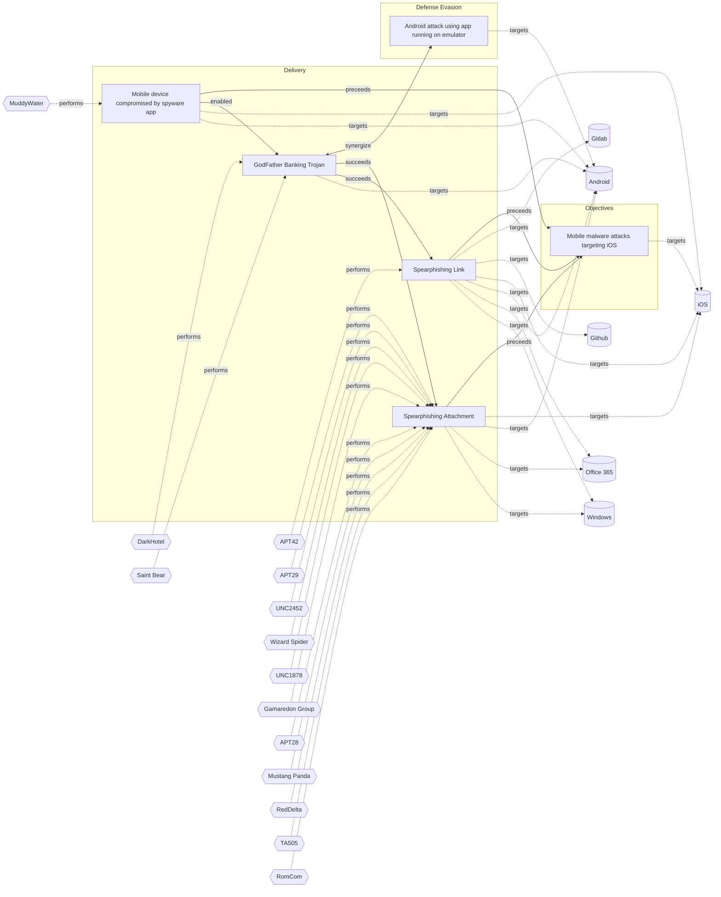

# ☣️ Mobile device compromised by spyware app

🔥 **Criticality:High** ⚠️ : A High priority incident is likely to result in a demonstrable impact to public health or safety, national security, economic security, foreign relations, civil liberties, or public confidence. 

🚦 **TLP:CLEAR** ⚪ : Recipients can spread this to the world, there is no limit on disclosure.

🗡️ **ATT&CK Techniques** [T1512 : Mobile : Video Capture](https://attack.mitre.org/techniques/T1512 'An adversary can leverage a devices cameras to gather information by capturing video recordings Images may also be captured, potentially in specified '), [T1582 : Mobile : SMS Control](https://attack.mitre.org/techniques/T1582 'Adversaries may delete, alter, or send SMS messages without user authorization This could be used to hide C2 SMS messages, spread malware, or various '), [T1513 : Mobile : Screen Capture](https://attack.mitre.org/techniques/T1513 'Adversaries may use screen capture to collect additional information about a target device, such as applications running in the foreground, user data,'), [T1517 : Mobile : Access Notifications](https://attack.mitre.org/techniques/T1517 'Adversaries may collect data within notifications sent by the operating system or other applications Notifications may contain sensitive data such as '), [T1429 : Mobile : Audio Capture](https://attack.mitre.org/techniques/T1429 'Adversaries may capture audio to collect information by leveraging standard operating system APIs of a mobile device Examples of audio information adv'), [T1643 : Mobile : Generate Traffic from Victim](https://attack.mitre.org/techniques/T1643 'Adversaries may generate outbound traffic from devices This is typically performed to manipulate external outcomes, such as to achieve carrier billing')

---

`🔑 UUID : 99c78650-8e19-4756-90fb-2573242577ca` **|** `🏷️ Version : 2` **|** `🗓️ Creation Date : 2022-09-12` **|** `🗓️ Last Modification : 2025-10-01` **|** `Sharing Organisation : {'uuid': '56b0a0f0-b0bc-47d9-bb46-02f80ae2065a', 'name': 'EC DIGIT CSOC'}` **|** `🧱 Schema Identifier : tvm::2.0`

## 👁️ Description

> Earlier versions of spyware apps were installed on smartphones through vulnerabilities
> in commonly used apps, or involving an SMS or iMessage that provides a link to a website. 
> If clicked, this link delivers malicious software that compromises the device.
> It can also be installed over a wireless transceiver located near a target,
> or manually if attacker can steal the phone that has been targeted.  
> 
> Since 2019, attackers have been able to install spyware on smartphones with a missed call on WhatsApp,
> including delete the record of the missed call, making it impossible for the owner to know anything is amiss.
> Another way is by simply sending a message to a phone that produces no notification.  
> 
> In the latest versions of spyware does not require the user to do anything. All that is required for a
> successful spyware attack and installation is having a particular vulnerable app or OS installed on the device,
> such as vulnerabilities in the iMessage service in iPhones which allows for infection by simply receiving a message.
> This is known as a zero-click exploit.     
> 
> Once installed, spyware malware can theoretically harvest any data from the device and transmit
> it back to the attacker. It can steal photos and videos, recordings, location records, communications,
> web searches, passwords, call logs and social media posts.
> It also has the capability to activate cameras and microphones for real-time surveillance
> without the permission or knowledge of the user.  
> 

## 🖥️ Terrain 

 > Adversaries can abuse iOS or Android devices which are vulnerable
> to a zero-click or zero-day exploitation, without user intervention.
> 

---

## 🕸️ Relations

### 🐲 Actors sightings 

| Actor                   | Description                                                                                                                                                                                                                                                                                                                                                                                                                                                                                                                                                                                                                                                                                                                                                                                                                                                    | Aliases                                                                                                                         | Source                     | Sighting               | Reference                |
|:------------------------|:---------------------------------------------------------------------------------------------------------------------------------------------------------------------------------------------------------------------------------------------------------------------------------------------------------------------------------------------------------------------------------------------------------------------------------------------------------------------------------------------------------------------------------------------------------------------------------------------------------------------------------------------------------------------------------------------------------------------------------------------------------------------------------------------------------------------------------------------------------------|:--------------------------------------------------------------------------------------------------------------------------------|:---------------------------|:-----------------------|:-------------------------|
| [Enterprise] MuddyWater | [MuddyWater](https://attack.mitre.org/groups/G0069) is a cyber espionage group assessed to be a subordinate element within Iran's Ministry of Intelligence and Security (MOIS).(Citation: CYBERCOM Iranian Intel Cyber January 2022) Since at least 2017, [MuddyWater](https://attack.mitre.org/groups/G0069) has targeted a range of government and private organizations across sectors, including telecommunications, local government, defense, and oil and natural gas organizations, in the Middle East, Asia, Africa, Europe, and North America.(Citation: Unit 42 MuddyWater Nov 2017)(Citation: Symantec MuddyWater Dec 2018)(Citation: ClearSky MuddyWater Nov 2018)(Citation: ClearSky MuddyWater June 2019)(Citation: Reaqta MuddyWater November 2017)(Citation: DHS CISA AA22-055A MuddyWater February 2022)(Citation: Talos MuddyWater Jan 2022) | Earth Vetala, MERCURY, Mango Sandstorm, Seedworm, Static Kitten, TA450, TEMP.Zagros                                             | 🗡️ MITRE ATT&CK Groups     | No documented sighting | No documented references |
| MuddyWater              | The MuddyWater attacks are primarily against Middle Eastern nations. However, we have also observed attacks against surrounding nations and beyond, including targets in India and the USA. MuddyWater attacks are characterized by the use of a slowly evolving PowerShell-based first stage backdoor we call “POWERSTATS”. Despite broad scrutiny and reports on MuddyWater attacks, the activity continues with only incremental changes to the tools and techniques.                                                                                                                                                                                                                                                                                                                                                                                       | TEMP.Zagros, Static Kitten, Seedworm, MERCURY, COBALT ULSTER, G0069, ATK51, Boggy Serpens, Mango Sandstorm, TA450, Earth Vetala | 🌌 MISP Threat Actor Galaxy | No documented sighting | No documented references |

### 🌊 OpenTide Objects
🚫 No related OpenTide objects indexed.

 --- 

### ⛓️ Threat Chaining

Expand chaining data

| ☣️ Vector                                                                                                                                                                                                                                                                    | ⛓️ Link              | 🎯 Target                                                                                                                                                                                                                                                                                         | ⛰️ Terrain                                                                                                                                                                                                                                                                                                                                                                                                                                                                                                                                                                                                                                                                                                                                                                                                                                                | 🗡️ ATT&CK                                                                                                                                                                                                                                                                                                                                                                                                                                                                                                                                                                                                                                                                                                                                                                                                                                                                                                                                                                                                                                                                                                                                                                                                                                                                                                                                                                                                                                                                                 |
|:-----------------------------------------------------------------------------------------------------------------------------------------------------------------------------------------------------------------------------------------------------------------------------|:---------------------|:-------------------------------------------------------------------------------------------------------------------------------------------------------------------------------------------------------------------------------------------------------------------------------------------------|:----------------------------------------------------------------------------------------------------------------------------------------------------------------------------------------------------------------------------------------------------------------------------------------------------------------------------------------------------------------------------------------------------------------------------------------------------------------------------------------------------------------------------------------------------------------------------------------------------------------------------------------------------------------------------------------------------------------------------------------------------------------------------------------------------------------------------------------------------------|:------------------------------------------------------------------------------------------------------------------------------------------------------------------------------------------------------------------------------------------------------------------------------------------------------------------------------------------------------------------------------------------------------------------------------------------------------------------------------------------------------------------------------------------------------------------------------------------------------------------------------------------------------------------------------------------------------------------------------------------------------------------------------------------------------------------------------------------------------------------------------------------------------------------------------------------------------------------------------------------------------------------------------------------------------------------------------------------------------------------------------------------------------------------------------------------------------------------------------------------------------------------------------------------------------------------------------------------------------------------------------------------------------------------------------------------------------------------------------------------|
| [GodFather Banking Trojan](../Threat%20Vectors/☣️%20GodFather%20Banking%20Trojan.md 'The GodFather malware is a highly advanced Android banking trojan that has evolved into one of the most effective and disruptive mobile threats target...')                             | `support::enabled`   | [Mobile device compromised by spyware app](../Threat%20Vectors/☣️%20Mobile%20device%20compromised%20by%20spyware%20app.md 'Earlier versions of spyware apps were installed on smartphones through vulnerabilitiesin commonly used apps, or involving an SMS or iMessage that prov...')           | Adversaries can abuse iOS or Android devices which are vulnerable to a zero-click or zero-day exploitation, without user intervention.                                                                                                                                                                                                                                                                                                                                                                                                                                                                                                                                                                                                                                                                                                                    | [T1512](https://attack.mitre.org/techniques/T1512 'An adversary can leverage a devices cameras to gather information by capturing video recordings Images may also be captured, potentially in specified '), [T1582](https://attack.mitre.org/techniques/T1582 'Adversaries may delete, alter, or send SMS messages without user authorization This could be used to hide C2 SMS messages, spread malware, or various '), [T1513](https://attack.mitre.org/techniques/T1513 'Adversaries may use screen capture to collect additional information about a target device, such as applications running in the foreground, user data,'), [T1517](https://attack.mitre.org/techniques/T1517 'Adversaries may collect data within notifications sent by the operating system or other applications Notifications may contain sensitive data such as '), [T1429](https://attack.mitre.org/techniques/T1429 'Adversaries may capture audio to collect information by leveraging standard operating system APIs of a mobile device Examples of audio information adv'), [T1643](https://attack.mitre.org/techniques/T1643 'Adversaries may generate outbound traffic from devices This is typically performed to manipulate external outcomes, such as to achieve carrier billing')                                                                                                                                                                                                              |
| [GodFather Banking Trojan](../Threat%20Vectors/☣️%20GodFather%20Banking%20Trojan.md 'The GodFather malware is a highly advanced Android banking trojan that has evolved into one of the most effective and disruptive mobile threats target...')                             | `sequence::succeeds` | [Spearphishing Link](../Threat%20Vectors/☣️%20Spearphishing%20Link.md 'Adversaries may send spearphishing emails with a malicious link in anattempt to gain access to victim systems This sub-technique employsthe use of lin...')                                                               | Spear phishing requires more preparation and time to achieve success than a phishing attack. That is because spear-phishing attackers attempt to obtain vast amounts of personal information about their victims,   the entities their work for, or their areas of interest.    Attackers can get the personal information they need using different ways: to compromise an email or messaging system trough other means, to use OSINT, scouring Social Media or glean personal information from the user's online presence.                                                                                                                                                                                                                                                                                                                              | [T1566.002 : Phishing: Spearphishing Link](https://attack.mitre.org/techniques/T1566/002 'Adversaries may send spearphishing emails with a malicious link in an attempt to gain access to victim systems Spearphishing with a link is a specific'), [T1036 : Masquerading](https://attack.mitre.org/techniques/T1036 'Adversaries may attempt to manipulate features of their artifacts to make them appear legitimate or benign to users andor security tools Masquerading '), [T1656 : Impersonation](https://attack.mitre.org/techniques/T1656 'Adversaries may impersonate a trusted person or organization in order to persuade and trick a target into performing some action on their behalf For e')                                                                                                                                                                                                                                                                                                                                                                                                                                                                                                                                                                                                                                                                                                                                                                               |
| [GodFather Banking Trojan](../Threat%20Vectors/☣️%20GodFather%20Banking%20Trojan.md 'The GodFather malware is a highly advanced Android banking trojan that has evolved into one of the most effective and disruptive mobile threats target...')                             | `sequence::succeeds` | [Spearphishing Attachment](../Threat%20Vectors/☣️%20Spearphishing%20Attachment.md 'Spearphishing messages are often crafted using pernicious social engineeringtechniquesIn Spearphishing Attachment attacks, recipients receive emails t...')                                                   | Spear phishing requires more preparation and time to achieve success  than a phishing attack. That is because spear-phishing attackers attempt to obtain vast amounts of personal information about their victims.   Attackers can get the personal information they need using different ways:   - to compromise an email or messaging system trough other means, - to use OSINT, sourcing Social Media or glean personal information from the user's online presence. They want to craft emails that look as legitimate and attractive as possible  to increase the chances of fooling their targets, for instance sending a malicious  attachment where the filename references a topic the recipient is interested in. The highly personalized nature of spear-phishing attacks makes it more  difficult to identity than widescale phishing attacks. | [T1566.001 : Phishing: Spearphishing Attachment](https://attack.mitre.org/techniques/T1566/001 'Adversaries may send spearphishing emails with a malicious attachment in an attempt to gain access to victim systems Spearphishing attachment is a spe')                                                                                                                                                                                                                                                                                                                                                                                                                                                                                                                                                                                                                                                                                                                                                                                                                                                                                                                                                                                                                                                                                                                                                                                                                                  |
| [GodFather Banking Trojan](../Threat%20Vectors/☣️%20GodFather%20Banking%20Trojan.md 'The GodFather malware is a highly advanced Android banking trojan that has evolved into one of the most effective and disruptive mobile threats target...')                             | `support::synergize` | [Android attack using app running on emulator](../Threat%20Vectors/☣️%20Android%20attack%20using%20app%20running%20on%20emulator.md 'The threat vector involves exploiting emulated environments to bypass security measures, automate malicious activities, and manipulate app behavior Be...') | Adversaries require users to download emulators that have been compromised or misconfigured and through these, they can carry out malicious activities.                                                                                                                                                                                                                                                                                                                                                                                                                                                                                                                                                                                                                                                                                                   | [T1626](https://attack.mitre.org/techniques/T1626 'Adversaries may circumvent mechanisms designed to control elevated privileges to gain higher-level permissions Most modern systems contain native elev'), [T1633](https://attack.mitre.org/techniques/T1633 'Adversaries may employ various means to detect and avoid virtualization and analysis environments This may include changing behaviors after checking f'), [T1417](https://attack.mitre.org/techniques/T1417 'Adversaries may use methods of capturing user input to obtain credentials or collect information During normal device usage, users often provide crede'), [T1635](https://attack.mitre.org/techniques/T1635 'Adversaries can steal user application access tokens as a means of acquiring credentials to access remote systems and resources This can occur through'), [T1426](https://attack.mitre.org/techniques/T1426 'Adversaries may attempt to get detailed information about a devices operating system and hardware, including versions, patches, and architecture Adver'), [T0869](https://attack.mitre.org/techniques/T0869 'Adversaries may establish command and control capabilities over commonly used application layer protocols such as HTTPS, OPC, RDP, telnet, DNP3, and m'), [T1641](https://attack.mitre.org/techniques/T1641 'Adversaries may insert, delete, or alter data in order to manipulate external outcomes or hide activity By manipulating data, adversaries may attempt ') |
| [Mobile malware attacks targeting iOS](../Threat%20Vectors/☣️%20Mobile%20malware%20attacks%20targeting%20iOS.md 'iOS devices are protected by a robust, layered security architecture,yet attackers continue to develop sophisticated malware that targets Apple device...') | `sequence::preceeds` | [Mobile device compromised by spyware app](../Threat%20Vectors/☣️%20Mobile%20device%20compromised%20by%20spyware%20app.md 'Earlier versions of spyware apps were installed on smartphones through vulnerabilitiesin commonly used apps, or involving an SMS or iMessage that prov...')           | Adversaries can abuse iOS or Android devices which are vulnerable to a zero-click or zero-day exploitation, without user intervention.                                                                                                                                                                                                                                                                                                                                                                                                                                                                                                                                                                                                                                                                                                                    | [T1512](https://attack.mitre.org/techniques/T1512 'An adversary can leverage a devices cameras to gather information by capturing video recordings Images may also be captured, potentially in specified '), [T1582](https://attack.mitre.org/techniques/T1582 'Adversaries may delete, alter, or send SMS messages without user authorization This could be used to hide C2 SMS messages, spread malware, or various '), [T1513](https://attack.mitre.org/techniques/T1513 'Adversaries may use screen capture to collect additional information about a target device, such as applications running in the foreground, user data,'), [T1517](https://attack.mitre.org/techniques/T1517 'Adversaries may collect data within notifications sent by the operating system or other applications Notifications may contain sensitive data such as '), [T1429](https://attack.mitre.org/techniques/T1429 'Adversaries may capture audio to collect information by leveraging standard operating system APIs of a mobile device Examples of audio information adv'), [T1643](https://attack.mitre.org/techniques/T1643 'Adversaries may generate outbound traffic from devices This is typically performed to manipulate external outcomes, such as to achieve carrier billing')                                                                                                                                                                                                              |
| [Mobile malware attacks targeting iOS](../Threat%20Vectors/☣️%20Mobile%20malware%20attacks%20targeting%20iOS.md 'iOS devices are protected by a robust, layered security architecture,yet attackers continue to develop sophisticated malware that targets Apple device...') | `sequence::preceeds` | [Spearphishing Link](../Threat%20Vectors/☣️%20Spearphishing%20Link.md 'Adversaries may send spearphishing emails with a malicious link in anattempt to gain access to victim systems This sub-technique employsthe use of lin...')                                                               | Spear phishing requires more preparation and time to achieve success than a phishing attack. That is because spear-phishing attackers attempt to obtain vast amounts of personal information about their victims,   the entities their work for, or their areas of interest.    Attackers can get the personal information they need using different ways: to compromise an email or messaging system trough other means, to use OSINT, scouring Social Media or glean personal information from the user's online presence.                                                                                                                                                                                                                                                                                                                              | [T1566.002 : Phishing: Spearphishing Link](https://attack.mitre.org/techniques/T1566/002 'Adversaries may send spearphishing emails with a malicious link in an attempt to gain access to victim systems Spearphishing with a link is a specific'), [T1036 : Masquerading](https://attack.mitre.org/techniques/T1036 'Adversaries may attempt to manipulate features of their artifacts to make them appear legitimate or benign to users andor security tools Masquerading '), [T1656 : Impersonation](https://attack.mitre.org/techniques/T1656 'Adversaries may impersonate a trusted person or organization in order to persuade and trick a target into performing some action on their behalf For e')                                                                                                                                                                                                                                                                                                                                                                                                                                                                                                                                                                                                                                                                                                                                                                               |
| [Mobile malware attacks targeting iOS](../Threat%20Vectors/☣️%20Mobile%20malware%20attacks%20targeting%20iOS.md 'iOS devices are protected by a robust, layered security architecture,yet attackers continue to develop sophisticated malware that targets Apple device...') | `sequence::preceeds` | [Spearphishing Attachment](../Threat%20Vectors/☣️%20Spearphishing%20Attachment.md 'Spearphishing messages are often crafted using pernicious social engineeringtechniquesIn Spearphishing Attachment attacks, recipients receive emails t...')                                                   | Spear phishing requires more preparation and time to achieve success  than a phishing attack. That is because spear-phishing attackers attempt to obtain vast amounts of personal information about their victims.   Attackers can get the personal information they need using different ways:   - to compromise an email or messaging system trough other means, - to use OSINT, sourcing Social Media or glean personal information from the user's online presence. They want to craft emails that look as legitimate and attractive as possible  to increase the chances of fooling their targets, for instance sending a malicious  attachment where the filename references a topic the recipient is interested in. The highly personalized nature of spear-phishing attacks makes it more  difficult to identity than widescale phishing attacks. | [T1566.001 : Phishing: Spearphishing Attachment](https://attack.mitre.org/techniques/T1566/001 'Adversaries may send spearphishing emails with a malicious attachment in an attempt to gain access to victim systems Spearphishing attachment is a spe')                                                                                                                                                                                                                                                                                                                                                                                                                                                                                                                                                                                                                                                                                                                                                                                                                                                                                                                                                                                                                                                                                                                                                                                                                                  |

&nbsp; 

---

## Model Data

#### **⛓️ Cyber Kill Chain**

 > Cyber attacks are typically phased progressions towards strategic objectives. The Unified Kill Chains provides insight into the tactics that hackers employ to attain these objectives. This provides a solid basis to develop (or realign) defensive strategies to raise cyber resilience.

 [`📦 Delivery`](https://www.unifiedkillchain.com/assets/The-Unified-Kill-Chain.pdf) : Techniques resulting in the transmission of a weaponized object to the targeted environment.

---

#### **🛰️ Domains**

 > Infrastructure technologies domain of interest to attackers.

 `📱 Mobile` : Smartphones, tablets and applications running these devices.

---

#### **🎯 Targets**

 > Granular delimited technical entities holding a value to the organization, that are targeted by adversaries. They might be also involved in the detection coverage as the target of log collection. Partially inspired by Veris.

  - [`👤 End-user`](http://veriscommunity.net/enums.html#section-asset) : People - End-user
 - [`👤 Executive`](http://veriscommunity.net/enums.html#section-asset) : People - Executive
 - [`👤 Manager`](http://veriscommunity.net/enums.html#section-asset) : People - Manager
 - [`📱 Mobile phone`](http://veriscommunity.net/enums.html#section-asset) : User Device - Mobile phone or smartphone
 - [`🪪 Personal Information`](http://veriscommunity.net/enums.html#section-asset) : Placeholder
 - [`📱 Tablet`](http://veriscommunity.net/enums.html#section-asset) : User Device - Tablet

---

#### **💿 Platforms concerned**

 > Actual technologies used by the organization that will be exploited by adversaries during a successful attack, and eventually of relevance for detection. Are named by commercial designation.

  - ` Android` : Placeholder
 - ` iOS` : Placeholder

---

#### **💣 Severity**

 > The severity summarizes the overall danger of incident the vector will provoke, and is to be derived (WIP) from impact, leverage, and difficulty to execute.

 [`⚠️ Significant incident`](https://www.ncsc.gov.uk/news/new-cyber-attack-categorisation-system-improve-uk-response-incidents) : A cyber attack which has a serious impact on a large organisation or on wider / local government, or which poses a considerable risk to central government or (inter)national essential services.

---

#### **🪄 Leverage acquisition**

 > Technical aftermath of the attack from the target perspective, differentiated from impact as it does not consider the value of the consequence, only what increased control the vector execution provides to the adversary.

  - [`👽 Alter behavior`](https://owasp.org/www-community/Threat_Modeling_Process#stride) : Influence or alter human behavior
 - [`👁️‍🗨️ Information Disclosure`](https://owasp.org/www-community/Threat_Modeling_Process#stride) : Threat action intending to read a file that one was not granted access to, or to read data in transit.
 - [`⚙️ Modify configuration`](https://owasp.org/www-community/Threat_Modeling_Process#stride) : Modify configuration or services
 - [`✨ Modify data`](https://owasp.org/www-community/Threat_Modeling_Process#stride) : Modify stored data or content
 - [`📦 Software installation`](https://owasp.org/www-community/Threat_Modeling_Process#stride) : Software installation or code modification
 - [`🐒 Tampering`](https://owasp.org/www-community/Threat_Modeling_Process#stride) : Threat action intending to maliciously change or modify persistent data, such as records in a database, and the alteration of data in transit between two computers over an open network, such as the Internet.

---

#### **💥 Impact**

 > Analysis of the threat vector from the organizational perspective, in non technical term. This aims at putting a clear denomination on what the attacker will actually be able to act upon if the threat vector is realized.

  - [`🔓 Data Breach`](http://veriscommunity.net/enums.html#section-impact) : Non-public information has been accessed from the outside, and successfully extracted.
 - [`🥸 Identity Theft`](http://veriscommunity.net/enums.html#section-impact) : Acquisition of sufficient information and privileges to profess as a given individual, for the purpose of abusing and deceiving human trust relationships.
 - [`🌍 Reputational Damages`](http://veriscommunity.net/enums.html#section-impact) : Damages to the organization public view may be achieved by using directly the access gained, or indirectly with data gathered.

---

#### **🎲 Vector Viability**

 > Described with estimative language (likelyhood probability), describes how likely the analyst believes the vector to actually be realized on the organization infrastructure. Estimative language describes quality and credibility of underlying sources, data, and methodologies based Intelligence Community Directive 203 (ICD 203) and JP 2-0, Joint Intelligence.

 [`🧐 Likely`](https://www.dni.gov/files/documents/ICD/ICD%20203%20Analytic%20Standards.pdf) : Probable (probably) - 55-80%

---

### 🔗 References

**🕊️ Publicly available resources**

- [_1_] https://googleprojectzero.blogspot.com/2023/03/multiple-internet-to-baseband-ote-rce.html
- [_2_] https://www.kaspersky.com/resource-center/definitions/what-is-zero-click-malware
- [_3_] https://www.techrepublic.com/article/packaged-zero-day-vulnerabilities-android-attacks/
- [_4_] https://citizenlab.ca/2023/09/blastpass-nso-group-iphone-zero-click-zero-day-exploit-captured-in-the-wild/

[1]: https://googleprojectzero.blogspot.com/2023/03/multiple-internet-to-baseband-ote-rce.html
[2]: https://www.kaspersky.com/resource-center/definitions/what-is-zero-click-malware
[3]: https://www.techrepublic.com/article/packaged-zero-day-vulnerabilities-android-attacks/
[4]: https://citizenlab.ca/2023/09/blastpass-nso-group-iphone-zero-click-zero-day-exploit-captured-in-the-wild/

---

#### 🏷️ Tags

#-, #-, #-, #
, #
, ##, ##, ##, ##, # , #🏷, #️, # , #T, #a, #g, #s, #
, #

