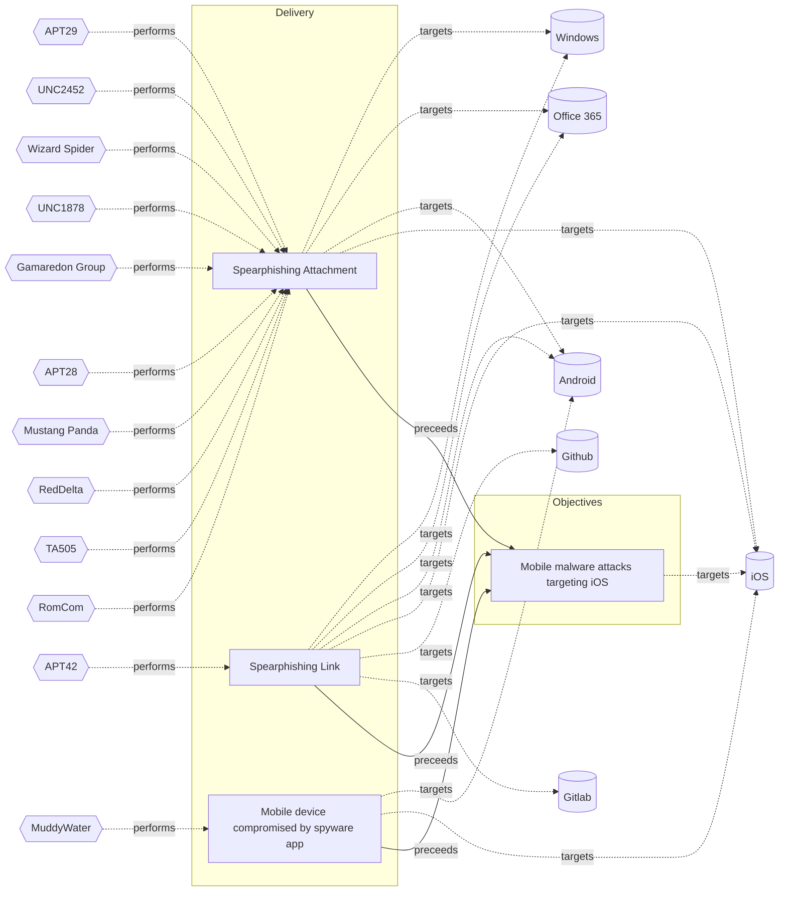

# ☣️ Mobile malware attacks targeting iOS

🔥 **Criticality:High** ⚠️ : A High priority incident is likely to result in a demonstrable impact to public health or safety, national security, economic security, foreign relations, civil liberties, or public confidence. 

🚦 **TLP:CLEAR** ⚪ : Recipients can spread this to the world, there is no limit on disclosure.

🗡️ **ATT&CK Techniques** [T1404 : Mobile : Exploitation for Privilege Escalation](https://attack.mitre.org/techniques/T1404 'Adversaries may exploit software vulnerabilities in order to elevate privileges Exploitation of a software vulnerability occurs when an adversary take'), [T1638 : Mobile : Adversary-in-the-Middle](https://attack.mitre.org/techniques/T1638 'Adversaries may attempt to position themselves between two or more networked devices to support follow-on behaviors such as Transmitted Data Manipulat'), [T1212 : Exploitation for Credential Access](https://attack.mitre.org/techniques/T1212 'Adversaries may exploit software vulnerabilities in an attempt to collect credentials Exploitation of a software vulnerability occurs when an adversar'), [T1663 : Mobile : Remote Access Software](https://attack.mitre.org/techniques/T1663 'Adversaries may use legitimate remote access software, such as VNC, TeamViewer, AirDroid, AirMirror, etc, to establish an interactive command and cont'), [T1655 : Mobile : Masquerading](https://attack.mitre.org/techniques/T1655 'Adversaries may attempt to manipulate features of their artifacts to make them appear legitimate or benign to users andor security tools Masquerading '), [T1456 : Mobile : Drive-By Compromise](https://attack.mitre.org/techniques/T1456 'Adversaries may gain access to a system through a user visiting a website over the normal course of browsing With this technique, the users web browse'), [T1417 : Mobile : Input Capture](https://attack.mitre.org/techniques/T1417 'Adversaries may use methods of capturing user input to obtain credentials or collect information During normal device usage, users often provide crede')

---

`🔑 UUID : ef4ba2bf-dfcb-4b70-8f45-7625baeb96d0` **|** `🏷️ Version : 1` **|** `🗓️ Creation Date : 2025-04-28` **|** `🗓️ Last Modification : 2025-05-12` **|** `Sharing Organisation : {'uuid': '56b0a0f0-b0bc-47d9-bb46-02f80ae2065a', 'name': 'EC DIGIT CSOC'}` **|** `🧱 Schema Identifier : tvm::2.1`

## 👁️ Description

> iOS devices are protected by a robust, layered security architecture,
> yet attackers continue to develop sophisticated malware that targets 
> Apple devices. These threats exploit OS' vulnerabilities, abuse of
> legitimate features, and use of social engineering to gain unauthorized 
> access, steal sensitive data, or remotely control devices.
> 
> ### How malware interacts with the architecture
> 
> Despite these protections, attackers exploit weaknesses at different
> layers of the iOS architecture:
> 
> - **Jailbreaking:** By exploiting kernel or system vulnerabilities, attackers
> can break out of the sandbox and disable code signing, allowing arbitrary code
> execution and installation of malicious apps. This undermines the foundational
> security of the Core OS layer.
> 
> - **Enterprise Provisioning/MDM Abuse:** Attackers use enterprise certificates
> or MDM profiles to bypass App Store restrictions and install malicious apps,
> circumventing code signing checks at the app distribution level.
> 
> - **App Replacement (Masque Attack):** Exploits flaws in the app installation
> process, allowing a malicious app to replace a legitimate one if it shares the
> same bundle identifier, gaining access to sensitive app data.
> 
> - **Vulnerability Exploitation:** Attackers target flaws in system frameworks or 
> the kernel to escalate privileges, bypass sandboxing, or execute unauthorized code.
> 
> - **Reverse Engineering and Code Injection:** Attackers decompile apps to discover 
> sensitive logic or keys, inject malicious code, or bypass security controls. Lack 
> of obfuscation and anti-tamper mechanisms make these attacks easier.
> 
> - **Dynamic Instrumentation:** Tools like Frida or Ghidra allow real-time
> manipulation of app processes, bypassing authentication or extracting sensitive data.
> 
> - **Man-in-the-Middle (MitM) Attacks:** Target insecure network communications, 
> intercepting data between the app and backend servers.
> 
> ### Abuse of iOS architecture
> 
> The basic architecture for iOS is divided into four **layers**:
>  - Core services, Core OS: manage basic services in iOS  
>  - Cocoa Touch, Media: handle the user interface and advanced graphics.
> 
> Below the layers there are the iOS **frameworks**, which are similar to static and
> dynamic shared libraries, they provide a library of routines that an application can
> access to do a specific task:
>  - Security  
>  - UIKit  
>  - Foundation  
>  - AVFoundation  
>  - System Configuration  
>  - MessageUI
> 
> After the frameworks there are the functions, which are being abused by different malware.
> 
> ### Attack Vectors
> 
> - **Exploitation of Vulnerabilities:** Attackers leverage flaws in iOS, such as 
> remote code execution or privilege escalation, to run malicious code on devices 
> without user interaction.
> 
> - **Malicious Messaging:** Some attacks use iMessage or other messaging platforms 
> to deliver exploit-laden attachments, triggering vulnerabilities and enabling further 
> compromise.
> 
> - **Abuse of Enterprise Provisioning:** Attackers misuse Apple’s Developer Enterprise 
> Program to distribute malicious apps outside the App Store, bypassing Apple’s app 
> review process.
> 
> - **Masque Attack:** Replaces a legitimate app with a malicious one sharing the 
> same bundle identifier, allowing credential theft or background surveillance.
> 
> - **Social Engineering and Phishing:** Users are lured into installing malicious 
> profiles or apps via deceptive messages, websites, or emails.
> 
> ### Types of iOS Malware (excluding Spyware) and Functions
> 
> | Malware Type                  | Functionality                                                                                 | Example(s)                        |
> |-------------------------------|---------------------------------------------------------------------------------------------|------------------------------------|
> | **Remote Access Trojan (RAT)**| Grants attackers remote control over the device, can install apps, manipulate settings, etc. | GoldPickaxe                        |
> | **Adware**                    | Displays intrusive ads, redirects traffic, generates ad revenue for attackers                | Lock Saver Free, Muda (AdLord), YiSpecter |
> | **Ransomware/Scareware**      | Locks device/browser or displays fake warnings, demands payment to restore access            | Safari JavaScript Pop-up Scareware |
> | **Credential Stealers**       | Steals Apple ID, passwords, or banking credentials                                          | KeyRaider, XcodeGhost              |
> | **App Replacement/Impersonation** | Replaces legitimate apps with malicious ones to steal data or perform fraudulent actions    | Masque Attack, YiSpecter           |
> 
> ### Impact and Risks
> 
> - **Data Theft:** Attackers can steal personal information, financial data, and 
> sensitive communications.
> 
> - **Device Takeover:** Some malware enables full remote control of the device, allowing 
> attackers to impersonate the user or perform fraudulent transactions.
> 
> - **Corporate Espionage:** In enterprise environments, a compromised iOS device 
> can serve as an entry point into corporate networks, leading to broader breaches 
> and operational disruptions.
> 
> - **Extortion:** Attackers may use scareware or ransomware to extort victims for 
> payment in exchange for restoring access or not disclosing stolen data.
> 
> - **Disruption:** Adware and scareware can degrade device performance, flood users 
> with ads, or lock browsers, impacting usability.
> 

## 🖥️ Terrain 

 > Adversaries need access to methods for distributing malware,
> such as phishing campaigns, malicious websites, social engineering 
> to install MDM profiles, enterprise provisioning certificates, or
> even slipping malicious apps through the App Store review process.
> 

---

## 🕸️ Relations

### 🌊 OpenTide Objects
🚫 No related OpenTide objects indexed.

 --- 

### ⛓️ Threat Chaining

Expand chaining data

| ☣️ Vector                                                                                                                                                                                                                                                                    | ⛓️ Link              | 🎯 Target                                                                                                                                                                                                                                                                               | ⛰️ Terrain                                                                                                                                                                                                                                                                                                                                                                                                                                                                                                                                                                                                                                                                                                                                                                                                                                                | 🗡️ ATT&CK                                                                                                                                                                                                                                                                                                                                                                                                                                                                                                                                                                                                                                                                                                                                                                                                                                                                                                                                                                                                                                                                                                                                                                                                                                                                    |
|:-----------------------------------------------------------------------------------------------------------------------------------------------------------------------------------------------------------------------------------------------------------------------------|:---------------------|:---------------------------------------------------------------------------------------------------------------------------------------------------------------------------------------------------------------------------------------------------------------------------------------|:----------------------------------------------------------------------------------------------------------------------------------------------------------------------------------------------------------------------------------------------------------------------------------------------------------------------------------------------------------------------------------------------------------------------------------------------------------------------------------------------------------------------------------------------------------------------------------------------------------------------------------------------------------------------------------------------------------------------------------------------------------------------------------------------------------------------------------------------------------|:-----------------------------------------------------------------------------------------------------------------------------------------------------------------------------------------------------------------------------------------------------------------------------------------------------------------------------------------------------------------------------------------------------------------------------------------------------------------------------------------------------------------------------------------------------------------------------------------------------------------------------------------------------------------------------------------------------------------------------------------------------------------------------------------------------------------------------------------------------------------------------------------------------------------------------------------------------------------------------------------------------------------------------------------------------------------------------------------------------------------------------------------------------------------------------------------------------------------------------------------------------------------------------|
| [Mobile malware attacks targeting iOS](../Threat%20Vectors/☣️%20Mobile%20malware%20attacks%20targeting%20iOS.md 'iOS devices are protected by a robust, layered security architecture,yet attackers continue to develop sophisticated malware that targets Apple device...') | `sequence::preceeds` | [Spearphishing Link](../Threat%20Vectors/☣️%20Spearphishing%20Link.md 'Adversaries may send spearphishing emails with a malicious link in anattempt to gain access to victim systems This sub-technique employsthe use of lin...')                                                     | Spear phishing requires more preparation and time to achieve success than a phishing attack. That is because spear-phishing attackers attempt to obtain vast amounts of personal information about their victims,   the entities their work for, or their areas of interest.    Attackers can get the personal information they need using different ways: to compromise an email or messaging system trough other means, to use OSINT, scouring Social Media or glean personal information from the user's online presence.                                                                                                                                                                                                                                                                                                                              | [T1566.002 : Phishing: Spearphishing Link](https://attack.mitre.org/techniques/T1566/002 'Adversaries may send spearphishing emails with a malicious link in an attempt to gain access to victim systems Spearphishing with a link is a specific'), [T1036 : Masquerading](https://attack.mitre.org/techniques/T1036 'Adversaries may attempt to manipulate features of their artifacts to make them appear legitimate or benign to users andor security tools Masquerading '), [T1656 : Impersonation](https://attack.mitre.org/techniques/T1656 'Adversaries may impersonate a trusted person or organization in order to persuade and trick a target into performing some action on their behalf For e')                                                                                                                                                                                                                                                                                                                                                                                                                                                                                                                                                                  |
| [Mobile malware attacks targeting iOS](../Threat%20Vectors/☣️%20Mobile%20malware%20attacks%20targeting%20iOS.md 'iOS devices are protected by a robust, layered security architecture,yet attackers continue to develop sophisticated malware that targets Apple device...') | `sequence::preceeds` | [Spearphishing Attachment](../Threat%20Vectors/☣️%20Spearphishing%20Attachment.md 'Spearphishing messages are often crafted using pernicious social engineeringtechniquesIn Spearphishing Attachment attacks, recipients receive emails t...')                                         | Spear phishing requires more preparation and time to achieve success  than a phishing attack. That is because spear-phishing attackers attempt to obtain vast amounts of personal information about their victims.   Attackers can get the personal information they need using different ways:   - to compromise an email or messaging system trough other means, - to use OSINT, sourcing Social Media or glean personal information from the user's online presence. They want to craft emails that look as legitimate and attractive as possible  to increase the chances of fooling their targets, for instance sending a malicious  attachment where the filename references a topic the recipient is interested in. The highly personalized nature of spear-phishing attacks makes it more  difficult to identity than widescale phishing attacks. | [T1566.001 : Phishing: Spearphishing Attachment](https://attack.mitre.org/techniques/T1566/001 'Adversaries may send spearphishing emails with a malicious attachment in an attempt to gain access to victim systems Spearphishing attachment is a spe')                                                                                                                                                                                                                                                                                                                                                                                                                                                                                                                                                                                                                                                                                                                                                                                                                                                                                                                                                                                                                     |
| [Mobile malware attacks targeting iOS](../Threat%20Vectors/☣️%20Mobile%20malware%20attacks%20targeting%20iOS.md 'iOS devices are protected by a robust, layered security architecture,yet attackers continue to develop sophisticated malware that targets Apple device...') | `sequence::preceeds` | [Mobile device compromised by spyware app](../Threat%20Vectors/☣️%20Mobile%20device%20compromised%20by%20spyware%20app.md 'Earlier versions of spyware apps were installed on smartphones through vulnerabilitiesin commonly used apps, or involving an SMS or iMessage that prov...') | Adversaries can abuse iOS or Android devices which are vulnerable to a zero-click or zero-day exploitation, without user intervention.                                                                                                                                                                                                                                                                                                                                                                                                                                                                                                                                                                                                                                                                                                                    | [T1512](https://attack.mitre.org/techniques/T1512 'An adversary can leverage a devices cameras to gather information by capturing video recordings Images may also be captured, potentially in specified '), [T1582](https://attack.mitre.org/techniques/T1582 'Adversaries may delete, alter, or send SMS messages without user authorization This could be used to hide C2 SMS messages, spread malware, or various '), [T1513](https://attack.mitre.org/techniques/T1513 'Adversaries may use screen capture to collect additional information about a target device, such as applications running in the foreground, user data,'), [T1517](https://attack.mitre.org/techniques/T1517 'Adversaries may collect data within notifications sent by the operating system or other applications Notifications may contain sensitive data such as '), [T1429](https://attack.mitre.org/techniques/T1429 'Adversaries may capture audio to collect information by leveraging standard operating system APIs of a mobile device Examples of audio information adv'), [T1643](https://attack.mitre.org/techniques/T1643 'Adversaries may generate outbound traffic from devices This is typically performed to manipulate external outcomes, such as to achieve carrier billing') |

&nbsp; 

---

## Model Data

#### **⛓️ Cyber Kill Chain**

 > Cyber attacks are typically phased progressions towards strategic objectives. The Unified Kill Chains provides insight into the tactics that hackers employ to attain these objectives. This provides a solid basis to develop (or realign) defensive strategies to raise cyber resilience.

 [`🎯 Objectives`](https://www.unifiedkillchain.com/assets/The-Unified-Kill-Chain.pdf) : Socio-technical objectives of an attack that are intended to achieve a strategic goal.

---

#### **🛰️ Domains**

 > Infrastructure technologies domain of interest to attackers.

 `📱 Mobile` : Smartphones, tablets and applications running these devices.

---

#### **🎯 Targets**

 > Granular delimited technical entities holding a value to the organization, that are targeted by adversaries. They might be also involved in the detection coverage as the target of log collection. Partially inspired by Veris.

  - [`📱 Mobile phone`](http://veriscommunity.net/enums.html#section-asset) : User Device - Mobile phone or smartphone
 - [`📱 Tablet`](http://veriscommunity.net/enums.html#section-asset) : User Device - Tablet
 - [`🗃️ Critical Documents`](http://veriscommunity.net/enums.html#section-asset) : Placeholder
 - [`🪪 Personal Information`](http://veriscommunity.net/enums.html#section-asset) : Placeholder

---

#### **💿 Platforms concerned**

 > Actual technologies used by the organization that will be exploited by adversaries during a successful attack, and eventually of relevance for detection. Are named by commercial designation.

 ` iOS` : Placeholder

---

#### **💣 Severity**

 > The severity summarizes the overall danger of incident the vector will provoke, and is to be derived (WIP) from impact, leverage, and difficulty to execute.

 [`⚠️ Significant incident`](https://www.ncsc.gov.uk/news/new-cyber-attack-categorisation-system-improve-uk-response-incidents) : A cyber attack which has a serious impact on a large organisation or on wider / local government, or which poses a considerable risk to central government or (inter)national essential services.

---

#### **🪄 Leverage acquisition**

 > Technical aftermath of the attack from the target perspective, differentiated from impact as it does not consider the value of the consequence, only what increased control the vector execution provides to the adversary.

  - [`🦠 Dwelling`](https://owasp.org/www-community/Threat_Modeling_Process#stride) : Active or passive extended presence in the target, which performs adversarial operations continuously.
 - [`👁️‍🗨️ Information Disclosure`](https://owasp.org/www-community/Threat_Modeling_Process#stride) : Threat action intending to read a file that one was not granted access to, or to read data in transit.
 - [`👻 Spoofing`](https://owasp.org/www-community/Threat_Modeling_Process#stride) : Threat action aimed at accessing and use of another user’s credentials, such as username and password.
 - [`🐒 Tampering`](https://owasp.org/www-community/Threat_Modeling_Process#stride) : Threat action intending to maliciously change or modify persistent data, such as records in a database, and the alteration of data in transit between two computers over an open network, such as the Internet.

---

#### **💥 Impact**

 > Analysis of the threat vector from the organizational perspective, in non technical term. This aims at putting a clear denomination on what the attacker will actually be able to act upon if the threat vector is realized.

  - [`📉 Competitive disadvantage`](http://veriscommunity.net/enums.html#section-impact) : Loss of competitive advantage
 - [`🔓 Data Breach`](http://veriscommunity.net/enums.html#section-impact) : Non-public information has been accessed from the outside, and successfully extracted.
 - [`🥸 Identity Theft`](http://veriscommunity.net/enums.html#section-impact) : Acquisition of sufficient information and privileges to profess as a given individual, for the purpose of abusing and deceiving human trust relationships.
 - [`🧠 IP Loss`](http://veriscommunity.net/enums.html#section-impact) : Particular, key data, information and blueprint conducive to the organization capability to gain and retain a commercial or geopolitical advantage has been accessed, and their content potentially used by competitors or other adversaries.

---

#### **🎲 Vector Viability**

 > Described with estimative language (likelyhood probability), describes how likely the analyst believes the vector to actually be realized on the organization infrastructure. Estimative language describes quality and credibility of underlying sources, data, and methodologies based Intelligence Community Directive 203 (ICD 203) and JP 2-0, Joint Intelligence.

 [`🧐 Likely`](https://www.dni.gov/files/documents/ICD/ICD%20203%20Analytic%20Standards.pdf) : Probable (probably) - 55-80%

---

### 🔗 References

**🕊️ Publicly available resources**

- [_1_] https://mas.owasp.org/MASTG/0x06a-Platform-Overview/
- [_2_] https://thesai.org/Downloads/Volume12No8/Paper_12-Mobile_Malware_Classification_for_iOS.pdf
- [_3_] https://digital.ai/catalyst-blog/ios-app-security/
- [_4_] https://link.springer.com/article/10.1007/s11416-023-00477-y

[1]: https://mas.owasp.org/MASTG/0x06a-Platform-Overview/
[2]: https://thesai.org/Downloads/Volume12No8/Paper_12-Mobile_Malware_Classification_for_iOS.pdf
[3]: https://digital.ai/catalyst-blog/ios-app-security/
[4]: https://link.springer.com/article/10.1007/s11416-023-00477-y

---

#### 🏷️ Tags

#-, #-, #-, #
, #
, ##, ##, ##, ##, # , #🏷, #️, # , #T, #a, #g, #s, #
, #

