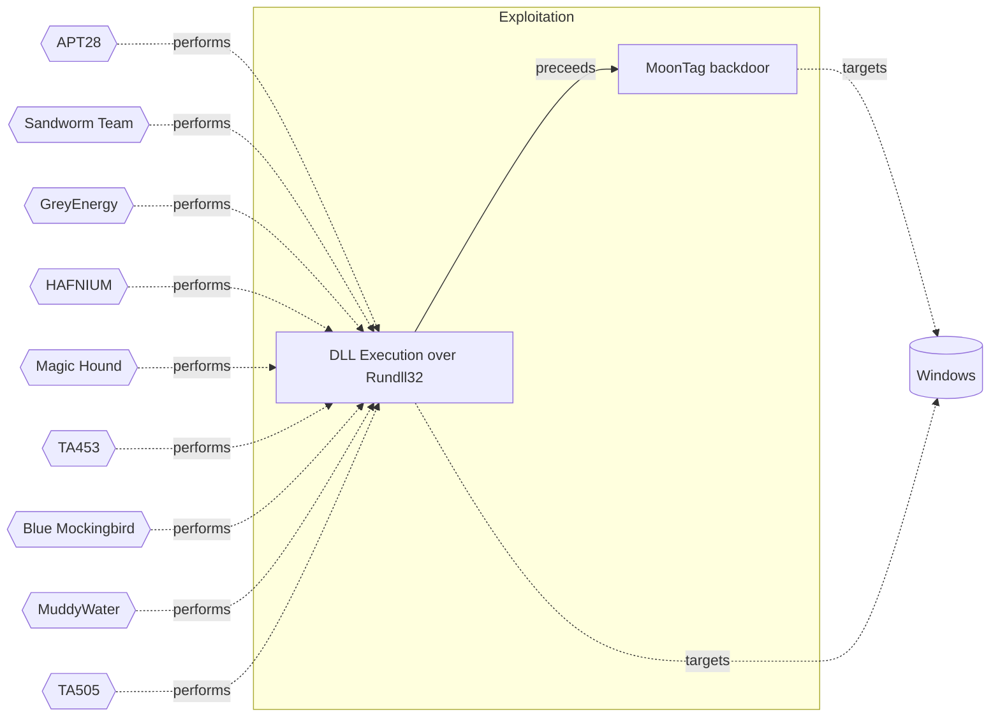

# ☣️ MoonTag backdoor

🔥 **Criticality:Medium** ❗ : A Medium priority incident may affect public health or safety, national security, economic security, foreign relations, civil liberties, or public confidence. 

🚦 **TLP:CLEAR** ⚪ : Recipients can spread this to the world, there is no limit on disclosure.

🗡️ **ATT&CK Techniques** [T1219 : Remote Access Tools](https://attack.mitre.org/techniques/T1219 'An adversary may use legitimate remote access tools to establish an interactive command and control channel within a network Remote access tools creat'), [T1036 : Masquerading](https://attack.mitre.org/techniques/T1036 'Adversaries may attempt to manipulate features of their artifacts to make them appear legitimate or benign to users andor security tools Masquerading '), [T1574.001 : Hijack Execution Flow: DLL](https://attack.mitre.org/techniques/T1574/001 'Adversaries may abuse dynamic-link library files DLLs in order to achieve persistence, escalate privileges, and evade defenses DLLs are libraries that')

---

`🔑 UUID : 4110c951-3120-49fb-b54b-3d3aa896296b` **|** `🏷️ Version : 1` **|** `🗓️ Creation Date : 2024-10-16` **|** `🗓️ Last Modification : 2024-10-24` **|** `Sharing Organisation : {'uuid': '56b0a0f0-b0bc-47d9-bb46-02f80ae2065a', 'name': 'EC DIGIT CSOC'}` **|** `🧱 Schema Identifier : tvm::2.0`

## 👁️ Description

> MoonTag is a new backdoor which appears to be recently uploaded
> to VirusTotal. The backdoor seems to be in development phase and
> uses the Microsoft Graph API, which is a set of APIs provided by
> Microsoft for accessing various services and data ref [1].  
> 
> It is believed to have been created by a Chinese threat actor,
> and it uses code samples for Graph API communication that were
> shared in a Chinese language Google Group.
> 
> The malware code can be found at the Virus Total page - ref [2],
> although none of the provided codes there appear completed.
> It seems that several variants of the backdoor have been uploaded
> to VirusTotal. All of the variants found contain functionality
> for communicating with the MS Graph API. The malware code shows
> further that the code uses a technique DLL side-loading in the
> processes, for example SvcHostDLL ref [2].   
> 
> Examples: 
> 
> - install this dll as a Service host by svchost.exe, used by
> rundll32.exe to call callback
> - dll module handle used to get dll path in InstallService
> 
> The malware, which is named “Moon_Tag” by its developer 
> is based on code published in a Google Group. All of the
> variants found contain functionality for communicating
> with the Graph API ref [3].  
> 
> MoonTag samples match a YARA rule named `MAL_APT_9002_SabrePanda`
> that detects samples from the 9002 RAT malware family used by
> a Chinese affiliated threat actor. There are no strong links
> to attribute MoonTag to a specific threat actor, but based on
> the reports and analytic pages MoonTag backdoor is written by
> Chinese-speaking threat actor based on the Chinese language
> used in the Google Group post and the infrastructure used
> by the attackers ref [3].  
> 
> #### MoonTag backdoor known behavior:
> 
> - Persistence: The service installation ensures the backdoor remains
> on the system across reboots.
> - Camouflage: By using legitimate Windows processes like svchost.exe
> and the netsvcs service group, it tries to blend in with the operating
> system's normal operations.
> - Remote Control: The service starts a command-line process (cmd.exe),
> allowing an attacker to execute arbitrary commands on the target machine,
> which could lead to further exploitation or system takeover.  
> 

## 🖥️ Terrain 

 > Threat actor uses vulnerable Microsoft Graph APIs
> to deploy a backdoor.  
> 

---

## 🕸️ Relations

### 🌊 OpenTide Objects
🚫 No related OpenTide objects indexed.

 --- 

### ⛓️ Threat Chaining

Expand chaining data

| ☣️ Vector                                                                                                                                                                                                                      | ⛓️ Link              | 🎯 Target                                                                                                                                                                                                                                                 | ⛰️ Terrain                                                                                                                                                                                                                    | 🗡️ ATT&CK                                                                                                                                                                                                                                                     |
|:-------------------------------------------------------------------------------------------------------------------------------------------------------------------------------------------------------------------------------|:---------------------|:---------------------------------------------------------------------------------------------------------------------------------------------------------------------------------------------------------------------------------------------------------|:------------------------------------------------------------------------------------------------------------------------------------------------------------------------------------------------------------------------------|:--------------------------------------------------------------------------------------------------------------------------------------------------------------------------------------------------------------------------------------------------------------|
| [MoonTag backdoor](../Threat%20Vectors/☣️%20MoonTag%20backdoor.md 'MoonTag is a new backdoor which appears to be recently uploadedto VirusTotal The backdoor seems to be in development phase anduses the Microsoft Graph...') | `sequence::preceeds` | [DLL Execution over Rundll32](../Threat%20Vectors/☣️%20DLL%20Execution%20over%20Rundll32.md 'Rundll32exe is a powerful asset for adversaries to proxy execution of arbitraryand malicious code It is flexible and efficient for loading code into m...') | Adversary must have enough privileges on the Windows host to bypass application control solutions via the rundll32.exe process. Natively, rundll32.exe will load DLLs and is a great example of a Living off the Land Binary. | [T1218.011 : System Binary Proxy Execution: Rundll32](https://attack.mitre.org/techniques/T1218/011 'Adversaries may abuse rundll32exe to proxy execution of malicious code Using rundll32exe, vice executing directly ie Shared Moduleshttpsattackmitreorg') |

&nbsp; 

---

## Model Data

#### **⛓️ Cyber Kill Chain**

 > Cyber attacks are typically phased progressions towards strategic objectives. The Unified Kill Chains provides insight into the tactics that hackers employ to attain these objectives. This provides a solid basis to develop (or realign) defensive strategies to raise cyber resilience.

 [`💥 Exploitation`](https://www.unifiedkillchain.com/assets/The-Unified-Kill-Chain.pdf) : Techniques to exploit vulnerabilities in systems that may, amongst others, result in code execution.

---

#### **🛰️ Domains**

 > Infrastructure technologies domain of interest to attackers.

  - `🏢 Enterprise` : Generic databases, applications, machines and systems that are usually on premises or on Cloud traditional VMs.
 - `☁️ Private Cloud` : Infrastructure hosted at a third party, but based on custom specification and managed on a platform level.
 - `☁️ Public Cloud` : Infrastructure handled by a commercial cloud provider. Managed mostly on a service level, and connected over the internet.

---

#### **🎯 Targets**

 > Granular delimited technical entities holding a value to the organization, that are targeted by adversaries. They might be also involved in the detection coverage as the target of log collection. Partially inspired by Veris.

  - [`💻 Laptop`](http://veriscommunity.net/enums.html#section-asset) : User Device - Laptop
 - [` Other`](http://veriscommunity.net/enums.html#section-asset) : Media - Other/Unknown
 - [`🕹️ Remote access`](http://veriscommunity.net/enums.html#section-asset) : Server - Remote access

---

#### **💿 Platforms concerned**

 > Actual technologies used by the organization that will be exploited by adversaries during a successful attack, and eventually of relevance for detection. Are named by commercial designation.

 ` Windows` : Placeholder

---

#### **💣 Severity**

 > The severity summarizes the overall danger of incident the vector will provoke, and is to be derived (WIP) from impact, leverage, and difficulty to execute.

 [`🔫 Localised incident`](https://www.ncsc.gov.uk/news/new-cyber-attack-categorisation-system-improve-uk-response-incidents) : A cyber attack on an individual, or preliminary indications of cyber activity against a small or medium-sized organisation.

---

#### **🪄 Leverage acquisition**

 > Technical aftermath of the attack from the target perspective, differentiated from impact as it does not consider the value of the consequence, only what increased control the vector execution provides to the adversary.

  - [`🦠 Dwelling`](https://owasp.org/www-community/Threat_Modeling_Process#stride) : Active or passive extended presence in the target, which performs adversarial operations continuously.
 - [`💀 Infrastructure Compromise`](https://owasp.org/www-community/Threat_Modeling_Process#stride) : The compromised target is likely to be used to further expand the sphere of influence of the attacker and allow more potent vectors to be executed.
 - [`👁️‍🗨️ Information Disclosure`](https://owasp.org/www-community/Threat_Modeling_Process#stride) : Threat action intending to read a file that one was not granted access to, or to read data in transit.
 - [`🐒 Tampering`](https://owasp.org/www-community/Threat_Modeling_Process#stride) : Threat action intending to maliciously change or modify persistent data, such as records in a database, and the alteration of data in transit between two computers over an open network, such as the Internet.

---

#### **💥 Impact**

 > Analysis of the threat vector from the organizational perspective, in non technical term. This aims at putting a clear denomination on what the attacker will actually be able to act upon if the threat vector is realized.

  - [`🔓 Data Breach`](http://veriscommunity.net/enums.html#section-impact) : Non-public information has been accessed from the outside, and successfully extracted.
 - [`🩼 Impairement`](http://veriscommunity.net/enums.html#section-impact) : Incapacitation of a particular key system that will cause disruptions in day-to-day operations, and eventually service delivery.
 - [`🤬 Lose Capabilities`](http://veriscommunity.net/enums.html#section-impact) : Vector execution will remove key functions to the organization, which will not be easily circumvented. Most day-to-day is heavily impaired, but processes can reorganize at a loss.
 - [`🌍 Reputational Damages`](http://veriscommunity.net/enums.html#section-impact) : Damages to the organization public view may be achieved by using directly the access gained, or indirectly with data gathered.

---

#### **🎲 Vector Viability**

 > Described with estimative language (likelyhood probability), describes how likely the analyst believes the vector to actually be realized on the organization infrastructure. Estimative language describes quality and credibility of underlying sources, data, and methodologies based Intelligence Community Directive 203 (ICD 203) and JP 2-0, Joint Intelligence.

 [`🧐 Likely`](https://www.dni.gov/files/documents/ICD/ICD%20203%20Analytic%20Standards.pdf) : Probable (probably) - 55-80%

---

### 🔗 References

**🕊️ Publicly available resources**

- [_1_] https://www.csoonline.com/article/3483919/apt-groups-increasingly-attacking-cloud-services-to-gain-command-and-control.html
- [_2_] https://groups.google.com/g/ph4nt0m/c/2J3_1XPeKD8/m/AYPoWudRcTAJ?
- [_3_] https://www.security.com/threat-intelligence/cloud-espionage-attacks

[1]: https://www.csoonline.com/article/3483919/apt-groups-increasingly-attacking-cloud-services-to-gain-command-and-control.html
[2]: https://groups.google.com/g/ph4nt0m/c/2J3_1XPeKD8/m/AYPoWudRcTAJ?
[3]: https://www.security.com/threat-intelligence/cloud-espionage-attacks

---

#### 🏷️ Tags

#-, #-, #-, #
, #
, ##, ##, ##, ##, # , #🏷, #️, # , #T, #a, #g, #s, #
, #

