# ☣️ Move laterally with SMB by abusing WMI

🔥 **Criticality:High** ⚠️ : A High priority incident is likely to result in a demonstrable impact to public health or safety, national security, economic security, foreign relations, civil liberties, or public confidence. 

🚦 **TLP:CLEAR** ⚪ : Recipients can spread this to the world, there is no limit on disclosure.

🗡️ **ATT&CK Techniques** [T1570 : Lateral Tool Transfer](https://attack.mitre.org/techniques/T1570 'Adversaries may transfer tools or other files between systems in a compromised environment Once brought into the victim environment ie, Ingress Tool T'), [T1047 : Windows Management Instrumentation](https://attack.mitre.org/techniques/T1047 'Adversaries may abuse Windows Management Instrumentation WMI to execute malicious commands and payloads WMI is designed for programmers and is the inf')

---

`🔑 UUID : f33a693b-04cd-476e-9067-9deab561e55a` **|** `🏷️ Version : 2` **|** `🗓️ Creation Date : 2023-08-17` **|** `🗓️ Last Modification : 2025-01-01` **|** `Sharing Organisation : {'uuid': '56b0a0f0-b0bc-47d9-bb46-02f80ae2065a', 'name': 'EC DIGIT CSOC'}` **|** `🧱 Schema Identifier : tvm::2.0`

## 👁️ Description

> Windows management instrumentation (WMI) is a tool that is implemented as service to locally
> and remotely manages data, operations and configuring settings on windows operating systems.
> WMI allows the administrator to see how the Operating system operates, what are its configurations
> and properties and to automatically collect a systems hardware and software data. It is supporting other
> scripting languages like Windows Script Host, VBScript, and PowerShell. WMI can be interacted
> locally and remotely. WMI is a powerful tool which allows the threat actor to install backdoor, 
> code execution as well as do lateral movement.
> As the threat actor has the valid credentials (password or hashes) they can specify malicious events to
> happen for example every time the victim restarts the computer run the executable that is present
> in the specified directory.
> 
> Payload loaded may allow the threat actor to make a separate call to the Remote Procedure Call (RPC) 
> on the victim machine, which is running over the SMB protocol.
> The named pipe is then used to move laterally with the protocol.

## 🖥️ Terrain 

 > It is a built-in tool developped by Microsoft and belonging to Sysinternal command-line tools. It should be installed
> However SMB is a native protocol that do not require any installation.
> 

---

## 🕸️ Relations

### 🐲 Actors sightings 

| Actor                         | Description                                                                                                                                                                                                                                                                                                                                                                                                                                                                                                                                                                                                                                                                                                                                                                                                                                                                                                                                                                                                                                                                                                                                                                                                                                                                                                                                                                                                                                                                                                                                                                                                                                                                                                                                                                                                                                      | Aliases                                                                                                                                                                                                                                                                                                                                                                                                                                                                                                                                                | Source                     | Sighting               | Reference                |
|:------------------------------|:-------------------------------------------------------------------------------------------------------------------------------------------------------------------------------------------------------------------------------------------------------------------------------------------------------------------------------------------------------------------------------------------------------------------------------------------------------------------------------------------------------------------------------------------------------------------------------------------------------------------------------------------------------------------------------------------------------------------------------------------------------------------------------------------------------------------------------------------------------------------------------------------------------------------------------------------------------------------------------------------------------------------------------------------------------------------------------------------------------------------------------------------------------------------------------------------------------------------------------------------------------------------------------------------------------------------------------------------------------------------------------------------------------------------------------------------------------------------------------------------------------------------------------------------------------------------------------------------------------------------------------------------------------------------------------------------------------------------------------------------------------------------------------------------------------------------------------------------------|:-------------------------------------------------------------------------------------------------------------------------------------------------------------------------------------------------------------------------------------------------------------------------------------------------------------------------------------------------------------------------------------------------------------------------------------------------------------------------------------------------------------------------------------------------------|:---------------------------|:-----------------------|:-------------------------|
| [Enterprise] APT32            | [APT32](https://attack.mitre.org/groups/G0050) is a suspected Vietnam-based threat group that has been active since at least 2014. The group has targeted multiple private sector industries as well as foreign governments, dissidents, and journalists with a strong focus on Southeast Asian countries like Vietnam, the Philippines, Laos, and Cambodia. They have extensively used strategic web compromises to compromise victims.(Citation: FireEye APT32 May 2017)(Citation: Volexity OceanLotus Nov 2017)(Citation: ESET OceanLotus)                                                                                                                                                                                                                                                                                                                                                                                                                                                                                                                                                                                                                                                                                                                                                                                                                                                                                                                                                                                                                                                                                                                                                                                                                                                                                                    | APT-C-00, BISMUTH, Canvas Cyclone, OceanLotus, SeaLotus                                                                                                                                                                                                                                                                                                                                                                                                                                                                                                | 🗡️ MITRE ATT&CK Groups     | No documented sighting | No documented references |
| APT32                         | Cyber espionage actors, now designated by FireEye as APT32 (OceanLotus Group), are carrying out intrusions into private sector companies across multiple industries and have also targeted foreign governments, dissidents, and journalists. FireEye assesses that APT32 leverages a unique suite of fully-featured malware, in conjunction with commercially-available tools, to conduct targeted operations that are aligned with Vietnamese state interests.                                                                                                                                                                                                                                                                                                                                                                                                                                                                                                                                                                                                                                                                                                                                                                                                                                                                                                                                                                                                                                                                                                                                                                                                                                                                                                                                                                                  | OceanLotus Group, Ocean Lotus, OceanLotus, Cobalt Kitty, APT-C-00, SeaLotus, Sea Lotus, APT-32, APT 32, Ocean Buffalo, POND LOACH, TIN WOODLAWN, BISMUTH, ATK17, G0050, Canvas Cyclone                                                                                                                                                                                                                                                                                                                                                                 | 🌌 MISP Threat Actor Galaxy | No documented sighting | No documented references |
| [Enterprise] APT29            | [APT29](https://attack.mitre.org/groups/G0016) is threat group that has been attributed to Russia's Foreign Intelligence Service (SVR).(Citation: White House Imposing Costs RU Gov April 2021)(Citation: UK Gov Malign RIS Activity April 2021) They have operated since at least 2008, often targeting government networks in Europe and NATO member countries, research institutes, and think tanks. [APT29](https://attack.mitre.org/groups/G0016) reportedly compromised the Democratic National Committee starting in the summer of 2015.(Citation: F-Secure The Dukes)(Citation: GRIZZLY STEPPE JAR)(Citation: Crowdstrike DNC June 2016)(Citation: UK Gov UK Exposes Russia SolarWinds April 2021)In April 2021, the US and UK governments attributed the [SolarWinds Compromise](https://attack.mitre.org/campaigns/C0024) to the SVR; public statements included citations to [APT29](https://attack.mitre.org/groups/G0016), Cozy Bear, and The Dukes.(Citation: NSA Joint Advisory SVR SolarWinds April 2021)(Citation: UK NSCS Russia SolarWinds April 2021) Industry reporting also referred to the actors involved in this campaign as UNC2452, NOBELIUM, StellarParticle, Dark Halo, and SolarStorm.(Citation: FireEye SUNBURST Backdoor December 2020)(Citation: MSTIC NOBELIUM Mar 2021)(Citation: CrowdStrike SUNSPOT Implant January 2021)(Citation: Volexity SolarWinds)(Citation: Cybersecurity Advisory SVR TTP May 2021)(Citation: Unit 42 SolarStorm December 2020)                                                                                                                                                                                                                                                                                                                                                     | Blue Kitsune, Cozy Bear, CozyDuke, Dark Halo, IRON HEMLOCK, IRON RITUAL, Midnight Blizzard, NOBELIUM, NobleBaron, SolarStorm, The Dukes, UNC2452, UNC3524, YTTRIUM                                                                                                                                                                                                                                                                                                                                                                                     | 🗡️ MITRE ATT&CK Groups     | No documented sighting | No documented references |
| UNC2452                       | Reporting regarding activity related to the SolarWinds supply chain injection has grown quickly since initial disclosure on 13 December 2020. A significant amount of press reporting has focused on the identification of the actor(s) involved, victim organizations, possible campaign timeline, and potential impact. The US Government and cyber community have also provided detailed information on how the campaign was likely conducted and some of the malware used.  MITRE’s ATT&CK team — with the assistance of contributors — has been mapping techniques used by the actor group, referred to as UNC2452/Dark Halo by FireEye and Volexity respectively, as well as SUNBURST and TEARDROP malware.                                                                                                                                                                                                                                                                                                                                                                                                                                                                                                                                                                                                                                                                                                                                                                                                                                                                                                                                                                                                                                                                                                                                | DarkHalo, StellarParticle, NOBELIUM, Solar Phoenix, Midnight Blizzard                                                                                                                                                                                                                                                                                                                                                                                                                                                                                  | 🌌 MISP Threat Actor Galaxy | No documented sighting | No documented references |
| [Enterprise] Blue Mockingbird | [Blue Mockingbird](https://attack.mitre.org/groups/G0108) is a cluster of observed activity involving Monero cryptocurrency-mining payloads in dynamic-link library (DLL) form on Windows systems. The earliest observed Blue Mockingbird tools were created in December 2019.(Citation: RedCanary Mockingbird May 2020)                                                                                                                                                                                                                                                                                                                                                                                                                                                                                                                                                                                                                                                                                                                                                                                                                                                                                                                                                                                                                                                                                                                                                                                                                                                                                                                                                                                                                                                                                                                         |                                                                                                                                                                                                                                                                                                                                                                                                                                                                                                                                                        | 🗡️ MITRE ATT&CK Groups     | No documented sighting | No documented references |
| [Enterprise] Chimera          | [Chimera](https://attack.mitre.org/groups/G0114) is a suspected China-based threat group that has been active since at least 2018 targeting the semiconductor industry in Taiwan as well as data from the airline industry.(Citation: Cycraft Chimera April 2020)(Citation: NCC Group Chimera January 2021)                                                                                                                                                                                                                                                                                                                                                                                                                                                                                                                                                                                                                                                                                                                                                                                                                                                                                                                                                                                                                                                                                                                                                                                                                                                                                                                                                                                                                                                                                                                                      |                                                                                                                                                                                                                                                                                                                                                                                                                                                                                                                                                        | 🗡️ MITRE ATT&CK Groups     | No documented sighting | No documented references |
| [Enterprise] Cobalt Group     | [Cobalt Group](https://attack.mitre.org/groups/G0080) is a financially motivated threat group that has primarily targeted financial institutions since at least 2016. The group has conducted intrusions to steal money via targeting ATM systems, card processing, payment systems and SWIFT systems. [Cobalt Group](https://attack.mitre.org/groups/G0080) has mainly targeted banks in Eastern Europe, Central Asia, and Southeast Asia. One of the alleged leaders was arrested in Spain in early 2018, but the group still appears to be active. The group has been known to target organizations in order to use their access to then compromise additional victims.(Citation: Talos Cobalt Group July 2018)(Citation: PTSecurity Cobalt Group Aug 2017)(Citation: PTSecurity Cobalt Dec 2016)(Citation: Group IB Cobalt Aug 2017)(Citation: Proofpoint Cobalt June 2017)(Citation: RiskIQ Cobalt Nov 2017)(Citation: RiskIQ Cobalt Jan 2018) Reporting indicates there may be links between [Cobalt Group](https://attack.mitre.org/groups/G0080) and both the malware [Carbanak](https://attack.mitre.org/software/S0030) and the group [Carbanak](https://attack.mitre.org/groups/G0008).(Citation: Europol Cobalt Mar 2018)                                                                                                                                                                                                                                                                                                                                                                                                                                                                                                                                                                                                            | Cobalt Gang, Cobalt Spider, GOLD KINGSWOOD                                                                                                                                                                                                                                                                                                                                                                                                                                                                                                             | 🗡️ MITRE ATT&CK Groups     | No documented sighting | No documented references |
| Cobalt                        | A criminal group dubbed Cobalt is behind synchronized ATM heists that saw machines across Europe, CIS countries (including Russia), and Malaysia being raided simultaneously, in the span of a few hours. The group has been active since June 2016, and their latest attacks happened in July and August.                                                                                                                                                                                                                                                                                                                                                                                                                                                                                                                                                                                                                                                                                                                                                                                                                                                                                                                                                                                                                                                                                                                                                                                                                                                                                                                                                                                                                                                                                                                                       | Cobalt Group, Cobalt Gang, GOLD KINGSWOOD, COBALT SPIDER, G0080, Mule Libra                                                                                                                                                                                                                                                                                                                                                                                                                                                                            | 🌌 MISP Threat Actor Galaxy | No documented sighting | No documented references |
| [ICS] FIN6                    | [FIN6](https://attack.mitre.org/groups/G0037) is a cyber crime group that has stolen payment card data and sold it for profit on underground marketplaces. This group has aggressively targeted and compromised point of sale (PoS) systems in the hospitality and retail sectors.(Citation: FireEye FIN6 April 2016)(Citation: FireEye FIN6 Apr 2019)                                                                                                                                                                                                                                                                                                                                                                                                                                                                                                                                                                                                                                                                                                                                                                                                                                                                                                                                                                                                                                                                                                                                                                                                                                                                                                                                                                                                                                                                                           | Camouflage Tempest, ITG08, Magecart Group 6, Skeleton Spider, TAAL                                                                                                                                                                                                                                                                                                                                                                                                                                                                                     | 🗡️ MITRE ATT&CK Groups     | No documented sighting | No documented references |
| FIN6                          | FIN is a group targeting financial assets including assets able to do financial transaction including PoS.                                                                                                                                                                                                                                                                                                                                                                                                                                                                                                                                                                                                                                                                                                                                                                                                                                                                                                                                                                                                                                                                                                                                                                                                                                                                                                                                                                                                                                                                                                                                                                                                                                                                                                                                       | SKELETON SPIDER, ITG08, MageCart Group 6, White Giant, GOLD FRANKLIN, ATK88, G0037, Camouflage Tempest, TA4557, Storm-0538                                                                                                                                                                                                                                                                                                                                                                                                                             | 🌌 MISP Threat Actor Galaxy | No documented sighting | No documented references |
| [ICS] FIN7                    | [FIN7](https://attack.mitre.org/groups/G0046) is a financially-motivated threat group that has been active since 2013. [FIN7](https://attack.mitre.org/groups/G0046) has primarily targeted the retail, restaurant, hospitality, software, consulting, financial services, medical equipment, cloud services, media, food and beverage, transportation, and utilities industries in the U.S. A portion of [FIN7](https://attack.mitre.org/groups/G0046) was run out of a front company called Combi Security and often used point-of-sale malware for targeting efforts. Since 2020, [FIN7](https://attack.mitre.org/groups/G0046) shifted operations to a big game hunting (BGH) approach including use of [REvil](https://attack.mitre.org/software/S0496) ransomware and their own Ransomware as a Service (RaaS), Darkside. FIN7 may be linked to the [Carbanak](https://attack.mitre.org/groups/G0008) Group, but there appears to be several groups using [Carbanak](https://attack.mitre.org/software/S0030) malware and are therefore tracked separately.(Citation: FireEye FIN7 March 2017)(Citation: FireEye FIN7 April 2017)(Citation: FireEye CARBANAK June 2017)(Citation: FireEye FIN7 Aug 2018)(Citation: CrowdStrike Carbon Spider August 2021)(Citation: Mandiant FIN7 Apr 2022)                                                                                                                                                                                                                                                                                                                                                                                                                                                                                                                                                | Carbon Spider, ELBRUS, GOLD NIAGARA, ITG14, Sangria Tempest                                                                                                                                                                                                                                                                                                                                                                                                                                                                                            | 🗡️ MITRE ATT&CK Groups     | No documented sighting | No documented references |
| FIN7                          | Groups targeting financial organizations or people with significant financial assets.                                                                                                                                                                                                                                                                                                                                                                                                                                                                                                                                                                                                                                                                                                                                                                                                                                                                                                                                                                                                                                                                                                                                                                                                                                                                                                                                                                                                                                                                                                                                                                                                                                                                                                                                                            | CARBON SPIDER, GOLD NIAGARA, Calcium, ATK32, G0046, G0008, Coreid, Carbanak, Sangria Tempest, ELBRUS, Carbon Spider, JokerStash                                                                                                                                                                                                                                                                                                                                                                                                                        | 🌌 MISP Threat Actor Galaxy | No documented sighting | No documented references |
| [Enterprise] GALLIUM          | [GALLIUM](https://attack.mitre.org/groups/G0093) is a cyberespionage group that has been active since at least 2012, primarily targeting telecommunications companies, financial institutions, and government entities in Afghanistan, Australia, Belgium, Cambodia, Malaysia, Mozambique, the Philippines, Russia, and Vietnam. This group is particularly known for launching Operation Soft Cell, a long-term campaign targeting telecommunications providers.(Citation: Cybereason Soft Cell June 2019) Security researchers have identified [GALLIUM](https://attack.mitre.org/groups/G0093) as a likely Chinese state-sponsored group, based in part on tools used and TTPs commonly associated with Chinese threat actors.(Citation: Cybereason Soft Cell June 2019)(Citation: Microsoft GALLIUM December 2019)(Citation: Unit 42 PingPull Jun 2022)                                                                                                                                                                                                                                                                                                                                                                                                                                                                                                                                                                                                                                                                                                                                                                                                                                                                                                                                                                                      | Granite Typhoon                                                                                                                                                                                                                                                                                                                                                                                                                                                                                                                                        | 🗡️ MITRE ATT&CK Groups     | No documented sighting | No documented references |
| GALLIUM                       | GALLIUM, is a threat actor believed to be targeting telecommunication providers over the world, mostly South-East Asia, Europe and Africa. To compromise targeted networks, GALLIUM target unpatched internet-facing services using publicly available exploits and have been known to target vulnerabilities in WildFly/JBoss.                                                                                                                                                                                                                                                                                                                                                                                                                                                                                                                                                                                                                                                                                                                                                                                                                                                                                                                                                                                                                                                                                                                                                                                                                                                                                                                                                                                                                                                                                                                  | Red Dev 4, Alloy Taurus, Granite Typhoon, PHANTOM PANDA                                                                                                                                                                                                                                                                                                                                                                                                                                                                                                | 🌌 MISP Threat Actor Galaxy | No documented sighting | No documented references |
| [Enterprise] Gamaredon Group  | [Gamaredon Group](https://attack.mitre.org/groups/G0047) is a suspected Russian cyber espionage threat group that has targeted military, NGO, judiciary, law enforcement, and non-profit organizations in Ukraine since at least 2013. The name [Gamaredon Group](https://attack.mitre.org/groups/G0047) comes from a misspelling of the word "Armageddon", which was detected in the adversary's early campaigns.(Citation: Palo Alto Gamaredon Feb 2017)(Citation: TrendMicro Gamaredon April 2020)(Citation: ESET Gamaredon June 2020)(Citation: Symantec Shuckworm January 2022)(Citation: Microsoft Actinium February 2022)In November 2021, the Ukrainian government publicly attributed [Gamaredon Group](https://attack.mitre.org/groups/G0047) to Russia's Federal Security Service (FSB) Center 18.(Citation: Bleepingcomputer Gamardeon FSB November 2021)(Citation: Microsoft Actinium February 2022)                                                                                                                                                                                                                                                                                                                                                                                                                                                                                                                                                                                                                                                                                                                                                                                                                                                                                                                                | ACTINIUM, Aqua Blizzard, Armageddon, DEV-0157, IRON TILDEN, Primitive Bear, Shuckworm                                                                                                                                                                                                                                                                                                                                                                                                                                                                  | 🗡️ MITRE ATT&CK Groups     | No documented sighting | No documented references |
| Gamaredon Group               | Unit 42 threat researchers have recently observed a threat group distributing new, custom developed malware. We have labelled this threat group the Gamaredon Group and our research shows that the Gamaredon Group has been active since at least 2013.  In the past, the Gamaredon Group has relied heavily on off-the-shelf tools. Our new research shows the Gamaredon Group have made a shift to custom-developed malware. We believe this shift indicates the Gamaredon Group have improved their technical capabilities.                                                                                                                                                                                                                                                                                                                                                                                                                                                                                                                                                                                                                                                                                                                                                                                                                                                                                                                                                                                                                                                                                                                                                                                                                                                                                                                  | ACTINIUM, DEV-0157, Blue Otso, BlueAlpha, G0047, IRON TILDEN, PRIMITIVE BEAR, Shuckworm, Trident Ursa, UAC-0010, Winterflounder, Aqua Blizzard, Actinium                                                                                                                                                                                                                                                                                                                                                                                               | 🌌 MISP Threat Actor Galaxy | No documented sighting | No documented references |
| [ICS] APT38                   | [APT38](https://attack.mitre.org/groups/G0082) is a North Korean state-sponsored threat group that specializes in financial cyber operations; it has been attributed to the Reconnaissance General Bureau.(Citation: CISA AA20-239A BeagleBoyz August 2020) Active since at least 2014, [APT38](https://attack.mitre.org/groups/G0082) has targeted banks, financial institutions, casinos, cryptocurrency exchanges, SWIFT system endpoints, and ATMs in at least 38 countries worldwide. Significant operations include the 2016 Bank of Bangladesh heist, during which [APT38](https://attack.mitre.org/groups/G0082) stole $81 million, as well as attacks against Bancomext (Citation: FireEye APT38 Oct 2018) and Banco de Chile (Citation: FireEye APT38 Oct 2018); some of their attacks have been destructive.(Citation: CISA AA20-239A BeagleBoyz August 2020)(Citation: FireEye APT38 Oct 2018)(Citation: DOJ North Korea Indictment Feb 2021)(Citation: Kaspersky Lazarus Under The Hood Blog 2017)North Korean group definitions are known to have significant overlap, and some security researchers report all North Korean state-sponsored cyber activity under the name [Lazarus Group](https://attack.mitre.org/groups/G0032) instead of tracking clusters or subgroups.                                                                                                                                                                                                                                                                                                                                                                                                                                                                                                                                                       | BeagleBoyz, Bluenoroff, COPERNICIUM, NICKEL GLADSTONE, Sapphire Sleet, Stardust Chollima                                                                                                                                                                                                                                                                                                                                                                                                                                                               | 🗡️ MITRE ATT&CK Groups     | No documented sighting | No documented references |
| Lazarus Group                 | Since 2009, HIDDEN COBRA actors have leveraged their capabilities to target and compromise a range of victims; some intrusions have resulted in the exfiltration of data while others have been disruptive in nature. Commercial reporting has referred to this activity as Lazarus Group and Guardians of Peace. Tools and capabilities used by HIDDEN COBRA actors include DDoS botnets, keyloggers, remote access tools (RATs), and wiper malware. Variants of malware and tools used by HIDDEN COBRA actors include Destover, Duuzer, and Hangman.                                                                                                                                                                                                                                                                                                                                                                                                                                                                                                                                                                                                                                                                                                                                                                                                                                                                                                                                                                                                                                                                                                                                                                                                                                                                                           | Operation DarkSeoul, Dark Seoul, Hidden Cobra, Hastati Group, Andariel, Unit 121, Bureau 121, NewRomanic Cyber Army Team, Bluenoroff, Subgroup: Bluenoroff, Group 77, Labyrinth Chollima, Operation Troy, Operation GhostSecret, Operation AppleJeus, APT38, APT 38, Stardust Chollima, Whois Hacking Team, Zinc, Appleworm, Nickel Academy, APT-C-26, NICKEL GLADSTONE, COVELLITE, ATK3, G0032, ATK117, G0082, Citrine Sleet, DEV-0139, DEV-1222, Diamond Sleet, ZINC, Sapphire Sleet, COPERNICIUM, TA404, Lazarus group, BeagleBoyz, Moonstone Sleet | 🌌 MISP Threat Actor Galaxy | No documented sighting | No documented references |
| [Enterprise] Leviathan        | [Leviathan](https://attack.mitre.org/groups/G0065) is a Chinese state-sponsored cyber espionage group that has been attributed to the Ministry of State Security's (MSS) Hainan State Security Department and an affiliated front company.(Citation: CISA AA21-200A APT40 July 2021) Active since at least 2009, [Leviathan](https://attack.mitre.org/groups/G0065) has targeted the following sectors: academia, aerospace/aviation, biomedical, defense industrial base, government, healthcare, manufacturing, maritime, and transportation across the US, Canada, Australia, Europe, the Middle East, and Southeast Asia.(Citation: CISA AA21-200A APT40 July 2021)(Citation: Proofpoint Leviathan Oct 2017)(Citation: FireEye Periscope March 2018)(Citation: CISA Leviathan 2024)                                                                                                                                                                                                                                                                                                                                                                                                                                                                                                                                                                                                                                                                                                                                                                                                                                                                                                                                                                                                                                                          | APT40, BRONZE MOHAWK, Gadolinium, Gingham Typhoon, Kryptonite Panda, MUDCARP, TEMP.Jumper, TEMP.Periscope                                                                                                                                                                                                                                                                                                                                                                                                                                              | 🗡️ MITRE ATT&CK Groups     | No documented sighting | No documented references |
| APT40                         | Leviathan is an espionage actor targeting organizations and high-value targets in defense and government. Active since at least 2014, this actor has long-standing interest in maritime industries, naval defense contractors, and associated research institutions in the United States and Western Europe.                                                                                                                                                                                                                                                                                                                                                                                                                                                                                                                                                                                                                                                                                                                                                                                                                                                                                                                                                                                                                                                                                                                                                                                                                                                                                                                                                                                                                                                                                                                                     | TEMP.Periscope, TEMP.Jumper, Leviathan, BRONZE MOHAWK, GADOLINIUM, KRYPTONITE PANDA, G0065, ATK29, TA423, Red Ladon, ITG09, MUDCARP, ISLANDDREAMS, Gingham Typhoon                                                                                                                                                                                                                                                                                                                                                                                     | 🌌 MISP Threat Actor Galaxy | No documented sighting | No documented references |
| [Enterprise] Magic Hound      | [Magic Hound](https://attack.mitre.org/groups/G0059) is an Iranian-sponsored threat group that conducts long term, resource-intensive cyber espionage operations, likely on behalf of the Islamic Revolutionary Guard Corps. They have targeted European, U.S., and Middle Eastern government and military personnel, academics, journalists, and organizations such as the World Health Organization (WHO), via complex social engineering campaigns since at least 2014.(Citation: FireEye APT35 2018)(Citation: ClearSky Kittens Back 3 August 2020)(Citation: Certfa Charming Kitten January 2021)(Citation: Secureworks COBALT ILLUSION Threat Profile)(Citation: Proofpoint TA453 July2021)                                                                                                                                                                                                                                                                                                                                                                                                                                                                                                                                                                                                                                                                                                                                                                                                                                                                                                                                                                                                                                                                                                                                                | APT35, COBALT ILLUSION, Charming Kitten, ITG18, Mint Sandstorm, Newscaster, Phosphorus, TA453                                                                                                                                                                                                                                                                                                                                                                                                                                                          | 🗡️ MITRE ATT&CK Groups     | No documented sighting | No documented references |
| TA453                         | TA453 has employed the use of compromised accounts, malware, and confrontational lures to go after targets with a range of backgrounds from medical researchers to realtors to travel agencies.                                                                                                                                                                                                                                                                                                                                                                                                                                                                                                                                                                                                                                                                                                                                                                                                                                                                                                                                                                                                                                                                                                                                                                                                                                                                                                                                                                                                                                                                                                                                                                                                                                                  |                                                                                                                                                                                                                                                                                                                                                                                                                                                                                                                                                        | 🌌 MISP Threat Actor Galaxy | No documented sighting | No documented references |
| [Enterprise] menuPass         | [menuPass](https://attack.mitre.org/groups/G0045) is a threat group that has been active since at least 2006. Individual members of [menuPass](https://attack.mitre.org/groups/G0045) are known to have acted in association with the Chinese Ministry of State Security's (MSS) Tianjin State Security Bureau and worked for the Huaying Haitai Science and Technology Development Company.(Citation: DOJ APT10 Dec 2018)(Citation: District Court of NY APT10 Indictment December 2018)[menuPass](https://attack.mitre.org/groups/G0045) has targeted healthcare, defense, aerospace, finance, maritime, biotechnology, energy, and government sectors globally, with an emphasis on Japanese organizations. In 2016 and 2017, the group is known to have targeted managed IT service providers (MSPs), manufacturing and mining companies, and a university.(Citation: Palo Alto menuPass Feb 2017)(Citation: Crowdstrike CrowdCast Oct 2013)(Citation: FireEye Poison Ivy)(Citation: PWC Cloud Hopper April 2017)(Citation: FireEye APT10 April 2017)(Citation: DOJ APT10 Dec 2018)(Citation: District Court of NY APT10 Indictment December 2018)                                                                                                                                                                                                                                                                                                                                                                                                                                                                                                                                                                                                                                                                                           | APT10, BRONZE RIVERSIDE, CVNX, Cicada, HOGFISH, POTASSIUM, Red Apollo, Stone Panda                                                                                                                                                                                                                                                                                                                                                                                                                                                                     | 🗡️ MITRE ATT&CK Groups     | No documented sighting | No documented references |
| APT10                         | menuPass is a threat group that has been active since at least 2006. Individual members of menuPass are known to have acted in association with the Chinese Ministry of State Security's (MSS) Tianjin State Security Bureau and worked for the Huaying Haitai Science and Technology Development Company.                                                                                                                                                                                                                                                                                                                                                                                                                                                                                                                                                                                                                                                                                                                                                                                                                                                                                                                                                                                                                                                                                                                                                                                                                                                                                                                                                                                                                                                                                                                                       | STONE PANDA, Menupass Team, happyyongzi, POTASSIUM, Red Apollo, CVNX, HOGFISH, Cloud Hopper, BRONZE RIVERSIDE, ATK41, G0045, Granite Taurus, TA429, Cicada, Purple Typhoon                                                                                                                                                                                                                                                                                                                                                                             | 🌌 MISP Threat Actor Galaxy | No documented sighting | No documented references |
| [Enterprise] MuddyWater       | [MuddyWater](https://attack.mitre.org/groups/G0069) is a cyber espionage group assessed to be a subordinate element within Iran's Ministry of Intelligence and Security (MOIS).(Citation: CYBERCOM Iranian Intel Cyber January 2022) Since at least 2017, [MuddyWater](https://attack.mitre.org/groups/G0069) has targeted a range of government and private organizations across sectors, including telecommunications, local government, defense, and oil and natural gas organizations, in the Middle East, Asia, Africa, Europe, and North America.(Citation: Unit 42 MuddyWater Nov 2017)(Citation: Symantec MuddyWater Dec 2018)(Citation: ClearSky MuddyWater Nov 2018)(Citation: ClearSky MuddyWater June 2019)(Citation: Reaqta MuddyWater November 2017)(Citation: DHS CISA AA22-055A MuddyWater February 2022)(Citation: Talos MuddyWater Jan 2022)                                                                                                                                                                                                                                                                                                                                                                                                                                                                                                                                                                                                                                                                                                                                                                                                                                                                                                                                                                                   | Earth Vetala, MERCURY, Mango Sandstorm, Seedworm, Static Kitten, TA450, TEMP.Zagros                                                                                                                                                                                                                                                                                                                                                                                                                                                                    | 🗡️ MITRE ATT&CK Groups     | No documented sighting | No documented references |
| MuddyWater                    | The MuddyWater attacks are primarily against Middle Eastern nations. However, we have also observed attacks against surrounding nations and beyond, including targets in India and the USA. MuddyWater attacks are characterized by the use of a slowly evolving PowerShell-based first stage backdoor we call “POWERSTATS”. Despite broad scrutiny and reports on MuddyWater attacks, the activity continues with only incremental changes to the tools and techniques.                                                                                                                                                                                                                                                                                                                                                                                                                                                                                                                                                                                                                                                                                                                                                                                                                                                                                                                                                                                                                                                                                                                                                                                                                                                                                                                                                                         | TEMP.Zagros, Static Kitten, Seedworm, MERCURY, COBALT ULSTER, G0069, ATK51, Boggy Serpens, Mango Sandstorm, TA450, Earth Vetala                                                                                                                                                                                                                                                                                                                                                                                                                        | 🌌 MISP Threat Actor Galaxy | No documented sighting | No documented references |
| [Enterprise] Mustang Panda    | [Mustang Panda](https://attack.mitre.org/groups/G0129) is a China-based cyber espionage threat actor that was first observed in 2017 but may have been conducting operations since at least 2014. [Mustang Panda](https://attack.mitre.org/groups/G0129) has targeted government entities, nonprofits, religious, and other non-governmental organizations in the U.S., Europe, Mongolia, Myanmar, Pakistan, and Vietnam, among others.(Citation: Crowdstrike MUSTANG PANDA June 2018)(Citation: Anomali MUSTANG PANDA October 2019)(Citation: Secureworks BRONZE PRESIDENT December 2019)                                                                                                                                                                                                                                                                                                                                                                                                                                                                                                                                                                                                                                                                                                                                                                                                                                                                                                                                                                                                                                                                                                                                                                                                                                                       | BRONZE PRESIDENT, RedDelta, TA416                                                                                                                                                                                                                                                                                                                                                                                                                                                                                                                      | 🗡️ MITRE ATT&CK Groups     | No documented sighting | No documented references |
| RedDelta                      | Likely Chinese state-sponsored threat activity group RedDelta targeting organizations within Europe and Southeast Asia using a customized variant of the PlugX backdoor. Since at least 2019, RedDelta has been consistently active within Southeast Asia, particularly in Myanmar and Vietnam, but has also routinely adapted its targeting in response to global geopolitical events. This is historically evident through the group’s targeting of the Vatican and other Catholic organizations in the lead-up to 2021 talks between Chinese Communist Party (CCP) and Vatican officials, as well as throughout 2022 through the group’s shift towards increased targeting of European government and diplomatic entities following Russia’s invasion of Ukraine.During the 3-month period from September through November 2022, RedDelta has regularly used an infection chain employing malicious shortcut (LNK) files, which trigger a dynamic-link library (DLL) search-order-hijacking execution chain to load consistently updated PlugX versions. Throughout this period, the group repeatedly employed decoy documents specific to government and migration policy within Europe. Of note, we identified a European government department focused on trade communicating with RedDelta command-and-control (C2) infrastructure in early August 2022. This activity commenced on the same day that a RedDelta PlugX sample using this C2 infrastructure and featuring an EU trade-themed decoy document surfaced on public malware repositories. We also identified additional probable victim entities within Myanmar and Vietnam regularly communicating with RedDelta C2 infrastructure.RedDelta closely overlaps with public industry reporting under the aliases BRONZE PRESIDENT, Mustang Panda, TA416, Red Lich, and HoneyMyte. |                                                                                                                                                                                                                                                                                                                                                                                                                                                                                                                                                        | 🌌 MISP Threat Actor Galaxy | No documented sighting | No documented references |
| [Enterprise] APT30            | [APT30](https://attack.mitre.org/groups/G0013) is a threat group suspected to be associated with the Chinese government. While [Naikon](https://attack.mitre.org/groups/G0019) shares some characteristics with [APT30](https://attack.mitre.org/groups/G0013), the two groups do not appear to be exact matches.(Citation: FireEye APT30)(Citation: Baumgartner Golovkin Naikon 2015)                                                                                                                                                                                                                                                                                                                                                                                                                                                                                                                                                                                                                                                                                                                                                                                                                                                                                                                                                                                                                                                                                                                                                                                                                                                                                                                                                                                                                                                           |                                                                                                                                                                                                                                                                                                                                                                                                                                                                                                                                                        | 🗡️ MITRE ATT&CK Groups     | No documented sighting | No documented references |
| APT30                         | APT30 is a threat group suspected to be associated with the Chinese government. While Naikon shares some characteristics with APT30, the two groups do not appear to be exact matches                                                                                                                                                                                                                                                                                                                                                                                                                                                                                                                                                                                                                                                                                                                                                                                                                                                                                                                                                                                                                                                                                                                                                                                                                                                                                                                                                                                                                                                                                                                                                                                                                                                            | G0013                                                                                                                                                                                                                                                                                                                                                                                                                                                                                                                                                  | 🌌 MISP Threat Actor Galaxy | No documented sighting | No documented references |
| [ICS] OilRig                  | [OilRig](https://attack.mitre.org/groups/G0049) is a suspected Iranian threat group that has targeted Middle Eastern and international victims since at least 2014. The group has targeted a variety of sectors, including financial, government, energy, chemical, and telecommunications. It appears the group carries out supply chain attacks, leveraging the trust relationship between organizations to attack their primary targets. The group works on behalf of the Iranian government based on infrastructure details that contain references to Iran, use of Iranian infrastructure, and targeting that aligns with nation-state interests.(Citation: FireEye APT34 Dec 2017)(Citation: Palo Alto OilRig April 2017)(Citation: ClearSky OilRig Jan 2017)(Citation: Palo Alto OilRig May 2016)(Citation: Palo Alto OilRig Oct 2016)(Citation: Unit42 OilRig Playbook 2023)(Citation: Unit 42 QUADAGENT July 2018)                                                                                                                                                                                                                                                                                                                                                                                                                                                                                                                                                                                                                                                                                                                                                                                                                                                                                                                      | APT34, COBALT GYPSY, Crambus, EUROPIUM, Earth Simnavaz, Evasive Serpens, Hazel Sandstorm, Helix Kitten, IRN2, ITG13, TA452                                                                                                                                                                                                                                                                                                                                                                                                                             | 🗡️ MITRE ATT&CK Groups     | No documented sighting | No documented references |
| OilRig                        | OilRig is an Iranian threat group operating primarily in the Middle East by targeting organizations in this region that are in a variety of different industries; however, this group has occasionally targeted organizations outside of the Middle East as well. It also appears OilRig carries out supply chain attacks, where the threat group leverages the trust relationship between organizations to attack their primary targets.                                                                                                                                                                                                                                                                                                                                                                                                                                                                                                                                                                                                                                                                                                                                                                                                                                                                                                                                                                                                                                                                                                                                                                                                                                                                                                                                                                                                        | Twisted Kitten, Cobalt Gypsy, Crambus, Helix Kitten, APT 34, APT34, IRN2, ATK40, G0049, Evasive Serpens, Hazel Sandstorm, EUROPIUM, TA452, Earth Simnavaz                                                                                                                                                                                                                                                                                                                                                                                              | 🌌 MISP Threat Actor Galaxy | No documented sighting | No documented references |
|                               |                                                                                                                                                                                                                                                                                                                                                                                                                                                                                                                                                                                                                                                                                                                                                                                                                                                                                                                                                                                                                                                                                                                                                                                                                                                                                                                                                                                                                                                                                                                                                                                                                                                                                                                                                                                                                                                  |                                                                                                                                                                                                                                                                                                                                                                                                                                                                                                                                                        |                            |                        |                          |
|                               | OilRig is an active and organized threat group, which is evident based on their systematic targeting of specific organizations that appear to be carefully chosen for strategic purposes. Attacks attributed to this group primarily rely on social engineering to exploit the human rather than software vulnerabilities; however, on occasion this group has used recently patched vulnerabilities in the delivery phase of their attacks. The lack of software vulnerability exploitation does not necessarily suggest a lack of sophistication, as OilRig has shown maturity in other aspects of their operations. Such maturities involve:                                                                                                                                                                                                                                                                                                                                                                                                                                                                                                                                                                                                                                                                                                                                                                                                                                                                                                                                                                                                                                                                                                                                                                                                  |                                                                                                                                                                                                                                                                                                                                                                                                                                                                                                                                                        |                            |                        |                          |
|                               |                                                                                                                                                                                                                                                                                                                                                                                                                                                                                                                                                                                                                                                                                                                                                                                                                                                                                                                                                                                                                                                                                                                                                                                                                                                                                                                                                                                                                                                                                                                                                                                                                                                                                                                                                                                                                                                  |                                                                                                                                                                                                                                                                                                                                                                                                                                                                                                                                                        |                            |                        |                          |
|                               | -Organized evasion testing used the during development of their tools.                                                                                                                                                                                                                                                                                                                                                                                                                                                                                                                                                                                                                                                                                                                                                                                                                                                                                                                                                                                                                                                                                                                                                                                                                                                                                                                                                                                                                                                                                                                                                                                                                                                                                                                                                                           |                                                                                                                                                                                                                                                                                                                                                                                                                                                                                                                                                        |                            |                        |                          |
|                               | -Use of custom DNS Tunneling protocols for command and control (C2) and data exfiltration.                                                                                                                                                                                                                                                                                                                                                                                                                                                                                                                                                                                                                                                                                                                                                                                                                                                                                                                                                                                                                                                                                                                                                                                                                                                                                                                                                                                                                                                                                                                                                                                                                                                                                                                                                       |                                                                                                                                                                                                                                                                                                                                                                                                                                                                                                                                                        |                            |                        |                          |
|                               | -Custom web-shells and backdoors used to persistently access servers.                                                                                                                                                                                                                                                                                                                                                                                                                                                                                                                                                                                                                                                                                                                                                                                                                                                                                                                                                                                                                                                                                                                                                                                                                                                                                                                                                                                                                                                                                                                                                                                                                                                                                                                                                                            |                                                                                                                                                                                                                                                                                                                                                                                                                                                                                                                                                        |                            |                        |                          |
|                               |                                                                                                                                                                                                                                                                                                                                                                                                                                                                                                                                                                                                                                                                                                                                                                                                                                                                                                                                                                                                                                                                                                                                                                                                                                                                                                                                                                                                                                                                                                                                                                                                                                                                                                                                                                                                                                                  |                                                                                                                                                                                                                                                                                                                                                                                                                                                                                                                                                        |                            |                        |                          |
|                               | OilRig relies on stolen account credentials for lateral movement. After OilRig gains access to a system, they use credential dumping tools, such as Mimikatz, to steal credentials to accounts logged into the compromised system. The group uses these credentials to access and to move laterally to other systems on the network. After obtaining credentials from a system, operators in this group prefer to use tools other than their backdoors to access the compromised systems, such as remote desktop and putty. OilRig also uses phishing sites to harvest credentials to individuals at targeted organizations to gain access to internet accessible resources, such as Outlook Web Access.Since at least 2014, an Iranian threat group tracked by FireEye as APT34 has conducted reconnaissance aligned with the strategic interests of Iran. The group conducts operations primarily in the Middle East, targeting financial, government, energy, chemical, telecommunications and other industries. Repeated targeting of Middle Eastern financial, energy and government organizations leads FireEye to assess that those sectors are a primary concern of APT34. The use of infrastructure tied to Iranian operations, timing and alignment with the national interests of Iran also lead FireEye to assess that APT34 acts on behalf of the Iranian government.                                                                                                                                                                                                                                                                                                                                                                                                                                                               |                                                                                                                                                                                                                                                                                                                                                                                                                                                                                                                                                        |                            |                        |                          |
| [Mobile] Sandworm Team        | [Sandworm Team](https://attack.mitre.org/groups/G0034) is a destructive threat group that has been attributed to Russia's General Staff Main Intelligence Directorate (GRU) Main Center for Special Technologies (GTsST) military unit 74455.(Citation: US District Court Indictment GRU Unit 74455 October 2020)(Citation: UK NCSC Olympic Attacks October 2020) This group has been active since at least 2009.(Citation: iSIGHT Sandworm 2014)(Citation: CrowdStrike VOODOO BEAR)(Citation: USDOJ Sandworm Feb 2020)(Citation: NCSC Sandworm Feb 2020)In October 2020, the US indicted six GRU Unit 74455 officers associated with [Sandworm Team](https://attack.mitre.org/groups/G0034) for the following cyber operations: the 2015 and 2016 attacks against Ukrainian electrical companies and government organizations, the 2017 worldwide [NotPetya](https://attack.mitre.org/software/S0368) attack, targeting of the 2017 French presidential campaign, the 2018 [Olympic Destroyer](https://attack.mitre.org/software/S0365) attack against the Winter Olympic Games, the 2018 operation against the Organisation for the Prohibition of Chemical Weapons, and attacks against the country of Georgia in 2018 and 2019.(Citation: US District Court Indictment GRU Unit 74455 October 2020)(Citation: UK NCSC Olympic Attacks October 2020) Some of these were conducted with the assistance of GRU Unit 26165, which is also referred to as [APT28](https://attack.mitre.org/groups/G0007).(Citation: US District Court Indictment GRU Oct 2018)                                                                                                                                                                                                                                                                                    | APT44, BlackEnergy (Group), ELECTRUM, FROZENBARENTS, IRIDIUM, IRON VIKING, Quedagh, Seashell Blizzard, Telebots, Voodoo Bear                                                                                                                                                                                                                                                                                                                                                                                                                           | 🗡️ MITRE ATT&CK Groups     | No documented sighting | No documented references |
| GreyEnergy                    | ESET research reveals a successor to the infamous BlackEnergy APT group targeting critical infrastructure, quite possibly in preparation for damaging attacks                                                                                                                                                                                                                                                                                                                                                                                                                                                                                                                                                                                                                                                                                                                                                                                                                                                                                                                                                                                                                                                                                                                                                                                                                                                                                                                                                                                                                                                                                                                                                                                                                                                                                    |                                                                                                                                                                                                                                                                                                                                                                                                                                                                                                                                                        | 🌌 MISP Threat Actor Galaxy | No documented sighting | No documented references |
| [ICS] Wizard Spider           | [Wizard Spider](https://attack.mitre.org/groups/G0102) is a Russia-based financially motivated threat group originally known for the creation and deployment of [TrickBot](https://attack.mitre.org/software/S0266) since at least 2016. [Wizard Spider](https://attack.mitre.org/groups/G0102) possesses a diverse arsenal of tools and has conducted ransomware campaigns against a variety of organizations, ranging from major corporations to hospitals.(Citation: CrowdStrike Ryuk January 2019)(Citation: DHS/CISA Ransomware Targeting Healthcare October 2020)(Citation: CrowdStrike Wizard Spider October 2020)                                                                                                                                                                                                                                                                                                                                                                                                                                                                                                                                                                                                                                                                                                                                                                                                                                                                                                                                                                                                                                                                                                                                                                                                                        | DEV-0193, FIN12, GOLD BLACKBURN, Grim Spider, ITG23, Periwinkle Tempest, TEMP.MixMaster, UNC1878                                                                                                                                                                                                                                                                                                                                                                                                                                                       | 🗡️ MITRE ATT&CK Groups     | No documented sighting | No documented references |
| UNC1878                       | UNC1878 is a financially motivated threat actor that monetizes network access via the deployment of RYUK ransomware. Earlier this year, Mandiant published a blog on a fast-moving adversary deploying RYUK ransomware, UNC1878. Shortly after its release, there was a significant decrease in observed UNC1878 intrusions and RYUK activity overall almost completely vanishing over the summer. But beginning in early fall, Mandiant has seen a resurgence of RYUK along with TTP overlaps indicating that UNC1878 has returned from the grave and resumed their operations.                                                                                                                                                                                                                                                                                                                                                                                                                                                                                                                                                                                                                                                                                                                                                                                                                                                                                                                                                                                                                                                                                                                                                                                                                                                                 |                                                                                                                                                                                                                                                                                                                                                                                                                                                                                                                                                        | 🌌 MISP Threat Actor Galaxy | No documented sighting | No documented references |

### 🌊 OpenTide Objects
🚫 No related OpenTide objects indexed.

 --- 

### ⛓️ Threat Chaining

```mermaid

flowchart LR

02810748-52b5-4d3a-a788-29a948538cd2[Admin SMB shares privilege escalation exploit]
f33a693b-04cd-476e-9067-9deab561e55a[Move laterally with SMB by abusing WMI]
75415bc5-6615-487e-a69c-7a4ffc196996[Lateral movement using Impacket framework]
3b1026c6-7d04-4b91-ba6f-abc68e993616[Abusing Lolbins to Enumerate Local and Domain Accounts and Groups]

subgraph Privilege Escalation
02810748-52b5-4d3a-a788-29a948538cd2
end
subgraph Lateral Movement
f33a693b-04cd-476e-9067-9deab561e55a
end
subgraph Credential Access
75415bc5-6615-487e-a69c-7a4ffc196996
end
subgraph Discovery
3b1026c6-7d04-4b91-ba6f-abc68e993616
end

CVE-2025-33073>CVE-2025-33073]
Windows[(Windows)]
AWSEC2[(AWS EC2)]
AWSECS[(AWS ECS)]
AWSEKS[(AWS EKS)]
Linux[(Linux)]
macOS[(macOS)]
APT39{{APT39}}
APT32{{APT32}}
APT29{{APT29}}
UNC2452{{UNC2452}}
BlueMockingbird{{Blue Mockingbird}}
Chimera{{Chimera}}
CobaltGroup{{Cobalt Group}}
Cobalt{{Cobalt}}
FIN6{{FIN6}}
FIN7{{FIN7}}
GALLIUM{{GALLIUM}}
GamaredonGroup{{Gamaredon Group}}
APT38{{APT38}}
LazarusGroup{{Lazarus Group}}
Leviathan{{Leviathan}}
APT40{{APT40}}
MagicHound{{Magic Hound}}
TA453{{TA453}}
menuPass{{menuPass}}
APT10{{APT10}}
MuddyWater{{MuddyWater}}
MustangPanda{{Mustang Panda}}
RedDelta{{RedDelta}}
APT30{{APT30}}
OilRig{{OilRig}}
SandwormTeam{{Sandworm Team}}
GreyEnergy{{GreyEnergy}}
WizardSpider{{Wizard Spider}}
UNC1878{{UNC1878}}
EmberBear{{Ember Bear}}
DEV-0586{{DEV-0586}}
APT1{{APT1}}
Ke3chang{{Ke3chang}}
APT15{{APT15}}

02810748-52b5-4d3a-a788-29a948538cd2 -.->|exploits| CVE-2025-33073
02810748-52b5-4d3a-a788-29a948538cd2 -.->|targets| Windows
f33a693b-04cd-476e-9067-9deab561e55a -.->|targets| Windows
75415bc5-6615-487e-a69c-7a4ffc196996 -.->|targets| Windows
3b1026c6-7d04-4b91-ba6f-abc68e993616 -.->|targets| AWSEC2
3b1026c6-7d04-4b91-ba6f-abc68e993616 -.->|targets| AWSECS
3b1026c6-7d04-4b91-ba6f-abc68e993616 -.->|targets| AWSEKS
3b1026c6-7d04-4b91-ba6f-abc68e993616 -.->|targets| Linux
3b1026c6-7d04-4b91-ba6f-abc68e993616 -.->|targets| macOS
3b1026c6-7d04-4b91-ba6f-abc68e993616 -.->|targets| Windows
APT39 -.-> |performs| 02810748-52b5-4d3a-a788-29a948538cd2
APT32 -.-> |performs| f33a693b-04cd-476e-9067-9deab561e55a
APT29 -.-> |performs| f33a693b-04cd-476e-9067-9deab561e55a
UNC2452 -.-> |performs| f33a693b-04cd-476e-9067-9deab561e55a
BlueMockingbird -.-> |performs| f33a693b-04cd-476e-9067-9deab561e55a
Chimera -.-> |performs| f33a693b-04cd-476e-9067-9deab561e55a
CobaltGroup -.-> |performs| f33a693b-04cd-476e-9067-9deab561e55a
Cobalt -.-> |performs| f33a693b-04cd-476e-9067-9deab561e55a
FIN6 -.-> |performs| f33a693b-04cd-476e-9067-9deab561e55a
FIN7 -.-> |performs| f33a693b-04cd-476e-9067-9deab561e55a
GALLIUM -.-> |performs| f33a693b-04cd-476e-9067-9deab561e55a
GamaredonGroup -.-> |performs| f33a693b-04cd-476e-9067-9deab561e55a
APT38 -.-> |performs| f33a693b-04cd-476e-9067-9deab561e55a
LazarusGroup -.-> |performs| f33a693b-04cd-476e-9067-9deab561e55a
Leviathan -.-> |performs| f33a693b-04cd-476e-9067-9deab561e55a
APT40 -.-> |performs| f33a693b-04cd-476e-9067-9deab561e55a
MagicHound -.-> |performs| f33a693b-04cd-476e-9067-9deab561e55a
TA453 -.-> |performs| f33a693b-04cd-476e-9067-9deab561e55a
menuPass -.-> |performs| f33a693b-04cd-476e-9067-9deab561e55a
APT10 -.-> |performs| f33a693b-04cd-476e-9067-9deab561e55a
MuddyWater -.-> |performs| f33a693b-04cd-476e-9067-9deab561e55a
MustangPanda -.-> |performs| f33a693b-04cd-476e-9067-9deab561e55a
RedDelta -.-> |performs| f33a693b-04cd-476e-9067-9deab561e55a
APT30 -.-> |performs| f33a693b-04cd-476e-9067-9deab561e55a
OilRig -.-> |performs| f33a693b-04cd-476e-9067-9deab561e55a
SandwormTeam -.-> |performs| f33a693b-04cd-476e-9067-9deab561e55a
GreyEnergy -.-> |performs| f33a693b-04cd-476e-9067-9deab561e55a
WizardSpider -.-> |performs| f33a693b-04cd-476e-9067-9deab561e55a
UNC1878 -.-> |performs| f33a693b-04cd-476e-9067-9deab561e55a
EmberBear -.-> |performs| 75415bc5-6615-487e-a69c-7a4ffc196996
DEV-0586 -.-> |performs| 75415bc5-6615-487e-a69c-7a4ffc196996
APT29 -.-> |performs| 3b1026c6-7d04-4b91-ba6f-abc68e993616
UNC2452 -.-> |performs| 3b1026c6-7d04-4b91-ba6f-abc68e993616
APT1 -.-> |performs| 3b1026c6-7d04-4b91-ba6f-abc68e993616
Chimera -.-> |performs| 3b1026c6-7d04-4b91-ba6f-abc68e993616
APT32 -.-> |performs| 3b1026c6-7d04-4b91-ba6f-abc68e993616
Ke3chang -.-> |performs| 3b1026c6-7d04-4b91-ba6f-abc68e993616
APT15 -.-> |performs| 3b1026c6-7d04-4b91-ba6f-abc68e993616

02810748-52b5-4d3a-a788-29a948538cd2 -->|succeeds| f33a693b-04cd-476e-9067-9deab561e55a
02810748-52b5-4d3a-a788-29a948538cd2 -->|implements| 75415bc5-6615-487e-a69c-7a4ffc196996
75415bc5-6615-487e-a69c-7a4ffc196996 -->|succeeds| 3b1026c6-7d04-4b91-ba6f-abc68e993616

```

Expand chaining data

| ☣️ Vector                                                                                                                                                                                                                                                                                        | ⛓️ Link                 | 🎯 Target                                                                                                                                                                                                                                                                                                                                         | ⛰️ Terrain                                                                                                                                                                                   | 🗡️ ATT&CK                                                                                                                                                                                                                                                                                                                                                                                                                                                                                                                                                                                                                                                                                                                                                                                                                                                                                                                                                                                                                                          |
|:-------------------------------------------------------------------------------------------------------------------------------------------------------------------------------------------------------------------------------------------------------------------------------------------------|:------------------------|:-------------------------------------------------------------------------------------------------------------------------------------------------------------------------------------------------------------------------------------------------------------------------------------------------------------------------------------------------|:---------------------------------------------------------------------------------------------------------------------------------------------------------------------------------------------|:---------------------------------------------------------------------------------------------------------------------------------------------------------------------------------------------------------------------------------------------------------------------------------------------------------------------------------------------------------------------------------------------------------------------------------------------------------------------------------------------------------------------------------------------------------------------------------------------------------------------------------------------------------------------------------------------------------------------------------------------------------------------------------------------------------------------------------------------------------------------------------------------------------------------------------------------------------------------------------------------------------------------------------------------------|
| [Admin SMB shares privilege escalation exploit](../Threat%20Vectors/☣️%20Admin%20SMB%20shares%20privilege%20escalation%20exploit.md 'One of the most common ways adversaries leverage SMB and Windows AdminShares is in conjunction with another technique, T1570 Lateral ToolTransfer In o...') | `sequence::succeeds`    | [Move laterally with SMB by abusing WMI](../Threat%20Vectors/☣️%20Move%20laterally%20with%20SMB%20by%20abusing%20WMI.md 'Windows management instrumentation WMI is a tool that is implemented as service to locallyand remotely manages data, operations and configuring settin...')                                                             | It is a built-in tool developped by Microsoft and belonging to Sysinternal command-line tools. It should be installed However SMB is a native protocol that do not require any installation. | [T1570 : Lateral Tool Transfer](https://attack.mitre.org/techniques/T1570 'Adversaries may transfer tools or other files between systems in a compromised environment Once brought into the victim environment ie, Ingress Tool T'), [T1047 : Windows Management Instrumentation](https://attack.mitre.org/techniques/T1047 'Adversaries may abuse Windows Management Instrumentation WMI to execute malicious commands and payloads WMI is designed for programmers and is the inf')                                                                                                                                                                                                                                                                                                                                                                                                                                                                                                                                                              |
| [Admin SMB shares privilege escalation exploit](../Threat%20Vectors/☣️%20Admin%20SMB%20shares%20privilege%20escalation%20exploit.md 'One of the most common ways adversaries leverage SMB and Windows AdminShares is in conjunction with another technique, T1570 Lateral ToolTransfer In o...') | `atomicity::implements` | [Lateral movement using Impacket framework](../Threat%20Vectors/☣️%20Lateral%20movement%20using%20Impacket%20framework.md 'Threat actors conduct lateral movement with valid network credentialsobtained from credential harvesting To conduct lateral movement moreefficiently, ...')                                                           | A threat actor needs initial access to move laterally through the network.                                                                                                                   | [T1021 : Remote Services](https://attack.mitre.org/techniques/T1021 'Adversaries may use Valid AccountshttpsattackmitreorgtechniquesT1078 to log into a service that accepts remote connections, such as telnet, SSH, and V'), [T1059.001 : Command and Scripting Interpreter: PowerShell](https://attack.mitre.org/techniques/T1059/001 'Adversaries may abuse PowerShell commands and scripts for execution PowerShell is a powerful interactive command-line interface and scripting environm'), [T1552.002 : Unsecured Credentials: Credentials in Registry](https://attack.mitre.org/techniques/T1552/002 'Adversaries may search the Registry on compromised systems for insecurely stored credentials The Windows Registry stores configuration information tha')                                                                                                                                                                                                                                                                           |
| [Lateral movement using Impacket framework](../Threat%20Vectors/☣️%20Lateral%20movement%20using%20Impacket%20framework.md 'Threat actors conduct lateral movement with valid network credentialsobtained from credential harvesting To conduct lateral movement moreefficiently, ...')           | `sequence::succeeds`    | [Abusing Lolbins to Enumerate Local and Domain Accounts and Groups](../Threat%20Vectors/☣️%20Abusing%20Lolbins%20to%20Enumerate%20Local%20and%20Domain%20Accounts%20and%20Groups.md 'Adversaries may attempt to enumerate the environment and list alllocal system and domain accounts or groups  To achieve this purpose, they can use var...') | Adversaries can take advantage of already compromised system (Windows or  Linux OS or OSX) to run commands.                                                                                  | [T1087.001 : Account Discovery: Local Account](https://attack.mitre.org/techniques/T1087/001 'Adversaries may attempt to get a listing of local system accounts This information can help adversaries determine which local accounts exist on a syst'), [T1087.002 : Account Discovery: Domain Account](https://attack.mitre.org/techniques/T1087/002 'Adversaries may attempt to get a listing of domain accounts This information can help adversaries determine which domain accounts exist to aid in foll'), [T1069.001 : Permission Groups Discovery: Local Groups](https://attack.mitre.org/techniques/T1069/001 'Adversaries may attempt to find local system groups and permission settings The knowledge of local system permission groups can help adversaries deter'), [T1069.002 : Permission Groups Discovery: Domain Groups](https://attack.mitre.org/techniques/T1069/002 'Adversaries may attempt to find domain-level groups and permission settings The knowledge of domain-level permission groups can help adversaries deter') |

&nbsp; 

---

## Model Data

#### **⛓️ Cyber Kill Chain**

 > Cyber attacks are typically phased progressions towards strategic objectives. The Unified Kill Chains provides insight into the tactics that hackers employ to attain these objectives. This provides a solid basis to develop (or realign) defensive strategies to raise cyber resilience.

 [`🌐 Lateral Movement`](https://www.unifiedkillchain.com/assets/The-Unified-Kill-Chain.pdf) : Techniques that enable an adversary to horizontally access and control other remote systems.

---

#### **🛰️ Domains**

 > Infrastructure technologies domain of interest to attackers.

 `🏢 Enterprise` : Generic databases, applications, machines and systems that are usually on premises or on Cloud traditional VMs.

---

#### **🎯 Targets**

 > Granular delimited technical entities holding a value to the organization, that are targeted by adversaries. They might be also involved in the detection coverage as the target of log collection. Partially inspired by Veris.

  - [`🖲️ Control Server`](https://collaborate.mitre.org/attackics/index.php/Control_Server) : A device which acts as both a server and controller, that hosts the control software used in communicating with lower-level control devices in an ICS network (e.g. Remote Terminal Units (RTUs) and Programmable Logic Controllers (PLCs)).
 - [`🖥️ Desktop`](http://veriscommunity.net/enums.html#section-asset) : User Device - Desktop or workstation
 - [`👤 End-user`](http://veriscommunity.net/enums.html#section-asset) : People - End-user
 - [`💻 Laptop`](http://veriscommunity.net/enums.html#section-asset) : User Device - Laptop
 - [`🕹️ Remote access`](http://veriscommunity.net/enums.html#section-asset) : Server - Remote access
 - [`🛠️ Virtual Machines`](http://veriscommunity.net/enums.html#section-asset) : Placeholder
 - [`🖥️ Workstations`](http://veriscommunity.net/enums.html#section-asset) : Placeholder

---

#### **💿 Platforms concerned**

 > Actual technologies used by the organization that will be exploited by adversaries during a successful attack, and eventually of relevance for detection. Are named by commercial designation.

 ` Windows` : Placeholder

---

#### **💣 Severity**

 > The severity summarizes the overall danger of incident the vector will provoke, and is to be derived (WIP) from impact, leverage, and difficulty to execute.

 [`🚨 Highly significant incident`](https://www.ncsc.gov.uk/news/new-cyber-attack-categorisation-system-improve-uk-response-incidents) : A cyber attack which has a serious impact on central government, (inter)national essential services, a large proportion of the (inter)national population, or the (inter)national economy.

---

#### **🪄 Leverage acquisition**

 > Technical aftermath of the attack from the target perspective, differentiated from impact as it does not consider the value of the consequence, only what increased control the vector execution provides to the adversary.

  - [`👽 Alter behavior`](https://owasp.org/www-community/Threat_Modeling_Process#stride) : Influence or alter human behavior
 - [`💅 Elevation of privilege`](https://owasp.org/www-community/Threat_Modeling_Process#stride) : Capacity to augment leverage over the target system by upgrading the compromised access rights
 - [`👻 Spoofing`](https://owasp.org/www-community/Threat_Modeling_Process#stride) : Threat action aimed at accessing and use of another user’s credentials, such as username and password.

---

#### **💥 Impact**

 > Analysis of the threat vector from the organizational perspective, in non technical term. This aims at putting a clear denomination on what the attacker will actually be able to act upon if the threat vector is realized.

  - [`🥸 Identity Theft`](http://veriscommunity.net/enums.html#section-impact) : Acquisition of sufficient information and privileges to profess as a given individual, for the purpose of abusing and deceiving human trust relationships.
 - [`🦹 Asset and fraud`](http://veriscommunity.net/enums.html#section-impact) : Asset and fraud-related losses

---

#### **🎲 Vector Viability**

 > Described with estimative language (likelyhood probability), describes how likely the analyst believes the vector to actually be realized on the organization infrastructure. Estimative language describes quality and credibility of underlying sources, data, and methodologies based Intelligence Community Directive 203 (ICD 203) and JP 2-0, Joint Intelligence.

 [`🧐 Likely`](https://www.dni.gov/files/documents/ICD/ICD%20203%20Analytic%20Standards.pdf) : Probable (probably) - 55-80%

---

### 🔗 References

**🕊️ Publicly available resources**

- [_1_] https://attack.mitre.org/techniques/T1047/
- [_2_] https://essay.utwente.nl/71415/1/Ullah_MA_EWI.pdf

[1]: https://attack.mitre.org/techniques/T1047/
[2]: https://essay.utwente.nl/71415/1/Ullah_MA_EWI.pdf

---

#### 🏷️ Tags

#-, #-, #-, #
, #
, ##, ##, ##, ##, # , #🏷, #️, # , #T, #a, #g, #s, #
, #

