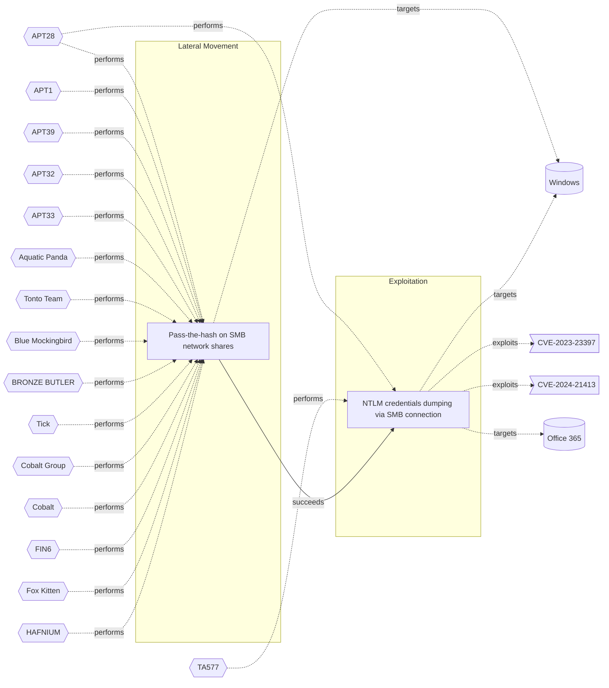

# ☣️ NTLM credentials dumping via SMB connection

🔥 **Criticality:High** ⚠️ : A High priority incident is likely to result in a demonstrable impact to public health or safety, national security, economic security, foreign relations, civil liberties, or public confidence. 

🚦 **TLP:CLEAR** ⚪ : Recipients can spread this to the world, there is no limit on disclosure.

🗡️ **ATT&CK Techniques** [T1187 : Forced Authentication](https://attack.mitre.org/techniques/T1187 'Adversaries may gather credential material by invoking or forcing a user to automatically provide authentication information through a mechanism in wh'), [T1190 : Exploit Public-Facing Application](https://attack.mitre.org/techniques/T1190 'Adversaries may attempt to exploit a weakness in an Internet-facing host or system to initially access a network The weakness in the system can be a s'), [T1068 : Exploitation for Privilege Escalation](https://attack.mitre.org/techniques/T1068 'Adversaries may exploit software vulnerabilities in an attempt to elevate privileges Exploitation of a software vulnerability occurs when an adversary'), [T1212 : Exploitation for Credential Access](https://attack.mitre.org/techniques/T1212 'Adversaries may exploit software vulnerabilities in an attempt to collect credentials Exploitation of a software vulnerability occurs when an adversar')

---

`🔑 UUID : 02311e3e-b7b8-4369-9e1e-74c0a844ae0f` **|** `🏷️ Version : 3` **|** `🗓️ Creation Date : 2023-03-17` **|** `🗓️ Last Modification : 2025-02-24` **|** `Sharing Organisation : {'uuid': '56b0a0f0-b0bc-47d9-bb46-02f80ae2065a', 'name': 'EC DIGIT CSOC'}` **|** `🧱 Schema Identifier : tvm::2.0`

## 👁️ Description

> ### Attack vector related to Outlook vulnerability CVE-2023-23397
> 
> **key point: no user interaction**  
> 
> An attacker sends an email message with an extended MAPI property with a 
> UNC path pointing to an SMB network share on a threat actor-controlled 
> server.  
> 
> When a vulnerable Microsoft Outlook client (CVE-2023-23397) 
> receives in the inbox, it processes that email.  
> 
> Without any user interaction, a connection to the remote SMB server is 
> established and the user's NTLM negotiation message are passed in the 
> hearders.  
> 
> The attacker can capture this message tp replay for authentication 
> against other systems that support NTLM authentication.  
> 
> The attacker may also try to crack the original password if not too 
> complex.  
> 
> The outbound NTLM negotiation message is passed with SMB and WebDav 
> protocols (see Didier Steven's blog).
> 
> ### Attack vector using a link a user will be enticed to click on
> 
> **key point: the user needs to click on the link**  
> 
> This attack is a subset of attackers objectives when using spear 
> phishing emails with a link in message body or in an attachment.
> 
> #### Attack vector using Outlook vulnerability
> 
> A vulnerability like CVE-2024-21413, also known as the MonikerLink bug, 
> allows remote code execution and the leakage of local NTLM information.  
> 
> Moniker-based links exploit a logic flaw in how vulnerable versions
> of Outlook process certain file types, causing files to open in
> editing mode instead of the sandboxed `Protected View`.  
> 
> If the malicious link points to SMB shares controlled by the attacker,
> Windows automatically attempts to authenticate using NTLM credentials
> enabling threat actors to steal NTLMv2 hashes for initial access.  
> 

## 🖥️ Terrain 

 > - vulnerable Outlook clients CVE-2023-23397  
> - spearphising with a link to a SMB network share  
> - SMB or Webdav protocols are allowed to connect to external network shares
> directly or via a proxy
> 

 &nbsp;
### ❤️‍🩹 Common Vulnerability Enumeration

⚠️ ERROR : Could not successfully retrieve CVE Details, double check the broken links below to confirm the CVE ID exists.

- [💔 CVE-2023-23397](https://nvd.nist.gov/vuln/detail/CVE-2023-23397)
- [💔 CVE-2024-21413](https://nvd.nist.gov/vuln/detail/CVE-2024-21413)

&nbsp;

---

## 🕸️ Relations

### 🐲 Actors sightings 

| Actor          | Description                                                                                                                                                                                                                                                                                                                                                                                                                                                                                                                                                                                                                                                                                                                                                                                                                                                                                                                                                                                                                                                                                                                                                                                                                                                                                                                                                                                                                                                                                                                                                                                                                                                                                                                                          | Aliases                                                                                                                                                                                                                                                                                                   | Source                     | Sighting               | Reference                |
|:---------------|:-----------------------------------------------------------------------------------------------------------------------------------------------------------------------------------------------------------------------------------------------------------------------------------------------------------------------------------------------------------------------------------------------------------------------------------------------------------------------------------------------------------------------------------------------------------------------------------------------------------------------------------------------------------------------------------------------------------------------------------------------------------------------------------------------------------------------------------------------------------------------------------------------------------------------------------------------------------------------------------------------------------------------------------------------------------------------------------------------------------------------------------------------------------------------------------------------------------------------------------------------------------------------------------------------------------------------------------------------------------------------------------------------------------------------------------------------------------------------------------------------------------------------------------------------------------------------------------------------------------------------------------------------------------------------------------------------------------------------------------------------------|:----------------------------------------------------------------------------------------------------------------------------------------------------------------------------------------------------------------------------------------------------------------------------------------------------------|:---------------------------|:-----------------------|:-------------------------|
| [Mobile] APT28 | [APT28](https://attack.mitre.org/groups/G0007) is a threat group that has been attributed to Russia's General Staff Main Intelligence Directorate (GRU) 85th Main Special Service Center (GTsSS) military unit 26165.(Citation: NSA/FBI Drovorub August 2020)(Citation: Cybersecurity Advisory GRU Brute Force Campaign July 2021) This group has been active since at least 2004.(Citation: DOJ GRU Indictment Jul 2018)(Citation: Ars Technica GRU indictment Jul 2018)(Citation: Crowdstrike DNC June 2016)(Citation: FireEye APT28)(Citation: SecureWorks TG-4127)(Citation: FireEye APT28 January 2017)(Citation: GRIZZLY STEPPE JAR)(Citation: Sofacy DealersChoice)(Citation: Palo Alto Sofacy 06-2018)(Citation: Symantec APT28 Oct 2018)(Citation: ESET Zebrocy May 2019)[APT28](https://attack.mitre.org/groups/G0007) reportedly compromised the Hillary Clinton campaign, the Democratic National Committee, and the Democratic Congressional Campaign Committee in 2016 in an attempt to interfere with the U.S. presidential election.(Citation: Crowdstrike DNC June 2016) In 2018, the US indicted five GRU Unit 26165 officers associated with [APT28](https://attack.mitre.org/groups/G0007) for cyber operations (including close-access operations) conducted between 2014 and 2018 against the World Anti-Doping Agency (WADA), the US Anti-Doping Agency, a US nuclear facility, the Organization for the Prohibition of Chemical Weapons (OPCW), the Spiez Swiss Chemicals Laboratory, and other organizations.(Citation: US District Court Indictment GRU Oct 2018) Some of these were conducted with the assistance of GRU Unit 74455, which is also referred to as [Sandworm Team](https://attack.mitre.org/groups/G0034). | FROZENLAKE, Fancy Bear, Forest Blizzard, Group 74, GruesomeLarch, IRON TWILIGHT, Pawn Storm, SNAKEMACKEREL, STRONTIUM, Sednit, Sofacy, Swallowtail, TG-4127, Threat Group-4127, Tsar Team                                                                                                                 | 🗡️ MITRE ATT&CK Groups     | No documented sighting | No documented references |
| APT28          | The Sofacy Group (also known as APT28, Pawn Storm, Fancy Bear and Sednit) is a cyber espionage group believed to have ties to the Russian government. Likely operating since 2007, the group is known to target government, military, and security organizations. It has been characterized as an advanced persistent threat.                                                                                                                                                                                                                                                                                                                                                                                                                                                                                                                                                                                                                                                                                                                                                                                                                                                                                                                                                                                                                                                                                                                                                                                                                                                                                                                                                                                                                        | Pawn Storm, FANCY BEAR, Sednit, SNAKEMACKEREL, Tsar Team, TG-4127, STRONTIUM, Swallowtail, IRON TWILIGHT, Group 74, SIG40, Grizzly Steppe, G0007, ATK5, Fighting Ursa, ITG05, Blue Athena, TA422, T-APT-12, APT-C-20, UAC-0028, FROZENLAKE, Sofacy, Forest Blizzard, BlueDelta, Fancy Bear, GruesomeLarch | 🌌 MISP Threat Actor Galaxy | No documented sighting | No documented references |
| TA577          | TA577 is a prolific cybercrime threat actor tracked by Proofpoint since mid-2020. This actor conducts broad targeting across various industries and geographies, and Proofpoint has observed TA577 deliver payloads including Qbot, IcedID, SystemBC, SmokeLoader, Ursnif, and Cobalt Strike.                                                                                                                                                                                                                                                                                                                                                                                                                                                                                                                                                                                                                                                                                                                                                                                                                                                                                                                                                                                                                                                                                                                                                                                                                                                                                                                                                                                                                                                        | Hive0118                                                                                                                                                                                                                                                                                                  | 🌌 MISP Threat Actor Galaxy | No documented sighting | No documented references |

### 🌊 OpenTide Objects
🚫 No related OpenTide objects indexed.

 --- 

### ⛓️ Threat Chaining

Expand chaining data

| ☣️ Vector                                                                                                                                                                                                                                                                  | ⛓️ Link              | 🎯 Target                                                                                                                                                                                                                                                                                     | ⛰️ Terrain                                                                                                                                                                                            | 🗡️ ATT&CK                                                                                                                                                                                                                                                                                                                                                                                                                                                                                                                                                                                                                                                                                                                                                                                                                                                                                                                                                                                   |
|:---------------------------------------------------------------------------------------------------------------------------------------------------------------------------------------------------------------------------------------------------------------------------|:---------------------|:---------------------------------------------------------------------------------------------------------------------------------------------------------------------------------------------------------------------------------------------------------------------------------------------|:------------------------------------------------------------------------------------------------------------------------------------------------------------------------------------------------------|:--------------------------------------------------------------------------------------------------------------------------------------------------------------------------------------------------------------------------------------------------------------------------------------------------------------------------------------------------------------------------------------------------------------------------------------------------------------------------------------------------------------------------------------------------------------------------------------------------------------------------------------------------------------------------------------------------------------------------------------------------------------------------------------------------------------------------------------------------------------------------------------------------------------------------------------------------------------------------------------------|
| [Pass-the-hash on SMB network shares](../Threat%20Vectors/☣️%20Pass-the-hash%20on%20SMB%20network%20shares.md 'In a Pass-the-Hash attack PtH, Attackers may use offensive tools to load the NTLM hash and try to connect to SMB network shares that are reachable fro...') | `sequence::succeeds` | [NTLM credentials dumping via SMB connection](../Threat%20Vectors/☣️%20NTLM%20credentials%20dumping%20via%20SMB%20connection.md '### Attack vector related to Outlook vulnerability CVE-2023-23397key point no user interaction  An attacker sends an email message with an extended MA...') | - vulnerable Outlook clients CVE-2023-23397   - spearphising with a link to a SMB network share   - SMB or Webdav protocols are allowed to connect to external network shares directly or via a proxy | [T1187 : Forced Authentication](https://attack.mitre.org/techniques/T1187 'Adversaries may gather credential material by invoking or forcing a user to automatically provide authentication information through a mechanism in wh'), [T1190 : Exploit Public-Facing Application](https://attack.mitre.org/techniques/T1190 'Adversaries may attempt to exploit a weakness in an Internet-facing host or system to initially access a network The weakness in the system can be a s'), [T1068 : Exploitation for Privilege Escalation](https://attack.mitre.org/techniques/T1068 'Adversaries may exploit software vulnerabilities in an attempt to elevate privileges Exploitation of a software vulnerability occurs when an adversary'), [T1212 : Exploitation for Credential Access](https://attack.mitre.org/techniques/T1212 'Adversaries may exploit software vulnerabilities in an attempt to collect credentials Exploitation of a software vulnerability occurs when an adversar') |

&nbsp; 

---

## Model Data

#### **⛓️ Cyber Kill Chain**

 > Cyber attacks are typically phased progressions towards strategic objectives. The Unified Kill Chains provides insight into the tactics that hackers employ to attain these objectives. This provides a solid basis to develop (or realign) defensive strategies to raise cyber resilience.

 [`💥 Exploitation`](https://www.unifiedkillchain.com/assets/The-Unified-Kill-Chain.pdf) : Techniques to exploit vulnerabilities in systems that may, amongst others, result in code execution.

---

#### **🛰️ Domains**

 > Infrastructure technologies domain of interest to attackers.

 `🏢 Enterprise` : Generic databases, applications, machines and systems that are usually on premises or on Cloud traditional VMs.

---

#### **🎯 Targets**

 > Granular delimited technical entities holding a value to the organization, that are targeted by adversaries. They might be also involved in the detection coverage as the target of log collection. Partially inspired by Veris.

  - [`🖥️ Desktop`](http://veriscommunity.net/enums.html#section-asset) : User Device - Desktop or workstation
 - [`💻 Laptop`](http://veriscommunity.net/enums.html#section-asset) : User Device - Laptop
 - [`🖥️ Workstations`](http://veriscommunity.net/enums.html#section-asset) : Placeholder
 - [`👤 End-user`](http://veriscommunity.net/enums.html#section-asset) : People - End-user
 - [`📧 Email Platform`](http://veriscommunity.net/enums.html#section-asset) : Placeholder
 - [`👤 Customer`](http://veriscommunity.net/enums.html#section-asset) : People - Customer

---

#### **💿 Platforms concerned**

 > Actual technologies used by the organization that will be exploited by adversaries during a successful attack, and eventually of relevance for detection. Are named by commercial designation.

  - ` Windows` : Placeholder
 - ` Office 365` : Placeholder

---

#### **💣 Severity**

 > The severity summarizes the overall danger of incident the vector will provoke, and is to be derived (WIP) from impact, leverage, and difficulty to execute.

 [`🧨 Moderate incident`](https://www.ncsc.gov.uk/news/new-cyber-attack-categorisation-system-improve-uk-response-incidents) : A cyber attack on a small organisation, or which poses a considerable risk to a medium-sized organisation, or preliminary indications of cyber activity against a large organisation or the government.

---

#### **🪄 Leverage acquisition**

 > Technical aftermath of the attack from the target perspective, differentiated from impact as it does not consider the value of the consequence, only what increased control the vector execution provides to the adversary.

  - [`👁️‍🗨️ Information Disclosure`](https://owasp.org/www-community/Threat_Modeling_Process#stride) : Threat action intending to read a file that one was not granted access to, or to read data in transit.
 - [`💀 Infrastructure Compromise`](https://owasp.org/www-community/Threat_Modeling_Process#stride) : The compromised target is likely to be used to further expand the sphere of influence of the attacker and allow more potent vectors to be executed.

---

#### **💥 Impact**

 > Analysis of the threat vector from the organizational perspective, in non technical term. This aims at putting a clear denomination on what the attacker will actually be able to act upon if the threat vector is realized.

  - [`🔓 Data Breach`](http://veriscommunity.net/enums.html#section-impact) : Non-public information has been accessed from the outside, and successfully extracted.
 - [`🥸 Identity Theft`](http://veriscommunity.net/enums.html#section-impact) : Acquisition of sufficient information and privileges to profess as a given individual, for the purpose of abusing and deceiving human trust relationships.

---

#### **🎲 Vector Viability**

 > Described with estimative language (likelyhood probability), describes how likely the analyst believes the vector to actually be realized on the organization infrastructure. Estimative language describes quality and credibility of underlying sources, data, and methodologies based Intelligence Community Directive 203 (ICD 203) and JP 2-0, Joint Intelligence.

 [`🧐 Likely`](https://www.dni.gov/files/documents/ICD/ICD%20203%20Analytic%20Standards.pdf) : Probable (probably) - 55-80%

---

### 🔗 References

**🕊️ Publicly available resources**

- [_1_] https://msrc.microsoft.com/blog/2023/03/microsoft-mitigates-outlook-elevation-of-privilege-vulnerability/
- [_2_] https://www.mdsec.co.uk/2023/03/exploiting-cve-2023-23397-microsoft-outlook-elevation-of-privilege-vulnerability/
- [_3_] https://community.fireeye.com/s/question/0D53x00009EiMFOCA3/outlook-0day-cve202323397-protection
- [_4_] https://blog.didierstevens.com/2019/05/20/webdav-ntlm-responder/
- [_5_] https://blog.didierstevens.com/2017/11/13/webdav-traffic-to-malicious-sites/

[1]: https://msrc.microsoft.com/blog/2023/03/microsoft-mitigates-outlook-elevation-of-privilege-vulnerability/
[2]: https://www.mdsec.co.uk/2023/03/exploiting-cve-2023-23397-microsoft-outlook-elevation-of-privilege-vulnerability/
[3]: https://community.fireeye.com/s/question/0D53x00009EiMFOCA3/outlook-0day-cve202323397-protection
[4]: https://blog.didierstevens.com/2019/05/20/webdav-ntlm-responder/
[5]: https://blog.didierstevens.com/2017/11/13/webdav-traffic-to-malicious-sites/

---

#### 🏷️ Tags

#-, #-, #-, #
, #
, ##, ##, ##, ##, # , #🏷, #️, # , #T, #a, #g, #s, #
, #

