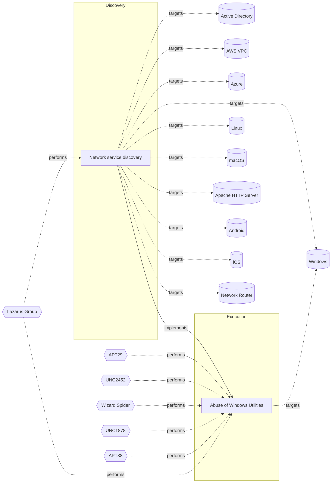

# ☣️ Network service discovery

🔥 **Criticality:Medium** ❗ : A Medium priority incident may affect public health or safety, national security, economic security, foreign relations, civil liberties, or public confidence. 

🚦 **TLP:CLEAR** ⚪ : Recipients can spread this to the world, there is no limit on disclosure.

🗡️ **ATT&CK Techniques** [T1046 : Network Service Discovery](https://attack.mitre.org/techniques/T1046 'Adversaries may attempt to get a listing of services running on remote hosts and local network infrastructure devices, including those that may be vul')

---

`🔑 UUID : fd0542bd-1541-42a7-8c07-0e073a198a53` **|** `🏷️ Version : 1` **|** `🗓️ Creation Date : 2025-02-04` **|** `🗓️ Last Modification : 2025-02-04` **|** `Sharing Organisation : {'uuid': '56b0a0f0-b0bc-47d9-bb46-02f80ae2065a', 'name': 'EC DIGIT CSOC'}` **|** `🧱 Schema Identifier : tvm::2.1`

## 👁️ Description

> Network service discovery is the process of identifying and mapping
> the services and applications running on a network. This can include
> discovering open ports, protocols, and services, as well as identifying
> the operating systems and devices connected to the network. Devices that
> support NSD include printers, webcams, HTTPS servers, and other mobile
> devices ref [1].  
> 
> Adversaries may attempt to get a listing of services running on remote hosts, 
> including those that may be vulnerable to remote software exploitation. 
> Methods to acquire this information include port scans and vulnerability 
> scans, using tools that are brought onto a system.  
> 
> ### Types of Network Service Discovery:
> 
> - Active Scanning: Sending probes to the network to gather information
> about the services and devices connected.
> - Passive Scanning: Monitoring network traffic to gather information
> about the services and devices connected.
> - OS Detection: Identifying the operating system and device type
> connected to the network.
> 
> ### Some of the tools which can be used for network service discovery:
> 
> - Nmap: A popular network scanning tool that can perform active and
> passive scanning.
> - Netcat - this tool is a command-line utility scanning tool across
> network connections over TCP and UDP protocols. It scan ports, transfer
> files, create chat servers, and perform HTTP requests ref [7].  
> - MASSCAN - Internet-scale port scanner. It can scan the entire network
> in a very short interval of time ref [8].   
> - OpenVAS: A vulnerability scanner that can perform network service
> discovery and identify potential vulnerabilities.
> - Nessus: A vulnerability scanner that can perform network service
> discovery and identify potential vulnerabilities.
> - Wireshark: A network protocol analyzer that can be used to monitor
> network traffic and identify services and devices connected.
> - Netstat (net commands Windows): A command-line tool that can be used
> to view active
> network connections and listening ports.
> - Native Bonjour application
> - Intermapper tool: Stands out for its strong focus on visual network
> discovery and mapping. A free 30-day trial is available on request.
> - NetBrain: Goes beyond traditional network discovery tools, offering
> a comprehensive solution for visualizing, managing, and automating
> hybrid networks.
> 
> Example for such activity could be scan port in a specific ip and
> port ranges.
> 

## 🖥️ Terrain 

 > An adversary is looking to exploit native system applications
> or to use enumeration external tools in an attempt to find
> an entry network point.   
> 

---

## 🕸️ Relations

### 🐲 Actors sightings 

| Actor               | Description                                                                                                                                                                                                                                                                                                                                                                                                                                                                                                                                                                                                                                                                                                                                                                                                                                                                                                                                                                                                                                                                                                                                                                                                                                               | Aliases                                                                                                                                                                                                                                                                                                                                                                                                                                                                                                                                                | Source                     | Sighting                                                                                                                                                                                        | Reference                                                                                                         |
|:--------------------|:----------------------------------------------------------------------------------------------------------------------------------------------------------------------------------------------------------------------------------------------------------------------------------------------------------------------------------------------------------------------------------------------------------------------------------------------------------------------------------------------------------------------------------------------------------------------------------------------------------------------------------------------------------------------------------------------------------------------------------------------------------------------------------------------------------------------------------------------------------------------------------------------------------------------------------------------------------------------------------------------------------------------------------------------------------------------------------------------------------------------------------------------------------------------------------------------------------------------------------------------------------|:-------------------------------------------------------------------------------------------------------------------------------------------------------------------------------------------------------------------------------------------------------------------------------------------------------------------------------------------------------------------------------------------------------------------------------------------------------------------------------------------------------------------------------------------------------|:---------------------------|:------------------------------------------------------------------------------------------------------------------------------------------------------------------------------------------------|:------------------------------------------------------------------------------------------------------------------|
| [ICS] Lazarus Group | [Lazarus Group](https://attack.mitre.org/groups/G0032) is a North Korean state-sponsored cyber threat group that has been attributed to the Reconnaissance General Bureau.(Citation: US-CERT HIDDEN COBRA June 2017)(Citation: Treasury North Korean Cyber Groups September 2019) The group has been active since at least 2009 and was reportedly responsible for the November 2014 destructive wiper attack against Sony Pictures Entertainment as part of a campaign named Operation Blockbuster by Novetta. Malware used by [Lazarus Group](https://attack.mitre.org/groups/G0032) correlates to other reported campaigns, including Operation Flame, Operation 1Mission, Operation Troy, DarkSeoul, and Ten Days of Rain.(Citation: Novetta Blockbuster)North Korean group definitions are known to have significant overlap, and some security researchers report all North Korean state-sponsored cyber activity under the name [Lazarus Group](https://attack.mitre.org/groups/G0032) instead of tracking clusters or subgroups, such as [Andariel](https://attack.mitre.org/groups/G0138), [APT37](https://attack.mitre.org/groups/G0067), [APT38](https://attack.mitre.org/groups/G0082), and [Kimsuky](https://attack.mitre.org/groups/G0094). | Diamond Sleet, Guardians of Peace, HIDDEN COBRA, Labyrinth Chollima, NICKEL ACADEMY, ZINC                                                                                                                                                                                                                                                                                                                                                                                                                                                              | 🗡️ MITRE ATT&CK Groups     | Lazarus Group employs sophisticated reconnaissance techniques, including active port scanning and passive traffic analysis, to map out enterprise environments and identify vulnerable systems. | https://ics-cert.kaspersky.com/publications/reports/2021/02/25/lazarus-targets-defense-industry-with-threatneedle |
| Lazarus Group       | Since 2009, HIDDEN COBRA actors have leveraged their capabilities to target and compromise a range of victims; some intrusions have resulted in the exfiltration of data while others have been disruptive in nature. Commercial reporting has referred to this activity as Lazarus Group and Guardians of Peace. Tools and capabilities used by HIDDEN COBRA actors include DDoS botnets, keyloggers, remote access tools (RATs), and wiper malware. Variants of malware and tools used by HIDDEN COBRA actors include Destover, Duuzer, and Hangman.                                                                                                                                                                                                                                                                                                                                                                                                                                                                                                                                                                                                                                                                                                    | Operation DarkSeoul, Dark Seoul, Hidden Cobra, Hastati Group, Andariel, Unit 121, Bureau 121, NewRomanic Cyber Army Team, Bluenoroff, Subgroup: Bluenoroff, Group 77, Labyrinth Chollima, Operation Troy, Operation GhostSecret, Operation AppleJeus, APT38, APT 38, Stardust Chollima, Whois Hacking Team, Zinc, Appleworm, Nickel Academy, APT-C-26, NICKEL GLADSTONE, COVELLITE, ATK3, G0032, ATK117, G0082, Citrine Sleet, DEV-0139, DEV-1222, Diamond Sleet, ZINC, Sapphire Sleet, COPERNICIUM, TA404, Lazarus group, BeagleBoyz, Moonstone Sleet | 🌌 MISP Threat Actor Galaxy | No documented sighting                                                                                                                                                                          | No documented references                                                                                          |

### 🌊 OpenTide Objects
🚫 No related OpenTide objects indexed.

 --- 

### ⛓️ Threat Chaining

Expand chaining data

| ☣️ Vector                                                                                                                                                                                                                                          | ⛓️ Link                 | 🎯 Target                                                                                                                                                                                                                                               | ⛰️ Terrain                                                                                                                                                                                          | 🗡️ ATT&CK                                                                                                                                                                                                                                                                                                                                                                                                                                                                                                                                                                                                                                                                                                                                                                                                                                                                                                                                                                                                                                                                                                                                                                                                                                                                                                                                                                                                                                                                                                         |
|:---------------------------------------------------------------------------------------------------------------------------------------------------------------------------------------------------------------------------------------------------|:------------------------|:-------------------------------------------------------------------------------------------------------------------------------------------------------------------------------------------------------------------------------------------------------|:----------------------------------------------------------------------------------------------------------------------------------------------------------------------------------------------------|:------------------------------------------------------------------------------------------------------------------------------------------------------------------------------------------------------------------------------------------------------------------------------------------------------------------------------------------------------------------------------------------------------------------------------------------------------------------------------------------------------------------------------------------------------------------------------------------------------------------------------------------------------------------------------------------------------------------------------------------------------------------------------------------------------------------------------------------------------------------------------------------------------------------------------------------------------------------------------------------------------------------------------------------------------------------------------------------------------------------------------------------------------------------------------------------------------------------------------------------------------------------------------------------------------------------------------------------------------------------------------------------------------------------------------------------------------------------------------------------------------------------|
| [Network service discovery](../Threat%20Vectors/☣️%20Network%20service%20discovery.md 'Network service discovery is the process of identifying and mappingthe services and applications running on a network This can includediscovering open...') | `atomicity::implements` | [Abuse of Windows Utilities](../Threat%20Vectors/☣️%20Abuse%20of%20Windows%20Utilities.md 'Advanced threat actors frequently abuse legitimate Windows utilities to execute malicious code, evade detection, and maintain persistence This techniq...') | Adversaries must have access to a Windows environment where they can execute  built-in utilities. Limited user privileges may suffice,  but administrative privileges enhance the potential impact. | [T1218](https://attack.mitre.org/techniques/T1218 'Adversaries may bypass process andor signature-based defenses by proxying execution of malicious content with signed, or otherwise trusted, binaries B'), [T1197](https://attack.mitre.org/techniques/T1197 'Adversaries may abuse BITS jobs to persistently execute code and perform various background tasks Windows Background Intelligent Transfer Service BITS'), [T1218.004](https://attack.mitre.org/techniques/T1218/004 'Adversaries may use InstallUtil to proxy execution of code through a trusted Windows utility InstallUtil is a command-line utility that allows for ins'), [T1563](https://attack.mitre.org/techniques/T1563 'Adversaries may take control of preexisting sessions with remote services to move laterally in an environment Users may use valid credentials to log i'), [T1140](https://attack.mitre.org/techniques/T1140 'Adversaries may use Obfuscated Files or InformationhttpsattackmitreorgtechniquesT1027 to hide artifacts of an intrusion from analysis They may require'), [T1218.010](https://attack.mitre.org/techniques/T1218/010 'Adversaries may abuse Regsvr32exe to proxy execution of malicious code Regsvr32exe is a command-line program used to register and unregister object li'), [T1218.005](https://attack.mitre.org/techniques/T1218/005 'Adversaries may abuse mshtaexe to proxy execution of malicious hta files and Javascript or VBScript through a trusted Windows utility There are severa') |

&nbsp; 

---

## Model Data

#### **⛓️ Cyber Kill Chain**

 > Cyber attacks are typically phased progressions towards strategic objectives. The Unified Kill Chains provides insight into the tactics that hackers employ to attain these objectives. This provides a solid basis to develop (or realign) defensive strategies to raise cyber resilience.

 [`🧭 Discovery`](https://www.unifiedkillchain.com/assets/The-Unified-Kill-Chain.pdf) : Techniques that allow an attacker to gain knowledge about a system and its network environment.

---

#### **🛰️ Domains**

 > Infrastructure technologies domain of interest to attackers.

  - `🏢 Enterprise` : Generic databases, applications, machines and systems that are usually on premises or on Cloud traditional VMs.
 - `🦾 IoT` : Placeholder
 - `📱 Mobile` : Smartphones, tablets and applications running these devices.
 - `☁️ Private Cloud` : Infrastructure hosted at a third party, but based on custom specification and managed on a platform level.
 - `☁️ Public Cloud` : Infrastructure handled by a commercial cloud provider. Managed mostly on a service level, and connected over the internet.

---

#### **🎯 Targets**

 > Granular delimited technical entities holding a value to the organization, that are targeted by adversaries. They might be also involved in the detection coverage as the target of log collection. Partially inspired by Veris.

  - [`👤 End-user`](http://veriscommunity.net/enums.html#section-asset) : People - End-user
 - [`🔥 Firewall`](http://veriscommunity.net/enums.html#section-asset) : Network - Firewall
 - [`🌐 LAN`](http://veriscommunity.net/enums.html#section-asset) : Network - Wired LAN
 - [`💻 Laptop`](http://veriscommunity.net/enums.html#section-asset) : User Device - Laptop
 - [`🌐 Network Equipment`](http://veriscommunity.net/enums.html#section-asset) : Placeholder
 - [`🌐 Router or switch`](http://veriscommunity.net/enums.html#section-asset) : Network - Router or switch
 - [`🖥️ Workstations`](http://veriscommunity.net/enums.html#section-asset) : Placeholder
 - [`👤 Customer`](http://veriscommunity.net/enums.html#section-asset) : People - Customer
 - [`📱 Mobile phone`](http://veriscommunity.net/enums.html#section-asset) : User Device - Mobile phone or smartphone
 - [`🖨️ Peripheral`](http://veriscommunity.net/enums.html#section-asset) : User Device - Peripheral (e.g., printer, copier, fax)
 - [`🖥️ Web Application Servers`](http://veriscommunity.net/enums.html#section-asset) : Placeholder
 - [` Other`](http://veriscommunity.net/enums.html#section-asset) : Media - Other/Unknown
 - [`🖥️ Public-Facing Servers`](http://veriscommunity.net/enums.html#section-asset) : Placeholder

---

#### **💿 Platforms concerned**

 > Actual technologies used by the organization that will be exploited by adversaries during a successful attack, and eventually of relevance for detection. Are named by commercial designation.

  - ` Active Directory` : Placeholder
 - [` AWS VPC`](https://docs.aws.amazon.com/vpc/latest/userguide/what-is-amazon-vpc.html) : A virtual private cloud (VPC) is a virtual network dedicated to your AWS account. It is logically isolated from other virtual networks in the AWS Cloud. You can launch your AWS resources, such as Amazon EC2 instances, into your VPC.
 - ` Azure` : Placeholder
 - ` Windows` : Placeholder
 - ` Linux` : Placeholder
 - ` macOS` : Placeholder
 - ` Apache HTTP Server` : Placeholder
 - ` Android` : Placeholder
 - ` iOS` : Placeholder
 - ` Network Router` : Placeholder

---

#### **💣 Severity**

 > The severity summarizes the overall danger of incident the vector will provoke, and is to be derived (WIP) from impact, leverage, and difficulty to execute.

 [`🔫 Localised incident`](https://www.ncsc.gov.uk/news/new-cyber-attack-categorisation-system-improve-uk-response-incidents) : A cyber attack on an individual, or preliminary indications of cyber activity against a small or medium-sized organisation.

---

#### **🪄 Leverage acquisition**

 > Technical aftermath of the attack from the target perspective, differentiated from impact as it does not consider the value of the consequence, only what increased control the vector execution provides to the adversary.

  - [`🦠 Dwelling`](https://owasp.org/www-community/Threat_Modeling_Process#stride) : Active or passive extended presence in the target, which performs adversarial operations continuously.
 - [`💀 Infrastructure Compromise`](https://owasp.org/www-community/Threat_Modeling_Process#stride) : The compromised target is likely to be used to further expand the sphere of influence of the attacker and allow more potent vectors to be executed.
 - [`🐒 Tampering`](https://owasp.org/www-community/Threat_Modeling_Process#stride) : Threat action intending to maliciously change or modify persistent data, such as records in a database, and the alteration of data in transit between two computers over an open network, such as the Internet.

---

#### **💥 Impact**

 > Analysis of the threat vector from the organizational perspective, in non technical term. This aims at putting a clear denomination on what the attacker will actually be able to act upon if the threat vector is realized.

  - [`🩼 Impairement`](http://veriscommunity.net/enums.html#section-impact) : Incapacitation of a particular key system that will cause disruptions in day-to-day operations, and eventually service delivery.
 - [`🤬 Lose Capabilities`](http://veriscommunity.net/enums.html#section-impact) : Vector execution will remove key functions to the organization, which will not be easily circumvented. Most day-to-day is heavily impaired, but processes can reorganize at a loss.
 - [`😤 Nuisance`](http://veriscommunity.net/enums.html#section-impact) : Small and mostly inconsequential to day to day operations, but noticed.

---

#### **🎲 Vector Viability**

 > Described with estimative language (likelyhood probability), describes how likely the analyst believes the vector to actually be realized on the organization infrastructure. Estimative language describes quality and credibility of underlying sources, data, and methodologies based Intelligence Community Directive 203 (ICD 203) and JP 2-0, Joint Intelligence.

 [`🧐 Likely`](https://www.dni.gov/files/documents/ICD/ICD%20203%20Analytic%20Standards.pdf) : Probable (probably) - 55-80%

---

### 🔗 References

**🕊️ Publicly available resources**

- [_1_] https://developer.android.com/training/connect-devices-wirelessly/nsd
- [_2_] https://en.wikipedia.org/wiki/Service_discovery
- [_3_] https://www.w3.org/TR/discovery-api/
- [_4_] https://www.servicenow.com/products/it-operations-management/what-is-network-discovery.html
- [_5_] https://medium.com/@andrenogueira.dev/network-service-discovery-on-android-simplifying-device-communication-5de1d2d9996b
- [_6_] https://www.bleepingcomputer.com/sysadmin/guides/best-network-discovery-tools/
- [_7_] https://linuxize.com/post/netcat-nc-command-with-examples/
- [_8_] https://github.com/robertdavidgraham/masscan

[1]: https://developer.android.com/training/connect-devices-wirelessly/nsd
[2]: https://en.wikipedia.org/wiki/Service_discovery
[3]: https://www.w3.org/TR/discovery-api/
[4]: https://www.servicenow.com/products/it-operations-management/what-is-network-discovery.html
[5]: https://medium.com/@andrenogueira.dev/network-service-discovery-on-android-simplifying-device-communication-5de1d2d9996b
[6]: https://www.bleepingcomputer.com/sysadmin/guides/best-network-discovery-tools/
[7]: https://linuxize.com/post/netcat-nc-command-with-examples/
[8]: https://github.com/robertdavidgraham/masscan

---

#### 🏷️ Tags

#-, #-, #-, #
, #
, ##, ##, ##, ##, # , #🏷, #️, # , #T, #a, #g, #s, #
, #

