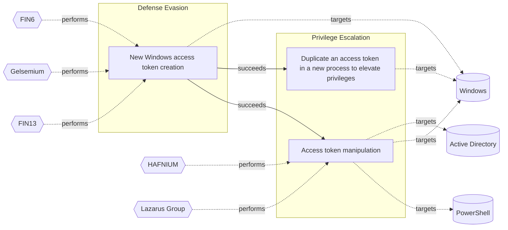

# ☣️ New Windows access token creation

🔥 **Criticality:High** ⚠️ : A High priority incident is likely to result in a demonstrable impact to public health or safety, national security, economic security, foreign relations, civil liberties, or public confidence. 

🚦 **TLP:CLEAR** ⚪ : Recipients can spread this to the world, there is no limit on disclosure.

🗡️ **ATT&CK Techniques** [T1134.003 : Access Token Manipulation: Make and Impersonate Token](https://attack.mitre.org/techniques/T1134/003 'Adversaries may make new tokens and impersonate users to escalate privileges and bypass access controls For example, if an adversary has a username an')

---

`🔑 UUID : 1962f0c7-2f2f-4b4c-bab0-733af8033595` **|** `🏷️ Version : 1` **|** `🗓️ Creation Date : 2025-02-19` **|** `🗓️ Last Modification : 2025-02-27` **|** `Sharing Organisation : {'uuid': '56b0a0f0-b0bc-47d9-bb46-02f80ae2065a', 'name': 'EC DIGIT CSOC'}` **|** `🧱 Schema Identifier : tvm::2.1`

## 👁️ Description

> A Windows access token is a data structure that contains information
> about a user's security context, including their security identifier
> (SID), group membership, privileges, and other security-related
> information. When a user logs in, the system generates an access
> token for them. A threat actor may create such access token on
> behalf of the Windows user and to use it to access system resources
> or to escalate privileges for further access or lateral movement
> ref [1].    
> 
> ### Windows access token creation steps
> 
> The access token creation process in Windows involves
> the following steps:
> 
> - The Local Security Authority (LSA) validates the user's
> credentials (e.g., username and password).
> - The LSA creates a security database entry (SDBE) for the user.
> - The LSA generates an access token for the user based on the SDBE
> and the user's security context.
> - The LSA attaches the access token to the user's logon session.
> 
> ### Abuse of Windows API functions to create an access token
> 
> A threat actor can use the native Windows API functions to manipulate
> the access token, such as `DuplicateToken`, `CreateProcessAsUser`,
> `CreateRestrictedToken` and `SetThreadToken`. 
> 
> `CreateRestrictedToken` API  creates a version of an existing token
> with reduced privileges by stripping out certain rights.
> 
> By manipulating these functions, the attacker can create a new token
> with elevated privileges or mimic another user's token ref [3].    
> 
> ### Usage of runas commands
> 
> Threat actors can use a set of runas commands to generate a new user's
> access tokens and to use it on behalf on a legitimate user ref [a, 3].  
> 
> Example:
> 
> `runas /user:domain\administrator cmd`
> 
> The adversaries commonly use user's token to elevate their security
> context from the administrator level to the SYSTEM level. An adversary
> can use a token to authenticate to a remote system as the account for
> that token if the  account has appropriate permissions on the remote
> system. 
> 
> ### Known toolset used by the threat actors
> 
> - Mimikatz
> - Windows API (WinAPI)
> - PowerShell
> - Windows Token Manager (WNTM)
> - Cobalt Strike
> - Metasploit
> - Windows Internal Database (WID)
> - Token Universe tool, ref [4] 
> 

## 🖥️ Terrain 

 > A threat actor exploits native Windows features as Windows API calls or
> Windows native commands to generate in the system a new user access token. 
> 

---

## 🕸️ Relations

### 🐲 Actors sightings 

| Actor              | Description                                                                                                                                                                                                                                                                                                                                                                                                                                                                                                                                                                                                                                                                                                                                                 | Aliases                                                                                                                    | Source                     | Sighting                                                                                                                                                                                                        | Reference                                      |
|:-------------------|:------------------------------------------------------------------------------------------------------------------------------------------------------------------------------------------------------------------------------------------------------------------------------------------------------------------------------------------------------------------------------------------------------------------------------------------------------------------------------------------------------------------------------------------------------------------------------------------------------------------------------------------------------------------------------------------------------------------------------------------------------------|:---------------------------------------------------------------------------------------------------------------------------|:---------------------------|:----------------------------------------------------------------------------------------------------------------------------------------------------------------------------------------------------------------|:-----------------------------------------------|
| FIN6               | FIN is a group targeting financial assets including assets able to do financial transaction including PoS.                                                                                                                                                                                                                                                                                                                                                                                                                                                                                                                                                                                                                                                  | SKELETON SPIDER, ITG08, MageCart Group 6, White Giant, GOLD FRANKLIN, ATK88, G0037, Camouflage Tempest, TA4557, Storm-0538 | 🌌 MISP Threat Actor Galaxy | FIN6 has used has used Metasploit's named-pipe impersonationtechnique to escalate privileges. In some of their activitiesand reports is observed that this group is using a techniquefor access token creation. | https://cyber-kill-chain.ch/groups/G0037/      |
| [ICS] FIN6         | [FIN6](https://attack.mitre.org/groups/G0037) is a cyber crime group that has stolen payment card data and sold it for profit on underground marketplaces. This group has aggressively targeted and compromised point of sale (PoS) systems in the hospitality and retail sectors.(Citation: FireEye FIN6 April 2016)(Citation: FireEye FIN6 Apr 2019)                                                                                                                                                                                                                                                                                                                                                                                                      | Camouflage Tempest, ITG08, Magecart Group 6, Skeleton Spider, TAAL                                                         | 🗡️ MITRE ATT&CK Groups     | No documented sighting                                                                                                                                                                                          | No documented references                       |
| Gelsemium          | The Gelsemium group has been active since at least 2014 and was described in the past by a few security companies. Gelsemium’s name comes from one possible translation ESET found while reading a report from VenusTech who dubbed the group 狼毒草 for the first time. It’s the name of a genus of flowering plants belonging to the family Gelsemiaceae, Gelsemium elegans is the species that contains toxic compounds like Gelsemine, Gelsenicine and Gelsevirine, which ESET choses as names for the three components of this malware family.                                                                                                                                                                                                            | 狼毒草                                                                                                                        | 🌌 MISP Threat Actor Galaxy | No documented sighting                                                                                                                                                                                          | https://attack.mitre.org/software/S0666/       |
| FIN13              | Since 2017, Mandiant has been tracking FIN13, an industrious and versatile financially motivated threat actor conducting long-term intrusions in Mexico with an activity timeframe stretching back as early as 2016. Although their operations continue through the present day, in many ways FIN13's intrusions are like a time capsule of traditional financial cybercrime from days past. Instead of today's prevalent smash-and-grab ransomware groups, FIN13 takes their time to gather information to perform fraudulent money transfers. Rather than relying heavily on attack frameworks such as Cobalt Strike, the majority of FIN13 intrusions involve heavy use of custom passive backdoors and tools to lurk in environments for the long haul. | TG2003, Elephant Beetle                                                                                                    | 🌌 MISP Threat Actor Galaxy | No documented sighting                                                                                                                                                                                          | https://attack.mitre.org/techniques/T1134/003/ |
| [Enterprise] FIN13 | [FIN13](https://attack.mitre.org/groups/G1016) is a financially motivated cyber threat group that has targeted the financial, retail, and hospitality industries in Mexico and Latin America, as early as 2016. [FIN13](https://attack.mitre.org/groups/G1016) achieves its objectives by stealing intellectual property, financial data, mergers and acquisition information, or PII.(Citation: Mandiant FIN13 Aug 2022)(Citation: Sygnia Elephant Beetle Jan 2022)                                                                                                                                                                                                                                                                                        | Elephant Beetle                                                                                                            | 🗡️ MITRE ATT&CK Groups     | No documented sighting                                                                                                                                                                                          | No documented references                       |

### 🌊 OpenTide Objects
🚫 No related OpenTide objects indexed.

 --- 

### ⛓️ Threat Chaining

Expand chaining data

| ☣️ Vector                                                                                                                                                                                                                                                              | ⛓️ Link              | 🎯 Target                                                                                                                                                                                                                                                                                                                                         | ⛰️ Terrain                                                                                                                                                                                                                                                                                                                                                             | 🗡️ ATT&CK                                                                                                                                                                                                                                                                  |
|:-----------------------------------------------------------------------------------------------------------------------------------------------------------------------------------------------------------------------------------------------------------------------|:---------------------|:-------------------------------------------------------------------------------------------------------------------------------------------------------------------------------------------------------------------------------------------------------------------------------------------------------------------------------------------------|:-----------------------------------------------------------------------------------------------------------------------------------------------------------------------------------------------------------------------------------------------------------------------------------------------------------------------------------------------------------------------|:---------------------------------------------------------------------------------------------------------------------------------------------------------------------------------------------------------------------------------------------------------------------------|
| [New Windows access token creation](../Threat%20Vectors/☣️%20New%20Windows%20access%20token%20creation.md 'A Windows access token is a data structure that contains informationabout a users security context, including their security identifierSID, group memb...') | `sequence::succeeds` | [Duplicate an access token in a new process to elevate privileges](../Threat%20Vectors/☣️%20Duplicate%20an%20access%20token%20in%20a%20new%20process%20to%20elevate%20privileges.md 'An adversary can use automated solutions like CobaltStrike frameworkto create a new process with a duplicated token to escalate privileges and bypass ...') | Threat actors are using already compromised Windows environment to create  a new process with a duplicated token. Their purpose is often to elevate  their privileges to SYSTEM level access (NT AUTHORITY\SYSTEM), but the same  threat vector can also be used for defense evasion and other purposes by  duplicating other access token types and privilege levels. | [T1134.002 : Access Token Manipulation: Create Process with Token](https://attack.mitre.org/techniques/T1134/002 'Adversaries may create a new process with an existing token to escalate privileges and bypass access controls Processes can be created with the token ') |
| [New Windows access token creation](../Threat%20Vectors/☣️%20New%20Windows%20access%20token%20creation.md 'A Windows access token is a data structure that contains informationabout a users security context, including their security identifierSID, group memb...') | `sequence::succeeds` | [Access token manipulation](../Threat%20Vectors/☣️%20Access%20token%20manipulation.md '### Access tokenAn access token is part of the logon session of the user, and it also contains their credentials forWindows single sign on SSO authent...')                                                                                               | Adversary must have administrative privileges on Windows systems within   the enterprise network.                                                                                                                                                                                                                                                                      | [T1098 : Account Manipulation](https://attack.mitre.org/techniques/T1098 'Adversaries may manipulate accounts to maintain andor elevate access to victim systems Account manipulation may consist of any action that preserves o')                                         |

&nbsp; 

---

## Model Data

#### **⛓️ Cyber Kill Chain**

 > Cyber attacks are typically phased progressions towards strategic objectives. The Unified Kill Chains provides insight into the tactics that hackers employ to attain these objectives. This provides a solid basis to develop (or realign) defensive strategies to raise cyber resilience.

 [`🏃🏽 Defense Evasion`](https://www.unifiedkillchain.com/assets/The-Unified-Kill-Chain.pdf) : Techniques an attacker may specifically use for evading detection or avoiding other defenses.

---

#### **🛰️ Domains**

 > Infrastructure technologies domain of interest to attackers.

 `🏢 Enterprise` : Generic databases, applications, machines and systems that are usually on premises or on Cloud traditional VMs.

---

#### **🎯 Targets**

 > Granular delimited technical entities holding a value to the organization, that are targeted by adversaries. They might be also involved in the detection coverage as the target of log collection. Partially inspired by Veris.

  - [`🔐 Auth token`](http://veriscommunity.net/enums.html#section-asset) : User Device - Authentication token or device
 - [`👤 End-user`](http://veriscommunity.net/enums.html#section-asset) : People - End-user
 - [`🖥️ Workstations`](http://veriscommunity.net/enums.html#section-asset) : Placeholder
 - [`🧩 API Endpoints`](http://veriscommunity.net/enums.html#section-asset) : Placeholder
 - [`👤 Customer`](http://veriscommunity.net/enums.html#section-asset) : People - Customer

---

#### **💿 Platforms concerned**

 > Actual technologies used by the organization that will be exploited by adversaries during a successful attack, and eventually of relevance for detection. Are named by commercial designation.

 ` Windows` : Placeholder

---

#### **💣 Severity**

 > The severity summarizes the overall danger of incident the vector will provoke, and is to be derived (WIP) from impact, leverage, and difficulty to execute.

 [`🧨 Moderate incident`](https://www.ncsc.gov.uk/news/new-cyber-attack-categorisation-system-improve-uk-response-incidents) : A cyber attack on a small organisation, or which poses a considerable risk to a medium-sized organisation, or preliminary indications of cyber activity against a large organisation or the government.

---

#### **🪄 Leverage acquisition**

 > Technical aftermath of the attack from the target perspective, differentiated from impact as it does not consider the value of the consequence, only what increased control the vector execution provides to the adversary.

  - [`💅 Elevation of privilege`](https://owasp.org/www-community/Threat_Modeling_Process#stride) : Capacity to augment leverage over the target system by upgrading the compromised access rights
 - [`💀 Infrastructure Compromise`](https://owasp.org/www-community/Threat_Modeling_Process#stride) : The compromised target is likely to be used to further expand the sphere of influence of the attacker and allow more potent vectors to be executed.
 - [`💅 Modify privileges`](https://owasp.org/www-community/Threat_Modeling_Process#stride) : Modify privileges or permissions
 - [`🦠 Dwelling`](https://owasp.org/www-community/Threat_Modeling_Process#stride) : Active or passive extended presence in the target, which performs adversarial operations continuously.

---

#### **💥 Impact**

 > Analysis of the threat vector from the organizational perspective, in non technical term. This aims at putting a clear denomination on what the attacker will actually be able to act upon if the threat vector is realized.

  - [`🥸 Identity Theft`](http://veriscommunity.net/enums.html#section-impact) : Acquisition of sufficient information and privileges to profess as a given individual, for the purpose of abusing and deceiving human trust relationships.
 - [`🩼 Impairement`](http://veriscommunity.net/enums.html#section-impact) : Incapacitation of a particular key system that will cause disruptions in day-to-day operations, and eventually service delivery.
 - [`😤 Nuisance`](http://veriscommunity.net/enums.html#section-impact) : Small and mostly inconsequential to day to day operations, but noticed.
 - [`🤬 Lose Capabilities`](http://veriscommunity.net/enums.html#section-impact) : Vector execution will remove key functions to the organization, which will not be easily circumvented. Most day-to-day is heavily impaired, but processes can reorganize at a loss.
 - [`💲 Operating costs`](http://veriscommunity.net/enums.html#section-impact) : Increased operating costs

---

#### **🎲 Vector Viability**

 > Described with estimative language (likelyhood probability), describes how likely the analyst believes the vector to actually be realized on the organization infrastructure. Estimative language describes quality and credibility of underlying sources, data, and methodologies based Intelligence Community Directive 203 (ICD 203) and JP 2-0, Joint Intelligence.

 [`🧐 Likely`](https://www.dni.gov/files/documents/ICD/ICD%20203%20Analytic%20Standards.pdf) : Probable (probably) - 55-80%

---

### 🔗 References

**🕊️ Publicly available resources**

- [_1_] https://ignaciojhd.github.io/articles/AccessTokens/
- [_2_] https://learn.microsoft.com/en-us/security/operations/token-theft-playbook
- [_3_] https://www.socinvestigation.com/account-manipulation-and-access-token-theft-attacks/
- [_4_] https://github.com/diversenok/TokenUniverse

[1]: https://ignaciojhd.github.io/articles/AccessTokens/
[2]: https://learn.microsoft.com/en-us/security/operations/token-theft-playbook
[3]: https://www.socinvestigation.com/account-manipulation-and-access-token-theft-attacks/
[4]: https://github.com/diversenok/TokenUniverse

---

#### 🏷️ Tags

#-, #-, #-, #
, #
, ##, ##, ##, ##, # , #🏷, #️, # , #T, #a, #g, #s, #
, #

