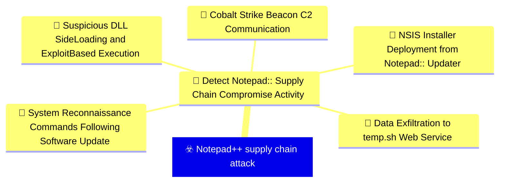
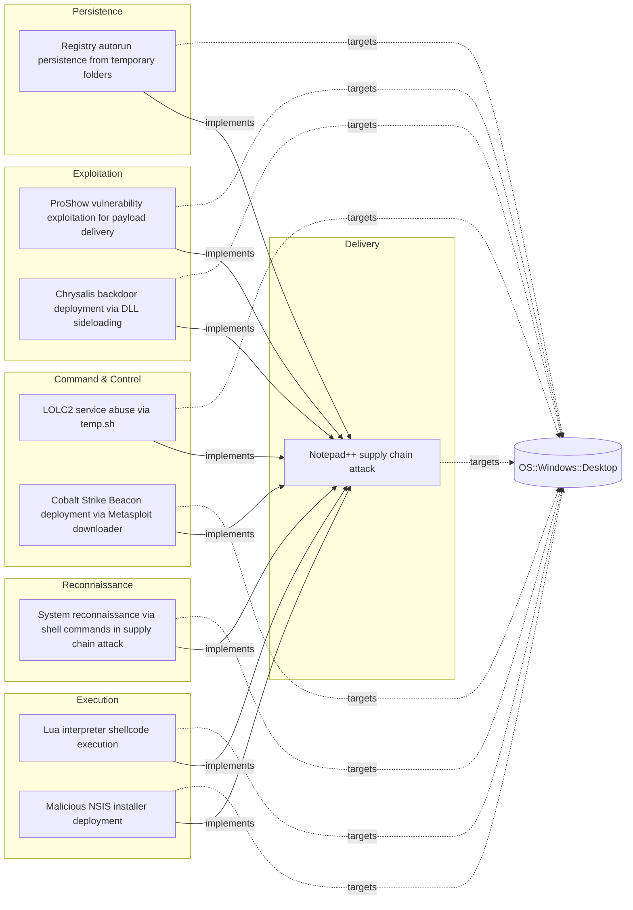

# ☣️ Notepad++ supply chain attack

🔥 **Criticality:Severe** 🚨 : A Severe priority incident is likely to result in a significant impact to public health or safety, national security, economic security, foreign relations, or civil liberties. 

🚦 **TLP:CLEAR** ⚪ : Recipients can spread this to the world, there is no limit on disclosure.


🗡️ **ATT&CK Techniques** [T1195.002 : Supply Chain Compromise: Compromise Software Supply Chain](https://attack.mitre.org/techniques/T1195/002 'Adversaries may manipulate application software prior to receipt by a final consumer for the purpose of data or system compromise Supply chain comprom'), [T1071 : Application Layer Protocol](https://attack.mitre.org/techniques/T1071 'Adversaries may communicate using OSI application layer protocols to avoid detectionnetwork filtering by blending in with existing traffic Commands to'), [T1059 : Command and Scripting Interpreter](https://attack.mitre.org/techniques/T1059 'Adversaries may abuse command and script interpreters to execute commands, scripts, or binaries These interfaces and languages provide ways of interac'), [T1574 : Hijack Execution Flow](https://attack.mitre.org/techniques/T1574 'Adversaries may execute their own malicious payloads by hijacking the way operating systems run programs Hijacking execution flow can be for the purpo')


---

`🔑 UUID : 8b7cae6f-b6cf-4414-9cdc-fe8c8ee7ee22` **|** `🏷️ Version : 1` **|** `🗓️ Creation Date : 2026-02-09` **|** `🗓️ Last Modification : 2026-02-09` **|** `Sharing Organisation : {'uuid': '56b0a0f0-b0bc-47d9-bb46-02f80ae2065a', 'name': 'EC DIGIT CSOC'}` **|** `🧱 Schema Identifier : tvm::2.1`


## 👁️ Description

> ## Executive Summary
> 
> On February 2, 2026, Notepad++ developers disclosed a critical supply chain compromise 
> affecting their update infrastructure. The attack, active from June to September 2025 
> with attacker access persisting until December 2025, represents a sophisticated 
> multi-stage operation targeting users across multiple countries and sectors.
> 
> ## Attack Timeline
> 
> - **June-September 2025**: Active infection phase with three distinct attack chains
> - **December 2025**: Attackers retained infrastructure access
> - **February 2, 2026**: Public disclosure by Notepad++ developers
> 
> ## Infection Chains
> 
> ### Chain #1 (July-August 2025)
> 
> **Flow**: NSIS installer → ProShow vulnerability exploit → Metasploit downloader → Cobalt Strike Beacon
> 
> This chain exploited a vulnerability in the ProShow application to establish initial 
> foothold, then deployed Metasploit framework components to download and execute 
> Cobalt Strike Beacon for persistent command and control.
> 
> **Malicious file path**: `%appdata%\ProShow\load`
> 
> ### Chain #2 (September-October 2025)
> 
> **Flow**: NSIS installer → Lua interpreter (alien.ini) → Shellcode → Cobalt Strike Beacon
> 
> This variant leveraged an embedded Lua interpreter loaded from a malicious configuration 
> file to execute shellcode that deployed Cobalt Strike Beacon.
> 
> **Malicious file path**: `%appdata%\Adobe\Scripts\alien.ini`
> 
> ### Chain #3 (October 2025)
> 
> **Flow**: NSIS installer → BluetoothService DLL sideloading → Chrysalis backdoor
> 
> The most recent chain utilized DLL side-loading techniques to load a sophisticated 
> backdoor named Chrysalis through a malicious BluetoothService DLL.
> 
> **Malicious file path**: `%appdata%\Bluetooth\BluetoothService`
> 
> ## Target Profile
> 
> **Geographic Distribution**:
> - Vietnam (individuals and IT service provider)
> - El Salvador (individuals and financial organization)
> - Australia (individuals)
> - Philippines (government organization)
> 
> **Sectors Affected**:
> - Government agencies
> - Financial services
> - IT service providers
> - Individual developers and users
> 
> ## Indicators of Compromise (IOCs)
> 
> ### Malicious Update URLs
> 
> ```
> http://45.76.155[.]202/update/update.exe
> http://45.32.144[.]255/update/update.exe
> http://95.179.213[.]0/update/update.exe
> http://95.179.213[.]0/update/install.exe
> http://95.179.213[.]0/update/AutoUpdater.exe
> ```
> 
> ### System Information Upload URLs
> 
> ```
> http://45.76.155[.]202/list
> https://self-dns.it[.]com/list
> ```
> 
> ### Metasploit Downloader URLs
> 
> ```
> https://45.77.31[.]210/users/admin
> https://cdncheck.it[.]com/users/admin
> https://safe-dns.it[.]com/help/Get-Start
> ```
> 
> ### Cobalt Strike C2 URLs
> 
> ```
> https://45.77.31[.]210/api/update/v1
> https://cdncheck.it[.]com/api/getInfo/v1
> https://safe-dns.it[.]com/resolve
> https://api.wiresguard[.]com/update/v1
> ```
> 
> ### Malicious File Hashes (SHA1)
> 
> **Malicious updater.exe**:
> ```
> 8e6e505438c21f3d281e1cc257abdbf7223b7f5a
> 90e677d7ff5844407b9c073e3b7e896e078e11cd
> 573549869e84544e3ef253bdba79851dcde4963a
> 13179c8f19fbf3d8473c49983a199e6cb4f318f0
> 4c9aac447bf732acc97992290aa7a187b967ee2c
> 821c0cafb2aab0f063ef7e313f64313fc81d46cd
> ```
> 
> **Malicious auxiliary files**:
> ```
> 06a6a5a39193075734a32e0235bde0e979c27228 (load - ProShow exploit component)
> ca4b6fe0c69472cd3d63b212eb805b7f65710d33 (alien.ini - Lua interpreter config)
> f7910d943a013eede24ac89d6388c1b98f8b3717 (log.dll)
> 7e0790226ea461bcc9ecd4be3c315ace41e1c122 (BluetoothService shellcode)
> ```
> 
> ### Network Indicators
> 
> **Malicious IP Addresses**:
> ```
> 45.76.155.202
> 45.32.144.255
> 95.179.213.0
> 45.77.31.210
> ```
> 
> **Malicious Domains**:
> ```
> self-dns.it[.]com
> cdncheck.it[.]com
> safe-dns.it[.]com
> wiresguard[.]com
> ```
> 
> ## Detection Opportunities
> 
> 1. **Process Monitoring**: Monitor for suspicious NSIS installer activity and child processes
> 2. **File System Monitoring**: Watch for file creation in %appdata%\ProShow\, %appdata%\Adobe\Scripts\, and %appdata%\Bluetooth\ directories
> 3. **Network Monitoring**: Block/alert on connections to known malicious IPs and domains
> 4. **DLL Loading**: Monitor `BluetoothService.exe` sideloading `log.dll` from `%appdata%\Bluetooth\` (Chain #3, Chrysalis backdoor) and any executable loading DLLs from non-system paths
> 5. **Update Mechanism**: Verify integrity of software update processes and validate update sources
> 6. **Cobalt Strike Detection**: Look for Cobalt Strike Beacon behaviors and C2 communication patterns
> 7. **Lua Interpreter**: Detect unexpected Lua interpreter execution
> 
> ## Mitigation Recommendations
> 
> 1. **Immediate Actions**:
>    - Update Notepad++ to the latest patched version through official channels only
>    - Scan systems for IOCs listed above
>    - Block network communications to identified malicious infrastructure
>    - Review update logs for connections to malicious update URLs
> 
> 2. **Long-term Measures**:
>    - Implement application whitelisting to prevent unauthorized executables
>    - Deploy EDR solutions capable of detecting Cobalt Strike and similar post-exploitation frameworks
>    - Enforce code signing verification for all software updates
>    - Segment networks to limit lateral movement capabilities
>    - Monitor and restrict DLL loading behaviors
>    - Implement behavioral detection for anomalous scripting interpreter usage
> 
> ## MITRE ATT&CK Mapping
> 
> - **T1195.002** - Supply Chain Compromise: Compromise Software Supply Chain
>   - Attackers compromised the legitimate Notepad++ update infrastructure
> 
> - **T1071** - Application Layer Protocol
>   - Used HTTPS/HTTP for C2 communications and payload delivery
> 
> - **T1059** - Command and Scripting Interpreter
>   - Leveraged Lua interpreter for malicious code execution
> 
> - **T1574** - Hijack Execution Flow (DLL Side-Loading sub-technique T1574.002)
>   - Employed `BluetoothService.exe` sideloading `log.dll` to load Chrysalis backdoor
> 
> ## References
> 
> - Kaspersky Securelist: "Notepad++ Supply Chain Attack" (February 2026)
> - Rapid7 Research: "Notepad++ Supply Chain Compromise Analysis" (February 2026)
> 
> ## Critical Risk Factors
> 
> This supply chain attack demonstrates:
> - **High Sophistication**: Multiple infection chains showing evolution and adaptation
> - **Extended Persistence**: Six months of active operations plus additional access retention
> - **Targeted Selection**: Deliberate targeting of government and financial sectors
> - **Infrastructure Control**: Complete compromise of legitimate update mechanism
> - **Advanced Tradecraft**: Use of commercial-grade post-exploitation frameworks (Cobalt Strike)
> 
> Organizations using Notepad++ should treat this as a **CRITICAL** incident requiring 
> immediate investigation and response actions.
> 


## 🖥️ Terrain 

 > Organizations and individuals using Notepad++ text editor on Windows systems, 
> particularly those with automatic update mechanisms enabled. The attack targeted 
> the legitimate update infrastructure, delivering malicious payloads disguised 
> as authentic software updates. Victims were distributed globally across multiple 
> sectors including government, financial services, and IT service providers.
> 

---

## 🕸️ Relations


### 🌊 OpenTide Objects




 **Descendants** 

| 🎯 Detection Objectives                                                                                                                                                                                                                                                                                        | 📡 Detection Objective Signals (5)                                                                                                                                                                                                                                                                                                                                                                                                                                                                                                                                                                                                                                                                                                                                                                                                                                                                                                                                                                                                                                                                                                                                                                                                                                                                                                                                                                                                                                                                                                                                                                                                                                                                                                                                                                                                                                                                                                  | 🛡️ Detection Models    | 🚨 Detection Rules    |
|:--------------------------------------------------------------------------------------------------------------------------------------------------------------------------------------------------------------------------------------------------------------------------------------------------------------|:-----------------------------------------------------------------------------------------------------------------------------------------------------------------------------------------------------------------------------------------------------------------------------------------------------------------------------------------------------------------------------------------------------------------------------------------------------------------------------------------------------------------------------------------------------------------------------------------------------------------------------------------------------------------------------------------------------------------------------------------------------------------------------------------------------------------------------------------------------------------------------------------------------------------------------------------------------------------------------------------------------------------------------------------------------------------------------------------------------------------------------------------------------------------------------------------------------------------------------------------------------------------------------------------------------------------------------------------------------------------------------------------------------------------------------------------------------------------------------------------------------------------------------------------------------------------------------------------------------------------------------------------------------------------------------------------------------------------------------------------------------------------------------------------------------------------------------------------------------------------------------------------------------------------------------------|:-----------------------|:---------------------|
| [Detect Notepad++ Supply Chain Compromise Activity](../Detection%20Objectives/🎯%20Detect%20Notepad++%20Supply%20Chain%20Compromise%20Activity.md 'This detection objective addresses the sophisticated supply chain compromiseof Notepad update infrastructure that occurred between July and October 20...') | [Detect Notepad++ Supply Chain Compromise Activity::System Reconnaissance Commands Following Software Update](Detect%20Notepad++%20Supply%20Chain%20Compromise%20Activity#system-reconnaissance-commands-following-software-update.md 'Detects sequences of system reconnaissance commands characteristic of theNotepad supply chain attack discovery phase Attackers executed combinationsof...')<br>[Detect Notepad++ Supply Chain Compromise Activity::Suspicious DLL Side-Loading and Exploit-Based Execution](Detect%20Notepad++%20Supply%20Chain%20Compromise%20Activity#suspicious-dll-side-loading-and-exploit-based-execution.md 'Detects malicious execution via legitimate software abuse, including DLLside-loading and exploitation of vulnerable legitimate executables TheNotepad ...')<br>[Detect Notepad++ Supply Chain Compromise Activity::Data Exfiltration to temp.sh Web Service](Detect%20Notepad++%20Supply%20Chain%20Compromise%20Activity#data-exfiltration-to-temp.sh-web-service.md 'Detects data exfiltration to the tempsh temporary file sharing service,used by attackers to stage reconnaissance data and avoid direct C2 communicatio...')<br>[Detect Notepad++ Supply Chain Compromise Activity::NSIS Installer Deployment from Notepad++ Updater](Detect%20Notepad++%20Supply%20Chain%20Compromise%20Activity#nsis-installer-deployment-from-notepad++-updater.md 'Detects the execution of NSIS Nullsoft Scriptable Install System installerslaunched by GUPexe, the legitimate Notepad update component The maliciousup...')<br>[Detect Notepad++ Supply Chain Compromise Activity::Cobalt Strike Beacon C2 Communication](Detect%20Notepad++%20Supply%20Chain%20Compromise%20Activity#cobalt-strike-beacon-c2-communication.md 'Detects network communication to known Cobalt Strike C2 infrastructureassociated with the Notepad supply chain campaign All observed infectionchains u...') | ❌ No Detection Models  | ❌ No Detection Rules |


 --- 

### ⛓️ Threat Chaining




<details>
<summary>Expand chaining data</summary>

| ☣️ Vector                                                                                                                                                                                                                                                                                                                                  | ⛓️ Link                 | 🎯 Target                                                                                                                                                                                                                                                     | ⛰️ Terrain                                                                                                                                                                                                                                                                                                                                                                                                    | 🗡️ ATT&CK                                                                                                                                                                                                                                                                                                                                                                                                                                                                                                                                                                                                                                                                                                                                                                                                                                                                                                                                                                                                       |
|:-------------------------------------------------------------------------------------------------------------------------------------------------------------------------------------------------------------------------------------------------------------------------------------------------------------------------------------------|:------------------------|:-------------------------------------------------------------------------------------------------------------------------------------------------------------------------------------------------------------------------------------------------------------|:--------------------------------------------------------------------------------------------------------------------------------------------------------------------------------------------------------------------------------------------------------------------------------------------------------------------------------------------------------------------------------------------------------------|:----------------------------------------------------------------------------------------------------------------------------------------------------------------------------------------------------------------------------------------------------------------------------------------------------------------------------------------------------------------------------------------------------------------------------------------------------------------------------------------------------------------------------------------------------------------------------------------------------------------------------------------------------------------------------------------------------------------------------------------------------------------------------------------------------------------------------------------------------------------------------------------------------------------------------------------------------------------------------------------------------------------|
| [Registry autorun persistence from temporary folders](../Threat%20Vectors/☣️%20Registry%20autorun%20persistence%20from%20temporary%20folders.md '## OverviewThis threat vector describes a Windows persistence technique that combines twosuspicious behaviors dropping malicious executables into temp...')                               | `atomicity::implements` | [Notepad++ supply chain attack](../Threat%20Vectors/☣️%20Notepad++%20supply%20chain%20attack.md '## Executive SummaryOn February 2, 2026, Notepad developers disclosed a critical supply chain compromise affecting their update infrastructure The att...') | Organizations and individuals using Notepad++ text editor on Windows systems,  particularly those with automatic update mechanisms enabled. The attack targeted  the legitimate update infrastructure, delivering malicious payloads disguised  as authentic software updates. Victims were distributed globally across multiple  sectors including government, financial services, and IT service providers. | [T1195.002 : Supply Chain Compromise: Compromise Software Supply Chain](https://attack.mitre.org/techniques/T1195/002 'Adversaries may manipulate application software prior to receipt by a final consumer for the purpose of data or system compromise Supply chain comprom'), [T1071 : Application Layer Protocol](https://attack.mitre.org/techniques/T1071 'Adversaries may communicate using OSI application layer protocols to avoid detectionnetwork filtering by blending in with existing traffic Commands to'), [T1059 : Command and Scripting Interpreter](https://attack.mitre.org/techniques/T1059 'Adversaries may abuse command and script interpreters to execute commands, scripts, or binaries These interfaces and languages provide ways of interac'), [T1574 : Hijack Execution Flow](https://attack.mitre.org/techniques/T1574 'Adversaries may execute their own malicious payloads by hijacking the way operating systems run programs Hijacking execution flow can be for the purpo') |
| [LOLC2 service abuse via temp.sh](../Threat%20Vectors/☣️%20LOLC2%20service%20abuse%20via%20temp.sh.md '## Executive SummaryAttackers are leveraging tempsh, a legitimate temporary file-sharing service,as a Living-Off-the-Land Command and Control LOLC2 in...')                                                                         | `atomicity::implements` | [Notepad++ supply chain attack](../Threat%20Vectors/☣️%20Notepad++%20supply%20chain%20attack.md '## Executive SummaryOn February 2, 2026, Notepad developers disclosed a critical supply chain compromise affecting their update infrastructure The att...') | Organizations and individuals using Notepad++ text editor on Windows systems,  particularly those with automatic update mechanisms enabled. The attack targeted  the legitimate update infrastructure, delivering malicious payloads disguised  as authentic software updates. Victims were distributed globally across multiple  sectors including government, financial services, and IT service providers. | [T1195.002 : Supply Chain Compromise: Compromise Software Supply Chain](https://attack.mitre.org/techniques/T1195/002 'Adversaries may manipulate application software prior to receipt by a final consumer for the purpose of data or system compromise Supply chain comprom'), [T1071 : Application Layer Protocol](https://attack.mitre.org/techniques/T1071 'Adversaries may communicate using OSI application layer protocols to avoid detectionnetwork filtering by blending in with existing traffic Commands to'), [T1059 : Command and Scripting Interpreter](https://attack.mitre.org/techniques/T1059 'Adversaries may abuse command and script interpreters to execute commands, scripts, or binaries These interfaces and languages provide ways of interac'), [T1574 : Hijack Execution Flow](https://attack.mitre.org/techniques/T1574 'Adversaries may execute their own malicious payloads by hijacking the way operating systems run programs Hijacking execution flow can be for the purpo') |
| [ProShow vulnerability exploitation for payload delivery](../Threat%20Vectors/☣️%20ProShow%20vulnerability%20exploitation%20for%20payload%20delivery.md '## Executive SummaryThreat actors exploited a legacy vulnerability in ProShow software to achieve code execution and deliver malicious payloads This t...')                       | `atomicity::implements` | [Notepad++ supply chain attack](../Threat%20Vectors/☣️%20Notepad++%20supply%20chain%20attack.md '## Executive SummaryOn February 2, 2026, Notepad developers disclosed a critical supply chain compromise affecting their update infrastructure The att...') | Organizations and individuals using Notepad++ text editor on Windows systems,  particularly those with automatic update mechanisms enabled. The attack targeted  the legitimate update infrastructure, delivering malicious payloads disguised  as authentic software updates. Victims were distributed globally across multiple  sectors including government, financial services, and IT service providers. | [T1195.002 : Supply Chain Compromise: Compromise Software Supply Chain](https://attack.mitre.org/techniques/T1195/002 'Adversaries may manipulate application software prior to receipt by a final consumer for the purpose of data or system compromise Supply chain comprom'), [T1071 : Application Layer Protocol](https://attack.mitre.org/techniques/T1071 'Adversaries may communicate using OSI application layer protocols to avoid detectionnetwork filtering by blending in with existing traffic Commands to'), [T1059 : Command and Scripting Interpreter](https://attack.mitre.org/techniques/T1059 'Adversaries may abuse command and script interpreters to execute commands, scripts, or binaries These interfaces and languages provide ways of interac'), [T1574 : Hijack Execution Flow](https://attack.mitre.org/techniques/T1574 'Adversaries may execute their own malicious payloads by hijacking the way operating systems run programs Hijacking execution flow can be for the purpo') |
| [Chrysalis backdoor deployment via DLL sideloading](../Threat%20Vectors/☣️%20Chrysalis%20backdoor%20deployment%20via%20DLL%20sideloading.md '## Executive SummaryThe Chrysalis backdoor deployment represents the third and most recent infection chain Chain #3 discovered in the Notepad supply c...')                                   | `atomicity::implements` | [Notepad++ supply chain attack](../Threat%20Vectors/☣️%20Notepad++%20supply%20chain%20attack.md '## Executive SummaryOn February 2, 2026, Notepad developers disclosed a critical supply chain compromise affecting their update infrastructure The att...') | Organizations and individuals using Notepad++ text editor on Windows systems,  particularly those with automatic update mechanisms enabled. The attack targeted  the legitimate update infrastructure, delivering malicious payloads disguised  as authentic software updates. Victims were distributed globally across multiple  sectors including government, financial services, and IT service providers. | [T1195.002 : Supply Chain Compromise: Compromise Software Supply Chain](https://attack.mitre.org/techniques/T1195/002 'Adversaries may manipulate application software prior to receipt by a final consumer for the purpose of data or system compromise Supply chain comprom'), [T1071 : Application Layer Protocol](https://attack.mitre.org/techniques/T1071 'Adversaries may communicate using OSI application layer protocols to avoid detectionnetwork filtering by blending in with existing traffic Commands to'), [T1059 : Command and Scripting Interpreter](https://attack.mitre.org/techniques/T1059 'Adversaries may abuse command and script interpreters to execute commands, scripts, or binaries These interfaces and languages provide ways of interac'), [T1574 : Hijack Execution Flow](https://attack.mitre.org/techniques/T1574 'Adversaries may execute their own malicious payloads by hijacking the way operating systems run programs Hijacking execution flow can be for the purpo') |
| [Lua interpreter shellcode execution](../Threat%20Vectors/☣️%20Lua%20interpreter%20shellcode%20execution.md '## Executive SummaryLua interpreter shellcode execution is an evasion technique that leverages legitimate Lua scripting interpreters to execute malici...')                                                                   | `atomicity::implements` | [Notepad++ supply chain attack](../Threat%20Vectors/☣️%20Notepad++%20supply%20chain%20attack.md '## Executive SummaryOn February 2, 2026, Notepad developers disclosed a critical supply chain compromise affecting their update infrastructure The att...') | Organizations and individuals using Notepad++ text editor on Windows systems,  particularly those with automatic update mechanisms enabled. The attack targeted  the legitimate update infrastructure, delivering malicious payloads disguised  as authentic software updates. Victims were distributed globally across multiple  sectors including government, financial services, and IT service providers. | [T1195.002 : Supply Chain Compromise: Compromise Software Supply Chain](https://attack.mitre.org/techniques/T1195/002 'Adversaries may manipulate application software prior to receipt by a final consumer for the purpose of data or system compromise Supply chain comprom'), [T1071 : Application Layer Protocol](https://attack.mitre.org/techniques/T1071 'Adversaries may communicate using OSI application layer protocols to avoid detectionnetwork filtering by blending in with existing traffic Commands to'), [T1059 : Command and Scripting Interpreter](https://attack.mitre.org/techniques/T1059 'Adversaries may abuse command and script interpreters to execute commands, scripts, or binaries These interfaces and languages provide ways of interac'), [T1574 : Hijack Execution Flow](https://attack.mitre.org/techniques/T1574 'Adversaries may execute their own malicious payloads by hijacking the way operating systems run programs Hijacking execution flow can be for the purpo') |
| [System reconnaissance via shell commands in supply chain attack](../Threat%20Vectors/☣️%20System%20reconnaissance%20via%20shell%20commands%20in%20supply%20chain%20attack.md '## Executive SummaryIn the Notepad supply chain attack investigation, Kasperskys KEDR Expert detection system identified systematic reconnaissance act...') | `atomicity::implements` | [Notepad++ supply chain attack](../Threat%20Vectors/☣️%20Notepad++%20supply%20chain%20attack.md '## Executive SummaryOn February 2, 2026, Notepad developers disclosed a critical supply chain compromise affecting their update infrastructure The att...') | Organizations and individuals using Notepad++ text editor on Windows systems,  particularly those with automatic update mechanisms enabled. The attack targeted  the legitimate update infrastructure, delivering malicious payloads disguised  as authentic software updates. Victims were distributed globally across multiple  sectors including government, financial services, and IT service providers. | [T1195.002 : Supply Chain Compromise: Compromise Software Supply Chain](https://attack.mitre.org/techniques/T1195/002 'Adversaries may manipulate application software prior to receipt by a final consumer for the purpose of data or system compromise Supply chain comprom'), [T1071 : Application Layer Protocol](https://attack.mitre.org/techniques/T1071 'Adversaries may communicate using OSI application layer protocols to avoid detectionnetwork filtering by blending in with existing traffic Commands to'), [T1059 : Command and Scripting Interpreter](https://attack.mitre.org/techniques/T1059 'Adversaries may abuse command and script interpreters to execute commands, scripts, or binaries These interfaces and languages provide ways of interac'), [T1574 : Hijack Execution Flow](https://attack.mitre.org/techniques/T1574 'Adversaries may execute their own malicious payloads by hijacking the way operating systems run programs Hijacking execution flow can be for the purpo') |
| [Cobalt Strike Beacon deployment via Metasploit downloader](../Threat%20Vectors/☣️%20Cobalt%20Strike%20Beacon%20deployment%20via%20Metasploit%20downloader.md '## Executive SummaryCobalt Strike Beacon was deployed as the final payload in all three infection chains of the Notepad supply chain attack, using Met...')                 | `atomicity::implements` | [Notepad++ supply chain attack](../Threat%20Vectors/☣️%20Notepad++%20supply%20chain%20attack.md '## Executive SummaryOn February 2, 2026, Notepad developers disclosed a critical supply chain compromise affecting their update infrastructure The att...') | Organizations and individuals using Notepad++ text editor on Windows systems,  particularly those with automatic update mechanisms enabled. The attack targeted  the legitimate update infrastructure, delivering malicious payloads disguised  as authentic software updates. Victims were distributed globally across multiple  sectors including government, financial services, and IT service providers. | [T1195.002 : Supply Chain Compromise: Compromise Software Supply Chain](https://attack.mitre.org/techniques/T1195/002 'Adversaries may manipulate application software prior to receipt by a final consumer for the purpose of data or system compromise Supply chain comprom'), [T1071 : Application Layer Protocol](https://attack.mitre.org/techniques/T1071 'Adversaries may communicate using OSI application layer protocols to avoid detectionnetwork filtering by blending in with existing traffic Commands to'), [T1059 : Command and Scripting Interpreter](https://attack.mitre.org/techniques/T1059 'Adversaries may abuse command and script interpreters to execute commands, scripts, or binaries These interfaces and languages provide ways of interac'), [T1574 : Hijack Execution Flow](https://attack.mitre.org/techniques/T1574 'Adversaries may execute their own malicious payloads by hijacking the way operating systems run programs Hijacking execution flow can be for the purpo') |
| [Malicious NSIS installer deployment](../Threat%20Vectors/☣️%20Malicious%20NSIS%20installer%20deployment.md '## OverviewMalicious NSIS Nullsoft Scriptable Install System installers are being weaponized in supply chain attacks to deploy various payloads on vic...')                                                                   | `atomicity::implements` | [Notepad++ supply chain attack](../Threat%20Vectors/☣️%20Notepad++%20supply%20chain%20attack.md '## Executive SummaryOn February 2, 2026, Notepad developers disclosed a critical supply chain compromise affecting their update infrastructure The att...') | Organizations and individuals using Notepad++ text editor on Windows systems,  particularly those with automatic update mechanisms enabled. The attack targeted  the legitimate update infrastructure, delivering malicious payloads disguised  as authentic software updates. Victims were distributed globally across multiple  sectors including government, financial services, and IT service providers. | [T1195.002 : Supply Chain Compromise: Compromise Software Supply Chain](https://attack.mitre.org/techniques/T1195/002 'Adversaries may manipulate application software prior to receipt by a final consumer for the purpose of data or system compromise Supply chain comprom'), [T1071 : Application Layer Protocol](https://attack.mitre.org/techniques/T1071 'Adversaries may communicate using OSI application layer protocols to avoid detectionnetwork filtering by blending in with existing traffic Commands to'), [T1059 : Command and Scripting Interpreter](https://attack.mitre.org/techniques/T1059 'Adversaries may abuse command and script interpreters to execute commands, scripts, or binaries These interfaces and languages provide ways of interac'), [T1574 : Hijack Execution Flow](https://attack.mitre.org/techniques/T1574 'Adversaries may execute their own malicious payloads by hijacking the way operating systems run programs Hijacking execution flow can be for the purpo') |

</details>
&nbsp; 


---

## Model Data

#### **⛓️ Cyber Kill Chain**

 > Cyber attacks are typically phased progressions towards strategic objectives. The Unified Kill Chains provides insight into the tactics that hackers employ to attain these objectives. This provides a solid basis to develop (or realign) defensive strategies to raise cyber resilience.

 [`📦 Delivery`](https://www.unifiedkillchain.com/assets/The-Unified-Kill-Chain.pdf) : Techniques resulting in the transmission of a weaponized object to the targeted environment.

---

#### **💣 Severity**

 > The severity summarizes the overall danger of incident the vector will provoke, and is to be derived (WIP) from impact, leverage, and difficulty to execute.

 [`🚨 Highly significant incident`](https://www.ncsc.gov.uk/news/new-cyber-attack-categorisation-system-improve-uk-response-incidents) : A cyber attack which has a serious impact on central government, (inter)national essential services, a large proportion of the (inter)national population, or the (inter)national economy.

---

#### **🪄 Leverage acquisition**

 > Technical aftermath of the attack from the target perspective, differentiated from impact as it does not consider the value of the consequence, only what increased control the vector execution provides to the adversary.

  - [`💅 Elevation of privilege`](https://owasp.org/www-community/Threat_Modeling_Process#stride) : Capacity to augment leverage over the target system by upgrading the compromised access rights
 - [`🐒 Tampering`](https://owasp.org/www-community/Threat_Modeling_Process#stride) : Threat action intending to maliciously change or modify persistent data, such as records in a database, and the alteration of data in transit between two computers over an open network, such as the Internet.
 - [`👁️‍🗨️ Information Disclosure`](https://owasp.org/www-community/Threat_Modeling_Process#stride) : Threat action intending to read a file that one was not granted access to, or to read data in transit.
 - [`🗿 Repudiation`](https://owasp.org/www-community/Threat_Modeling_Process#stride) : Threat action aimed at performing prohibited operations in a system that lacks the ability to trace the operations.

---

#### **💥 Impact**

 > Analysis of the threat vector from the organizational perspective, in non technical term. This aims at putting a clear denomination on what the attacker will actually be able to act upon if the threat vector is realized.

  - [`🔓 Data Breach`](http://veriscommunity.net/enums.html#section-impact) : Non-public information has been accessed from the outside, and successfully extracted.
 - [`🛑 Business disruption`](http://veriscommunity.net/enums.html#section-impact) : Business disruption
 - [`🌍 Reputational Damages`](http://veriscommunity.net/enums.html#section-impact) : Damages to the organization public view may be achieved by using directly the access gained, or indirectly with data gathered.
 - [`⚖️ Legal and regulatory`](http://veriscommunity.net/enums.html#section-impact) : Legal and regulatory costs
 - [`💸 Monetary Loss`](http://veriscommunity.net/enums.html#section-impact) : The vector will directly conduct to loss of value directly impacting the bottom line.

---

#### **🎲 Vector Viability**

 > Described with estimative language (likelyhood probability), describes how likely the analyst believes the vector to actually be realized on the organization infrastructure. Estimative language describes quality and credibility of underlying sources, data, and methodologies based Intelligence Community Directive 203 (ICD 203) and JP 2-0, Joint Intelligence.

 [`😱 Almost certain`](https://www.dni.gov/files/documents/ICD/ICD%20203%20Analytic%20Standards.pdf) : Nearly certain - 95-99%

---


## 🌐 Threat Surface

- ` OS::Windows::Desktop` — Microsoft Windows desktop editions


### 🔗 References


**🕊️ Publicly available resources**

- [_1_] https://securelist.com/notepad-supply-chain-attack/115382/
- [_2_] https://www.rapid7.com/blog/post/2026/02/03/notepad-plus-plus-supply-chain-compromise/

[1]: https://securelist.com/notepad-supply-chain-attack/115382/
[2]: https://www.rapid7.com/blog/post/2026/02/03/notepad-plus-plus-supply-chain-compromise/

---

#### 🏷️ Tags

#-, #-, #-, #
, #
, ##, ##, ##, ##, # , #🏷, #️, # , #T, #a, #g, #s, #
, #


