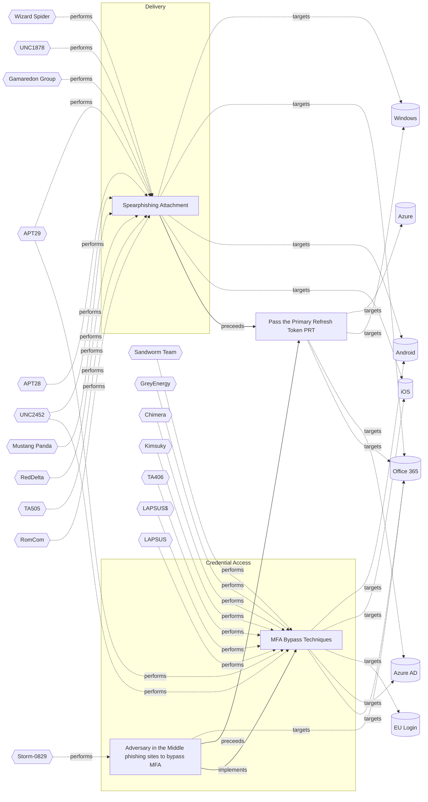

# ☣️ Pass the Primary Refresh Token (PRT)

🔥 **Criticality:High** ⚠️ : A High priority incident is likely to result in a demonstrable impact to public health or safety, national security, economic security, foreign relations, civil liberties, or public confidence. 

🚦 **TLP:CLEAR** ⚪ : Recipients can spread this to the world, there is no limit on disclosure.

🗡️ **ATT&CK Techniques** [T1134 : Access Token Manipulation](https://attack.mitre.org/techniques/T1134 'Adversaries may modify access tokens to operate under a different user or system security context to perform actions and bypass access controls Window'), [T1539 : Steal Web Session Cookie](https://attack.mitre.org/techniques/T1539 'An adversary may steal web application or service session cookies and use them to gain access to web applications or Internet services as an authentic'), [T1550.004 : Use Alternate Authentication Material: Web Session Cookie](https://attack.mitre.org/techniques/T1550/004 'Adversaries can use stolen session cookies to authenticate to web applications and services This technique bypasses some multi-factor authentication p')

---

`🔑 UUID : b1b6d2d7-0832-46fc-a3e5-6e6411179c45` **|** `🏷️ Version : 1` **|** `🗓️ Creation Date : 2025-06-30` **|** `🗓️ Last Modification : 2025-06-30` **|** `Sharing Organisation : {'uuid': '56b0a0f0-b0bc-47d9-bb46-02f80ae2065a', 'name': 'EC DIGIT CSOC'}` **|** `🧱 Schema Identifier : tvm::2.1`

## 👁️ Description

> Pass-the-PRT (Primary Refresh Token) is an advanced cyberattack technique targeting 
> cloud environments, particularly Microsoft Entra ID (formerly Azure AD). It enables 
> attackers to bypass MFA and move laterally within cloud infrastructures by stealing
> and exploiting valid authentication tokens.
> 
> ### What is a Primary Refresh Token (PRT)?
> A PRT is a persistent authentication token issued when a user logs into an Azure-joined 
> or hybrid Azure-joined Windows 10+ device. It enables single sign-on (SSO) to Azure 
> AD resources without reauthentication. Key characteristics:
> - **Validity**: 14–90 days, depending on usage.
> - **Storage**: Securely stored in the device’s LSASS memory and protected by the 
> Trusted Platform Module (TPM).
> - **Function**: Contains user identity, session keys, and MFA claims, allowing seamless 
> access to cloud resources like Microsoft 365.
> 
> ### How Pass-the-PRT Works
> Attackers execute this attack in three stages:
> 
> 1. **Initial Compromise**:  
>   Gain access to a victim’s device via phishing, malware, or exploits. Local admin 
>   privileges are typically required.
> 
> 2. **PRT Extraction**:  
>   Extract the PRT and associated session key using tools like:
>   - **Mimikatz** (`sekurlsa::cloudap` module).
>   - **AADInternals PowerShell** (e.g., `Get-AADIntUserPRTToken`).
>   - **BrowserCore.exe** (to steal the `x-ms-RefreshTokenCredential` cookie).
> 
> 3. **Lateral Movement**:  
>   Use the stolen PRT to:
>   - Generate valid PRT cookies for browsers (Chrome/Edge).
>   - Request access tokens for Azure AD resources without triggering MFA.
>   - Move laterally across cloud applications and data as the compromised user.
> 
> ### Key Risks and Challenges
> - **MFA Bypass**: PRTs embed MFA claims, allowing attackers to bypass conditional 
> access policies.
> - **Stealth**: Attacks mimic legitimate user activity, evading traditional security 
> tools.
> - **Persistence**: PRTs remain valid for weeks, enabling prolonged access even if 
> passwords change.
> 

## 🖥️ Terrain 

 > Adversaries need initial access to a device that has a Primary Refresh Token (PRT) 
> issued to a legitimate user. Specifically, this means compromising a Windows 10 
> or newer device that is Azure AD-joined or hybrid Azure AD-joined and on which the 
> user has logged in, thus generating a PRT.
> 

---

## 🕸️ Relations

### 🌊 OpenTide Objects
🚫 No related OpenTide objects indexed.

 --- 

### ⛓️ Threat Chaining

Expand chaining data

| ☣️ Vector                                                                                                                                                                                                                                                                                                            | ⛓️ Link                 | 🎯 Target                                                                                                                                                                                                                                                                                                             | ⛰️ Terrain                                                                                                                                                                                                                                                                                                                                                                                                                                                                                                                                                                                                                                                                                                                                                                                                                                                | 🗡️ ATT&CK                                                                                                                                                                                                                                                                                                                                                                                                                                                                                                                                                                                                                                                                                                                                                                                                                                                                                                                                                                                                                                                                               |
|:---------------------------------------------------------------------------------------------------------------------------------------------------------------------------------------------------------------------------------------------------------------------------------------------------------------------|:------------------------|:---------------------------------------------------------------------------------------------------------------------------------------------------------------------------------------------------------------------------------------------------------------------------------------------------------------------|:----------------------------------------------------------------------------------------------------------------------------------------------------------------------------------------------------------------------------------------------------------------------------------------------------------------------------------------------------------------------------------------------------------------------------------------------------------------------------------------------------------------------------------------------------------------------------------------------------------------------------------------------------------------------------------------------------------------------------------------------------------------------------------------------------------------------------------------------------------|:----------------------------------------------------------------------------------------------------------------------------------------------------------------------------------------------------------------------------------------------------------------------------------------------------------------------------------------------------------------------------------------------------------------------------------------------------------------------------------------------------------------------------------------------------------------------------------------------------------------------------------------------------------------------------------------------------------------------------------------------------------------------------------------------------------------------------------------------------------------------------------------------------------------------------------------------------------------------------------------------------------------------------------------------------------------------------------------|
| [Pass the Primary Refresh Token (PRT)](../Threat%20Vectors/☣️%20Pass%20the%20Primary%20Refresh%20Token%20(PRT).md 'Pass-the-PRT Primary Refresh Token is an advanced cyberattack technique targeting cloud environments, particularly Microsoft Entra ID formerly Azure A...')                                       | `sequence::preceeds`    | [Adversary in the Middle phishing sites to bypass MFA](../Threat%20Vectors/☣️%20Adversary%20in%20the%20Middle%20phishing%20sites%20to%20bypass%20MFA.md 'Threat actors use malicious attachments to send the users to redirection site, which hosts a fake MFA login pageThe MitM page completes the authentica...') | An adversary needs to target companies and contacts  to distribute the malware, it's used a massive distrigution  technique on a random principle.                                                                                                                                                                                                                                                                                                                                                                                                                                                                                                                                                                                                                                                                                                        | [T1566.002](https://attack.mitre.org/techniques/T1566/002 'Adversaries may send spearphishing emails with a malicious link in an attempt to gain access to victim systems Spearphishing with a link is a specific'), [T1557](https://attack.mitre.org/techniques/T1557 'Adversaries may attempt to position themselves between two or more networked devices using an adversary-in-the-middle AiTM technique to support follow'), [T1539](https://attack.mitre.org/techniques/T1539 'An adversary may steal web application or service session cookies and use them to gain access to web applications or Internet services as an authentic'), [T1556](https://attack.mitre.org/techniques/T1556 'Adversaries may modify authentication mechanisms and processes to access user credentials or enable otherwise unwarranted access to accounts The authe'), [T1078.004](https://attack.mitre.org/techniques/T1078/004 'Valid accounts in cloud environments may allow adversaries to perform actions to achieve Initial Access, Persistence, Privilege Escalation, or Defense')         |
| [Pass the Primary Refresh Token (PRT)](../Threat%20Vectors/☣️%20Pass%20the%20Primary%20Refresh%20Token%20(PRT).md 'Pass-the-PRT Primary Refresh Token is an advanced cyberattack technique targeting cloud environments, particularly Microsoft Entra ID formerly Azure A...')                                       | `sequence::preceeds`    | [Spearphishing Attachment](../Threat%20Vectors/☣️%20Spearphishing%20Attachment.md 'Spearphishing messages are often crafted using pernicious social engineeringtechniquesIn Spearphishing Attachment attacks, recipients receive emails t...')                                                                       | Spear phishing requires more preparation and time to achieve success  than a phishing attack. That is because spear-phishing attackers attempt to obtain vast amounts of personal information about their victims.   Attackers can get the personal information they need using different ways:   - to compromise an email or messaging system trough other means, - to use OSINT, sourcing Social Media or glean personal information from the user's online presence. They want to craft emails that look as legitimate and attractive as possible  to increase the chances of fooling their targets, for instance sending a malicious  attachment where the filename references a topic the recipient is interested in. The highly personalized nature of spear-phishing attacks makes it more  difficult to identity than widescale phishing attacks. | [T1566.001 : Phishing: Spearphishing Attachment](https://attack.mitre.org/techniques/T1566/001 'Adversaries may send spearphishing emails with a malicious attachment in an attempt to gain access to victim systems Spearphishing attachment is a spe')                                                                                                                                                                                                                                                                                                                                                                                                                                                                                                                                                                                                                                                                                                                                                                                                                                |
| [Adversary in the Middle phishing sites to bypass MFA](../Threat%20Vectors/☣️%20Adversary%20in%20the%20Middle%20phishing%20sites%20to%20bypass%20MFA.md 'Threat actors use malicious attachments to send the users to redirection site, which hosts a fake MFA login pageThe MitM page completes the authentica...') | `atomicity::implements` | [MFA Bypass Techniques](../Threat%20Vectors/☣️%20MFA%20Bypass%20Techniques.md 'MFA is a technique that requires more than one piece of evidence to authorize the user to access a resource If two pieces of evidence are needed to ve...')                                                                           | Sufficient reconnaissance to identify a target account and MFA technologies being used.                                                                                                                                                                                                                                                                                                                                                                                                                                                                                                                                                                                                                                                                                                                                                                   | [T1111](https://attack.mitre.org/techniques/T1111 'Adversaries may target multi-factor authentication MFA mechanisms, ie, smart cards, token generators, etc to gain access to credentials that can be us'), [T1621](https://attack.mitre.org/techniques/T1621 'Adversaries may attempt to bypass multi-factor authentication MFA mechanisms and gain access to accounts by generating MFA requests sent to usersAdver'), [T1566.001](https://attack.mitre.org/techniques/T1566/001 'Adversaries may send spearphishing emails with a malicious attachment in an attempt to gain access to victim systems Spearphishing attachment is a spe'), [T1566.002](https://attack.mitre.org/techniques/T1566/002 'Adversaries may send spearphishing emails with a malicious link in an attempt to gain access to victim systems Spearphishing with a link is a specific'), [T1566.004](https://attack.mitre.org/techniques/T1566/004 'Adversaries may use voice communications to ultimately gain access to victim systems Spearphishing voice is a specific variant of spearphishing It is ') |

&nbsp; 

---

## Model Data

#### **🛰️ Domains**

 > Infrastructure technologies domain of interest to attackers.

  - `☁️ Public Cloud` : Infrastructure handled by a commercial cloud provider. Managed mostly on a service level, and connected over the internet.
 - `🏢 Enterprise` : Generic databases, applications, machines and systems that are usually on premises or on Cloud traditional VMs.
 - `🕸️ SaaS` : Subscription based access to software.

---

#### **🎯 Targets**

 > Granular delimited technical entities holding a value to the organization, that are targeted by adversaries. They might be also involved in the detection coverage as the target of log collection. Partially inspired by Veris.

  - [`🪣 Cloud Storage Accounts`](http://veriscommunity.net/enums.html#section-asset) : Placeholder
 - [`👤 Identity Services`](http://veriscommunity.net/enums.html#section-asset) : Placeholder
 - [`🧩 API Endpoints`](http://veriscommunity.net/enums.html#section-asset) : Placeholder
 - [`☁️ Cloud Portal`](http://veriscommunity.net/enums.html#section-asset) : Placeholder
 - [`🔧 Serverless`](http://veriscommunity.net/enums.html#section-asset) : Placeholder
 - [`🛠️ Virtual Machines`](http://veriscommunity.net/enums.html#section-asset) : Placeholder
 - [`🔑 Server Authentication`](http://veriscommunity.net/enums.html#section-asset) : Server - Authentication

---

#### **💿 Platforms concerned**

 > Actual technologies used by the organization that will be exploited by adversaries during a successful attack, and eventually of relevance for detection. Are named by commercial designation.

  - ` Azure` : Placeholder
 - ` Windows` : Placeholder
 - ` Azure AD` : Placeholder
 - ` Office 365` : Placeholder

---

#### **💣 Severity**

 > The severity summarizes the overall danger of incident the vector will provoke, and is to be derived (WIP) from impact, leverage, and difficulty to execute.

 [`⚠️ Significant incident`](https://www.ncsc.gov.uk/news/new-cyber-attack-categorisation-system-improve-uk-response-incidents) : A cyber attack which has a serious impact on a large organisation or on wider / local government, or which poses a considerable risk to central government or (inter)national essential services.

---

#### **🪄 Leverage acquisition**

 > Technical aftermath of the attack from the target perspective, differentiated from impact as it does not consider the value of the consequence, only what increased control the vector execution provides to the adversary.

  - [`👻 Spoofing`](https://owasp.org/www-community/Threat_Modeling_Process#stride) : Threat action aimed at accessing and use of another user’s credentials, such as username and password.
 - [`🐒 Tampering`](https://owasp.org/www-community/Threat_Modeling_Process#stride) : Threat action intending to maliciously change or modify persistent data, such as records in a database, and the alteration of data in transit between two computers over an open network, such as the Internet.
 - [`💅 Elevation of privilege`](https://owasp.org/www-community/Threat_Modeling_Process#stride) : Capacity to augment leverage over the target system by upgrading the compromised access rights
 - [`👁️‍🗨️ Information Disclosure`](https://owasp.org/www-community/Threat_Modeling_Process#stride) : Threat action intending to read a file that one was not granted access to, or to read data in transit.
 - [`⚙️ Modify configuration`](https://owasp.org/www-community/Threat_Modeling_Process#stride) : Modify configuration or services
 - [`💅 Modify privileges`](https://owasp.org/www-community/Threat_Modeling_Process#stride) : Modify privileges or permissions

---

#### **💥 Impact**

 > Analysis of the threat vector from the organizational perspective, in non technical term. This aims at putting a clear denomination on what the attacker will actually be able to act upon if the threat vector is realized.

  - [`🔓 Data Breach`](http://veriscommunity.net/enums.html#section-impact) : Non-public information has been accessed from the outside, and successfully extracted.
 - [`🧠 IP Loss`](http://veriscommunity.net/enums.html#section-impact) : Particular, key data, information and blueprint conducive to the organization capability to gain and retain a commercial or geopolitical advantage has been accessed, and their content potentially used by competitors or other adversaries.
 - [`🌍 Reputational Damages`](http://veriscommunity.net/enums.html#section-impact) : Damages to the organization public view may be achieved by using directly the access gained, or indirectly with data gathered.
 - [`🥸 Identity Theft`](http://veriscommunity.net/enums.html#section-impact) : Acquisition of sufficient information and privileges to profess as a given individual, for the purpose of abusing and deceiving human trust relationships.
 - [`💸 Monetary Loss`](http://veriscommunity.net/enums.html#section-impact) : The vector will directly conduct to loss of value directly impacting the bottom line.
 - [`🤬 Lose Capabilities`](http://veriscommunity.net/enums.html#section-impact) : Vector execution will remove key functions to the organization, which will not be easily circumvented. Most day-to-day is heavily impaired, but processes can reorganize at a loss.
 - [`🛑 Business disruption`](http://veriscommunity.net/enums.html#section-impact) : Business disruption

---

#### **🎲 Vector Viability**

 > Described with estimative language (likelyhood probability), describes how likely the analyst believes the vector to actually be realized on the organization infrastructure. Estimative language describes quality and credibility of underlying sources, data, and methodologies based Intelligence Community Directive 203 (ICD 203) and JP 2-0, Joint Intelligence.

 [`🧐 Likely`](https://www.dni.gov/files/documents/ICD/ICD%20203%20Analytic%20Standards.pdf) : Probable (probably) - 55-80%

---

### 🔗 References

**🕊️ Publicly available resources**

- [_1_] https://blog.netwrix.com/2023/05/13/pass-the-prt-overview/
- [_2_] https://informationsecuritybuzz.com/azure-lateral-movement-pass-the-prt/
- [_3_] https://www.netwrix.com/pass-the-primary-refresh-token-attack.html

[1]: https://blog.netwrix.com/2023/05/13/pass-the-prt-overview/
[2]: https://informationsecuritybuzz.com/azure-lateral-movement-pass-the-prt/
[3]: https://www.netwrix.com/pass-the-primary-refresh-token-attack.html

---

#### 🏷️ Tags

#-, #-, #-, #
, #
, ##, ##, ##, ##, # , #🏷, #️, # , #T, #a, #g, #s, #
, #

