# ☣️ Pass the hash attack to elevate privileges

🔥 **Criticality:High** ⚠️ : A High priority incident is likely to result in a demonstrable impact to public health or safety, national security, economic security, foreign relations, civil liberties, or public confidence. 

🚦 **TLP:CLEAR** ⚪ : Recipients can spread this to the world, there is no limit on disclosure.

🗡️ **ATT&CK Techniques** [T1550.002 : Use Alternate Authentication Material: Pass the Hash](https://attack.mitre.org/techniques/T1550/002 'Adversaries may pass the hash using stolen password hashes to move laterally within an environment, bypassing normal system access controls Pass the h')

---

`🔑 UUID : 4472e2b0-3dca-4d84-aab0-626fcba04fce` **|** `🏷️ Version : 1` **|** `🗓️ Creation Date : 2022-11-17` **|** `🗓️ Last Modification : 2024-05-15` **|** `Sharing Organisation : {'uuid': '56b0a0f0-b0bc-47d9-bb46-02f80ae2065a', 'name': 'EC DIGIT CSOC'}` **|** `🧱 Schema Identifier : tvm::2.0`

## 👁️ Description

> Elevating privileges on Windows to System allows a threat actor (or 
> sysadmin) to do things that are not possible without SYSTEM/root 
> privileges.
> 
> Pass the hash is a method of authenticating as a user, without having 
> access to the user's cleartext password, by stealing password hashes and 
> using this password hash to authenticate directly to a resource via a 
> third party non-Microsoft tool such as Mimikatz. This method bypasses 
> standard authentication steps that require a cleartext password, moving
> directly into the portion of the authentication that uses the password 
> hash.
> 
> Mimikatz sekurlsa module without the /impersonate option implements the standard
> pass-the-hash technique, which works by authenticating to a resource, by in the 
> background spawning a new process in the context of the hash and attacker-
> desired elements. For examples, see the reference to thehacker.recipes.
> 

## 🖥️ Terrain 

 > Requires an already compromised endpoint.
> 
> Doing pass-the-hash on a Windows system requires specific privilege. 
> It either requires elevated privileges (by previously running 
> privilege:debug or by executing Mimikatz as the NT-AUTHORITY\SYSTEM 
> account). This doesn't apply to pass-the-ticket which uses an official API.
> 
> Pth works on windows computers of every kind, however later versions 
> natively have some level of defenses/mitigations built in.
> 

---

## 🕸️ Relations

### 🐲 Actors sightings 

| Actor                | Description                                                                                                                                                                                                                                                                                                                                                                                                                                                                                                                                                                                                                                                                                                                                                                                                                                                                                                                                                                                                                                                                                                                                                                                                                                                                                                                                                                                                                                                                                                                                                                                                                                                                                                                                                                                                                                                                                                                                                                                                                                                | Aliases                                                                                                                                                                                                                                                                                                   | Source                     | Sighting               | Reference                |
|:---------------------|:-----------------------------------------------------------------------------------------------------------------------------------------------------------------------------------------------------------------------------------------------------------------------------------------------------------------------------------------------------------------------------------------------------------------------------------------------------------------------------------------------------------------------------------------------------------------------------------------------------------------------------------------------------------------------------------------------------------------------------------------------------------------------------------------------------------------------------------------------------------------------------------------------------------------------------------------------------------------------------------------------------------------------------------------------------------------------------------------------------------------------------------------------------------------------------------------------------------------------------------------------------------------------------------------------------------------------------------------------------------------------------------------------------------------------------------------------------------------------------------------------------------------------------------------------------------------------------------------------------------------------------------------------------------------------------------------------------------------------------------------------------------------------------------------------------------------------------------------------------------------------------------------------------------------------------------------------------------------------------------------------------------------------------------------------------------|:----------------------------------------------------------------------------------------------------------------------------------------------------------------------------------------------------------------------------------------------------------------------------------------------------------|:---------------------------|:-----------------------|:-------------------------|
| [Mobile] APT28       | [APT28](https://attack.mitre.org/groups/G0007) is a threat group that has been attributed to Russia's General Staff Main Intelligence Directorate (GRU) 85th Main Special Service Center (GTsSS) military unit 26165.(Citation: NSA/FBI Drovorub August 2020)(Citation: Cybersecurity Advisory GRU Brute Force Campaign July 2021) This group has been active since at least 2004.(Citation: DOJ GRU Indictment Jul 2018)(Citation: Ars Technica GRU indictment Jul 2018)(Citation: Crowdstrike DNC June 2016)(Citation: FireEye APT28)(Citation: SecureWorks TG-4127)(Citation: FireEye APT28 January 2017)(Citation: GRIZZLY STEPPE JAR)(Citation: Sofacy DealersChoice)(Citation: Palo Alto Sofacy 06-2018)(Citation: Symantec APT28 Oct 2018)(Citation: ESET Zebrocy May 2019)[APT28](https://attack.mitre.org/groups/G0007) reportedly compromised the Hillary Clinton campaign, the Democratic National Committee, and the Democratic Congressional Campaign Committee in 2016 in an attempt to interfere with the U.S. presidential election.(Citation: Crowdstrike DNC June 2016) In 2018, the US indicted five GRU Unit 26165 officers associated with [APT28](https://attack.mitre.org/groups/G0007) for cyber operations (including close-access operations) conducted between 2014 and 2018 against the World Anti-Doping Agency (WADA), the US Anti-Doping Agency, a US nuclear facility, the Organization for the Prohibition of Chemical Weapons (OPCW), the Spiez Swiss Chemicals Laboratory, and other organizations.(Citation: US District Court Indictment GRU Oct 2018) Some of these were conducted with the assistance of GRU Unit 74455, which is also referred to as [Sandworm Team](https://attack.mitre.org/groups/G0034).                                                                                                                                                                                                                                                                                                       | FROZENLAKE, Fancy Bear, Forest Blizzard, Group 74, GruesomeLarch, IRON TWILIGHT, Pawn Storm, SNAKEMACKEREL, STRONTIUM, Sednit, Sofacy, Swallowtail, TG-4127, Threat Group-4127, Tsar Team                                                                                                                 | 🗡️ MITRE ATT&CK Groups     | No documented sighting | No documented references |
| APT28                | The Sofacy Group (also known as APT28, Pawn Storm, Fancy Bear and Sednit) is a cyber espionage group believed to have ties to the Russian government. Likely operating since 2007, the group is known to target government, military, and security organizations. It has been characterized as an advanced persistent threat.                                                                                                                                                                                                                                                                                                                                                                                                                                                                                                                                                                                                                                                                                                                                                                                                                                                                                                                                                                                                                                                                                                                                                                                                                                                                                                                                                                                                                                                                                                                                                                                                                                                                                                                              | Pawn Storm, FANCY BEAR, Sednit, SNAKEMACKEREL, Tsar Team, TG-4127, STRONTIUM, Swallowtail, IRON TWILIGHT, Group 74, SIG40, Grizzly Steppe, G0007, ATK5, Fighting Ursa, ITG05, Blue Athena, TA422, T-APT-12, APT-C-20, UAC-0028, FROZENLAKE, Sofacy, Forest Blizzard, BlueDelta, Fancy Bear, GruesomeLarch | 🌌 MISP Threat Actor Galaxy | No documented sighting | No documented references |
| [Enterprise] APT1    | [APT1](https://attack.mitre.org/groups/G0006) is a Chinese threat group that has been attributed to the 2nd Bureau of the People’s Liberation Army (PLA) General Staff Department’s (GSD) 3rd Department, commonly known by its Military Unit Cover Designator (MUCD) as Unit 61398. (Citation: Mandiant APT1)                                                                                                                                                                                                                                                                                                                                                                                                                                                                                                                                                                                                                                                                                                                                                                                                                                                                                                                                                                                                                                                                                                                                                                                                                                                                                                                                                                                                                                                                                                                                                                                                                                                                                                                                             | Comment Crew, Comment Group, Comment Panda                                                                                                                                                                                                                                                                | 🗡️ MITRE ATT&CK Groups     | No documented sighting | No documented references |
| APT1                 | PLA Unit 61398 (Chinese: 61398部队, Pinyin: 61398 bùduì) is the Military Unit Cover Designator (MUCD)[1] of a People's Liberation Army advanced persistent threat unit that has been alleged to be a source of Chinese computer hacking attacks                                                                                                                                                                                                                                                                                                                                                                                                                                                                                                                                                                                                                                                                                                                                                                                                                                                                                                                                                                                                                                                                                                                                                                                                                                                                                                                                                                                                                                                                                                                                                                                                                                                                                                                                                                                                              | COMMENT PANDA, PLA Unit 61398, Comment Crew, Byzantine Candor, Group 3, TG-8223, Comment Group, Brown Fox, GIF89a, ShadyRAT, G0006                                                                                                                                                                        | 🌌 MISP Threat Actor Galaxy | No documented sighting | No documented references |
| [Enterprise] APT32   | [APT32](https://attack.mitre.org/groups/G0050) is a suspected Vietnam-based threat group that has been active since at least 2014. The group has targeted multiple private sector industries as well as foreign governments, dissidents, and journalists with a strong focus on Southeast Asian countries like Vietnam, the Philippines, Laos, and Cambodia. They have extensively used strategic web compromises to compromise victims.(Citation: FireEye APT32 May 2017)(Citation: Volexity OceanLotus Nov 2017)(Citation: ESET OceanLotus)                                                                                                                                                                                                                                                                                                                                                                                                                                                                                                                                                                                                                                                                                                                                                                                                                                                                                                                                                                                                                                                                                                                                                                                                                                                                                                                                                                                                                                                                                                              | APT-C-00, BISMUTH, Canvas Cyclone, OceanLotus, SeaLotus                                                                                                                                                                                                                                                   | 🗡️ MITRE ATT&CK Groups     | No documented sighting | No documented references |
| APT32                | Cyber espionage actors, now designated by FireEye as APT32 (OceanLotus Group), are carrying out intrusions into private sector companies across multiple industries and have also targeted foreign governments, dissidents, and journalists. FireEye assesses that APT32 leverages a unique suite of fully-featured malware, in conjunction with commercially-available tools, to conduct targeted operations that are aligned with Vietnamese state interests.                                                                                                                                                                                                                                                                                                                                                                                                                                                                                                                                                                                                                                                                                                                                                                                                                                                                                                                                                                                                                                                                                                                                                                                                                                                                                                                                                                                                                                                                                                                                                                                            | OceanLotus Group, Ocean Lotus, OceanLotus, Cobalt Kitty, APT-C-00, SeaLotus, Sea Lotus, APT-32, APT 32, Ocean Buffalo, POND LOACH, TIN WOODLAWN, BISMUTH, ATK17, G0050, Canvas Cyclone                                                                                                                    | 🌌 MISP Threat Actor Galaxy | No documented sighting | No documented references |
| [Enterprise] Chimera | [Chimera](https://attack.mitre.org/groups/G0114) is a suspected China-based threat group that has been active since at least 2018 targeting the semiconductor industry in Taiwan as well as data from the airline industry.(Citation: Cycraft Chimera April 2020)(Citation: NCC Group Chimera January 2021)                                                                                                                                                                                                                                                                                                                                                                                                                                                                                                                                                                                                                                                                                                                                                                                                                                                                                                                                                                                                                                                                                                                                                                                                                                                                                                                                                                                                                                                                                                                                                                                                                                                                                                                                                |                                                                                                                                                                                                                                                                                                           | 🗡️ MITRE ATT&CK Groups     | No documented sighting | No documented references |
| [Enterprise] GALLIUM | [GALLIUM](https://attack.mitre.org/groups/G0093) is a cyberespionage group that has been active since at least 2012, primarily targeting telecommunications companies, financial institutions, and government entities in Afghanistan, Australia, Belgium, Cambodia, Malaysia, Mozambique, the Philippines, Russia, and Vietnam. This group is particularly known for launching Operation Soft Cell, a long-term campaign targeting telecommunications providers.(Citation: Cybereason Soft Cell June 2019) Security researchers have identified [GALLIUM](https://attack.mitre.org/groups/G0093) as a likely Chinese state-sponsored group, based in part on tools used and TTPs commonly associated with Chinese threat actors.(Citation: Cybereason Soft Cell June 2019)(Citation: Microsoft GALLIUM December 2019)(Citation: Unit 42 PingPull Jun 2022)                                                                                                                                                                                                                                                                                                                                                                                                                                                                                                                                                                                                                                                                                                                                                                                                                                                                                                                                                                                                                                                                                                                                                                                                | Granite Typhoon                                                                                                                                                                                                                                                                                           | 🗡️ MITRE ATT&CK Groups     | No documented sighting | No documented references |
| GALLIUM              | GALLIUM, is a threat actor believed to be targeting telecommunication providers over the world, mostly South-East Asia, Europe and Africa. To compromise targeted networks, GALLIUM target unpatched internet-facing services using publicly available exploits and have been known to target vulnerabilities in WildFly/JBoss.                                                                                                                                                                                                                                                                                                                                                                                                                                                                                                                                                                                                                                                                                                                                                                                                                                                                                                                                                                                                                                                                                                                                                                                                                                                                                                                                                                                                                                                                                                                                                                                                                                                                                                                            | Red Dev 4, Alloy Taurus, Granite Typhoon, PHANTOM PANDA                                                                                                                                                                                                                                                   | 🌌 MISP Threat Actor Galaxy | No documented sighting | No documented references |
| [Enterprise] Kimsuky | [Kimsuky](https://attack.mitre.org/groups/G0094) is a North Korea-based cyber espionage group that has been active since at least 2012. The group initially focused on targeting South Korean government entities, think tanks, and individuals identified as experts in various fields, and expanded its operations to include the UN and the government, education, business services, and manufacturing sectors in the United States, Japan, Russia, and Europe. [Kimsuky](https://attack.mitre.org/groups/G0094) has focused its intelligence collection activities on foreign policy and national security issues related to the Korean peninsula, nuclear policy, and sanctions. [Kimsuky](https://attack.mitre.org/groups/G0094) operations have overlapped with those of other North Korean cyber espionage actors likely as a result of ad hoc collaborations or other limited resource sharing.(Citation: EST Kimsuky April 2019)(Citation: Cybereason Kimsuky November 2020)(Citation: Malwarebytes Kimsuky June 2021)(Citation: CISA AA20-301A Kimsuky)(Citation: Mandiant APT43 March 2024)(Citation: Proofpoint TA427 April 2024)[Kimsuky](https://attack.mitre.org/groups/G0094) was assessed to be responsible for the 2014 Korea Hydro & Nuclear Power Co. compromise; other notable campaigns include Operation STOLEN PENCIL (2018), Operation Kabar Cobra (2019), and Operation Smoke Screen (2019).(Citation: Netscout Stolen Pencil Dec 2018)(Citation: EST Kimsuky SmokeScreen April 2019)(Citation: AhnLab Kimsuky Kabar Cobra Feb 2019)North Korean group definitions are known to have significant overlap, and some security researchers report all North Korean state-sponsored cyber activity under the name [Lazarus Group](https://attack.mitre.org/groups/G0032) instead of tracking clusters or subgroups.In 2023, [Kimsuky](https://attack.mitre.org/groups/G0094) has used commercial large language models to assist with vulnerability research, scripting, social engineering and reconnaissance.(Citation: MSFT-AI) | APT43, Black Banshee, Emerald Sleet, Springtail, TA427, THALLIUM, Velvet Chollima                                                                                                                                                                                                                         | 🗡️ MITRE ATT&CK Groups     | No documented sighting | No documented references |
| TA406                | TA406 is engaging in malware distribution, phishing, intelligence collection, and cryptocurrency theft, resulting in a wide range of criminal activities.                                                                                                                                                                                                                                                                                                                                                                                                                                                                                                                                                                                                                                                                                                                                                                                                                                                                                                                                                                                                                                                                                                                                                                                                                                                                                                                                                                                                                                                                                                                                                                                                                                                                                                                                                                                                                                                                                                  |                                                                                                                                                                                                                                                                                                           | 🌌 MISP Threat Actor Galaxy | No documented sighting | No documented references |

### 🌊 OpenTide Objects
🚫 No related OpenTide objects indexed.

 --- 

### ⛓️ Threat Chaining

```mermaid

flowchart LR

ec8201d4-c135-406b-a3b5-4a070e80a2ee[Credential manipulation on local Windows endpoint]
4472e2b0-3dca-4d84-aab0-626fcba04fce[Pass the hash attack to elevate privileges]
5ea50181-1124-49aa-9d2c-c74103e86fd5[Pass-the-hash on SMB network shares]
03cc9593-e7cf-484b-ae9c-684bf6f7199f[Pass the ticket using Kerberos ticket]
479a8b31-5f7e-4fd6-94ca-a5556315e1b8[Pass the hash using impersonation within an existing process]
7351e2ca-e198-427c-9cfa-202df36f6e2a[Mimikatz execution on compromised endpoint]
06523ed4-7881-4466-9ac5-f8417e972d13[Using a Windows command prompt for credential manipulation]
e3d7cb59-7aca-4c3d-b488-48c785930b6d[PowerShell usage for credential manipulation]
a566e405-e9db-475f-8447-7875fa127716[Script execution on Windows for credential manipulation]
2d0beed6-6520-4114-be1f-24067628e93c[Manipulation of credentials stored in LSASS]
02311e3e-b7b8-4369-9e1e-74c0a844ae0f[NTLM credentials dumping via SMB connection]

subgraph Credential Access
ec8201d4-c135-406b-a3b5-4a070e80a2ee
7351e2ca-e198-427c-9cfa-202df36f6e2a
2d0beed6-6520-4114-be1f-24067628e93c
end
subgraph Privilege Escalation
4472e2b0-3dca-4d84-aab0-626fcba04fce
479a8b31-5f7e-4fd6-94ca-a5556315e1b8
end
subgraph Lateral Movement
5ea50181-1124-49aa-9d2c-c74103e86fd5
end
subgraph Defense Evasion
03cc9593-e7cf-484b-ae9c-684bf6f7199f
end
subgraph Execution
06523ed4-7881-4466-9ac5-f8417e972d13
e3d7cb59-7aca-4c3d-b488-48c785930b6d
a566e405-e9db-475f-8447-7875fa127716
end
subgraph Exploitation
02311e3e-b7b8-4369-9e1e-74c0a844ae0f
end

CVE-2023-23397>CVE-2023-23397]
CVE-2024-21413>CVE-2024-21413]
Windows[(Windows)]
ActiveDirectory[(Active Directory)]
Azure[(Azure)]
PowerShell[(PowerShell)]
Office365[(Office 365)]
SandwormTeam{{Sandworm Team}}
GreyEnergy{{GreyEnergy}}
MuddyWater{{MuddyWater}}
MustangPanda{{Mustang Panda}}
RedDelta{{RedDelta}}
FoxKitten{{Fox Kitten}}
APT28{{APT28}}
APT1{{APT1}}
APT32{{APT32}}
Chimera{{Chimera}}
GALLIUM{{GALLIUM}}
Kimsuky{{Kimsuky}}
TA406{{TA406}}
APT39{{APT39}}
APT33{{APT33}}
AquaticPanda{{Aquatic Panda}}
TontoTeam{{Tonto Team}}
BlueMockingbird{{Blue Mockingbird}}
BRONZEBUTLER{{BRONZE BUTLER}}
Tick{{Tick}}
CobaltGroup{{Cobalt Group}}
Cobalt{{Cobalt}}
FIN6{{FIN6}}
HAFNIUM{{HAFNIUM}}
APT29{{APT29}}
UNC2452{{UNC2452}}
WizardSpider{{Wizard Spider}}
UNC1878{{UNC1878}}
APT41{{APT41}}
ThreatGroup-3390{{Threat Group-3390}}
APT27{{APT27}}
menuPass{{menuPass}}
APT10{{APT10}}
Dragonfly{{Dragonfly}}
ENERGETICBEAR{{ENERGETIC BEAR}}
Whitefly{{Whitefly}}
CopyKittens{{CopyKittens}}
MagicHound{{Magic Hound}}
TA453{{TA453}}
APT38{{APT38}}
LazarusGroup{{Lazarus Group}}
APT30{{APT30}}
BackdoorDiplomacy{{BackdoorDiplomacy}}
APT20{{APT20}}
Ke3chang{{Ke3chang}}
APT15{{APT15}}
TA505{{TA505}}
Turla{{Turla}}
TEMP.Veles{{TEMP.Veles}}
FIN7{{FIN7}}
OilRig{{OilRig}}
PittyTiger{{PittyTiger}}
APT24{{APT24}}
CuttingKitten{{Cutting Kitten}}
Leafminer{{Leafminer}}
RASPITE{{RASPITE}}
DeepPanda{{Deep Panda}}
APT19{{APT19}}
APT37{{APT37}}
Leviathan{{Leviathan}}
APT40{{APT40}}
TA577{{TA577}}

02311e3e-b7b8-4369-9e1e-74c0a844ae0f -.->|exploits| CVE-2023-23397
02311e3e-b7b8-4369-9e1e-74c0a844ae0f -.->|exploits| CVE-2024-21413
ec8201d4-c135-406b-a3b5-4a070e80a2ee -.->|targets| Windows
ec8201d4-c135-406b-a3b5-4a070e80a2ee -.->|targets| ActiveDirectory
4472e2b0-3dca-4d84-aab0-626fcba04fce -.->|targets| Windows
5ea50181-1124-49aa-9d2c-c74103e86fd5 -.->|targets| Windows
03cc9593-e7cf-484b-ae9c-684bf6f7199f -.->|targets| Windows
03cc9593-e7cf-484b-ae9c-684bf6f7199f -.->|targets| ActiveDirectory
479a8b31-5f7e-4fd6-94ca-a5556315e1b8 -.->|targets| Windows
7351e2ca-e198-427c-9cfa-202df36f6e2a -.->|targets| ActiveDirectory
7351e2ca-e198-427c-9cfa-202df36f6e2a -.->|targets| Azure
7351e2ca-e198-427c-9cfa-202df36f6e2a -.->|targets| Windows
06523ed4-7881-4466-9ac5-f8417e972d13 -.->|targets| Windows
e3d7cb59-7aca-4c3d-b488-48c785930b6d -.->|targets| Windows
e3d7cb59-7aca-4c3d-b488-48c785930b6d -.->|targets| ActiveDirectory
e3d7cb59-7aca-4c3d-b488-48c785930b6d -.->|targets| PowerShell
a566e405-e9db-475f-8447-7875fa127716 -.->|targets| Windows
a566e405-e9db-475f-8447-7875fa127716 -.->|targets| ActiveDirectory
2d0beed6-6520-4114-be1f-24067628e93c -.->|targets| Windows
2d0beed6-6520-4114-be1f-24067628e93c -.->|targets| PowerShell
02311e3e-b7b8-4369-9e1e-74c0a844ae0f -.->|targets| Windows
02311e3e-b7b8-4369-9e1e-74c0a844ae0f -.->|targets| Office365
SandwormTeam -.-> |performs| ec8201d4-c135-406b-a3b5-4a070e80a2ee
GreyEnergy -.-> |performs| ec8201d4-c135-406b-a3b5-4a070e80a2ee
MuddyWater -.-> |performs| ec8201d4-c135-406b-a3b5-4a070e80a2ee
MustangPanda -.-> |performs| ec8201d4-c135-406b-a3b5-4a070e80a2ee
RedDelta -.-> |performs| ec8201d4-c135-406b-a3b5-4a070e80a2ee
FoxKitten -.-> |performs| ec8201d4-c135-406b-a3b5-4a070e80a2ee
APT28 -.-> |performs| 4472e2b0-3dca-4d84-aab0-626fcba04fce
APT1 -.-> |performs| 4472e2b0-3dca-4d84-aab0-626fcba04fce
APT32 -.-> |performs| 4472e2b0-3dca-4d84-aab0-626fcba04fce
Chimera -.-> |performs| 4472e2b0-3dca-4d84-aab0-626fcba04fce
GALLIUM -.-> |performs| 4472e2b0-3dca-4d84-aab0-626fcba04fce
Kimsuky -.-> |performs| 4472e2b0-3dca-4d84-aab0-626fcba04fce
TA406 -.-> |performs| 4472e2b0-3dca-4d84-aab0-626fcba04fce
APT28 -.-> |performs| 5ea50181-1124-49aa-9d2c-c74103e86fd5
APT1 -.-> |performs| 5ea50181-1124-49aa-9d2c-c74103e86fd5
APT39 -.-> |performs| 5ea50181-1124-49aa-9d2c-c74103e86fd5
APT32 -.-> |performs| 5ea50181-1124-49aa-9d2c-c74103e86fd5
APT33 -.-> |performs| 5ea50181-1124-49aa-9d2c-c74103e86fd5
AquaticPanda -.-> |performs| 5ea50181-1124-49aa-9d2c-c74103e86fd5
TontoTeam -.-> |performs| 5ea50181-1124-49aa-9d2c-c74103e86fd5
BlueMockingbird -.-> |performs| 5ea50181-1124-49aa-9d2c-c74103e86fd5
BRONZEBUTLER -.-> |performs| 5ea50181-1124-49aa-9d2c-c74103e86fd5
Tick -.-> |performs| 5ea50181-1124-49aa-9d2c-c74103e86fd5
CobaltGroup -.-> |performs| 5ea50181-1124-49aa-9d2c-c74103e86fd5
Cobalt -.-> |performs| 5ea50181-1124-49aa-9d2c-c74103e86fd5
FIN6 -.-> |performs| 5ea50181-1124-49aa-9d2c-c74103e86fd5
FoxKitten -.-> |performs| 5ea50181-1124-49aa-9d2c-c74103e86fd5
HAFNIUM -.-> |performs| 5ea50181-1124-49aa-9d2c-c74103e86fd5
APT29 -.-> |performs| 03cc9593-e7cf-484b-ae9c-684bf6f7199f
UNC2452 -.-> |performs| 03cc9593-e7cf-484b-ae9c-684bf6f7199f
APT32 -.-> |performs| 03cc9593-e7cf-484b-ae9c-684bf6f7199f
BRONZEBUTLER -.-> |performs| 03cc9593-e7cf-484b-ae9c-684bf6f7199f
Tick -.-> |performs| 03cc9593-e7cf-484b-ae9c-684bf6f7199f
APT28 -.-> |performs| 479a8b31-5f7e-4fd6-94ca-a5556315e1b8
APT1 -.-> |performs| 479a8b31-5f7e-4fd6-94ca-a5556315e1b8
APT32 -.-> |performs| 479a8b31-5f7e-4fd6-94ca-a5556315e1b8
Chimera -.-> |performs| 479a8b31-5f7e-4fd6-94ca-a5556315e1b8
GALLIUM -.-> |performs| 479a8b31-5f7e-4fd6-94ca-a5556315e1b8
Kimsuky -.-> |performs| 479a8b31-5f7e-4fd6-94ca-a5556315e1b8
TA406 -.-> |performs| 479a8b31-5f7e-4fd6-94ca-a5556315e1b8
WizardSpider -.-> |performs| 7351e2ca-e198-427c-9cfa-202df36f6e2a
UNC1878 -.-> |performs| 7351e2ca-e198-427c-9cfa-202df36f6e2a
APT41 -.-> |performs| 7351e2ca-e198-427c-9cfa-202df36f6e2a
Kimsuky -.-> |performs| 7351e2ca-e198-427c-9cfa-202df36f6e2a
TA406 -.-> |performs| 7351e2ca-e198-427c-9cfa-202df36f6e2a
ThreatGroup-3390 -.-> |performs| 7351e2ca-e198-427c-9cfa-202df36f6e2a
APT27 -.-> |performs| 7351e2ca-e198-427c-9cfa-202df36f6e2a
CobaltGroup -.-> |performs| 7351e2ca-e198-427c-9cfa-202df36f6e2a
Cobalt -.-> |performs| 7351e2ca-e198-427c-9cfa-202df36f6e2a
menuPass -.-> |performs| 7351e2ca-e198-427c-9cfa-202df36f6e2a
APT10 -.-> |performs| 7351e2ca-e198-427c-9cfa-202df36f6e2a
Dragonfly -.-> |performs| 7351e2ca-e198-427c-9cfa-202df36f6e2a
ENERGETICBEAR -.-> |performs| 7351e2ca-e198-427c-9cfa-202df36f6e2a
Whitefly -.-> |performs| 7351e2ca-e198-427c-9cfa-202df36f6e2a
TontoTeam -.-> |performs| 7351e2ca-e198-427c-9cfa-202df36f6e2a
Chimera -.-> |performs| 7351e2ca-e198-427c-9cfa-202df36f6e2a
CopyKittens -.-> |performs| 7351e2ca-e198-427c-9cfa-202df36f6e2a
MagicHound -.-> |performs| 7351e2ca-e198-427c-9cfa-202df36f6e2a
TA453 -.-> |performs| 7351e2ca-e198-427c-9cfa-202df36f6e2a
APT38 -.-> |performs| 7351e2ca-e198-427c-9cfa-202df36f6e2a
LazarusGroup -.-> |performs| 7351e2ca-e198-427c-9cfa-202df36f6e2a
GALLIUM -.-> |performs| 7351e2ca-e198-427c-9cfa-202df36f6e2a
APT39 -.-> |performs| 7351e2ca-e198-427c-9cfa-202df36f6e2a
APT30 -.-> |performs| 7351e2ca-e198-427c-9cfa-202df36f6e2a
BlueMockingbird -.-> |performs| 7351e2ca-e198-427c-9cfa-202df36f6e2a
BackdoorDiplomacy -.-> |performs| 7351e2ca-e198-427c-9cfa-202df36f6e2a
APT1 -.-> |performs| 7351e2ca-e198-427c-9cfa-202df36f6e2a
APT20 -.-> |performs| 7351e2ca-e198-427c-9cfa-202df36f6e2a
APT32 -.-> |performs| 7351e2ca-e198-427c-9cfa-202df36f6e2a
FIN6 -.-> |performs| 7351e2ca-e198-427c-9cfa-202df36f6e2a
Ke3chang -.-> |performs| 7351e2ca-e198-427c-9cfa-202df36f6e2a
APT15 -.-> |performs| 7351e2ca-e198-427c-9cfa-202df36f6e2a
MuddyWater -.-> |performs| 7351e2ca-e198-427c-9cfa-202df36f6e2a
TA505 -.-> |performs| 7351e2ca-e198-427c-9cfa-202df36f6e2a
Turla -.-> |performs| 7351e2ca-e198-427c-9cfa-202df36f6e2a
TEMP.Veles -.-> |performs| 7351e2ca-e198-427c-9cfa-202df36f6e2a
FIN7 -.-> |performs| 7351e2ca-e198-427c-9cfa-202df36f6e2a
APT28 -.-> |performs| 7351e2ca-e198-427c-9cfa-202df36f6e2a
OilRig -.-> |performs| 7351e2ca-e198-427c-9cfa-202df36f6e2a
SandwormTeam -.-> |performs| 7351e2ca-e198-427c-9cfa-202df36f6e2a
GreyEnergy -.-> |performs| 7351e2ca-e198-427c-9cfa-202df36f6e2a
APT29 -.-> |performs| 7351e2ca-e198-427c-9cfa-202df36f6e2a
UNC2452 -.-> |performs| 7351e2ca-e198-427c-9cfa-202df36f6e2a
BRONZEBUTLER -.-> |performs| 7351e2ca-e198-427c-9cfa-202df36f6e2a
Tick -.-> |performs| 7351e2ca-e198-427c-9cfa-202df36f6e2a
PittyTiger -.-> |performs| 7351e2ca-e198-427c-9cfa-202df36f6e2a
APT24 -.-> |performs| 7351e2ca-e198-427c-9cfa-202df36f6e2a
CuttingKitten -.-> |performs| 7351e2ca-e198-427c-9cfa-202df36f6e2a
Leafminer -.-> |performs| 7351e2ca-e198-427c-9cfa-202df36f6e2a
RASPITE -.-> |performs| 7351e2ca-e198-427c-9cfa-202df36f6e2a
APT33 -.-> |performs| 7351e2ca-e198-427c-9cfa-202df36f6e2a
DeepPanda -.-> |performs| 06523ed4-7881-4466-9ac5-f8417e972d13
APT19 -.-> |performs| 06523ed4-7881-4466-9ac5-f8417e972d13
APT32 -.-> |performs| 06523ed4-7881-4466-9ac5-f8417e972d13
APT39 -.-> |performs| 06523ed4-7881-4466-9ac5-f8417e972d13
Dragonfly -.-> |performs| 06523ed4-7881-4466-9ac5-f8417e972d13
ENERGETICBEAR -.-> |performs| 06523ed4-7881-4466-9ac5-f8417e972d13
FIN6 -.-> |performs| 06523ed4-7881-4466-9ac5-f8417e972d13
FIN7 -.-> |performs| 06523ed4-7881-4466-9ac5-f8417e972d13
FoxKitten -.-> |performs| 06523ed4-7881-4466-9ac5-f8417e972d13
OilRig -.-> |performs| 06523ed4-7881-4466-9ac5-f8417e972d13
APT29 -.-> |performs| 06523ed4-7881-4466-9ac5-f8417e972d13
UNC2452 -.-> |performs| 06523ed4-7881-4466-9ac5-f8417e972d13
APT29 -.-> |performs| e3d7cb59-7aca-4c3d-b488-48c785930b6d
UNC2452 -.-> |performs| e3d7cb59-7aca-4c3d-b488-48c785930b6d
APT28 -.-> |performs| e3d7cb59-7aca-4c3d-b488-48c785930b6d
Chimera -.-> |performs| e3d7cb59-7aca-4c3d-b488-48c785930b6d
WizardSpider -.-> |performs| e3d7cb59-7aca-4c3d-b488-48c785930b6d
UNC1878 -.-> |performs| e3d7cb59-7aca-4c3d-b488-48c785930b6d
FIN6 -.-> |performs| e3d7cb59-7aca-4c3d-b488-48c785930b6d
FIN7 -.-> |performs| e3d7cb59-7aca-4c3d-b488-48c785930b6d
APT32 -.-> |performs| e3d7cb59-7aca-4c3d-b488-48c785930b6d
APT37 -.-> |performs| e3d7cb59-7aca-4c3d-b488-48c785930b6d
APT29 -.-> |performs| a566e405-e9db-475f-8447-7875fa127716
UNC2452 -.-> |performs| a566e405-e9db-475f-8447-7875fa127716
APT28 -.-> |performs| a566e405-e9db-475f-8447-7875fa127716
Chimera -.-> |performs| a566e405-e9db-475f-8447-7875fa127716
WizardSpider -.-> |performs| a566e405-e9db-475f-8447-7875fa127716
UNC1878 -.-> |performs| a566e405-e9db-475f-8447-7875fa127716
FIN6 -.-> |performs| a566e405-e9db-475f-8447-7875fa127716
FIN7 -.-> |performs| a566e405-e9db-475f-8447-7875fa127716
APT32 -.-> |performs| a566e405-e9db-475f-8447-7875fa127716
APT37 -.-> |performs| a566e405-e9db-475f-8447-7875fa127716
APT28 -.-> |performs| 2d0beed6-6520-4114-be1f-24067628e93c
FIN6 -.-> |performs| 2d0beed6-6520-4114-be1f-24067628e93c
Leviathan -.-> |performs| 2d0beed6-6520-4114-be1f-24067628e93c
APT40 -.-> |performs| 2d0beed6-6520-4114-be1f-24067628e93c
FoxKitten -.-> |performs| 2d0beed6-6520-4114-be1f-24067628e93c
MuddyWater -.-> |performs| 2d0beed6-6520-4114-be1f-24067628e93c
APT28 -.-> |performs| 02311e3e-b7b8-4369-9e1e-74c0a844ae0f
TA577 -.-> |performs| 02311e3e-b7b8-4369-9e1e-74c0a844ae0f

ec8201d4-c135-406b-a3b5-4a070e80a2ee -->|succeeds| 4472e2b0-3dca-4d84-aab0-626fcba04fce
ec8201d4-c135-406b-a3b5-4a070e80a2ee -->|succeeds| 5ea50181-1124-49aa-9d2c-c74103e86fd5
ec8201d4-c135-406b-a3b5-4a070e80a2ee -->|succeeds| 03cc9593-e7cf-484b-ae9c-684bf6f7199f
ec8201d4-c135-406b-a3b5-4a070e80a2ee -->|succeeds| 479a8b31-5f7e-4fd6-94ca-a5556315e1b8
ec8201d4-c135-406b-a3b5-4a070e80a2ee -->|implements| 7351e2ca-e198-427c-9cfa-202df36f6e2a
ec8201d4-c135-406b-a3b5-4a070e80a2ee -->|implements| 06523ed4-7881-4466-9ac5-f8417e972d13
ec8201d4-c135-406b-a3b5-4a070e80a2ee -->|implements| e3d7cb59-7aca-4c3d-b488-48c785930b6d
ec8201d4-c135-406b-a3b5-4a070e80a2ee -->|implements| a566e405-e9db-475f-8447-7875fa127716
2d0beed6-6520-4114-be1f-24067628e93c -->|preceeds| ec8201d4-c135-406b-a3b5-4a070e80a2ee
5ea50181-1124-49aa-9d2c-c74103e86fd5 -->|succeeds| 02311e3e-b7b8-4369-9e1e-74c0a844ae0f

```

Expand chaining data

| ☣️ Vector                                                                                                                                                                                                                                                                                                | ⛓️ Link                 | 🎯 Target                                                                                                                                                                                                                                                                                                                             | ⛰️ Terrain                                                                                                                                                                                                                                                                                                                                                                                                                                                         | 🗡️ ATT&CK                                                                                                                                                                                                                                                                                                                                                                                                                                                                                                                                                                                                                                                                                                                                                                                                                                                                                                                                                                                                                                                                                                                                                                                                                                                                                                                                                                                                                                                                                                                                                                                                                                                                                                                                                                                                                                                                                                                                                                                                                                                                                                                                                                                                                                                                                                                                                                                                                                                                                                                                                                                                                                                                                                                                                                                                                                                                                                                                                                                                                                                                                                                                                                                                                                                                                                 |
|:---------------------------------------------------------------------------------------------------------------------------------------------------------------------------------------------------------------------------------------------------------------------------------------------------------|:------------------------|:-------------------------------------------------------------------------------------------------------------------------------------------------------------------------------------------------------------------------------------------------------------------------------------------------------------------------------------|:-------------------------------------------------------------------------------------------------------------------------------------------------------------------------------------------------------------------------------------------------------------------------------------------------------------------------------------------------------------------------------------------------------------------------------------------------------------------|:----------------------------------------------------------------------------------------------------------------------------------------------------------------------------------------------------------------------------------------------------------------------------------------------------------------------------------------------------------------------------------------------------------------------------------------------------------------------------------------------------------------------------------------------------------------------------------------------------------------------------------------------------------------------------------------------------------------------------------------------------------------------------------------------------------------------------------------------------------------------------------------------------------------------------------------------------------------------------------------------------------------------------------------------------------------------------------------------------------------------------------------------------------------------------------------------------------------------------------------------------------------------------------------------------------------------------------------------------------------------------------------------------------------------------------------------------------------------------------------------------------------------------------------------------------------------------------------------------------------------------------------------------------------------------------------------------------------------------------------------------------------------------------------------------------------------------------------------------------------------------------------------------------------------------------------------------------------------------------------------------------------------------------------------------------------------------------------------------------------------------------------------------------------------------------------------------------------------------------------------------------------------------------------------------------------------------------------------------------------------------------------------------------------------------------------------------------------------------------------------------------------------------------------------------------------------------------------------------------------------------------------------------------------------------------------------------------------------------------------------------------------------------------------------------------------------------------------------------------------------------------------------------------------------------------------------------------------------------------------------------------------------------------------------------------------------------------------------------------------------------------------------------------------------------------------------------------------------------------------------------------------------------------------------------------|
| [Credential manipulation on local Windows endpoint](../Threat%20Vectors/☣️%20Credential%20manipulation%20on%20local%20Windows%20endpoint.md 'Credential manipulation on a local Windows endpoint refers to an act ofmodifying, altering, or stealing sensitive information such as usernames,passwo...') | `sequence::succeeds`    | [Pass the hash attack to elevate privileges](../Threat%20Vectors/☣️%20Pass%20the%20hash%20attack%20to%20elevate%20privileges.md 'Elevating privileges on Windows to System allows a threat actor or sysadmin to do things that are not possible without SYSTEMroot privilegesPass the h...')                                         | Requires an already compromised endpoint.  Doing pass-the-hash on a Windows system requires specific privilege.  It either requires elevated privileges (by previously running  privilege:debug or by executing Mimikatz as the NT-AUTHORITY\SYSTEM  account). This doesn't apply to pass-the-ticket which uses an official API.  Pth works on windows computers of every kind, however later versions  natively have some level of defenses/mitigations built in. | [T1550.002 : Use Alternate Authentication Material: Pass the Hash](https://attack.mitre.org/techniques/T1550/002 'Adversaries may pass the hash using stolen password hashes to move laterally within an environment, bypassing normal system access controls Pass the h')                                                                                                                                                                                                                                                                                                                                                                                                                                                                                                                                                                                                                                                                                                                                                                                                                                                                                                                                                                                                                                                                                                                                                                                                                                                                                                                                                                                                                                                                                                                                                                                                                                                                                                                                                                                                                                                                                                                                                                                                                                                                                                                                                                                                                                                                                                                                                                                                                                                                                                                                                                                                                                                                                                                                                                                                                                                                                                                                                                                                                                |
| [Credential manipulation on local Windows endpoint](../Threat%20Vectors/☣️%20Credential%20manipulation%20on%20local%20Windows%20endpoint.md 'Credential manipulation on a local Windows endpoint refers to an act ofmodifying, altering, or stealing sensitive information such as usernames,passwo...') | `sequence::succeeds`    | [Pass-the-hash on SMB network shares](../Threat%20Vectors/☣️%20Pass-the-hash%20on%20SMB%20network%20shares.md 'In a Pass-the-Hash attack PtH, Attackers may use offensive tools to load the NTLM hash and try to connect to SMB network shares that are reachable fro...')                                                           | Attacker needs to have captured a valid NTLM hash, Kerberos is disabled or NTML authentication is accepted as alternate method, SMB ports needs to be open  from attacker perspective                                                                                                                                                                                                                                                                              | [T1003.001 : OS Credential Dumping: LSASS Memory](https://attack.mitre.org/techniques/T1003/001 'Adversaries may attempt to access credential material stored in the process memory of the Local Security Authority Subsystem Service LSASS After a use'), [T1550.002 : Use Alternate Authentication Material: Pass the Hash](https://attack.mitre.org/techniques/T1550/002 'Adversaries may pass the hash using stolen password hashes to move laterally within an environment, bypassing normal system access controls Pass the h'), [T1021.002 : Remote Services: SMB/Windows Admin Shares](https://attack.mitre.org/techniques/T1021/002 'Adversaries may use Valid AccountshttpsattackmitreorgtechniquesT1078 to interact with a remote network share using Server Message Block SMB The advers')                                                                                                                                                                                                                                                                                                                                                                                                                                                                                                                                                                                                                                                                                                                                                                                                                                                                                                                                                                                                                                                                                                                                                                                                                                                                                                                                                                                                                                                                                                                                                                                                                                                                                                                                                                                                                                                                                                                                                                                                                                                                                                                                                                                                                                                                                                                                                                                                                                                                                                    |
| [Credential manipulation on local Windows endpoint](../Threat%20Vectors/☣️%20Credential%20manipulation%20on%20local%20Windows%20endpoint.md 'Credential manipulation on a local Windows endpoint refers to an act ofmodifying, altering, or stealing sensitive information such as usernames,passwo...') | `sequence::succeeds`    | [Pass the ticket using Kerberos ticket](../Threat%20Vectors/☣️%20Pass%20the%20ticket%20using%20Kerberos%20ticket.md 'Pass-the-Ticket using Kerberos tickets is an advanced method wherein threat actors illicitly extract and exploit Kerberos tickets to gain unauthorized...')                                                     | Adversaries need to compromise an asset and be able to execute commands.                                                                                                                                                                                                                                                                                                                                                                                           | [T1550.003 : Use Alternate Authentication Material: Pass the Ticket](https://attack.mitre.org/techniques/T1550/003 'Adversaries may pass the ticket using stolen Kerberos tickets to move laterally within an environment, bypassing normal system access controls Pass th')                                                                                                                                                                                                                                                                                                                                                                                                                                                                                                                                                                                                                                                                                                                                                                                                                                                                                                                                                                                                                                                                                                                                                                                                                                                                                                                                                                                                                                                                                                                                                                                                                                                                                                                                                                                                                                                                                                                                                                                                                                                                                                                                                                                                                                                                                                                                                                                                                                                                                                                                                                                                                                                                                                                                                                                                                                                                                                                                                                                                                              |
| [Credential manipulation on local Windows endpoint](../Threat%20Vectors/☣️%20Credential%20manipulation%20on%20local%20Windows%20endpoint.md 'Credential manipulation on a local Windows endpoint refers to an act ofmodifying, altering, or stealing sensitive information such as usernames,passwo...') | `sequence::succeeds`    | [Pass the hash using impersonation within an existing process](../Threat%20Vectors/☣️%20Pass%20the%20hash%20using%20impersonation%20within%20an%20existing%20process.md 'Adversaries may use a particular flavor of pass the hash - to leverage an acquired handle hash on NT AUTHORITYSYSTEM access token to spawn a new NT AU...') | Requires an already compromised endpoint.  Doing pass-the-hash on a Windows system requires specific privilege.  It either requires elevated privileges (by previously running  privilege:debug or by executing Mimikatz as the NT-AUTHORITY\SYSTEM  account). This doesn't apply to pass-the-ticket which uses an official API.  Pth works on windows computers of every kind, however later versions  natively have some level of defenses/mitigations built in. | [T1550.002 : Use Alternate Authentication Material: Pass the Hash](https://attack.mitre.org/techniques/T1550/002 'Adversaries may pass the hash using stolen password hashes to move laterally within an environment, bypassing normal system access controls Pass the h')                                                                                                                                                                                                                                                                                                                                                                                                                                                                                                                                                                                                                                                                                                                                                                                                                                                                                                                                                                                                                                                                                                                                                                                                                                                                                                                                                                                                                                                                                                                                                                                                                                                                                                                                                                                                                                                                                                                                                                                                                                                                                                                                                                                                                                                                                                                                                                                                                                                                                                                                                                                                                                                                                                                                                                                                                                                                                                                                                                                                                                |
| [Credential manipulation on local Windows endpoint](../Threat%20Vectors/☣️%20Credential%20manipulation%20on%20local%20Windows%20endpoint.md 'Credential manipulation on a local Windows endpoint refers to an act ofmodifying, altering, or stealing sensitive information such as usernames,passwo...') | `atomicity::implements` | [Mimikatz execution on compromised endpoint](../Threat%20Vectors/☣️%20Mimikatz%20execution%20on%20compromised%20endpoint.md 'Mimikatz is a very versatile tool that comes with a lot of options and capabilities Detection of known Atomic IOCs of the mimikatz tool itself or the ...')                                             | Mimikatz is used on a Windows endpoint where a threat actor has  gained a foothold to elevate privileges and move laterally                                                                                                                                                                                                                                                                                                                                        | [T1134.005](https://attack.mitre.org/techniques/T1134/005 'Adversaries may use SID-History Injection to escalate privileges and bypass access controls The Windows security identifier SID is a unique value that'), [T1098](https://attack.mitre.org/techniques/T1098 'Adversaries may manipulate accounts to maintain andor elevate access to victim systems Account manipulation may consist of any action that preserves o'), [T1547.005](https://attack.mitre.org/techniques/T1547/005 'Adversaries may abuse security support providers SSPs to execute DLLs when the system boots Windows SSP DLLs are loaded into the Local Security Author'), [T1555.003](https://attack.mitre.org/techniques/T1555/003 'Adversaries may acquire credentials from web browsers by reading files specific to the target browserCitation Talos Olympic Destroyer 2018 Web browser'), [T1555.004](https://attack.mitre.org/techniques/T1555/004 'Adversaries may acquire credentials from the Windows Credential Manager The Credential Manager stores credentials for signing into websites, applicati'), [T1003.001](https://attack.mitre.org/techniques/T1003/001 'Adversaries may attempt to access credential material stored in the process memory of the Local Security Authority Subsystem Service LSASS After a use'), [T1003.002](https://attack.mitre.org/techniques/T1003/002 'Adversaries may attempt to extract credential material from the Security Account Manager SAM database either through in-memory techniques or through t'), [T1003.004](https://attack.mitre.org/techniques/T1003/004 'Adversaries with SYSTEM access to a host may attempt to access Local Security Authority LSA secrets, which can contain a variety of different credenti'), [T1003.006](https://attack.mitre.org/techniques/T1003/006 'Adversaries may attempt to access credentials and other sensitive information by abusing a Windows Domain Controllers application programming interfac'), [T1207](https://attack.mitre.org/techniques/T1207 'Adversaries may register a rogue Domain Controller to enable manipulation of Active Directory data DCShadow may be used to create a rogue Domain Contr'), [T1558.001](https://attack.mitre.org/techniques/T1558/001 'Adversaries who have the KRBTGT account password hash may forge Kerberos ticket-granting tickets TGT, also known as a golden ticketCitation AdSecurity'), [T1558.002](https://attack.mitre.org/techniques/T1558/002 'Adversaries who have the password hash of a target service account eg SharePoint, MSSQL may forge Kerberos ticket granting service TGS tickets, also k'), [T1552.004](https://attack.mitre.org/techniques/T1552/004 'Adversaries may search for private key certificate files on compromised systems for insecurely stored credentials Private cryptographic keys and certi'), [T1550.002](https://attack.mitre.org/techniques/T1550/002 'Adversaries may pass the hash using stolen password hashes to move laterally within an environment, bypassing normal system access controls Pass the h'), [T1550.003](https://attack.mitre.org/techniques/T1550/003 'Adversaries may pass the ticket using stolen Kerberos tickets to move laterally within an environment, bypassing normal system access controls Pass th') |
| [Credential manipulation on local Windows endpoint](../Threat%20Vectors/☣️%20Credential%20manipulation%20on%20local%20Windows%20endpoint.md 'Credential manipulation on a local Windows endpoint refers to an act ofmodifying, altering, or stealing sensitive information such as usernames,passwo...') | `atomicity::implements` | [Using a Windows command prompt for credential manipulation](../Threat%20Vectors/☣️%20Using%20a%20Windows%20command%20prompt%20for%20credential%20manipulation.md 'Threat actors may use Windows commad prompt commands to search for, accessin order to manipulate create, modify, delete, read users credentialslocally...')       | Requires an already compromised Windows endpoint and in some cases elevated administrator privileges to command prompt interface.                                                                                                                                                                                                                                                                                                                                  | [T1059.003 : Command and Scripting Interpreter: Windows Command Shell](https://attack.mitre.org/techniques/T1059/003 'Adversaries may abuse the Windows command shell for execution The Windows command shell cmdhttpsattackmitreorgsoftwareS0106 is the primary command pro'), [T1098.001 : Account Manipulation: Additional Cloud Credentials](https://attack.mitre.org/techniques/T1098/001 'Adversaries may add adversary-controlled credentials to a cloud account to maintain persistent access to victim accounts and instances within the envi')                                                                                                                                                                                                                                                                                                                                                                                                                                                                                                                                                                                                                                                                                                                                                                                                                                                                                                                                                                                                                                                                                                                                                                                                                                                                                                                                                                                                                                                                                                                                                                                                                                                                                                                                                                                                                                                                                                                                                                                                                                                                                                                                                                                                                                                                                                                                                                                                                                                                                                                                                                                                                                                                                                                                                  |
| [Credential manipulation on local Windows endpoint](../Threat%20Vectors/☣️%20Credential%20manipulation%20on%20local%20Windows%20endpoint.md 'Credential manipulation on a local Windows endpoint refers to an act ofmodifying, altering, or stealing sensitive information such as usernames,passwo...') | `atomicity::implements` | [PowerShell usage for credential manipulation](../Threat%20Vectors/☣️%20PowerShell%20usage%20for%20credential%20manipulation.md 'Threat actors are using different methods to manipulate users credentialsOne example of credential manipulation is by using PowerShell commands orscri...')                                         | Requires an already compromised Windows endpoint and in some cases administrative privilege access to a PowerShell console.                                                                                                                                                                                                                                                                                                                                        | [T1098.001 : Account Manipulation: Additional Cloud Credentials](https://attack.mitre.org/techniques/T1098/001 'Adversaries may add adversary-controlled credentials to a cloud account to maintain persistent access to victim accounts and instances within the envi'), [T1059.001 : Command and Scripting Interpreter: PowerShell](https://attack.mitre.org/techniques/T1059/001 'Adversaries may abuse PowerShell commands and scripts for execution PowerShell is a powerful interactive command-line interface and scripting environm')                                                                                                                                                                                                                                                                                                                                                                                                                                                                                                                                                                                                                                                                                                                                                                                                                                                                                                                                                                                                                                                                                                                                                                                                                                                                                                                                                                                                                                                                                                                                                                                                                                                                                                                                                                                                                                                                                                                                                                                                                                                                                                                                                                                                                                                                                                                                                                                                                                                                                                                                                                                                                                                                                                                                                             |
| [Credential manipulation on local Windows endpoint](../Threat%20Vectors/☣️%20Credential%20manipulation%20on%20local%20Windows%20endpoint.md 'Credential manipulation on a local Windows endpoint refers to an act ofmodifying, altering, or stealing sensitive information such as usernames,passwo...') | `atomicity::implements` | [Script execution on Windows for credential manipulation](../Threat%20Vectors/☣️%20Script%20execution%20on%20Windows%20for%20credential%20manipulation.md 'One example of script execution for credential manipulation is the use of aPython or other type of script to access and readchange a users credentials...')               | Requires an already compromised Windows endpoint and administrator access to Windows command line interface.                                                                                                                                                                                                                                                                                                                                                       | [T1098.001 : Account Manipulation: Additional Cloud Credentials](https://attack.mitre.org/techniques/T1098/001 'Adversaries may add adversary-controlled credentials to a cloud account to maintain persistent access to victim accounts and instances within the envi'), [T1059.003 : Command and Scripting Interpreter: Windows Command Shell](https://attack.mitre.org/techniques/T1059/003 'Adversaries may abuse the Windows command shell for execution The Windows command shell cmdhttpsattackmitreorgsoftwareS0106 is the primary command pro'), [T1555 : Credentials from Password Stores](https://attack.mitre.org/techniques/T1555 'Adversaries may search for common password storage locations to obtain user credentialsCitation F-Secure The Dukes Passwords are stored in several pla'), [T1003 : OS Credential Dumping](https://attack.mitre.org/techniques/T1003 'Adversaries may attempt to dump credentials to obtain account login and credential material, normally in the form of a hash or a clear text password C')                                                                                                                                                                                                                                                                                                                                                                                                                                                                                                                                                                                                                                                                                                                                                                                                                                                                                                                                                                                                                                                                                                                                                                                                                                                                                                                                                                                                                                                                                                                                                                                                                                                                                                                                                                                                                                                                                                                                                                                                                                                                                                                                                                                                                                                             |
| [Credential manipulation on local Windows endpoint](../Threat%20Vectors/☣️%20Credential%20manipulation%20on%20local%20Windows%20endpoint.md 'Credential manipulation on a local Windows endpoint refers to an act ofmodifying, altering, or stealing sensitive information such as usernames,passwo...') | `sequence::preceeds`    | [Manipulation of credentials stored in LSASS](../Threat%20Vectors/☣️%20Manipulation%20of%20credentials%20stored%20in%20LSASS.md 'Credentials can be stored in the Local Security Authority SubsystemService LSASS process in memory for use by the account LSASS storescredentials in m...')                                         | Requires an already compromised Windows endpoint with elevated access rights to SYSTEM user.                                                                                                                                                                                                                                                                                                                                                                       | [T1003.001 : OS Credential Dumping: LSASS Memory](https://attack.mitre.org/techniques/T1003/001 'Adversaries may attempt to access credential material stored in the process memory of the Local Security Authority Subsystem Service LSASS After a use'), [T1218.011 : System Binary Proxy Execution: Rundll32](https://attack.mitre.org/techniques/T1218/011 'Adversaries may abuse rundll32exe to proxy execution of malicious code Using rundll32exe, vice executing directly ie Shared Moduleshttpsattackmitreorg'), [T1098 : Account Manipulation](https://attack.mitre.org/techniques/T1098 'Adversaries may manipulate accounts to maintain andor elevate access to victim systems Account manipulation may consist of any action that preserves o'), [T1003 : OS Credential Dumping](https://attack.mitre.org/techniques/T1003 'Adversaries may attempt to dump credentials to obtain account login and credential material, normally in the form of a hash or a clear text password C')                                                                                                                                                                                                                                                                                                                                                                                                                                                                                                                                                                                                                                                                                                                                                                                                                                                                                                                                                                                                                                                                                                                                                                                                                                                                                                                                                                                                                                                                                                                                                                                                                                                                                                                                                                                                                                                                                                                                                                                                                                                                                                                                                                                                                                                                                                         |
| [Pass-the-hash on SMB network shares](../Threat%20Vectors/☣️%20Pass-the-hash%20on%20SMB%20network%20shares.md 'In a Pass-the-Hash attack PtH, Attackers may use offensive tools to load the NTLM hash and try to connect to SMB network shares that are reachable fro...')                               | `sequence::succeeds`    | [NTLM credentials dumping via SMB connection](../Threat%20Vectors/☣️%20NTLM%20credentials%20dumping%20via%20SMB%20connection.md '### Attack vector related to Outlook vulnerability CVE-2023-23397key point no user interaction  An attacker sends an email message with an extended MA...')                                         | - vulnerable Outlook clients CVE-2023-23397   - spearphising with a link to a SMB network share   - SMB or Webdav protocols are allowed to connect to external network shares directly or via a proxy                                                                                                                                                                                                                                                              | [T1187 : Forced Authentication](https://attack.mitre.org/techniques/T1187 'Adversaries may gather credential material by invoking or forcing a user to automatically provide authentication information through a mechanism in wh'), [T1190 : Exploit Public-Facing Application](https://attack.mitre.org/techniques/T1190 'Adversaries may attempt to exploit a weakness in an Internet-facing host or system to initially access a network The weakness in the system can be a s'), [T1068 : Exploitation for Privilege Escalation](https://attack.mitre.org/techniques/T1068 'Adversaries may exploit software vulnerabilities in an attempt to elevate privileges Exploitation of a software vulnerability occurs when an adversary'), [T1212 : Exploitation for Credential Access](https://attack.mitre.org/techniques/T1212 'Adversaries may exploit software vulnerabilities in an attempt to collect credentials Exploitation of a software vulnerability occurs when an adversar')                                                                                                                                                                                                                                                                                                                                                                                                                                                                                                                                                                                                                                                                                                                                                                                                                                                                                                                                                                                                                                                                                                                                                                                                                                                                                                                                                                                                                                                                                                                                                                                                                                                                                                                                                                                                                                                                                                                                                                                                                                                                                                                                                                                                                                                                                                               |

&nbsp; 

---

## Model Data

#### **⛓️ Cyber Kill Chain**

 > Cyber attacks are typically phased progressions towards strategic objectives. The Unified Kill Chains provides insight into the tactics that hackers employ to attain these objectives. This provides a solid basis to develop (or realign) defensive strategies to raise cyber resilience.

 [`🥸 Privilege Escalation`](https://www.unifiedkillchain.com/assets/The-Unified-Kill-Chain.pdf) : The result of techniques that provide an attacker with higher permissions on a system or network.

---

#### **🛰️ Domains**

 > Infrastructure technologies domain of interest to attackers.

  - `🏢 Enterprise` : Generic databases, applications, machines and systems that are usually on premises or on Cloud traditional VMs.
 - `☁️ Public Cloud` : Infrastructure handled by a commercial cloud provider. Managed mostly on a service level, and connected over the internet.

---

#### **🎯 Targets**

 > Granular delimited technical entities holding a value to the organization, that are targeted by adversaries. They might be also involved in the detection coverage as the target of log collection. Partially inspired by Veris.

  - [`🔐 Auth token`](http://veriscommunity.net/enums.html#section-asset) : User Device - Authentication token or device
 - [`🖲️ Control Server`](https://collaborate.mitre.org/attackics/index.php/Control_Server) : A device which acts as both a server and controller, that hosts the control software used in communicating with lower-level control devices in an ICS network (e.g. Remote Terminal Units (RTUs) and Programmable Logic Controllers (PLCs)).
 - [`🖥️ Workstations`](http://veriscommunity.net/enums.html#section-asset) : Placeholder
 - [`👤 End-user`](http://veriscommunity.net/enums.html#section-asset) : People - End-user
 - [`🖥️ Public-Facing Servers`](http://veriscommunity.net/enums.html#section-asset) : Placeholder
 - [`🔑 Server Authentication`](http://veriscommunity.net/enums.html#section-asset) : Server - Authentication
 - [`💻 Laptop`](http://veriscommunity.net/enums.html#section-asset) : User Device - Laptop
 - [`🖥️ Desktop`](http://veriscommunity.net/enums.html#section-asset) : User Device - Desktop or workstation

---

#### **💿 Platforms concerned**

 > Actual technologies used by the organization that will be exploited by adversaries during a successful attack, and eventually of relevance for detection. Are named by commercial designation.

 ` Windows` : Placeholder

---

#### **💣 Severity**

 > The severity summarizes the overall danger of incident the vector will provoke, and is to be derived (WIP) from impact, leverage, and difficulty to execute.

 [`⚠️ Significant incident`](https://www.ncsc.gov.uk/news/new-cyber-attack-categorisation-system-improve-uk-response-incidents) : A cyber attack which has a serious impact on a large organisation or on wider / local government, or which poses a considerable risk to central government or (inter)national essential services.

---

#### **🪄 Leverage acquisition**

 > Technical aftermath of the attack from the target perspective, differentiated from impact as it does not consider the value of the consequence, only what increased control the vector execution provides to the adversary.

  - [`💅 Elevation of privilege`](https://owasp.org/www-community/Threat_Modeling_Process#stride) : Capacity to augment leverage over the target system by upgrading the compromised access rights
 - [`👁️‍🗨️ Information Disclosure`](https://owasp.org/www-community/Threat_Modeling_Process#stride) : Threat action intending to read a file that one was not granted access to, or to read data in transit.
 - [`👻 Spoofing`](https://owasp.org/www-community/Threat_Modeling_Process#stride) : Threat action aimed at accessing and use of another user’s credentials, such as username and password.
 - [`🐒 Tampering`](https://owasp.org/www-community/Threat_Modeling_Process#stride) : Threat action intending to maliciously change or modify persistent data, such as records in a database, and the alteration of data in transit between two computers over an open network, such as the Internet.
 - [`🗿 Repudiation`](https://owasp.org/www-community/Threat_Modeling_Process#stride) : Threat action aimed at performing prohibited operations in a system that lacks the ability to trace the operations.

---

#### **💥 Impact**

 > Analysis of the threat vector from the organizational perspective, in non technical term. This aims at putting a clear denomination on what the attacker will actually be able to act upon if the threat vector is realized.

  - [`🥸 Identity Theft`](http://veriscommunity.net/enums.html#section-impact) : Acquisition of sufficient information and privileges to profess as a given individual, for the purpose of abusing and deceiving human trust relationships.
 - [`🩼 Impairement`](http://veriscommunity.net/enums.html#section-impact) : Incapacitation of a particular key system that will cause disruptions in day-to-day operations, and eventually service delivery.
 - [`🔓 Data Breach`](http://veriscommunity.net/enums.html#section-impact) : Non-public information has been accessed from the outside, and successfully extracted.

---

#### **🎲 Vector Viability**

 > Described with estimative language (likelyhood probability), describes how likely the analyst believes the vector to actually be realized on the organization infrastructure. Estimative language describes quality and credibility of underlying sources, data, and methodologies based Intelligence Community Directive 203 (ICD 203) and JP 2-0, Joint Intelligence.

 [`😰 Very Likely`](https://www.dni.gov/files/documents/ICD/ICD%20203%20Analytic%20Standards.pdf) : Highly probable - 80-95%

---

### 🔗 References

**🕊️ Publicly available resources**

- [_1_] https://attack.mitre.org/techniques/T1550/002/
- [_2_] https://adsecurity.org/?page_id=1821
- [_3_] https://adsecurity.org/?p=2362
- [_4_] https://www.sentinelone.com/cybersecurity-101/mimikatz/
- [_5_] https://tools.thehacker.recipes/mimikatz/modules/sekurlsa/pth
- [_6_] https://www.fireeye.com/content/dam/fireeye-www/services/pdfs/mandiant-apt1-report.pdf
- [_7_] https://tools.thehacker.recipes/mimikatz/modules/sekurlsa
- [_8_] https://attack.mitre.org/software/S0154/
- [_9_] https://www.tevora.com/threat-blog/about-windows-process-thread-tokens-and-pass-the-hash/
- [_10_] https://github.com/gentilkiwi/mimikatz/blob/master/mimikatz/modules/sekurlsa/kuhl_m_sekurlsa.c#L975-L987
- [_11_] https://twitter.com/gentilkiwi/status/1592805645824425984?s=20&t=VyUJnGjfUYV4J21s-rS8ew

[1]: https://attack.mitre.org/techniques/T1550/002/
[2]: https://adsecurity.org/?page_id=1821
[3]: https://adsecurity.org/?p=2362
[4]: https://www.sentinelone.com/cybersecurity-101/mimikatz/
[5]: https://tools.thehacker.recipes/mimikatz/modules/sekurlsa/pth
[6]: https://www.fireeye.com/content/dam/fireeye-www/services/pdfs/mandiant-apt1-report.pdf
[7]: https://tools.thehacker.recipes/mimikatz/modules/sekurlsa
[8]: https://attack.mitre.org/software/S0154/
[9]: https://www.tevora.com/threat-blog/about-windows-process-thread-tokens-and-pass-the-hash/
[10]: https://github.com/gentilkiwi/mimikatz/blob/master/mimikatz/modules/sekurlsa/kuhl_m_sekurlsa.c#L975-L987
[11]: https://twitter.com/gentilkiwi/status/1592805645824425984?s=20&t=VyUJnGjfUYV4J21s-rS8ew

---

#### 🏷️ Tags

#-, #-, #-, #
, #
, ##, ##, ##, ##, # , #🏷, #️, # , #T, #a, #g, #s, #
, #

