# ☣️ Pass the ticket using Kerberos ticket

🔥 **Criticality:High** ⚠️ : A High priority incident is likely to result in a demonstrable impact to public health or safety, national security, economic security, foreign relations, civil liberties, or public confidence. 

🚦 **TLP:CLEAR** ⚪ : Recipients can spread this to the world, there is no limit on disclosure.

🗡️ **ATT&CK Techniques** [T1550.003 : Use Alternate Authentication Material: Pass the Ticket](https://attack.mitre.org/techniques/T1550/003 'Adversaries may pass the ticket using stolen Kerberos tickets to move laterally within an environment, bypassing normal system access controls Pass th')

---

`🔑 UUID : 03cc9593-e7cf-484b-ae9c-684bf6f7199f` **|** `🏷️ Version : 2` **|** `🗓️ Creation Date : 2022-09-23` **|** `🗓️ Last Modification : 2025-10-01` **|** `Sharing Organisation : {'uuid': '56b0a0f0-b0bc-47d9-bb46-02f80ae2065a', 'name': 'EC DIGIT CSOC'}` **|** `🧱 Schema Identifier : tvm::2.0`

## 👁️ Description

> Pass-the-Ticket using Kerberos tickets is an advanced method wherein threat 
> actors illicitly extract and exploit Kerberos tickets to gain unauthorized 
> access within a network. In the Kerberos authentication process, a Ticket 
> Granting Ticket (TGT) is issued to users upon login. Adversaries involves 
> the extraction of these Kerberos tickets through various means, such as 
> leveraging vulnerabilities, utilizing tools like Mimikatz, or exploiting 
> system weaknesses.   
> 
> Subsequently, adversaries misuse the acquired tickets to authenticate
> themselves on other network systems without the need for the user's
> password, allowing lateral movement and potential access to sensitive
> information. Commonly employed tools, like Mimikatz and Rubeus,
> facilitate these malicious activities.  
> 
> There are several types of possible TGT (ticket granting ticket)
> authentication methods, for example:   
> 
> 1. Credential theft technique permitting lateral movement, escalating
> privileges, and gaining access to sensitive resources (TGT)  
> 
> 2. Silver Ticket: Compromising Service Accounts with Kerberos Silver
> Tickets (forged TGS for specific Services); The Silver ticket attack
> is based on crafting a valid TGS for a service once the NTLM hash
> of a user account is owned. In this case, the NTLM hash of a computer
> account (which is kind of a user account in AD) is owned. Hence, it is
> possible to craft a ticket in order to get into that machine with
> administrator privileges through the SMB service. (ref [3])  
> 
> 3. Golden Ticket: (forged TGTs) 
> The Golden ticket technique is similar to the Silver ticket one,
> but in this case a TGT is crafted by using the NTLM hash of the krbtgt
> AD account. The advantage of forging a TGT instead of TGS is being able
> to access any service (or machine) in the domain. (ref [3])    
> 
> ### Tools
> 
> To carry out these attacks, adversaries use various types of tools,
> such as:    
> 
> #### Mimikatz  
> 
> Commands:  
> 
> sekurlsa::Minidump lsassdump.dmp
> sekurlsa::logonPasswords
> 
> #### Rubeus  
> 
> Commands:  
> 
> \Rubeus.exe /ticket:base64blob
> \Rubeus.exe ptt /ticket:BASE64BLOBHERE
> 
> #### Procdump  
> 
> Commands:  
> 
> procdump -ma lsass.exe lsass_dump  
> 
> The klist command that permit to see the Kerberos Tickets are the following:  
> 
> - Syntax: klist [-lh <logonID.highpart>] [-li <logonID.lowpart>] tickets | tgt | purge | sessions | kcd_cache | get | add_bind | query_bind | purge_bind
>       * The syntax is related to Kerberos ticket management and credential cache management.
> 
> - Parameters:
>     * -lh: Denotes the high part of the user's locally unique identifier (LUID), expressed in 
>     hexadecimal. If neither -lh nor -li are present, the command defaults to the LUID of the 
>     user who is currently signed in.
>     * -li: Denotes the low part of the user's locally unique identifier (LUID), expressed in hexadecimal. 
>     If neither -lh nor -li are present, the command defaults to the LUID of the user who is currently signed in.
>     * tickets: Lists the currently cached ticket-granting-tickets (TGTs), and service tickets of the specified 
>     logon session. This is the default option.
>     * tgt: Displays the initial Kerberos TGT.
>     * purge: Allows you to delete all the tickets of the specified logon session.
>     * sessions: Displays a list of logon sessions on this computer.
>     * kcd_cache: Displays the Kerberos constrained delegation cache information.
>     * get: Allows you to request a ticket to the target computer specified by the service principal name (SPN).
>     * add_bind: Allows you to specify a preferred domain controller for Kerberos authentication.
>     * query_bind: Displays a list of cached preferred domain controllers for each domain that Kerberos has contacted.
>     * purge_bind: Removes the cached preferred domain controllers for the domains specified.
>     * kdcoptions: Displays the Key Distribution Center (KDC) options specified in RFC 4120.
> 

## 🖥️ Terrain 

 > Adversaries need to compromise an asset and be able to execute commands.  
> 

---

## 🕸️ Relations

### 🐲 Actors sightings 

| Actor                      | Description                                                                                                                                                                                                                                                                                                                                                                                                                                                                                                                                                                                                                                                                                                                                                                                                                                                                                                                                                                                                                                                                                                                                                                                                                                                                                                                                                                                                                                                                                  | Aliases                                                                                                                                                                                | Source                     | Sighting               | Reference                |
|:---------------------------|:---------------------------------------------------------------------------------------------------------------------------------------------------------------------------------------------------------------------------------------------------------------------------------------------------------------------------------------------------------------------------------------------------------------------------------------------------------------------------------------------------------------------------------------------------------------------------------------------------------------------------------------------------------------------------------------------------------------------------------------------------------------------------------------------------------------------------------------------------------------------------------------------------------------------------------------------------------------------------------------------------------------------------------------------------------------------------------------------------------------------------------------------------------------------------------------------------------------------------------------------------------------------------------------------------------------------------------------------------------------------------------------------------------------------------------------------------------------------------------------------|:---------------------------------------------------------------------------------------------------------------------------------------------------------------------------------------|:---------------------------|:-----------------------|:-------------------------|
| [Enterprise] APT29         | [APT29](https://attack.mitre.org/groups/G0016) is threat group that has been attributed to Russia's Foreign Intelligence Service (SVR).(Citation: White House Imposing Costs RU Gov April 2021)(Citation: UK Gov Malign RIS Activity April 2021) They have operated since at least 2008, often targeting government networks in Europe and NATO member countries, research institutes, and think tanks. [APT29](https://attack.mitre.org/groups/G0016) reportedly compromised the Democratic National Committee starting in the summer of 2015.(Citation: F-Secure The Dukes)(Citation: GRIZZLY STEPPE JAR)(Citation: Crowdstrike DNC June 2016)(Citation: UK Gov UK Exposes Russia SolarWinds April 2021)In April 2021, the US and UK governments attributed the [SolarWinds Compromise](https://attack.mitre.org/campaigns/C0024) to the SVR; public statements included citations to [APT29](https://attack.mitre.org/groups/G0016), Cozy Bear, and The Dukes.(Citation: NSA Joint Advisory SVR SolarWinds April 2021)(Citation: UK NSCS Russia SolarWinds April 2021) Industry reporting also referred to the actors involved in this campaign as UNC2452, NOBELIUM, StellarParticle, Dark Halo, and SolarStorm.(Citation: FireEye SUNBURST Backdoor December 2020)(Citation: MSTIC NOBELIUM Mar 2021)(Citation: CrowdStrike SUNSPOT Implant January 2021)(Citation: Volexity SolarWinds)(Citation: Cybersecurity Advisory SVR TTP May 2021)(Citation: Unit 42 SolarStorm December 2020) | Blue Kitsune, Cozy Bear, CozyDuke, Dark Halo, IRON HEMLOCK, IRON RITUAL, Midnight Blizzard, NOBELIUM, NobleBaron, SolarStorm, The Dukes, UNC2452, UNC3524, YTTRIUM                     | 🗡️ MITRE ATT&CK Groups     | No documented sighting | No documented references |
| UNC2452                    | Reporting regarding activity related to the SolarWinds supply chain injection has grown quickly since initial disclosure on 13 December 2020. A significant amount of press reporting has focused on the identification of the actor(s) involved, victim organizations, possible campaign timeline, and potential impact. The US Government and cyber community have also provided detailed information on how the campaign was likely conducted and some of the malware used.  MITRE’s ATT&CK team — with the assistance of contributors — has been mapping techniques used by the actor group, referred to as UNC2452/Dark Halo by FireEye and Volexity respectively, as well as SUNBURST and TEARDROP malware.                                                                                                                                                                                                                                                                                                                                                                                                                                                                                                                                                                                                                                                                                                                                                                            | DarkHalo, StellarParticle, NOBELIUM, Solar Phoenix, Midnight Blizzard                                                                                                                  | 🌌 MISP Threat Actor Galaxy | No documented sighting | No documented references |
| [Enterprise] APT32         | [APT32](https://attack.mitre.org/groups/G0050) is a suspected Vietnam-based threat group that has been active since at least 2014. The group has targeted multiple private sector industries as well as foreign governments, dissidents, and journalists with a strong focus on Southeast Asian countries like Vietnam, the Philippines, Laos, and Cambodia. They have extensively used strategic web compromises to compromise victims.(Citation: FireEye APT32 May 2017)(Citation: Volexity OceanLotus Nov 2017)(Citation: ESET OceanLotus)                                                                                                                                                                                                                                                                                                                                                                                                                                                                                                                                                                                                                                                                                                                                                                                                                                                                                                                                                | APT-C-00, BISMUTH, Canvas Cyclone, OceanLotus, SeaLotus                                                                                                                                | 🗡️ MITRE ATT&CK Groups     | No documented sighting | No documented references |
| APT32                      | Cyber espionage actors, now designated by FireEye as APT32 (OceanLotus Group), are carrying out intrusions into private sector companies across multiple industries and have also targeted foreign governments, dissidents, and journalists. FireEye assesses that APT32 leverages a unique suite of fully-featured malware, in conjunction with commercially-available tools, to conduct targeted operations that are aligned with Vietnamese state interests.                                                                                                                                                                                                                                                                                                                                                                                                                                                                                                                                                                                                                                                                                                                                                                                                                                                                                                                                                                                                                              | OceanLotus Group, Ocean Lotus, OceanLotus, Cobalt Kitty, APT-C-00, SeaLotus, Sea Lotus, APT-32, APT 32, Ocean Buffalo, POND LOACH, TIN WOODLAWN, BISMUTH, ATK17, G0050, Canvas Cyclone | 🌌 MISP Threat Actor Galaxy | No documented sighting | No documented references |
| [Enterprise] BRONZE BUTLER | [BRONZE BUTLER](https://attack.mitre.org/groups/G0060) is a cyber espionage group with likely Chinese origins that has been active since at least 2008. The group primarily targets Japanese organizations, particularly those in government, biotechnology, electronics manufacturing, and industrial chemistry.(Citation: Trend Micro Daserf Nov 2017)(Citation: Secureworks BRONZE BUTLER Oct 2017)(Citation: Trend Micro Tick November 2019)                                                                                                                                                                                                                                                                                                                                                                                                                                                                                                                                                                                                                                                                                                                                                                                                                                                                                                                                                                                                                                             | REDBALDKNIGHT, Tick                                                                                                                                                                    | 🗡️ MITRE ATT&CK Groups     | No documented sighting | No documented references |
| Tick                       | Tick is a cyber espionage group with likely Chinese origins that has been active since at least 2008. The group appears to have close ties to the Chinese National University of Defense and Technology, which is possibly linked to the PLA. This threat actor targets organizations in the critical infrastructure, heavy industry, manufacturing, and international relations sectors for espionage purposes.  The attacks appear to be centered on political, media, and engineering sectors. STALKER PANDA has been observed conducting targeted attacks against Japan, Taiwan, Hong Kong, and the United States.                                                                                                                                                                                                                                                                                                                                                                                                                                                                                                                                                                                                                                                                                                                                                                                                                                                                       | Nian, BRONZE BUTLER, REDBALDKNIGHT, STALKER PANDA, G0060, Stalker Taurus, PLA Unit 61419, Swirl Typhoon                                                                                | 🌌 MISP Threat Actor Galaxy | No documented sighting | No documented references |

### 🌊 OpenTide Objects
🚫 No related OpenTide objects indexed.

 --- 

### ⛓️ Threat Chaining

```mermaid

flowchart LR

d0522985-6001-4e25-a5ff-2dc87bf2fee8[Windows credential access attempt]
03cc9593-e7cf-484b-ae9c-684bf6f7199f[Pass the ticket using Kerberos ticket]
35c76d6c-2ac7-486e-b0b7-b56f6b110bec[Password hash cracking on Windows]
3b1026c6-7d04-4b91-ba6f-abc68e993616[Abusing Lolbins to Enumerate Local and Domain Accounts and Groups]
d5039f2c-9fcc-4ba3-ad6a-da8c891ba745[Abuse of Windows Utilities]
ec8201d4-c135-406b-a3b5-4a070e80a2ee[Credential manipulation on local Windows endpoint]
5ea50181-1124-49aa-9d2c-c74103e86fd5[Pass-the-hash on SMB network shares]
479a8b31-5f7e-4fd6-94ca-a5556315e1b8[Pass the hash using impersonation within an existing process]
4472e2b0-3dca-4d84-aab0-626fcba04fce[Pass the hash attack to elevate privileges]
7351e2ca-e198-427c-9cfa-202df36f6e2a[Mimikatz execution on compromised endpoint]
06523ed4-7881-4466-9ac5-f8417e972d13[Using a Windows command prompt for credential manipulation]
e3d7cb59-7aca-4c3d-b488-48c785930b6d[PowerShell usage for credential manipulation]
a566e405-e9db-475f-8447-7875fa127716[Script execution on Windows for credential manipulation]
2d0beed6-6520-4114-be1f-24067628e93c[Manipulation of credentials stored in LSASS]
02311e3e-b7b8-4369-9e1e-74c0a844ae0f[NTLM credentials dumping via SMB connection]

subgraph Credential Access
d0522985-6001-4e25-a5ff-2dc87bf2fee8
35c76d6c-2ac7-486e-b0b7-b56f6b110bec
ec8201d4-c135-406b-a3b5-4a070e80a2ee
7351e2ca-e198-427c-9cfa-202df36f6e2a
2d0beed6-6520-4114-be1f-24067628e93c
end
subgraph Defense Evasion
03cc9593-e7cf-484b-ae9c-684bf6f7199f
end
subgraph Discovery
3b1026c6-7d04-4b91-ba6f-abc68e993616
end
subgraph Execution
d5039f2c-9fcc-4ba3-ad6a-da8c891ba745
06523ed4-7881-4466-9ac5-f8417e972d13
e3d7cb59-7aca-4c3d-b488-48c785930b6d
a566e405-e9db-475f-8447-7875fa127716
end
subgraph Lateral Movement
5ea50181-1124-49aa-9d2c-c74103e86fd5
end
subgraph Privilege Escalation
479a8b31-5f7e-4fd6-94ca-a5556315e1b8
4472e2b0-3dca-4d84-aab0-626fcba04fce
end
subgraph Exploitation
02311e3e-b7b8-4369-9e1e-74c0a844ae0f
end

CVE-2023-23397>CVE-2023-23397]
CVE-2024-21413>CVE-2024-21413]
Windows[(Windows)]
ActiveDirectory[(Active Directory)]
AWSEC2[(AWS EC2)]
AWSECS[(AWS ECS)]
AWSEKS[(AWS EKS)]
Linux[(Linux)]
macOS[(macOS)]
Azure[(Azure)]
PowerShell[(PowerShell)]
Office365[(Office 365)]
APT29{{APT29}}
APT28{{APT28}}
LazarusGroup{{Lazarus Group}}
UNC2452{{UNC2452}}
APT32{{APT32}}
BRONZEBUTLER{{BRONZE BUTLER}}
Tick{{Tick}}
FIN6{{FIN6}}
Dragonfly{{Dragonfly}}
ENERGETICBEAR{{ENERGETIC BEAR}}
APT1{{APT1}}
Chimera{{Chimera}}
Ke3chang{{Ke3chang}}
APT15{{APT15}}
WizardSpider{{Wizard Spider}}
UNC1878{{UNC1878}}
APT38{{APT38}}
SandwormTeam{{Sandworm Team}}
GreyEnergy{{GreyEnergy}}
MuddyWater{{MuddyWater}}
MustangPanda{{Mustang Panda}}
RedDelta{{RedDelta}}
FoxKitten{{Fox Kitten}}
APT39{{APT39}}
APT33{{APT33}}
AquaticPanda{{Aquatic Panda}}
TontoTeam{{Tonto Team}}
BlueMockingbird{{Blue Mockingbird}}
CobaltGroup{{Cobalt Group}}
Cobalt{{Cobalt}}
HAFNIUM{{HAFNIUM}}
GALLIUM{{GALLIUM}}
Kimsuky{{Kimsuky}}
TA406{{TA406}}
APT41{{APT41}}
ThreatGroup-3390{{Threat Group-3390}}
APT27{{APT27}}
menuPass{{menuPass}}
APT10{{APT10}}
Whitefly{{Whitefly}}
CopyKittens{{CopyKittens}}
MagicHound{{Magic Hound}}
TA453{{TA453}}
APT30{{APT30}}
BackdoorDiplomacy{{BackdoorDiplomacy}}
APT20{{APT20}}
TA505{{TA505}}
Turla{{Turla}}
TEMP.Veles{{TEMP.Veles}}
FIN7{{FIN7}}
OilRig{{OilRig}}
PittyTiger{{PittyTiger}}
APT24{{APT24}}
CuttingKitten{{Cutting Kitten}}
Leafminer{{Leafminer}}
RASPITE{{RASPITE}}
DeepPanda{{Deep Panda}}
APT19{{APT19}}
APT37{{APT37}}
Leviathan{{Leviathan}}
APT40{{APT40}}
TA577{{TA577}}

02311e3e-b7b8-4369-9e1e-74c0a844ae0f -.->|exploits| CVE-2023-23397
02311e3e-b7b8-4369-9e1e-74c0a844ae0f -.->|exploits| CVE-2024-21413
d0522985-6001-4e25-a5ff-2dc87bf2fee8 -.->|targets| Windows
d0522985-6001-4e25-a5ff-2dc87bf2fee8 -.->|targets| ActiveDirectory
03cc9593-e7cf-484b-ae9c-684bf6f7199f -.->|targets| Windows
03cc9593-e7cf-484b-ae9c-684bf6f7199f -.->|targets| ActiveDirectory
35c76d6c-2ac7-486e-b0b7-b56f6b110bec -.->|targets| Windows
35c76d6c-2ac7-486e-b0b7-b56f6b110bec -.->|targets| ActiveDirectory
3b1026c6-7d04-4b91-ba6f-abc68e993616 -.->|targets| AWSEC2
3b1026c6-7d04-4b91-ba6f-abc68e993616 -.->|targets| AWSECS
3b1026c6-7d04-4b91-ba6f-abc68e993616 -.->|targets| AWSEKS
3b1026c6-7d04-4b91-ba6f-abc68e993616 -.->|targets| Linux
3b1026c6-7d04-4b91-ba6f-abc68e993616 -.->|targets| macOS
3b1026c6-7d04-4b91-ba6f-abc68e993616 -.->|targets| Windows
d5039f2c-9fcc-4ba3-ad6a-da8c891ba745 -.->|targets| Windows
ec8201d4-c135-406b-a3b5-4a070e80a2ee -.->|targets| Windows
ec8201d4-c135-406b-a3b5-4a070e80a2ee -.->|targets| ActiveDirectory
5ea50181-1124-49aa-9d2c-c74103e86fd5 -.->|targets| Windows
479a8b31-5f7e-4fd6-94ca-a5556315e1b8 -.->|targets| Windows
4472e2b0-3dca-4d84-aab0-626fcba04fce -.->|targets| Windows
7351e2ca-e198-427c-9cfa-202df36f6e2a -.->|targets| ActiveDirectory
7351e2ca-e198-427c-9cfa-202df36f6e2a -.->|targets| Azure
7351e2ca-e198-427c-9cfa-202df36f6e2a -.->|targets| Windows
06523ed4-7881-4466-9ac5-f8417e972d13 -.->|targets| Windows
e3d7cb59-7aca-4c3d-b488-48c785930b6d -.->|targets| Windows
e3d7cb59-7aca-4c3d-b488-48c785930b6d -.->|targets| ActiveDirectory
e3d7cb59-7aca-4c3d-b488-48c785930b6d -.->|targets| PowerShell
a566e405-e9db-475f-8447-7875fa127716 -.->|targets| Windows
a566e405-e9db-475f-8447-7875fa127716 -.->|targets| ActiveDirectory
2d0beed6-6520-4114-be1f-24067628e93c -.->|targets| Windows
2d0beed6-6520-4114-be1f-24067628e93c -.->|targets| PowerShell
02311e3e-b7b8-4369-9e1e-74c0a844ae0f -.->|targets| Windows
02311e3e-b7b8-4369-9e1e-74c0a844ae0f -.->|targets| Office365
APT29 -.-> |performs| d0522985-6001-4e25-a5ff-2dc87bf2fee8
APT28 -.-> |performs| d0522985-6001-4e25-a5ff-2dc87bf2fee8
LazarusGroup -.-> |performs| d0522985-6001-4e25-a5ff-2dc87bf2fee8
APT29 -.-> |performs| 03cc9593-e7cf-484b-ae9c-684bf6f7199f
UNC2452 -.-> |performs| 03cc9593-e7cf-484b-ae9c-684bf6f7199f
APT32 -.-> |performs| 03cc9593-e7cf-484b-ae9c-684bf6f7199f
BRONZEBUTLER -.-> |performs| 03cc9593-e7cf-484b-ae9c-684bf6f7199f
Tick -.-> |performs| 03cc9593-e7cf-484b-ae9c-684bf6f7199f
FIN6 -.-> |performs| 35c76d6c-2ac7-486e-b0b7-b56f6b110bec
Dragonfly -.-> |performs| 35c76d6c-2ac7-486e-b0b7-b56f6b110bec
ENERGETICBEAR -.-> |performs| 35c76d6c-2ac7-486e-b0b7-b56f6b110bec
APT29 -.-> |performs| 3b1026c6-7d04-4b91-ba6f-abc68e993616
UNC2452 -.-> |performs| 3b1026c6-7d04-4b91-ba6f-abc68e993616
APT1 -.-> |performs| 3b1026c6-7d04-4b91-ba6f-abc68e993616
Chimera -.-> |performs| 3b1026c6-7d04-4b91-ba6f-abc68e993616
APT32 -.-> |performs| 3b1026c6-7d04-4b91-ba6f-abc68e993616
Ke3chang -.-> |performs| 3b1026c6-7d04-4b91-ba6f-abc68e993616
APT15 -.-> |performs| 3b1026c6-7d04-4b91-ba6f-abc68e993616
APT29 -.-> |performs| d5039f2c-9fcc-4ba3-ad6a-da8c891ba745
UNC2452 -.-> |performs| d5039f2c-9fcc-4ba3-ad6a-da8c891ba745
WizardSpider -.-> |performs| d5039f2c-9fcc-4ba3-ad6a-da8c891ba745
UNC1878 -.-> |performs| d5039f2c-9fcc-4ba3-ad6a-da8c891ba745
APT38 -.-> |performs| d5039f2c-9fcc-4ba3-ad6a-da8c891ba745
LazarusGroup -.-> |performs| d5039f2c-9fcc-4ba3-ad6a-da8c891ba745
SandwormTeam -.-> |performs| ec8201d4-c135-406b-a3b5-4a070e80a2ee
GreyEnergy -.-> |performs| ec8201d4-c135-406b-a3b5-4a070e80a2ee
MuddyWater -.-> |performs| ec8201d4-c135-406b-a3b5-4a070e80a2ee
MustangPanda -.-> |performs| ec8201d4-c135-406b-a3b5-4a070e80a2ee
RedDelta -.-> |performs| ec8201d4-c135-406b-a3b5-4a070e80a2ee
FoxKitten -.-> |performs| ec8201d4-c135-406b-a3b5-4a070e80a2ee
APT28 -.-> |performs| 5ea50181-1124-49aa-9d2c-c74103e86fd5
APT1 -.-> |performs| 5ea50181-1124-49aa-9d2c-c74103e86fd5
APT39 -.-> |performs| 5ea50181-1124-49aa-9d2c-c74103e86fd5
APT32 -.-> |performs| 5ea50181-1124-49aa-9d2c-c74103e86fd5
APT33 -.-> |performs| 5ea50181-1124-49aa-9d2c-c74103e86fd5
AquaticPanda -.-> |performs| 5ea50181-1124-49aa-9d2c-c74103e86fd5
TontoTeam -.-> |performs| 5ea50181-1124-49aa-9d2c-c74103e86fd5
BlueMockingbird -.-> |performs| 5ea50181-1124-49aa-9d2c-c74103e86fd5
BRONZEBUTLER -.-> |performs| 5ea50181-1124-49aa-9d2c-c74103e86fd5
Tick -.-> |performs| 5ea50181-1124-49aa-9d2c-c74103e86fd5
CobaltGroup -.-> |performs| 5ea50181-1124-49aa-9d2c-c74103e86fd5
Cobalt -.-> |performs| 5ea50181-1124-49aa-9d2c-c74103e86fd5
FIN6 -.-> |performs| 5ea50181-1124-49aa-9d2c-c74103e86fd5
FoxKitten -.-> |performs| 5ea50181-1124-49aa-9d2c-c74103e86fd5
HAFNIUM -.-> |performs| 5ea50181-1124-49aa-9d2c-c74103e86fd5
APT28 -.-> |performs| 479a8b31-5f7e-4fd6-94ca-a5556315e1b8
APT1 -.-> |performs| 479a8b31-5f7e-4fd6-94ca-a5556315e1b8
APT32 -.-> |performs| 479a8b31-5f7e-4fd6-94ca-a5556315e1b8
Chimera -.-> |performs| 479a8b31-5f7e-4fd6-94ca-a5556315e1b8
GALLIUM -.-> |performs| 479a8b31-5f7e-4fd6-94ca-a5556315e1b8
Kimsuky -.-> |performs| 479a8b31-5f7e-4fd6-94ca-a5556315e1b8
TA406 -.-> |performs| 479a8b31-5f7e-4fd6-94ca-a5556315e1b8
APT28 -.-> |performs| 4472e2b0-3dca-4d84-aab0-626fcba04fce
APT1 -.-> |performs| 4472e2b0-3dca-4d84-aab0-626fcba04fce
APT32 -.-> |performs| 4472e2b0-3dca-4d84-aab0-626fcba04fce
Chimera -.-> |performs| 4472e2b0-3dca-4d84-aab0-626fcba04fce
GALLIUM -.-> |performs| 4472e2b0-3dca-4d84-aab0-626fcba04fce
Kimsuky -.-> |performs| 4472e2b0-3dca-4d84-aab0-626fcba04fce
TA406 -.-> |performs| 4472e2b0-3dca-4d84-aab0-626fcba04fce
WizardSpider -.-> |performs| 7351e2ca-e198-427c-9cfa-202df36f6e2a
UNC1878 -.-> |performs| 7351e2ca-e198-427c-9cfa-202df36f6e2a
APT41 -.-> |performs| 7351e2ca-e198-427c-9cfa-202df36f6e2a
Kimsuky -.-> |performs| 7351e2ca-e198-427c-9cfa-202df36f6e2a
TA406 -.-> |performs| 7351e2ca-e198-427c-9cfa-202df36f6e2a
ThreatGroup-3390 -.-> |performs| 7351e2ca-e198-427c-9cfa-202df36f6e2a
APT27 -.-> |performs| 7351e2ca-e198-427c-9cfa-202df36f6e2a
CobaltGroup -.-> |performs| 7351e2ca-e198-427c-9cfa-202df36f6e2a
Cobalt -.-> |performs| 7351e2ca-e198-427c-9cfa-202df36f6e2a
menuPass -.-> |performs| 7351e2ca-e198-427c-9cfa-202df36f6e2a
APT10 -.-> |performs| 7351e2ca-e198-427c-9cfa-202df36f6e2a
Dragonfly -.-> |performs| 7351e2ca-e198-427c-9cfa-202df36f6e2a
ENERGETICBEAR -.-> |performs| 7351e2ca-e198-427c-9cfa-202df36f6e2a
Whitefly -.-> |performs| 7351e2ca-e198-427c-9cfa-202df36f6e2a
TontoTeam -.-> |performs| 7351e2ca-e198-427c-9cfa-202df36f6e2a
Chimera -.-> |performs| 7351e2ca-e198-427c-9cfa-202df36f6e2a
CopyKittens -.-> |performs| 7351e2ca-e198-427c-9cfa-202df36f6e2a
MagicHound -.-> |performs| 7351e2ca-e198-427c-9cfa-202df36f6e2a
TA453 -.-> |performs| 7351e2ca-e198-427c-9cfa-202df36f6e2a
APT38 -.-> |performs| 7351e2ca-e198-427c-9cfa-202df36f6e2a
LazarusGroup -.-> |performs| 7351e2ca-e198-427c-9cfa-202df36f6e2a
GALLIUM -.-> |performs| 7351e2ca-e198-427c-9cfa-202df36f6e2a
APT39 -.-> |performs| 7351e2ca-e198-427c-9cfa-202df36f6e2a
APT30 -.-> |performs| 7351e2ca-e198-427c-9cfa-202df36f6e2a
BlueMockingbird -.-> |performs| 7351e2ca-e198-427c-9cfa-202df36f6e2a
BackdoorDiplomacy -.-> |performs| 7351e2ca-e198-427c-9cfa-202df36f6e2a
APT1 -.-> |performs| 7351e2ca-e198-427c-9cfa-202df36f6e2a
APT20 -.-> |performs| 7351e2ca-e198-427c-9cfa-202df36f6e2a
APT32 -.-> |performs| 7351e2ca-e198-427c-9cfa-202df36f6e2a
FIN6 -.-> |performs| 7351e2ca-e198-427c-9cfa-202df36f6e2a
Ke3chang -.-> |performs| 7351e2ca-e198-427c-9cfa-202df36f6e2a
APT15 -.-> |performs| 7351e2ca-e198-427c-9cfa-202df36f6e2a
MuddyWater -.-> |performs| 7351e2ca-e198-427c-9cfa-202df36f6e2a
TA505 -.-> |performs| 7351e2ca-e198-427c-9cfa-202df36f6e2a
Turla -.-> |performs| 7351e2ca-e198-427c-9cfa-202df36f6e2a
TEMP.Veles -.-> |performs| 7351e2ca-e198-427c-9cfa-202df36f6e2a
FIN7 -.-> |performs| 7351e2ca-e198-427c-9cfa-202df36f6e2a
APT28 -.-> |performs| 7351e2ca-e198-427c-9cfa-202df36f6e2a
OilRig -.-> |performs| 7351e2ca-e198-427c-9cfa-202df36f6e2a
SandwormTeam -.-> |performs| 7351e2ca-e198-427c-9cfa-202df36f6e2a
GreyEnergy -.-> |performs| 7351e2ca-e198-427c-9cfa-202df36f6e2a
APT29 -.-> |performs| 7351e2ca-e198-427c-9cfa-202df36f6e2a
UNC2452 -.-> |performs| 7351e2ca-e198-427c-9cfa-202df36f6e2a
BRONZEBUTLER -.-> |performs| 7351e2ca-e198-427c-9cfa-202df36f6e2a
Tick -.-> |performs| 7351e2ca-e198-427c-9cfa-202df36f6e2a
PittyTiger -.-> |performs| 7351e2ca-e198-427c-9cfa-202df36f6e2a
APT24 -.-> |performs| 7351e2ca-e198-427c-9cfa-202df36f6e2a
CuttingKitten -.-> |performs| 7351e2ca-e198-427c-9cfa-202df36f6e2a
Leafminer -.-> |performs| 7351e2ca-e198-427c-9cfa-202df36f6e2a
RASPITE -.-> |performs| 7351e2ca-e198-427c-9cfa-202df36f6e2a
APT33 -.-> |performs| 7351e2ca-e198-427c-9cfa-202df36f6e2a
DeepPanda -.-> |performs| 06523ed4-7881-4466-9ac5-f8417e972d13
APT19 -.-> |performs| 06523ed4-7881-4466-9ac5-f8417e972d13
APT32 -.-> |performs| 06523ed4-7881-4466-9ac5-f8417e972d13
APT39 -.-> |performs| 06523ed4-7881-4466-9ac5-f8417e972d13
Dragonfly -.-> |performs| 06523ed4-7881-4466-9ac5-f8417e972d13
ENERGETICBEAR -.-> |performs| 06523ed4-7881-4466-9ac5-f8417e972d13
FIN6 -.-> |performs| 06523ed4-7881-4466-9ac5-f8417e972d13
FIN7 -.-> |performs| 06523ed4-7881-4466-9ac5-f8417e972d13
FoxKitten -.-> |performs| 06523ed4-7881-4466-9ac5-f8417e972d13
OilRig -.-> |performs| 06523ed4-7881-4466-9ac5-f8417e972d13
APT29 -.-> |performs| 06523ed4-7881-4466-9ac5-f8417e972d13
UNC2452 -.-> |performs| 06523ed4-7881-4466-9ac5-f8417e972d13
APT29 -.-> |performs| e3d7cb59-7aca-4c3d-b488-48c785930b6d
UNC2452 -.-> |performs| e3d7cb59-7aca-4c3d-b488-48c785930b6d
APT28 -.-> |performs| e3d7cb59-7aca-4c3d-b488-48c785930b6d
Chimera -.-> |performs| e3d7cb59-7aca-4c3d-b488-48c785930b6d
WizardSpider -.-> |performs| e3d7cb59-7aca-4c3d-b488-48c785930b6d
UNC1878 -.-> |performs| e3d7cb59-7aca-4c3d-b488-48c785930b6d
FIN6 -.-> |performs| e3d7cb59-7aca-4c3d-b488-48c785930b6d
FIN7 -.-> |performs| e3d7cb59-7aca-4c3d-b488-48c785930b6d
APT32 -.-> |performs| e3d7cb59-7aca-4c3d-b488-48c785930b6d
APT37 -.-> |performs| e3d7cb59-7aca-4c3d-b488-48c785930b6d
APT29 -.-> |performs| a566e405-e9db-475f-8447-7875fa127716
UNC2452 -.-> |performs| a566e405-e9db-475f-8447-7875fa127716
APT28 -.-> |performs| a566e405-e9db-475f-8447-7875fa127716
Chimera -.-> |performs| a566e405-e9db-475f-8447-7875fa127716
WizardSpider -.-> |performs| a566e405-e9db-475f-8447-7875fa127716
UNC1878 -.-> |performs| a566e405-e9db-475f-8447-7875fa127716
FIN6 -.-> |performs| a566e405-e9db-475f-8447-7875fa127716
FIN7 -.-> |performs| a566e405-e9db-475f-8447-7875fa127716
APT32 -.-> |performs| a566e405-e9db-475f-8447-7875fa127716
APT37 -.-> |performs| a566e405-e9db-475f-8447-7875fa127716
APT28 -.-> |performs| 2d0beed6-6520-4114-be1f-24067628e93c
FIN6 -.-> |performs| 2d0beed6-6520-4114-be1f-24067628e93c
Leviathan -.-> |performs| 2d0beed6-6520-4114-be1f-24067628e93c
APT40 -.-> |performs| 2d0beed6-6520-4114-be1f-24067628e93c
FoxKitten -.-> |performs| 2d0beed6-6520-4114-be1f-24067628e93c
MuddyWater -.-> |performs| 2d0beed6-6520-4114-be1f-24067628e93c
APT28 -.-> |performs| 02311e3e-b7b8-4369-9e1e-74c0a844ae0f
TA577 -.-> |performs| 02311e3e-b7b8-4369-9e1e-74c0a844ae0f

03cc9593-e7cf-484b-ae9c-684bf6f7199f -->|preceeds| d0522985-6001-4e25-a5ff-2dc87bf2fee8
35c76d6c-2ac7-486e-b0b7-b56f6b110bec -->|preceeds| d0522985-6001-4e25-a5ff-2dc87bf2fee8
3b1026c6-7d04-4b91-ba6f-abc68e993616 -->|preceeds| d0522985-6001-4e25-a5ff-2dc87bf2fee8
d5039f2c-9fcc-4ba3-ad6a-da8c891ba745 -->|preceeds| d0522985-6001-4e25-a5ff-2dc87bf2fee8
ec8201d4-c135-406b-a3b5-4a070e80a2ee -->|succeeds| 03cc9593-e7cf-484b-ae9c-684bf6f7199f
ec8201d4-c135-406b-a3b5-4a070e80a2ee -->|succeeds| 5ea50181-1124-49aa-9d2c-c74103e86fd5
ec8201d4-c135-406b-a3b5-4a070e80a2ee -->|succeeds| 479a8b31-5f7e-4fd6-94ca-a5556315e1b8
ec8201d4-c135-406b-a3b5-4a070e80a2ee -->|succeeds| 4472e2b0-3dca-4d84-aab0-626fcba04fce
ec8201d4-c135-406b-a3b5-4a070e80a2ee -->|implements| 7351e2ca-e198-427c-9cfa-202df36f6e2a
ec8201d4-c135-406b-a3b5-4a070e80a2ee -->|implements| 06523ed4-7881-4466-9ac5-f8417e972d13
ec8201d4-c135-406b-a3b5-4a070e80a2ee -->|implements| e3d7cb59-7aca-4c3d-b488-48c785930b6d
ec8201d4-c135-406b-a3b5-4a070e80a2ee -->|implements| a566e405-e9db-475f-8447-7875fa127716
2d0beed6-6520-4114-be1f-24067628e93c -->|preceeds| ec8201d4-c135-406b-a3b5-4a070e80a2ee
5ea50181-1124-49aa-9d2c-c74103e86fd5 -->|succeeds| 02311e3e-b7b8-4369-9e1e-74c0a844ae0f

```

Expand chaining data

| ☣️ Vector                                                                                                                                                                                                                                                                                                | ⛓️ Link                 | 🎯 Target                                                                                                                                                                                                                                                                                                                                         | ⛰️ Terrain                                                                                                                                                                                                                                                                                                                                                                                                                                                         | 🗡️ ATT&CK                                                                                                                                                                                                                                                                                                                                                                                                                                                                                                                                                                                                                                                                                                                                                                                                                                                                                                                                                                                                                                                                                                                                                                                                                                                                                                                                                                                                                                                                                                                                                                                                                                                                                                                                                                                                                                                                                                                                                                                                                                                                                                                                                                                                                                                                                                                                                                                                                                                                                                                                                                                                                                                                                                                                                                                                                                                                                                                                                                                                                                                                                                                                                                                                                                                                                                 |
|:---------------------------------------------------------------------------------------------------------------------------------------------------------------------------------------------------------------------------------------------------------------------------------------------------------|:------------------------|:-------------------------------------------------------------------------------------------------------------------------------------------------------------------------------------------------------------------------------------------------------------------------------------------------------------------------------------------------|:-------------------------------------------------------------------------------------------------------------------------------------------------------------------------------------------------------------------------------------------------------------------------------------------------------------------------------------------------------------------------------------------------------------------------------------------------------------------|:----------------------------------------------------------------------------------------------------------------------------------------------------------------------------------------------------------------------------------------------------------------------------------------------------------------------------------------------------------------------------------------------------------------------------------------------------------------------------------------------------------------------------------------------------------------------------------------------------------------------------------------------------------------------------------------------------------------------------------------------------------------------------------------------------------------------------------------------------------------------------------------------------------------------------------------------------------------------------------------------------------------------------------------------------------------------------------------------------------------------------------------------------------------------------------------------------------------------------------------------------------------------------------------------------------------------------------------------------------------------------------------------------------------------------------------------------------------------------------------------------------------------------------------------------------------------------------------------------------------------------------------------------------------------------------------------------------------------------------------------------------------------------------------------------------------------------------------------------------------------------------------------------------------------------------------------------------------------------------------------------------------------------------------------------------------------------------------------------------------------------------------------------------------------------------------------------------------------------------------------------------------------------------------------------------------------------------------------------------------------------------------------------------------------------------------------------------------------------------------------------------------------------------------------------------------------------------------------------------------------------------------------------------------------------------------------------------------------------------------------------------------------------------------------------------------------------------------------------------------------------------------------------------------------------------------------------------------------------------------------------------------------------------------------------------------------------------------------------------------------------------------------------------------------------------------------------------------------------------------------------------------------------------------------------------|
| [Windows credential access attempt](../Threat%20Vectors/☣️%20Windows%20credential%20access%20attempt.md 'Windows credential access refers to techniques used by threatactors to steal authentication information such as passwords,hashes, tokens, or Kerberos ...')                                     | `sequence::preceeds`    | [Pass the ticket using Kerberos ticket](../Threat%20Vectors/☣️%20Pass%20the%20ticket%20using%20Kerberos%20ticket.md 'Pass-the-Ticket using Kerberos tickets is an advanced method wherein threat actors illicitly extract and exploit Kerberos tickets to gain unauthorized...')                                                                 | Adversaries need to compromise an asset and be able to execute commands.                                                                                                                                                                                                                                                                                                                                                                                           | [T1550.003 : Use Alternate Authentication Material: Pass the Ticket](https://attack.mitre.org/techniques/T1550/003 'Adversaries may pass the ticket using stolen Kerberos tickets to move laterally within an environment, bypassing normal system access controls Pass th')                                                                                                                                                                                                                                                                                                                                                                                                                                                                                                                                                                                                                                                                                                                                                                                                                                                                                                                                                                                                                                                                                                                                                                                                                                                                                                                                                                                                                                                                                                                                                                                                                                                                                                                                                                                                                                                                                                                                                                                                                                                                                                                                                                                                                                                                                                                                                                                                                                                                                                                                                                                                                                                                                                                                                                                                                                                                                                                                                                                                                              |
| [Windows credential access attempt](../Threat%20Vectors/☣️%20Windows%20credential%20access%20attempt.md 'Windows credential access refers to techniques used by threatactors to steal authentication information such as passwords,hashes, tokens, or Kerberos ...')                                     | `sequence::preceeds`    | [Password hash cracking on Windows](../Threat%20Vectors/☣️%20Password%20hash%20cracking%20on%20Windows.md 'Threat actors often extract valid credentials from target systems Whenthese credentials are in a hashed format, threat actors may use differentmethods...')                                                                           | A threat actor is using already compromised Windows endpoint.                                                                                                                                                                                                                                                                                                                                                                                                      | [T1110.002 : Brute Force: Password Cracking](https://attack.mitre.org/techniques/T1110/002 'Adversaries may use password cracking to attempt to recover usable credentials, such as plaintext passwords, when credential material such as password')                                                                                                                                                                                                                                                                                                                                                                                                                                                                                                                                                                                                                                                                                                                                                                                                                                                                                                                                                                                                                                                                                                                                                                                                                                                                                                                                                                                                                                                                                                                                                                                                                                                                                                                                                                                                                                                                                                                                                                                                                                                                                                                                                                                                                                                                                                                                                                                                                                                                                                                                                                                                                                                                                                                                                                                                                                                                                                                                                                                                                                                      |
| [Windows credential access attempt](../Threat%20Vectors/☣️%20Windows%20credential%20access%20attempt.md 'Windows credential access refers to techniques used by threatactors to steal authentication information such as passwords,hashes, tokens, or Kerberos ...')                                     | `sequence::preceeds`    | [Abusing Lolbins to Enumerate Local and Domain Accounts and Groups](../Threat%20Vectors/☣️%20Abusing%20Lolbins%20to%20Enumerate%20Local%20and%20Domain%20Accounts%20and%20Groups.md 'Adversaries may attempt to enumerate the environment and list alllocal system and domain accounts or groups  To achieve this purpose, they can use var...') | Adversaries can take advantage of already compromised system (Windows or  Linux OS or OSX) to run commands.                                                                                                                                                                                                                                                                                                                                                        | [T1087.001 : Account Discovery: Local Account](https://attack.mitre.org/techniques/T1087/001 'Adversaries may attempt to get a listing of local system accounts This information can help adversaries determine which local accounts exist on a syst'), [T1087.002 : Account Discovery: Domain Account](https://attack.mitre.org/techniques/T1087/002 'Adversaries may attempt to get a listing of domain accounts This information can help adversaries determine which domain accounts exist to aid in foll'), [T1069.001 : Permission Groups Discovery: Local Groups](https://attack.mitre.org/techniques/T1069/001 'Adversaries may attempt to find local system groups and permission settings The knowledge of local system permission groups can help adversaries deter'), [T1069.002 : Permission Groups Discovery: Domain Groups](https://attack.mitre.org/techniques/T1069/002 'Adversaries may attempt to find domain-level groups and permission settings The knowledge of domain-level permission groups can help adversaries deter')                                                                                                                                                                                                                                                                                                                                                                                                                                                                                                                                                                                                                                                                                                                                                                                                                                                                                                                                                                                                                                                                                                                                                                                                                                                                                                                                                                                                                                                                                                                                                                                                                                                                                                                                                                                                                                                                                                                                                                                                                                                                                                                                                                                                                                                        |
| [Windows credential access attempt](../Threat%20Vectors/☣️%20Windows%20credential%20access%20attempt.md 'Windows credential access refers to techniques used by threatactors to steal authentication information such as passwords,hashes, tokens, or Kerberos ...')                                     | `sequence::preceeds`    | [Abuse of Windows Utilities](../Threat%20Vectors/☣️%20Abuse%20of%20Windows%20Utilities.md 'Advanced threat actors frequently abuse legitimate Windows utilities to execute malicious code, evade detection, and maintain persistence This techniq...')                                                                                           | Adversaries must have access to a Windows environment where they can execute  built-in utilities. Limited user privileges may suffice,  but administrative privileges enhance the potential impact.                                                                                                                                                                                                                                                                | [T1218](https://attack.mitre.org/techniques/T1218 'Adversaries may bypass process andor signature-based defenses by proxying execution of malicious content with signed, or otherwise trusted, binaries B'), [T1197](https://attack.mitre.org/techniques/T1197 'Adversaries may abuse BITS jobs to persistently execute code and perform various background tasks Windows Background Intelligent Transfer Service BITS'), [T1218.004](https://attack.mitre.org/techniques/T1218/004 'Adversaries may use InstallUtil to proxy execution of code through a trusted Windows utility InstallUtil is a command-line utility that allows for ins'), [T1563](https://attack.mitre.org/techniques/T1563 'Adversaries may take control of preexisting sessions with remote services to move laterally in an environment Users may use valid credentials to log i'), [T1140](https://attack.mitre.org/techniques/T1140 'Adversaries may use Obfuscated Files or InformationhttpsattackmitreorgtechniquesT1027 to hide artifacts of an intrusion from analysis They may require'), [T1218.010](https://attack.mitre.org/techniques/T1218/010 'Adversaries may abuse Regsvr32exe to proxy execution of malicious code Regsvr32exe is a command-line program used to register and unregister object li'), [T1218.005](https://attack.mitre.org/techniques/T1218/005 'Adversaries may abuse mshtaexe to proxy execution of malicious hta files and Javascript or VBScript through a trusted Windows utility There are severa')                                                                                                                                                                                                                                                                                                                                                                                                                                                                                                                                                                                                                                                                                                                                                                                                                                                                                                                                                                                                                                                                                                                                                                                                                                                                                                                                                                                                                                                                                                                                                                                                                                                                                                                                                                                         |
| [Credential manipulation on local Windows endpoint](../Threat%20Vectors/☣️%20Credential%20manipulation%20on%20local%20Windows%20endpoint.md 'Credential manipulation on a local Windows endpoint refers to an act ofmodifying, altering, or stealing sensitive information such as usernames,passwo...') | `sequence::succeeds`    | [Pass the ticket using Kerberos ticket](../Threat%20Vectors/☣️%20Pass%20the%20ticket%20using%20Kerberos%20ticket.md 'Pass-the-Ticket using Kerberos tickets is an advanced method wherein threat actors illicitly extract and exploit Kerberos tickets to gain unauthorized...')                                                                 | Adversaries need to compromise an asset and be able to execute commands.                                                                                                                                                                                                                                                                                                                                                                                           | [T1550.003 : Use Alternate Authentication Material: Pass the Ticket](https://attack.mitre.org/techniques/T1550/003 'Adversaries may pass the ticket using stolen Kerberos tickets to move laterally within an environment, bypassing normal system access controls Pass th')                                                                                                                                                                                                                                                                                                                                                                                                                                                                                                                                                                                                                                                                                                                                                                                                                                                                                                                                                                                                                                                                                                                                                                                                                                                                                                                                                                                                                                                                                                                                                                                                                                                                                                                                                                                                                                                                                                                                                                                                                                                                                                                                                                                                                                                                                                                                                                                                                                                                                                                                                                                                                                                                                                                                                                                                                                                                                                                                                                                                                              |
| [Credential manipulation on local Windows endpoint](../Threat%20Vectors/☣️%20Credential%20manipulation%20on%20local%20Windows%20endpoint.md 'Credential manipulation on a local Windows endpoint refers to an act ofmodifying, altering, or stealing sensitive information such as usernames,passwo...') | `sequence::succeeds`    | [Pass-the-hash on SMB network shares](../Threat%20Vectors/☣️%20Pass-the-hash%20on%20SMB%20network%20shares.md 'In a Pass-the-Hash attack PtH, Attackers may use offensive tools to load the NTLM hash and try to connect to SMB network shares that are reachable fro...')                                                                       | Attacker needs to have captured a valid NTLM hash, Kerberos is disabled or NTML authentication is accepted as alternate method, SMB ports needs to be open  from attacker perspective                                                                                                                                                                                                                                                                              | [T1003.001 : OS Credential Dumping: LSASS Memory](https://attack.mitre.org/techniques/T1003/001 'Adversaries may attempt to access credential material stored in the process memory of the Local Security Authority Subsystem Service LSASS After a use'), [T1550.002 : Use Alternate Authentication Material: Pass the Hash](https://attack.mitre.org/techniques/T1550/002 'Adversaries may pass the hash using stolen password hashes to move laterally within an environment, bypassing normal system access controls Pass the h'), [T1021.002 : Remote Services: SMB/Windows Admin Shares](https://attack.mitre.org/techniques/T1021/002 'Adversaries may use Valid AccountshttpsattackmitreorgtechniquesT1078 to interact with a remote network share using Server Message Block SMB The advers')                                                                                                                                                                                                                                                                                                                                                                                                                                                                                                                                                                                                                                                                                                                                                                                                                                                                                                                                                                                                                                                                                                                                                                                                                                                                                                                                                                                                                                                                                                                                                                                                                                                                                                                                                                                                                                                                                                                                                                                                                                                                                                                                                                                                                                                                                                                                                                                                                                                                                                    |
| [Credential manipulation on local Windows endpoint](../Threat%20Vectors/☣️%20Credential%20manipulation%20on%20local%20Windows%20endpoint.md 'Credential manipulation on a local Windows endpoint refers to an act ofmodifying, altering, or stealing sensitive information such as usernames,passwo...') | `sequence::succeeds`    | [Pass the hash using impersonation within an existing process](../Threat%20Vectors/☣️%20Pass%20the%20hash%20using%20impersonation%20within%20an%20existing%20process.md 'Adversaries may use a particular flavor of pass the hash - to leverage an acquired handle hash on NT AUTHORITYSYSTEM access token to spawn a new NT AU...')             | Requires an already compromised endpoint.  Doing pass-the-hash on a Windows system requires specific privilege.  It either requires elevated privileges (by previously running  privilege:debug or by executing Mimikatz as the NT-AUTHORITY\SYSTEM  account). This doesn't apply to pass-the-ticket which uses an official API.  Pth works on windows computers of every kind, however later versions  natively have some level of defenses/mitigations built in. | [T1550.002 : Use Alternate Authentication Material: Pass the Hash](https://attack.mitre.org/techniques/T1550/002 'Adversaries may pass the hash using stolen password hashes to move laterally within an environment, bypassing normal system access controls Pass the h')                                                                                                                                                                                                                                                                                                                                                                                                                                                                                                                                                                                                                                                                                                                                                                                                                                                                                                                                                                                                                                                                                                                                                                                                                                                                                                                                                                                                                                                                                                                                                                                                                                                                                                                                                                                                                                                                                                                                                                                                                                                                                                                                                                                                                                                                                                                                                                                                                                                                                                                                                                                                                                                                                                                                                                                                                                                                                                                                                                                                                                |
| [Credential manipulation on local Windows endpoint](../Threat%20Vectors/☣️%20Credential%20manipulation%20on%20local%20Windows%20endpoint.md 'Credential manipulation on a local Windows endpoint refers to an act ofmodifying, altering, or stealing sensitive information such as usernames,passwo...') | `sequence::succeeds`    | [Pass the hash attack to elevate privileges](../Threat%20Vectors/☣️%20Pass%20the%20hash%20attack%20to%20elevate%20privileges.md 'Elevating privileges on Windows to System allows a threat actor or sysadmin to do things that are not possible without SYSTEMroot privilegesPass the h...')                                                     | Requires an already compromised endpoint.  Doing pass-the-hash on a Windows system requires specific privilege.  It either requires elevated privileges (by previously running  privilege:debug or by executing Mimikatz as the NT-AUTHORITY\SYSTEM  account). This doesn't apply to pass-the-ticket which uses an official API.  Pth works on windows computers of every kind, however later versions  natively have some level of defenses/mitigations built in. | [T1550.002 : Use Alternate Authentication Material: Pass the Hash](https://attack.mitre.org/techniques/T1550/002 'Adversaries may pass the hash using stolen password hashes to move laterally within an environment, bypassing normal system access controls Pass the h')                                                                                                                                                                                                                                                                                                                                                                                                                                                                                                                                                                                                                                                                                                                                                                                                                                                                                                                                                                                                                                                                                                                                                                                                                                                                                                                                                                                                                                                                                                                                                                                                                                                                                                                                                                                                                                                                                                                                                                                                                                                                                                                                                                                                                                                                                                                                                                                                                                                                                                                                                                                                                                                                                                                                                                                                                                                                                                                                                                                                                                |
| [Credential manipulation on local Windows endpoint](../Threat%20Vectors/☣️%20Credential%20manipulation%20on%20local%20Windows%20endpoint.md 'Credential manipulation on a local Windows endpoint refers to an act ofmodifying, altering, or stealing sensitive information such as usernames,passwo...') | `atomicity::implements` | [Mimikatz execution on compromised endpoint](../Threat%20Vectors/☣️%20Mimikatz%20execution%20on%20compromised%20endpoint.md 'Mimikatz is a very versatile tool that comes with a lot of options and capabilities Detection of known Atomic IOCs of the mimikatz tool itself or the ...')                                                         | Mimikatz is used on a Windows endpoint where a threat actor has  gained a foothold to elevate privileges and move laterally                                                                                                                                                                                                                                                                                                                                        | [T1134.005](https://attack.mitre.org/techniques/T1134/005 'Adversaries may use SID-History Injection to escalate privileges and bypass access controls The Windows security identifier SID is a unique value that'), [T1098](https://attack.mitre.org/techniques/T1098 'Adversaries may manipulate accounts to maintain andor elevate access to victim systems Account manipulation may consist of any action that preserves o'), [T1547.005](https://attack.mitre.org/techniques/T1547/005 'Adversaries may abuse security support providers SSPs to execute DLLs when the system boots Windows SSP DLLs are loaded into the Local Security Author'), [T1555.003](https://attack.mitre.org/techniques/T1555/003 'Adversaries may acquire credentials from web browsers by reading files specific to the target browserCitation Talos Olympic Destroyer 2018 Web browser'), [T1555.004](https://attack.mitre.org/techniques/T1555/004 'Adversaries may acquire credentials from the Windows Credential Manager The Credential Manager stores credentials for signing into websites, applicati'), [T1003.001](https://attack.mitre.org/techniques/T1003/001 'Adversaries may attempt to access credential material stored in the process memory of the Local Security Authority Subsystem Service LSASS After a use'), [T1003.002](https://attack.mitre.org/techniques/T1003/002 'Adversaries may attempt to extract credential material from the Security Account Manager SAM database either through in-memory techniques or through t'), [T1003.004](https://attack.mitre.org/techniques/T1003/004 'Adversaries with SYSTEM access to a host may attempt to access Local Security Authority LSA secrets, which can contain a variety of different credenti'), [T1003.006](https://attack.mitre.org/techniques/T1003/006 'Adversaries may attempt to access credentials and other sensitive information by abusing a Windows Domain Controllers application programming interfac'), [T1207](https://attack.mitre.org/techniques/T1207 'Adversaries may register a rogue Domain Controller to enable manipulation of Active Directory data DCShadow may be used to create a rogue Domain Contr'), [T1558.001](https://attack.mitre.org/techniques/T1558/001 'Adversaries who have the KRBTGT account password hash may forge Kerberos ticket-granting tickets TGT, also known as a golden ticketCitation AdSecurity'), [T1558.002](https://attack.mitre.org/techniques/T1558/002 'Adversaries who have the password hash of a target service account eg SharePoint, MSSQL may forge Kerberos ticket granting service TGS tickets, also k'), [T1552.004](https://attack.mitre.org/techniques/T1552/004 'Adversaries may search for private key certificate files on compromised systems for insecurely stored credentials Private cryptographic keys and certi'), [T1550.002](https://attack.mitre.org/techniques/T1550/002 'Adversaries may pass the hash using stolen password hashes to move laterally within an environment, bypassing normal system access controls Pass the h'), [T1550.003](https://attack.mitre.org/techniques/T1550/003 'Adversaries may pass the ticket using stolen Kerberos tickets to move laterally within an environment, bypassing normal system access controls Pass th') |
| [Credential manipulation on local Windows endpoint](../Threat%20Vectors/☣️%20Credential%20manipulation%20on%20local%20Windows%20endpoint.md 'Credential manipulation on a local Windows endpoint refers to an act ofmodifying, altering, or stealing sensitive information such as usernames,passwo...') | `atomicity::implements` | [Using a Windows command prompt for credential manipulation](../Threat%20Vectors/☣️%20Using%20a%20Windows%20command%20prompt%20for%20credential%20manipulation.md 'Threat actors may use Windows commad prompt commands to search for, accessin order to manipulate create, modify, delete, read users credentialslocally...')                   | Requires an already compromised Windows endpoint and in some cases elevated administrator privileges to command prompt interface.                                                                                                                                                                                                                                                                                                                                  | [T1059.003 : Command and Scripting Interpreter: Windows Command Shell](https://attack.mitre.org/techniques/T1059/003 'Adversaries may abuse the Windows command shell for execution The Windows command shell cmdhttpsattackmitreorgsoftwareS0106 is the primary command pro'), [T1098.001 : Account Manipulation: Additional Cloud Credentials](https://attack.mitre.org/techniques/T1098/001 'Adversaries may add adversary-controlled credentials to a cloud account to maintain persistent access to victim accounts and instances within the envi')                                                                                                                                                                                                                                                                                                                                                                                                                                                                                                                                                                                                                                                                                                                                                                                                                                                                                                                                                                                                                                                                                                                                                                                                                                                                                                                                                                                                                                                                                                                                                                                                                                                                                                                                                                                                                                                                                                                                                                                                                                                                                                                                                                                                                                                                                                                                                                                                                                                                                                                                                                                                                                                                                                                                                  |
| [Credential manipulation on local Windows endpoint](../Threat%20Vectors/☣️%20Credential%20manipulation%20on%20local%20Windows%20endpoint.md 'Credential manipulation on a local Windows endpoint refers to an act ofmodifying, altering, or stealing sensitive information such as usernames,passwo...') | `atomicity::implements` | [PowerShell usage for credential manipulation](../Threat%20Vectors/☣️%20PowerShell%20usage%20for%20credential%20manipulation.md 'Threat actors are using different methods to manipulate users credentialsOne example of credential manipulation is by using PowerShell commands orscri...')                                                     | Requires an already compromised Windows endpoint and in some cases administrative privilege access to a PowerShell console.                                                                                                                                                                                                                                                                                                                                        | [T1098.001 : Account Manipulation: Additional Cloud Credentials](https://attack.mitre.org/techniques/T1098/001 'Adversaries may add adversary-controlled credentials to a cloud account to maintain persistent access to victim accounts and instances within the envi'), [T1059.001 : Command and Scripting Interpreter: PowerShell](https://attack.mitre.org/techniques/T1059/001 'Adversaries may abuse PowerShell commands and scripts for execution PowerShell is a powerful interactive command-line interface and scripting environm')                                                                                                                                                                                                                                                                                                                                                                                                                                                                                                                                                                                                                                                                                                                                                                                                                                                                                                                                                                                                                                                                                                                                                                                                                                                                                                                                                                                                                                                                                                                                                                                                                                                                                                                                                                                                                                                                                                                                                                                                                                                                                                                                                                                                                                                                                                                                                                                                                                                                                                                                                                                                                                                                                                                                                             |
| [Credential manipulation on local Windows endpoint](../Threat%20Vectors/☣️%20Credential%20manipulation%20on%20local%20Windows%20endpoint.md 'Credential manipulation on a local Windows endpoint refers to an act ofmodifying, altering, or stealing sensitive information such as usernames,passwo...') | `atomicity::implements` | [Script execution on Windows for credential manipulation](../Threat%20Vectors/☣️%20Script%20execution%20on%20Windows%20for%20credential%20manipulation.md 'One example of script execution for credential manipulation is the use of aPython or other type of script to access and readchange a users credentials...')                           | Requires an already compromised Windows endpoint and administrator access to Windows command line interface.                                                                                                                                                                                                                                                                                                                                                       | [T1098.001 : Account Manipulation: Additional Cloud Credentials](https://attack.mitre.org/techniques/T1098/001 'Adversaries may add adversary-controlled credentials to a cloud account to maintain persistent access to victim accounts and instances within the envi'), [T1059.003 : Command and Scripting Interpreter: Windows Command Shell](https://attack.mitre.org/techniques/T1059/003 'Adversaries may abuse the Windows command shell for execution The Windows command shell cmdhttpsattackmitreorgsoftwareS0106 is the primary command pro'), [T1555 : Credentials from Password Stores](https://attack.mitre.org/techniques/T1555 'Adversaries may search for common password storage locations to obtain user credentialsCitation F-Secure The Dukes Passwords are stored in several pla'), [T1003 : OS Credential Dumping](https://attack.mitre.org/techniques/T1003 'Adversaries may attempt to dump credentials to obtain account login and credential material, normally in the form of a hash or a clear text password C')                                                                                                                                                                                                                                                                                                                                                                                                                                                                                                                                                                                                                                                                                                                                                                                                                                                                                                                                                                                                                                                                                                                                                                                                                                                                                                                                                                                                                                                                                                                                                                                                                                                                                                                                                                                                                                                                                                                                                                                                                                                                                                                                                                                                                                                             |
| [Credential manipulation on local Windows endpoint](../Threat%20Vectors/☣️%20Credential%20manipulation%20on%20local%20Windows%20endpoint.md 'Credential manipulation on a local Windows endpoint refers to an act ofmodifying, altering, or stealing sensitive information such as usernames,passwo...') | `sequence::preceeds`    | [Manipulation of credentials stored in LSASS](../Threat%20Vectors/☣️%20Manipulation%20of%20credentials%20stored%20in%20LSASS.md 'Credentials can be stored in the Local Security Authority SubsystemService LSASS process in memory for use by the account LSASS storescredentials in m...')                                                     | Requires an already compromised Windows endpoint with elevated access rights to SYSTEM user.                                                                                                                                                                                                                                                                                                                                                                       | [T1003.001 : OS Credential Dumping: LSASS Memory](https://attack.mitre.org/techniques/T1003/001 'Adversaries may attempt to access credential material stored in the process memory of the Local Security Authority Subsystem Service LSASS After a use'), [T1218.011 : System Binary Proxy Execution: Rundll32](https://attack.mitre.org/techniques/T1218/011 'Adversaries may abuse rundll32exe to proxy execution of malicious code Using rundll32exe, vice executing directly ie Shared Moduleshttpsattackmitreorg'), [T1098 : Account Manipulation](https://attack.mitre.org/techniques/T1098 'Adversaries may manipulate accounts to maintain andor elevate access to victim systems Account manipulation may consist of any action that preserves o'), [T1003 : OS Credential Dumping](https://attack.mitre.org/techniques/T1003 'Adversaries may attempt to dump credentials to obtain account login and credential material, normally in the form of a hash or a clear text password C')                                                                                                                                                                                                                                                                                                                                                                                                                                                                                                                                                                                                                                                                                                                                                                                                                                                                                                                                                                                                                                                                                                                                                                                                                                                                                                                                                                                                                                                                                                                                                                                                                                                                                                                                                                                                                                                                                                                                                                                                                                                                                                                                                                                                                                                                                                         |
| [Pass-the-hash on SMB network shares](../Threat%20Vectors/☣️%20Pass-the-hash%20on%20SMB%20network%20shares.md 'In a Pass-the-Hash attack PtH, Attackers may use offensive tools to load the NTLM hash and try to connect to SMB network shares that are reachable fro...')                               | `sequence::succeeds`    | [NTLM credentials dumping via SMB connection](../Threat%20Vectors/☣️%20NTLM%20credentials%20dumping%20via%20SMB%20connection.md '### Attack vector related to Outlook vulnerability CVE-2023-23397key point no user interaction  An attacker sends an email message with an extended MA...')                                                     | - vulnerable Outlook clients CVE-2023-23397   - spearphising with a link to a SMB network share   - SMB or Webdav protocols are allowed to connect to external network shares directly or via a proxy                                                                                                                                                                                                                                                              | [T1187 : Forced Authentication](https://attack.mitre.org/techniques/T1187 'Adversaries may gather credential material by invoking or forcing a user to automatically provide authentication information through a mechanism in wh'), [T1190 : Exploit Public-Facing Application](https://attack.mitre.org/techniques/T1190 'Adversaries may attempt to exploit a weakness in an Internet-facing host or system to initially access a network The weakness in the system can be a s'), [T1068 : Exploitation for Privilege Escalation](https://attack.mitre.org/techniques/T1068 'Adversaries may exploit software vulnerabilities in an attempt to elevate privileges Exploitation of a software vulnerability occurs when an adversary'), [T1212 : Exploitation for Credential Access](https://attack.mitre.org/techniques/T1212 'Adversaries may exploit software vulnerabilities in an attempt to collect credentials Exploitation of a software vulnerability occurs when an adversar')                                                                                                                                                                                                                                                                                                                                                                                                                                                                                                                                                                                                                                                                                                                                                                                                                                                                                                                                                                                                                                                                                                                                                                                                                                                                                                                                                                                                                                                                                                                                                                                                                                                                                                                                                                                                                                                                                                                                                                                                                                                                                                                                                                                                                                                                                                               |

&nbsp; 

---

## Model Data

#### **⛓️ Cyber Kill Chain**

 > Cyber attacks are typically phased progressions towards strategic objectives. The Unified Kill Chains provides insight into the tactics that hackers employ to attain these objectives. This provides a solid basis to develop (or realign) defensive strategies to raise cyber resilience.

 [`🏃🏽 Defense Evasion`](https://www.unifiedkillchain.com/assets/The-Unified-Kill-Chain.pdf) : Techniques an attacker may specifically use for evading detection or avoiding other defenses.

---

#### **🛰️ Domains**

 > Infrastructure technologies domain of interest to attackers.

 `🏢 Enterprise` : Generic databases, applications, machines and systems that are usually on premises or on Cloud traditional VMs.

---

#### **🎯 Targets**

 > Granular delimited technical entities holding a value to the organization, that are targeted by adversaries. They might be also involved in the detection coverage as the target of log collection. Partially inspired by Veris.

  - [`🔐 Auth token`](http://veriscommunity.net/enums.html#section-asset) : User Device - Authentication token or device
 - [`👤 End-user`](http://veriscommunity.net/enums.html#section-asset) : People - End-user
 - [`🖲️ Control Server`](https://collaborate.mitre.org/attackics/index.php/Control_Server) : A device which acts as both a server and controller, that hosts the control software used in communicating with lower-level control devices in an ICS network (e.g. Remote Terminal Units (RTUs) and Programmable Logic Controllers (PLCs)).
 - [`🖥️ Workstations`](http://veriscommunity.net/enums.html#section-asset) : Placeholder

---

#### **💿 Platforms concerned**

 > Actual technologies used by the organization that will be exploited by adversaries during a successful attack, and eventually of relevance for detection. Are named by commercial designation.

  - ` Windows` : Placeholder
 - ` Active Directory` : Placeholder

---

#### **💣 Severity**

 > The severity summarizes the overall danger of incident the vector will provoke, and is to be derived (WIP) from impact, leverage, and difficulty to execute.

 [`⚠️ Significant incident`](https://www.ncsc.gov.uk/news/new-cyber-attack-categorisation-system-improve-uk-response-incidents) : A cyber attack which has a serious impact on a large organisation or on wider / local government, or which poses a considerable risk to central government or (inter)national essential services.

---

#### **🪄 Leverage acquisition**

 > Technical aftermath of the attack from the target perspective, differentiated from impact as it does not consider the value of the consequence, only what increased control the vector execution provides to the adversary.

  - [`👽 Alter behavior`](https://owasp.org/www-community/Threat_Modeling_Process#stride) : Influence or alter human behavior
 - [`💅 Elevation of privilege`](https://owasp.org/www-community/Threat_Modeling_Process#stride) : Capacity to augment leverage over the target system by upgrading the compromised access rights
 - [`💀 Infrastructure Compromise`](https://owasp.org/www-community/Threat_Modeling_Process#stride) : The compromised target is likely to be used to further expand the sphere of influence of the attacker and allow more potent vectors to be executed.

---

#### **💥 Impact**

 > Analysis of the threat vector from the organizational perspective, in non technical term. This aims at putting a clear denomination on what the attacker will actually be able to act upon if the threat vector is realized.

  - [`🥸 Identity Theft`](http://veriscommunity.net/enums.html#section-impact) : Acquisition of sufficient information and privileges to profess as a given individual, for the purpose of abusing and deceiving human trust relationships.
 - [`🛑 Business disruption`](http://veriscommunity.net/enums.html#section-impact) : Business disruption
 - [`🔓 Data Breach`](http://veriscommunity.net/enums.html#section-impact) : Non-public information has been accessed from the outside, and successfully extracted.

---

#### **🎲 Vector Viability**

 > Described with estimative language (likelyhood probability), describes how likely the analyst believes the vector to actually be realized on the organization infrastructure. Estimative language describes quality and credibility of underlying sources, data, and methodologies based Intelligence Community Directive 203 (ICD 203) and JP 2-0, Joint Intelligence.

 [`🧐 Likely`](https://www.dni.gov/files/documents/ICD/ICD%20203%20Analytic%20Standards.pdf) : Probable (probably) - 55-80%

---

### 🔗 References

**🕊️ Publicly available resources**

- [_1_] https://adsecurity.org/?p=556
- [_2_] https://www.netwrix.com/pass_the_ticket.html
- [_3_] https://www.tarlogic.com/blog/how-to-attack-kerberos/
- [_4_] https://dmcxblue.gitbook.io/red-team-notes-2-0/red-team-techniques/defense-evasion/t1550-use-alternate-authentication-material/pass-the-ticket
- [_5_] https://www.netwrix.com/silver_ticket_attack_forged_service_tickets.html
- [_6_] https://adsecurity.org/?p=2011

[1]: https://adsecurity.org/?p=556
[2]: https://www.netwrix.com/pass_the_ticket.html
[3]: https://www.tarlogic.com/blog/how-to-attack-kerberos/
[4]: https://dmcxblue.gitbook.io/red-team-notes-2-0/red-team-techniques/defense-evasion/t1550-use-alternate-authentication-material/pass-the-ticket
[5]: https://www.netwrix.com/silver_ticket_attack_forged_service_tickets.html
[6]: https://adsecurity.org/?p=2011

---

#### 🏷️ Tags

#-, #-, #-, #
, #
, ##, ##, ##, ##, # , #🏷, #️, # , #T, #a, #g, #s, #
, #

