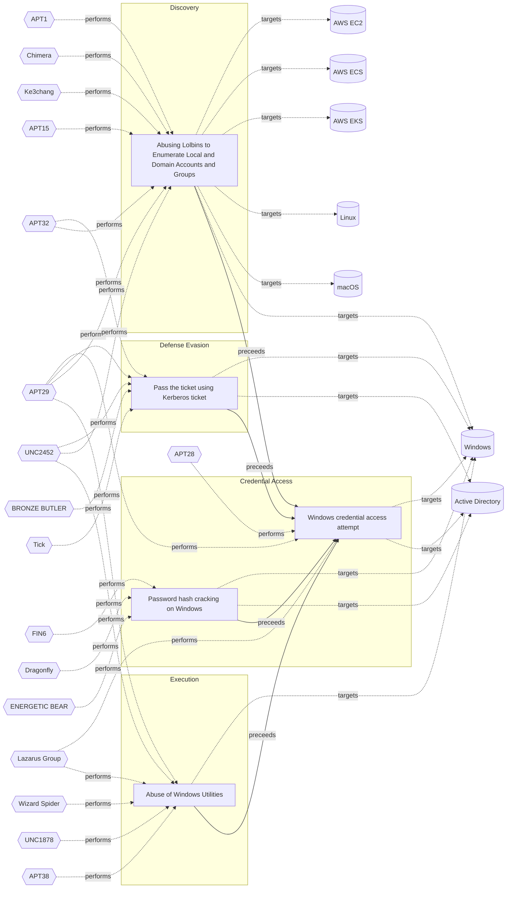

# ☣️ Password hash cracking on Windows

🔥 **Criticality:Medium** ❗ : A Medium priority incident may affect public health or safety, national security, economic security, foreign relations, civil liberties, or public confidence. 

🚦 **TLP:CLEAR** ⚪ : Recipients can spread this to the world, there is no limit on disclosure.

🗡️ **ATT&CK Techniques** [T1110.002 : Brute Force: Password Cracking](https://attack.mitre.org/techniques/T1110/002 'Adversaries may use password cracking to attempt to recover usable credentials, such as plaintext passwords, when credential material such as password')

---

`🔑 UUID : 35c76d6c-2ac7-486e-b0b7-b56f6b110bec` **|** `🏷️ Version : 2` **|** `🗓️ Creation Date : 2023-02-03` **|** `🗓️ Last Modification : 2023-02-06` **|** `Sharing Organisation : {'uuid': '56b0a0f0-b0bc-47d9-bb46-02f80ae2065a', 'name': 'EC DIGIT CSOC'}` **|** `🧱 Schema Identifier : tvm::2.0`

## 👁️ Description

> Threat actors often extract valid credentials from target systems. When
> these credentials are in a hashed format, threat actors may use different
> methods to crack and obtain the credentials in clear text. When this
> information cannot be directly leveraged for higher privileges (like with
> pass-the-hash, overpass-the-hash), it is required to crack it. Some methods
> that threat actors use include: brute force, dictionary attack, or sub-set
> of the dictionary attack named rainbow tables. Threat actors can use
> a variety of tools to crack password hashes. For example,
> Mimikatz, Hashcat, CrackStation, Password Cracker, Brutus Password Cracker,
> Aircrack, THC Hydra, RainbowCrack, Cain and Abel, Medusa, John The Ripper,
> ophCrack, WFuzz, L0phtCrack, OphCrack and others.
> 
> The threat actors can crack the password hashes, for example with JTR or
> Hashcat cracking tools that use text files to match and crack the hashes. 
> (an example for a text file could be: rockyou.txt)
> 
> gunzip /usr/share/wordlist/file.txt
> john hash.txt /usr/share/wordlists/file.txt — format=nt
> 
> hashcat -m 1000 hash.txt /usr/share/wordlists/file.txt
> 
> An example of how to use Hashcat for a dictionary attack:
> 
> hashcat --attack-mode 0 --hash-type $number $hashes_file $wordlist_file
> 
> OR 
> 
> hashcat --loopback --attack-mode 0 --rules-file $rules_file --hash-type $number $hashes_file $wordlist_file
> 
> Example for Hashcat tool which can bruteforce any password from 4 to 8
> characters long:
> 
> hashcat --attack-mode 3 --increment --increment-min 4 --increment-max 8 --hash-type $number $hashes_file "file"
> 
> Hashcat can also be started with custom charsets:
> 
> hashcat --attack-mode 3 --custom-charset1 "?u" --custom-charset2 "?l?u?d" --custom-charset3 "?d" --hash-type $number $hashes_file "file"
> 

## 🖥️ Terrain 

 > A threat actor is using already compromised Windows endpoint.
> 

---

## 🕸️ Relations

### 🐲 Actors sightings 

| Actor           | Description                                                                                                                                                                                                                                                                                                                                                                                                                                                                                                                                                                                                                                                                                                                                                                                                                                                                                                      | Aliases                                                                                                                                                                           | Source                     | Sighting               | Reference                |
|:----------------|:-----------------------------------------------------------------------------------------------------------------------------------------------------------------------------------------------------------------------------------------------------------------------------------------------------------------------------------------------------------------------------------------------------------------------------------------------------------------------------------------------------------------------------------------------------------------------------------------------------------------------------------------------------------------------------------------------------------------------------------------------------------------------------------------------------------------------------------------------------------------------------------------------------------------|:----------------------------------------------------------------------------------------------------------------------------------------------------------------------------------|:---------------------------|:-----------------------|:-------------------------|
| [ICS] FIN6      | [FIN6](https://attack.mitre.org/groups/G0037) is a cyber crime group that has stolen payment card data and sold it for profit on underground marketplaces. This group has aggressively targeted and compromised point of sale (PoS) systems in the hospitality and retail sectors.(Citation: FireEye FIN6 April 2016)(Citation: FireEye FIN6 Apr 2019)                                                                                                                                                                                                                                                                                                                                                                                                                                                                                                                                                           | Camouflage Tempest, ITG08, Magecart Group 6, Skeleton Spider, TAAL                                                                                                                | 🗡️ MITRE ATT&CK Groups     | No documented sighting | No documented references |
| FIN6            | FIN is a group targeting financial assets including assets able to do financial transaction including PoS.                                                                                                                                                                                                                                                                                                                                                                                                                                                                                                                                                                                                                                                                                                                                                                                                       | SKELETON SPIDER, ITG08, MageCart Group 6, White Giant, GOLD FRANKLIN, ATK88, G0037, Camouflage Tempest, TA4557, Storm-0538                                                        | 🌌 MISP Threat Actor Galaxy | No documented sighting | No documented references |
| [ICS] Dragonfly | [Dragonfly](https://attack.mitre.org/groups/G0035) is a cyber espionage group that has been attributed to Russia's Federal Security Service (FSB) Center 16.(Citation: DOJ Russia Targeting Critical Infrastructure March 2022)(Citation: UK GOV FSB Factsheet April 2022) Active since at least 2010, [Dragonfly](https://attack.mitre.org/groups/G0035) has targeted defense and aviation companies, government entities, companies related to industrial control systems, and critical infrastructure sectors worldwide through supply chain, spearphishing, and drive-by compromise attacks.(Citation: Symantec Dragonfly)(Citation: Secureworks IRON LIBERTY July 2019)(Citation: Symantec Dragonfly Sept 2017)(Citation: Fortune Dragonfly 2.0 Sept 2017)(Citation: Gigamon Berserk Bear October 2021)(Citation: CISA AA20-296A Berserk Bear December 2020)(Citation: Symantec Dragonfly 2.0 October 2017) | BROMINE, Berserk Bear, Crouching Yeti, DYMALLOY, Energetic Bear, Ghost Blizzard, IRON LIBERTY, TEMP.Isotope, TG-4192                                                              | 🗡️ MITRE ATT&CK Groups     | No documented sighting | No documented references |
| ENERGETIC BEAR  | A Russian group that collects intelligence on the energy industry.                                                                                                                                                                                                                                                                                                                                                                                                                                                                                                                                                                                                                                                                                                                                                                                                                                               | BERSERK BEAR, ALLANITE, CASTLE, DYMALLOY, TG-4192, Dragonfly, Crouching Yeti, Group 24, Havex, Koala Team, IRON LIBERTY, G0035, ATK6, ITG15, BROMINE, Blue Kraken, Ghost Blizzard | 🌌 MISP Threat Actor Galaxy | No documented sighting | No documented references |

### 🌊 OpenTide Objects
🚫 No related OpenTide objects indexed.

 --- 

### ⛓️ Threat Chaining

Expand chaining data

| ☣️ Vector                                                                                                                                                                                                                                                            | ⛓️ Link              | 🎯 Target                                                                                                                                                                                                                                                                                                                                         | ⛰️ Terrain                                                                                                                                                                                          | 🗡️ ATT&CK                                                                                                                                                                                                                                                                                                                                                                                                                                                                                                                                                                                                                                                                                                                                                                                                                                                                                                                                                                                                                                                                                                                                                                                                                                                                                                                                                                                                                                                                                                         |
|:---------------------------------------------------------------------------------------------------------------------------------------------------------------------------------------------------------------------------------------------------------------------|:---------------------|:-------------------------------------------------------------------------------------------------------------------------------------------------------------------------------------------------------------------------------------------------------------------------------------------------------------------------------------------------|:----------------------------------------------------------------------------------------------------------------------------------------------------------------------------------------------------|:------------------------------------------------------------------------------------------------------------------------------------------------------------------------------------------------------------------------------------------------------------------------------------------------------------------------------------------------------------------------------------------------------------------------------------------------------------------------------------------------------------------------------------------------------------------------------------------------------------------------------------------------------------------------------------------------------------------------------------------------------------------------------------------------------------------------------------------------------------------------------------------------------------------------------------------------------------------------------------------------------------------------------------------------------------------------------------------------------------------------------------------------------------------------------------------------------------------------------------------------------------------------------------------------------------------------------------------------------------------------------------------------------------------------------------------------------------------------------------------------------------------|
| [Windows credential access attempt](../Threat%20Vectors/☣️%20Windows%20credential%20access%20attempt.md 'Windows credential access refers to techniques used by threatactors to steal authentication information such as passwords,hashes, tokens, or Kerberos ...') | `sequence::preceeds` | [Password hash cracking on Windows](../Threat%20Vectors/☣️%20Password%20hash%20cracking%20on%20Windows.md 'Threat actors often extract valid credentials from target systems Whenthese credentials are in a hashed format, threat actors may use differentmethods...')                                                                           | A threat actor is using already compromised Windows endpoint.                                                                                                                                       | [T1110.002 : Brute Force: Password Cracking](https://attack.mitre.org/techniques/T1110/002 'Adversaries may use password cracking to attempt to recover usable credentials, such as plaintext passwords, when credential material such as password')                                                                                                                                                                                                                                                                                                                                                                                                                                                                                                                                                                                                                                                                                                                                                                                                                                                                                                                                                                                                                                                                                                                                                                                                                                                              |
| [Windows credential access attempt](../Threat%20Vectors/☣️%20Windows%20credential%20access%20attempt.md 'Windows credential access refers to techniques used by threatactors to steal authentication information such as passwords,hashes, tokens, or Kerberos ...') | `sequence::preceeds` | [Pass the ticket using Kerberos ticket](../Threat%20Vectors/☣️%20Pass%20the%20ticket%20using%20Kerberos%20ticket.md 'Pass-the-Ticket using Kerberos tickets is an advanced method wherein threat actors illicitly extract and exploit Kerberos tickets to gain unauthorized...')                                                                 | Adversaries need to compromise an asset and be able to execute commands.                                                                                                                            | [T1550.003 : Use Alternate Authentication Material: Pass the Ticket](https://attack.mitre.org/techniques/T1550/003 'Adversaries may pass the ticket using stolen Kerberos tickets to move laterally within an environment, bypassing normal system access controls Pass th')                                                                                                                                                                                                                                                                                                                                                                                                                                                                                                                                                                                                                                                                                                                                                                                                                                                                                                                                                                                                                                                                                                                                                                                                                                      |
| [Windows credential access attempt](../Threat%20Vectors/☣️%20Windows%20credential%20access%20attempt.md 'Windows credential access refers to techniques used by threatactors to steal authentication information such as passwords,hashes, tokens, or Kerberos ...') | `sequence::preceeds` | [Abusing Lolbins to Enumerate Local and Domain Accounts and Groups](../Threat%20Vectors/☣️%20Abusing%20Lolbins%20to%20Enumerate%20Local%20and%20Domain%20Accounts%20and%20Groups.md 'Adversaries may attempt to enumerate the environment and list alllocal system and domain accounts or groups  To achieve this purpose, they can use var...') | Adversaries can take advantage of already compromised system (Windows or  Linux OS or OSX) to run commands.                                                                                         | [T1087.001 : Account Discovery: Local Account](https://attack.mitre.org/techniques/T1087/001 'Adversaries may attempt to get a listing of local system accounts This information can help adversaries determine which local accounts exist on a syst'), [T1087.002 : Account Discovery: Domain Account](https://attack.mitre.org/techniques/T1087/002 'Adversaries may attempt to get a listing of domain accounts This information can help adversaries determine which domain accounts exist to aid in foll'), [T1069.001 : Permission Groups Discovery: Local Groups](https://attack.mitre.org/techniques/T1069/001 'Adversaries may attempt to find local system groups and permission settings The knowledge of local system permission groups can help adversaries deter'), [T1069.002 : Permission Groups Discovery: Domain Groups](https://attack.mitre.org/techniques/T1069/002 'Adversaries may attempt to find domain-level groups and permission settings The knowledge of domain-level permission groups can help adversaries deter')                                                                                                                                                                                                                                                                                                                                                                                                                                                                |
| [Windows credential access attempt](../Threat%20Vectors/☣️%20Windows%20credential%20access%20attempt.md 'Windows credential access refers to techniques used by threatactors to steal authentication information such as passwords,hashes, tokens, or Kerberos ...') | `sequence::preceeds` | [Abuse of Windows Utilities](../Threat%20Vectors/☣️%20Abuse%20of%20Windows%20Utilities.md 'Advanced threat actors frequently abuse legitimate Windows utilities to execute malicious code, evade detection, and maintain persistence This techniq...')                                                                                           | Adversaries must have access to a Windows environment where they can execute  built-in utilities. Limited user privileges may suffice,  but administrative privileges enhance the potential impact. | [T1218](https://attack.mitre.org/techniques/T1218 'Adversaries may bypass process andor signature-based defenses by proxying execution of malicious content with signed, or otherwise trusted, binaries B'), [T1197](https://attack.mitre.org/techniques/T1197 'Adversaries may abuse BITS jobs to persistently execute code and perform various background tasks Windows Background Intelligent Transfer Service BITS'), [T1218.004](https://attack.mitre.org/techniques/T1218/004 'Adversaries may use InstallUtil to proxy execution of code through a trusted Windows utility InstallUtil is a command-line utility that allows for ins'), [T1563](https://attack.mitre.org/techniques/T1563 'Adversaries may take control of preexisting sessions with remote services to move laterally in an environment Users may use valid credentials to log i'), [T1140](https://attack.mitre.org/techniques/T1140 'Adversaries may use Obfuscated Files or InformationhttpsattackmitreorgtechniquesT1027 to hide artifacts of an intrusion from analysis They may require'), [T1218.010](https://attack.mitre.org/techniques/T1218/010 'Adversaries may abuse Regsvr32exe to proxy execution of malicious code Regsvr32exe is a command-line program used to register and unregister object li'), [T1218.005](https://attack.mitre.org/techniques/T1218/005 'Adversaries may abuse mshtaexe to proxy execution of malicious hta files and Javascript or VBScript through a trusted Windows utility There are severa') |

&nbsp; 

---

## Model Data

#### **⛓️ Cyber Kill Chain**

 > Cyber attacks are typically phased progressions towards strategic objectives. The Unified Kill Chains provides insight into the tactics that hackers employ to attain these objectives. This provides a solid basis to develop (or realign) defensive strategies to raise cyber resilience.

 [`🔑 Credential Access`](https://www.unifiedkillchain.com/assets/The-Unified-Kill-Chain.pdf) : Techniques resulting in the access of, or control over, system, service or domain credentials.

---

#### **🛰️ Domains**

 > Infrastructure technologies domain of interest to attackers.

  - `🏢 Enterprise` : Generic databases, applications, machines and systems that are usually on premises or on Cloud traditional VMs.
 - `☁️ Private Cloud` : Infrastructure hosted at a third party, but based on custom specification and managed on a platform level.
 - `☁️ Public Cloud` : Infrastructure handled by a commercial cloud provider. Managed mostly on a service level, and connected over the internet.

---

#### **🎯 Targets**

 > Granular delimited technical entities holding a value to the organization, that are targeted by adversaries. They might be also involved in the detection coverage as the target of log collection. Partially inspired by Veris.

  - [`🖥️ Desktop`](http://veriscommunity.net/enums.html#section-asset) : User Device - Desktop or workstation
 - [`💻 Laptop`](http://veriscommunity.net/enums.html#section-asset) : User Device - Laptop
 - [`🖥️ Workstations`](http://veriscommunity.net/enums.html#section-asset) : Placeholder
 - [`🖲️ Control Server`](https://collaborate.mitre.org/attackics/index.php/Control_Server) : A device which acts as both a server and controller, that hosts the control software used in communicating with lower-level control devices in an ICS network (e.g. Remote Terminal Units (RTUs) and Programmable Logic Controllers (PLCs)).
 - [`🕹️ Remote access`](http://veriscommunity.net/enums.html#section-asset) : Server - Remote access
 - [`👤 System admin`](http://veriscommunity.net/enums.html#section-asset) : People - Administrator
 - [`🖥️ Public-Facing Servers`](http://veriscommunity.net/enums.html#section-asset) : Placeholder
 - [`🖥️ Web Application Servers`](http://veriscommunity.net/enums.html#section-asset) : Placeholder
 - [`🗄️ Production Database`](http://veriscommunity.net/enums.html#section-asset) : Placeholder

---

#### **💿 Platforms concerned**

 > Actual technologies used by the organization that will be exploited by adversaries during a successful attack, and eventually of relevance for detection. Are named by commercial designation.

  - ` Windows` : Placeholder
 - ` Active Directory` : Placeholder

---

#### **💣 Severity**

 > The severity summarizes the overall danger of incident the vector will provoke, and is to be derived (WIP) from impact, leverage, and difficulty to execute.

 [`🧨 Moderate incident`](https://www.ncsc.gov.uk/news/new-cyber-attack-categorisation-system-improve-uk-response-incidents) : A cyber attack on a small organisation, or which poses a considerable risk to a medium-sized organisation, or preliminary indications of cyber activity against a large organisation or the government.

---

#### **🪄 Leverage acquisition**

 > Technical aftermath of the attack from the target perspective, differentiated from impact as it does not consider the value of the consequence, only what increased control the vector execution provides to the adversary.

 [`🐒 Tampering`](https://owasp.org/www-community/Threat_Modeling_Process#stride) : Threat action intending to maliciously change or modify persistent data, such as records in a database, and the alteration of data in transit between two computers over an open network, such as the Internet.

---

#### **💥 Impact**

 > Analysis of the threat vector from the organizational perspective, in non technical term. This aims at putting a clear denomination on what the attacker will actually be able to act upon if the threat vector is realized.

 [`😤 Nuisance`](http://veriscommunity.net/enums.html#section-impact) : Small and mostly inconsequential to day to day operations, but noticed.

---

#### **🎲 Vector Viability**

 > Described with estimative language (likelyhood probability), describes how likely the analyst believes the vector to actually be realized on the organization infrastructure. Estimative language describes quality and credibility of underlying sources, data, and methodologies based Intelligence Community Directive 203 (ICD 203) and JP 2-0, Joint Intelligence.

 [`🧐 Likely`](https://www.dni.gov/files/documents/ICD/ICD%20203%20Analytic%20Standards.pdf) : Probable (probably) - 55-80%

---

### 🔗 References

**🕊️ Publicly available resources**

- [_1_] https://robertscocca.medium.com/cracking-windows-hashes-fb0af3108c0a
- [_2_] https://securitygladiators.com/security/software/password-cracker/
- [_3_] https://www.freecodecamp.org/news/crack-passwords-using-john-the-ripper-pentesting-tutorial/
- [_4_] https://medium.com/cyber-security-resources/hacking-and-cracking-ntlm-hash-to-get-windows-admin-password-f44819b01db5
- [_5_] https://www.thehacker.recipes/ad/movement/credentials/cracking
- [_6_] https://www.softwaretestinghelp.com/password-cracker-tools/
- [_7_] https://www.freecodecamp.org/news/hacking-with-hashcat-a-practical-guide/
- [_8_] https://crackstation.net/
- [_9_] https://download.cnet.com/Password-Cracker/3000-2092_4-10226556.html
- [_10_] https://www.darknet.org.uk/2006/09/brutus-password-cracker-download-brutus-aet2zip-aet2/
- [_11_] https://www.softpedia.com/get/Security/Encrypting/RainbowCrack.shtml
- [_12_] https://sourceforge.net/projects/thc-hydra.mirror/
- [_13_] https://www.cyberpratibha.com/cain-and-abel-software-cracking-hashes/
- [_14_] https://l0phtcrack.gitlab.io/
- [_15_] https://www.pwndefend.com/2021/10/18/password-auditing-with-l0phtcrack-7-a-quick-intro/

[1]: https://robertscocca.medium.com/cracking-windows-hashes-fb0af3108c0a
[2]: https://securitygladiators.com/security/software/password-cracker/
[3]: https://www.freecodecamp.org/news/crack-passwords-using-john-the-ripper-pentesting-tutorial/
[4]: https://medium.com/cyber-security-resources/hacking-and-cracking-ntlm-hash-to-get-windows-admin-password-f44819b01db5
[5]: https://www.thehacker.recipes/ad/movement/credentials/cracking
[6]: https://www.softwaretestinghelp.com/password-cracker-tools/
[7]: https://www.freecodecamp.org/news/hacking-with-hashcat-a-practical-guide/
[8]: https://crackstation.net/
[9]: https://download.cnet.com/Password-Cracker/3000-2092_4-10226556.html
[10]: https://www.darknet.org.uk/2006/09/brutus-password-cracker-download-brutus-aet2zip-aet2/
[11]: https://www.softpedia.com/get/Security/Encrypting/RainbowCrack.shtml
[12]: https://sourceforge.net/projects/thc-hydra.mirror/
[13]: https://www.cyberpratibha.com/cain-and-abel-software-cracking-hashes/
[14]: https://l0phtcrack.gitlab.io/
[15]: https://www.pwndefend.com/2021/10/18/password-auditing-with-l0phtcrack-7-a-quick-intro/

---

#### 🏷️ Tags

#-, #-, #-, #
, #
, ##, ##, ##, ##, # , #🏷, #️, # , #T, #a, #g, #s, #
, #

