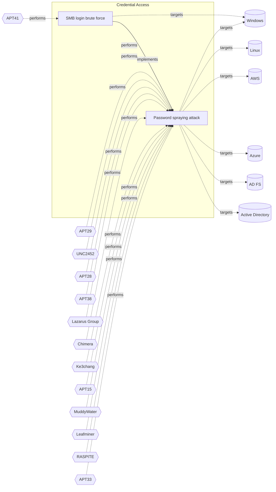

# ☣️ Password spraying attack

🔥 **Criticality:High** ⚠️ : A High priority incident is likely to result in a demonstrable impact to public health or safety, national security, economic security, foreign relations, civil liberties, or public confidence. 

🚦 **TLP:CLEAR** ⚪ : Recipients can spread this to the world, there is no limit on disclosure.

🗡️ **ATT&CK Techniques** [T1110.003 : Brute Force: Password Spraying](https://attack.mitre.org/techniques/T1110/003 'Adversaries may use a single or small list of commonly used passwords against many different accounts to attempt to acquire valid account credentials ')

---

`🔑 UUID : cc546bbc-f71c-4538-934c-415d6adc293b` **|** `🏷️ Version : 3` **|** `🗓️ Creation Date : 2024-03-27` **|** `🗓️ Last Modification : 2025-10-01` **|** `Sharing Organisation : {'uuid': '56b0a0f0-b0bc-47d9-bb46-02f80ae2065a', 'name': 'EC DIGIT CSOC'}` **|** `🧱 Schema Identifier : tvm::2.0`

## 👁️ Description

> Password spraying is a technique that attackers use to try a small list
> of common or expected passwords against a set of usernames. This technique
> is used to avoid account lockouts that would normally occur when brute
> forcing a single account with many passwords1. Password spraying is a
> sub-technique of credential spraying, which is just credential guessing
> but "sprayed" (i.e. against multiple accounts). (ref [1], [2])  
> 
> Adversaries have been observed using password spray attacks to exploit
> logins of network services or credential harvesting, typically used
> to obtain initial foothold.
> 
> They attempt username and password combinations in a slow manner,
> researching the pattern for valid accounts (e.g. email address or username
> length). Organizations targeted typically see a few authentication attempts
> per account; with nearly every attempt originating from constantly rotating
> IP addresses, many associated with the Tor anonymizing service.  
> 
> Some strategies conducted by adversaries are:  
> 
> - Credential stuffing towards Microsoft Office 365 accounts, there are
> tools that identify valid credentials for Office 365 and Azure AD accounts,
> as Spray365.  
> 
> - Abuse of Exchange servers. There are tools for searching through email
> in an Exchange environment for specific terms (passwords, insider intel,
> network architecture information, etc.) as for example MailSniper; which
> includes modules for password spraying, enumerating users and domains or
> gathering the Global Address List (GAL) from OWA and EWS.  
> 
> - Password spray against exposed Active Directory Federation Services
> (ADFS) infrastructure. The organizations not using MFA have a higher risk
> of having accounts compromised through password spray. If attack is
> successful, adversaries may look for additional contacts, sensitive
> information, privileged information, or send phishing links to
> others in the organization.  
> 
> 
> - Password spraying attack against Microsoft Entra ID applications
> Password spray attacks involve trying a few common passwords against
> specific or many accounts. This may include and attack against the
> cloud-based Microsoft application solution: Microsoft Entra ID. The
> goal is to bypass traditional protections like password lockout and
> malicious IP blocking. They can include low number of login attempts
> or lack of consistency which makes them difficult to detect.  
> 

## 🖥️ Terrain 

 > Adversaries must look for different accounts to test a list of different
> frequently used weak passwords. To have success, the attacker need to 
> research what are the valid account patterns used for the Internet-facing
> applications used by the organisation such as VPN service or O365.  
> 

---

## 🕸️ Relations

### 🐲 Actors sightings 

| Actor                   | Description                                                                                                                                                                                                                                                                                                                                                                                                                                                                                                                                                                                                                                                                                                                                                                                                                                                                                                                                                                                                                                                                                                                                                                                                                                                                                                                                                                                                                                                                                                                                                                                                                                                                                                                                          | Aliases                                                                                                                                                                                                                                                                                                                                                                                                                                                                                                                                                | Source                     | Sighting               | Reference                |
|:------------------------|:-----------------------------------------------------------------------------------------------------------------------------------------------------------------------------------------------------------------------------------------------------------------------------------------------------------------------------------------------------------------------------------------------------------------------------------------------------------------------------------------------------------------------------------------------------------------------------------------------------------------------------------------------------------------------------------------------------------------------------------------------------------------------------------------------------------------------------------------------------------------------------------------------------------------------------------------------------------------------------------------------------------------------------------------------------------------------------------------------------------------------------------------------------------------------------------------------------------------------------------------------------------------------------------------------------------------------------------------------------------------------------------------------------------------------------------------------------------------------------------------------------------------------------------------------------------------------------------------------------------------------------------------------------------------------------------------------------------------------------------------------------|:-------------------------------------------------------------------------------------------------------------------------------------------------------------------------------------------------------------------------------------------------------------------------------------------------------------------------------------------------------------------------------------------------------------------------------------------------------------------------------------------------------------------------------------------------------|:---------------------------|:-----------------------|:-------------------------|
| [Enterprise] APT29      | [APT29](https://attack.mitre.org/groups/G0016) is threat group that has been attributed to Russia's Foreign Intelligence Service (SVR).(Citation: White House Imposing Costs RU Gov April 2021)(Citation: UK Gov Malign RIS Activity April 2021) They have operated since at least 2008, often targeting government networks in Europe and NATO member countries, research institutes, and think tanks. [APT29](https://attack.mitre.org/groups/G0016) reportedly compromised the Democratic National Committee starting in the summer of 2015.(Citation: F-Secure The Dukes)(Citation: GRIZZLY STEPPE JAR)(Citation: Crowdstrike DNC June 2016)(Citation: UK Gov UK Exposes Russia SolarWinds April 2021)In April 2021, the US and UK governments attributed the [SolarWinds Compromise](https://attack.mitre.org/campaigns/C0024) to the SVR; public statements included citations to [APT29](https://attack.mitre.org/groups/G0016), Cozy Bear, and The Dukes.(Citation: NSA Joint Advisory SVR SolarWinds April 2021)(Citation: UK NSCS Russia SolarWinds April 2021) Industry reporting also referred to the actors involved in this campaign as UNC2452, NOBELIUM, StellarParticle, Dark Halo, and SolarStorm.(Citation: FireEye SUNBURST Backdoor December 2020)(Citation: MSTIC NOBELIUM Mar 2021)(Citation: CrowdStrike SUNSPOT Implant January 2021)(Citation: Volexity SolarWinds)(Citation: Cybersecurity Advisory SVR TTP May 2021)(Citation: Unit 42 SolarStorm December 2020)                                                                                                                                                                                                                                                         | Blue Kitsune, Cozy Bear, CozyDuke, Dark Halo, IRON HEMLOCK, IRON RITUAL, Midnight Blizzard, NOBELIUM, NobleBaron, SolarStorm, The Dukes, UNC2452, UNC3524, YTTRIUM                                                                                                                                                                                                                                                                                                                                                                                     | 🗡️ MITRE ATT&CK Groups     | No documented sighting | No documented references |
| UNC2452                 | Reporting regarding activity related to the SolarWinds supply chain injection has grown quickly since initial disclosure on 13 December 2020. A significant amount of press reporting has focused on the identification of the actor(s) involved, victim organizations, possible campaign timeline, and potential impact. The US Government and cyber community have also provided detailed information on how the campaign was likely conducted and some of the malware used.  MITRE’s ATT&CK team — with the assistance of contributors — has been mapping techniques used by the actor group, referred to as UNC2452/Dark Halo by FireEye and Volexity respectively, as well as SUNBURST and TEARDROP malware.                                                                                                                                                                                                                                                                                                                                                                                                                                                                                                                                                                                                                                                                                                                                                                                                                                                                                                                                                                                                                                    | DarkHalo, StellarParticle, NOBELIUM, Solar Phoenix, Midnight Blizzard                                                                                                                                                                                                                                                                                                                                                                                                                                                                                  | 🌌 MISP Threat Actor Galaxy | No documented sighting | No documented references |
| [Mobile] APT28          | [APT28](https://attack.mitre.org/groups/G0007) is a threat group that has been attributed to Russia's General Staff Main Intelligence Directorate (GRU) 85th Main Special Service Center (GTsSS) military unit 26165.(Citation: NSA/FBI Drovorub August 2020)(Citation: Cybersecurity Advisory GRU Brute Force Campaign July 2021) This group has been active since at least 2004.(Citation: DOJ GRU Indictment Jul 2018)(Citation: Ars Technica GRU indictment Jul 2018)(Citation: Crowdstrike DNC June 2016)(Citation: FireEye APT28)(Citation: SecureWorks TG-4127)(Citation: FireEye APT28 January 2017)(Citation: GRIZZLY STEPPE JAR)(Citation: Sofacy DealersChoice)(Citation: Palo Alto Sofacy 06-2018)(Citation: Symantec APT28 Oct 2018)(Citation: ESET Zebrocy May 2019)[APT28](https://attack.mitre.org/groups/G0007) reportedly compromised the Hillary Clinton campaign, the Democratic National Committee, and the Democratic Congressional Campaign Committee in 2016 in an attempt to interfere with the U.S. presidential election.(Citation: Crowdstrike DNC June 2016) In 2018, the US indicted five GRU Unit 26165 officers associated with [APT28](https://attack.mitre.org/groups/G0007) for cyber operations (including close-access operations) conducted between 2014 and 2018 against the World Anti-Doping Agency (WADA), the US Anti-Doping Agency, a US nuclear facility, the Organization for the Prohibition of Chemical Weapons (OPCW), the Spiez Swiss Chemicals Laboratory, and other organizations.(Citation: US District Court Indictment GRU Oct 2018) Some of these were conducted with the assistance of GRU Unit 74455, which is also referred to as [Sandworm Team](https://attack.mitre.org/groups/G0034). | FROZENLAKE, Fancy Bear, Forest Blizzard, Group 74, GruesomeLarch, IRON TWILIGHT, Pawn Storm, SNAKEMACKEREL, STRONTIUM, Sednit, Sofacy, Swallowtail, TG-4127, Threat Group-4127, Tsar Team                                                                                                                                                                                                                                                                                                                                                              | 🗡️ MITRE ATT&CK Groups     | No documented sighting | No documented references |
| APT28                   | The Sofacy Group (also known as APT28, Pawn Storm, Fancy Bear and Sednit) is a cyber espionage group believed to have ties to the Russian government. Likely operating since 2007, the group is known to target government, military, and security organizations. It has been characterized as an advanced persistent threat.                                                                                                                                                                                                                                                                                                                                                                                                                                                                                                                                                                                                                                                                                                                                                                                                                                                                                                                                                                                                                                                                                                                                                                                                                                                                                                                                                                                                                        | Pawn Storm, FANCY BEAR, Sednit, SNAKEMACKEREL, Tsar Team, TG-4127, STRONTIUM, Swallowtail, IRON TWILIGHT, Group 74, SIG40, Grizzly Steppe, G0007, ATK5, Fighting Ursa, ITG05, Blue Athena, TA422, T-APT-12, APT-C-20, UAC-0028, FROZENLAKE, Sofacy, Forest Blizzard, BlueDelta, Fancy Bear, GruesomeLarch                                                                                                                                                                                                                                              | 🌌 MISP Threat Actor Galaxy | No documented sighting | No documented references |
| [ICS] APT38             | [APT38](https://attack.mitre.org/groups/G0082) is a North Korean state-sponsored threat group that specializes in financial cyber operations; it has been attributed to the Reconnaissance General Bureau.(Citation: CISA AA20-239A BeagleBoyz August 2020) Active since at least 2014, [APT38](https://attack.mitre.org/groups/G0082) has targeted banks, financial institutions, casinos, cryptocurrency exchanges, SWIFT system endpoints, and ATMs in at least 38 countries worldwide. Significant operations include the 2016 Bank of Bangladesh heist, during which [APT38](https://attack.mitre.org/groups/G0082) stole $81 million, as well as attacks against Bancomext (Citation: FireEye APT38 Oct 2018) and Banco de Chile (Citation: FireEye APT38 Oct 2018); some of their attacks have been destructive.(Citation: CISA AA20-239A BeagleBoyz August 2020)(Citation: FireEye APT38 Oct 2018)(Citation: DOJ North Korea Indictment Feb 2021)(Citation: Kaspersky Lazarus Under The Hood Blog 2017)North Korean group definitions are known to have significant overlap, and some security researchers report all North Korean state-sponsored cyber activity under the name [Lazarus Group](https://attack.mitre.org/groups/G0032) instead of tracking clusters or subgroups.                                                                                                                                                                                                                                                                                                                                                                                                                                                           | BeagleBoyz, Bluenoroff, COPERNICIUM, NICKEL GLADSTONE, Sapphire Sleet, Stardust Chollima                                                                                                                                                                                                                                                                                                                                                                                                                                                               | 🗡️ MITRE ATT&CK Groups     | No documented sighting | No documented references |
| Lazarus Group           | Since 2009, HIDDEN COBRA actors have leveraged their capabilities to target and compromise a range of victims; some intrusions have resulted in the exfiltration of data while others have been disruptive in nature. Commercial reporting has referred to this activity as Lazarus Group and Guardians of Peace. Tools and capabilities used by HIDDEN COBRA actors include DDoS botnets, keyloggers, remote access tools (RATs), and wiper malware. Variants of malware and tools used by HIDDEN COBRA actors include Destover, Duuzer, and Hangman.                                                                                                                                                                                                                                                                                                                                                                                                                                                                                                                                                                                                                                                                                                                                                                                                                                                                                                                                                                                                                                                                                                                                                                                               | Operation DarkSeoul, Dark Seoul, Hidden Cobra, Hastati Group, Andariel, Unit 121, Bureau 121, NewRomanic Cyber Army Team, Bluenoroff, Subgroup: Bluenoroff, Group 77, Labyrinth Chollima, Operation Troy, Operation GhostSecret, Operation AppleJeus, APT38, APT 38, Stardust Chollima, Whois Hacking Team, Zinc, Appleworm, Nickel Academy, APT-C-26, NICKEL GLADSTONE, COVELLITE, ATK3, G0032, ATK117, G0082, Citrine Sleet, DEV-0139, DEV-1222, Diamond Sleet, ZINC, Sapphire Sleet, COPERNICIUM, TA404, Lazarus group, BeagleBoyz, Moonstone Sleet | 🌌 MISP Threat Actor Galaxy | No documented sighting | No documented references |
| [Enterprise] Chimera    | [Chimera](https://attack.mitre.org/groups/G0114) is a suspected China-based threat group that has been active since at least 2018 targeting the semiconductor industry in Taiwan as well as data from the airline industry.(Citation: Cycraft Chimera April 2020)(Citation: NCC Group Chimera January 2021)                                                                                                                                                                                                                                                                                                                                                                                                                                                                                                                                                                                                                                                                                                                                                                                                                                                                                                                                                                                                                                                                                                                                                                                                                                                                                                                                                                                                                                          |                                                                                                                                                                                                                                                                                                                                                                                                                                                                                                                                                        | 🗡️ MITRE ATT&CK Groups     | No documented sighting | No documented references |
| [Enterprise] Ke3chang   | [Ke3chang](https://attack.mitre.org/groups/G0004) is a threat group attributed to actors operating out of China. [Ke3chang](https://attack.mitre.org/groups/G0004) has targeted oil, government, diplomatic, military, and NGOs in Central and South America, the Caribbean, Europe, and North America since at least 2010.(Citation: Mandiant Operation Ke3chang November 2014)(Citation: NCC Group APT15 Alive and Strong)(Citation: APT15 Intezer June 2018)(Citation: Microsoft NICKEL December 2021)                                                                                                                                                                                                                                                                                                                                                                                                                                                                                                                                                                                                                                                                                                                                                                                                                                                                                                                                                                                                                                                                                                                                                                                                                                            | APT15, GREF, Mirage, NICKEL, Nylon Typhoon, Playful Dragon, RoyalAPT, Vixen Panda                                                                                                                                                                                                                                                                                                                                                                                                                                                                      | 🗡️ MITRE ATT&CK Groups     | No documented sighting | No documented references |
| APT15                   | This threat actor uses phishing techniques to compromise the networks of foreign ministries of European countries for espionage purposes.                                                                                                                                                                                                                                                                                                                                                                                                                                                                                                                                                                                                                                                                                                                                                                                                                                                                                                                                                                                                                                                                                                                                                                                                                                                                                                                                                                                                                                                                                                                                                                                                            | VIXEN PANDA, Ke3Chang, Playful Dragon, Metushy, Lurid, Social Network Team, Royal APT, BRONZE PALACE, BRONZE DAVENPORT, BRONZE IDLEWOOD, NICKEL, G0004, Red Vulture, Nylon Typhoon, Mirage                                                                                                                                                                                                                                                                                                                                                             | 🌌 MISP Threat Actor Galaxy | No documented sighting | No documented references |
| [Enterprise] MuddyWater | [MuddyWater](https://attack.mitre.org/groups/G0069) is a cyber espionage group assessed to be a subordinate element within Iran's Ministry of Intelligence and Security (MOIS).(Citation: CYBERCOM Iranian Intel Cyber January 2022) Since at least 2017, [MuddyWater](https://attack.mitre.org/groups/G0069) has targeted a range of government and private organizations across sectors, including telecommunications, local government, defense, and oil and natural gas organizations, in the Middle East, Asia, Africa, Europe, and North America.(Citation: Unit 42 MuddyWater Nov 2017)(Citation: Symantec MuddyWater Dec 2018)(Citation: ClearSky MuddyWater Nov 2018)(Citation: ClearSky MuddyWater June 2019)(Citation: Reaqta MuddyWater November 2017)(Citation: DHS CISA AA22-055A MuddyWater February 2022)(Citation: Talos MuddyWater Jan 2022)                                                                                                                                                                                                                                                                                                                                                                                                                                                                                                                                                                                                                                                                                                                                                                                                                                                                                       | Earth Vetala, MERCURY, Mango Sandstorm, Seedworm, Static Kitten, TA450, TEMP.Zagros                                                                                                                                                                                                                                                                                                                                                                                                                                                                    | 🗡️ MITRE ATT&CK Groups     | No documented sighting | No documented references |
| MuddyWater              | The MuddyWater attacks are primarily against Middle Eastern nations. However, we have also observed attacks against surrounding nations and beyond, including targets in India and the USA. MuddyWater attacks are characterized by the use of a slowly evolving PowerShell-based first stage backdoor we call “POWERSTATS”. Despite broad scrutiny and reports on MuddyWater attacks, the activity continues with only incremental changes to the tools and techniques.                                                                                                                                                                                                                                                                                                                                                                                                                                                                                                                                                                                                                                                                                                                                                                                                                                                                                                                                                                                                                                                                                                                                                                                                                                                                             | TEMP.Zagros, Static Kitten, Seedworm, MERCURY, COBALT ULSTER, G0069, ATK51, Boggy Serpens, Mango Sandstorm, TA450, Earth Vetala                                                                                                                                                                                                                                                                                                                                                                                                                        | 🌌 MISP Threat Actor Galaxy | No documented sighting | No documented references |
| [Enterprise] Leafminer  | [Leafminer](https://attack.mitre.org/groups/G0077) is an Iranian threat group that has targeted government organizations and business entities in the Middle East since at least early 2017. (Citation: Symantec Leafminer July 2018)                                                                                                                                                                                                                                                                                                                                                                                                                                                                                                                                                                                                                                                                                                                                                                                                                                                                                                                                                                                                                                                                                                                                                                                                                                                                                                                                                                                                                                                                                                                | Raspite                                                                                                                                                                                                                                                                                                                                                                                                                                                                                                                                                | 🗡️ MITRE ATT&CK Groups     | No documented sighting | No documented references |
| RASPITE                 | Dragos has identified a new activity group targeting access operations in the electric utility sector. We call this activity group RASPITE.  Analysis of RASPITE tactics, techniques, and procedures (TTPs) indicate the group has been active in some form since early- to mid-2017. RASPITE targeting includes entities in the US, Middle East, Europe, and East Asia. Operations against electric utility organizations appear limited to the US at this time.  RASPITE leverages strategic website compromise to gain initial access to target networks. RASPITE uses the same methodology as DYMALLOY and ALLANITE in embedding a link to a resource to prompt an SMB connection, from which it harvests Windows credentials. The group then deploys install scripts for a malicious service to beacon back to RASPITE-controlled infrastructure, allowing the adversary to remotely access the victim machine.                                                                                                                                                                                                                                                                                                                                                                                                                                                                                                                                                                                                                                                                                                                                                                                                                                 | LeafMiner, Raspite                                                                                                                                                                                                                                                                                                                                                                                                                                                                                                                                     | 🌌 MISP Threat Actor Galaxy | No documented sighting | No documented references |
| [ICS] APT33             | [APT33](https://attack.mitre.org/groups/G0064) is a suspected Iranian threat group that has carried out operations since at least 2013. The group has targeted organizations across multiple industries in the United States, Saudi Arabia, and South Korea, with a particular interest in the aviation and energy sectors.(Citation: FireEye APT33 Sept 2017)(Citation: FireEye APT33 Webinar Sept 2017)                                                                                                                                                                                                                                                                                                                                                                                                                                                                                                                                                                                                                                                                                                                                                                                                                                                                                                                                                                                                                                                                                                                                                                                                                                                                                                                                            | Elfin, HOLMIUM, Peach Sandstorm                                                                                                                                                                                                                                                                                                                                                                                                                                                                                                                        | 🗡️ MITRE ATT&CK Groups     | No documented sighting | No documented references |
| APT33                   | Our analysis reveals that APT33 is a capable group that has carried out cyber espionage operations since at least 2013. We assess APT33 works at the behest of the Iranian government.                                                                                                                                                                                                                                                                                                                                                                                                                                                                                                                                                                                                                                                                                                                                                                                                                                                                                                                                                                                                                                                                                                                                                                                                                                                                                                                                                                                                                                                                                                                                                               | APT 33, Elfin, MAGNALLIUM, Refined Kitten, HOLMIUM, COBALT TRINITY, G0064, ATK35, Peach Sandstorm, TA451                                                                                                                                                                                                                                                                                                                                                                                                                                               | 🌌 MISP Threat Actor Galaxy | No documented sighting | No documented references |

### 🌊 OpenTide Objects
🚫 No related OpenTide objects indexed.

 --- 

### ⛓️ Threat Chaining

Expand chaining data

| ☣️ Vector                                                                                                                                                                                                                                    | ⛓️ Link                 | 🎯 Target                                                                                                                                                                                                                                         | ⛰️ Terrain                                                                                                                                                                                                                                                                                   | 🗡️ ATT&CK                                                                                                                                                                                                                                            |
|:---------------------------------------------------------------------------------------------------------------------------------------------------------------------------------------------------------------------------------------------|:------------------------|:-------------------------------------------------------------------------------------------------------------------------------------------------------------------------------------------------------------------------------------------------|:---------------------------------------------------------------------------------------------------------------------------------------------------------------------------------------------------------------------------------------------------------------------------------------------|:-----------------------------------------------------------------------------------------------------------------------------------------------------------------------------------------------------------------------------------------------------|
| [SMB login brute force](../Threat%20Vectors/☣️%20SMB%20login%20brute%20force.md 'SMB Server Message Block brute-force is a type of cyber attack where anattacker attempts to guess the password for an SMB share by trying a largenumbe...') | `atomicity::implements` | [Password spraying attack](../Threat%20Vectors/☣️%20Password%20spraying%20attack.md 'Password spraying is a technique that attackers use to try a small listof common or expected passwords against a set of usernames This techniqueis use...') | Adversaries must look for different accounts to test a list of different frequently used weak passwords. To have success, the attacker need to  research what are the valid account patterns used for the Internet-facing applications used by the organisation such as VPN service or O365. | [T1110.003 : Brute Force: Password Spraying](https://attack.mitre.org/techniques/T1110/003 'Adversaries may use a single or small list of commonly used passwords against many different accounts to attempt to acquire valid account credentials ') |

&nbsp; 

---

## Model Data

#### **⛓️ Cyber Kill Chain**

 > Cyber attacks are typically phased progressions towards strategic objectives. The Unified Kill Chains provides insight into the tactics that hackers employ to attain these objectives. This provides a solid basis to develop (or realign) defensive strategies to raise cyber resilience.

 [`🔑 Credential Access`](https://www.unifiedkillchain.com/assets/The-Unified-Kill-Chain.pdf) : Techniques resulting in the access of, or control over, system, service or domain credentials.

---

#### **🛰️ Domains**

 > Infrastructure technologies domain of interest to attackers.

  - `🏢 Enterprise` : Generic databases, applications, machines and systems that are usually on premises or on Cloud traditional VMs.
 - `☁️ Private Cloud` : Infrastructure hosted at a third party, but based on custom specification and managed on a platform level.
 - `☁️ Public Cloud` : Infrastructure handled by a commercial cloud provider. Managed mostly on a service level, and connected over the internet.

---

#### **🎯 Targets**

 > Granular delimited technical entities holding a value to the organization, that are targeted by adversaries. They might be also involved in the detection coverage as the target of log collection. Partially inspired by Veris.

  - [`👤 End-user`](http://veriscommunity.net/enums.html#section-asset) : People - End-user
 - [`👤 Former employee`](http://veriscommunity.net/enums.html#section-asset) : People - Former employee
 - [`👤 Executive`](http://veriscommunity.net/enums.html#section-asset) : People - Executive

---

#### **💿 Platforms concerned**

 > Actual technologies used by the organization that will be exploited by adversaries during a successful attack, and eventually of relevance for detection. Are named by commercial designation.

  - ` Windows` : Placeholder
 - ` Linux` : Placeholder
 - ` AWS` : Placeholder
 - ` Azure` : Placeholder
 - ` AD FS` : Placeholder
 - ` Active Directory` : Placeholder

---

#### **💣 Severity**

 > The severity summarizes the overall danger of incident the vector will provoke, and is to be derived (WIP) from impact, leverage, and difficulty to execute.

 [`⚠️ Significant incident`](https://www.ncsc.gov.uk/news/new-cyber-attack-categorisation-system-improve-uk-response-incidents) : A cyber attack which has a serious impact on a large organisation or on wider / local government, or which poses a considerable risk to central government or (inter)national essential services.

---

#### **🪄 Leverage acquisition**

 > Technical aftermath of the attack from the target perspective, differentiated from impact as it does not consider the value of the consequence, only what increased control the vector execution provides to the adversary.

  - [`👁️‍🗨️ Information Disclosure`](https://owasp.org/www-community/Threat_Modeling_Process#stride) : Threat action intending to read a file that one was not granted access to, or to read data in transit.
 - [`💀 Infrastructure Compromise`](https://owasp.org/www-community/Threat_Modeling_Process#stride) : The compromised target is likely to be used to further expand the sphere of influence of the attacker and allow more potent vectors to be executed.
 - [`💅 Modify privileges`](https://owasp.org/www-community/Threat_Modeling_Process#stride) : Modify privileges or permissions

---

#### **💥 Impact**

 > Analysis of the threat vector from the organizational perspective, in non technical term. This aims at putting a clear denomination on what the attacker will actually be able to act upon if the threat vector is realized.

  - [`🥸 Identity Theft`](http://veriscommunity.net/enums.html#section-impact) : Acquisition of sufficient information and privileges to profess as a given individual, for the purpose of abusing and deceiving human trust relationships.
 - [`😤 Nuisance`](http://veriscommunity.net/enums.html#section-impact) : Small and mostly inconsequential to day to day operations, but noticed.

---

#### **🎲 Vector Viability**

 > Described with estimative language (likelyhood probability), describes how likely the analyst believes the vector to actually be realized on the organization infrastructure. Estimative language describes quality and credibility of underlying sources, data, and methodologies based Intelligence Community Directive 203 (ICD 203) and JP 2-0, Joint Intelligence.

 [`🤷‍♀️ Roughly even chance`](https://www.dni.gov/files/documents/ICD/ICD%20203%20Analytic%20Standards.pdf) : Roughly even odds - 45-55%

---

### 🔗 References

**🕊️ Publicly available resources**

- [_1_] https://depthsecurity.com/blog/spray-365-a-new-twist-on-office-365-password-spraying
- [_2_] https://capec.mitre.org/data/definitions/565.html
- [_3_] https://learn.microsoft.com/en-us/security/operations/incident-response-playbook-password-spray
- [_4_] https://www.microsoft.com/en-us/security/blog/2021/10/26/protect-your-business-from-password-sprays-with-microsoft-dart-recommendations/
- [_5_] https://learn.microsoft.com/en-us/defender-xdr/alert-classification-password-spray-attack?view=o365-worldwide
- [_6_] https://en.wikipedia.org/wiki/Microsoft_Entra_ID

[1]: https://depthsecurity.com/blog/spray-365-a-new-twist-on-office-365-password-spraying
[2]: https://capec.mitre.org/data/definitions/565.html
[3]: https://learn.microsoft.com/en-us/security/operations/incident-response-playbook-password-spray
[4]: https://www.microsoft.com/en-us/security/blog/2021/10/26/protect-your-business-from-password-sprays-with-microsoft-dart-recommendations/
[5]: https://learn.microsoft.com/en-us/defender-xdr/alert-classification-password-spray-attack?view=o365-worldwide
[6]: https://en.wikipedia.org/wiki/Microsoft_Entra_ID

---

#### 🏷️ Tags

#-, #-, #-, #
, #
, ##, ##, ##, ##, # , #🏷, #️, # , #T, #a, #g, #s, #
, #

