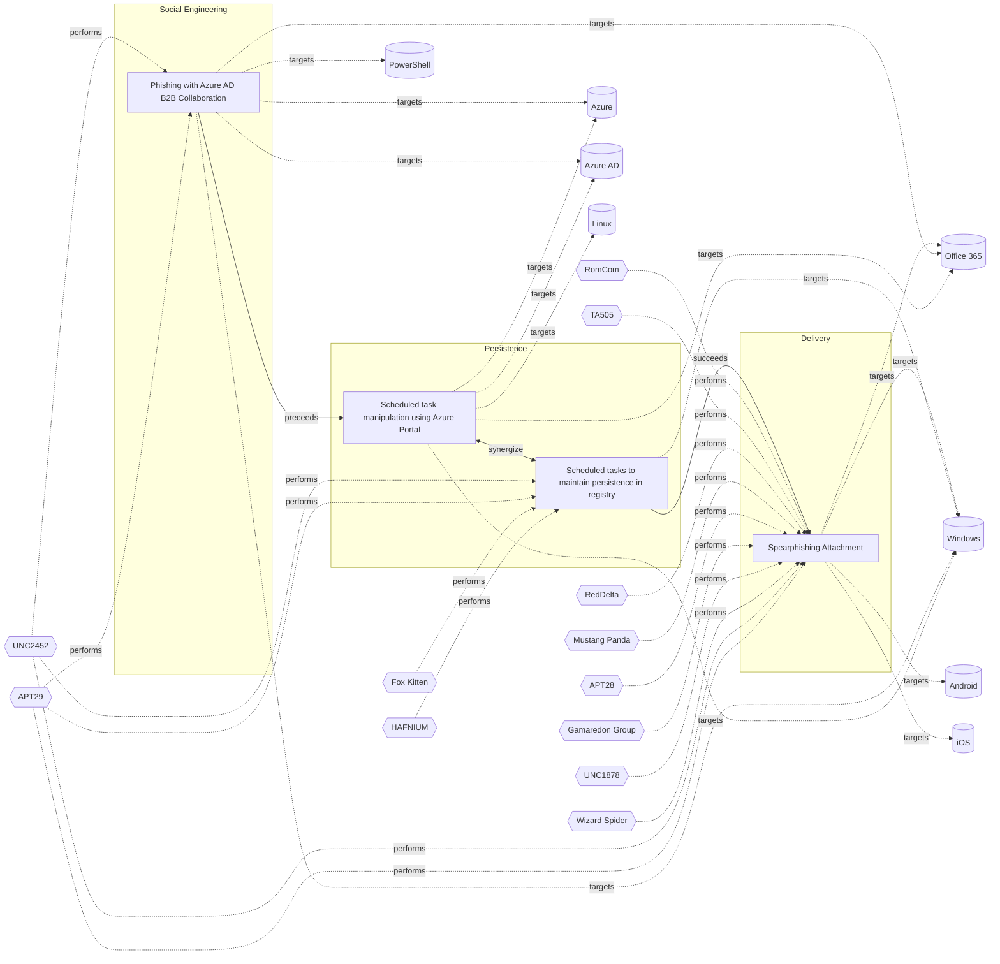

# ☣️ Phishing with Azure AD B2B Collaboration

🔥 **Criticality:High** ⚠️ : A High priority incident is likely to result in a demonstrable impact to public health or safety, national security, economic security, foreign relations, civil liberties, or public confidence. 

🚦 **TLP:CLEAR** ⚪ : Recipients can spread this to the world, there is no limit on disclosure.

🗡️ **ATT&CK Techniques** [T1566 : Phishing](https://attack.mitre.org/techniques/T1566 'Adversaries may send phishing messages to gain access to victim systems All forms of phishing are electronically delivered social engineering Phishing')

---

`🔑 UUID : f9a6f927-d08c-40c1-85af-01331c471def` **|** `🏷️ Version : 2` **|** `🗓️ Creation Date : 2023-12-12` **|** `🗓️ Last Modification : 2025-10-01` **|** `Sharing Organisation : {'uuid': '56b0a0f0-b0bc-47d9-bb46-02f80ae2065a', 'name': 'EC DIGIT CSOC'}` **|** `🧱 Schema Identifier : tvm::2.0`

## 👁️ Description

> Phishing with Azure AD B2B Collaboration involves exploiting the service to send 
> malicious invitations that appear to come from Microsoft or other third-parties,
> making it difficult for the user to detect that it is not legitimate.
> Here are the key points:
> 
> ### Malicious Invitations 
> Adversaries can create a free trial for Azure AD Premium and set up an Enterprise App 
> with single sign-on (SSO) through a user-defined URL, which can be the adversary 
> own website. This app can then be assigned to new users, allowing the adversaries to 
> insert phishing recipients[1].
> 
> ### Email Elements
> The invitation email typically includes a warning about phishing, but the email 
> itself appears legitimate. It is sent from a Microsoft address and includes a link 
> to a landing page that may redirect users to the adversary site. The email may 
> also include the inviter name and profile image for added credibility[3].
> 
> ### Authentication Flow 
> When a user accepts the invitation, they are redirected to the adversary site, 
> may look like a legitimate Microsoft page. This can be achieved by creating an 
> outdated OneDrive logo or using a well-known brand name in the Entra ID organization[1].
> 
> ### Technical Details 
> The phishing campaign can be set up using PowerShell commands to manage Azure AD 
> and MSOnline modules. The adversaries can also use the Create invitation API to 
> customize the invitation message and ensure it appears legitimate[2][4].
> 

## 🖥️ Terrain 

 > Adversaries need administrative privileges or access to an existing Azure AD Premium account, or to create a new free trial account. After this, the capability to set up an Enterprise App with single sign-on through a user-defined URL, which can be their own website to deceive the user.

---

## 🕸️ Relations

### 🐲 Actors sightings 

| Actor              | Description                                                                                                                                                                                                                                                                                                                                                                                                                                                                                                                                                                                                                                                                                                                                                                                                                                                                                                                                                                                                                                                                                                                                                                                                                                                                                                                                                                                                                                                                                  | Aliases                                                                                                                                                            | Source                     | Sighting               | Reference                |
|:-------------------|:---------------------------------------------------------------------------------------------------------------------------------------------------------------------------------------------------------------------------------------------------------------------------------------------------------------------------------------------------------------------------------------------------------------------------------------------------------------------------------------------------------------------------------------------------------------------------------------------------------------------------------------------------------------------------------------------------------------------------------------------------------------------------------------------------------------------------------------------------------------------------------------------------------------------------------------------------------------------------------------------------------------------------------------------------------------------------------------------------------------------------------------------------------------------------------------------------------------------------------------------------------------------------------------------------------------------------------------------------------------------------------------------------------------------------------------------------------------------------------------------|:-------------------------------------------------------------------------------------------------------------------------------------------------------------------|:---------------------------|:-----------------------|:-------------------------|
| [Enterprise] APT29 | [APT29](https://attack.mitre.org/groups/G0016) is threat group that has been attributed to Russia's Foreign Intelligence Service (SVR).(Citation: White House Imposing Costs RU Gov April 2021)(Citation: UK Gov Malign RIS Activity April 2021) They have operated since at least 2008, often targeting government networks in Europe and NATO member countries, research institutes, and think tanks. [APT29](https://attack.mitre.org/groups/G0016) reportedly compromised the Democratic National Committee starting in the summer of 2015.(Citation: F-Secure The Dukes)(Citation: GRIZZLY STEPPE JAR)(Citation: Crowdstrike DNC June 2016)(Citation: UK Gov UK Exposes Russia SolarWinds April 2021)In April 2021, the US and UK governments attributed the [SolarWinds Compromise](https://attack.mitre.org/campaigns/C0024) to the SVR; public statements included citations to [APT29](https://attack.mitre.org/groups/G0016), Cozy Bear, and The Dukes.(Citation: NSA Joint Advisory SVR SolarWinds April 2021)(Citation: UK NSCS Russia SolarWinds April 2021) Industry reporting also referred to the actors involved in this campaign as UNC2452, NOBELIUM, StellarParticle, Dark Halo, and SolarStorm.(Citation: FireEye SUNBURST Backdoor December 2020)(Citation: MSTIC NOBELIUM Mar 2021)(Citation: CrowdStrike SUNSPOT Implant January 2021)(Citation: Volexity SolarWinds)(Citation: Cybersecurity Advisory SVR TTP May 2021)(Citation: Unit 42 SolarStorm December 2020) | Blue Kitsune, Cozy Bear, CozyDuke, Dark Halo, IRON HEMLOCK, IRON RITUAL, Midnight Blizzard, NOBELIUM, NobleBaron, SolarStorm, The Dukes, UNC2452, UNC3524, YTTRIUM | 🗡️ MITRE ATT&CK Groups     | No documented sighting | No documented references |
| UNC2452            | Reporting regarding activity related to the SolarWinds supply chain injection has grown quickly since initial disclosure on 13 December 2020. A significant amount of press reporting has focused on the identification of the actor(s) involved, victim organizations, possible campaign timeline, and potential impact. The US Government and cyber community have also provided detailed information on how the campaign was likely conducted and some of the malware used.  MITRE’s ATT&CK team — with the assistance of contributors — has been mapping techniques used by the actor group, referred to as UNC2452/Dark Halo by FireEye and Volexity respectively, as well as SUNBURST and TEARDROP malware.                                                                                                                                                                                                                                                                                                                                                                                                                                                                                                                                                                                                                                                                                                                                                                            | DarkHalo, StellarParticle, NOBELIUM, Solar Phoenix, Midnight Blizzard                                                                                              | 🌌 MISP Threat Actor Galaxy | No documented sighting | No documented references |

### 🌊 OpenTide Objects
🚫 No related OpenTide objects indexed.

 --- 

### ⛓️ Threat Chaining

Expand chaining data

| ☣️ Vector                                                                                                                                                                                                                                                                                                      | ⛓️ Link              | 🎯 Target                                                                                                                                                                                                                                                                                                       | ⛰️ Terrain                                                                                                                                                                                                                                                                                                                                                                                                                                                                                                                                                                                                                                                                                                                                                                                                                                                | 🗡️ ATT&CK                                                                                                                                                                                                                                                                                                                                                                                                                                                                               |
|:---------------------------------------------------------------------------------------------------------------------------------------------------------------------------------------------------------------------------------------------------------------------------------------------------------------|:---------------------|:---------------------------------------------------------------------------------------------------------------------------------------------------------------------------------------------------------------------------------------------------------------------------------------------------------------|:----------------------------------------------------------------------------------------------------------------------------------------------------------------------------------------------------------------------------------------------------------------------------------------------------------------------------------------------------------------------------------------------------------------------------------------------------------------------------------------------------------------------------------------------------------------------------------------------------------------------------------------------------------------------------------------------------------------------------------------------------------------------------------------------------------------------------------------------------------|:----------------------------------------------------------------------------------------------------------------------------------------------------------------------------------------------------------------------------------------------------------------------------------------------------------------------------------------------------------------------------------------------------------------------------------------------------------------------------------------|
| [Scheduled task manipulation using Azure Portal](../Threat%20Vectors/☣️%20Scheduled%20task%20manipulation%20using%20Azure%20Portal.md 'Scheduled tasks in Azure, often called WebJobs or Azure Functions with timer triggers, are automated processes set to run at specific times or interva...')             | `sequence::preceeds` | [Phishing with Azure AD B2B Collaboration](../Threat%20Vectors/☣️%20Phishing%20with%20Azure%20AD%20B2B%20Collaboration.md 'Phishing with Azure AD B2B Collaboration involves exploiting the service to send malicious invitations that appear to come from Microsoft or other thi...')                         | Adversaries need administrative privileges or access to an existing Azure AD Premium account, or to create a new free trial account. After this, the capability to set up an Enterprise App with single sign-on through a user-defined URL, which can be their own website to deceive the user.                                                                                                                                                                                                                                                                                                                                                                                                                                                                                                                                                           | [T1566 : Phishing](https://attack.mitre.org/techniques/T1566 'Adversaries may send phishing messages to gain access to victim systems All forms of phishing are electronically delivered social engineering Phishing')                                                                                                                                                                                                                                                                  |
| [Scheduled task manipulation using Azure Portal](../Threat%20Vectors/☣️%20Scheduled%20task%20manipulation%20using%20Azure%20Portal.md 'Scheduled tasks in Azure, often called WebJobs or Azure Functions with timer triggers, are automated processes set to run at specific times or interva...')             | `support::synergize` | [Scheduled tasks to maintain persistence in registry](../Threat%20Vectors/☣️%20Scheduled%20tasks%20to%20maintain%20persistence%20in%20registry.md 'A threat actor can successfully maintain persistence on a compromised system by using scheduled tasks to create or edit registry entriesWindows Schedu...') | An adversary has gained control over a Windows endpoint and has privileges  to create scheduled tasks in order to maintain persistence in the registry.                                                                                                                                                                                                                                                                                                                                                                                                                                                                                                                                                                                                                                                                                                   | [T1053.005 : Scheduled Task/Job: Scheduled Task](https://attack.mitre.org/techniques/T1053/005 'Adversaries may abuse the Windows Task Scheduler to perform task scheduling for initial or recurring execution of malicious code There are multiple wa'), [T1112 : Modify Registry](https://attack.mitre.org/techniques/T1112 'Adversaries may interact with the Windows Registry as part of a variety of other techniques to aid in defense evasion, persistence, and executionAcces') |
| [Scheduled tasks to maintain persistence in registry](../Threat%20Vectors/☣️%20Scheduled%20tasks%20to%20maintain%20persistence%20in%20registry.md 'A threat actor can successfully maintain persistence on a compromised system by using scheduled tasks to create or edit registry entriesWindows Schedu...') | `sequence::succeeds` | [Spearphishing Attachment](../Threat%20Vectors/☣️%20Spearphishing%20Attachment.md 'Spearphishing messages are often crafted using pernicious social engineeringtechniquesIn Spearphishing Attachment attacks, recipients receive emails t...')                                                                 | Spear phishing requires more preparation and time to achieve success  than a phishing attack. That is because spear-phishing attackers attempt to obtain vast amounts of personal information about their victims.   Attackers can get the personal information they need using different ways:   - to compromise an email or messaging system trough other means, - to use OSINT, sourcing Social Media or glean personal information from the user's online presence. They want to craft emails that look as legitimate and attractive as possible  to increase the chances of fooling their targets, for instance sending a malicious  attachment where the filename references a topic the recipient is interested in. The highly personalized nature of spear-phishing attacks makes it more  difficult to identity than widescale phishing attacks. | [T1566.001 : Phishing: Spearphishing Attachment](https://attack.mitre.org/techniques/T1566/001 'Adversaries may send spearphishing emails with a malicious attachment in an attempt to gain access to victim systems Spearphishing attachment is a spe')                                                                                                                                                                                                                                |

&nbsp; 

---

## Model Data

#### **⛓️ Cyber Kill Chain**

 > Cyber attacks are typically phased progressions towards strategic objectives. The Unified Kill Chains provides insight into the tactics that hackers employ to attain these objectives. This provides a solid basis to develop (or realign) defensive strategies to raise cyber resilience.

 [`🪝 Social Engineering`](https://www.unifiedkillchain.com/assets/The-Unified-Kill-Chain.pdf) : Techniques aimed at the manipulation of people to perform unsafe actions.

---

#### **🛰️ Domains**

 > Infrastructure technologies domain of interest to attackers.

  - `☁️ Public Cloud` : Infrastructure handled by a commercial cloud provider. Managed mostly on a service level, and connected over the internet.
 - `☁️ Private Cloud` : Infrastructure hosted at a third party, but based on custom specification and managed on a platform level.
 - `🏢 Enterprise` : Generic databases, applications, machines and systems that are usually on premises or on Cloud traditional VMs.
 - `🕸️ SaaS` : Subscription based access to software.

---

#### **🎯 Targets**

 > Granular delimited technical entities holding a value to the organization, that are targeted by adversaries. They might be also involved in the detection coverage as the target of log collection. Partially inspired by Veris.

  - [`🪪 Personal Information`](http://veriscommunity.net/enums.html#section-asset) : Placeholder
 - [`👤 End-user`](http://veriscommunity.net/enums.html#section-asset) : People - End-user
 - [`🪣 Cloud Storage Accounts`](http://veriscommunity.net/enums.html#section-asset) : Placeholder
 - [`👤 Identity Services`](http://veriscommunity.net/enums.html#section-asset) : Placeholder
 - [`☁️ Cloud Portal`](http://veriscommunity.net/enums.html#section-asset) : Placeholder
 - [`🔑 Server Authentication`](http://veriscommunity.net/enums.html#section-asset) : Server - Authentication
 - [`🕹️ Remote access`](http://veriscommunity.net/enums.html#section-asset) : Server - Remote access

---

#### **💿 Platforms concerned**

 > Actual technologies used by the organization that will be exploited by adversaries during a successful attack, and eventually of relevance for detection. Are named by commercial designation.

  - ` Windows` : Placeholder
 - ` Office 365` : Placeholder
 - ` Azure AD` : Placeholder
 - ` Azure` : Placeholder
 - ` PowerShell` : Placeholder

---

#### **💣 Severity**

 > The severity summarizes the overall danger of incident the vector will provoke, and is to be derived (WIP) from impact, leverage, and difficulty to execute.

 [`⚠️ Significant incident`](https://www.ncsc.gov.uk/news/new-cyber-attack-categorisation-system-improve-uk-response-incidents) : A cyber attack which has a serious impact on a large organisation or on wider / local government, or which poses a considerable risk to central government or (inter)national essential services.

---

#### **🪄 Leverage acquisition**

 > Technical aftermath of the attack from the target perspective, differentiated from impact as it does not consider the value of the consequence, only what increased control the vector execution provides to the adversary.

  - [`👻 Spoofing`](https://owasp.org/www-community/Threat_Modeling_Process#stride) : Threat action aimed at accessing and use of another user’s credentials, such as username and password.
 - [`💀 Infrastructure Compromise`](https://owasp.org/www-community/Threat_Modeling_Process#stride) : The compromised target is likely to be used to further expand the sphere of influence of the attacker and allow more potent vectors to be executed.
 - [`👁️‍🗨️ Information Disclosure`](https://owasp.org/www-community/Threat_Modeling_Process#stride) : Threat action intending to read a file that one was not granted access to, or to read data in transit.
 - [`🔐 New Accounts`](https://owasp.org/www-community/Threat_Modeling_Process#stride) : Ability to create new arbitrary user accounts.

---

#### **💥 Impact**

 > Analysis of the threat vector from the organizational perspective, in non technical term. This aims at putting a clear denomination on what the attacker will actually be able to act upon if the threat vector is realized.

  - [`🔓 Data Breach`](http://veriscommunity.net/enums.html#section-impact) : Non-public information has been accessed from the outside, and successfully extracted.
 - [`🧠 IP Loss`](http://veriscommunity.net/enums.html#section-impact) : Particular, key data, information and blueprint conducive to the organization capability to gain and retain a commercial or geopolitical advantage has been accessed, and their content potentially used by competitors or other adversaries.
 - [`🌍 Reputational Damages`](http://veriscommunity.net/enums.html#section-impact) : Damages to the organization public view may be achieved by using directly the access gained, or indirectly with data gathered.
 - [`🥸 Identity Theft`](http://veriscommunity.net/enums.html#section-impact) : Acquisition of sufficient information and privileges to profess as a given individual, for the purpose of abusing and deceiving human trust relationships.
 - [`📉 Competitive disadvantage`](http://veriscommunity.net/enums.html#section-impact) : Loss of competitive advantage
 - [`🛑 Business disruption`](http://veriscommunity.net/enums.html#section-impact) : Business disruption
 - [`🤬 Lose Capabilities`](http://veriscommunity.net/enums.html#section-impact) : Vector execution will remove key functions to the organization, which will not be easily circumvented. Most day-to-day is heavily impaired, but processes can reorganize at a loss.

---

#### **🎲 Vector Viability**

 > Described with estimative language (likelyhood probability), describes how likely the analyst believes the vector to actually be realized on the organization infrastructure. Estimative language describes quality and credibility of underlying sources, data, and methodologies based Intelligence Community Directive 203 (ICD 203) and JP 2-0, Joint Intelligence.

 [`🧐 Likely`](https://www.dni.gov/files/documents/ICD/ICD%20203%20Analytic%20Standards.pdf) : Probable (probably) - 55-80%

---

### 🔗 References

**🕊️ Publicly available resources**

- [_1_] https://securepractice.co/blog/phishing-with-azure-ad-b2b-collaboration
- [_2_] https://learn.microsoft.com/en-us/entra/external-id/authentication-conditional-access
- [_3_] https://learn.microsoft.com/en-us/entra/external-id/invitation-email-elements
- [_4_] https://dirkjanm.io/assets/raw/US-22-Mollema-Backdooring-and-hijacking-Azure-AD-accounts_final.pdf

[1]: https://securepractice.co/blog/phishing-with-azure-ad-b2b-collaboration
[2]: https://learn.microsoft.com/en-us/entra/external-id/authentication-conditional-access
[3]: https://learn.microsoft.com/en-us/entra/external-id/invitation-email-elements
[4]: https://dirkjanm.io/assets/raw/US-22-Mollema-Backdooring-and-hijacking-Azure-AD-accounts_final.pdf

---

#### 🏷️ Tags

#-, #-, #-, #
, #
, ##, ##, ##, ##, # , #🏷, #️, # , #T, #a, #g, #s, #
, #

