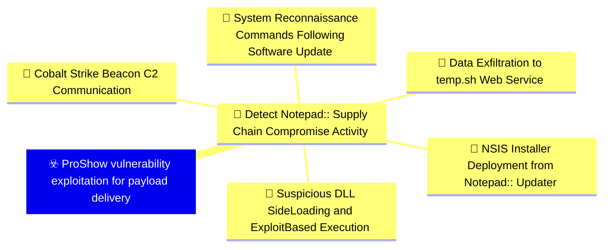
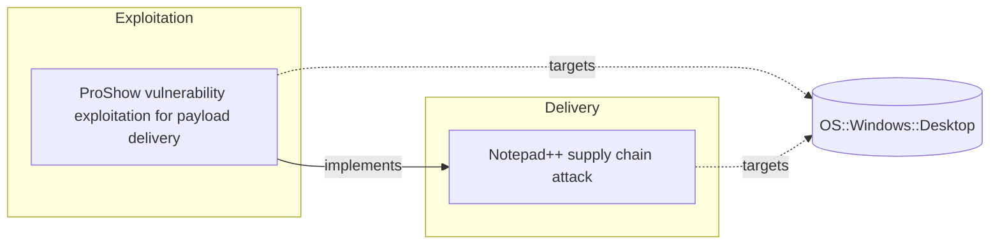

# ☣️ ProShow vulnerability exploitation for payload delivery

🔥 **Criticality:High** ⚠️ : A High priority incident is likely to result in a demonstrable impact to public health or safety, national security, economic security, foreign relations, civil liberties, or public confidence. 

🚦 **TLP:CLEAR** ⚪ : Recipients can spread this to the world, there is no limit on disclosure.


🗡️ **ATT&CK Techniques** [T1203 : Exploitation for Client Execution](https://attack.mitre.org/techniques/T1203 'Adversaries may exploit software vulnerabilities in client applications to execute code Vulnerabilities can exist in software due to unsecure coding p'), [T1055 : Process Injection](https://attack.mitre.org/techniques/T1055 'Adversaries may inject code into processes in order to evade process-based defenses as well as possibly elevate privileges Process injection is a meth'), [T1105 : Ingress Tool Transfer](https://attack.mitre.org/techniques/T1105 'Adversaries may transfer tools or other files from an external system into a compromised environment Tools or files may be copied from an external adv')


---

`🔑 UUID : 23d06aa7-f6d5-44ee-be8f-e6de2f495bd9` **|** `🏷️ Version : 1` **|** `🗓️ Creation Date : 2026-02-09` **|** `🗓️ Last Modification : 2026-02-09` **|** `Sharing Organisation : {'uuid': '56b0a0f0-b0bc-47d9-bb46-02f80ae2065a', 'name': 'EC DIGIT CSOC'}` **|** `🧱 Schema Identifier : tvm::2.1`


## 👁️ Description

> ## Executive Summary
> 
> Threat actors exploited a legacy vulnerability in ProShow software to achieve code 
> execution and deliver malicious payloads. This technique was observed in Chain #1 
> of the Notepad++ supply chain attack (July-August 2025), demonstrating how attackers 
> leverage old, known vulnerabilities to bypass modern security controls while avoiding 
> heavily-monitored techniques like DLL side-loading.
> 
> ## Technical Analysis
> 
> ### Attack Mechanism
> 
> The exploitation leverages ProShow.exe (a legitimate binary) in combination with a 
> specially crafted file named "load" placed in the %appdata%\ProShow directory. The 
> attack flow proceeds as follows:
> 
> 1. **File Deployment**: Malicious installer drops ProShow.exe and supporting files to %appdata%\ProShow\
> 2. **Vulnerability Trigger**: ProShow.exe processes the malicious "load" file
> 3. **Exploit Execution**: The "load" file contains a two-stage shellcode payload
> 4. **Payload Delivery**: Decrypted shellcode executes Metasploit downloader
> 5. **C2 Establishment**: Downloader retrieves Cobalt Strike Beacon from remote infrastructure
> 
> ### File System Artifacts
> 
> Files dropped to %appdata%\ProShow\ directory:
> 
> **Legitimate Component**:
> - ProShow.exe (SHA1: defb05d5a91e4920c9e22de2d81c5dc9b95a9a7c)
> 
> **Supporting Files** (potentially benign):
> - defscr (SHA1: 259cd3542dea998c57f67ffdd4543ab836e3d2a3)
> - if.dnt (SHA1: 46654a7ad6bc809b623c51938954de48e27a5618)
> - proshow.crs (SHA1: da39a3ee5e6b4b0d3255bfef95601890afd80709)
> - proshow.phd (SHA1: da39a3ee5e6b4b0d3255bfef95601890afd80709)
> - proshow_e.bmp (SHA1: 9df6ecc47b192260826c247bf8d40384aa6e6fd6)
> 
> **Malicious Exploit Payload**:
> - load (SHA1: 06a6a5a39193075734a32e0235bde0e979c27228) - Contains exploit shellcode
> 
> ### Exploit Payload Structure
> 
> The "load" file demonstrates sophisticated anti-analysis techniques:
> 
> 1. **Fake Shellcode Header**: Meaningless instructions at the beginning designed to 
>    confuse automated analysis tools and security researchers
> 
> 2. **Real Shellcode Body**: Hidden in the middle of the file, this contains the actual 
>    exploit code that decrypts and executes the Metasploit downloader payload
> 
> 3. **Decryption Routine**: The shellcode includes embedded decryption logic to unpack 
>    the final payload at runtime
> 
> ### Network Communication
> 
> After successful exploitation, the Metasploit downloader retrieves Cobalt Strike Beacon from:
> 
> **Primary Infrastructure**:
> ```
> https://45.77.31[.]210/users/admin
> ```
> 
> **Backup Infrastructure**:
> ```
> https://cdncheck.it[.]com/users/admin
> ```
> 
> **User-Agent String**:
> ```
> Mozilla/5.0 (Windows NT 10.0; Win64; x64) AppleWebKit/537.36 (KHTML, like Gecko) Chrome/138.0.0.0 Safari/537.36
> ```
> 
> ### Command and Control (C2) Infrastructure
> 
> Once Cobalt Strike Beacon is deployed, it establishes C2 communications with:
> 
> **Primary C2 Endpoints**:
> ```
> https://45.77.31[.]210/api/update/v1
> https://45.77.31[.]210/api/FileUpload/submit
> ```
> 
> **Secondary C2 Endpoints**:
> ```
> https://cdncheck.it[.]com/api/update/v1
> https://cdncheck.it[.]com/api/Metadata/submit
> ```
> 
> ## Indicators of Compromise (IOCs)
> 
> ### File Hashes (SHA1)
> 
> ```
> defb05d5a91e4920c9e22de2d81c5dc9b95a9a7c - ProShow.exe (legitimate)
> 259cd3542dea998c57f67ffdd4543ab836e3d2a3 - defscr
> 46654a7ad6bc809b623c51938954de48e27a5618 - if.dnt
> da39a3ee5e6b4b0d3255bfef95601890afd80709 - proshow.crs
> da39a3ee5e6b4b0d3255bfef95601890afd80709 - proshow.phd
> 9df6ecc47b192260826c247bf8d40384aa6e6fd6 - proshow_e.bmp
> 06a6a5a39193075734a32e0235bde0e979c27228 - load (MALICIOUS)
> ```
> 
> ### Network Indicators
> 
> **Malicious IP Addresses**:
> ```
> 45.77.31.210
> ```
> 
> **Malicious Domains**:
> ```
> cdncheck.it[.]com
> ```
> 
> **URLs**:
> ```
> https://45.77.31[.]210/users/admin
> https://cdncheck.it[.]com/users/admin
> https://45.77.31[.]210/api/update/v1
> https://45.77.31[.]210/api/FileUpload/submit
> https://cdncheck.it[.]com/api/update/v1
> https://cdncheck.it[.]com/api/Metadata/submit
> ```
> 
> ### File System Indicators
> 
> **Suspicious Directory Creation**:
> ```
> %appdata%\ProShow\
> ```
> 
> **Suspicious File Presence**:
> ```
> %appdata%\ProShow\ProShow.exe
> %appdata%\ProShow\load
> %appdata%\ProShow\defscr
> %appdata%\ProShow\if.dnt
> %appdata%\ProShow\proshow.crs
> %appdata%\ProShow\proshow.phd
> %appdata%\ProShow\proshow_e.bmp
> ```
> 
> ## Detection Opportunities
> 
> 1. **File System Monitoring**:
>    - Monitor for creation of %appdata%\ProShow\ directory
>    - Alert on presence of "load" file in ProShow directory
>    - Track ProShow.exe execution from non-standard locations
> 
> 2. **Process Execution Monitoring**:
>    - Detect ProShow.exe execution from %appdata% paths
>    - Monitor for unusual child processes spawned by ProShow.exe
>    - Track process injection behaviors following ProShow.exe execution
> 
> 3. **Network Monitoring**:
>    - Block/alert on connections to 45.77.31[.]210
>    - Block/alert on connections to cdncheck.it[.]com
>    - Monitor for Cobalt Strike Beacon C2 patterns
>    - Detect suspicious User-Agent strings with high Chrome version numbers
> 
> 4. **Memory Analysis**:
>    - Scan for shellcode injection patterns in ProShow.exe process memory
>    - Detect decryption routines executing within process space
>    - Identify Metasploit framework signatures in memory
> 
> 5. **Behavioral Detection**:
>    - Alert on legacy software (ProShow) executing from AppData locations
>    - Detect execution of outdated software versions with known vulnerabilities
>    - Monitor for file read operations on files named "load"
> 
> ## Mitigation Recommendations
> 
> ### Immediate Actions
> 
> 1. **Hunt for ProShow Components**:
>    - Search all endpoints for %appdata%\ProShow\ directories
>    - Identify and analyze any "load" files discovered
>    - Check for ProShow.exe execution in non-standard locations
> 
> 2. **Block Network Infrastructure**:
>    - Block outbound connections to 45.77.31[.]210
>    - Block outbound connections to cdncheck.it[.]com
>    - Implement DNS sinkholing for malicious domains
> 
> 3. **Isolate Compromised Systems**:
>    - Quarantine any systems with ProShow artifacts in %appdata%
>    - Perform full incident response procedures on affected hosts
>    - Collect forensic images before remediation
> 
> ### Long-term Measures
> 
> 1. **Software Inventory and Vulnerability Management**:
>    - Maintain comprehensive inventory of installed applications
>    - Identify and remove legacy software with known vulnerabilities
>    - Implement policy to prevent installation of outdated software versions
>    - Regular vulnerability scanning for legacy application components
> 
> 2. **Application Control**:
>    - Implement application whitelisting to prevent execution of unauthorized binaries
>    - Restrict execution from %appdata% and other user-writable locations
>    - Deploy AppLocker or similar technologies to control executable paths
> 
> 3. **Endpoint Detection and Response (EDR)**:
>    - Deploy EDR solutions capable of detecting memory injection and shellcode execution
>    - Enable behavioral monitoring for exploitation attempts
>    - Implement Cobalt Strike detection signatures
> 
> 4. **Network Security Controls**:
>    - Deploy SSL/TLS inspection to detect malicious payloads in encrypted traffic
>    - Implement threat intelligence feeds for known C2 infrastructure
>    - Enable anomaly detection for unusual network behaviors
> 
> 5. **Security Awareness**:
>    - Educate users on risks of installing or retaining legacy software
>    - Train security teams on exploitation techniques using legitimate binaries
>    - Develop playbooks for responding to exploitation attempts
> 
> ## MITRE ATT&CK Mapping
> 
> ### T1203 - Exploitation for Client Execution
> The attacker exploits a vulnerability in ProShow software to execute arbitrary code. 
> The "load" file contains exploit shellcode that triggers the vulnerability when 
> processed by the legitimate ProShow.exe binary, achieving initial code execution 
> without requiring user interaction beyond the initial installer execution.
> 
> ### T1055 - Process Injection
> Following successful exploitation, the shellcode in the "load" file injects malicious 
> code into the ProShow.exe process space. This process injection allows the attacker 
> to execute the Metasploit downloader payload within the context of a legitimate process, 
> evading detection mechanisms that focus on standalone malicious executables.
> 
> ### T1105 - Ingress Tool Transfer
> After establishing initial code execution, the Metasploit downloader retrieves the 
> Cobalt Strike Beacon payload from remote infrastructure (45.77.31[.]210 and 
> cdncheck.it[.]com). This demonstrates the ingress tool transfer technique where 
> attackers download additional tools and payloads to the compromised system to 
> enable further malicious activities.
> 
> ## Threat Actor Tradecraft Analysis
> 
> ### Sophistication Indicators
> 
> 1. **Exploitation of Legacy Vulnerability**:
>    - Demonstrates knowledge of old, less-monitored vulnerabilities
>    - Avoids heavily-scrutinized techniques like DLL side-loading
>    - Shows attacker adaptation to evolving defensive capabilities
> 
> 2. **Anti-Analysis Techniques**:
>    - Fake shellcode header to confuse automated analysis tools
>    - Multi-stage payload decryption to hinder static analysis
>    - Use of legitimate binary (ProShow.exe) to blend with normal activity
> 
> 3. **Infrastructure Design**:
>    - Multiple C2 servers for redundancy
>    - Use of domains mimicking legitimate services (cdncheck, etc.)
>    - Separated infrastructure for payload delivery vs. C2 operations
> 
> 4. **Commercial-Grade Post-Exploitation**:
>    - Use of Metasploit framework for payload staging
>    - Deployment of Cobalt Strike Beacon for persistent access
>    - Professional-grade tooling suggests well-resourced threat actor
> 
> ## Risk Assessment
> 
> **Likelihood**: Medium
> - Requires presence of ProShow software or components
> - Exploitation relies on delivery mechanism (supply chain in observed case)
> - Technique demonstrated in real-world attack
> 
> **Impact**: High
> - Enables arbitrary code execution
> - Facilitates deployment of sophisticated post-exploitation frameworks
> - Provides platform for lateral movement and data exfiltration
> - Difficult to detect using traditional signature-based methods
> 
> **Overall Risk**: High
> - Confirmed exploitation in targeted supply chain attack
> - Affects organizations with legacy software installations
> - Requires enhanced detection and response capabilities
> 
> ## References
> 
> - Kaspersky Securelist: "Notepad++ Supply Chain Attack" - Chain #1 Analysis (February 2026)
> - Rapid7 Research: "ProShow Exploitation in Notepad++ Supply Chain Compromise" (February 2026)
> 
> ## Conclusion
> 
> The ProShow vulnerability exploitation technique demonstrates that threat actors continue 
> to leverage legacy vulnerabilities to achieve their objectives, particularly when more 
> commonly-monitored techniques face increased detection. Organizations must maintain 
> comprehensive software inventories, remove or isolate legacy applications, and implement 
> behavioral detection capabilities to identify exploitation attempts even when using 
> legitimate software components.
> 
> The successful use of this technique in a sophisticated supply chain attack underscores 
> the importance of defense-in-depth strategies that don't rely solely on signature-based 
> detection or assumption about attacker tool choices.
> 


## 🖥️ Terrain 

 > Windows workstations and developer environments where ProShow software is installed 
> or where legacy ProShow components remain present. The vulnerability in ProShow, 
> dating back to the early 2010s, creates an exploitable attack surface when combined 
> with specially crafted malicious files. This technique particularly affects systems 
> with outdated or unmaintained software installations where security patches may not 
> have been applied.
> 

---

## 🕸️ Relations


### 🌊 OpenTide Objects




 **Descendants** 

| 🎯 Detection Objectives                                                                                                                                                                                                                                                                                        | 📡 Detection Objective Signals (5)                                                                                                                                                                                                                                                                                                                                                                                                                                                                                                                                                                                                                                                                                                                                                                                                                                                                                                                                                                                                                                                                                                                                                                                                                                                                                                                                                                                                                                                                                                                                                                                                                                                                                                                                                                                                                                                                                                  | 🛡️ Detection Models    | 🚨 Detection Rules    |
|:--------------------------------------------------------------------------------------------------------------------------------------------------------------------------------------------------------------------------------------------------------------------------------------------------------------|:-----------------------------------------------------------------------------------------------------------------------------------------------------------------------------------------------------------------------------------------------------------------------------------------------------------------------------------------------------------------------------------------------------------------------------------------------------------------------------------------------------------------------------------------------------------------------------------------------------------------------------------------------------------------------------------------------------------------------------------------------------------------------------------------------------------------------------------------------------------------------------------------------------------------------------------------------------------------------------------------------------------------------------------------------------------------------------------------------------------------------------------------------------------------------------------------------------------------------------------------------------------------------------------------------------------------------------------------------------------------------------------------------------------------------------------------------------------------------------------------------------------------------------------------------------------------------------------------------------------------------------------------------------------------------------------------------------------------------------------------------------------------------------------------------------------------------------------------------------------------------------------------------------------------------------------|:-----------------------|:---------------------|
| [Detect Notepad++ Supply Chain Compromise Activity](../Detection%20Objectives/🎯%20Detect%20Notepad++%20Supply%20Chain%20Compromise%20Activity.md 'This detection objective addresses the sophisticated supply chain compromiseof Notepad update infrastructure that occurred between July and October 20...') | [Detect Notepad++ Supply Chain Compromise Activity::System Reconnaissance Commands Following Software Update](Detect%20Notepad++%20Supply%20Chain%20Compromise%20Activity#system-reconnaissance-commands-following-software-update.md 'Detects sequences of system reconnaissance commands characteristic of theNotepad supply chain attack discovery phase Attackers executed combinationsof...')<br>[Detect Notepad++ Supply Chain Compromise Activity::Suspicious DLL Side-Loading and Exploit-Based Execution](Detect%20Notepad++%20Supply%20Chain%20Compromise%20Activity#suspicious-dll-side-loading-and-exploit-based-execution.md 'Detects malicious execution via legitimate software abuse, including DLLside-loading and exploitation of vulnerable legitimate executables TheNotepad ...')<br>[Detect Notepad++ Supply Chain Compromise Activity::Data Exfiltration to temp.sh Web Service](Detect%20Notepad++%20Supply%20Chain%20Compromise%20Activity#data-exfiltration-to-temp.sh-web-service.md 'Detects data exfiltration to the tempsh temporary file sharing service,used by attackers to stage reconnaissance data and avoid direct C2 communicatio...')<br>[Detect Notepad++ Supply Chain Compromise Activity::NSIS Installer Deployment from Notepad++ Updater](Detect%20Notepad++%20Supply%20Chain%20Compromise%20Activity#nsis-installer-deployment-from-notepad++-updater.md 'Detects the execution of NSIS Nullsoft Scriptable Install System installerslaunched by GUPexe, the legitimate Notepad update component The maliciousup...')<br>[Detect Notepad++ Supply Chain Compromise Activity::Cobalt Strike Beacon C2 Communication](Detect%20Notepad++%20Supply%20Chain%20Compromise%20Activity#cobalt-strike-beacon-c2-communication.md 'Detects network communication to known Cobalt Strike C2 infrastructureassociated with the Notepad supply chain campaign All observed infectionchains u...') | ❌ No Detection Models  | ❌ No Detection Rules |


 --- 

### ⛓️ Threat Chaining




<details>
<summary>Expand chaining data</summary>

| ☣️ Vector                                                                                                                                                                                                                                                                                                            | ⛓️ Link                 | 🎯 Target                                                                                                                                                                                                                                                     | ⛰️ Terrain                                                                                                                                                                                                                                                                                                                                                                                                    | 🗡️ ATT&CK                                                                                                                                                                                                                                                                                                                                                                                                                                                                                                                                                                                                                                                                                                                                                                                                                                                                                                                                                                                                       |
|:---------------------------------------------------------------------------------------------------------------------------------------------------------------------------------------------------------------------------------------------------------------------------------------------------------------------|:------------------------|:-------------------------------------------------------------------------------------------------------------------------------------------------------------------------------------------------------------------------------------------------------------|:--------------------------------------------------------------------------------------------------------------------------------------------------------------------------------------------------------------------------------------------------------------------------------------------------------------------------------------------------------------------------------------------------------------|:----------------------------------------------------------------------------------------------------------------------------------------------------------------------------------------------------------------------------------------------------------------------------------------------------------------------------------------------------------------------------------------------------------------------------------------------------------------------------------------------------------------------------------------------------------------------------------------------------------------------------------------------------------------------------------------------------------------------------------------------------------------------------------------------------------------------------------------------------------------------------------------------------------------------------------------------------------------------------------------------------------------|
| [ProShow vulnerability exploitation for payload delivery](../Threat%20Vectors/☣️%20ProShow%20vulnerability%20exploitation%20for%20payload%20delivery.md '## Executive SummaryThreat actors exploited a legacy vulnerability in ProShow software to achieve code execution and deliver malicious payloads This t...') | `atomicity::implements` | [Notepad++ supply chain attack](../Threat%20Vectors/☣️%20Notepad++%20supply%20chain%20attack.md '## Executive SummaryOn February 2, 2026, Notepad developers disclosed a critical supply chain compromise affecting their update infrastructure The att...') | Organizations and individuals using Notepad++ text editor on Windows systems,  particularly those with automatic update mechanisms enabled. The attack targeted  the legitimate update infrastructure, delivering malicious payloads disguised  as authentic software updates. Victims were distributed globally across multiple  sectors including government, financial services, and IT service providers. | [T1195.002 : Supply Chain Compromise: Compromise Software Supply Chain](https://attack.mitre.org/techniques/T1195/002 'Adversaries may manipulate application software prior to receipt by a final consumer for the purpose of data or system compromise Supply chain comprom'), [T1071 : Application Layer Protocol](https://attack.mitre.org/techniques/T1071 'Adversaries may communicate using OSI application layer protocols to avoid detectionnetwork filtering by blending in with existing traffic Commands to'), [T1059 : Command and Scripting Interpreter](https://attack.mitre.org/techniques/T1059 'Adversaries may abuse command and script interpreters to execute commands, scripts, or binaries These interfaces and languages provide ways of interac'), [T1574 : Hijack Execution Flow](https://attack.mitre.org/techniques/T1574 'Adversaries may execute their own malicious payloads by hijacking the way operating systems run programs Hijacking execution flow can be for the purpo') |

</details>
&nbsp; 


---

## Model Data

#### **⛓️ Cyber Kill Chain**

 > Cyber attacks are typically phased progressions towards strategic objectives. The Unified Kill Chains provides insight into the tactics that hackers employ to attain these objectives. This provides a solid basis to develop (or realign) defensive strategies to raise cyber resilience.

 [`💥 Exploitation`](https://www.unifiedkillchain.com/assets/The-Unified-Kill-Chain.pdf) : Techniques to exploit vulnerabilities in systems that may, amongst others, result in code execution.

---

#### **💣 Severity**

 > The severity summarizes the overall danger of incident the vector will provoke, and is to be derived (WIP) from impact, leverage, and difficulty to execute.

 [`⚠️ Significant incident`](https://www.ncsc.gov.uk/news/new-cyber-attack-categorisation-system-improve-uk-response-incidents) : A cyber attack which has a serious impact on a large organisation or on wider / local government, or which poses a considerable risk to central government or (inter)national essential services.

---

#### **🪄 Leverage acquisition**

 > Technical aftermath of the attack from the target perspective, differentiated from impact as it does not consider the value of the consequence, only what increased control the vector execution provides to the adversary.

  - [`💅 Elevation of privilege`](https://owasp.org/www-community/Threat_Modeling_Process#stride) : Capacity to augment leverage over the target system by upgrading the compromised access rights
 - [`🐒 Tampering`](https://owasp.org/www-community/Threat_Modeling_Process#stride) : Threat action intending to maliciously change or modify persistent data, such as records in a database, and the alteration of data in transit between two computers over an open network, such as the Internet.
 - [`📦 Software installation`](https://owasp.org/www-community/Threat_Modeling_Process#stride) : Software installation or code modification

---

#### **💥 Impact**

 > Analysis of the threat vector from the organizational perspective, in non technical term. This aims at putting a clear denomination on what the attacker will actually be able to act upon if the threat vector is realized.

  - [`🤬 Lose Capabilities`](http://veriscommunity.net/enums.html#section-impact) : Vector execution will remove key functions to the organization, which will not be easily circumvented. Most day-to-day is heavily impaired, but processes can reorganize at a loss.
 - [`🩼 Impairement`](http://veriscommunity.net/enums.html#section-impact) : Incapacitation of a particular key system that will cause disruptions in day-to-day operations, and eventually service delivery.
 - [`🛑 Business disruption`](http://veriscommunity.net/enums.html#section-impact) : Business disruption
 - [`🔓 Data Breach`](http://veriscommunity.net/enums.html#section-impact) : Non-public information has been accessed from the outside, and successfully extracted.

---

#### **🎲 Vector Viability**

 > Described with estimative language (likelyhood probability), describes how likely the analyst believes the vector to actually be realized on the organization infrastructure. Estimative language describes quality and credibility of underlying sources, data, and methodologies based Intelligence Community Directive 203 (ICD 203) and JP 2-0, Joint Intelligence.

 [`😱 Almost certain`](https://www.dni.gov/files/documents/ICD/ICD%20203%20Analytic%20Standards.pdf) : Nearly certain - 95-99%

---


## 🌐 Threat Surface

- ` OS::Windows::Desktop` — Microsoft Windows desktop editions


### 🔗 References


**🕊️ Publicly available resources**

- [_1_] https://securelist.com/notepad-supply-chain-attack/115382/
- [_2_] https://www.rapid7.com/blog/post/2026/02/03/notepad-plus-plus-supply-chain-compromise/

[1]: https://securelist.com/notepad-supply-chain-attack/115382/
[2]: https://www.rapid7.com/blog/post/2026/02/03/notepad-plus-plus-supply-chain-compromise/

---

#### 🏷️ Tags

#-, #-, #-, #
, #
, ##, ##, ##, ##, # , #🏷, #️, # , #T, #a, #g, #s, #
, #


