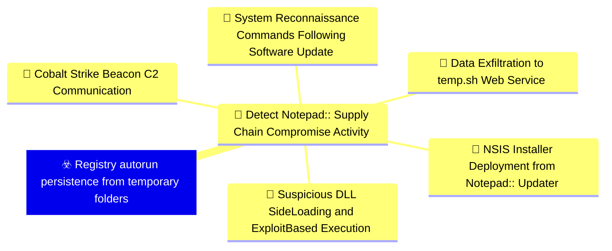
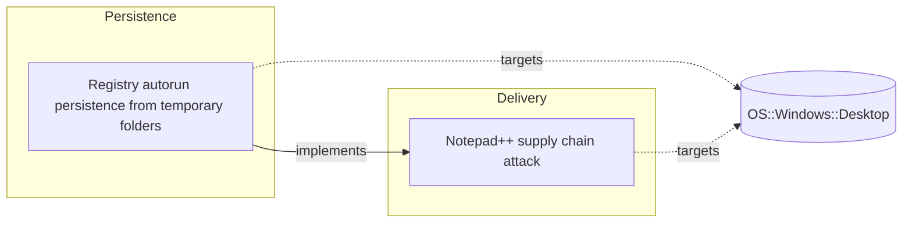

# ☣️ Registry autorun persistence from temporary folders

🔥 **Criticality:High** ⚠️ : A High priority incident is likely to result in a demonstrable impact to public health or safety, national security, economic security, foreign relations, civil liberties, or public confidence. 

🚦 **TLP:CLEAR** ⚪ : Recipients can spread this to the world, there is no limit on disclosure.


🗡️ **ATT&CK Techniques** [T1547.001 : Boot or Logon Autostart Execution: Registry Run Keys / Startup Folder](https://attack.mitre.org/techniques/T1547/001 'Adversaries may achieve persistence by adding a program to a startup folder or referencing it with a Registry run key Adding an entry to the run keys ')


---

`🔑 UUID : 55eaa437-5a25-4c29-b1fc-9c0fba4a18ad` **|** `🏷️ Version : 1` **|** `🗓️ Creation Date : 2026-02-09` **|** `🗓️ Last Modification : 2026-02-09` **|** `Sharing Organisation : {'uuid': '56b0a0f0-b0bc-47d9-bb46-02f80ae2065a', 'name': 'EC DIGIT CSOC'}` **|** `🧱 Schema Identifier : tvm::2.1`


## 👁️ Description

> ## Overview
> 
> This threat vector describes a Windows persistence technique that combines two
> suspicious behaviors: dropping malicious executables into temporary/roaming 
> application data folders (%appdata%) and establishing persistence through the
> Windows registry autorun mechanism via Run keys. This technique ensures that
> malicious programs start automatically when a user logs in, allowing attackers
> to maintain access across system reboots.
> 
> ## Attack Mechanism
> 
> The persistence technique follows a multi-step pattern:
> 
> 1. **Payload Deployment**: Malicious files are dropped to unusual locations 
>    within the user's application data directories, typically:
>    - `%appdata%\ProShow\`
>    - `%appdata%\Adobe\Scripts\`
>    - `%appdata%\Bluetooth\`
>    
> 2. **Registry Modification**: The attacker adds entries to the Windows Registry
>    Run key at:
>    - `HKEY_CURRENT_USER\SOFTWARE\Microsoft\Windows\CurrentVersion\Run`
>    
> 3. **Persistence Establishment**: The registry entries point directly to the
>    malicious executables in the temporary/appdata locations, ensuring automatic
>    execution at user logon.
> 
> ## Why This Pattern is Suspicious
> 
> According to Kaspersky security researchers, "In this case, a clear sign of 
> malicious activity is gaining persistence through the autorun mechanism via the 
> Windows registry, specifically the Run key, which ensures that programs start 
> automatically when the user logs in."
> 
> The combination of these behaviors is particularly suspicious because:
> 
> - **Legitimate software rarely uses %appdata% for persistence**: Well-designed
>   applications typically install to Program Files and use proper installer mechanisms
> - **Temporary folders indicate ephemeral content**: %appdata% subdirectories are
>   generally used for user-specific configuration data, not executable programs
> - **Run key pointing to temporary locations**: Legitimate autostart entries
>   typically reference stable installation paths in system directories
> 
> ## Detection Approach: temporary_folder_in_registry_autorun
> 
> Kaspersky KEDR Expert detection system identifies this activity through the
> `temporary_folder_in_registry_autorun` rule, which specifically looks for:
> 
> 1. Registry autorun entries (Run keys) being created or modified
> 2. The target path of these entries pointing to:
>    - %appdata% subdirectories
>    - Roaming profile directories
>    - Other temporary/cache locations
> 3. Executable files residing in these non-standard locations
> 
> ### Detection Logic
> 
> The detection rule triggers when:
> - A new registry value is created in autorun keys (Run/RunOnce)
> - The value data contains a path to %appdata% or similar temporary directories
> - The referenced file is an executable (PE file, script, or DLL)
> 
> ### Observed Malicious File Paths
> 
> In the Notepad++ supply chain attack, the following suspicious paths were observed:
> 
> ```
> %appdata%\ProShow\load
> %appdata%\Adobe\Scripts\alien.ini
> %appdata%\Bluetooth\BluetoothService
> ```
> 
> These paths exhibit clear indicators of compromise:
> - **ProShow**: Not a legitimate ProShow installation directory
> - **Adobe\Scripts**: Unusual location for Adobe scripting components
> - **Bluetooth**: Mimics legitimate Windows Bluetooth services but resides in user profile
> 
> ## Technical Details
> 
> ### Registry Keys Targeted
> 
> ```
> HKEY_CURRENT_USER\SOFTWARE\Microsoft\Windows\CurrentVersion\Run
> HKEY_CURRENT_USER\SOFTWARE\Microsoft\Windows\CurrentVersion\RunOnce
> ```
> 
> ### Typical Registry Entry Format
> 
> ```
> Name: <Random or legitimate-looking name>
> Type: REG_SZ
> Data: C:\Users\<username>\AppData\Roaming\<subfolder>\<malicious.exe>
> ```
> 
> ### Execution Flow
> 
> 1. User logs into Windows
> 2. Windows reads registry Run keys during logon process
> 3. Windows executes all programs referenced in Run keys
> 4. Malicious payload launches automatically with user privileges
> 5. Malware establishes C2 communication and executes its objectives
> 
> ## Detection Opportunities
> 
> ### File System Monitoring
> 
> Monitor for suspicious file creation patterns:
> - Executable files dropped to %appdata% subdirectories
> - Particularly focus on non-standard subdirectory names (ProShow, Adobe\Scripts, Bluetooth)
> - Files with misleading names mimicking legitimate software
> 
> ### Registry Monitoring
> 
> Monitor registry operations:
> - Creation/modification of values under Run/RunOnce keys
> - Specifically flag entries pointing to %appdata%, %temp%, or %localappdata%
> - Alert on registry changes made by non-installer processes
> 
> ### Behavioral Analysis
> 
> Look for behavioral chains:
> - Network-downloaded file → %appdata% storage → Registry modification
> - Installer execution → Suspicious subdirectory creation → Autorun registration
> - Script execution → Binary deployment → Persistence establishment
> 
> ## MITRE ATT&CK Mapping
> 
> **T1547.001 - Boot or Logon Autostart Execution: Registry Run Keys / Startup Folder**
> 
> This technique directly maps to MITRE ATT&CK's description of persistence through
> registry Run keys. Adversaries achieve persistence by adding programs to startup
> folders or registry Run keys that execute at user logon.
> 
> **Key Characteristics**:
> - **Tactic**: Persistence, Privilege Escalation
> - **Privileges Required**: User (for HKCU keys)
> - **Platforms**: Windows
> - **Data Sources**: Command execution, file monitoring, registry monitoring, Windows registry key modification
> 
> ## Mitigation Recommendations
> 
> ### Detection Rules
> 
> Implement the following detection logic:
> 
> ```
> IF (Registry Key Modified OR Registry Value Created)
> AND (Key Path CONTAINS "CurrentVersion\Run")
> AND (Value Data CONTAINS "%appdata%" OR "%temp%" OR "%localappdata%")
> THEN Alert: "Suspicious autorun persistence from temporary folder"
> ```
> 
> ### Preventive Measures
> 
> 1. **Registry Protection**: Enable registry protection features in EDR/EPP solutions
> 2. **Application Whitelisting**: Restrict execution from %appdata% locations
> 3. **User Education**: Train users to recognize suspicious installer behavior
> 4. **Monitoring**: Deploy the temporary_folder_in_registry_autorun detection rule
> 5. **Group Policy**: Consider restricting Run key modifications via Group Policy
> 
> ### Response Actions
> 
> When this persistence technique is detected:
> 
> 1. **Immediate Containment**:
>    - Isolate affected endpoint from network
>    - Prevent user logon to stop autorun execution
>    - Create forensic disk image for analysis
> 
> 2. **Investigation**:
>    - Examine registry Run keys for suspicious entries
>    - Check %appdata% subdirectories for malicious files
>    - Review parent process that created registry entry
>    - Search for lateral movement indicators
>    - Check for associated C2 network connections
> 
> 3. **Remediation**:
>    - Delete malicious registry entries
>    - Remove malicious files from %appdata% locations
>    - Scan for additional persistence mechanisms
>    - Reset user credentials
>    - Apply security patches and updates
> 
> 4. **Recovery**:
>    - Monitor for re-infection attempts
>    - Verify complete malware removal
>    - Restore normal operations
>    - Update detection rules based on IoCs
> 
> ## Real-World Context: Notepad++ Supply Chain Attack
> 
> This persistence technique was actively exploited in the Notepad++ supply chain
> compromise (June-December 2025), where attackers:
> 
> - Compromised legitimate Notepad++ update infrastructure
> - Delivered malicious NSIS installers disguised as authentic updates
> - Deployed payloads to suspicious %appdata% subdirectories
> - Established persistence via registry Run keys
> - Maintained access across multiple infection chains
> 
> The attack demonstrated sophisticated tradecraft by:
> - Evolving payloads across three distinct infection chains
> - Using legitimate-looking subdirectory names (ProShow, Adobe, Bluetooth)
> - Combining multiple techniques for defense evasion
> - Targeting government, financial, and IT service sectors globally
> 
> ## Indicators of Compromise
> 
> ### Registry IoCs
> 
> Monitor for registry values in Run keys pointing to:
> ```
> *\AppData\Roaming\ProShow\*
> *\AppData\Roaming\Adobe\Scripts\*
> *\AppData\Roaming\Bluetooth\*
> ```
> 
> ### File System IoCs
> 
> Check for suspicious files in:
> ```
> %appdata%\ProShow\load
> %appdata%\Adobe\Scripts\alien.ini
> %appdata%\Bluetooth\BluetoothService
> ```
> 
> ### Process IoCs
> 
> Watch for suspicious parent-child process relationships:
> - NSIS installer → Registry modification process
> - Non-installer process → Registry Run key modification
> - Script interpreter → Executable creation in %appdata%
> 
> ## Conclusion
> 
> Registry autorun persistence from temporary folders represents a high-confidence
> indicator of malicious activity. The combination of autorun registry modifications
> and temporary folder execution is rarely used by legitimate software and should
> trigger immediate investigation. Organizations should implement the 
> temporary_folder_in_registry_autorun detection rule and establish monitoring
> for this specific behavioral pattern.
> 
> This technique's confirmation in the Notepad++ supply chain attack demonstrates
> its active use by sophisticated threat actors and underscores the importance of
> robust detection and response capabilities for registry-based persistence mechanisms.
> 


## 🖥️ Terrain 

 > Windows endpoints where attackers have successfully deployed malicious payloads
> to temporary or roaming application data directories (%appdata%) and seek to
> establish persistent execution across system reboots. This technique is particularly
> effective against systems with limited security monitoring of registry autorun
> mechanisms, especially when combined with execution from non-standard application
> data locations that evade traditional security controls.
> 

---

## 🕸️ Relations


### 🌊 OpenTide Objects




 **Descendants** 

| 🎯 Detection Objectives                                                                                                                                                                                                                                                                                        | 📡 Detection Objective Signals (5)                                                                                                                                                                                                                                                                                                                                                                                                                                                                                                                                                                                                                                                                                                                                                                                                                                                                                                                                                                                                                                                                                                                                                                                                                                                                                                                                                                                                                                                                                                                                                                                                                                                                                                                                                                                                                                                                                                  | 🛡️ Detection Models    | 🚨 Detection Rules    |
|:--------------------------------------------------------------------------------------------------------------------------------------------------------------------------------------------------------------------------------------------------------------------------------------------------------------|:-----------------------------------------------------------------------------------------------------------------------------------------------------------------------------------------------------------------------------------------------------------------------------------------------------------------------------------------------------------------------------------------------------------------------------------------------------------------------------------------------------------------------------------------------------------------------------------------------------------------------------------------------------------------------------------------------------------------------------------------------------------------------------------------------------------------------------------------------------------------------------------------------------------------------------------------------------------------------------------------------------------------------------------------------------------------------------------------------------------------------------------------------------------------------------------------------------------------------------------------------------------------------------------------------------------------------------------------------------------------------------------------------------------------------------------------------------------------------------------------------------------------------------------------------------------------------------------------------------------------------------------------------------------------------------------------------------------------------------------------------------------------------------------------------------------------------------------------------------------------------------------------------------------------------------------|:-----------------------|:---------------------|
| [Detect Notepad++ Supply Chain Compromise Activity](../Detection%20Objectives/🎯%20Detect%20Notepad++%20Supply%20Chain%20Compromise%20Activity.md 'This detection objective addresses the sophisticated supply chain compromiseof Notepad update infrastructure that occurred between July and October 20...') | [Detect Notepad++ Supply Chain Compromise Activity::System Reconnaissance Commands Following Software Update](Detect%20Notepad++%20Supply%20Chain%20Compromise%20Activity#system-reconnaissance-commands-following-software-update.md 'Detects sequences of system reconnaissance commands characteristic of theNotepad supply chain attack discovery phase Attackers executed combinationsof...')<br>[Detect Notepad++ Supply Chain Compromise Activity::Suspicious DLL Side-Loading and Exploit-Based Execution](Detect%20Notepad++%20Supply%20Chain%20Compromise%20Activity#suspicious-dll-side-loading-and-exploit-based-execution.md 'Detects malicious execution via legitimate software abuse, including DLLside-loading and exploitation of vulnerable legitimate executables TheNotepad ...')<br>[Detect Notepad++ Supply Chain Compromise Activity::Data Exfiltration to temp.sh Web Service](Detect%20Notepad++%20Supply%20Chain%20Compromise%20Activity#data-exfiltration-to-temp.sh-web-service.md 'Detects data exfiltration to the tempsh temporary file sharing service,used by attackers to stage reconnaissance data and avoid direct C2 communicatio...')<br>[Detect Notepad++ Supply Chain Compromise Activity::NSIS Installer Deployment from Notepad++ Updater](Detect%20Notepad++%20Supply%20Chain%20Compromise%20Activity#nsis-installer-deployment-from-notepad++-updater.md 'Detects the execution of NSIS Nullsoft Scriptable Install System installerslaunched by GUPexe, the legitimate Notepad update component The maliciousup...')<br>[Detect Notepad++ Supply Chain Compromise Activity::Cobalt Strike Beacon C2 Communication](Detect%20Notepad++%20Supply%20Chain%20Compromise%20Activity#cobalt-strike-beacon-c2-communication.md 'Detects network communication to known Cobalt Strike C2 infrastructureassociated with the Notepad supply chain campaign All observed infectionchains u...') | ❌ No Detection Models  | ❌ No Detection Rules |


 --- 

### ⛓️ Threat Chaining




<details>
<summary>Expand chaining data</summary>

| ☣️ Vector                                                                                                                                                                                                                                                                                                    | ⛓️ Link                 | 🎯 Target                                                                                                                                                                                                                                                     | ⛰️ Terrain                                                                                                                                                                                                                                                                                                                                                                                                    | 🗡️ ATT&CK                                                                                                                                                                                                                                                                                                                                                                                                                                                                                                                                                                                                                                                                                                                                                                                                                                                                                                                                                                                                       |
|:-------------------------------------------------------------------------------------------------------------------------------------------------------------------------------------------------------------------------------------------------------------------------------------------------------------|:------------------------|:-------------------------------------------------------------------------------------------------------------------------------------------------------------------------------------------------------------------------------------------------------------|:--------------------------------------------------------------------------------------------------------------------------------------------------------------------------------------------------------------------------------------------------------------------------------------------------------------------------------------------------------------------------------------------------------------|:----------------------------------------------------------------------------------------------------------------------------------------------------------------------------------------------------------------------------------------------------------------------------------------------------------------------------------------------------------------------------------------------------------------------------------------------------------------------------------------------------------------------------------------------------------------------------------------------------------------------------------------------------------------------------------------------------------------------------------------------------------------------------------------------------------------------------------------------------------------------------------------------------------------------------------------------------------------------------------------------------------------|
| [Registry autorun persistence from temporary folders](../Threat%20Vectors/☣️%20Registry%20autorun%20persistence%20from%20temporary%20folders.md '## OverviewThis threat vector describes a Windows persistence technique that combines twosuspicious behaviors dropping malicious executables into temp...') | `atomicity::implements` | [Notepad++ supply chain attack](../Threat%20Vectors/☣️%20Notepad++%20supply%20chain%20attack.md '## Executive SummaryOn February 2, 2026, Notepad developers disclosed a critical supply chain compromise affecting their update infrastructure The att...') | Organizations and individuals using Notepad++ text editor on Windows systems,  particularly those with automatic update mechanisms enabled. The attack targeted  the legitimate update infrastructure, delivering malicious payloads disguised  as authentic software updates. Victims were distributed globally across multiple  sectors including government, financial services, and IT service providers. | [T1195.002 : Supply Chain Compromise: Compromise Software Supply Chain](https://attack.mitre.org/techniques/T1195/002 'Adversaries may manipulate application software prior to receipt by a final consumer for the purpose of data or system compromise Supply chain comprom'), [T1071 : Application Layer Protocol](https://attack.mitre.org/techniques/T1071 'Adversaries may communicate using OSI application layer protocols to avoid detectionnetwork filtering by blending in with existing traffic Commands to'), [T1059 : Command and Scripting Interpreter](https://attack.mitre.org/techniques/T1059 'Adversaries may abuse command and script interpreters to execute commands, scripts, or binaries These interfaces and languages provide ways of interac'), [T1574 : Hijack Execution Flow](https://attack.mitre.org/techniques/T1574 'Adversaries may execute their own malicious payloads by hijacking the way operating systems run programs Hijacking execution flow can be for the purpo') |

</details>
&nbsp; 


---

## Model Data

#### **⛓️ Cyber Kill Chain**

 > Cyber attacks are typically phased progressions towards strategic objectives. The Unified Kill Chains provides insight into the tactics that hackers employ to attain these objectives. This provides a solid basis to develop (or realign) defensive strategies to raise cyber resilience.

 [`🔐 Persistence`](https://www.unifiedkillchain.com/assets/The-Unified-Kill-Chain.pdf) : Any access, action or change to a system that gives an attacker persistent presence on the system.

---

#### **💣 Severity**

 > The severity summarizes the overall danger of incident the vector will provoke, and is to be derived (WIP) from impact, leverage, and difficulty to execute.

 [`⚠️ Significant incident`](https://www.ncsc.gov.uk/news/new-cyber-attack-categorisation-system-improve-uk-response-incidents) : A cyber attack which has a serious impact on a large organisation or on wider / local government, or which poses a considerable risk to central government or (inter)national essential services.

---

#### **🪄 Leverage acquisition**

 > Technical aftermath of the attack from the target perspective, differentiated from impact as it does not consider the value of the consequence, only what increased control the vector execution provides to the adversary.

  - [`🐒 Tampering`](https://owasp.org/www-community/Threat_Modeling_Process#stride) : Threat action intending to maliciously change or modify persistent data, such as records in a database, and the alteration of data in transit between two computers over an open network, such as the Internet.
 - [`💅 Elevation of privilege`](https://owasp.org/www-community/Threat_Modeling_Process#stride) : Capacity to augment leverage over the target system by upgrading the compromised access rights
 - [`💀 Infrastructure Compromise`](https://owasp.org/www-community/Threat_Modeling_Process#stride) : The compromised target is likely to be used to further expand the sphere of influence of the attacker and allow more potent vectors to be executed.

---

#### **💥 Impact**

 > Analysis of the threat vector from the organizational perspective, in non technical term. This aims at putting a clear denomination on what the attacker will actually be able to act upon if the threat vector is realized.

  - [`🛑 Business disruption`](http://veriscommunity.net/enums.html#section-impact) : Business disruption
 - [`🔓 Data Breach`](http://veriscommunity.net/enums.html#section-impact) : Non-public information has been accessed from the outside, and successfully extracted.
 - [`🩼 Impairement`](http://veriscommunity.net/enums.html#section-impact) : Incapacitation of a particular key system that will cause disruptions in day-to-day operations, and eventually service delivery.

---

#### **🎲 Vector Viability**

 > Described with estimative language (likelyhood probability), describes how likely the analyst believes the vector to actually be realized on the organization infrastructure. Estimative language describes quality and credibility of underlying sources, data, and methodologies based Intelligence Community Directive 203 (ICD 203) and JP 2-0, Joint Intelligence.

 [`😱 Almost certain`](https://www.dni.gov/files/documents/ICD/ICD%20203%20Analytic%20Standards.pdf) : Nearly certain - 95-99%

---


## 🌐 Threat Surface

- ` OS::Windows::Desktop` — Microsoft Windows desktop editions


### 🔗 References


**🕊️ Publicly available resources**

- [_1_] https://securelist.com/notepad-supply-chain-attack/115382/
- [_2_] https://www.rapid7.com/blog/post/2026/02/03/notepad-plus-plus-supply-chain-compromise/
- [_3_] https://attack.mitre.org/techniques/T1547/001/

[1]: https://securelist.com/notepad-supply-chain-attack/115382/
[2]: https://www.rapid7.com/blog/post/2026/02/03/notepad-plus-plus-supply-chain-compromise/
[3]: https://attack.mitre.org/techniques/T1547/001/

---

#### 🏷️ Tags

#-, #-, #-, #
, #
, ##, ##, ##, ##, # , #🏷, #️, # , #T, #a, #g, #s, #
, #


