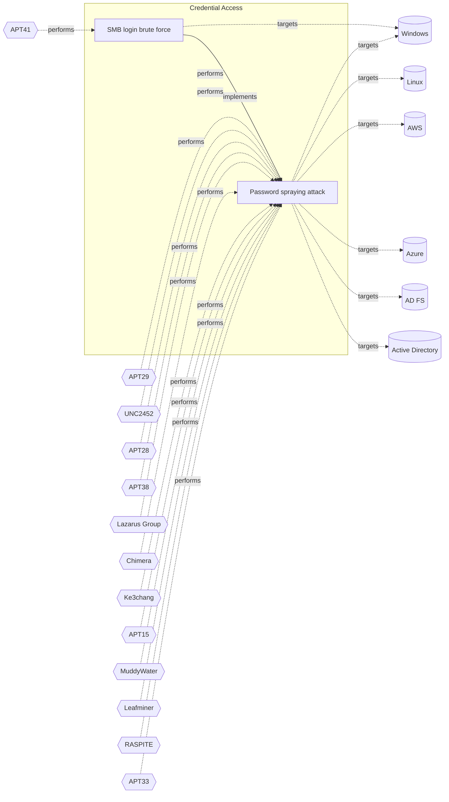

# ☣️ SMB login brute force

🔥 **Criticality:Medium** ❗ : A Medium priority incident may affect public health or safety, national security, economic security, foreign relations, civil liberties, or public confidence. 

🚦 **TLP:CLEAR** ⚪ : Recipients can spread this to the world, there is no limit on disclosure.


🗡️ **ATT&CK Techniques** [T1110 : Brute Force](https://attack.mitre.org/techniques/T1110 'Adversaries may use brute force techniques to gain access to accounts when passwords are unknown or when password hashes are obtainedCitation TrendMic'), [T1110.001 : Brute Force: Password Guessing](https://attack.mitre.org/techniques/T1110/001 'Adversaries with no prior knowledge of legitimate credentials within the system or environment may guess passwords to attempt access to accounts Witho')


---

`🔑 UUID : fa4c66c6-a69b-4e16-84cb-7ad8c772af41` **|** `🏷️ Version : 1` **|** `🗓️ Creation Date : 2025-07-21` **|** `🗓️ Last Modification : 2025-08-07` **|** `Sharing Organisation : {'uuid': '56b0a0f0-b0bc-47d9-bb46-02f80ae2065a', 'name': 'EC DIGIT CSOC'}` **|** `🧱 Schema Identifier : tvm::2.1`


## 👁️ Description

> SMB (Server Message Block) brute-force is a type of cyber attack where an
> attacker attempts to guess the password for an SMB share by trying a large
> number of possible passwords. The goal is to gain unauthorised access to
> the SMB share, which can contain sensitive data, such as files, folders,
> and other resources.
> 
> ### Different methods and techniques used by the threat actors to brute-force an SMB share
> 
> - Dictionary attacks - a threat actor is using in this type of an attack a
> list of common passwords, such as words, phrases, and combinations of
> characters, to try and guess the password.
> - Brute force attacks - a threat actor is trying all possible combinations
> of characters, numbers, and special characters to guess the password.
> - Password spraying - in this technique a threat actor uses a small number
> of common passwords against a large number of usernames, in an attempt to
> guess the password for at least one account.
> - Hybrid attacks - combining dictionary and brute force attacks to try and
> guess the password.
> - Rainbow Table Attacks - this is a possible brute-force attack in which a
> threat actor is using precomputed tables of hash values for common
> passwords to try and guess the password.
> - Exploiting weak passwords - a threat actor may identify and exploit weak
> passwords, such as default passwords, easily guessable passwords, or
> passwords that have not been changed in a long time.
> 
> They can use eumeration tools like nmap, smbclient, Metaspoit and others to
> listen for an open SMB port and perform automated brute-forcing password
> matches against an SMB share. 
> 
> ### Automated script tools used for SMB brute-force attack
> 
> Threat actors may use different automated tools which have the capability
> to use a wordlist and to try logon attemts to an SMB share. For example,
> bat, batch, PowerShell or other type of scripts and tools based on these
> scripts ref [3], [4], [5], [7].  
> 
> Examples:
> 
> - smbrute.bat              (uses `passlist.txt` wordlist) ref [3];
> - Smb.bat script           (uses `Wordlist.txt` wordlist) ref [4];
> - SMBLogin.ps1 script      for more information ref [5]. 
> - smblogin-extra-mini.ps1  (uses .\smblogin.results.txt wordlist)
>   Minimalistic offensive tool based on PowerShell ref [7].
> 
> ### Metasploit auxiliary module brute-force SMB share
> 
> A threat actor can use a Metasploit auxiliary scanner module to brute force
> the SMB credentials. In the example below `<user_file>.txt` is a set of
> user's possible names and `<password_file>.txt` is a list of possible user's
> password for brute-force attack ref [2].   
> 
> Example: 
> 
> ```
> > set RHOST <ip_address>
> RHOST => <ip_address>
> > set PORT 445
> RPORT => 445
> > set user_file ./<user_file>.txt
> user_file => ./<user_file>.txt
> > set password_file ./<password_file>.txt
> password_file => ./<password_file>.txt
> 
> ```
> Metaspoit `run` command runs the auxiliary module and displays if there are
> found successful brute-force credentials matches. 
> 
> ```
> msf5 auxilary(scanner/smb/smb_login) > run
> 
> ```
> 


## 🖥️ Terrain 

 > A threat actor needs an access to a compromised host and availability to
> try to connect to a SMB share.  
> 

---

## 🕸️ Relations


### 🐲 Actors sightings 

| Actor          | Description                                                                                                                                                                                                                                                                                                                                                                                                                                                                                                                                                                                                                                                                                                                                                                                                                                              | Aliases                                                                                                                                                                                                                | Source                     | Sighting                                                                                                               | Reference                                                                                                                                                     |
|:---------------|:---------------------------------------------------------------------------------------------------------------------------------------------------------------------------------------------------------------------------------------------------------------------------------------------------------------------------------------------------------------------------------------------------------------------------------------------------------------------------------------------------------------------------------------------------------------------------------------------------------------------------------------------------------------------------------------------------------------------------------------------------------------------------------------------------------------------------------------------------------|:-----------------------------------------------------------------------------------------------------------------------------------------------------------------------------------------------------------------------|:---------------------------|:-----------------------------------------------------------------------------------------------------------------------|:--------------------------------------------------------------------------------------------------------------------------------------------------------------|
| [Mobile] APT41 | [APT41](https://attack.mitre.org/groups/G0096) is a threat group that researchers have assessed as Chinese state-sponsored espionage group that also conducts financially-motivated operations. Active since at least 2012, [APT41](https://attack.mitre.org/groups/G0096) has been observed targeting various industries, including but not limited to healthcare, telecom, technology, finance, education, retail and video game industries in 14 countries.(Citation: apt41_mandiant) Notable behaviors include using a wide range of malware and tools to complete mission objectives. [APT41](https://attack.mitre.org/groups/G0096) overlaps at least partially with public reporting on groups including BARIUM and [Winnti Group](https://attack.mitre.org/groups/G0044).(Citation: FireEye APT41 Aug 2019)(Citation: Group IB APT 41 June 2021) | BARIUM, Brass Typhoon, Wicked Panda                                                                                                                                                                                    | 🗡️ MITRE ATT&CK Groups     | No documented sighting                                                                                                 | No documented references                                                                                                                                      |
| APT41          | APT41 is a prolific cyber threat group that carries out Chinese state-sponsored espionage activity in addition to financially motivated activity potentially outside of state control.                                                                                                                                                                                                                                                                                                                                                                                                                                                                                                                                                                                                                                                                   | G0096, TA415, Blackfly, Grayfly, LEAD, BARIUM, WICKED SPIDER, WICKED PANDA, BRONZE ATLAS, BRONZE EXPORT, Red Kelpie, G0044, Earth Baku, Amoeba, HOODOO, Brass Typhoon, Winnti, Double Dragon, TG-2633, Leopard Typhoon | 🌌 MISP Threat Actor Galaxy | This threat actor is a known Chinese affiliated threat actor observedto use brute-force techniques against SMB shares. | https://malpedia.caad.fkie.fraunhofer.de/actor/apt41, https://cloud.google.com/blog/topics/threat-intelligence/apt41-dual-espionage-and-cyber-crime-operation |

### 🌊 OpenTide Objects
🚫 No related OpenTide objects indexed.


 --- 

### ⛓️ Threat Chaining




<details>
<summary>Expand chaining data</summary>

| ☣️ Vector                                                                                                                                                                                                                                    | ⛓️ Link                 | 🎯 Target                                                                                                                                                                                                                                         | ⛰️ Terrain                                                                                                                                                                                                                                                                                   | 🗡️ ATT&CK                                                                                                                                                                                                                                            |
|:---------------------------------------------------------------------------------------------------------------------------------------------------------------------------------------------------------------------------------------------|:------------------------|:-------------------------------------------------------------------------------------------------------------------------------------------------------------------------------------------------------------------------------------------------|:---------------------------------------------------------------------------------------------------------------------------------------------------------------------------------------------------------------------------------------------------------------------------------------------|:-----------------------------------------------------------------------------------------------------------------------------------------------------------------------------------------------------------------------------------------------------|
| [SMB login brute force](../Threat%20Vectors/☣️%20SMB%20login%20brute%20force.md 'SMB Server Message Block brute-force is a type of cyber attack where anattacker attempts to guess the password for an SMB share by trying a largenumbe...') | `atomicity::implements` | [Password spraying attack](../Threat%20Vectors/☣️%20Password%20spraying%20attack.md 'Password spraying is a technique that attackers use to try a small listof common or expected passwords against a set of usernames This techniqueis use...') | Adversaries must look for different accounts to test a list of different frequently used weak passwords. To have success, the attacker need to  research what are the valid account patterns used for the Internet-facing applications used by the organisation such as VPN service or O365. | [T1110.003 : Brute Force: Password Spraying](https://attack.mitre.org/techniques/T1110/003 'Adversaries may use a single or small list of commonly used passwords against many different accounts to attempt to acquire valid account credentials ') |

</details>
&nbsp; 


---

## Model Data

#### **⛓️ Cyber Kill Chain**

 > Cyber attacks are typically phased progressions towards strategic objectives. The Unified Kill Chains provides insight into the tactics that hackers employ to attain these objectives. This provides a solid basis to develop (or realign) defensive strategies to raise cyber resilience.

 [`🔑 Credential Access`](https://www.unifiedkillchain.com/assets/The-Unified-Kill-Chain.pdf) : Techniques resulting in the access of, or control over, system, service or domain credentials.

---

#### **🛰️ Domains**

 > Infrastructure technologies domain of interest to attackers.

 `🏢 Enterprise` : Generic databases, applications, machines and systems that are usually on premises or on Cloud traditional VMs.

---

#### **🎯 Targets**

 > Granular delimited technical entities holding a value to the organization, that are targeted by adversaries. They might be also involved in the detection coverage as the target of log collection. Partially inspired by Veris.

  - [`🖥️ Workstations`](http://veriscommunity.net/enums.html#section-asset) : Placeholder
 - [`🕹️ Remote access`](http://veriscommunity.net/enums.html#section-asset) : Server - Remote access
 - [` Other`](http://veriscommunity.net/enums.html#section-asset) : Media - Other/Unknown
 - [`💻 Laptop`](http://veriscommunity.net/enums.html#section-asset) : User Device - Laptop
 - [`👤 Customer`](http://veriscommunity.net/enums.html#section-asset) : People - Customer

---

#### **💿 Platforms concerned**

 > Actual technologies used by the organization that will be exploited by adversaries during a successful attack, and eventually of relevance for detection. Are named by commercial designation.

 ` Windows` : Placeholder

---

#### **💣 Severity**

 > The severity summarizes the overall danger of incident the vector will provoke, and is to be derived (WIP) from impact, leverage, and difficulty to execute.

 [`🧨 Moderate incident`](https://www.ncsc.gov.uk/news/new-cyber-attack-categorisation-system-improve-uk-response-incidents) : A cyber attack on a small organisation, or which poses a considerable risk to a medium-sized organisation, or preliminary indications of cyber activity against a large organisation or the government.

---

#### **🪄 Leverage acquisition**

 > Technical aftermath of the attack from the target perspective, differentiated from impact as it does not consider the value of the consequence, only what increased control the vector execution provides to the adversary.

  - [`👁️‍🗨️ Information Disclosure`](https://owasp.org/www-community/Threat_Modeling_Process#stride) : Threat action intending to read a file that one was not granted access to, or to read data in transit.
 - [`💅 Elevation of privilege`](https://owasp.org/www-community/Threat_Modeling_Process#stride) : Capacity to augment leverage over the target system by upgrading the compromised access rights
 - [`💀 Infrastructure Compromise`](https://owasp.org/www-community/Threat_Modeling_Process#stride) : The compromised target is likely to be used to further expand the sphere of influence of the attacker and allow more potent vectors to be executed.
 - [`🐒 Tampering`](https://owasp.org/www-community/Threat_Modeling_Process#stride) : Threat action intending to maliciously change or modify persistent data, such as records in a database, and the alteration of data in transit between two computers over an open network, such as the Internet.
 - [`⛔ Denial of Service`](https://owasp.org/www-community/Threat_Modeling_Process#stride) : Threat action attempting to deny access to valid users, such as by making a web server temporarily unavailable or unusable.

---

#### **💥 Impact**

 > Analysis of the threat vector from the organizational perspective, in non technical term. This aims at putting a clear denomination on what the attacker will actually be able to act upon if the threat vector is realized.

  - [`🔓 Data Breach`](http://veriscommunity.net/enums.html#section-impact) : Non-public information has been accessed from the outside, and successfully extracted.
 - [`🩼 Impairement`](http://veriscommunity.net/enums.html#section-impact) : Incapacitation of a particular key system that will cause disruptions in day-to-day operations, and eventually service delivery.
 - [`🤬 Lose Capabilities`](http://veriscommunity.net/enums.html#section-impact) : Vector execution will remove key functions to the organization, which will not be easily circumvented. Most day-to-day is heavily impaired, but processes can reorganize at a loss.
 - [`🌍 Reputational Damages`](http://veriscommunity.net/enums.html#section-impact) : Damages to the organization public view may be achieved by using directly the access gained, or indirectly with data gathered.

---

#### **🎲 Vector Viability**

 > Described with estimative language (likelyhood probability), describes how likely the analyst believes the vector to actually be realized on the organization infrastructure. Estimative language describes quality and credibility of underlying sources, data, and methodologies based Intelligence Community Directive 203 (ICD 203) and JP 2-0, Joint Intelligence.

 [`🧐 Likely`](https://www.dni.gov/files/documents/ICD/ICD%20203%20Analytic%20Standards.pdf) : Probable (probably) - 55-80%

---


### 🔗 References


**🕊️ Publicly available resources**

- [_1_] https://0xma.github.io/hacking/brute_force_windows_server_metasploit.html
- [_2_] https://exploit-notes.hdks.org/exploit/windows/active-directory/smb-pentesting
- [_3_] https://github.com/MrUknownm/SMB-Bruteforce
- [_4_] https://github.com/KunalPsycho100/Simple-SMB-Brute-Forcer
- [_5_] https://www.infosecmatter.com/smb-brute-force-attack-tool-in-powershell-smblogin-ps1
- [_6_] https://github.com/Liragbr/BruteForce1v
- [_7_] https://github.com/InfosecMatter/Minimalistic-offensive-security-tools/blob/master/smblogin-extra-mini.ps1

[1]: https://0xma.github.io/hacking/brute_force_windows_server_metasploit.html
[2]: https://exploit-notes.hdks.org/exploit/windows/active-directory/smb-pentesting
[3]: https://github.com/MrUknownm/SMB-Bruteforce
[4]: https://github.com/KunalPsycho100/Simple-SMB-Brute-Forcer
[5]: https://www.infosecmatter.com/smb-brute-force-attack-tool-in-powershell-smblogin-ps1
[6]: https://github.com/Liragbr/BruteForce1v
[7]: https://github.com/InfosecMatter/Minimalistic-offensive-security-tools/blob/master/smblogin-extra-mini.ps1

---

#### 🏷️ Tags

#-, #-, #-, #
, #
, ##, ##, ##, ##, # , #🏷, #️, # , #T, #a, #g, #s, #
, #


