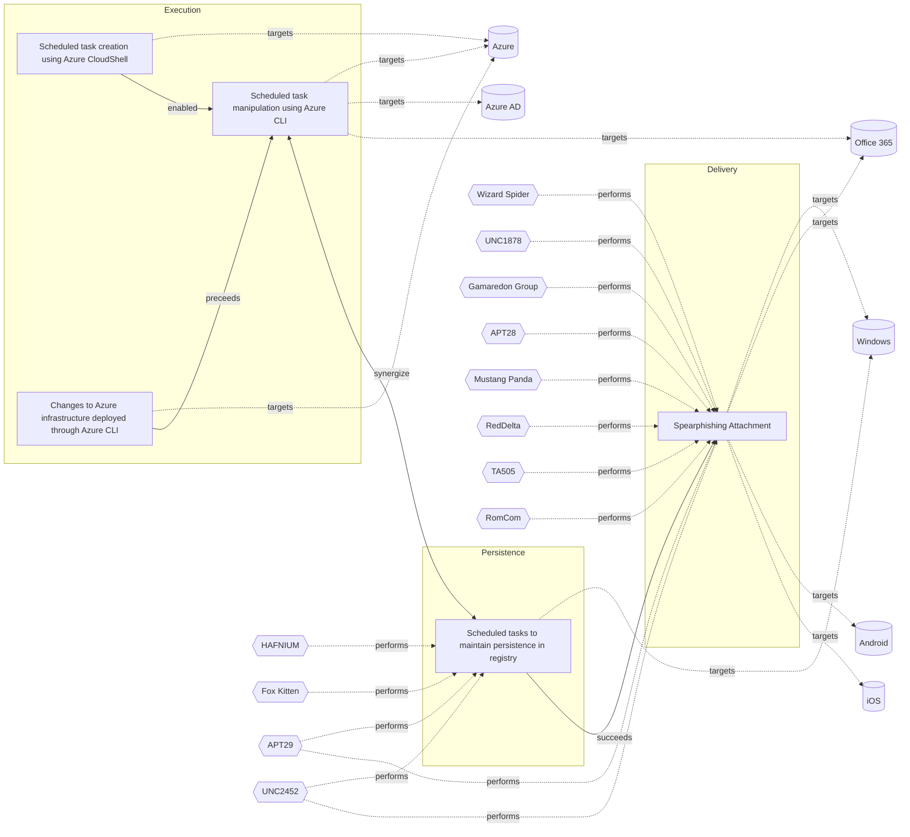

# ☣️ Scheduled task manipulation using Azure CLI

🔥 **Criticality:High** ⚠️ : A High priority incident is likely to result in a demonstrable impact to public health or safety, national security, economic security, foreign relations, civil liberties, or public confidence. 

🚦 **TLP:CLEAR** ⚪ : Recipients can spread this to the world, there is no limit on disclosure.

🗡️ **ATT&CK Techniques** [T1053 : Scheduled Task/Job](https://attack.mitre.org/techniques/T1053 'Adversaries may abuse task scheduling functionality to facilitate initial or recurring execution of malicious code Utilities exist within all major op'), [T1053.005 : Scheduled Task/Job: Scheduled Task](https://attack.mitre.org/techniques/T1053/005 'Adversaries may abuse the Windows Task Scheduler to perform task scheduling for initial or recurring execution of malicious code There are multiple wa'), [T1053.003 : Scheduled Task/Job: Cron](https://attack.mitre.org/techniques/T1053/003 'Adversaries may abuse the codecroncode utility to perform task scheduling for initial or recurring execution of malicious codeCitation 20 macOS Common'), [T1059 : Command and Scripting Interpreter](https://attack.mitre.org/techniques/T1059 'Adversaries may abuse command and script interpreters to execute commands, scripts, or binaries These interfaces and languages provide ways of interac'), [T1078 : Valid Accounts](https://attack.mitre.org/techniques/T1078 'Adversaries may obtain and abuse credentials of existing accounts as a means of gaining Initial Access, Persistence, Privilege Escalation, or Defense '), [T1136 : Create Account](https://attack.mitre.org/techniques/T1136 'Adversaries may create an account to maintain access to victim systemsCitation Symantec WastedLocker June 2020 With a sufficient level of access, crea')

---

`🔑 UUID : edfe43fd-4a92-4f2d-a733-40e235be1b25` **|** `🏷️ Version : 1` **|** `🗓️ Creation Date : 2024-12-18` **|** `🗓️ Last Modification : 2024-12-19` **|** `Sharing Organisation : {'uuid': '56b0a0f0-b0bc-47d9-bb46-02f80ae2065a', 'name': 'EC DIGIT CSOC'}` **|** `🧱 Schema Identifier : tvm::2.0`

## 👁️ Description

> Scheduled task manipulation using Azure CLI is a sophisticated threat vector that 
> allows adversaries to establish persistence and execute malicious code in cloud environments. 
> While the search results do not specifically mention Azure CLI, we can extrapolate 
> the threat based on the general concept of scheduled task abuse.    
> 
> ## Key aspects of the threat:    
> 
> 1. **Persistence mechanism**: Adversaries can create or modify scheduled tasks to 
> run malicious code at specified times or system startup, ensuring long-term access 
> to compromised systems.    
> 
> 2. **Privilege escalation**: Tasks can be configured to run with elevated privileges, 
> often as SYSTEM, granting attackers the highest level of access on Windows systems.    
> 
> 3. **Stealth**: Attackers may create "hidden" scheduled tasks by manipulating registry 
> values, making them invisible to standard enumeration tools.    
> 
> 4. **Versatility**: Scheduled tasks can be used for various malicious purposes, 
> including initial access, lateral movement, and executing additional payloads.    
> 
> ## Specific techniques:    
> 
> 1. **Command execution**: Adversaries often use scheduled tasks to open command 
> shells or execute arbitrary binaries from user-writable directories.    
> 
> 2. **Network connections**: Tasks may be configured to reach out to external domains 
> and download malicious payloads on a recurring schedule.    
> 
> 3. **Abuse of legitimate tools**: Attackers can leverage native Windows utilities 
> like schtasks.exe or PowerShell cmdlets to create and manage malicious tasks.    
> 
> 4. **Registry manipulation**: Advanced adversaries may directly modify registry 
> keys related to scheduled tasks to evade detection.    
> 
> 5. **Masquerading**: Malicious tasks can be disguised as legitimate system processes 
> or software updates to avoid suspicion.
> 

## 🖥️ Terrain 

 > Adversary must have administrative privileges over the Azure CLI environment.
> 

---

## 🕸️ Relations

### 🌊 OpenTide Objects
🚫 No related OpenTide objects indexed.

 --- 

### ⛓️ Threat Chaining

Expand chaining data

| ☣️ Vector                                                                                                                                                                                                                                                                                                      | ⛓️ Link              | 🎯 Target                                                                                                                                                                                                                                                                                                                       | ⛰️ Terrain                                                                                                                                                                                                                                                                                                                                                                                                                                                                                                                                                                                                                                                                                                                                                                                                                                                | 🗡️ ATT&CK                                                                                                                                                                                                                                                                                                                                                                                                                                                                               |
|:---------------------------------------------------------------------------------------------------------------------------------------------------------------------------------------------------------------------------------------------------------------------------------------------------------------|:---------------------|:-------------------------------------------------------------------------------------------------------------------------------------------------------------------------------------------------------------------------------------------------------------------------------------------------------------------------------|:----------------------------------------------------------------------------------------------------------------------------------------------------------------------------------------------------------------------------------------------------------------------------------------------------------------------------------------------------------------------------------------------------------------------------------------------------------------------------------------------------------------------------------------------------------------------------------------------------------------------------------------------------------------------------------------------------------------------------------------------------------------------------------------------------------------------------------------------------------|:----------------------------------------------------------------------------------------------------------------------------------------------------------------------------------------------------------------------------------------------------------------------------------------------------------------------------------------------------------------------------------------------------------------------------------------------------------------------------------------|
| [Scheduled task manipulation using Azure CLI](../Threat%20Vectors/☣️%20Scheduled%20task%20manipulation%20using%20Azure%20CLI.md 'Scheduled task manipulation using Azure CLI is a sophisticated threat vector that allows adversaries to establish persistence and execute malicious co...')                   | `support::enabled`   | [Scheduled task creation using Azure CloudShell](../Threat%20Vectors/☣️%20Scheduled%20task%20creation%20using%20Azure%20CloudShell.md 'Threat actors can use Azure CloudShell, which is accessible via the Azureportal or the browser, to create scheduled tasksThe path to the Action parame...')                             | A threat actor has gained control over privileges to create scheduled tasks  on a deployed resource using Azure CloudShell either via a browser or the Azure portal.                                                                                                                                                                                                                                                                                                                                                                                                                                                                                                                                                                                                                                                                                      | [T1053.005 : Scheduled Task/Job: Scheduled Task](https://attack.mitre.org/techniques/T1053/005 'Adversaries may abuse the Windows Task Scheduler to perform task scheduling for initial or recurring execution of malicious code There are multiple wa')                                                                                                                                                                                                                                |
| [Scheduled task manipulation using Azure CLI](../Threat%20Vectors/☣️%20Scheduled%20task%20manipulation%20using%20Azure%20CLI.md 'Scheduled task manipulation using Azure CLI is a sophisticated threat vector that allows adversaries to establish persistence and execute malicious co...')                   | `support::synergize` | [Scheduled tasks to maintain persistence in registry](../Threat%20Vectors/☣️%20Scheduled%20tasks%20to%20maintain%20persistence%20in%20registry.md 'A threat actor can successfully maintain persistence on a compromised system by using scheduled tasks to create or edit registry entriesWindows Schedu...')                 | An adversary has gained control over a Windows endpoint and has privileges  to create scheduled tasks in order to maintain persistence in the registry.                                                                                                                                                                                                                                                                                                                                                                                                                                                                                                                                                                                                                                                                                                   | [T1053.005 : Scheduled Task/Job: Scheduled Task](https://attack.mitre.org/techniques/T1053/005 'Adversaries may abuse the Windows Task Scheduler to perform task scheduling for initial or recurring execution of malicious code There are multiple wa'), [T1112 : Modify Registry](https://attack.mitre.org/techniques/T1112 'Adversaries may interact with the Windows Registry as part of a variety of other techniques to aid in defense evasion, persistence, and executionAcces') |
| [Scheduled task manipulation using Azure CLI](../Threat%20Vectors/☣️%20Scheduled%20task%20manipulation%20using%20Azure%20CLI.md 'Scheduled task manipulation using Azure CLI is a sophisticated threat vector that allows adversaries to establish persistence and execute malicious co...')                   | `sequence::preceeds` | [Changes to Azure infrastructure deployed through Azure CLI](../Threat%20Vectors/☣️%20Changes%20to%20Azure%20infrastructure%20deployed%20through%20Azure%20CLI.md 'A threat actor in control of the prerequisites may attempt to use the AzureCLI to perform changes either to the endpoint from which the CLI is accesse...') | A threat actor controls either privileged credentials or a service  principal (SPN) and an endpoint from which Azure CLI can be run.                                                                                                                                                                                                                                                                                                                                                                                                                                                                                                                                                                                                                                                                                                                      | [T1059 : Command and Scripting Interpreter](https://attack.mitre.org/techniques/T1059 'Adversaries may abuse command and script interpreters to execute commands, scripts, or binaries These interfaces and languages provide ways of interac')                                                                                                                                                                                                                                         |
| [Scheduled tasks to maintain persistence in registry](../Threat%20Vectors/☣️%20Scheduled%20tasks%20to%20maintain%20persistence%20in%20registry.md 'A threat actor can successfully maintain persistence on a compromised system by using scheduled tasks to create or edit registry entriesWindows Schedu...') | `sequence::succeeds` | [Spearphishing Attachment](../Threat%20Vectors/☣️%20Spearphishing%20Attachment.md 'Spearphishing messages are often crafted using pernicious social engineeringtechniquesIn Spearphishing Attachment attacks, recipients receive emails t...')                                                                                 | Spear phishing requires more preparation and time to achieve success  than a phishing attack. That is because spear-phishing attackers attempt to obtain vast amounts of personal information about their victims.   Attackers can get the personal information they need using different ways:   - to compromise an email or messaging system trough other means, - to use OSINT, sourcing Social Media or glean personal information from the user's online presence. They want to craft emails that look as legitimate and attractive as possible  to increase the chances of fooling their targets, for instance sending a malicious  attachment where the filename references a topic the recipient is interested in. The highly personalized nature of spear-phishing attacks makes it more  difficult to identity than widescale phishing attacks. | [T1566.001 : Phishing: Spearphishing Attachment](https://attack.mitre.org/techniques/T1566/001 'Adversaries may send spearphishing emails with a malicious attachment in an attempt to gain access to victim systems Spearphishing attachment is a spe')                                                                                                                                                                                                                                |

&nbsp; 

---

## Model Data

#### **⛓️ Cyber Kill Chain**

 > Cyber attacks are typically phased progressions towards strategic objectives. The Unified Kill Chains provides insight into the tactics that hackers employ to attain these objectives. This provides a solid basis to develop (or realign) defensive strategies to raise cyber resilience.

 [`⚡ Execution`](https://www.unifiedkillchain.com/assets/The-Unified-Kill-Chain.pdf) : Techniques that result in execution of attacker-controlled code on a local or remote system.

---

#### **🛰️ Domains**

 > Infrastructure technologies domain of interest to attackers.

  - `☁️ Public Cloud` : Infrastructure handled by a commercial cloud provider. Managed mostly on a service level, and connected over the internet.
 - `🏢 Enterprise` : Generic databases, applications, machines and systems that are usually on premises or on Cloud traditional VMs.
 - `🌐 Networking` : Communications backbone connecting users, applications and machines.

---

#### **🎯 Targets**

 > Granular delimited technical entities holding a value to the organization, that are targeted by adversaries. They might be also involved in the detection coverage as the target of log collection. Partially inspired by Veris.

  - [`🪣 Cloud Storage Accounts`](http://veriscommunity.net/enums.html#section-asset) : Placeholder
 - [`👤 Identity Services`](http://veriscommunity.net/enums.html#section-asset) : Placeholder
 - [`🛠️ Virtual Machines`](http://veriscommunity.net/enums.html#section-asset) : Placeholder
 - [`🧩 API Endpoints`](http://veriscommunity.net/enums.html#section-asset) : Placeholder
 - [`☁️ Cloud Portal`](http://veriscommunity.net/enums.html#section-asset) : Placeholder

---

#### **💿 Platforms concerned**

 > Actual technologies used by the organization that will be exploited by adversaries during a successful attack, and eventually of relevance for detection. Are named by commercial designation.

  - ` Azure` : Placeholder
 - ` Azure AD` : Placeholder
 - ` Office 365` : Placeholder

---

#### **💣 Severity**

 > The severity summarizes the overall danger of incident the vector will provoke, and is to be derived (WIP) from impact, leverage, and difficulty to execute.

 [`⚠️ Significant incident`](https://www.ncsc.gov.uk/news/new-cyber-attack-categorisation-system-improve-uk-response-incidents) : A cyber attack which has a serious impact on a large organisation or on wider / local government, or which poses a considerable risk to central government or (inter)national essential services.

---

#### **🪄 Leverage acquisition**

 > Technical aftermath of the attack from the target perspective, differentiated from impact as it does not consider the value of the consequence, only what increased control the vector execution provides to the adversary.

  - [`👻 Spoofing`](https://owasp.org/www-community/Threat_Modeling_Process#stride) : Threat action aimed at accessing and use of another user’s credentials, such as username and password.
 - [`🐒 Tampering`](https://owasp.org/www-community/Threat_Modeling_Process#stride) : Threat action intending to maliciously change or modify persistent data, such as records in a database, and the alteration of data in transit between two computers over an open network, such as the Internet.
 - [`🗿 Repudiation`](https://owasp.org/www-community/Threat_Modeling_Process#stride) : Threat action aimed at performing prohibited operations in a system that lacks the ability to trace the operations.
 - [`💀 Infrastructure Compromise`](https://owasp.org/www-community/Threat_Modeling_Process#stride) : The compromised target is likely to be used to further expand the sphere of influence of the attacker and allow more potent vectors to be executed.
 - [`👁️‍🗨️ Information Disclosure`](https://owasp.org/www-community/Threat_Modeling_Process#stride) : Threat action intending to read a file that one was not granted access to, or to read data in transit.

---

#### **💥 Impact**

 > Analysis of the threat vector from the organizational perspective, in non technical term. This aims at putting a clear denomination on what the attacker will actually be able to act upon if the threat vector is realized.

  - [`🔓 Data Breach`](http://veriscommunity.net/enums.html#section-impact) : Non-public information has been accessed from the outside, and successfully extracted.
 - [`🧠 IP Loss`](http://veriscommunity.net/enums.html#section-impact) : Particular, key data, information and blueprint conducive to the organization capability to gain and retain a commercial or geopolitical advantage has been accessed, and their content potentially used by competitors or other adversaries.
 - [`🌍 Reputational Damages`](http://veriscommunity.net/enums.html#section-impact) : Damages to the organization public view may be achieved by using directly the access gained, or indirectly with data gathered.
 - [`🥸 Identity Theft`](http://veriscommunity.net/enums.html#section-impact) : Acquisition of sufficient information and privileges to profess as a given individual, for the purpose of abusing and deceiving human trust relationships.
 - [`💸 Monetary Loss`](http://veriscommunity.net/enums.html#section-impact) : The vector will directly conduct to loss of value directly impacting the bottom line.

---

#### **🎲 Vector Viability**

 > Described with estimative language (likelyhood probability), describes how likely the analyst believes the vector to actually be realized on the organization infrastructure. Estimative language describes quality and credibility of underlying sources, data, and methodologies based Intelligence Community Directive 203 (ICD 203) and JP 2-0, Joint Intelligence.

 [`🧐 Likely`](https://www.dni.gov/files/documents/ICD/ICD%20203%20Analytic%20Standards.pdf) : Probable (probably) - 55-80%

---

### 🔗 References

**🕊️ Publicly available resources**

- [_1_] https://redcanary.com/threat-detection-report/techniques/scheduled-task/
- [_2_] https://www.logpoint.com/en/blog/emerging-threats/shenanigans-of-scheduled-tasks/
- [_3_] https://www.securityblue.team/blog/posts/persistence-mechanisms-windows-scheduled-tasks

[1]: https://redcanary.com/threat-detection-report/techniques/scheduled-task/
[2]: https://www.logpoint.com/en/blog/emerging-threats/shenanigans-of-scheduled-tasks/
[3]: https://www.securityblue.team/blog/posts/persistence-mechanisms-windows-scheduled-tasks

---

#### 🏷️ Tags

#-, #-, #-, #
, #
, ##, ##, ##, ##, # , #🏷, #️, # , #T, #a, #g, #s, #
, #

