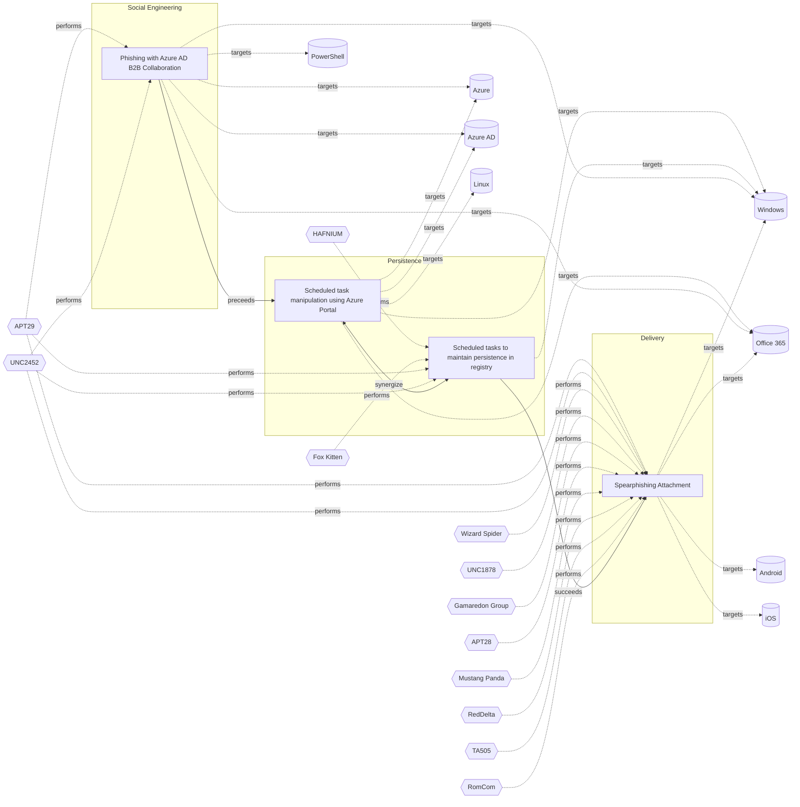

# ☣️ Scheduled task manipulation using Azure Portal

🔥 **Criticality:High** ⚠️ : A High priority incident is likely to result in a demonstrable impact to public health or safety, national security, economic security, foreign relations, civil liberties, or public confidence. 

🚦 **TLP:CLEAR** ⚪ : Recipients can spread this to the world, there is no limit on disclosure.

🗡️ **ATT&CK Techniques** [T1053.005 : Scheduled Task/Job: Scheduled Task](https://attack.mitre.org/techniques/T1053/005 'Adversaries may abuse the Windows Task Scheduler to perform task scheduling for initial or recurring execution of malicious code There are multiple wa'), [T1651 : Cloud Administration Command](https://attack.mitre.org/techniques/T1651 'Adversaries may abuse cloud management services to execute commands within virtual machines Resources such as AWS Systems Manager, Azure RunCommand, a')

---

`🔑 UUID : 437a43b9-6344-45a9-915b-d733d23173ae` **|** `🏷️ Version : 2` **|** `🗓️ Creation Date : 2024-12-17` **|** `🗓️ Last Modification : 2025-02-26` **|** `Sharing Organisation : {'uuid': '56b0a0f0-b0bc-47d9-bb46-02f80ae2065a', 'name': 'EC DIGIT CSOC'}` **|** `🧱 Schema Identifier : tvm::2.1`

## 👁️ Description

> Scheduled tasks in Azure, often called "WebJobs" or "Azure Functions" with timer 
> triggers, are automated processes set to run at specific times or intervals. They 
> are used for maintenance, backups, data processing, and other routine operations.
> 
> This scheduled tasks can be manipulated by threat actors to execute malicious 
> code, steal sensitive information, or disrupt business operations. The manipulation 
> of scheduled tasks can be achieved through various means, including:
> 
> ### Azure metadata service exploitation
> 
> Adversaries can abuse the Azure Instance Metadata Service (IMDS) to gather sensitive 
> information about virtual machines.  
> The IMDSv1 endpoint is particularly vulnerable to Server-Side Request Forgery 
> (SSRF) attacks due to its accessibility via GET requests.
> 
> ### Scheduled events manipulation
> 
> Attackers can exploit Azure scheduled events, a feature of the Azure Metadata 
> Service, to prepare for and execute attacks during VM maintenance windows.  
> This technique allows malicious actors to anticipate system changes and potentially 
> exploit vulnerabilities during maintenance periods.
> 
> ### Custom script extensions
> 
> Threat actors can abuse Custom script extensions, which are designed to automate 
> post-deployment scripts on VMs.  
> This feature can be misused to execute malicious code, install unauthorized software, 
> or reconfigure systems for nefarious purposes.      
> 
> ### Leveraging exploited vulnerabilities
> 
> Attackers can use exploited vulnerabilities in Azure services, such as Azure Automation 
> or Logic Apps, to create more complex, distributed scheduled actions that are harder to detect.
> 
> ### Utilizing obfuscated code
> 
> Attackers might use obfuscated code within tasks to evade detection and make it 
> harder for security teams to identify and mitigate the threat.
> 
> ### Deleting logs and hiding tracks
> 
> Attackers might delete logs related to task creation or modification, and modify 
> task descriptions to seem innocuous, in an attempt to hide their tracks and make 
> it harder to investigate and remediate the attack.
> 

## 🖥️ Terrain 

 > Adversary must have administrative privileges over Azure Portal or have access to 
> Azure credentials.
> 

---

## 🕸️ Relations

### 🌊 OpenTide Objects
🚫 No related OpenTide objects indexed.

 --- 

### ⛓️ Threat Chaining

Expand chaining data

| ☣️ Vector                                                                                                                                                                                                                                                                                                      | ⛓️ Link              | 🎯 Target                                                                                                                                                                                                                                                                                                       | ⛰️ Terrain                                                                                                                                                                                                                                                                                                                                                                                                                                                                                                                                                                                                                                                                                                                                                                                                                                                | 🗡️ ATT&CK                                                                                                                                                                                                                                                                                                                                                                                                                                                                               |
|:---------------------------------------------------------------------------------------------------------------------------------------------------------------------------------------------------------------------------------------------------------------------------------------------------------------|:---------------------|:---------------------------------------------------------------------------------------------------------------------------------------------------------------------------------------------------------------------------------------------------------------------------------------------------------------|:----------------------------------------------------------------------------------------------------------------------------------------------------------------------------------------------------------------------------------------------------------------------------------------------------------------------------------------------------------------------------------------------------------------------------------------------------------------------------------------------------------------------------------------------------------------------------------------------------------------------------------------------------------------------------------------------------------------------------------------------------------------------------------------------------------------------------------------------------------|:----------------------------------------------------------------------------------------------------------------------------------------------------------------------------------------------------------------------------------------------------------------------------------------------------------------------------------------------------------------------------------------------------------------------------------------------------------------------------------------|
| [Scheduled task manipulation using Azure Portal](../Threat%20Vectors/☣️%20Scheduled%20task%20manipulation%20using%20Azure%20Portal.md 'Scheduled tasks in Azure, often called WebJobs or Azure Functions with timer triggers, are automated processes set to run at specific times or interva...')             | `support::synergize` | [Scheduled tasks to maintain persistence in registry](../Threat%20Vectors/☣️%20Scheduled%20tasks%20to%20maintain%20persistence%20in%20registry.md 'A threat actor can successfully maintain persistence on a compromised system by using scheduled tasks to create or edit registry entriesWindows Schedu...') | An adversary has gained control over a Windows endpoint and has privileges  to create scheduled tasks in order to maintain persistence in the registry.                                                                                                                                                                                                                                                                                                                                                                                                                                                                                                                                                                                                                                                                                                   | [T1053.005 : Scheduled Task/Job: Scheduled Task](https://attack.mitre.org/techniques/T1053/005 'Adversaries may abuse the Windows Task Scheduler to perform task scheduling for initial or recurring execution of malicious code There are multiple wa'), [T1112 : Modify Registry](https://attack.mitre.org/techniques/T1112 'Adversaries may interact with the Windows Registry as part of a variety of other techniques to aid in defense evasion, persistence, and executionAcces') |
| [Scheduled task manipulation using Azure Portal](../Threat%20Vectors/☣️%20Scheduled%20task%20manipulation%20using%20Azure%20Portal.md 'Scheduled tasks in Azure, often called WebJobs or Azure Functions with timer triggers, are automated processes set to run at specific times or interva...')             | `sequence::preceeds` | [Phishing with Azure AD B2B Collaboration](../Threat%20Vectors/☣️%20Phishing%20with%20Azure%20AD%20B2B%20Collaboration.md 'Phishing with Azure AD B2B Collaboration involves exploiting the service to send malicious invitations that appear to come from Microsoft or other thi...')                         | Adversaries need administrative privileges or access to an existing Azure AD Premium account, or to create a new free trial account. After this, the capability to set up an Enterprise App with single sign-on through a user-defined URL, which can be their own website to deceive the user.                                                                                                                                                                                                                                                                                                                                                                                                                                                                                                                                                           | [T1566 : Phishing](https://attack.mitre.org/techniques/T1566 'Adversaries may send phishing messages to gain access to victim systems All forms of phishing are electronically delivered social engineering Phishing')                                                                                                                                                                                                                                                                  |
| [Scheduled tasks to maintain persistence in registry](../Threat%20Vectors/☣️%20Scheduled%20tasks%20to%20maintain%20persistence%20in%20registry.md 'A threat actor can successfully maintain persistence on a compromised system by using scheduled tasks to create or edit registry entriesWindows Schedu...') | `sequence::succeeds` | [Spearphishing Attachment](../Threat%20Vectors/☣️%20Spearphishing%20Attachment.md 'Spearphishing messages are often crafted using pernicious social engineeringtechniquesIn Spearphishing Attachment attacks, recipients receive emails t...')                                                                 | Spear phishing requires more preparation and time to achieve success  than a phishing attack. That is because spear-phishing attackers attempt to obtain vast amounts of personal information about their victims.   Attackers can get the personal information they need using different ways:   - to compromise an email or messaging system trough other means, - to use OSINT, sourcing Social Media or glean personal information from the user's online presence. They want to craft emails that look as legitimate and attractive as possible  to increase the chances of fooling their targets, for instance sending a malicious  attachment where the filename references a topic the recipient is interested in. The highly personalized nature of spear-phishing attacks makes it more  difficult to identity than widescale phishing attacks. | [T1566.001 : Phishing: Spearphishing Attachment](https://attack.mitre.org/techniques/T1566/001 'Adversaries may send spearphishing emails with a malicious attachment in an attempt to gain access to victim systems Spearphishing attachment is a spe')                                                                                                                                                                                                                                |

&nbsp; 

---

## Model Data

#### **⛓️ Cyber Kill Chain**

 > Cyber attacks are typically phased progressions towards strategic objectives. The Unified Kill Chains provides insight into the tactics that hackers employ to attain these objectives. This provides a solid basis to develop (or realign) defensive strategies to raise cyber resilience.

 [`🔐 Persistence`](https://www.unifiedkillchain.com/assets/The-Unified-Kill-Chain.pdf) : Any access, action or change to a system that gives an attacker persistent presence on the system.

---

#### **🛰️ Domains**

 > Infrastructure technologies domain of interest to attackers.

  - `☁️ Private Cloud` : Infrastructure hosted at a third party, but based on custom specification and managed on a platform level.
 - `🕸️ SaaS` : Subscription based access to software.
 - `☁️ Public Cloud` : Infrastructure handled by a commercial cloud provider. Managed mostly on a service level, and connected over the internet.

---

#### **🎯 Targets**

 > Granular delimited technical entities holding a value to the organization, that are targeted by adversaries. They might be also involved in the detection coverage as the target of log collection. Partially inspired by Veris.

  - [`🪣 Cloud Storage Accounts`](http://veriscommunity.net/enums.html#section-asset) : Placeholder
 - [`🗝️ Key Store`](http://veriscommunity.net/enums.html#section-asset) : Placeholder
 - [`🛠️ Virtual Machines`](http://veriscommunity.net/enums.html#section-asset) : Placeholder
 - [`🧩 API Endpoints`](http://veriscommunity.net/enums.html#section-asset) : Placeholder
 - [`☁️ Cloud Portal`](http://veriscommunity.net/enums.html#section-asset) : Placeholder

---

#### **💿 Platforms concerned**

 > Actual technologies used by the organization that will be exploited by adversaries during a successful attack, and eventually of relevance for detection. Are named by commercial designation.

  - ` Azure` : Placeholder
 - ` Azure AD` : Placeholder
 - ` Office 365` : Placeholder
 - ` Windows` : Placeholder
 - ` Linux` : Placeholder

---

#### **💣 Severity**

 > The severity summarizes the overall danger of incident the vector will provoke, and is to be derived (WIP) from impact, leverage, and difficulty to execute.

 [`⚠️ Significant incident`](https://www.ncsc.gov.uk/news/new-cyber-attack-categorisation-system-improve-uk-response-incidents) : A cyber attack which has a serious impact on a large organisation or on wider / local government, or which poses a considerable risk to central government or (inter)national essential services.

---

#### **🪄 Leverage acquisition**

 > Technical aftermath of the attack from the target perspective, differentiated from impact as it does not consider the value of the consequence, only what increased control the vector execution provides to the adversary.

  - [`👻 Spoofing`](https://owasp.org/www-community/Threat_Modeling_Process#stride) : Threat action aimed at accessing and use of another user’s credentials, such as username and password.
 - [`🐒 Tampering`](https://owasp.org/www-community/Threat_Modeling_Process#stride) : Threat action intending to maliciously change or modify persistent data, such as records in a database, and the alteration of data in transit between two computers over an open network, such as the Internet.
 - [`🗿 Repudiation`](https://owasp.org/www-community/Threat_Modeling_Process#stride) : Threat action aimed at performing prohibited operations in a system that lacks the ability to trace the operations.
 - [`💀 Infrastructure Compromise`](https://owasp.org/www-community/Threat_Modeling_Process#stride) : The compromised target is likely to be used to further expand the sphere of influence of the attacker and allow more potent vectors to be executed.
 - [`👁️‍🗨️ Information Disclosure`](https://owasp.org/www-community/Threat_Modeling_Process#stride) : Threat action intending to read a file that one was not granted access to, or to read data in transit.

---

#### **💥 Impact**

 > Analysis of the threat vector from the organizational perspective, in non technical term. This aims at putting a clear denomination on what the attacker will actually be able to act upon if the threat vector is realized.

  - [`🔓 Data Breach`](http://veriscommunity.net/enums.html#section-impact) : Non-public information has been accessed from the outside, and successfully extracted.
 - [`🧠 IP Loss`](http://veriscommunity.net/enums.html#section-impact) : Particular, key data, information and blueprint conducive to the organization capability to gain and retain a commercial or geopolitical advantage has been accessed, and their content potentially used by competitors or other adversaries.
 - [`🌍 Reputational Damages`](http://veriscommunity.net/enums.html#section-impact) : Damages to the organization public view may be achieved by using directly the access gained, or indirectly with data gathered.
 - [`🥸 Identity Theft`](http://veriscommunity.net/enums.html#section-impact) : Acquisition of sufficient information and privileges to profess as a given individual, for the purpose of abusing and deceiving human trust relationships.

---

#### **🎲 Vector Viability**

 > Described with estimative language (likelyhood probability), describes how likely the analyst believes the vector to actually be realized on the organization infrastructure. Estimative language describes quality and credibility of underlying sources, data, and methodologies based Intelligence Community Directive 203 (ICD 203) and JP 2-0, Joint Intelligence.

 [`🧐 Likely`](https://www.dni.gov/files/documents/ICD/ICD%20203%20Analytic%20Standards.pdf) : Probable (probably) - 55-80%

---

### 🔗 References

**🕊️ Publicly available resources**

- [_1_] https://learn.microsoft.com/en-us/azure/virtual-machines/windows/scheduled-events
- [_2_] https://learn.microsoft.com/da-dk/azure/logic-apps/create-automation-tasks-azure-resources
- [_3_] https://xybytes.com/azure/Azure-SSRF/
- [_4_] https://community.citrix.com/tech-zone/design/reference-architectures/virtual-apps-and-desktops-azure/
- [_5_] https://learn.microsoft.com/en-us/azure/automation/shared-resources/schedules

[1]: https://learn.microsoft.com/en-us/azure/virtual-machines/windows/scheduled-events
[2]: https://learn.microsoft.com/da-dk/azure/logic-apps/create-automation-tasks-azure-resources
[3]: https://xybytes.com/azure/Azure-SSRF/
[4]: https://community.citrix.com/tech-zone/design/reference-architectures/virtual-apps-and-desktops-azure/
[5]: https://learn.microsoft.com/en-us/azure/automation/shared-resources/schedules

---

#### 🏷️ Tags

#-, #-, #-, #
, #
, ##, ##, ##, ##, # , #🏷, #️, # , #T, #a, #g, #s, #
, #

