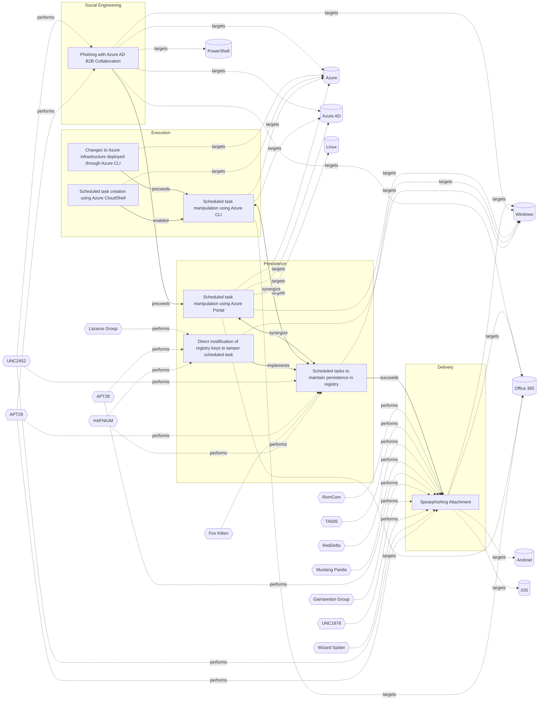

# ☣️ Scheduled tasks to maintain persistence in registry

🔥 **Criticality:Medium** ❗ : A Medium priority incident may affect public health or safety, national security, economic security, foreign relations, civil liberties, or public confidence. 

🚦 **TLP:CLEAR** ⚪ : Recipients can spread this to the world, there is no limit on disclosure.

🗡️ **ATT&CK Techniques** [T1053.005 : Scheduled Task/Job: Scheduled Task](https://attack.mitre.org/techniques/T1053/005 'Adversaries may abuse the Windows Task Scheduler to perform task scheduling for initial or recurring execution of malicious code There are multiple wa'), [T1112 : Modify Registry](https://attack.mitre.org/techniques/T1112 'Adversaries may interact with the Windows Registry as part of a variety of other techniques to aid in defense evasion, persistence, and executionAcces')

---

`🔑 UUID : 5e66f826-4c4b-4357-b9c5-2f40da207f34` **|** `🏷️ Version : 6` **|** `🗓️ Creation Date : 2022-12-14` **|** `🗓️ Last Modification : 2025-06-11` **|** `Sharing Organisation : {'uuid': '56b0a0f0-b0bc-47d9-bb46-02f80ae2065a', 'name': 'EC DIGIT CSOC'}` **|** `🧱 Schema Identifier : tvm::2.0`

## 👁️ Description

> A threat actor can successfully maintain persistence on a compromised system 
> by using scheduled tasks to create or edit registry entries.
> 
> Windows Scheduled Task is a feature of the Windows operating system that 
> allows users to schedule a command or program to run automatically at a 
> specific time or interval. This can be useful for running tasks that need to
> be performed regularly, such as backing up files or checking for updates. 
> Scheduled tasks can be configured to run in the background, without the need
> for user intervention.
> 
> One example for a scheduled task that establish persistence in the registry 
> is a task that is configured to run when specific condition is met - as 
> example on system start up. The task will have an action configured, which 
> might be to download and run a payload, which for example could be a payload
> that sets a registry run key. Registry run keys are keys in the Windows 
> registry that are called during system start up. These keys enable 
> configurations to be loaded automatically. Registry run keys can also 
> directly execute binary files on system start up. 
> 
> To create a scheduled task that runs at system startup attackers are using 
> for example Windows Task Scheduler, cmd.exe or PowerShell commands in a 
> script. Once the task has been created, it will be added to the registry and 
> will run automatically every time the system starts up, or until discovered 
> and deleted.
> 
> **Examples for mechanism of persistence in the registries**
> 
>  - Run/RunOnce Keys: Malware can add entries to the registry keys
>  (or their RunOnce counterparts) to execute every time the system
>  boots or a user logs in. An example for such Reg keys:
>  
>  ` HKEY_CURRENT_USER\Software\Microsoft\Windows\CurrentVersion\Run `
>  
>  or 
>  
>  ` HKEY_LOCAL_MACHINE\Software\Microsoft\Windows\CurrentVersion\Run `
>  
>  
>  - Scheduled Tasks: Utilizing the Task Scheduler, malware can create
>  tasks that run at specific intervals or times, ensuring persistence.
>  These tasks are often registered in the registry under
>  
>  ` HKEY_LOCAL_MACHINE\SOFTWARE\Microsoft\Windows NT\CurrentVersion\Schedule\TaskCache `.
> 
>  - Windows Services: Malicious services can be installed and configured
>  to start automatically upon system boot. These are typically registered
>  under `HKEY_LOCAL_MACHINE\SYSTEM\CurrentControlSet\Services`.
> 
> ### Additional persistence techniques
> 
> Other common techniques used by malware in general include:
> 
> - **Modifying Registry Keys**: Malware often alters specific registry keys 
> (like those in `HKEY_CURRENT_USER\Software\Microsoft\Windows\CurrentVersion\Run`) 
> to ensure they are executed at startup.
> 
> - **Modifying Registry Keys**: The following enables the malware to run for all 
> users on the system: (HKEY_LOCAL_MACHINE\Software\Microsoft\Windows\CurrentVersion\Run)
> 
> - **Using Startup Folders**: Malware can place executable files in startup
> folders so that they run automatically when a user logs into their account.   
> 

## 🖥️ Terrain 

 > An adversary has gained control over a Windows endpoint and has privileges 
> to create scheduled tasks in order to maintain persistence in the registry.
> 

---

## 🕸️ Relations

### 🐲 Actors sightings 

| Actor                   | Description                                                                                                                                                                                                                                                                                                                                                                                                                                                                                                                                                                                                                                                                                                                                                                                                                                                                                                                                                                                                                                                                                                                                                                                                                                                                                                                                                                                                                                                                                  | Aliases                                                                                                                                                            | Source                     | Sighting               | Reference                |
|:------------------------|:---------------------------------------------------------------------------------------------------------------------------------------------------------------------------------------------------------------------------------------------------------------------------------------------------------------------------------------------------------------------------------------------------------------------------------------------------------------------------------------------------------------------------------------------------------------------------------------------------------------------------------------------------------------------------------------------------------------------------------------------------------------------------------------------------------------------------------------------------------------------------------------------------------------------------------------------------------------------------------------------------------------------------------------------------------------------------------------------------------------------------------------------------------------------------------------------------------------------------------------------------------------------------------------------------------------------------------------------------------------------------------------------------------------------------------------------------------------------------------------------|:-------------------------------------------------------------------------------------------------------------------------------------------------------------------|:---------------------------|:-----------------------|:-------------------------|
| [Enterprise] HAFNIUM    | [HAFNIUM](https://attack.mitre.org/groups/G0125) is a likely state-sponsored cyber espionage group operating out of China that has been active since at least January 2021. [HAFNIUM](https://attack.mitre.org/groups/G0125) primarily targets entities in the US across a number of industry sectors, including infectious disease researchers, law firms, higher education institutions, defense contractors, policy think tanks, and NGOs. [HAFNIUM](https://attack.mitre.org/groups/G0125) has targeted remote management tools and cloud software for intial access and has demonstrated an ability to quickly operationalize exploits for identified vulnerabilities in edge devices.(Citation: Microsoft HAFNIUM March 2020)(Citation: Volexity Exchange Marauder March 2021)(Citation: Microsoft Silk Typhoon MAR 2025)                                                                                                                                                                                                                                                                                                                                                                                                                                                                                                                                                                                                                                                              | Operation Exchange Marauder, Silk Typhoon                                                                                                                          | 🗡️ MITRE ATT&CK Groups     | No documented sighting | No documented references |
| HAFNIUM                 | HAFNIUM primarily targets entities in the United States across a number of industry sectors, including infectious disease researchers, law firms, higher education institutions, defense contractors, policy think tanks, and NGOs. Microsoft Threat Intelligence Center (MSTIC) attributes this campaign with high confidence to HAFNIUM, a group assessed to be state-sponsored and operating out of China, based on observed victimology, tactics and procedures. HAFNIUM has previously compromised victims by exploiting vulnerabilities in internet-facing servers, and has used legitimate open-source frameworks, like Covenant, for command and control. Once they’ve gained access to a victim network, HAFNIUM typically exfiltrates data to file sharing sites like MEGA.In campaigns unrelated to these vulnerabilities, Microsoft has observed HAFNIUM interacting with victim Office 365 tenants. While they are often unsuccessful in compromising customer accounts, this reconnaissance activity helps the adversary identify more details about their targets’ environments. HAFNIUM operates primarily from leased virtual private servers (VPS) in the United States.                                                                                                                                                                                                                                                                                                   | ATK233, G0125, Operation Exchange Marauder, Red Dev 13, Silk Typhoon, MURKY PANDA                                                                                  | 🌌 MISP Threat Actor Galaxy | No documented sighting | No documented references |
| [Enterprise] Fox Kitten | [Fox Kitten](https://attack.mitre.org/groups/G0117) is threat actor with a suspected nexus to the Iranian government that has been active since at least 2017 against entities in the Middle East, North Africa, Europe, Australia, and North America. [Fox Kitten](https://attack.mitre.org/groups/G0117) has targeted multiple industrial verticals including oil and gas, technology, government, defense, healthcare, manufacturing, and engineering.(Citation: ClearkSky Fox Kitten February 2020)(Citation: CrowdStrike PIONEER KITTEN August 2020)(Citation: Dragos PARISITE )(Citation: ClearSky Pay2Kitten December 2020)                                                                                                                                                                                                                                                                                                                                                                                                                                                                                                                                                                                                                                                                                                                                                                                                                                                           | Lemon Sandstorm, Parisite, Pioneer Kitten, RUBIDIUM, UNC757                                                                                                        | 🗡️ MITRE ATT&CK Groups     | No documented sighting | No documented references |
| Fox Kitten              | PIONEER KITTEN is an Iran-based adversary that has been active since at least 2017 and has a suspected nexus to the Iranian government. This adversary appears to be primarily focused on gaining and maintaining access to entities possessing sensitive information of likely intelligence interest to the Iranian government. According to DRAGOS, they also targeted ICS-related entities using known VPN vulnerabilities. They are widely known to use open source penetration testing tools for reconnaissance and to establish encrypted communications.                                                                                                                                                                                                                                                                                                                                                                                                                                                                                                                                                                                                                                                                                                                                                                                                                                                                                                                              | PIONEER KITTEN, PARISITE, UNC757, Lemon Sandstorm, RUBIDIUM                                                                                                        | 🌌 MISP Threat Actor Galaxy | No documented sighting | No documented references |
| [Enterprise] APT29      | [APT29](https://attack.mitre.org/groups/G0016) is threat group that has been attributed to Russia's Foreign Intelligence Service (SVR).(Citation: White House Imposing Costs RU Gov April 2021)(Citation: UK Gov Malign RIS Activity April 2021) They have operated since at least 2008, often targeting government networks in Europe and NATO member countries, research institutes, and think tanks. [APT29](https://attack.mitre.org/groups/G0016) reportedly compromised the Democratic National Committee starting in the summer of 2015.(Citation: F-Secure The Dukes)(Citation: GRIZZLY STEPPE JAR)(Citation: Crowdstrike DNC June 2016)(Citation: UK Gov UK Exposes Russia SolarWinds April 2021)In April 2021, the US and UK governments attributed the [SolarWinds Compromise](https://attack.mitre.org/campaigns/C0024) to the SVR; public statements included citations to [APT29](https://attack.mitre.org/groups/G0016), Cozy Bear, and The Dukes.(Citation: NSA Joint Advisory SVR SolarWinds April 2021)(Citation: UK NSCS Russia SolarWinds April 2021) Industry reporting also referred to the actors involved in this campaign as UNC2452, NOBELIUM, StellarParticle, Dark Halo, and SolarStorm.(Citation: FireEye SUNBURST Backdoor December 2020)(Citation: MSTIC NOBELIUM Mar 2021)(Citation: CrowdStrike SUNSPOT Implant January 2021)(Citation: Volexity SolarWinds)(Citation: Cybersecurity Advisory SVR TTP May 2021)(Citation: Unit 42 SolarStorm December 2020) | Blue Kitsune, Cozy Bear, CozyDuke, Dark Halo, IRON HEMLOCK, IRON RITUAL, Midnight Blizzard, NOBELIUM, NobleBaron, SolarStorm, The Dukes, UNC2452, UNC3524, YTTRIUM | 🗡️ MITRE ATT&CK Groups     | No documented sighting | No documented references |
| UNC2452                 | Reporting regarding activity related to the SolarWinds supply chain injection has grown quickly since initial disclosure on 13 December 2020. A significant amount of press reporting has focused on the identification of the actor(s) involved, victim organizations, possible campaign timeline, and potential impact. The US Government and cyber community have also provided detailed information on how the campaign was likely conducted and some of the malware used.  MITRE’s ATT&CK team — with the assistance of contributors — has been mapping techniques used by the actor group, referred to as UNC2452/Dark Halo by FireEye and Volexity respectively, as well as SUNBURST and TEARDROP malware.                                                                                                                                                                                                                                                                                                                                                                                                                                                                                                                                                                                                                                                                                                                                                                            | DarkHalo, StellarParticle, NOBELIUM, Solar Phoenix, Midnight Blizzard                                                                                              | 🌌 MISP Threat Actor Galaxy | No documented sighting | No documented references |

### 🌊 OpenTide Objects
🚫 No related OpenTide objects indexed.

 --- 

### ⛓️ Threat Chaining

Expand chaining data

| ☣️ Vector                                                                                                                                                                                                                                                                                                                              | ⛓️ Link                 | 🎯 Target                                                                                                                                                                                                                                                                                                                       | ⛰️ Terrain                                                                                                                                                                                                                                                                                                                                                                                                                                                                                                                                                                                                                                                                                                                                                                                                                                                | 🗡️ ATT&CK                                                                                                                                                                                                                                                                                                                                                                                                                                                                               |
|:---------------------------------------------------------------------------------------------------------------------------------------------------------------------------------------------------------------------------------------------------------------------------------------------------------------------------------------|:------------------------|:-------------------------------------------------------------------------------------------------------------------------------------------------------------------------------------------------------------------------------------------------------------------------------------------------------------------------------|:----------------------------------------------------------------------------------------------------------------------------------------------------------------------------------------------------------------------------------------------------------------------------------------------------------------------------------------------------------------------------------------------------------------------------------------------------------------------------------------------------------------------------------------------------------------------------------------------------------------------------------------------------------------------------------------------------------------------------------------------------------------------------------------------------------------------------------------------------------|:----------------------------------------------------------------------------------------------------------------------------------------------------------------------------------------------------------------------------------------------------------------------------------------------------------------------------------------------------------------------------------------------------------------------------------------------------------------------------------------|
| [Direct modification of registry keys to tamper scheduled task](../Threat%20Vectors/☣️%20Direct%20modification%20of%20registry%20keys%20to%20tamper%20scheduled%20task.md 'Direct modification of registry keys to tamper with scheduled tasksinvolves altering the Windows Registry to manipulate or disable scheduledtasks Sche...') | `atomicity::implements` | [Scheduled tasks to maintain persistence in registry](../Threat%20Vectors/☣️%20Scheduled%20tasks%20to%20maintain%20persistence%20in%20registry.md 'A threat actor can successfully maintain persistence on a compromised system by using scheduled tasks to create or edit registry entriesWindows Schedu...')                 | An adversary has gained control over a Windows endpoint and has privileges  to create scheduled tasks in order to maintain persistence in the registry.                                                                                                                                                                                                                                                                                                                                                                                                                                                                                                                                                                                                                                                                                                   | [T1053.005 : Scheduled Task/Job: Scheduled Task](https://attack.mitre.org/techniques/T1053/005 'Adversaries may abuse the Windows Task Scheduler to perform task scheduling for initial or recurring execution of malicious code There are multiple wa'), [T1112 : Modify Registry](https://attack.mitre.org/techniques/T1112 'Adversaries may interact with the Windows Registry as part of a variety of other techniques to aid in defense evasion, persistence, and executionAcces') |
| [Scheduled task manipulation using Azure CLI](../Threat%20Vectors/☣️%20Scheduled%20task%20manipulation%20using%20Azure%20CLI.md 'Scheduled task manipulation using Azure CLI is a sophisticated threat vector that allows adversaries to establish persistence and execute malicious co...')                                           | `support::synergize`    | [Scheduled tasks to maintain persistence in registry](../Threat%20Vectors/☣️%20Scheduled%20tasks%20to%20maintain%20persistence%20in%20registry.md 'A threat actor can successfully maintain persistence on a compromised system by using scheduled tasks to create or edit registry entriesWindows Schedu...')                 | An adversary has gained control over a Windows endpoint and has privileges  to create scheduled tasks in order to maintain persistence in the registry.                                                                                                                                                                                                                                                                                                                                                                                                                                                                                                                                                                                                                                                                                                   | [T1053.005 : Scheduled Task/Job: Scheduled Task](https://attack.mitre.org/techniques/T1053/005 'Adversaries may abuse the Windows Task Scheduler to perform task scheduling for initial or recurring execution of malicious code There are multiple wa'), [T1112 : Modify Registry](https://attack.mitre.org/techniques/T1112 'Adversaries may interact with the Windows Registry as part of a variety of other techniques to aid in defense evasion, persistence, and executionAcces') |
| [Scheduled task manipulation using Azure CLI](../Threat%20Vectors/☣️%20Scheduled%20task%20manipulation%20using%20Azure%20CLI.md 'Scheduled task manipulation using Azure CLI is a sophisticated threat vector that allows adversaries to establish persistence and execute malicious co...')                                           | `support::enabled`      | [Scheduled task creation using Azure CloudShell](../Threat%20Vectors/☣️%20Scheduled%20task%20creation%20using%20Azure%20CloudShell.md 'Threat actors can use Azure CloudShell, which is accessible via the Azureportal or the browser, to create scheduled tasksThe path to the Action parame...')                             | A threat actor has gained control over privileges to create scheduled tasks  on a deployed resource using Azure CloudShell either via a browser or the Azure portal.                                                                                                                                                                                                                                                                                                                                                                                                                                                                                                                                                                                                                                                                                      | [T1053.005 : Scheduled Task/Job: Scheduled Task](https://attack.mitre.org/techniques/T1053/005 'Adversaries may abuse the Windows Task Scheduler to perform task scheduling for initial or recurring execution of malicious code There are multiple wa')                                                                                                                                                                                                                                |
| [Scheduled task manipulation using Azure CLI](../Threat%20Vectors/☣️%20Scheduled%20task%20manipulation%20using%20Azure%20CLI.md 'Scheduled task manipulation using Azure CLI is a sophisticated threat vector that allows adversaries to establish persistence and execute malicious co...')                                           | `sequence::preceeds`    | [Changes to Azure infrastructure deployed through Azure CLI](../Threat%20Vectors/☣️%20Changes%20to%20Azure%20infrastructure%20deployed%20through%20Azure%20CLI.md 'A threat actor in control of the prerequisites may attempt to use the AzureCLI to perform changes either to the endpoint from which the CLI is accesse...') | A threat actor controls either privileged credentials or a service  principal (SPN) and an endpoint from which Azure CLI can be run.                                                                                                                                                                                                                                                                                                                                                                                                                                                                                                                                                                                                                                                                                                                      | [T1059 : Command and Scripting Interpreter](https://attack.mitre.org/techniques/T1059 'Adversaries may abuse command and script interpreters to execute commands, scripts, or binaries These interfaces and languages provide ways of interac')                                                                                                                                                                                                                                         |
| [Scheduled task manipulation using Azure Portal](../Threat%20Vectors/☣️%20Scheduled%20task%20manipulation%20using%20Azure%20Portal.md 'Scheduled tasks in Azure, often called WebJobs or Azure Functions with timer triggers, are automated processes set to run at specific times or interva...')                                     | `support::synergize`    | [Scheduled tasks to maintain persistence in registry](../Threat%20Vectors/☣️%20Scheduled%20tasks%20to%20maintain%20persistence%20in%20registry.md 'A threat actor can successfully maintain persistence on a compromised system by using scheduled tasks to create or edit registry entriesWindows Schedu...')                 | An adversary has gained control over a Windows endpoint and has privileges  to create scheduled tasks in order to maintain persistence in the registry.                                                                                                                                                                                                                                                                                                                                                                                                                                                                                                                                                                                                                                                                                                   | [T1053.005 : Scheduled Task/Job: Scheduled Task](https://attack.mitre.org/techniques/T1053/005 'Adversaries may abuse the Windows Task Scheduler to perform task scheduling for initial or recurring execution of malicious code There are multiple wa'), [T1112 : Modify Registry](https://attack.mitre.org/techniques/T1112 'Adversaries may interact with the Windows Registry as part of a variety of other techniques to aid in defense evasion, persistence, and executionAcces') |
| [Scheduled task manipulation using Azure Portal](../Threat%20Vectors/☣️%20Scheduled%20task%20manipulation%20using%20Azure%20Portal.md 'Scheduled tasks in Azure, often called WebJobs or Azure Functions with timer triggers, are automated processes set to run at specific times or interva...')                                     | `sequence::preceeds`    | [Phishing with Azure AD B2B Collaboration](../Threat%20Vectors/☣️%20Phishing%20with%20Azure%20AD%20B2B%20Collaboration.md 'Phishing with Azure AD B2B Collaboration involves exploiting the service to send malicious invitations that appear to come from Microsoft or other thi...')                                         | Adversaries need administrative privileges or access to an existing Azure AD Premium account, or to create a new free trial account. After this, the capability to set up an Enterprise App with single sign-on through a user-defined URL, which can be their own website to deceive the user.                                                                                                                                                                                                                                                                                                                                                                                                                                                                                                                                                           | [T1566 : Phishing](https://attack.mitre.org/techniques/T1566 'Adversaries may send phishing messages to gain access to victim systems All forms of phishing are electronically delivered social engineering Phishing')                                                                                                                                                                                                                                                                  |
| [Scheduled tasks to maintain persistence in registry](../Threat%20Vectors/☣️%20Scheduled%20tasks%20to%20maintain%20persistence%20in%20registry.md 'A threat actor can successfully maintain persistence on a compromised system by using scheduled tasks to create or edit registry entriesWindows Schedu...')                         | `sequence::succeeds`    | [Spearphishing Attachment](../Threat%20Vectors/☣️%20Spearphishing%20Attachment.md 'Spearphishing messages are often crafted using pernicious social engineeringtechniquesIn Spearphishing Attachment attacks, recipients receive emails t...')                                                                                 | Spear phishing requires more preparation and time to achieve success  than a phishing attack. That is because spear-phishing attackers attempt to obtain vast amounts of personal information about their victims.   Attackers can get the personal information they need using different ways:   - to compromise an email or messaging system trough other means, - to use OSINT, sourcing Social Media or glean personal information from the user's online presence. They want to craft emails that look as legitimate and attractive as possible  to increase the chances of fooling their targets, for instance sending a malicious  attachment where the filename references a topic the recipient is interested in. The highly personalized nature of spear-phishing attacks makes it more  difficult to identity than widescale phishing attacks. | [T1566.001 : Phishing: Spearphishing Attachment](https://attack.mitre.org/techniques/T1566/001 'Adversaries may send spearphishing emails with a malicious attachment in an attempt to gain access to victim systems Spearphishing attachment is a spe')                                                                                                                                                                                                                                |

&nbsp; 

---

## Model Data

#### **⛓️ Cyber Kill Chain**

 > Cyber attacks are typically phased progressions towards strategic objectives. The Unified Kill Chains provides insight into the tactics that hackers employ to attain these objectives. This provides a solid basis to develop (or realign) defensive strategies to raise cyber resilience.

 [`🔐 Persistence`](https://www.unifiedkillchain.com/assets/The-Unified-Kill-Chain.pdf) : Any access, action or change to a system that gives an attacker persistent presence on the system.

---

#### **🛰️ Domains**

 > Infrastructure technologies domain of interest to attackers.

  - `🏢 Enterprise` : Generic databases, applications, machines and systems that are usually on premises or on Cloud traditional VMs.
 - `☁️ Public Cloud` : Infrastructure handled by a commercial cloud provider. Managed mostly on a service level, and connected over the internet.
 - `☁️ Private Cloud` : Infrastructure hosted at a third party, but based on custom specification and managed on a platform level.

---

#### **🎯 Targets**

 > Granular delimited technical entities holding a value to the organization, that are targeted by adversaries. They might be also involved in the detection coverage as the target of log collection. Partially inspired by Veris.

  - [`🖥️ Workstations`](http://veriscommunity.net/enums.html#section-asset) : Placeholder
 - [`🖲️ Control Server`](https://collaborate.mitre.org/attackics/index.php/Control_Server) : A device which acts as both a server and controller, that hosts the control software used in communicating with lower-level control devices in an ICS network (e.g. Remote Terminal Units (RTUs) and Programmable Logic Controllers (PLCs)).
 - [`💻 Laptop`](http://veriscommunity.net/enums.html#section-asset) : User Device - Laptop
 - [`🖥️ Desktop`](http://veriscommunity.net/enums.html#section-asset) : User Device - Desktop or workstation
 - [`🕹️ Remote access`](http://veriscommunity.net/enums.html#section-asset) : Server - Remote access
 - [`🖥️ Web Application Servers`](http://veriscommunity.net/enums.html#section-asset) : Placeholder
 - [`🖥️ Public-Facing Servers`](http://veriscommunity.net/enums.html#section-asset) : Placeholder

---

#### **💿 Platforms concerned**

 > Actual technologies used by the organization that will be exploited by adversaries during a successful attack, and eventually of relevance for detection. Are named by commercial designation.

 ` Windows` : Placeholder

---

#### **💣 Severity**

 > The severity summarizes the overall danger of incident the vector will provoke, and is to be derived (WIP) from impact, leverage, and difficulty to execute.

 [`🧨 Moderate incident`](https://www.ncsc.gov.uk/news/new-cyber-attack-categorisation-system-improve-uk-response-incidents) : A cyber attack on a small organisation, or which poses a considerable risk to a medium-sized organisation, or preliminary indications of cyber activity against a large organisation or the government.

---

#### **🪄 Leverage acquisition**

 > Technical aftermath of the attack from the target perspective, differentiated from impact as it does not consider the value of the consequence, only what increased control the vector execution provides to the adversary.

  - [`💀 Infrastructure Compromise`](https://owasp.org/www-community/Threat_Modeling_Process#stride) : The compromised target is likely to be used to further expand the sphere of influence of the attacker and allow more potent vectors to be executed.
 - [`🐒 Tampering`](https://owasp.org/www-community/Threat_Modeling_Process#stride) : Threat action intending to maliciously change or modify persistent data, such as records in a database, and the alteration of data in transit between two computers over an open network, such as the Internet.
 - [`⚙️ Modify configuration`](https://owasp.org/www-community/Threat_Modeling_Process#stride) : Modify configuration or services
 - [`✨ Modify data`](https://owasp.org/www-community/Threat_Modeling_Process#stride) : Modify stored data or content

---

#### **💥 Impact**

 > Analysis of the threat vector from the organizational perspective, in non technical term. This aims at putting a clear denomination on what the attacker will actually be able to act upon if the threat vector is realized.

  - [`🩼 Impairement`](http://veriscommunity.net/enums.html#section-impact) : Incapacitation of a particular key system that will cause disruptions in day-to-day operations, and eventually service delivery.
 - [`🛑 Business disruption`](http://veriscommunity.net/enums.html#section-impact) : Business disruption

---

#### **🎲 Vector Viability**

 > Described with estimative language (likelyhood probability), describes how likely the analyst believes the vector to actually be realized on the organization infrastructure. Estimative language describes quality and credibility of underlying sources, data, and methodologies based Intelligence Community Directive 203 (ICD 203) and JP 2-0, Joint Intelligence.

 [`🧐 Likely`](https://www.dni.gov/files/documents/ICD/ICD%20203%20Analytic%20Standards.pdf) : Probable (probably) - 55-80%

---

### 🔗 References

**🕊️ Publicly available resources**

- [_1_] https://redcanary.com/threat-detection-report/techniques/windows-command-shell/
- [_2_] https://www.microsoft.com/en-us/security/blog/2022/04/12/tarrask-malware-uses-scheduled-tasks-for-defense-evasion/
- [_3_] https://attack.mitre.org/techniques/T1053/005/
- [_4_] https://learn.microsoft.com/en-us/troubleshoot/developer/webapps/iis/general/use-registry-keys
- [_5_] https://dmfrsecurity.com/2021/09/07/scheduled-task-persistence/
- [_6_] https://www.cyborgsecurity.com/cyborg-labs/hunting-for-persistence-registry-run-keys-startup-folder
- [_7_] https://github.com/netero1010/GhostTask

[1]: https://redcanary.com/threat-detection-report/techniques/windows-command-shell/
[2]: https://www.microsoft.com/en-us/security/blog/2022/04/12/tarrask-malware-uses-scheduled-tasks-for-defense-evasion/
[3]: https://attack.mitre.org/techniques/T1053/005/
[4]: https://learn.microsoft.com/en-us/troubleshoot/developer/webapps/iis/general/use-registry-keys
[5]: https://dmfrsecurity.com/2021/09/07/scheduled-task-persistence/
[6]: https://www.cyborgsecurity.com/cyborg-labs/hunting-for-persistence-registry-run-keys-startup-folder
[7]: https://github.com/netero1010/GhostTask

---

#### 🏷️ Tags

#-, #-, #-, #
, #
, ##, ##, ##, ##, # , #🏷, #️, # , #T, #a, #g, #s, #
, #

