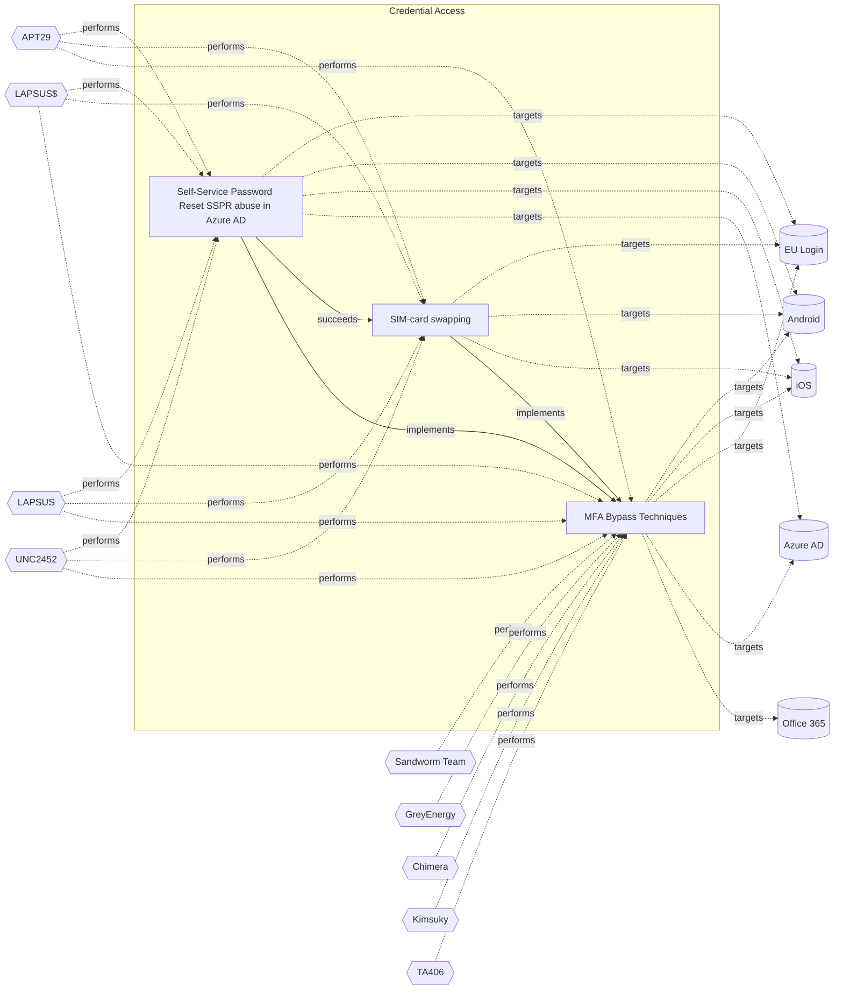

# ☣️ Self-Service Password Reset (SSPR) abuse in Azure AD

🔥 **Criticality:Medium** ❗ : A Medium priority incident may affect public health or safety, national security, economic security, foreign relations, civil liberties, or public confidence. 

🚦 **TLP:CLEAR** ⚪ : Recipients can spread this to the world, there is no limit on disclosure.

🗡️ **ATT&CK Techniques** [T1621 : Multi-Factor Authentication Request Generation](https://attack.mitre.org/techniques/T1621 'Adversaries may attempt to bypass multi-factor authentication MFA mechanisms and gain access to accounts by generating MFA requests sent to usersAdver')

---

`🔑 UUID : a1a17bd4-ec7e-4302-aedf-96ee7c436065` **|** `🏷️ Version : 1` **|** `🗓️ Creation Date : 2024-10-23` **|** `🗓️ Last Modification : 2024-11-13` **|** `Sharing Organisation : {'uuid': '56b0a0f0-b0bc-47d9-bb46-02f80ae2065a', 'name': 'EC DIGIT CSOC'}` **|** `🧱 Schema Identifier : tvm::2.0`

## 👁️ Description

> Self-service password reset (SSPR) is an Azure AD feature that allows users to
> reset their password without the involvement of an administrator or help desk. 
> It is designed for convenience and productivity so that users who forgot their
> password or get locked out can easily reset it themselves with minimal friction.
> 
> Administrators are able to configure SSPR for the entire organization or a subset 
> of groups via the Azure portal. They can also define requirements for permitted 
> forms of verification and the number of verification methods required to perform 
> the reset.
> 
> ## methods
> 
> There are two primary methods through which adversaries have been abusing this tool:
> 
> - SIM swapping to gain initial access
> - Attacker registered MFA to establish persistence
> 
> SIM swapping is an increasingly popular tactic that adversaries use to take 
> control of a target phone number. This typically involves social engineering a
> mobile carrier in order to initiate a number transfer to a new SIM card or
> bribing internal employees to execute a swap. 
> 
> If an adversary controls the card and the organization SSPR is configured to
> only require a single verification method, attackers should have no problem 
> establishing initial access and enroll their own MFA methods for persistence,
> typically mobile authenticator applications or disposable emails.
> 
> 
> ## reconnaisance
> 
> Successful SIM swapping needs sufficient preliminary SSPR reconnaissance to
> identify a viable target. Aside from requiring the information to social engineer
> a mobile carrier, the adversary needs to determine whether or not the target is
> even susceptible to SSPR abuse.
> 
> Given any email address, it is easy to validate if it is a valid Microsoft 365 
> account. The below curl command can be used to determine if a given email address
> is a managed account in Microsoft 365:
> 
> curl -s -X POST https:///login.microsoftonline.com/common/GetCrede... –data ‘{“Username”:”user@domain.com”}’
> 
> Once valid Microsoft 365 accounts are identified, attackers initiate the SSPR flow
> to see which verification options are available. Attackers likely need to perform
> this recon as well if they are going to spend the time and effort performing the
> initial SIM swap.
> 
> The Microsoft interface that appears during a SSPR clearly indicates whether one 
> or two verification methods are required, making it easier for attackers to select
> vulnerable target accounts. 
> 

## 🖥️ Terrain 

 > The administrator of the targeted Azure tenant must have SSPR enabled.
> 

---

## 🕸️ Relations

### 🐲 Actors sightings 

| Actor              | Description                                                                                                                                                                                                                                                                                                                                                                                                                                                                                                                                                                                                                                                                                                                                                                                                                                                                                                                                                                                                                                                                                                                                                                                                                                                                                                                                                                                                                                                                                  | Aliases                                                                                                                                                            | Source                     | Sighting               | Reference                |
|:-------------------|:---------------------------------------------------------------------------------------------------------------------------------------------------------------------------------------------------------------------------------------------------------------------------------------------------------------------------------------------------------------------------------------------------------------------------------------------------------------------------------------------------------------------------------------------------------------------------------------------------------------------------------------------------------------------------------------------------------------------------------------------------------------------------------------------------------------------------------------------------------------------------------------------------------------------------------------------------------------------------------------------------------------------------------------------------------------------------------------------------------------------------------------------------------------------------------------------------------------------------------------------------------------------------------------------------------------------------------------------------------------------------------------------------------------------------------------------------------------------------------------------|:-------------------------------------------------------------------------------------------------------------------------------------------------------------------|:---------------------------|:-----------------------|:-------------------------|
| [Mobile] LAPSUS$   | [LAPSUS$](https://attack.mitre.org/groups/G1004) is cyber criminal threat group that has been active since at least mid-2021. [LAPSUS$](https://attack.mitre.org/groups/G1004) specializes in large-scale social engineering and extortion operations, including destructive attacks without the use of ransomware. The group has targeted organizations globally, including in the government, manufacturing, higher education, energy, healthcare, technology, telecommunications, and media sectors.(Citation: BBC LAPSUS Apr 2022)(Citation: MSTIC DEV-0537 Mar 2022)(Citation: UNIT 42 LAPSUS Mar 2022)                                                                                                                                                                                                                                                                                                                                                                                                                                                                                                                                                                                                                                                                                                                                                                                                                                                                                 | DEV-0537, Strawberry Tempest                                                                                                                                       | 🗡️ MITRE ATT&CK Groups     | No documented sighting | No documented references |
| LAPSUS             | An actor group conducting large-scale social engineering and extortion campaign against multiple organizations with some seeing evidence of destructive elements.                                                                                                                                                                                                                                                                                                                                                                                                                                                                                                                                                                                                                                                                                                                                                                                                                                                                                                                                                                                                                                                                                                                                                                                                                                                                                                                            | LAPSUS$, DEV-0537, SLIPPY SPIDER, Strawberry Tempest                                                                                                               | 🌌 MISP Threat Actor Galaxy | No documented sighting | No documented references |
| [Enterprise] APT29 | [APT29](https://attack.mitre.org/groups/G0016) is threat group that has been attributed to Russia's Foreign Intelligence Service (SVR).(Citation: White House Imposing Costs RU Gov April 2021)(Citation: UK Gov Malign RIS Activity April 2021) They have operated since at least 2008, often targeting government networks in Europe and NATO member countries, research institutes, and think tanks. [APT29](https://attack.mitre.org/groups/G0016) reportedly compromised the Democratic National Committee starting in the summer of 2015.(Citation: F-Secure The Dukes)(Citation: GRIZZLY STEPPE JAR)(Citation: Crowdstrike DNC June 2016)(Citation: UK Gov UK Exposes Russia SolarWinds April 2021)In April 2021, the US and UK governments attributed the [SolarWinds Compromise](https://attack.mitre.org/campaigns/C0024) to the SVR; public statements included citations to [APT29](https://attack.mitre.org/groups/G0016), Cozy Bear, and The Dukes.(Citation: NSA Joint Advisory SVR SolarWinds April 2021)(Citation: UK NSCS Russia SolarWinds April 2021) Industry reporting also referred to the actors involved in this campaign as UNC2452, NOBELIUM, StellarParticle, Dark Halo, and SolarStorm.(Citation: FireEye SUNBURST Backdoor December 2020)(Citation: MSTIC NOBELIUM Mar 2021)(Citation: CrowdStrike SUNSPOT Implant January 2021)(Citation: Volexity SolarWinds)(Citation: Cybersecurity Advisory SVR TTP May 2021)(Citation: Unit 42 SolarStorm December 2020) | Blue Kitsune, Cozy Bear, CozyDuke, Dark Halo, IRON HEMLOCK, IRON RITUAL, Midnight Blizzard, NOBELIUM, NobleBaron, SolarStorm, The Dukes, UNC2452, UNC3524, YTTRIUM | 🗡️ MITRE ATT&CK Groups     | No documented sighting | No documented references |
| UNC2452            | Reporting regarding activity related to the SolarWinds supply chain injection has grown quickly since initial disclosure on 13 December 2020. A significant amount of press reporting has focused on the identification of the actor(s) involved, victim organizations, possible campaign timeline, and potential impact. The US Government and cyber community have also provided detailed information on how the campaign was likely conducted and some of the malware used.  MITRE’s ATT&CK team — with the assistance of contributors — has been mapping techniques used by the actor group, referred to as UNC2452/Dark Halo by FireEye and Volexity respectively, as well as SUNBURST and TEARDROP malware.                                                                                                                                                                                                                                                                                                                                                                                                                                                                                                                                                                                                                                                                                                                                                                            | DarkHalo, StellarParticle, NOBELIUM, Solar Phoenix, Midnight Blizzard                                                                                              | 🌌 MISP Threat Actor Galaxy | No documented sighting | No documented references |

### 🌊 OpenTide Objects
🚫 No related OpenTide objects indexed.

 --- 

### ⛓️ Threat Chaining

Expand chaining data

| ☣️ Vector                                                                                                                                                                                                                                                                                                          | ⛓️ Link                 | 🎯 Target                                                                                                                                                                                                                                   | ⛰️ Terrain                                                                                                                                                                            | 🗡️ ATT&CK                                                                                                                                                                                                                                                                                                                                                                                                                                                                                                                                                                                                                                                                                                                                                                                                                                                                                                                                                                                                                                                                               |
|:-------------------------------------------------------------------------------------------------------------------------------------------------------------------------------------------------------------------------------------------------------------------------------------------------------------------|:------------------------|:-------------------------------------------------------------------------------------------------------------------------------------------------------------------------------------------------------------------------------------------|:--------------------------------------------------------------------------------------------------------------------------------------------------------------------------------------|:----------------------------------------------------------------------------------------------------------------------------------------------------------------------------------------------------------------------------------------------------------------------------------------------------------------------------------------------------------------------------------------------------------------------------------------------------------------------------------------------------------------------------------------------------------------------------------------------------------------------------------------------------------------------------------------------------------------------------------------------------------------------------------------------------------------------------------------------------------------------------------------------------------------------------------------------------------------------------------------------------------------------------------------------------------------------------------------|
| [Self-Service Password Reset (SSPR) abuse in Azure AD](../Threat%20Vectors/☣️%20Self-Service%20Password%20Reset%20(SSPR)%20abuse%20in%20Azure%20AD.md 'Self-service password reset SSPR is an Azure AD feature that allows users toreset their password without the involvement of an administrator or help d...') | `sequence::succeeds`    | [SIM-card swapping](../Threat%20Vectors/☣️%20SIM-card%20swapping.md 'SIM swapping is a malicious technique where threat actors target mobile carriers to gain access tousers bank accounts, virtual currency accounts, and ...')           | Attacker must convince the mobile network operator (e.g. through social networking, forged identification, or insider attacks performed by trusted employees) to issue a new SIM card | [T1541 : Mobile : Foreground Persistence](https://attack.mitre.org/techniques/T1541 'Adversaries may abuse Androids startForeground API method to maintain continuous sensor access Beginning in Android 9, idle applications running in th')                                                                                                                                                                                                                                                                                                                                                                                                                                                                                                                                                                                                                                                                                                                                                                                                                                           |
| [Self-Service Password Reset (SSPR) abuse in Azure AD](../Threat%20Vectors/☣️%20Self-Service%20Password%20Reset%20(SSPR)%20abuse%20in%20Azure%20AD.md 'Self-service password reset SSPR is an Azure AD feature that allows users toreset their password without the involvement of an administrator or help d...') | `atomicity::implements` | [MFA Bypass Techniques](../Threat%20Vectors/☣️%20MFA%20Bypass%20Techniques.md 'MFA is a technique that requires more than one piece of evidence to authorize the user to access a resource If two pieces of evidence are needed to ve...') | Sufficient reconnaissance to identify a target account and MFA technologies being used.                                                                                               | [T1111](https://attack.mitre.org/techniques/T1111 'Adversaries may target multi-factor authentication MFA mechanisms, ie, smart cards, token generators, etc to gain access to credentials that can be us'), [T1621](https://attack.mitre.org/techniques/T1621 'Adversaries may attempt to bypass multi-factor authentication MFA mechanisms and gain access to accounts by generating MFA requests sent to usersAdver'), [T1566.001](https://attack.mitre.org/techniques/T1566/001 'Adversaries may send spearphishing emails with a malicious attachment in an attempt to gain access to victim systems Spearphishing attachment is a spe'), [T1566.002](https://attack.mitre.org/techniques/T1566/002 'Adversaries may send spearphishing emails with a malicious link in an attempt to gain access to victim systems Spearphishing with a link is a specific'), [T1566.004](https://attack.mitre.org/techniques/T1566/004 'Adversaries may use voice communications to ultimately gain access to victim systems Spearphishing voice is a specific variant of spearphishing It is ') |
| [SIM-card swapping](../Threat%20Vectors/☣️%20SIM-card%20swapping.md 'SIM swapping is a malicious technique where threat actors target mobile carriers to gain access tousers bank accounts, virtual currency accounts, and ...')                                                                                   | `atomicity::implements` | [MFA Bypass Techniques](../Threat%20Vectors/☣️%20MFA%20Bypass%20Techniques.md 'MFA is a technique that requires more than one piece of evidence to authorize the user to access a resource If two pieces of evidence are needed to ve...') | Sufficient reconnaissance to identify a target account and MFA technologies being used.                                                                                               | [T1111](https://attack.mitre.org/techniques/T1111 'Adversaries may target multi-factor authentication MFA mechanisms, ie, smart cards, token generators, etc to gain access to credentials that can be us'), [T1621](https://attack.mitre.org/techniques/T1621 'Adversaries may attempt to bypass multi-factor authentication MFA mechanisms and gain access to accounts by generating MFA requests sent to usersAdver'), [T1566.001](https://attack.mitre.org/techniques/T1566/001 'Adversaries may send spearphishing emails with a malicious attachment in an attempt to gain access to victim systems Spearphishing attachment is a spe'), [T1566.002](https://attack.mitre.org/techniques/T1566/002 'Adversaries may send spearphishing emails with a malicious link in an attempt to gain access to victim systems Spearphishing with a link is a specific'), [T1566.004](https://attack.mitre.org/techniques/T1566/004 'Adversaries may use voice communications to ultimately gain access to victim systems Spearphishing voice is a specific variant of spearphishing It is ') |

&nbsp; 

---

## Model Data

#### **⛓️ Cyber Kill Chain**

 > Cyber attacks are typically phased progressions towards strategic objectives. The Unified Kill Chains provides insight into the tactics that hackers employ to attain these objectives. This provides a solid basis to develop (or realign) defensive strategies to raise cyber resilience.

 [`🔑 Credential Access`](https://www.unifiedkillchain.com/assets/The-Unified-Kill-Chain.pdf) : Techniques resulting in the access of, or control over, system, service or domain credentials.

---

#### **🛰️ Domains**

 > Infrastructure technologies domain of interest to attackers.

  - `🏢 Enterprise` : Generic databases, applications, machines and systems that are usually on premises or on Cloud traditional VMs.
 - `📱 Mobile` : Smartphones, tablets and applications running these devices.
 - `☁️ Public Cloud` : Infrastructure handled by a commercial cloud provider. Managed mostly on a service level, and connected over the internet.

---

#### **🎯 Targets**

 > Granular delimited technical entities holding a value to the organization, that are targeted by adversaries. They might be also involved in the detection coverage as the target of log collection. Partially inspired by Veris.

  - [`🔐 Auth token`](http://veriscommunity.net/enums.html#section-asset) : User Device - Authentication token or device
 - [`☁️ Cloud Portal`](http://veriscommunity.net/enums.html#section-asset) : Placeholder
 - [`👤 End-user`](http://veriscommunity.net/enums.html#section-asset) : People - End-user
 - [`👤 Identity Services`](http://veriscommunity.net/enums.html#section-asset) : Placeholder
 - [`📱 Mobile phone`](http://veriscommunity.net/enums.html#section-asset) : User Device - Mobile phone or smartphone

---

#### **💿 Platforms concerned**

 > Actual technologies used by the organization that will be exploited by adversaries during a successful attack, and eventually of relevance for detection. Are named by commercial designation.

  - ` EU Login` : Placeholder
 - ` Android` : Placeholder
 - ` iOS` : Placeholder
 - ` Azure AD` : Placeholder

---

#### **💣 Severity**

 > The severity summarizes the overall danger of incident the vector will provoke, and is to be derived (WIP) from impact, leverage, and difficulty to execute.

 [`🧨 Moderate incident`](https://www.ncsc.gov.uk/news/new-cyber-attack-categorisation-system-improve-uk-response-incidents) : A cyber attack on a small organisation, or which poses a considerable risk to a medium-sized organisation, or preliminary indications of cyber activity against a large organisation or the government.

---

#### **🪄 Leverage acquisition**

 > Technical aftermath of the attack from the target perspective, differentiated from impact as it does not consider the value of the consequence, only what increased control the vector execution provides to the adversary.

  - [`💅 Elevation of privilege`](https://owasp.org/www-community/Threat_Modeling_Process#stride) : Capacity to augment leverage over the target system by upgrading the compromised access rights
 - [`👻 Spoofing`](https://owasp.org/www-community/Threat_Modeling_Process#stride) : Threat action aimed at accessing and use of another user’s credentials, such as username and password.
 - [`⚙️ Modify configuration`](https://owasp.org/www-community/Threat_Modeling_Process#stride) : Modify configuration or services

---

#### **💥 Impact**

 > Analysis of the threat vector from the organizational perspective, in non technical term. This aims at putting a clear denomination on what the attacker will actually be able to act upon if the threat vector is realized.

  - [`🩼 Impairement`](http://veriscommunity.net/enums.html#section-impact) : Incapacitation of a particular key system that will cause disruptions in day-to-day operations, and eventually service delivery.
 - [`🥸 Identity Theft`](http://veriscommunity.net/enums.html#section-impact) : Acquisition of sufficient information and privileges to profess as a given individual, for the purpose of abusing and deceiving human trust relationships.

---

#### **🎲 Vector Viability**

 > Described with estimative language (likelyhood probability), describes how likely the analyst believes the vector to actually be realized on the organization infrastructure. Estimative language describes quality and credibility of underlying sources, data, and methodologies based Intelligence Community Directive 203 (ICD 203) and JP 2-0, Joint Intelligence.

 [`🤔 Unlikely`](https://www.dni.gov/files/documents/ICD/ICD%20203%20Analytic%20Standards.pdf) : Improbable (improbably) - 20-45%

---

### 🔗 References

**🕊️ Publicly available resources**

- [_1_] https://learn.microsoft.com/en-us/entra/identity/authentication/concept-sspr-howitworks
- [_2_] https://techcommunity.microsoft.com/t5/core-infrastructure-and-security/the-adventure-continues-azure-ad-self-service-password-reset/ba-p/810776
- [_3_] https://danielchronlund.com/2019/08/26/measure-your-azure-ad-mfa-and-self-service-password-reset-success/
- [_4_] https://www.obsidiansecurity.com/blog/behind-the-breach-self-service-password-reset-azure-ad/

[1]: https://learn.microsoft.com/en-us/entra/identity/authentication/concept-sspr-howitworks
[2]: https://techcommunity.microsoft.com/t5/core-infrastructure-and-security/the-adventure-continues-azure-ad-self-service-password-reset/ba-p/810776
[3]: https://danielchronlund.com/2019/08/26/measure-your-azure-ad-mfa-and-self-service-password-reset-success/
[4]: https://www.obsidiansecurity.com/blog/behind-the-breach-self-service-password-reset-azure-ad/

---

#### 🏷️ Tags

#-, #-, #-, #
, #
, ##, ##, ##, ##, # , #🏷, #️, # , #T, #a, #g, #s, #
, #

