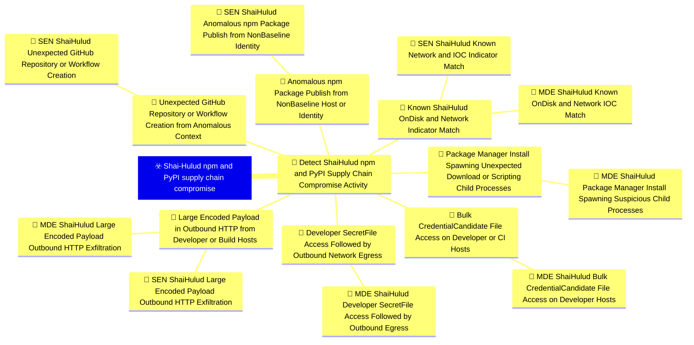
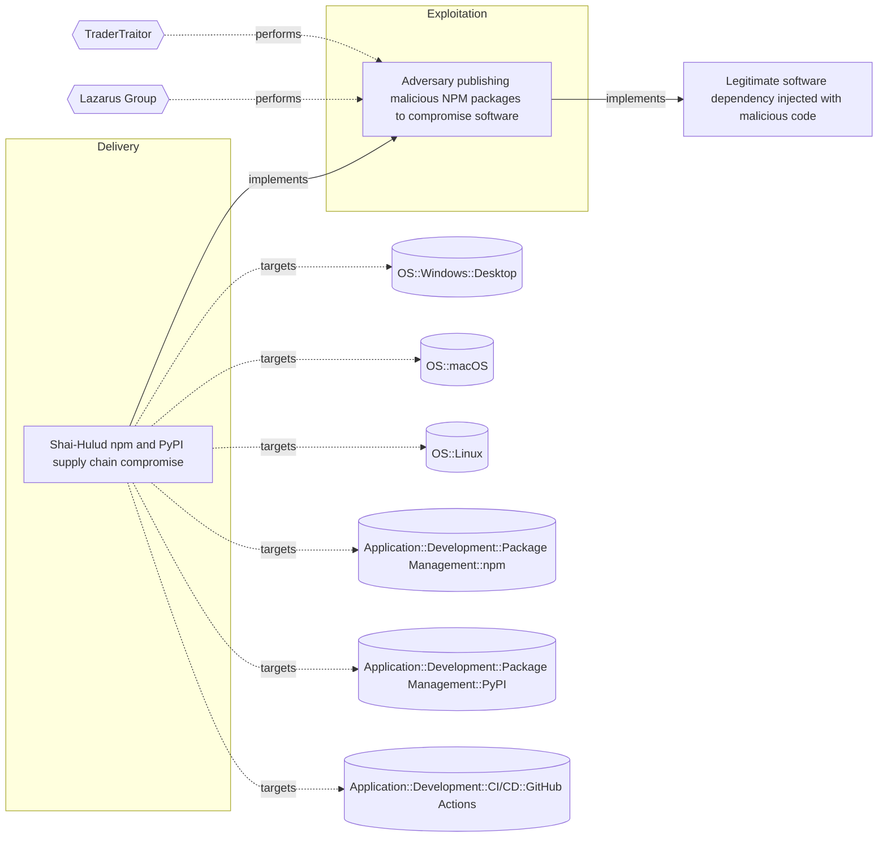

# ☣️ Shai-Hulud npm and PyPI supply chain compromise

🔥 **Criticality:Severe** 🚨 : A Severe priority incident is likely to result in a significant impact to public health or safety, national security, economic security, foreign relations, or civil liberties. 

🚦 **TLP:CLEAR** ⚪ : Recipients can spread this to the world, there is no limit on disclosure.


🗡️ **ATT&CK Techniques** [T1195.001 : Supply Chain Compromise: Compromise Software Dependencies and Development Tools](https://attack.mitre.org/techniques/T1195/001 'Adversaries may manipulate software dependencies and development tools prior to receipt by a final consumer for the purpose of data or system compromi'), [T1195.002 : Supply Chain Compromise: Compromise Software Supply Chain](https://attack.mitre.org/techniques/T1195/002 'Adversaries may manipulate application software prior to receipt by a final consumer for the purpose of data or system compromise Supply chain comprom'), [T1546.016 : Event Triggered Execution: Installer Packages](https://attack.mitre.org/techniques/T1546/016 'Adversaries may establish persistence and elevate privileges by using an installer to trigger the execution of malicious content Installer packages ar'), [T1059.007 : Command and Scripting Interpreter: JavaScript](https://attack.mitre.org/techniques/T1059/007 'Adversaries may abuse various implementations of JavaScript for execution JavaScript JS is a platform-independent scripting language compiled just-in-'), [T1059.006 : Command and Scripting Interpreter: Python](https://attack.mitre.org/techniques/T1059/006 'Adversaries may abuse Python commands and scripts for execution Python is a very popular scriptingprogramming language, with capabilities to perform m'), [T1552.001 : Unsecured Credentials: Credentials In Files](https://attack.mitre.org/techniques/T1552/001 'Adversaries may search local file systems and remote file shares for files containing insecurely stored credentials These can be files created by user'), [T1550.001 : Use Alternate Authentication Material: Application Access Token](https://attack.mitre.org/techniques/T1550/001 'Adversaries may use stolen application access tokens to bypass the typical authentication process and access restricted accounts, information, or serv'), [T1567.002 : Exfiltration Over Web Service: Exfiltration to Cloud Storage](https://attack.mitre.org/techniques/T1567/002 'Adversaries may exfiltrate data to a cloud storage service rather than over their primary command and control channel Cloud storage services allow for'), [T1071.001 : Application Layer Protocol: Web Protocols](https://attack.mitre.org/techniques/T1071/001 'Adversaries may communicate using application layer protocols associated with web traffic to avoid detectionnetwork filtering by blending in with exis'), [T1078 : Valid Accounts](https://attack.mitre.org/techniques/T1078 'Adversaries may obtain and abuse credentials of existing accounts as a means of gaining Initial Access, Persistence, Privilege Escalation, or Defense '), [T1027 : Obfuscated Files or Information](https://attack.mitre.org/techniques/T1027 'Adversaries may attempt to make an executable or file difficult to discover or analyze by encrypting, encoding, or otherwise obfuscating its contents '), [T1547 : Boot or Logon Autostart Execution](https://attack.mitre.org/techniques/T1547 'Adversaries may configure system settings to automatically execute a program during system boot or logon to maintain persistence or gain higher-level '), [T1485 : Data Destruction](https://attack.mitre.org/techniques/T1485 'Adversaries may destroy data and files on specific systems or in large numbers on a network to interrupt availability to systems, services, and networ')


---

`🔑 UUID : 59548b96-9b01-414c-badd-c0bf2ab40d9a` **|** `🏷️ Version : 1` **|** `🗓️ Creation Date : 2026-06-16` **|** `🗓️ Last Modification : 2026-06-16` **|** `Sharing Organisation : {'uuid': '56b0a0f0-b0bc-47d9-bb46-02f80ae2065a', 'name': 'EC DIGIT CSOC'}` **|** `🧱 Schema Identifier : tvm::2.1`


## 👁️ Description

> ## Executive Summary
> 
> On 11 May 2026, a coordinated supply-chain campaign publicly tracked
> as **Shai-Hulud** / **mini Shai-Hulud** compromised packages across the
> npm and PyPI ecosystems. Wiz assesses with high confidence that the
> activity aligns with **TeamPCP**, the cluster behind prior SAP,
> Checkmarx, Bitwarden, Lightning, Intercom, and Trivy compromises.
> Unlike maintainer-credential theft alone, the TanStack wave chained
> GitHub Actions `pull_request_target` cache poisoning with in-memory OIDC
> token extraction on release runners to publish malicious versions
> without stealing npm passwords. Published packages embed lifecycle
> hooks and obfuscated payloads that harvest CI/CD, cloud, Vault,
> Kubernetes, and package-registry credentials, exfiltrate them over
> redundant channels, and **self-propagate** by republishing poisoned
> versions of other packages the victim can write to.
> 
> ## Attack Timeline (UTC) — TanStack anchor incident
> 
> - **2026-05-10 17:16** — Attacker forks `TanStack/router` to
>   `zblgg/configuration` (renamed to evade fork searches).
> - **2026-05-10 23:29** — Malicious commit adds bundled payload under
>   `packages/history/vite_setup.mjs` (cache-poisoning stage).
> - **2026-05-11 ~10:49–11:29** — PR #7378 triggers
>   `pull_request_target` workflows; poisoned pnpm store cached against
>   `main` scope.
> - **2026-05-11 19:20–19:26** — 84 malicious `@tanstack/*` versions
>   (42 packages × 2) published via OIDC trusted publishing, minted
>   from runner memory rather than the intended publish step.
> - **2026-05-11 19:46** — External detection (StepSecurity issue
>   #7383); maintainer response and deprecation begin within ~1 hour.
> - **2026-05-11 22:13–23:55** — npm removes affected tarballs
>   registry-side.
> - **2026-05-11 onward** — Parallel waves against `@uipath/*`,
>   `@mistralai/*`, and additional npm namespaces; PyPI trojans for
>   `guardrails-ai` and `mistralai` observed the same week.
> 
> ## Initial Access and Delivery Vectors
> 
> ### TanStack — GitHub Actions cache poisoning + OIDC abuse
> 
> Three vulnerabilities chained: (1) `pull_request_target` workflow
> checked out and built untrusted fork code; (2) poisoned pnpm store
> written to a cache key later restored by `release.yml` on `main`;
> (3) attacker binaries scraped `/proc/<pid>/mem` for lazily minted OIDC
> tokens (`id-token: write`) and POSTed directly to
> `registry.npmjs.org`, bypassing the workflow's publish step.
> 
> Trojanised tarballs carried:
> - `optionalDependencies` pointing at orphan git commit
>   `github:tanstack/router#79ac49eedf774dd4b0cfa308722bc463cfe5885c`
>   with a malicious `prepare` script.
> - Embedded ~2.3 MB obfuscated `router_init.js` in the package root.
> 
> ### UiPath and related npm waves — preinstall + Bun
> 
> Multiple `@uipath/*` packages used `preinstall: node setup.mjs`,
> downloading the Bun runtime and executing a re-obfuscated payload
> (same C2 infrastructure, different campaign key). This delivery
> mechanism mirrors the earlier SAP compromise pattern.
> 
> ### PyPI — minimal stub, remote stage
> 
> `guardrails-ai@0.10.1` and `mistralai@2.4.6` added short bootstrap
> code that downloads and executes
> `https://git-tanstack[.]com/tmp/transformers.pyz` — a modular Linux-
> only credential stealer (also targets 1Password / Bitwarden vaults).
> 
> ## Payload Behaviour (defender-relevant)
> 
> When lifecycle hooks run during package install, the payload typically:
> 
> 1. Harvests credentials from `.npmrc`, `.env`, `~/.git-credentials`,
>    cloud metadata (AWS IMDSv2, GCP, Azure), Kubernetes service-account
>    tokens, HashiCorp Vault, GitHub / GitLab / CircleCI tokens, and
>    SSH private keys.
> 2. Exfiltrates via **three redundant channels**:
>    - Typosquat domain `git-tanstack[.]com`
>    - Session messenger network (`*.getsession.org`,
>      recipient ID `05f9e609d79eed391015e11380dee4b5c9ead0b6e2e7f0134e6e51767a87323026`)
>    - GitHub API dead drops (repositories with description
>      `Shai-Hulud: Here We Go Again` or `PUSH UR T3MPRR`)
> 3. Self-propagates by searching `registry.npmjs.org/-/v1/search?text=maintainer:`
>    and republishing trojanised versions of packages the victim maintains.
> 4. On developer hosts with high-value `ghp_` / `gho_` tokens, may
>    install persistent `gh-token-monitor` daemon (macOS LaunchAgent or
>    Linux systemd) that polls GitHub every 60 seconds and runs
>    `rm -rf ~/` if the monitored token is revoked — remove the daemon
>    **before** revoking tokens.
> 5. Checks for Russian locale and exits without exfiltration (noise
>    reduction for the operator).
> 
> ## Affected Packages and Versions (representative — not exhaustive)
> 
> ### High-visibility npm namespaces
> 
> - **@tanstack/***: 42 packages, 84 versions (e.g.
>   `@tanstack/react-router@1.169.5`, `@tanstack/react-router@1.169.8`).
>   See TanStack GHSA-g7cv-rxg3-hmpx for the full matrix.
> - **@uipath/***: dozens of packages including `@uipath/apollo-core@5.9.2`
>   (payload bug rendered some variants non-functional per later analysis).
> - **@mistralai/mistralai**: `2.2.2`–`2.2.4` (and related Azure/GCP
>   client packages).
> - Additional npm packages listed in Wiz / Aikido advisories (OpenSearch,
>   Squawk, TallyUI, and others).
> 
> ### PyPI
> 
> - `guardrails-ai@0.10.1`
> - `mistralai@2.4.6`
> 
> ## Indicators of Compromise (IOCs)
> 
> ### File artefacts
> 
> - `router_init.js` (SHA-256 examples:
>   `ab4fcadaec49c03278063dd269ea5eef82d24f2124a8e15d7b90f2fa8601266c`,
>   `2258284d65f63829bd67eaba01ef6f1ada2f593f9bbe41678b2df360bd90d3df`)
> - `setup.mjs` (SHA-256:
>   `2ec78d556d696e208927cc503d48e4b5eb56b31abc2870c2ed2e98d6be27fc96`)
> - `router_runtime.js`, `tanstack_runner.js` (IDE / post-uninstall
>   persistence under `.claude/` or `.vscode/`)
> - `gh-token-monitor` service / LaunchAgent:
>   `~/Library/LaunchAgents/com.user.gh-token-monitor.plist`,
>   `~/.config/systemd/user/gh-token-monitor.service`
> 
> ### Manifest fingerprints
> 
> ```json
> "optionalDependencies": {
>   "@tanstack/setup": "github:tanstack/router#79ac49eedf774dd4b0cfa308722bc463cfe5885c"
> }
> ```
> 
> ```json
> "scripts": { "preinstall": "node setup.mjs" }
> ```
> 
> ### Network indicators
> 
> - C2 domain: `git-tanstack[.]com`
> - PyPI stage URL: `git-tanstack[.]com/tmp/transformers.pyz`
> - C2 IP: `83.142.209[.]194`
> - Session infrastructure: `seed1.getsession.org`,
>   `seed2.getsession.org`, `seed3.getsession.org`,
>   `filev2.getsession.org`
> - Session recipient ID:
>   `05f9e609d79eed391015e11380dee4b5c9ead0b6e2e7f0134e6e51767a87323026`
> 
> ### GitHub dead-drop markers
> 
> - Repository description: `Shai-Hulud: Here We Go Again`
> - Repository description: `PUSH UR T3MPRR` (PyPI variant)
> - Commit message: `IfYouRevokeThisTokenItWillWipeTheComputerOfTheOwner`
> 
> ## Impacted Telemetry / Log Sources
> 
> - Endpoint: process creation with npm/pnpm/yarn/pip parent chains;
>   file reads of `.npmrc`, `.env`, cloud credential paths; outbound
>   HTTP/DNS to indicator domains; persistence file creation.
> - CI/CD: GitHub Actions workflow and cache audit logs; npm publish
>   audit events; OIDC token minting outside expected workflow steps.
> - Cloud / identity: GitHub audit logs (repo creation, workflow changes,
>   package publish); cloud metadata access from build agents.
> - Source control: lockfile / SBOM diffs showing affected versions;
>      presence of `router_init.js` or `setup.mjs` at package roots.
> 
> ## Mitigation and Hardening Recommendations
> 
> 1. **Immediate**
>    - Search lockfiles, SBOMs, and CI logs for affected package versions;
>      pin to known-good releases and regenerate lockfiles from clean state.
>    - Hunt for `router_init.js`, `setup.mjs`, `gh-token-monitor`, and
>      IDE-resident `router_runtime.js` before uninstalling packages.
>    - Remove `gh-token-monitor` persistence **before** revoking GitHub
>      tokens to avoid the home-directory wiper.
>    - Rotate every credential reachable from exposed hosts: GitHub PATs,
>      npm tokens, cloud keys, Vault tokens, Kubernetes service accounts,
>      SSH keys, and CI secrets.
>    - Block egress to `git-tanstack[.]com` and `*.getsession.org`.
> 2. **Hardening**
>    - Eliminate dangerous `pull_request_target` patterns; never checkout
>      untrusted PR code in `pull_request_target` jobs; pin Actions to
>      commit SHAs; scope caches per trust boundary.
>    - Default CI to `npm ci --ignore-scripts` where feasible; gate
>      installs on malicious-package feeds (Socket, StepSecurity, Aikido).
>    - Monitor npm publishes for provenance regressions and anomalous
>      OIDC publish paths on critical scopes.
>    - Subscribe to registry change alerts for packages your organisation
>      maintains or depends on critically.
> 
> ## Key Takeaways for Defenders
> 
> - This campaign is **worm-capable**: compromise of one maintainer or CI
>   runner can cascade into additional poisoned packages without further
>   social engineering.
> - TanStack demonstrated that **OIDC trusted publishing does not
>   prevent publish abuse** when arbitrary code executes on the runner
>   with `id-token: write`.
> - Detection must span **endpoint install-time behaviour**, **secret-
>   file access**, **cloud/GitHub audit telemetry**, and **indicator
>   matching** — no single log source is sufficient.
> - Token revocation can trigger **destructive follow-on behaviour**;
>   sequence containment carefully on developer laptops.
> 


## 🖥️ Terrain 

 > Any organisation, developer workstation, CI/CD runner, or build pipeline
> that resolved affected npm or PyPI package versions during the May 2026
> exposure windows. The TanStack incident alone affected 42 `@tanstack/*`
> packages (84 malicious versions published on 2026-05-11) via poisoned
> GitHub Actions cache and OIDC token extraction on release runners;
> parallel waves hit `@uipath/*`, `@mistralai/*`, and numerous additional
> npm namespaces, plus PyPI packages `guardrails-ai@0.10.1` and
> `mistralai@2.4.6`. Because payloads execute during `npm install`,
> `pnpm install`, `yarn install`, or `pip install`, any host that
> resolved a compromised version during the window must be treated as
> potentially compromised. Self-propagation logic enumerates packages the
> victim maintains and republishes trojanised versions, amplifying blast
> radius beyond the initial namespace.
> 

---

## 🕸️ Relations


### 🌊 OpenTide Objects




 **Descendants** 

| 🎯 Detection Objectives                                                                                                                                                                                                                                                                                                                          | 📡 Detection Objective Signals (7)                                                                                                                                                                                                                                                                                                                                                                                                                                                                                                                                                                                                                                                                                                                                                                                                                                                                                                                                                                                                                                                                                                                                                                                                                                                                                                                                                                                                                                                                                                                                                                                                                                                                                                                                                                                                                                                                                                                                                                                                                                                                                                                                                                                                                                                                                                                                                                                                                                                                                                                                                                                                                                                                                                                                                                                                                                                                                                                                                                                                                                                                                                                                                                                                  | 🚨 Detection Rules (9)                                                                                                                                                                                                                                                                                                                                      | 🛡️ Detection Models    |
|:------------------------------------------------------------------------------------------------------------------------------------------------------------------------------------------------------------------------------------------------------------------------------------------------------------------------------------------------|:-----------------------------------------------------------------------------------------------------------------------------------------------------------------------------------------------------------------------------------------------------------------------------------------------------------------------------------------------------------------------------------------------------------------------------------------------------------------------------------------------------------------------------------------------------------------------------------------------------------------------------------------------------------------------------------------------------------------------------------------------------------------------------------------------------------------------------------------------------------------------------------------------------------------------------------------------------------------------------------------------------------------------------------------------------------------------------------------------------------------------------------------------------------------------------------------------------------------------------------------------------------------------------------------------------------------------------------------------------------------------------------------------------------------------------------------------------------------------------------------------------------------------------------------------------------------------------------------------------------------------------------------------------------------------------------------------------------------------------------------------------------------------------------------------------------------------------------------------------------------------------------------------------------------------------------------------------------------------------------------------------------------------------------------------------------------------------------------------------------------------------------------------------------------------------------------------------------------------------------------------------------------------------------------------------------------------------------------------------------------------------------------------------------------------------------------------------------------------------------------------------------------------------------------------------------------------------------------------------------------------------------------------------------------------------------------------------------------------------------------------------------------------------------------------------------------------------------------------------------------------------------------------------------------------------------------------------------------------------------------------------------------------------------------------------------------------------------------------------------------------------------------------------------------------------------------------------------------------------------|:-----------------------------------------------------------------------------------------------------------------------------------------------------------------------------------------------------------------------------------------------------------------------------------------------------------------------------------------------------------|:-----------------------|
| [Detect Shai-Hulud npm and PyPI Supply Chain Compromise Activity](../Detection%20Objectives/🎯%20Detect%20Shai-Hulud%20npm%20and%20PyPI%20Supply%20Chain%20Compromise%20Activity.md 'This Detection Objective addresses the May 2026 Shai-Hulud  miniShai-Hulud supply-chain campaign affecting npm and PyPI packagesincluding the tanstack...') | [Detect Shai-Hulud npm and PyPI Supply Chain Compromise Activity::Large Encoded Payload in Outbound HTTP from Developer or Build Hosts](Detect%20Shai-Hulud%20npm%20and%20PyPI%20Supply%20Chain%20Compromise%20Activity#large-encoded-payload-in-outbound-http-from-developer-or-build-hosts.md 'Pattern-matching detection for sizeable Base64 or otherwiseencoded HTTP request bodies leaving developer laptops or CIrunners shortly after package-ma...')<br>[Detect Shai-Hulud npm and PyPI Supply Chain Compromise Activity::Unexpected GitHub Repository or Workflow Creation from Anomalous Context](Detect%20Shai-Hulud%20npm%20and%20PyPI%20Supply%20Chain%20Compromise%20Activity#unexpected-github-repository-or-workflow-creation-from-anomalous-context.md 'Event-search detection in GitHub audit and cloud applicationlogs for worm propagation artefacts dead-drop repositories,workflow injection, and publish...')<br>[Detect Shai-Hulud npm and PyPI Supply Chain Compromise Activity::Developer Secret-File Access Followed by Outbound Network Egress](Detect%20Shai-Hulud%20npm%20and%20PyPI%20Supply%20Chain%20Compromise%20Activity#developer-secret-file-access-followed-by-outbound-network-egress.md 'Behavioural correlation detecting a process that reads commondeveloper secret locations and initiates outbound networkconnections within a short windo...')<br>[Detect Shai-Hulud npm and PyPI Supply Chain Compromise Activity::Known Shai-Hulud On-Disk and Network Indicator Match](Detect%20Shai-Hulud%20npm%20and%20PyPI%20Supply%20Chain%20Compromise%20Activity#known-shai-hulud-on-disk-and-network-indicator-match.md 'High-specificity artefact and IOC matching for publicly reportedShai-Hulud indicators  suitable for retrospective sweeps andlive IOC gatesDetection cr...')<br>[Detect Shai-Hulud npm and PyPI Supply Chain Compromise Activity::Anomalous npm Package Publish from Non-Baseline Host or Identity](Detect%20Shai-Hulud%20npm%20and%20PyPI%20Supply%20Chain%20Compromise%20Activity#anomalous-npm-package-publish-from-non-baseline-host-or-identity.md 'Anomaly detection surfacing package publishes that deviate fromestablished maintainer workflow, provenance, or source identity including OIDC publishe...')<br>[Detect Shai-Hulud npm and PyPI Supply Chain Compromise Activity::Package Manager Install Spawning Unexpected Download or Scripting Child Processes](Detect%20Shai-Hulud%20npm%20and%20PyPI%20Supply%20Chain%20Compromise%20Activity#package-manager-install-spawning-unexpected-download-or-scripting-child-processes.md 'Behavioural detection of npm, pnpm, yarn, pip, or Bun installprocesses spawning unexpected child processes consistent withShai-Hulud lifecycle-hook de...')<br>[Detect Shai-Hulud npm and PyPI Supply Chain Compromise Activity::Bulk Credential-Candidate File Access on Developer or CI Hosts](Detect%20Shai-Hulud%20npm%20and%20PyPI%20Supply%20Chain%20Compromise%20Activity#bulk-credential-candidate-file-access-on-developer-or-ci-hosts.md 'Statistical  anomaly detection of a single process recursivelyor iteratively accessing many credential-candidate files withina short interval  indicat...') | [MDE Shai-Hulud Bulk Credential-Candidate File Access on Developer Hosts](../Detection%20Rules/🚨%20MDE%20Shai-Hulud%20Bulk%20Credential-Candidate%20File%20Access%20on%20Developer%20Hosts.md 'DEFENDER_FOR_ENDPOINT   DEVELOPMENT&#013;&#010;&#013;&#010;#### MDR Technical DetailsMicrosoft Defender for Endpoint custom detection implementing DOM...') | ❌ No Detection Models  |


 --- 

### ⛓️ Threat Chaining




<details>
<summary>Expand chaining data</summary>

| ☣️ Vector                                                                                                                                                                                                                                                                                                                                      | ⛓️ Link                 | 🎯 Target                                                                                                                                                                                                                                                                                                                                       | ⛰️ Terrain                                                                                                                                                                                                                                         | 🗡️ ATT&CK                                                                                                                                                                                                                                                                                                                                                                                                                                                                                                                                                                                                                                                                                                                                                                                                                                                                                                                                                                                                                                                                                                                                                                                                                                                                                                                                                                                                                                                                                                         |
|:-----------------------------------------------------------------------------------------------------------------------------------------------------------------------------------------------------------------------------------------------------------------------------------------------------------------------------------------------|:------------------------|:-----------------------------------------------------------------------------------------------------------------------------------------------------------------------------------------------------------------------------------------------------------------------------------------------------------------------------------------------|:---------------------------------------------------------------------------------------------------------------------------------------------------------------------------------------------------------------------------------------------------|:------------------------------------------------------------------------------------------------------------------------------------------------------------------------------------------------------------------------------------------------------------------------------------------------------------------------------------------------------------------------------------------------------------------------------------------------------------------------------------------------------------------------------------------------------------------------------------------------------------------------------------------------------------------------------------------------------------------------------------------------------------------------------------------------------------------------------------------------------------------------------------------------------------------------------------------------------------------------------------------------------------------------------------------------------------------------------------------------------------------------------------------------------------------------------------------------------------------------------------------------------------------------------------------------------------------------------------------------------------------------------------------------------------------------------------------------------------------------------------------------------------------|
| [Shai-Hulud npm and PyPI supply chain compromise](../Threat%20Vectors/☣️%20Shai-Hulud%20npm%20and%20PyPI%20supply%20chain%20compromise.md '## Executive SummaryOn 11 May 2026, a coordinated supply-chain campaign publicly trackedas Shai-Hulud  mini Shai-Hulud compromised packages across the...')                                         | `atomicity::implements` | [Adversary publishing malicious NPM packages to compromise software](../Threat%20Vectors/☣️%20Adversary%20publishing%20malicious%20NPM%20packages%20to%20compromise%20software.md 'Threat actors use a technique which includes updating of NPM packageswith malicious code to deceive a developer or an end-user to downloadand install ...') | Adversary publishing malicious NPM packages to compromise software.                                                                                                                                                                                | [T1195 : Supply Chain Compromise](https://attack.mitre.org/techniques/T1195 'Adversaries may manipulate products or product delivery mechanisms prior to receipt by a final consumer for the purpose of data or system compromiseSu'), [T1082 : System Information Discovery](https://attack.mitre.org/techniques/T1082 'An adversary may attempt to get detailed information about the operating system and hardware, including version, patches, hotfixes, service packs, and'), [T1546.016 : Event Triggered Execution: Installer Packages](https://attack.mitre.org/techniques/T1546/016 'Adversaries may establish persistence and elevate privileges by using an installer to trigger the execution of malicious content Installer packages ar'), [T1036 : Masquerading](https://attack.mitre.org/techniques/T1036 'Adversaries may attempt to manipulate features of their artifacts to make them appear legitimate or benign to users andor security tools Masquerading ')                                                                                                                                                                                                                                                                                                                                                                                                                                                                                                                                |
| [Adversary publishing malicious NPM packages to compromise software](../Threat%20Vectors/☣️%20Adversary%20publishing%20malicious%20NPM%20packages%20to%20compromise%20software.md 'Threat actors use a technique which includes updating of NPM packageswith malicious code to deceive a developer or an end-user to downloadand install ...') | `atomicity::implements` | [Legitimate software dependency injected with malicious code](../Threat%20Vectors/☣️%20Legitimate%20software%20dependency%20injected%20with%20malicious%20code.md 'Legitimate software dependency injected with malicious code refersto a type of attack where an adversary compromises a legitimate softwaredependency, ...')                 | A threat actor uses an already existing vulnerable open-source library component to inject malicious code.  They can use also a build-in or some type of an inherited vulnerability in the vendor's process which allows malicious code injection. | [T1195.002](https://attack.mitre.org/techniques/T1195/002 'Adversaries may manipulate application software prior to receipt by a final consumer for the purpose of data or system compromise Supply chain comprom'), [T1195.001](https://attack.mitre.org/techniques/T1195/001 'Adversaries may manipulate software dependencies and development tools prior to receipt by a final consumer for the purpose of data or system compromi'), [T1204](https://attack.mitre.org/techniques/T1204 'An adversary may rely upon specific actions by a user in order to gain execution Users may be subjected to social engineering to get them to execute m'), [T1218](https://attack.mitre.org/techniques/T1218 'Adversaries may bypass process andor signature-based defenses by proxying execution of malicious content with signed, or otherwise trusted, binaries B'), [T1499](https://attack.mitre.org/techniques/T1499 'Adversaries may perform Endpoint Denial of Service DoS attacks to degrade or block the availability of services to users Endpoint DoS can be performed'), [T1559.002](https://attack.mitre.org/techniques/T1559/002 'Adversaries may use Windows Dynamic Data Exchange DDE to execute arbitrary commands DDE is a client-server protocol for one-time andor continuous inte'), [T1036](https://attack.mitre.org/techniques/T1036 'Adversaries may attempt to manipulate features of their artifacts to make them appear legitimate or benign to users andor security tools Masquerading ') |

</details>
&nbsp; 


---

## Model Data

#### **⛓️ Cyber Kill Chain**

 > Cyber attacks are typically phased progressions towards strategic objectives. The Unified Kill Chains provides insight into the tactics that hackers employ to attain these objectives. This provides a solid basis to develop (or realign) defensive strategies to raise cyber resilience.

 [`📦 Delivery`](https://www.unifiedkillchain.com/assets/The-Unified-Kill-Chain.pdf) : Techniques resulting in the transmission of a weaponized object to the targeted environment.

---

#### **💣 Severity**

 > The severity summarizes the overall danger of incident the vector will provoke, and is to be derived (WIP) from impact, leverage, and difficulty to execute.

 [`🚨 Highly significant incident`](https://www.ncsc.gov.uk/news/new-cyber-attack-categorisation-system-improve-uk-response-incidents) : A cyber attack which has a serious impact on central government, (inter)national essential services, a large proportion of the (inter)national population, or the (inter)national economy.

---

#### **🪄 Leverage acquisition**

 > Technical aftermath of the attack from the target perspective, differentiated from impact as it does not consider the value of the consequence, only what increased control the vector execution provides to the adversary.

  - [`💀 Infrastructure Compromise`](https://owasp.org/www-community/Threat_Modeling_Process#stride) : The compromised target is likely to be used to further expand the sphere of influence of the attacker and allow more potent vectors to be executed.
 - [`🐒 Tampering`](https://owasp.org/www-community/Threat_Modeling_Process#stride) : Threat action intending to maliciously change or modify persistent data, such as records in a database, and the alteration of data in transit between two computers over an open network, such as the Internet.
 - [`📦 Software installation`](https://owasp.org/www-community/Threat_Modeling_Process#stride) : Software installation or code modification
 - [`🔭 Information Gathering`](https://owasp.org/www-community/Threat_Modeling_Process#stride) : Gathering information about the target system, network, or environment to inform subsequent attack phases.
 - [`👁️‍🗨️ Information Disclosure`](https://owasp.org/www-community/Threat_Modeling_Process#stride) : Threat action intending to read a file that one was not granted access to, or to read data in transit.

---

#### **💥 Impact**

 > Analysis of the threat vector from the organizational perspective, in non technical term. This aims at putting a clear denomination on what the attacker will actually be able to act upon if the threat vector is realized.

  - [`🔓 Data Breach`](http://veriscommunity.net/enums.html#section-impact) : Non-public information has been accessed from the outside, and successfully extracted.
 - [`🛑 Business disruption`](http://veriscommunity.net/enums.html#section-impact) : Business disruption
 - [`🤬 Lose Capabilities`](http://veriscommunity.net/enums.html#section-impact) : Vector execution will remove key functions to the organization, which will not be easily circumvented. Most day-to-day is heavily impaired, but processes can reorganize at a loss.
 - [`🌍 Reputational Damages`](http://veriscommunity.net/enums.html#section-impact) : Damages to the organization public view may be achieved by using directly the access gained, or indirectly with data gathered.
 - [`💲 Operating costs`](http://veriscommunity.net/enums.html#section-impact) : Increased operating costs

---

#### **🎲 Vector Viability**

 > Described with estimative language (likelyhood probability), describes how likely the analyst believes the vector to actually be realized on the organization infrastructure. Estimative language describes quality and credibility of underlying sources, data, and methodologies based Intelligence Community Directive 203 (ICD 203) and JP 2-0, Joint Intelligence.

 [`😱 Almost certain`](https://www.dni.gov/files/documents/ICD/ICD%20203%20Analytic%20Standards.pdf) : Nearly certain - 95-99%

---


## 🌐 Threat Surface

- ` OS::Windows::Desktop` — Microsoft Windows desktop editions
- ` OS::macOS` — Apple macOS operating systems (all versions)
- ` OS::Linux` — Linux-based operating systems (all distributions)
- ` Application::Development::Package Management::npm` — npm JavaScript package manager
- ` Application::Development::Package Management::PyPI` — Python Package Index (pip)
- ` Application::Development::CI/CD::GitHub Actions` — GitHub Actions CI/CD workflow automation


### 🔗 References


**🕊️ Publicly available resources**

- [_1_] https://www.wiz.io/blog/mini-shai-hulud-strikes-again-tanstack-more-npm-packages-compromised
- [_2_] https://www.aikido.dev/blog/mini-shai-hulud-is-back-tanstack-compromised
- [_3_] https://tanstack.com/blog/npm-supply-chain-compromise-postmortem
- [_4_] https://www.stepsecurity.io/blog/mini-shai-hulud-is-back-a-self-spreading-supply-chain-attack-hits-the-npm-ecosystem

[1]: https://www.wiz.io/blog/mini-shai-hulud-strikes-again-tanstack-more-npm-packages-compromised
[2]: https://www.aikido.dev/blog/mini-shai-hulud-is-back-tanstack-compromised
[3]: https://tanstack.com/blog/npm-supply-chain-compromise-postmortem
[4]: https://www.stepsecurity.io/blog/mini-shai-hulud-is-back-a-self-spreading-supply-chain-attack-hits-the-npm-ecosystem

---

#### 🏷️ Tags

#-, #-, #-, #
, #
, ##, ##, ##, ##, # , #🏷, #️, # , #T, #a, #g, #s, #
, #


