# ☣️ Social engineering without attachment or URL

🔥 **Criticality:High** ⚠️ : A High priority incident is likely to result in a demonstrable impact to public health or safety, national security, economic security, foreign relations, civil liberties, or public confidence. 

🚦 **TLP:CLEAR** ⚪ : Recipients can spread this to the world, there is no limit on disclosure.

🗡️ **ATT&CK Techniques** [T1589.001 : Gather Victim Identity Information: Credentials](https://attack.mitre.org/techniques/T1589/001 'Adversaries may gather credentials that can be used during targeting Account credentials gathered by adversaries may be those directly associated with')

---

`🔑 UUID : 0cdaee96-8595-4f3f-ba07-758b8be9d359` **|** `🏷️ Version : 2` **|** `🗓️ Creation Date : 2024-10-31` **|** `🗓️ Last Modification : 2025-01-01` **|** `Sharing Organisation : {'uuid': '56b0a0f0-b0bc-47d9-bb46-02f80ae2065a', 'name': 'EC DIGIT CSOC'}` **|** `🧱 Schema Identifier : tvm::2.0`

## 👁️ Description

> TOAD (Telephone-Oriented Attack Delivery) and BEC (Business Email Compromise) attacks 
> are sophisticated forms of social engineering that pose significant threats to organizations. 
> These attacks often bypass traditional email security measures by avoiding the use 
> of malicious attachments or URLs.    
> 
> ## TOAD Attacks    
> 
> TOAD attacks combine email and voice phishing techniques to trick victims into disclosing 
> sensitive information or transferring funds.    
> 
> Key characteristics of TOAD attacks:    
> 
> - Initial contact via email, urging the recipient to call a phone number
> - No malicious attachments or URLs in the email
> - Social engineering tactics used during phone conversations
> - Often impersonate legitimate brands or authority figures    
> 
> ## BEC Attacks    
> 
> BEC attacks involve impersonating or compromising legitimate email accounts to deceive 
> individuals into sharing sensitive information or transferring funds.    
> 
> Key characteristics of BEC attacks:    
> 
> - Highly targeted and personalized emails
> - Often impersonate executives, vendors, or trusted partners
> - Create a sense of urgency
> - Rarely include malicious payloads
> - Frequently target Accounts Payable teams
> 

## 🖥️ Terrain 

 > Adversary must have access to legitimate email accounts or impersonate authority 
> figures to trick victims into disclosing sensitive information or transferring funds.
> 

---

## 🕸️ Relations

### 🐲 Actors sightings 

| Actor         | Description                                                                                                                                                                                                                                                                                                                                                                                                                                                                                                                                                                                                                                                                                                                                                                                                                                                                                                                                                                                                                                                                                                                                                                                                                                                                                | Aliases                                                                                                                                                                                                                                                                                                                                                                                                                                                                                                                                                | Source                     | Sighting               | Reference                |
|:--------------|:-------------------------------------------------------------------------------------------------------------------------------------------------------------------------------------------------------------------------------------------------------------------------------------------------------------------------------------------------------------------------------------------------------------------------------------------------------------------------------------------------------------------------------------------------------------------------------------------------------------------------------------------------------------------------------------------------------------------------------------------------------------------------------------------------------------------------------------------------------------------------------------------------------------------------------------------------------------------------------------------------------------------------------------------------------------------------------------------------------------------------------------------------------------------------------------------------------------------------------------------------------------------------------------------|:-------------------------------------------------------------------------------------------------------------------------------------------------------------------------------------------------------------------------------------------------------------------------------------------------------------------------------------------------------------------------------------------------------------------------------------------------------------------------------------------------------------------------------------------------------|:---------------------------|:-----------------------|:-------------------------|
| [ICS] APT38   | [APT38](https://attack.mitre.org/groups/G0082) is a North Korean state-sponsored threat group that specializes in financial cyber operations; it has been attributed to the Reconnaissance General Bureau.(Citation: CISA AA20-239A BeagleBoyz August 2020) Active since at least 2014, [APT38](https://attack.mitre.org/groups/G0082) has targeted banks, financial institutions, casinos, cryptocurrency exchanges, SWIFT system endpoints, and ATMs in at least 38 countries worldwide. Significant operations include the 2016 Bank of Bangladesh heist, during which [APT38](https://attack.mitre.org/groups/G0082) stole $81 million, as well as attacks against Bancomext (Citation: FireEye APT38 Oct 2018) and Banco de Chile (Citation: FireEye APT38 Oct 2018); some of their attacks have been destructive.(Citation: CISA AA20-239A BeagleBoyz August 2020)(Citation: FireEye APT38 Oct 2018)(Citation: DOJ North Korea Indictment Feb 2021)(Citation: Kaspersky Lazarus Under The Hood Blog 2017)North Korean group definitions are known to have significant overlap, and some security researchers report all North Korean state-sponsored cyber activity under the name [Lazarus Group](https://attack.mitre.org/groups/G0032) instead of tracking clusters or subgroups. | BeagleBoyz, Bluenoroff, COPERNICIUM, NICKEL GLADSTONE, Sapphire Sleet, Stardust Chollima                                                                                                                                                                                                                                                                                                                                                                                                                                                               | 🗡️ MITRE ATT&CK Groups     | No documented sighting | No documented references |
| Lazarus Group | Since 2009, HIDDEN COBRA actors have leveraged their capabilities to target and compromise a range of victims; some intrusions have resulted in the exfiltration of data while others have been disruptive in nature. Commercial reporting has referred to this activity as Lazarus Group and Guardians of Peace. Tools and capabilities used by HIDDEN COBRA actors include DDoS botnets, keyloggers, remote access tools (RATs), and wiper malware. Variants of malware and tools used by HIDDEN COBRA actors include Destover, Duuzer, and Hangman.                                                                                                                                                                                                                                                                                                                                                                                                                                                                                                                                                                                                                                                                                                                                     | Operation DarkSeoul, Dark Seoul, Hidden Cobra, Hastati Group, Andariel, Unit 121, Bureau 121, NewRomanic Cyber Army Team, Bluenoroff, Subgroup: Bluenoroff, Group 77, Labyrinth Chollima, Operation Troy, Operation GhostSecret, Operation AppleJeus, APT38, APT 38, Stardust Chollima, Whois Hacking Team, Zinc, Appleworm, Nickel Academy, APT-C-26, NICKEL GLADSTONE, COVELLITE, ATK3, G0032, ATK117, G0082, Citrine Sleet, DEV-0139, DEV-1222, Diamond Sleet, ZINC, Sapphire Sleet, COPERNICIUM, TA404, Lazarus group, BeagleBoyz, Moonstone Sleet | 🌌 MISP Threat Actor Galaxy | No documented sighting | No documented references |

### 🌊 OpenTide Objects
🚫 No related OpenTide objects indexed.

 --- 

### ⛓️ Threat Chaining

```mermaid

flowchart LR

2900d389-3098-49d3-8166-5b2612d03576[Azure - Gather User Information]
0cdaee96-8595-4f3f-ba07-758b8be9d359[Social engineering without attachment or URL]
58b98d75-fc63-4662-8908-a2a7f4200902[Spearphishing with an attachment extension .rdp]
06c60af1-5fa8-493c-bf9b-6b2e215819f1[Social engineering attack using Microsoft Teams]
dd5d942c-bac4-4000-b9a6-ca4fef6cfb84[Spearphishing Attachment]
1a68b5eb-0112-424d-a21f-88dda0b6b8df[Spearphishing Link]
6a7a493a-511a-4c9d-aa9c-4427c832a322[SIM-card swapping]
4a807ac4-f764-41b1-ae6f-94239041d349[MFA Bypass Techniques]

subgraph Reconnaissance
2900d389-3098-49d3-8166-5b2612d03576
end
subgraph Social Engineering
0cdaee96-8595-4f3f-ba07-758b8be9d359
end
subgraph Delivery
58b98d75-fc63-4662-8908-a2a7f4200902
06c60af1-5fa8-493c-bf9b-6b2e215819f1
dd5d942c-bac4-4000-b9a6-ca4fef6cfb84
1a68b5eb-0112-424d-a21f-88dda0b6b8df
end
subgraph Credential Access
6a7a493a-511a-4c9d-aa9c-4427c832a322
4a807ac4-f764-41b1-ae6f-94239041d349
end

Azure[(Azure)]
AzureAD[(Azure AD)]
Office365[(Office 365)]
AWS[(AWS)]
Windows[(Windows)]
macOS[(macOS)]
Android[(Android)]
iOS[(iOS)]
MicrosoftTeams[(Microsoft Teams)]
Github[(Github)]
Gitlab[(Gitlab)]
EULogin[(EU Login)]
APT28{{APT28}}
Kimsuky{{Kimsuky}}
LazarusGroup{{Lazarus Group}}
MoonstoneSleet{{Moonstone Sleet}}
VoltTyphoon{{Volt Typhoon}}
APT38{{APT38}}
APT29{{APT29}}
UNC2452{{UNC2452}}
WizardSpider{{Wizard Spider}}
UNC1878{{UNC1878}}
GamaredonGroup{{Gamaredon Group}}
MustangPanda{{Mustang Panda}}
RedDelta{{RedDelta}}
TA505{{TA505}}
RomCom{{RomCom}}
APT42{{APT42}}
LAPSUS${{LAPSUS$}}
LAPSUS{{LAPSUS}}
SandwormTeam{{Sandworm Team}}
GreyEnergy{{GreyEnergy}}
Chimera{{Chimera}}
TA406{{TA406}}

2900d389-3098-49d3-8166-5b2612d03576 -.->|targets| Azure
2900d389-3098-49d3-8166-5b2612d03576 -.->|targets| AzureAD
2900d389-3098-49d3-8166-5b2612d03576 -.->|targets| Office365
0cdaee96-8595-4f3f-ba07-758b8be9d359 -.->|targets| AWS
0cdaee96-8595-4f3f-ba07-758b8be9d359 -.->|targets| Azure
0cdaee96-8595-4f3f-ba07-758b8be9d359 -.->|targets| Office365
0cdaee96-8595-4f3f-ba07-758b8be9d359 -.->|targets| Windows
0cdaee96-8595-4f3f-ba07-758b8be9d359 -.->|targets| macOS
0cdaee96-8595-4f3f-ba07-758b8be9d359 -.->|targets| Android
0cdaee96-8595-4f3f-ba07-758b8be9d359 -.->|targets| iOS
58b98d75-fc63-4662-8908-a2a7f4200902 -.->|targets| Windows
58b98d75-fc63-4662-8908-a2a7f4200902 -.->|targets| AWS
06c60af1-5fa8-493c-bf9b-6b2e215819f1 -.->|targets| MicrosoftTeams
dd5d942c-bac4-4000-b9a6-ca4fef6cfb84 -.->|targets| Windows
dd5d942c-bac4-4000-b9a6-ca4fef6cfb84 -.->|targets| Office365
dd5d942c-bac4-4000-b9a6-ca4fef6cfb84 -.->|targets| Android
dd5d942c-bac4-4000-b9a6-ca4fef6cfb84 -.->|targets| iOS
1a68b5eb-0112-424d-a21f-88dda0b6b8df -.->|targets| Windows
1a68b5eb-0112-424d-a21f-88dda0b6b8df -.->|targets| Office365
1a68b5eb-0112-424d-a21f-88dda0b6b8df -.->|targets| Android
1a68b5eb-0112-424d-a21f-88dda0b6b8df -.->|targets| iOS
1a68b5eb-0112-424d-a21f-88dda0b6b8df -.->|targets| Github
1a68b5eb-0112-424d-a21f-88dda0b6b8df -.->|targets| Gitlab
6a7a493a-511a-4c9d-aa9c-4427c832a322 -.->|targets| EULogin
6a7a493a-511a-4c9d-aa9c-4427c832a322 -.->|targets| Android
6a7a493a-511a-4c9d-aa9c-4427c832a322 -.->|targets| iOS
4a807ac4-f764-41b1-ae6f-94239041d349 -.->|targets| Android
4a807ac4-f764-41b1-ae6f-94239041d349 -.->|targets| iOS
4a807ac4-f764-41b1-ae6f-94239041d349 -.->|targets| EULogin
4a807ac4-f764-41b1-ae6f-94239041d349 -.->|targets| AzureAD
4a807ac4-f764-41b1-ae6f-94239041d349 -.->|targets| Office365
APT28 -.-> |performs| 2900d389-3098-49d3-8166-5b2612d03576
Kimsuky -.-> |performs| 2900d389-3098-49d3-8166-5b2612d03576
LazarusGroup -.-> |performs| 2900d389-3098-49d3-8166-5b2612d03576
MoonstoneSleet -.-> |performs| 2900d389-3098-49d3-8166-5b2612d03576
VoltTyphoon -.-> |performs| 2900d389-3098-49d3-8166-5b2612d03576
APT38 -.-> |performs| 0cdaee96-8595-4f3f-ba07-758b8be9d359
LazarusGroup -.-> |performs| 0cdaee96-8595-4f3f-ba07-758b8be9d359
APT29 -.-> |performs| 58b98d75-fc63-4662-8908-a2a7f4200902
UNC2452 -.-> |performs| 58b98d75-fc63-4662-8908-a2a7f4200902
APT29 -.-> |performs| 06c60af1-5fa8-493c-bf9b-6b2e215819f1
UNC2452 -.-> |performs| 06c60af1-5fa8-493c-bf9b-6b2e215819f1
APT29 -.-> |performs| dd5d942c-bac4-4000-b9a6-ca4fef6cfb84
UNC2452 -.-> |performs| dd5d942c-bac4-4000-b9a6-ca4fef6cfb84
WizardSpider -.-> |performs| dd5d942c-bac4-4000-b9a6-ca4fef6cfb84
UNC1878 -.-> |performs| dd5d942c-bac4-4000-b9a6-ca4fef6cfb84
GamaredonGroup -.-> |performs| dd5d942c-bac4-4000-b9a6-ca4fef6cfb84
APT28 -.-> |performs| dd5d942c-bac4-4000-b9a6-ca4fef6cfb84
MustangPanda -.-> |performs| dd5d942c-bac4-4000-b9a6-ca4fef6cfb84
RedDelta -.-> |performs| dd5d942c-bac4-4000-b9a6-ca4fef6cfb84
TA505 -.-> |performs| dd5d942c-bac4-4000-b9a6-ca4fef6cfb84
RomCom -.-> |performs| dd5d942c-bac4-4000-b9a6-ca4fef6cfb84
APT42 -.-> |performs| 1a68b5eb-0112-424d-a21f-88dda0b6b8df
LAPSUS$ -.-> |performs| 6a7a493a-511a-4c9d-aa9c-4427c832a322
LAPSUS -.-> |performs| 6a7a493a-511a-4c9d-aa9c-4427c832a322
APT29 -.-> |performs| 6a7a493a-511a-4c9d-aa9c-4427c832a322
UNC2452 -.-> |performs| 6a7a493a-511a-4c9d-aa9c-4427c832a322
APT29 -.-> |performs| 4a807ac4-f764-41b1-ae6f-94239041d349
UNC2452 -.-> |performs| 4a807ac4-f764-41b1-ae6f-94239041d349
SandwormTeam -.-> |performs| 4a807ac4-f764-41b1-ae6f-94239041d349
GreyEnergy -.-> |performs| 4a807ac4-f764-41b1-ae6f-94239041d349
Chimera -.-> |performs| 4a807ac4-f764-41b1-ae6f-94239041d349
Kimsuky -.-> |performs| 4a807ac4-f764-41b1-ae6f-94239041d349
TA406 -.-> |performs| 4a807ac4-f764-41b1-ae6f-94239041d349
LAPSUS$ -.-> |performs| 4a807ac4-f764-41b1-ae6f-94239041d349
LAPSUS -.-> |performs| 4a807ac4-f764-41b1-ae6f-94239041d349

2900d389-3098-49d3-8166-5b2612d03576 -->|succeeds| 0cdaee96-8595-4f3f-ba07-758b8be9d359
2900d389-3098-49d3-8166-5b2612d03576 -->|succeeds| 58b98d75-fc63-4662-8908-a2a7f4200902
2900d389-3098-49d3-8166-5b2612d03576 -->|succeeds| 06c60af1-5fa8-493c-bf9b-6b2e215819f1
58b98d75-fc63-4662-8908-a2a7f4200902 -->|implements| dd5d942c-bac4-4000-b9a6-ca4fef6cfb84
1a68b5eb-0112-424d-a21f-88dda0b6b8df -->|preceeds| 0cdaee96-8595-4f3f-ba07-758b8be9d359
dd5d942c-bac4-4000-b9a6-ca4fef6cfb84 -->|preceeds| 0cdaee96-8595-4f3f-ba07-758b8be9d359
6a7a493a-511a-4c9d-aa9c-4427c832a322 -->|preceeds| 0cdaee96-8595-4f3f-ba07-758b8be9d359
6a7a493a-511a-4c9d-aa9c-4427c832a322 -->|implements| 4a807ac4-f764-41b1-ae6f-94239041d349

```

Expand chaining data

| ☣️ Vector                                                                                                                                                                                                                                                                                            | ⛓️ Link                 | 🎯 Target                                                                                                                                                                                                                                                                                             | ⛰️ Terrain                                                                                                                                                                                                                                                                                                                                                                                                                                                                                                                                                                                                                                                                                                                                                                                                                                                | 🗡️ ATT&CK                                                                                                                                                                                                                                                                                                                                                                                                                                                                                                                                                                                                                                                                                                                                                                                                                                                                                                                                                                                                                                                                               |
|:-----------------------------------------------------------------------------------------------------------------------------------------------------------------------------------------------------------------------------------------------------------------------------------------------------|:------------------------|:-----------------------------------------------------------------------------------------------------------------------------------------------------------------------------------------------------------------------------------------------------------------------------------------------------|:----------------------------------------------------------------------------------------------------------------------------------------------------------------------------------------------------------------------------------------------------------------------------------------------------------------------------------------------------------------------------------------------------------------------------------------------------------------------------------------------------------------------------------------------------------------------------------------------------------------------------------------------------------------------------------------------------------------------------------------------------------------------------------------------------------------------------------------------------------|:----------------------------------------------------------------------------------------------------------------------------------------------------------------------------------------------------------------------------------------------------------------------------------------------------------------------------------------------------------------------------------------------------------------------------------------------------------------------------------------------------------------------------------------------------------------------------------------------------------------------------------------------------------------------------------------------------------------------------------------------------------------------------------------------------------------------------------------------------------------------------------------------------------------------------------------------------------------------------------------------------------------------------------------------------------------------------------------|
| [Azure - Gather User Information](../Threat%20Vectors/☣️%20Azure%20-%20Gather%20User%20Information.md 'This technique describes how adversaries obtain information about user accounts in Azure Active Directory AAD, which can be leveraged for further atta...')                                   | `sequence::succeeds`    | [Social engineering without attachment or URL](../Threat%20Vectors/☣️%20Social%20engineering%20without%20attachment%20or%20URL.md 'TOAD Telephone-Oriented Attack Delivery and BEC Business Email Compromise attacks are sophisticated forms of social engineering that pose significant ...')       | Adversary must have access to legitimate email accounts or impersonate authority  figures to trick victims into disclosing sensitive information or transferring funds.                                                                                                                                                                                                                                                                                                                                                                                                                                                                                                                                                                                                                                                                                   | [T1589.001 : Gather Victim Identity Information: Credentials](https://attack.mitre.org/techniques/T1589/001 'Adversaries may gather credentials that can be used during targeting Account credentials gathered by adversaries may be those directly associated with')                                                                                                                                                                                                                                                                                                                                                                                                                                                                                                                                                                                                                                                                                                                                                                                                                   |
| [Azure - Gather User Information](../Threat%20Vectors/☣️%20Azure%20-%20Gather%20User%20Information.md 'This technique describes how adversaries obtain information about user accounts in Azure Active Directory AAD, which can be leveraged for further atta...')                                   | `sequence::succeeds`    | [Spearphishing with an attachment extension .rdp](../Threat%20Vectors/☣️%20Spearphishing%20with%20an%20attachment%20extension%20.rdp.md 'Spearphishing with an attachment extension rdp refers to a targetedcyberattack where a malicious actor sends an email containing a filewith the file e...') | A threat actor relies on an email attachment lure. In this case a malicious file is masquerading as a RDP file in an attempt to deceive a victim about their identity and true nature of the file. The spear-phishing attachment provides a threat actor an initial access to the system.                                                                                                                                                                                                                                                                                                                                                                                                                                                                                                                                                                 | [T1566.001 : Phishing: Spearphishing Attachment](https://attack.mitre.org/techniques/T1566/001 'Adversaries may send spearphishing emails with a malicious attachment in an attempt to gain access to victim systems Spearphishing attachment is a spe'), [T1204.002 : User Execution: Malicious File](https://attack.mitre.org/techniques/T1204/002 'An adversary may rely upon a user opening a malicious file in order to gain execution Users may be subjected to social engineering to get them to open'), [T1036 : Masquerading](https://attack.mitre.org/techniques/T1036 'Adversaries may attempt to manipulate features of their artifacts to make them appear legitimate or benign to users andor security tools Masquerading ')                                                                                                                                                                                                                                                                                                                                              |
| [Azure - Gather User Information](../Threat%20Vectors/☣️%20Azure%20-%20Gather%20User%20Information.md 'This technique describes how adversaries obtain information about user accounts in Azure Active Directory AAD, which can be leveraged for further atta...')                                   | `sequence::succeeds`    | [Social engineering attack using Microsoft Teams](../Threat%20Vectors/☣️%20Social%20engineering%20attack%20using%20Microsoft%20Teams.md 'Adversaries are using compromised Microsoft 365 tenants to create technicalsupport-themed domains and send tech support lures via Microsoft Teams, att...') | Attacker has compromised a valid Microsoft 365 tenant to host the lures, and valid valid credentials in targeted M365 tenant too. Targeted organizations must use an app like Microsoft Authenticator as second factor (app taking the code received after successful authentication granted by  the victim, the user, in previous step).                                                                                                                                                                                                                                                                                                                                                                                                                                                                                                                 | [T1199 : Trusted Relationship](https://attack.mitre.org/techniques/T1199 'Adversaries may breach or otherwise leverage organizations who have access to intended victims Access through trusted third party relationship abuses ')                                                                                                                                                                                                                                                                                                                                                                                                                                                                                                                                                                                                                                                                                                                                                                                                                                                      |
| [Spearphishing with an attachment extension .rdp](../Threat%20Vectors/☣️%20Spearphishing%20with%20an%20attachment%20extension%20.rdp.md 'Spearphishing with an attachment extension rdp refers to a targetedcyberattack where a malicious actor sends an email containing a filewith the file e...') | `atomicity::implements` | [Spearphishing Attachment](../Threat%20Vectors/☣️%20Spearphishing%20Attachment.md 'Spearphishing messages are often crafted using pernicious social engineeringtechniquesIn Spearphishing Attachment attacks, recipients receive emails t...')                                                       | Spear phishing requires more preparation and time to achieve success  than a phishing attack. That is because spear-phishing attackers attempt to obtain vast amounts of personal information about their victims.   Attackers can get the personal information they need using different ways:   - to compromise an email or messaging system trough other means, - to use OSINT, sourcing Social Media or glean personal information from the user's online presence. They want to craft emails that look as legitimate and attractive as possible  to increase the chances of fooling their targets, for instance sending a malicious  attachment where the filename references a topic the recipient is interested in. The highly personalized nature of spear-phishing attacks makes it more  difficult to identity than widescale phishing attacks. | [T1566.001 : Phishing: Spearphishing Attachment](https://attack.mitre.org/techniques/T1566/001 'Adversaries may send spearphishing emails with a malicious attachment in an attempt to gain access to victim systems Spearphishing attachment is a spe')                                                                                                                                                                                                                                                                                                                                                                                                                                                                                                                                                                                                                                                                                                                                                                                                                                |
| [Social engineering without attachment or URL](../Threat%20Vectors/☣️%20Social%20engineering%20without%20attachment%20or%20URL.md 'TOAD Telephone-Oriented Attack Delivery and BEC Business Email Compromise attacks are sophisticated forms of social engineering that pose significant ...')       | `sequence::preceeds`    | [Spearphishing Link](../Threat%20Vectors/☣️%20Spearphishing%20Link.md 'Adversaries may send spearphishing emails with a malicious link in anattempt to gain access to victim systems This sub-technique employsthe use of lin...')                                                                   | Spear phishing requires more preparation and time to achieve success than a phishing attack. That is because spear-phishing attackers attempt to obtain vast amounts of personal information about their victims,   the entities their work for, or their areas of interest.    Attackers can get the personal information they need using different ways: to compromise an email or messaging system trough other means, to use OSINT, scouring Social Media or glean personal information from the user's online presence.                                                                                                                                                                                                                                                                                                                              | [T1566.002 : Phishing: Spearphishing Link](https://attack.mitre.org/techniques/T1566/002 'Adversaries may send spearphishing emails with a malicious link in an attempt to gain access to victim systems Spearphishing with a link is a specific'), [T1036 : Masquerading](https://attack.mitre.org/techniques/T1036 'Adversaries may attempt to manipulate features of their artifacts to make them appear legitimate or benign to users andor security tools Masquerading '), [T1656 : Impersonation](https://attack.mitre.org/techniques/T1656 'Adversaries may impersonate a trusted person or organization in order to persuade and trick a target into performing some action on their behalf For e')                                                                                                                                                                                                                                                                                                                                                                             |
| [Social engineering without attachment or URL](../Threat%20Vectors/☣️%20Social%20engineering%20without%20attachment%20or%20URL.md 'TOAD Telephone-Oriented Attack Delivery and BEC Business Email Compromise attacks are sophisticated forms of social engineering that pose significant ...')       | `sequence::preceeds`    | [Spearphishing Attachment](../Threat%20Vectors/☣️%20Spearphishing%20Attachment.md 'Spearphishing messages are often crafted using pernicious social engineeringtechniquesIn Spearphishing Attachment attacks, recipients receive emails t...')                                                       | Spear phishing requires more preparation and time to achieve success  than a phishing attack. That is because spear-phishing attackers attempt to obtain vast amounts of personal information about their victims.   Attackers can get the personal information they need using different ways:   - to compromise an email or messaging system trough other means, - to use OSINT, sourcing Social Media or glean personal information from the user's online presence. They want to craft emails that look as legitimate and attractive as possible  to increase the chances of fooling their targets, for instance sending a malicious  attachment where the filename references a topic the recipient is interested in. The highly personalized nature of spear-phishing attacks makes it more  difficult to identity than widescale phishing attacks. | [T1566.001 : Phishing: Spearphishing Attachment](https://attack.mitre.org/techniques/T1566/001 'Adversaries may send spearphishing emails with a malicious attachment in an attempt to gain access to victim systems Spearphishing attachment is a spe')                                                                                                                                                                                                                                                                                                                                                                                                                                                                                                                                                                                                                                                                                                                                                                                                                                |
| [Social engineering without attachment or URL](../Threat%20Vectors/☣️%20Social%20engineering%20without%20attachment%20or%20URL.md 'TOAD Telephone-Oriented Attack Delivery and BEC Business Email Compromise attacks are sophisticated forms of social engineering that pose significant ...')       | `sequence::preceeds`    | [SIM-card swapping](../Threat%20Vectors/☣️%20SIM-card%20swapping.md 'SIM swapping is a malicious technique where threat actors target mobile carriers to gain access tousers bank accounts, virtual currency accounts, and ...')                                                                     | Attacker must convince the mobile network operator (e.g. through social networking, forged identification, or insider attacks performed by trusted employees) to issue a new SIM card                                                                                                                                                                                                                                                                                                                                                                                                                                                                                                                                                                                                                                                                     | [T1541 : Mobile : Foreground Persistence](https://attack.mitre.org/techniques/T1541 'Adversaries may abuse Androids startForeground API method to maintain continuous sensor access Beginning in Android 9, idle applications running in th')                                                                                                                                                                                                                                                                                                                                                                                                                                                                                                                                                                                                                                                                                                                                                                                                                                           |
| [SIM-card swapping](../Threat%20Vectors/☣️%20SIM-card%20swapping.md 'SIM swapping is a malicious technique where threat actors target mobile carriers to gain access tousers bank accounts, virtual currency accounts, and ...')                                                                     | `atomicity::implements` | [MFA Bypass Techniques](../Threat%20Vectors/☣️%20MFA%20Bypass%20Techniques.md 'MFA is a technique that requires more than one piece of evidence to authorize the user to access a resource If two pieces of evidence are needed to ve...')                                                           | Sufficient reconnaissance to identify a target account and MFA technologies being used.                                                                                                                                                                                                                                                                                                                                                                                                                                                                                                                                                                                                                                                                                                                                                                   | [T1111](https://attack.mitre.org/techniques/T1111 'Adversaries may target multi-factor authentication MFA mechanisms, ie, smart cards, token generators, etc to gain access to credentials that can be us'), [T1621](https://attack.mitre.org/techniques/T1621 'Adversaries may attempt to bypass multi-factor authentication MFA mechanisms and gain access to accounts by generating MFA requests sent to usersAdver'), [T1566.001](https://attack.mitre.org/techniques/T1566/001 'Adversaries may send spearphishing emails with a malicious attachment in an attempt to gain access to victim systems Spearphishing attachment is a spe'), [T1566.002](https://attack.mitre.org/techniques/T1566/002 'Adversaries may send spearphishing emails with a malicious link in an attempt to gain access to victim systems Spearphishing with a link is a specific'), [T1566.004](https://attack.mitre.org/techniques/T1566/004 'Adversaries may use voice communications to ultimately gain access to victim systems Spearphishing voice is a specific variant of spearphishing It is ') |

&nbsp; 

---

## Model Data

#### **⛓️ Cyber Kill Chain**

 > Cyber attacks are typically phased progressions towards strategic objectives. The Unified Kill Chains provides insight into the tactics that hackers employ to attain these objectives. This provides a solid basis to develop (or realign) defensive strategies to raise cyber resilience.

 [`🪝 Social Engineering`](https://www.unifiedkillchain.com/assets/The-Unified-Kill-Chain.pdf) : Techniques aimed at the manipulation of people to perform unsafe actions.

---

#### **🛰️ Domains**

 > Infrastructure technologies domain of interest to attackers.

  - `🏢 Enterprise` : Generic databases, applications, machines and systems that are usually on premises or on Cloud traditional VMs.
 - `🕸️ SaaS` : Subscription based access to software.
 - `📱 Mobile` : Smartphones, tablets and applications running these devices.
 - `🌐 Networking` : Communications backbone connecting users, applications and machines.

---

#### **🎯 Targets**

 > Granular delimited technical entities holding a value to the organization, that are targeted by adversaries. They might be also involved in the detection coverage as the target of log collection. Partially inspired by Veris.

  - [`📧 Email Platform`](http://veriscommunity.net/enums.html#section-asset) : Placeholder
 - [`🪪 Personal Information`](http://veriscommunity.net/enums.html#section-asset) : Placeholder
 - [`🪣 Cloud Storage Accounts`](http://veriscommunity.net/enums.html#section-asset) : Placeholder
 - [`📱 Mobile phone`](http://veriscommunity.net/enums.html#section-asset) : User Device - Mobile phone or smartphone

---

#### **💿 Platforms concerned**

 > Actual technologies used by the organization that will be exploited by adversaries during a successful attack, and eventually of relevance for detection. Are named by commercial designation.

  - ` AWS` : Placeholder
 - ` Azure` : Placeholder
 - ` Office 365` : Placeholder
 - ` Windows` : Placeholder
 - ` macOS` : Placeholder
 - ` Android` : Placeholder
 - ` iOS` : Placeholder

---

#### **💣 Severity**

 > The severity summarizes the overall danger of incident the vector will provoke, and is to be derived (WIP) from impact, leverage, and difficulty to execute.

 [`⚠️ Significant incident`](https://www.ncsc.gov.uk/news/new-cyber-attack-categorisation-system-improve-uk-response-incidents) : A cyber attack which has a serious impact on a large organisation or on wider / local government, or which poses a considerable risk to central government or (inter)national essential services.

---

#### **🪄 Leverage acquisition**

 > Technical aftermath of the attack from the target perspective, differentiated from impact as it does not consider the value of the consequence, only what increased control the vector execution provides to the adversary.

  - [`👻 Spoofing`](https://owasp.org/www-community/Threat_Modeling_Process#stride) : Threat action aimed at accessing and use of another user’s credentials, such as username and password.
 - [`🐒 Tampering`](https://owasp.org/www-community/Threat_Modeling_Process#stride) : Threat action intending to maliciously change or modify persistent data, such as records in a database, and the alteration of data in transit between two computers over an open network, such as the Internet.
 - [`👁️‍🗨️ Information Disclosure`](https://owasp.org/www-community/Threat_Modeling_Process#stride) : Threat action intending to read a file that one was not granted access to, or to read data in transit.
 - [`💅 Elevation of privilege`](https://owasp.org/www-community/Threat_Modeling_Process#stride) : Capacity to augment leverage over the target system by upgrading the compromised access rights
 - [`💱 Fraudulent transaction`](https://owasp.org/www-community/Threat_Modeling_Process#stride) : Initiate fraudulent transaction
 - [`💀 Infrastructure Compromise`](https://owasp.org/www-community/Threat_Modeling_Process#stride) : The compromised target is likely to be used to further expand the sphere of influence of the attacker and allow more potent vectors to be executed.

---

#### **💥 Impact**

 > Analysis of the threat vector from the organizational perspective, in non technical term. This aims at putting a clear denomination on what the attacker will actually be able to act upon if the threat vector is realized.

  - [`🔓 Data Breach`](http://veriscommunity.net/enums.html#section-impact) : Non-public information has been accessed from the outside, and successfully extracted.
 - [`💸 Monetary Loss`](http://veriscommunity.net/enums.html#section-impact) : The vector will directly conduct to loss of value directly impacting the bottom line.
 - [`🌍 Reputational Damages`](http://veriscommunity.net/enums.html#section-impact) : Damages to the organization public view may be achieved by using directly the access gained, or indirectly with data gathered.
 - [`🥸 Identity Theft`](http://veriscommunity.net/enums.html#section-impact) : Acquisition of sufficient information and privileges to profess as a given individual, for the purpose of abusing and deceiving human trust relationships.

---

#### **🎲 Vector Viability**

 > Described with estimative language (likelyhood probability), describes how likely the analyst believes the vector to actually be realized on the organization infrastructure. Estimative language describes quality and credibility of underlying sources, data, and methodologies based Intelligence Community Directive 203 (ICD 203) and JP 2-0, Joint Intelligence.

 [`🧐 Likely`](https://www.dni.gov/files/documents/ICD/ICD%20203%20Analytic%20Standards.pdf) : Probable (probably) - 55-80%

---

### 🔗 References

**🕊️ Publicly available resources**

- [_1_] https://www.proofpoint.com/us/blog/email-and-cloud-threats/actionable-insights-reduce-your-organizations-risk-toad-attack#:~:text=What%20is%20a%20TOAD%20attack%3F%20A%20TOAD%20attack,financial%20data%2C%20by%20impersonating%20a%20trusted%20authority%20figure
- [_2_] https://www.microsoft.com/en-us/security/business/security-101/what-is-business-email-compromise-bec
- [_3_] https://www.fbi.gov/how-we-can-help-you/scams-and-safety/common-scams-and-crimes/business-email-compromise

[1]: https://www.proofpoint.com/us/blog/email-and-cloud-threats/actionable-insights-reduce-your-organizations-risk-toad-attack#:~:text=What%20is%20a%20TOAD%20attack%3F%20A%20TOAD%20attack,financial%20data%2C%20by%20impersonating%20a%20trusted%20authority%20figure
[2]: https://www.microsoft.com/en-us/security/business/security-101/what-is-business-email-compromise-bec
[3]: https://www.fbi.gov/how-we-can-help-you/scams-and-safety/common-scams-and-crimes/business-email-compromise

---

#### 🏷️ Tags

#-, #-, #-, #
, #
, ##, ##, ##, ##, # , #🏷, #️, # , #T, #a, #g, #s, #
, #

