# ☣️ Spearphishing Attachment

🔥 **Criticality:Medium** ❗ : A Medium priority incident may affect public health or safety, national security, economic security, foreign relations, civil liberties, or public confidence. 

🚦 **TLP:CLEAR** ⚪ : Recipients can spread this to the world, there is no limit on disclosure.

🗡️ **ATT&CK Techniques** [T1566.001 : Phishing: Spearphishing Attachment](https://attack.mitre.org/techniques/T1566/001 'Adversaries may send spearphishing emails with a malicious attachment in an attempt to gain access to victim systems Spearphishing attachment is a spe')

---

`🔑 UUID : dd5d942c-bac4-4000-b9a6-ca4fef6cfb84` **|** `🏷️ Version : 3` **|** `🗓️ Creation Date : 2022-03-14` **|** `🗓️ Last Modification : 2025-09-23` **|** `Sharing Organisation : {'uuid': '56b0a0f0-b0bc-47d9-bb46-02f80ae2065a', 'name': 'EC DIGIT CSOC'}` **|** `🧱 Schema Identifier : tvm::2.0`

## 👁️ Description

> Spearphishing messages are often crafted using pernicious social engineering
> techniques.
> 
> In Spearphishing Attachment attacks, recipients receive emails that contain
> malicious attachments. The email message entices users to open the
> attachment(s) using the knowlege gained.
> 
> - displayed sender name is known by the recipient
> - topic/subject is in the field of activity of the recipient
> - urgency of user action (less relevant TTP for spearphishing emails)
> 
> These attachments look like valid files. In some cases, they are disguised
> as MS Office, PDF files or CV files ref [5]. It could be that the attacker
> manage to capture a legit document, weaponise it and send it to (new)
> recipients (it has been observed that such attack can occur within tens of
> minutes after the original legit document was released). In addition, there
> have also been reports of TAMs sending malicious PowerPoint (PPSX) files
> that exploit vulnerabilities and emails with Word document attachments that
> do not require macros to be enabled in order to execute.  
> 
> Attachments may:
> 
> - contain links leading to a page for credential harvesting.
> - be weaponized to install malicious software on the computer of the user or
> run some actions on the device;
> - or open a decoy document. This is quite frequent in attack conducted by TA
> when the malware within the attachment makes some check and assess that the
> was not opened on the targeted organisation. Decoy document are meant to
> evade detection and avoid raising alert or recipient report to cyber
> security team, such as emails with attached Word documents that do not
> require enabling macros to execute.
> 
> ## Common techniques to evade detection
> 
> Attackers may use several way to try to hide visually the true nature of
> the file.
> 
> ### Double extensions
> 
> Attackers may use double extensions to masquerade the true file type to 
> trick users into opening files that might seem safe. But this TTP is quite
> well addressed at front email gateway (blocking by default file with several
> extension, usually also when within a compressed file). 
> 
> ### Password-protected attachment
> 
> Malicious password-protected archive files are designed to deceive users
> and bypass commonly deployed inspection engines to deliver malware and 
> ransomware down to a user endpoint. If the Email Security tool detects a
> password-protected attachment, it will scan the metadata of the file;
> not the content.
> 
> ### Right-to-Left Override (RLTO)
> 
> Another technique is to hide the real file extension is Right-to-Left 
> Override (RLTO). Windows supports languages that are written from right 
> to left using a Unicode character that causes the text that follows it 
> to be displayed in reverse, this method is used to blend the real file 
> extension with the file name.
> 

## 🖥️ Terrain 

 > Spear phishing requires more preparation and time to achieve success 
> than a phishing attack. That is because spear-phishing attackers
> attempt to obtain vast amounts of personal information about their
> victims.  
> Attackers can get the personal information they need using different
> ways:  
> - to compromise an email or messaging system trough other means,
> - to use OSINT, sourcing Social Media or glean personal information
> from the user's online presence.
> They want to craft emails that look as legitimate and attractive as possible 
> to increase the chances of fooling their targets, for instance sending a malicious 
> attachment where the filename references a topic the recipient is interested in.
> The highly personalized nature of spear-phishing attacks makes it more 
> difficult to identity than widescale phishing attacks.
> 

---

## 🕸️ Relations

### 🐲 Actors sightings 

| Actor                        | Description                                                                                                                                                                                                                                                                                                                                                                                                                                                                                                                                                                                                                                                                                                                                                                                                                                                                                                                                                                                                                                                                                                                                                                                                                                                                                                                                                                                                                                                                                                                                                                                                                                                                                                                                                                                                                                      | Aliases                                                                                                                                                                                                                                                                                                   | Source                     | Sighting               | Reference                |
|:-----------------------------|:-------------------------------------------------------------------------------------------------------------------------------------------------------------------------------------------------------------------------------------------------------------------------------------------------------------------------------------------------------------------------------------------------------------------------------------------------------------------------------------------------------------------------------------------------------------------------------------------------------------------------------------------------------------------------------------------------------------------------------------------------------------------------------------------------------------------------------------------------------------------------------------------------------------------------------------------------------------------------------------------------------------------------------------------------------------------------------------------------------------------------------------------------------------------------------------------------------------------------------------------------------------------------------------------------------------------------------------------------------------------------------------------------------------------------------------------------------------------------------------------------------------------------------------------------------------------------------------------------------------------------------------------------------------------------------------------------------------------------------------------------------------------------------------------------------------------------------------------------|:----------------------------------------------------------------------------------------------------------------------------------------------------------------------------------------------------------------------------------------------------------------------------------------------------------|:---------------------------|:-----------------------|:-------------------------|
| [Enterprise] APT29           | [APT29](https://attack.mitre.org/groups/G0016) is threat group that has been attributed to Russia's Foreign Intelligence Service (SVR).(Citation: White House Imposing Costs RU Gov April 2021)(Citation: UK Gov Malign RIS Activity April 2021) They have operated since at least 2008, often targeting government networks in Europe and NATO member countries, research institutes, and think tanks. [APT29](https://attack.mitre.org/groups/G0016) reportedly compromised the Democratic National Committee starting in the summer of 2015.(Citation: F-Secure The Dukes)(Citation: GRIZZLY STEPPE JAR)(Citation: Crowdstrike DNC June 2016)(Citation: UK Gov UK Exposes Russia SolarWinds April 2021)In April 2021, the US and UK governments attributed the [SolarWinds Compromise](https://attack.mitre.org/campaigns/C0024) to the SVR; public statements included citations to [APT29](https://attack.mitre.org/groups/G0016), Cozy Bear, and The Dukes.(Citation: NSA Joint Advisory SVR SolarWinds April 2021)(Citation: UK NSCS Russia SolarWinds April 2021) Industry reporting also referred to the actors involved in this campaign as UNC2452, NOBELIUM, StellarParticle, Dark Halo, and SolarStorm.(Citation: FireEye SUNBURST Backdoor December 2020)(Citation: MSTIC NOBELIUM Mar 2021)(Citation: CrowdStrike SUNSPOT Implant January 2021)(Citation: Volexity SolarWinds)(Citation: Cybersecurity Advisory SVR TTP May 2021)(Citation: Unit 42 SolarStorm December 2020)                                                                                                                                                                                                                                                                                                                                                     | Blue Kitsune, Cozy Bear, CozyDuke, Dark Halo, IRON HEMLOCK, IRON RITUAL, Midnight Blizzard, NOBELIUM, NobleBaron, SolarStorm, The Dukes, UNC2452, UNC3524, YTTRIUM                                                                                                                                        | 🗡️ MITRE ATT&CK Groups     | No documented sighting | No documented references |
| UNC2452                      | Reporting regarding activity related to the SolarWinds supply chain injection has grown quickly since initial disclosure on 13 December 2020. A significant amount of press reporting has focused on the identification of the actor(s) involved, victim organizations, possible campaign timeline, and potential impact. The US Government and cyber community have also provided detailed information on how the campaign was likely conducted and some of the malware used.  MITRE’s ATT&CK team — with the assistance of contributors — has been mapping techniques used by the actor group, referred to as UNC2452/Dark Halo by FireEye and Volexity respectively, as well as SUNBURST and TEARDROP malware.                                                                                                                                                                                                                                                                                                                                                                                                                                                                                                                                                                                                                                                                                                                                                                                                                                                                                                                                                                                                                                                                                                                                | DarkHalo, StellarParticle, NOBELIUM, Solar Phoenix, Midnight Blizzard                                                                                                                                                                                                                                     | 🌌 MISP Threat Actor Galaxy | No documented sighting | No documented references |
| [ICS] Wizard Spider          | [Wizard Spider](https://attack.mitre.org/groups/G0102) is a Russia-based financially motivated threat group originally known for the creation and deployment of [TrickBot](https://attack.mitre.org/software/S0266) since at least 2016. [Wizard Spider](https://attack.mitre.org/groups/G0102) possesses a diverse arsenal of tools and has conducted ransomware campaigns against a variety of organizations, ranging from major corporations to hospitals.(Citation: CrowdStrike Ryuk January 2019)(Citation: DHS/CISA Ransomware Targeting Healthcare October 2020)(Citation: CrowdStrike Wizard Spider October 2020)                                                                                                                                                                                                                                                                                                                                                                                                                                                                                                                                                                                                                                                                                                                                                                                                                                                                                                                                                                                                                                                                                                                                                                                                                        | DEV-0193, FIN12, GOLD BLACKBURN, Grim Spider, ITG23, Periwinkle Tempest, TEMP.MixMaster, UNC1878                                                                                                                                                                                                          | 🗡️ MITRE ATT&CK Groups     | No documented sighting | No documented references |
| UNC1878                      | UNC1878 is a financially motivated threat actor that monetizes network access via the deployment of RYUK ransomware. Earlier this year, Mandiant published a blog on a fast-moving adversary deploying RYUK ransomware, UNC1878. Shortly after its release, there was a significant decrease in observed UNC1878 intrusions and RYUK activity overall almost completely vanishing over the summer. But beginning in early fall, Mandiant has seen a resurgence of RYUK along with TTP overlaps indicating that UNC1878 has returned from the grave and resumed their operations.                                                                                                                                                                                                                                                                                                                                                                                                                                                                                                                                                                                                                                                                                                                                                                                                                                                                                                                                                                                                                                                                                                                                                                                                                                                                 |                                                                                                                                                                                                                                                                                                           | 🌌 MISP Threat Actor Galaxy | No documented sighting | No documented references |
| [Enterprise] Gamaredon Group | [Gamaredon Group](https://attack.mitre.org/groups/G0047) is a suspected Russian cyber espionage threat group that has targeted military, NGO, judiciary, law enforcement, and non-profit organizations in Ukraine since at least 2013. The name [Gamaredon Group](https://attack.mitre.org/groups/G0047) comes from a misspelling of the word "Armageddon", which was detected in the adversary's early campaigns.(Citation: Palo Alto Gamaredon Feb 2017)(Citation: TrendMicro Gamaredon April 2020)(Citation: ESET Gamaredon June 2020)(Citation: Symantec Shuckworm January 2022)(Citation: Microsoft Actinium February 2022)In November 2021, the Ukrainian government publicly attributed [Gamaredon Group](https://attack.mitre.org/groups/G0047) to Russia's Federal Security Service (FSB) Center 18.(Citation: Bleepingcomputer Gamardeon FSB November 2021)(Citation: Microsoft Actinium February 2022)                                                                                                                                                                                                                                                                                                                                                                                                                                                                                                                                                                                                                                                                                                                                                                                                                                                                                                                                | ACTINIUM, Aqua Blizzard, Armageddon, DEV-0157, IRON TILDEN, Primitive Bear, Shuckworm                                                                                                                                                                                                                     | 🗡️ MITRE ATT&CK Groups     | No documented sighting | No documented references |
| Gamaredon Group              | Unit 42 threat researchers have recently observed a threat group distributing new, custom developed malware. We have labelled this threat group the Gamaredon Group and our research shows that the Gamaredon Group has been active since at least 2013.  In the past, the Gamaredon Group has relied heavily on off-the-shelf tools. Our new research shows the Gamaredon Group have made a shift to custom-developed malware. We believe this shift indicates the Gamaredon Group have improved their technical capabilities.                                                                                                                                                                                                                                                                                                                                                                                                                                                                                                                                                                                                                                                                                                                                                                                                                                                                                                                                                                                                                                                                                                                                                                                                                                                                                                                  | ACTINIUM, DEV-0157, Blue Otso, BlueAlpha, G0047, IRON TILDEN, PRIMITIVE BEAR, Shuckworm, Trident Ursa, UAC-0010, Winterflounder, Aqua Blizzard, Actinium                                                                                                                                                  | 🌌 MISP Threat Actor Galaxy | No documented sighting | No documented references |
| [Mobile] APT28               | [APT28](https://attack.mitre.org/groups/G0007) is a threat group that has been attributed to Russia's General Staff Main Intelligence Directorate (GRU) 85th Main Special Service Center (GTsSS) military unit 26165.(Citation: NSA/FBI Drovorub August 2020)(Citation: Cybersecurity Advisory GRU Brute Force Campaign July 2021) This group has been active since at least 2004.(Citation: DOJ GRU Indictment Jul 2018)(Citation: Ars Technica GRU indictment Jul 2018)(Citation: Crowdstrike DNC June 2016)(Citation: FireEye APT28)(Citation: SecureWorks TG-4127)(Citation: FireEye APT28 January 2017)(Citation: GRIZZLY STEPPE JAR)(Citation: Sofacy DealersChoice)(Citation: Palo Alto Sofacy 06-2018)(Citation: Symantec APT28 Oct 2018)(Citation: ESET Zebrocy May 2019)[APT28](https://attack.mitre.org/groups/G0007) reportedly compromised the Hillary Clinton campaign, the Democratic National Committee, and the Democratic Congressional Campaign Committee in 2016 in an attempt to interfere with the U.S. presidential election.(Citation: Crowdstrike DNC June 2016) In 2018, the US indicted five GRU Unit 26165 officers associated with [APT28](https://attack.mitre.org/groups/G0007) for cyber operations (including close-access operations) conducted between 2014 and 2018 against the World Anti-Doping Agency (WADA), the US Anti-Doping Agency, a US nuclear facility, the Organization for the Prohibition of Chemical Weapons (OPCW), the Spiez Swiss Chemicals Laboratory, and other organizations.(Citation: US District Court Indictment GRU Oct 2018) Some of these were conducted with the assistance of GRU Unit 74455, which is also referred to as [Sandworm Team](https://attack.mitre.org/groups/G0034).                                                                                             | FROZENLAKE, Fancy Bear, Forest Blizzard, Group 74, GruesomeLarch, IRON TWILIGHT, Pawn Storm, SNAKEMACKEREL, STRONTIUM, Sednit, Sofacy, Swallowtail, TG-4127, Threat Group-4127, Tsar Team                                                                                                                 | 🗡️ MITRE ATT&CK Groups     | No documented sighting | No documented references |
| APT28                        | The Sofacy Group (also known as APT28, Pawn Storm, Fancy Bear and Sednit) is a cyber espionage group believed to have ties to the Russian government. Likely operating since 2007, the group is known to target government, military, and security organizations. It has been characterized as an advanced persistent threat.                                                                                                                                                                                                                                                                                                                                                                                                                                                                                                                                                                                                                                                                                                                                                                                                                                                                                                                                                                                                                                                                                                                                                                                                                                                                                                                                                                                                                                                                                                                    | Pawn Storm, FANCY BEAR, Sednit, SNAKEMACKEREL, Tsar Team, TG-4127, STRONTIUM, Swallowtail, IRON TWILIGHT, Group 74, SIG40, Grizzly Steppe, G0007, ATK5, Fighting Ursa, ITG05, Blue Athena, TA422, T-APT-12, APT-C-20, UAC-0028, FROZENLAKE, Sofacy, Forest Blizzard, BlueDelta, Fancy Bear, GruesomeLarch | 🌌 MISP Threat Actor Galaxy | No documented sighting | No documented references |
| [Enterprise] Mustang Panda   | [Mustang Panda](https://attack.mitre.org/groups/G0129) is a China-based cyber espionage threat actor that was first observed in 2017 but may have been conducting operations since at least 2014. [Mustang Panda](https://attack.mitre.org/groups/G0129) has targeted government entities, nonprofits, religious, and other non-governmental organizations in the U.S., Europe, Mongolia, Myanmar, Pakistan, and Vietnam, among others.(Citation: Crowdstrike MUSTANG PANDA June 2018)(Citation: Anomali MUSTANG PANDA October 2019)(Citation: Secureworks BRONZE PRESIDENT December 2019)                                                                                                                                                                                                                                                                                                                                                                                                                                                                                                                                                                                                                                                                                                                                                                                                                                                                                                                                                                                                                                                                                                                                                                                                                                                       | BRONZE PRESIDENT, RedDelta, TA416                                                                                                                                                                                                                                                                         | 🗡️ MITRE ATT&CK Groups     | No documented sighting | No documented references |
| RedDelta                     | Likely Chinese state-sponsored threat activity group RedDelta targeting organizations within Europe and Southeast Asia using a customized variant of the PlugX backdoor. Since at least 2019, RedDelta has been consistently active within Southeast Asia, particularly in Myanmar and Vietnam, but has also routinely adapted its targeting in response to global geopolitical events. This is historically evident through the group’s targeting of the Vatican and other Catholic organizations in the lead-up to 2021 talks between Chinese Communist Party (CCP) and Vatican officials, as well as throughout 2022 through the group’s shift towards increased targeting of European government and diplomatic entities following Russia’s invasion of Ukraine.During the 3-month period from September through November 2022, RedDelta has regularly used an infection chain employing malicious shortcut (LNK) files, which trigger a dynamic-link library (DLL) search-order-hijacking execution chain to load consistently updated PlugX versions. Throughout this period, the group repeatedly employed decoy documents specific to government and migration policy within Europe. Of note, we identified a European government department focused on trade communicating with RedDelta command-and-control (C2) infrastructure in early August 2022. This activity commenced on the same day that a RedDelta PlugX sample using this C2 infrastructure and featuring an EU trade-themed decoy document surfaced on public malware repositories. We also identified additional probable victim entities within Myanmar and Vietnam regularly communicating with RedDelta C2 infrastructure.RedDelta closely overlaps with public industry reporting under the aliases BRONZE PRESIDENT, Mustang Panda, TA416, Red Lich, and HoneyMyte. |                                                                                                                                                                                                                                                                                                           | 🌌 MISP Threat Actor Galaxy | No documented sighting | No documented references |
| [Enterprise] TA505           | [TA505](https://attack.mitre.org/groups/G0092) is a cyber criminal group that has been active since at least 2014. [TA505](https://attack.mitre.org/groups/G0092) is known for frequently changing malware, driving global trends in criminal malware distribution, and ransomware campaigns involving [Clop](https://attack.mitre.org/software/S0611).(Citation: Proofpoint TA505 Sep 2017)(Citation: Proofpoint TA505 June 2018)(Citation: Proofpoint TA505 Jan 2019)(Citation: NCC Group TA505)(Citation: Korean FSI TA505 2020)                                                                                                                                                                                                                                                                                                                                                                                                                                                                                                                                                                                                                                                                                                                                                                                                                                                                                                                                                                                                                                                                                                                                                                                                                                                                                                              | CHIMBORAZO, Hive0065, Spandex Tempest                                                                                                                                                                                                                                                                     | 🗡️ MITRE ATT&CK Groups     | No documented sighting | No documented references |
| TA505                        | TA505, the name given by Proofpoint, has been in the cybercrime business for at least four years. This is the group behind the infamous Dridex banking trojan and Locky ransomware, delivered through malicious email campaigns via Necurs botnet. Other malware associated with TA505 include Philadelphia and GlobeImposter ransomware families.                                                                                                                                                                                                                                                                                                                                                                                                                                                                                                                                                                                                                                                                                                                                                                                                                                                                                                                                                                                                                                                                                                                                                                                                                                                                                                                                                                                                                                                                                               | SectorJ04, SectorJ04 Group, GRACEFUL SPIDER, GOLD TAHOE, Dudear, G0092, ATK103, Hive0065, CHIMBORAZO, Spandex Tempest                                                                                                                                                                                     | 🌌 MISP Threat Actor Galaxy | No documented sighting | No documented references |
| RomCom                       | ROMCOM is an evolving and sophisticated threat actor group that has been using the malware tool ROMCOM for espionage and financially motivated attacks. They have targeted organizations in Ukraine and NATO countries, including military personnel, government agencies, and political leaders. The ROMCOM backdoor is capable of stealing sensitive information and deploying other malware, showcasing the group's adaptability and growing sophistication.                                                                                                                                                                                                                                                                                                                                                                                                                                                                                                                                                                                                                                                                                                                                                                                                                                                                                                                                                                                                                                                                                                                                                                                                                                                                                                                                                                                  | Storm-0978, UAT-5647                                                                                                                                                                                                                                                                                      | 🌌 MISP Threat Actor Galaxy | No documented sighting | No documented references |

### 🌊 OpenTide Objects
🚫 No related OpenTide objects indexed.

 --- 

### ⛓️ Threat Chaining

```mermaid

flowchart LR

cce22952-735a-4255-8319-e5e44aef9d85[Windows startup folder abused by malware]
dd5d942c-bac4-4000-b9a6-ca4fef6cfb84[Spearphishing Attachment]
86f62c3a-6556-4a64-a9f5-a79168ad42d9[Abuse Windows Utilities to Side-Load Malicious DLLs]
c7ed4fad-a58f-47da-9938-4a673526b3f4[HTML smuggling technique]
1a68b5eb-0112-424d-a21f-88dda0b6b8df[Spearphishing Link]
53063205-4404-4e6d-a2f5-d566c6085d96[Data collection using SharpHound, SoapHound, Bloodhound and Azurehound]
58b98d75-fc63-4662-8908-a2a7f4200902[Spearphishing with an attachment extension .rdp]
b663b684-a80f-4570-89b6-2f7faa16fece[Abuse of Microsoft Office Applications]
0cdaee96-8595-4f3f-ba07-758b8be9d359[Social engineering without attachment or URL]
6a7a493a-511a-4c9d-aa9c-4427c832a322[SIM-card swapping]
ebdf49a9-52cb-43a5-8849-8110765f4fe1[Suspicious Disk Image Files extracted via File Archiver from Email or Download directory]
b1b6d2d7-0832-46fc-a3e5-6e6411179c45[Pass the Primary Refresh Token PRT]
66aafb61-9a46-4287-8b40-4785b42b77a3[Adversary in the Middle phishing sites to bypass MFA]
5e66f826-4c4b-4357-b9c5-2f40da207f34[Scheduled tasks to maintain persistence in registry]
46a79e6f-3df1-4332-a452-3f1fe83bdaf3[GodFather Banking Trojan]
4a4a7c81-ca98-4761-8f23-7ef6354e9d1c[Android attack using app running on emulator]
99c78650-8e19-4756-90fb-2573242577ca[Mobile device compromised by spyware app]
ef4ba2bf-dfcb-4b70-8f45-7625baeb96d0[Mobile malware attacks targeting iOS]
53ca52ed-a7e7-4094-95ec-b4ef522dc689[VBS script creates a scheduled task]
56500aed-5dec-42a8-a275-f1392abac979[MFA fatigue]
4a807ac4-f764-41b1-ae6f-94239041d349[MFA Bypass Techniques]
4e7eae8e-6615-41f2-bfe1-21a04f7a6088[Azure - Gather Victim Data]
d5039f2c-9fcc-4ba3-ad6a-da8c891ba745[Abuse of Windows Utilities]

subgraph Persistence
cce22952-735a-4255-8319-e5e44aef9d85
5e66f826-4c4b-4357-b9c5-2f40da207f34
53ca52ed-a7e7-4094-95ec-b4ef522dc689
end
subgraph Delivery
dd5d942c-bac4-4000-b9a6-ca4fef6cfb84
1a68b5eb-0112-424d-a21f-88dda0b6b8df
58b98d75-fc63-4662-8908-a2a7f4200902
46a79e6f-3df1-4332-a452-3f1fe83bdaf3
99c78650-8e19-4756-90fb-2573242577ca
end
subgraph Execution
86f62c3a-6556-4a64-a9f5-a79168ad42d9
b663b684-a80f-4570-89b6-2f7faa16fece
ebdf49a9-52cb-43a5-8849-8110765f4fe1
d5039f2c-9fcc-4ba3-ad6a-da8c891ba745
end
subgraph Defense Evasion
c7ed4fad-a58f-47da-9938-4a673526b3f4
4a4a7c81-ca98-4761-8f23-7ef6354e9d1c
end
subgraph Reconnaissance
53063205-4404-4e6d-a2f5-d566c6085d96
4e7eae8e-6615-41f2-bfe1-21a04f7a6088
end
subgraph Social Engineering
0cdaee96-8595-4f3f-ba07-758b8be9d359
end
subgraph Credential Access
6a7a493a-511a-4c9d-aa9c-4427c832a322
66aafb61-9a46-4287-8b40-4785b42b77a3
56500aed-5dec-42a8-a275-f1392abac979
4a807ac4-f764-41b1-ae6f-94239041d349
end
subgraph Objectives
ef4ba2bf-dfcb-4b70-8f45-7625baeb96d0
end

CVE-2025-8088>CVE-2025-8088]
Windows[(Windows)]
Office365[(Office 365)]
Android[(Android)]
iOS[(iOS)]
PowerShell[(PowerShell)]
Github[(Github)]
Gitlab[(Gitlab)]
Azure[(Azure)]
AzureAD[(Azure AD)]
ActiveDirectory[(Active Directory)]
AzureAKS[(Azure AKS)]
Linux[(Linux)]
AWS[(AWS)]
MicrosoftSharePoint[(Microsoft SharePoint)]
OutlookWebAccess[(Outlook Web Access)]
macOS[(macOS)]
EULogin[(EU Login)]
RomCom{{RomCom}}
GamaredonGroup{{Gamaredon Group}}
APT29{{APT29}}
UNC2452{{UNC2452}}
WizardSpider{{Wizard Spider}}
UNC1878{{UNC1878}}
APT28{{APT28}}
MustangPanda{{Mustang Panda}}
RedDelta{{RedDelta}}
TA505{{TA505}}
FIN7{{FIN7}}
APT38{{APT38}}
LazarusGroup{{Lazarus Group}}
APT42{{APT42}}
WIZARDSPIDER{{WIZARD SPIDER}}
LAPSUS${{LAPSUS$}}
LAPSUS{{LAPSUS}}
Storm-0829{{Storm-0829}}
HAFNIUM{{HAFNIUM}}
FoxKitten{{Fox Kitten}}
DarkHotel{{DarkHotel}}
SaintBear{{Saint Bear}}
MuddyWater{{MuddyWater}}
Chimera{{Chimera}}
Kimsuky{{Kimsuky}}
TA406{{TA406}}
SandwormTeam{{Sandworm Team}}
GreyEnergy{{GreyEnergy}}
APT32{{APT32}}
FIN13{{FIN13}}
HEXANE{{HEXANE}}
MagicHound{{Magic Hound}}
OperationWocao{{Operation Wocao}}
StarBlizzard{{Star Blizzard}}
VoltTyphoon{{Volt Typhoon}}

cce22952-735a-4255-8319-e5e44aef9d85 -.->|exploits| CVE-2025-8088
cce22952-735a-4255-8319-e5e44aef9d85 -.->|targets| Windows
dd5d942c-bac4-4000-b9a6-ca4fef6cfb84 -.->|targets| Windows
dd5d942c-bac4-4000-b9a6-ca4fef6cfb84 -.->|targets| Office365
dd5d942c-bac4-4000-b9a6-ca4fef6cfb84 -.->|targets| Android
dd5d942c-bac4-4000-b9a6-ca4fef6cfb84 -.->|targets| iOS
86f62c3a-6556-4a64-a9f5-a79168ad42d9 -.->|targets| Windows
86f62c3a-6556-4a64-a9f5-a79168ad42d9 -.->|targets| PowerShell
c7ed4fad-a58f-47da-9938-4a673526b3f4 -.->|targets| Windows
c7ed4fad-a58f-47da-9938-4a673526b3f4 -.->|targets| iOS
c7ed4fad-a58f-47da-9938-4a673526b3f4 -.->|targets| Android
1a68b5eb-0112-424d-a21f-88dda0b6b8df -.->|targets| Windows
1a68b5eb-0112-424d-a21f-88dda0b6b8df -.->|targets| Office365
1a68b5eb-0112-424d-a21f-88dda0b6b8df -.->|targets| Android
1a68b5eb-0112-424d-a21f-88dda0b6b8df -.->|targets| iOS
1a68b5eb-0112-424d-a21f-88dda0b6b8df -.->|targets| Github
1a68b5eb-0112-424d-a21f-88dda0b6b8df -.->|targets| Gitlab
53063205-4404-4e6d-a2f5-d566c6085d96 -.->|targets| Azure
53063205-4404-4e6d-a2f5-d566c6085d96 -.->|targets| AzureAD
53063205-4404-4e6d-a2f5-d566c6085d96 -.->|targets| Windows
53063205-4404-4e6d-a2f5-d566c6085d96 -.->|targets| ActiveDirectory
53063205-4404-4e6d-a2f5-d566c6085d96 -.->|targets| AzureAKS
53063205-4404-4e6d-a2f5-d566c6085d96 -.->|targets| Linux
58b98d75-fc63-4662-8908-a2a7f4200902 -.->|targets| Windows
58b98d75-fc63-4662-8908-a2a7f4200902 -.->|targets| AWS
b663b684-a80f-4570-89b6-2f7faa16fece -.->|targets| Windows
b663b684-a80f-4570-89b6-2f7faa16fece -.->|targets| Office365
b663b684-a80f-4570-89b6-2f7faa16fece -.->|targets| MicrosoftSharePoint
b663b684-a80f-4570-89b6-2f7faa16fece -.->|targets| OutlookWebAccess
0cdaee96-8595-4f3f-ba07-758b8be9d359 -.->|targets| AWS
0cdaee96-8595-4f3f-ba07-758b8be9d359 -.->|targets| Azure
0cdaee96-8595-4f3f-ba07-758b8be9d359 -.->|targets| Office365
0cdaee96-8595-4f3f-ba07-758b8be9d359 -.->|targets| Windows
0cdaee96-8595-4f3f-ba07-758b8be9d359 -.->|targets| macOS
0cdaee96-8595-4f3f-ba07-758b8be9d359 -.->|targets| Android
0cdaee96-8595-4f3f-ba07-758b8be9d359 -.->|targets| iOS
6a7a493a-511a-4c9d-aa9c-4427c832a322 -.->|targets| EULogin
6a7a493a-511a-4c9d-aa9c-4427c832a322 -.->|targets| Android
6a7a493a-511a-4c9d-aa9c-4427c832a322 -.->|targets| iOS
ebdf49a9-52cb-43a5-8849-8110765f4fe1 -.->|targets| macOS
ebdf49a9-52cb-43a5-8849-8110765f4fe1 -.->|targets| Linux
ebdf49a9-52cb-43a5-8849-8110765f4fe1 -.->|targets| Windows
b1b6d2d7-0832-46fc-a3e5-6e6411179c45 -.->|targets| Azure
b1b6d2d7-0832-46fc-a3e5-6e6411179c45 -.->|targets| Windows
b1b6d2d7-0832-46fc-a3e5-6e6411179c45 -.->|targets| AzureAD
b1b6d2d7-0832-46fc-a3e5-6e6411179c45 -.->|targets| Office365
66aafb61-9a46-4287-8b40-4785b42b77a3 -.->|targets| Office365
5e66f826-4c4b-4357-b9c5-2f40da207f34 -.->|targets| Windows
46a79e6f-3df1-4332-a452-3f1fe83bdaf3 -.->|targets| Android
4a4a7c81-ca98-4761-8f23-7ef6354e9d1c -.->|targets| Android
99c78650-8e19-4756-90fb-2573242577ca -.->|targets| Android
99c78650-8e19-4756-90fb-2573242577ca -.->|targets| iOS
ef4ba2bf-dfcb-4b70-8f45-7625baeb96d0 -.->|targets| iOS
53ca52ed-a7e7-4094-95ec-b4ef522dc689 -.->|targets| Windows
56500aed-5dec-42a8-a275-f1392abac979 -.->|targets| EULogin
4a807ac4-f764-41b1-ae6f-94239041d349 -.->|targets| Android
4a807ac4-f764-41b1-ae6f-94239041d349 -.->|targets| iOS
4a807ac4-f764-41b1-ae6f-94239041d349 -.->|targets| EULogin
4a807ac4-f764-41b1-ae6f-94239041d349 -.->|targets| AzureAD
4a807ac4-f764-41b1-ae6f-94239041d349 -.->|targets| Office365
4e7eae8e-6615-41f2-bfe1-21a04f7a6088 -.->|targets| Azure
4e7eae8e-6615-41f2-bfe1-21a04f7a6088 -.->|targets| AzureAD
4e7eae8e-6615-41f2-bfe1-21a04f7a6088 -.->|targets| Office365
d5039f2c-9fcc-4ba3-ad6a-da8c891ba745 -.->|targets| Windows
RomCom -.-> |performs| cce22952-735a-4255-8319-e5e44aef9d85
GamaredonGroup -.-> |performs| cce22952-735a-4255-8319-e5e44aef9d85
APT29 -.-> |performs| dd5d942c-bac4-4000-b9a6-ca4fef6cfb84
UNC2452 -.-> |performs| dd5d942c-bac4-4000-b9a6-ca4fef6cfb84
WizardSpider -.-> |performs| dd5d942c-bac4-4000-b9a6-ca4fef6cfb84
UNC1878 -.-> |performs| dd5d942c-bac4-4000-b9a6-ca4fef6cfb84
GamaredonGroup -.-> |performs| dd5d942c-bac4-4000-b9a6-ca4fef6cfb84
APT28 -.-> |performs| dd5d942c-bac4-4000-b9a6-ca4fef6cfb84
MustangPanda -.-> |performs| dd5d942c-bac4-4000-b9a6-ca4fef6cfb84
RedDelta -.-> |performs| dd5d942c-bac4-4000-b9a6-ca4fef6cfb84
TA505 -.-> |performs| dd5d942c-bac4-4000-b9a6-ca4fef6cfb84
RomCom -.-> |performs| dd5d942c-bac4-4000-b9a6-ca4fef6cfb84
FIN7 -.-> |performs| 86f62c3a-6556-4a64-a9f5-a79168ad42d9
APT38 -.-> |performs| 86f62c3a-6556-4a64-a9f5-a79168ad42d9
LazarusGroup -.-> |performs| 86f62c3a-6556-4a64-a9f5-a79168ad42d9
APT29 -.-> |performs| 86f62c3a-6556-4a64-a9f5-a79168ad42d9
UNC2452 -.-> |performs| 86f62c3a-6556-4a64-a9f5-a79168ad42d9
APT29 -.-> |performs| c7ed4fad-a58f-47da-9938-4a673526b3f4
APT42 -.-> |performs| 1a68b5eb-0112-424d-a21f-88dda0b6b8df
WIZARDSPIDER -.-> |performs| 53063205-4404-4e6d-a2f5-d566c6085d96
APT29 -.-> |performs| 53063205-4404-4e6d-a2f5-d566c6085d96
TA505 -.-> |performs| 53063205-4404-4e6d-a2f5-d566c6085d96
APT29 -.-> |performs| 58b98d75-fc63-4662-8908-a2a7f4200902
UNC2452 -.-> |performs| 58b98d75-fc63-4662-8908-a2a7f4200902
APT28 -.-> |performs| b663b684-a80f-4570-89b6-2f7faa16fece
APT29 -.-> |performs| b663b684-a80f-4570-89b6-2f7faa16fece
UNC2452 -.-> |performs| b663b684-a80f-4570-89b6-2f7faa16fece
FIN7 -.-> |performs| b663b684-a80f-4570-89b6-2f7faa16fece
TA505 -.-> |performs| b663b684-a80f-4570-89b6-2f7faa16fece
WizardSpider -.-> |performs| b663b684-a80f-4570-89b6-2f7faa16fece
UNC1878 -.-> |performs| b663b684-a80f-4570-89b6-2f7faa16fece
APT38 -.-> |performs| 0cdaee96-8595-4f3f-ba07-758b8be9d359
LazarusGroup -.-> |performs| 0cdaee96-8595-4f3f-ba07-758b8be9d359
LAPSUS$ -.-> |performs| 6a7a493a-511a-4c9d-aa9c-4427c832a322
LAPSUS -.-> |performs| 6a7a493a-511a-4c9d-aa9c-4427c832a322
APT29 -.-> |performs| 6a7a493a-511a-4c9d-aa9c-4427c832a322
UNC2452 -.-> |performs| 6a7a493a-511a-4c9d-aa9c-4427c832a322
APT29 -.-> |performs| ebdf49a9-52cb-43a5-8849-8110765f4fe1
UNC2452 -.-> |performs| ebdf49a9-52cb-43a5-8849-8110765f4fe1
WizardSpider -.-> |performs| ebdf49a9-52cb-43a5-8849-8110765f4fe1
UNC1878 -.-> |performs| ebdf49a9-52cb-43a5-8849-8110765f4fe1
TA505 -.-> |performs| ebdf49a9-52cb-43a5-8849-8110765f4fe1
Storm-0829 -.-> |performs| 66aafb61-9a46-4287-8b40-4785b42b77a3
HAFNIUM -.-> |performs| 5e66f826-4c4b-4357-b9c5-2f40da207f34
FoxKitten -.-> |performs| 5e66f826-4c4b-4357-b9c5-2f40da207f34
APT29 -.-> |performs| 5e66f826-4c4b-4357-b9c5-2f40da207f34
UNC2452 -.-> |performs| 5e66f826-4c4b-4357-b9c5-2f40da207f34
DarkHotel -.-> |performs| 46a79e6f-3df1-4332-a452-3f1fe83bdaf3
SaintBear -.-> |performs| 46a79e6f-3df1-4332-a452-3f1fe83bdaf3
MuddyWater -.-> |performs| 99c78650-8e19-4756-90fb-2573242577ca
FIN7 -.-> |performs| 53ca52ed-a7e7-4094-95ec-b4ef522dc689
LazarusGroup -.-> |performs| 53ca52ed-a7e7-4094-95ec-b4ef522dc689
APT29 -.-> |performs| 53ca52ed-a7e7-4094-95ec-b4ef522dc689
Chimera -.-> |performs| 56500aed-5dec-42a8-a275-f1392abac979
Kimsuky -.-> |performs| 56500aed-5dec-42a8-a275-f1392abac979
TA406 -.-> |performs| 56500aed-5dec-42a8-a275-f1392abac979
LAPSUS$ -.-> |performs| 56500aed-5dec-42a8-a275-f1392abac979
LAPSUS -.-> |performs| 56500aed-5dec-42a8-a275-f1392abac979
APT29 -.-> |performs| 56500aed-5dec-42a8-a275-f1392abac979
UNC2452 -.-> |performs| 56500aed-5dec-42a8-a275-f1392abac979
APT29 -.-> |performs| 4a807ac4-f764-41b1-ae6f-94239041d349
UNC2452 -.-> |performs| 4a807ac4-f764-41b1-ae6f-94239041d349
SandwormTeam -.-> |performs| 4a807ac4-f764-41b1-ae6f-94239041d349
GreyEnergy -.-> |performs| 4a807ac4-f764-41b1-ae6f-94239041d349
Chimera -.-> |performs| 4a807ac4-f764-41b1-ae6f-94239041d349
Kimsuky -.-> |performs| 4a807ac4-f764-41b1-ae6f-94239041d349
TA406 -.-> |performs| 4a807ac4-f764-41b1-ae6f-94239041d349
LAPSUS$ -.-> |performs| 4a807ac4-f764-41b1-ae6f-94239041d349
LAPSUS -.-> |performs| 4a807ac4-f764-41b1-ae6f-94239041d349
APT32 -.-> |performs| 4e7eae8e-6615-41f2-bfe1-21a04f7a6088
FIN13 -.-> |performs| 4e7eae8e-6615-41f2-bfe1-21a04f7a6088
HEXANE -.-> |performs| 4e7eae8e-6615-41f2-bfe1-21a04f7a6088
LAPSUS -.-> |performs| 4e7eae8e-6615-41f2-bfe1-21a04f7a6088
MagicHound -.-> |performs| 4e7eae8e-6615-41f2-bfe1-21a04f7a6088
OperationWocao -.-> |performs| 4e7eae8e-6615-41f2-bfe1-21a04f7a6088
StarBlizzard -.-> |performs| 4e7eae8e-6615-41f2-bfe1-21a04f7a6088
VoltTyphoon -.-> |performs| 4e7eae8e-6615-41f2-bfe1-21a04f7a6088
APT29 -.-> |performs| d5039f2c-9fcc-4ba3-ad6a-da8c891ba745
UNC2452 -.-> |performs| d5039f2c-9fcc-4ba3-ad6a-da8c891ba745
WizardSpider -.-> |performs| d5039f2c-9fcc-4ba3-ad6a-da8c891ba745
UNC1878 -.-> |performs| d5039f2c-9fcc-4ba3-ad6a-da8c891ba745
APT38 -.-> |performs| d5039f2c-9fcc-4ba3-ad6a-da8c891ba745
LazarusGroup -.-> |performs| d5039f2c-9fcc-4ba3-ad6a-da8c891ba745

cce22952-735a-4255-8319-e5e44aef9d85 -->|succeeds| dd5d942c-bac4-4000-b9a6-ca4fef6cfb84
cce22952-735a-4255-8319-e5e44aef9d85 -->|implements| 86f62c3a-6556-4a64-a9f5-a79168ad42d9
c7ed4fad-a58f-47da-9938-4a673526b3f4 -->|succeeds| dd5d942c-bac4-4000-b9a6-ca4fef6cfb84
c7ed4fad-a58f-47da-9938-4a673526b3f4 -->|succeeds| 1a68b5eb-0112-424d-a21f-88dda0b6b8df
53063205-4404-4e6d-a2f5-d566c6085d96 -->|succeeds| dd5d942c-bac4-4000-b9a6-ca4fef6cfb84
53063205-4404-4e6d-a2f5-d566c6085d96 -->|succeeds| 1a68b5eb-0112-424d-a21f-88dda0b6b8df
58b98d75-fc63-4662-8908-a2a7f4200902 -->|implements| dd5d942c-bac4-4000-b9a6-ca4fef6cfb84
b663b684-a80f-4570-89b6-2f7faa16fece -->|succeeds| dd5d942c-bac4-4000-b9a6-ca4fef6cfb84
dd5d942c-bac4-4000-b9a6-ca4fef6cfb84 -->|preceeds| 0cdaee96-8595-4f3f-ba07-758b8be9d359
1a68b5eb-0112-424d-a21f-88dda0b6b8df -->|preceeds| 0cdaee96-8595-4f3f-ba07-758b8be9d359
6a7a493a-511a-4c9d-aa9c-4427c832a322 -->|preceeds| 0cdaee96-8595-4f3f-ba07-758b8be9d359
ebdf49a9-52cb-43a5-8849-8110765f4fe1 -->|enabling| dd5d942c-bac4-4000-b9a6-ca4fef6cfb84
dd5d942c-bac4-4000-b9a6-ca4fef6cfb84 -->|preceeds| b1b6d2d7-0832-46fc-a3e5-6e6411179c45
66aafb61-9a46-4287-8b40-4785b42b77a3 -->|preceeds| b1b6d2d7-0832-46fc-a3e5-6e6411179c45
5e66f826-4c4b-4357-b9c5-2f40da207f34 -->|succeeds| dd5d942c-bac4-4000-b9a6-ca4fef6cfb84
46a79e6f-3df1-4332-a452-3f1fe83bdaf3 -->|succeeds| dd5d942c-bac4-4000-b9a6-ca4fef6cfb84
46a79e6f-3df1-4332-a452-3f1fe83bdaf3 -->|succeeds| 1a68b5eb-0112-424d-a21f-88dda0b6b8df
46a79e6f-3df1-4332-a452-3f1fe83bdaf3 <-->|synergize| 4a4a7c81-ca98-4761-8f23-7ef6354e9d1c
99c78650-8e19-4756-90fb-2573242577ca -->|enabled| 46a79e6f-3df1-4332-a452-3f1fe83bdaf3
dd5d942c-bac4-4000-b9a6-ca4fef6cfb84 -->|preceeds| ef4ba2bf-dfcb-4b70-8f45-7625baeb96d0
1a68b5eb-0112-424d-a21f-88dda0b6b8df -->|preceeds| ef4ba2bf-dfcb-4b70-8f45-7625baeb96d0
99c78650-8e19-4756-90fb-2573242577ca -->|preceeds| ef4ba2bf-dfcb-4b70-8f45-7625baeb96d0
53ca52ed-a7e7-4094-95ec-b4ef522dc689 -->|succeeds| dd5d942c-bac4-4000-b9a6-ca4fef6cfb84
53ca52ed-a7e7-4094-95ec-b4ef522dc689 -->|succeeds| c7ed4fad-a58f-47da-9938-4a673526b3f4
56500aed-5dec-42a8-a275-f1392abac979 -->|succeeds| dd5d942c-bac4-4000-b9a6-ca4fef6cfb84
56500aed-5dec-42a8-a275-f1392abac979 -->|succeeds| 1a68b5eb-0112-424d-a21f-88dda0b6b8df
56500aed-5dec-42a8-a275-f1392abac979 -->|implements| 4a807ac4-f764-41b1-ae6f-94239041d349
dd5d942c-bac4-4000-b9a6-ca4fef6cfb84 -->|preceeds| 4e7eae8e-6615-41f2-bfe1-21a04f7a6088
1a68b5eb-0112-424d-a21f-88dda0b6b8df -->|preceeds| 4e7eae8e-6615-41f2-bfe1-21a04f7a6088
86f62c3a-6556-4a64-a9f5-a79168ad42d9 -->|implements| d5039f2c-9fcc-4ba3-ad6a-da8c891ba745
6a7a493a-511a-4c9d-aa9c-4427c832a322 -->|implements| 4a807ac4-f764-41b1-ae6f-94239041d349
66aafb61-9a46-4287-8b40-4785b42b77a3 -->|implements| 4a807ac4-f764-41b1-ae6f-94239041d349

```

Expand chaining data

| ☣️ Vector                                                                                                                                                                                                                                                                                                                                                                                            | ⛓️ Link                 | 🎯 Target                                                                                                                                                                                                                                                                                                             | ⛰️ Terrain                                                                                                                                                                                                                                                                                                                                                                                                                                                                                                                                                                                                                                                                                                                                                                                                                                                | 🗡️ ATT&CK                                                                                                                                                                                                                                                                                                                                                                                                                                                                                                                                                                                                                                                                                                                                                                                                                                                                                                                                                                                                                                                                                                                                                                                                                                                                                                                                                                                                                                                                                                         |
|:-----------------------------------------------------------------------------------------------------------------------------------------------------------------------------------------------------------------------------------------------------------------------------------------------------------------------------------------------------------------------------------------------------|:------------------------|:---------------------------------------------------------------------------------------------------------------------------------------------------------------------------------------------------------------------------------------------------------------------------------------------------------------------|:----------------------------------------------------------------------------------------------------------------------------------------------------------------------------------------------------------------------------------------------------------------------------------------------------------------------------------------------------------------------------------------------------------------------------------------------------------------------------------------------------------------------------------------------------------------------------------------------------------------------------------------------------------------------------------------------------------------------------------------------------------------------------------------------------------------------------------------------------------|:------------------------------------------------------------------------------------------------------------------------------------------------------------------------------------------------------------------------------------------------------------------------------------------------------------------------------------------------------------------------------------------------------------------------------------------------------------------------------------------------------------------------------------------------------------------------------------------------------------------------------------------------------------------------------------------------------------------------------------------------------------------------------------------------------------------------------------------------------------------------------------------------------------------------------------------------------------------------------------------------------------------------------------------------------------------------------------------------------------------------------------------------------------------------------------------------------------------------------------------------------------------------------------------------------------------------------------------------------------------------------------------------------------------------------------------------------------------------------------------------------------------|
| [Windows startup folder abused by malware](../Threat%20Vectors/☣️%20Windows%20startup%20folder%20abused%20by%20malware.md 'The Windows Startup folder is a legitimate feature in Windows that allowsusers to specify programs or applications to launch automatically when theope...')                                                                                                               | `sequence::succeeds`    | [Spearphishing Attachment](../Threat%20Vectors/☣️%20Spearphishing%20Attachment.md 'Spearphishing messages are often crafted using pernicious social engineeringtechniquesIn Spearphishing Attachment attacks, recipients receive emails t...')                                                                       | Spear phishing requires more preparation and time to achieve success  than a phishing attack. That is because spear-phishing attackers attempt to obtain vast amounts of personal information about their victims.   Attackers can get the personal information they need using different ways:   - to compromise an email or messaging system trough other means, - to use OSINT, sourcing Social Media or glean personal information from the user's online presence. They want to craft emails that look as legitimate and attractive as possible  to increase the chances of fooling their targets, for instance sending a malicious  attachment where the filename references a topic the recipient is interested in. The highly personalized nature of spear-phishing attacks makes it more  difficult to identity than widescale phishing attacks. | [T1566.001 : Phishing: Spearphishing Attachment](https://attack.mitre.org/techniques/T1566/001 'Adversaries may send spearphishing emails with a malicious attachment in an attempt to gain access to victim systems Spearphishing attachment is a spe')                                                                                                                                                                                                                                                                                                                                                                                                                                                                                                                                                                                                                                                                                                                                                                                                                                                                                                                                                                                                                                                                                                                                                                                                                                                          |
| [Windows startup folder abused by malware](../Threat%20Vectors/☣️%20Windows%20startup%20folder%20abused%20by%20malware.md 'The Windows Startup folder is a legitimate feature in Windows that allowsusers to specify programs or applications to launch automatically when theope...')                                                                                                               | `atomicity::implements` | [Abuse Windows Utilities to Side-Load Malicious DLLs](../Threat%20Vectors/☣️%20Abuse%20Windows%20Utilities%20to%20Side-Load%20Malicious%20DLLs.md '### 1 SquirrelexeDescription Associated with the Squirrel installationupdate framework Threat actors can perform DLL side-loading by placing a malicio...')       | The targeted Windows systems must have applications that improperly handle DLL loading,  allowing unsigned or malicious DLLs to be loaded without proper validation.  This often involves software that looks for DLLs in directories writable  by non-administrative users                                                                                                                                                                                                                                                                                                                                                                                                                                                                                                                                                                               | [T1574.001 : Hijack Execution Flow: DLL](https://attack.mitre.org/techniques/T1574/001 'Adversaries may abuse dynamic-link library files DLLs in order to achieve persistence, escalate privileges, and evade defenses DLLs are libraries that')                                                                                                                                                                                                                                                                                                                                                                                                                                                                                                                                                                                                                                                                                                                                                                                                                                                                                                                                                                                                                                                                                                                                                                                                                                                                  |
| [HTML smuggling technique](../Threat%20Vectors/☣️%20HTML%20smuggling%20technique.md 'HTML smuggling is a technique used by attackers to embed a maliciouscode within HTML files, which are then smuggled past security controls,such as fir...')                                                                                                                                                     | `sequence::succeeds`    | [Spearphishing Attachment](../Threat%20Vectors/☣️%20Spearphishing%20Attachment.md 'Spearphishing messages are often crafted using pernicious social engineeringtechniquesIn Spearphishing Attachment attacks, recipients receive emails t...')                                                                       | Spear phishing requires more preparation and time to achieve success  than a phishing attack. That is because spear-phishing attackers attempt to obtain vast amounts of personal information about their victims.   Attackers can get the personal information they need using different ways:   - to compromise an email or messaging system trough other means, - to use OSINT, sourcing Social Media or glean personal information from the user's online presence. They want to craft emails that look as legitimate and attractive as possible  to increase the chances of fooling their targets, for instance sending a malicious  attachment where the filename references a topic the recipient is interested in. The highly personalized nature of spear-phishing attacks makes it more  difficult to identity than widescale phishing attacks. | [T1566.001 : Phishing: Spearphishing Attachment](https://attack.mitre.org/techniques/T1566/001 'Adversaries may send spearphishing emails with a malicious attachment in an attempt to gain access to victim systems Spearphishing attachment is a spe')                                                                                                                                                                                                                                                                                                                                                                                                                                                                                                                                                                                                                                                                                                                                                                                                                                                                                                                                                                                                                                                                                                                                                                                                                                                          |
| [HTML smuggling technique](../Threat%20Vectors/☣️%20HTML%20smuggling%20technique.md 'HTML smuggling is a technique used by attackers to embed a maliciouscode within HTML files, which are then smuggled past security controls,such as fir...')                                                                                                                                                     | `sequence::succeeds`    | [Spearphishing Link](../Threat%20Vectors/☣️%20Spearphishing%20Link.md 'Adversaries may send spearphishing emails with a malicious link in anattempt to gain access to victim systems This sub-technique employsthe use of lin...')                                                                                   | Spear phishing requires more preparation and time to achieve success than a phishing attack. That is because spear-phishing attackers attempt to obtain vast amounts of personal information about their victims,   the entities their work for, or their areas of interest.    Attackers can get the personal information they need using different ways: to compromise an email or messaging system trough other means, to use OSINT, scouring Social Media or glean personal information from the user's online presence.                                                                                                                                                                                                                                                                                                                              | [T1566.002 : Phishing: Spearphishing Link](https://attack.mitre.org/techniques/T1566/002 'Adversaries may send spearphishing emails with a malicious link in an attempt to gain access to victim systems Spearphishing with a link is a specific'), [T1036 : Masquerading](https://attack.mitre.org/techniques/T1036 'Adversaries may attempt to manipulate features of their artifacts to make them appear legitimate or benign to users andor security tools Masquerading '), [T1656 : Impersonation](https://attack.mitre.org/techniques/T1656 'Adversaries may impersonate a trusted person or organization in order to persuade and trick a target into performing some action on their behalf For e')                                                                                                                                                                                                                                                                                                                                                                                                                                                                                                                                                                                                                                                                                                                                                                                                       |
| [Data collection using SharpHound, SoapHound, Bloodhound and Azurehound](../Threat%20Vectors/☣️%20Data%20collection%20using%20SharpHound,%20SoapHound,%20Bloodhound%20and%20Azurehound.md 'The threat vector of data collection using SharpHound, BloodHound, and AzureHound represents a sophisticated method for gathering and analyzing inform...')                                               | `sequence::succeeds`    | [Spearphishing Attachment](../Threat%20Vectors/☣️%20Spearphishing%20Attachment.md 'Spearphishing messages are often crafted using pernicious social engineeringtechniquesIn Spearphishing Attachment attacks, recipients receive emails t...')                                                                       | Spear phishing requires more preparation and time to achieve success  than a phishing attack. That is because spear-phishing attackers attempt to obtain vast amounts of personal information about their victims.   Attackers can get the personal information they need using different ways:   - to compromise an email or messaging system trough other means, - to use OSINT, sourcing Social Media or glean personal information from the user's online presence. They want to craft emails that look as legitimate and attractive as possible  to increase the chances of fooling their targets, for instance sending a malicious  attachment where the filename references a topic the recipient is interested in. The highly personalized nature of spear-phishing attacks makes it more  difficult to identity than widescale phishing attacks. | [T1566.001 : Phishing: Spearphishing Attachment](https://attack.mitre.org/techniques/T1566/001 'Adversaries may send spearphishing emails with a malicious attachment in an attempt to gain access to victim systems Spearphishing attachment is a spe')                                                                                                                                                                                                                                                                                                                                                                                                                                                                                                                                                                                                                                                                                                                                                                                                                                                                                                                                                                                                                                                                                                                                                                                                                                                          |
| [Data collection using SharpHound, SoapHound, Bloodhound and Azurehound](../Threat%20Vectors/☣️%20Data%20collection%20using%20SharpHound,%20SoapHound,%20Bloodhound%20and%20Azurehound.md 'The threat vector of data collection using SharpHound, BloodHound, and AzureHound represents a sophisticated method for gathering and analyzing inform...')                                               | `sequence::succeeds`    | [Spearphishing Link](../Threat%20Vectors/☣️%20Spearphishing%20Link.md 'Adversaries may send spearphishing emails with a malicious link in anattempt to gain access to victim systems This sub-technique employsthe use of lin...')                                                                                   | Spear phishing requires more preparation and time to achieve success than a phishing attack. That is because spear-phishing attackers attempt to obtain vast amounts of personal information about their victims,   the entities their work for, or their areas of interest.    Attackers can get the personal information they need using different ways: to compromise an email or messaging system trough other means, to use OSINT, scouring Social Media or glean personal information from the user's online presence.                                                                                                                                                                                                                                                                                                                              | [T1566.002 : Phishing: Spearphishing Link](https://attack.mitre.org/techniques/T1566/002 'Adversaries may send spearphishing emails with a malicious link in an attempt to gain access to victim systems Spearphishing with a link is a specific'), [T1036 : Masquerading](https://attack.mitre.org/techniques/T1036 'Adversaries may attempt to manipulate features of their artifacts to make them appear legitimate or benign to users andor security tools Masquerading '), [T1656 : Impersonation](https://attack.mitre.org/techniques/T1656 'Adversaries may impersonate a trusted person or organization in order to persuade and trick a target into performing some action on their behalf For e')                                                                                                                                                                                                                                                                                                                                                                                                                                                                                                                                                                                                                                                                                                                                                                                                       |
| [Spearphishing with an attachment extension .rdp](../Threat%20Vectors/☣️%20Spearphishing%20with%20an%20attachment%20extension%20.rdp.md 'Spearphishing with an attachment extension rdp refers to a targetedcyberattack where a malicious actor sends an email containing a filewith the file e...')                                                                                                 | `atomicity::implements` | [Spearphishing Attachment](../Threat%20Vectors/☣️%20Spearphishing%20Attachment.md 'Spearphishing messages are often crafted using pernicious social engineeringtechniquesIn Spearphishing Attachment attacks, recipients receive emails t...')                                                                       | Spear phishing requires more preparation and time to achieve success  than a phishing attack. That is because spear-phishing attackers attempt to obtain vast amounts of personal information about their victims.   Attackers can get the personal information they need using different ways:   - to compromise an email or messaging system trough other means, - to use OSINT, sourcing Social Media or glean personal information from the user's online presence. They want to craft emails that look as legitimate and attractive as possible  to increase the chances of fooling their targets, for instance sending a malicious  attachment where the filename references a topic the recipient is interested in. The highly personalized nature of spear-phishing attacks makes it more  difficult to identity than widescale phishing attacks. | [T1566.001 : Phishing: Spearphishing Attachment](https://attack.mitre.org/techniques/T1566/001 'Adversaries may send spearphishing emails with a malicious attachment in an attempt to gain access to victim systems Spearphishing attachment is a spe')                                                                                                                                                                                                                                                                                                                                                                                                                                                                                                                                                                                                                                                                                                                                                                                                                                                                                                                                                                                                                                                                                                                                                                                                                                                          |
| [Abuse of Microsoft Office Applications](../Threat%20Vectors/☣️%20Abuse%20of%20Microsoft%20Office%20Applications.md 'An employee named receives an email that appears to be from a trusted business partner or colleague The email contains an office document The end-user...')                                                                                                                     | `sequence::succeeds`    | [Spearphishing Attachment](../Threat%20Vectors/☣️%20Spearphishing%20Attachment.md 'Spearphishing messages are often crafted using pernicious social engineeringtechniquesIn Spearphishing Attachment attacks, recipients receive emails t...')                                                                       | Spear phishing requires more preparation and time to achieve success  than a phishing attack. That is because spear-phishing attackers attempt to obtain vast amounts of personal information about their victims.   Attackers can get the personal information they need using different ways:   - to compromise an email or messaging system trough other means, - to use OSINT, sourcing Social Media or glean personal information from the user's online presence. They want to craft emails that look as legitimate and attractive as possible  to increase the chances of fooling their targets, for instance sending a malicious  attachment where the filename references a topic the recipient is interested in. The highly personalized nature of spear-phishing attacks makes it more  difficult to identity than widescale phishing attacks. | [T1566.001 : Phishing: Spearphishing Attachment](https://attack.mitre.org/techniques/T1566/001 'Adversaries may send spearphishing emails with a malicious attachment in an attempt to gain access to victim systems Spearphishing attachment is a spe')                                                                                                                                                                                                                                                                                                                                                                                                                                                                                                                                                                                                                                                                                                                                                                                                                                                                                                                                                                                                                                                                                                                                                                                                                                                          |
| [Social engineering without attachment or URL](../Threat%20Vectors/☣️%20Social%20engineering%20without%20attachment%20or%20URL.md 'TOAD Telephone-Oriented Attack Delivery and BEC Business Email Compromise attacks are sophisticated forms of social engineering that pose significant ...')                                                                                                       | `sequence::preceeds`    | [Spearphishing Attachment](../Threat%20Vectors/☣️%20Spearphishing%20Attachment.md 'Spearphishing messages are often crafted using pernicious social engineeringtechniquesIn Spearphishing Attachment attacks, recipients receive emails t...')                                                                       | Spear phishing requires more preparation and time to achieve success  than a phishing attack. That is because spear-phishing attackers attempt to obtain vast amounts of personal information about their victims.   Attackers can get the personal information they need using different ways:   - to compromise an email or messaging system trough other means, - to use OSINT, sourcing Social Media or glean personal information from the user's online presence. They want to craft emails that look as legitimate and attractive as possible  to increase the chances of fooling their targets, for instance sending a malicious  attachment where the filename references a topic the recipient is interested in. The highly personalized nature of spear-phishing attacks makes it more  difficult to identity than widescale phishing attacks. | [T1566.001 : Phishing: Spearphishing Attachment](https://attack.mitre.org/techniques/T1566/001 'Adversaries may send spearphishing emails with a malicious attachment in an attempt to gain access to victim systems Spearphishing attachment is a spe')                                                                                                                                                                                                                                                                                                                                                                                                                                                                                                                                                                                                                                                                                                                                                                                                                                                                                                                                                                                                                                                                                                                                                                                                                                                          |
| [Social engineering without attachment or URL](../Threat%20Vectors/☣️%20Social%20engineering%20without%20attachment%20or%20URL.md 'TOAD Telephone-Oriented Attack Delivery and BEC Business Email Compromise attacks are sophisticated forms of social engineering that pose significant ...')                                                                                                       | `sequence::preceeds`    | [Spearphishing Link](../Threat%20Vectors/☣️%20Spearphishing%20Link.md 'Adversaries may send spearphishing emails with a malicious link in anattempt to gain access to victim systems This sub-technique employsthe use of lin...')                                                                                   | Spear phishing requires more preparation and time to achieve success than a phishing attack. That is because spear-phishing attackers attempt to obtain vast amounts of personal information about their victims,   the entities their work for, or their areas of interest.    Attackers can get the personal information they need using different ways: to compromise an email or messaging system trough other means, to use OSINT, scouring Social Media or glean personal information from the user's online presence.                                                                                                                                                                                                                                                                                                                              | [T1566.002 : Phishing: Spearphishing Link](https://attack.mitre.org/techniques/T1566/002 'Adversaries may send spearphishing emails with a malicious link in an attempt to gain access to victim systems Spearphishing with a link is a specific'), [T1036 : Masquerading](https://attack.mitre.org/techniques/T1036 'Adversaries may attempt to manipulate features of their artifacts to make them appear legitimate or benign to users andor security tools Masquerading '), [T1656 : Impersonation](https://attack.mitre.org/techniques/T1656 'Adversaries may impersonate a trusted person or organization in order to persuade and trick a target into performing some action on their behalf For e')                                                                                                                                                                                                                                                                                                                                                                                                                                                                                                                                                                                                                                                                                                                                                                                                       |
| [Social engineering without attachment or URL](../Threat%20Vectors/☣️%20Social%20engineering%20without%20attachment%20or%20URL.md 'TOAD Telephone-Oriented Attack Delivery and BEC Business Email Compromise attacks are sophisticated forms of social engineering that pose significant ...')                                                                                                       | `sequence::preceeds`    | [SIM-card swapping](../Threat%20Vectors/☣️%20SIM-card%20swapping.md 'SIM swapping is a malicious technique where threat actors target mobile carriers to gain access tousers bank accounts, virtual currency accounts, and ...')                                                                                     | Attacker must convince the mobile network operator (e.g. through social networking, forged identification, or insider attacks performed by trusted employees) to issue a new SIM card                                                                                                                                                                                                                                                                                                                                                                                                                                                                                                                                                                                                                                                                     | [T1541 : Mobile : Foreground Persistence](https://attack.mitre.org/techniques/T1541 'Adversaries may abuse Androids startForeground API method to maintain continuous sensor access Beginning in Android 9, idle applications running in th')                                                                                                                                                                                                                                                                                                                                                                                                                                                                                                                                                                                                                                                                                                                                                                                                                                                                                                                                                                                                                                                                                                                                                                                                                                                                     |
| [Suspicious Disk Image Files extracted via File Archiver from Email or Download directory](../Threat%20Vectors/☣️%20Suspicious%20Disk%20Image%20Files%20extracted%20via%20File%20Archiver%20from%20Email%20or%20Download%20directory.md 'Disk image files, such as ISO or IMG files, are being used more lately in malware distribution through phishing emails or malicious download links Thi...') | `support::enabling`     | [Spearphishing Attachment](../Threat%20Vectors/☣️%20Spearphishing%20Attachment.md 'Spearphishing messages are often crafted using pernicious social engineeringtechniquesIn Spearphishing Attachment attacks, recipients receive emails t...')                                                                       | Spear phishing requires more preparation and time to achieve success  than a phishing attack. That is because spear-phishing attackers attempt to obtain vast amounts of personal information about their victims.   Attackers can get the personal information they need using different ways:   - to compromise an email or messaging system trough other means, - to use OSINT, sourcing Social Media or glean personal information from the user's online presence. They want to craft emails that look as legitimate and attractive as possible  to increase the chances of fooling their targets, for instance sending a malicious  attachment where the filename references a topic the recipient is interested in. The highly personalized nature of spear-phishing attacks makes it more  difficult to identity than widescale phishing attacks. | [T1566.001 : Phishing: Spearphishing Attachment](https://attack.mitre.org/techniques/T1566/001 'Adversaries may send spearphishing emails with a malicious attachment in an attempt to gain access to victim systems Spearphishing attachment is a spe')                                                                                                                                                                                                                                                                                                                                                                                                                                                                                                                                                                                                                                                                                                                                                                                                                                                                                                                                                                                                                                                                                                                                                                                                                                                          |
| [Pass the Primary Refresh Token (PRT)](../Threat%20Vectors/☣️%20Pass%20the%20Primary%20Refresh%20Token%20(PRT).md 'Pass-the-PRT Primary Refresh Token is an advanced cyberattack technique targeting cloud environments, particularly Microsoft Entra ID formerly Azure A...')                                                                                                                       | `sequence::preceeds`    | [Spearphishing Attachment](../Threat%20Vectors/☣️%20Spearphishing%20Attachment.md 'Spearphishing messages are often crafted using pernicious social engineeringtechniquesIn Spearphishing Attachment attacks, recipients receive emails t...')                                                                       | Spear phishing requires more preparation and time to achieve success  than a phishing attack. That is because spear-phishing attackers attempt to obtain vast amounts of personal information about their victims.   Attackers can get the personal information they need using different ways:   - to compromise an email or messaging system trough other means, - to use OSINT, sourcing Social Media or glean personal information from the user's online presence. They want to craft emails that look as legitimate and attractive as possible  to increase the chances of fooling their targets, for instance sending a malicious  attachment where the filename references a topic the recipient is interested in. The highly personalized nature of spear-phishing attacks makes it more  difficult to identity than widescale phishing attacks. | [T1566.001 : Phishing: Spearphishing Attachment](https://attack.mitre.org/techniques/T1566/001 'Adversaries may send spearphishing emails with a malicious attachment in an attempt to gain access to victim systems Spearphishing attachment is a spe')                                                                                                                                                                                                                                                                                                                                                                                                                                                                                                                                                                                                                                                                                                                                                                                                                                                                                                                                                                                                                                                                                                                                                                                                                                                          |
| [Pass the Primary Refresh Token (PRT)](../Threat%20Vectors/☣️%20Pass%20the%20Primary%20Refresh%20Token%20(PRT).md 'Pass-the-PRT Primary Refresh Token is an advanced cyberattack technique targeting cloud environments, particularly Microsoft Entra ID formerly Azure A...')                                                                                                                       | `sequence::preceeds`    | [Adversary in the Middle phishing sites to bypass MFA](../Threat%20Vectors/☣️%20Adversary%20in%20the%20Middle%20phishing%20sites%20to%20bypass%20MFA.md 'Threat actors use malicious attachments to send the users to redirection site, which hosts a fake MFA login pageThe MitM page completes the authentica...') | An adversary needs to target companies and contacts  to distribute the malware, it's used a massive distrigution  technique on a random principle.                                                                                                                                                                                                                                                                                                                                                                                                                                                                                                                                                                                                                                                                                                        | [T1566.002](https://attack.mitre.org/techniques/T1566/002 'Adversaries may send spearphishing emails with a malicious link in an attempt to gain access to victim systems Spearphishing with a link is a specific'), [T1557](https://attack.mitre.org/techniques/T1557 'Adversaries may attempt to position themselves between two or more networked devices using an adversary-in-the-middle AiTM technique to support follow'), [T1539](https://attack.mitre.org/techniques/T1539 'An adversary may steal web application or service session cookies and use them to gain access to web applications or Internet services as an authentic'), [T1556](https://attack.mitre.org/techniques/T1556 'Adversaries may modify authentication mechanisms and processes to access user credentials or enable otherwise unwarranted access to accounts The authe'), [T1078.004](https://attack.mitre.org/techniques/T1078/004 'Valid accounts in cloud environments may allow adversaries to perform actions to achieve Initial Access, Persistence, Privilege Escalation, or Defense')                                                                                                                                                                                                                                                                                                                                                                                                                                   |
| [Scheduled tasks to maintain persistence in registry](../Threat%20Vectors/☣️%20Scheduled%20tasks%20to%20maintain%20persistence%20in%20registry.md 'A threat actor can successfully maintain persistence on a compromised system by using scheduled tasks to create or edit registry entriesWindows Schedu...')                                                                                       | `sequence::succeeds`    | [Spearphishing Attachment](../Threat%20Vectors/☣️%20Spearphishing%20Attachment.md 'Spearphishing messages are often crafted using pernicious social engineeringtechniquesIn Spearphishing Attachment attacks, recipients receive emails t...')                                                                       | Spear phishing requires more preparation and time to achieve success  than a phishing attack. That is because spear-phishing attackers attempt to obtain vast amounts of personal information about their victims.   Attackers can get the personal information they need using different ways:   - to compromise an email or messaging system trough other means, - to use OSINT, sourcing Social Media or glean personal information from the user's online presence. They want to craft emails that look as legitimate and attractive as possible  to increase the chances of fooling their targets, for instance sending a malicious  attachment where the filename references a topic the recipient is interested in. The highly personalized nature of spear-phishing attacks makes it more  difficult to identity than widescale phishing attacks. | [T1566.001 : Phishing: Spearphishing Attachment](https://attack.mitre.org/techniques/T1566/001 'Adversaries may send spearphishing emails with a malicious attachment in an attempt to gain access to victim systems Spearphishing attachment is a spe')                                                                                                                                                                                                                                                                                                                                                                                                                                                                                                                                                                                                                                                                                                                                                                                                                                                                                                                                                                                                                                                                                                                                                                                                                                                          |
| [GodFather Banking Trojan](../Threat%20Vectors/☣️%20GodFather%20Banking%20Trojan.md 'The GodFather malware is a highly advanced Android banking trojan that has evolved into one of the most effective and disruptive mobile threats target...')                                                                                                                                                     | `sequence::succeeds`    | [Spearphishing Attachment](../Threat%20Vectors/☣️%20Spearphishing%20Attachment.md 'Spearphishing messages are often crafted using pernicious social engineeringtechniquesIn Spearphishing Attachment attacks, recipients receive emails t...')                                                                       | Spear phishing requires more preparation and time to achieve success  than a phishing attack. That is because spear-phishing attackers attempt to obtain vast amounts of personal information about their victims.   Attackers can get the personal information they need using different ways:   - to compromise an email or messaging system trough other means, - to use OSINT, sourcing Social Media or glean personal information from the user's online presence. They want to craft emails that look as legitimate and attractive as possible  to increase the chances of fooling their targets, for instance sending a malicious  attachment where the filename references a topic the recipient is interested in. The highly personalized nature of spear-phishing attacks makes it more  difficult to identity than widescale phishing attacks. | [T1566.001 : Phishing: Spearphishing Attachment](https://attack.mitre.org/techniques/T1566/001 'Adversaries may send spearphishing emails with a malicious attachment in an attempt to gain access to victim systems Spearphishing attachment is a spe')                                                                                                                                                                                                                                                                                                                                                                                                                                                                                                                                                                                                                                                                                                                                                                                                                                                                                                                                                                                                                                                                                                                                                                                                                                                          |
| [GodFather Banking Trojan](../Threat%20Vectors/☣️%20GodFather%20Banking%20Trojan.md 'The GodFather malware is a highly advanced Android banking trojan that has evolved into one of the most effective and disruptive mobile threats target...')                                                                                                                                                     | `sequence::succeeds`    | [Spearphishing Link](../Threat%20Vectors/☣️%20Spearphishing%20Link.md 'Adversaries may send spearphishing emails with a malicious link in anattempt to gain access to victim systems This sub-technique employsthe use of lin...')                                                                                   | Spear phishing requires more preparation and time to achieve success than a phishing attack. That is because spear-phishing attackers attempt to obtain vast amounts of personal information about their victims,   the entities their work for, or their areas of interest.    Attackers can get the personal information they need using different ways: to compromise an email or messaging system trough other means, to use OSINT, scouring Social Media or glean personal information from the user's online presence.                                                                                                                                                                                                                                                                                                                              | [T1566.002 : Phishing: Spearphishing Link](https://attack.mitre.org/techniques/T1566/002 'Adversaries may send spearphishing emails with a malicious link in an attempt to gain access to victim systems Spearphishing with a link is a specific'), [T1036 : Masquerading](https://attack.mitre.org/techniques/T1036 'Adversaries may attempt to manipulate features of their artifacts to make them appear legitimate or benign to users andor security tools Masquerading '), [T1656 : Impersonation](https://attack.mitre.org/techniques/T1656 'Adversaries may impersonate a trusted person or organization in order to persuade and trick a target into performing some action on their behalf For e')                                                                                                                                                                                                                                                                                                                                                                                                                                                                                                                                                                                                                                                                                                                                                                                                       |
| [GodFather Banking Trojan](../Threat%20Vectors/☣️%20GodFather%20Banking%20Trojan.md 'The GodFather malware is a highly advanced Android banking trojan that has evolved into one of the most effective and disruptive mobile threats target...')                                                                                                                                                     | `support::synergize`    | [Android attack using app running on emulator](../Threat%20Vectors/☣️%20Android%20attack%20using%20app%20running%20on%20emulator.md 'The threat vector involves exploiting emulated environments to bypass security measures, automate malicious activities, and manipulate app behavior Be...')                     | Adversaries require users to download emulators that have been compromised or misconfigured and through these, they can carry out malicious activities.                                                                                                                                                                                                                                                                                                                                                                                                                                                                                                                                                                                                                                                                                                   | [T1626](https://attack.mitre.org/techniques/T1626 'Adversaries may circumvent mechanisms designed to control elevated privileges to gain higher-level permissions Most modern systems contain native elev'), [T1633](https://attack.mitre.org/techniques/T1633 'Adversaries may employ various means to detect and avoid virtualization and analysis environments This may include changing behaviors after checking f'), [T1417](https://attack.mitre.org/techniques/T1417 'Adversaries may use methods of capturing user input to obtain credentials or collect information During normal device usage, users often provide crede'), [T1635](https://attack.mitre.org/techniques/T1635 'Adversaries can steal user application access tokens as a means of acquiring credentials to access remote systems and resources This can occur through'), [T1426](https://attack.mitre.org/techniques/T1426 'Adversaries may attempt to get detailed information about a devices operating system and hardware, including versions, patches, and architecture Adver'), [T0869](https://attack.mitre.org/techniques/T0869 'Adversaries may establish command and control capabilities over commonly used application layer protocols such as HTTPS, OPC, RDP, telnet, DNP3, and m'), [T1641](https://attack.mitre.org/techniques/T1641 'Adversaries may insert, delete, or alter data in order to manipulate external outcomes or hide activity By manipulating data, adversaries may attempt ')                         |
| [GodFather Banking Trojan](../Threat%20Vectors/☣️%20GodFather%20Banking%20Trojan.md 'The GodFather malware is a highly advanced Android banking trojan that has evolved into one of the most effective and disruptive mobile threats target...')                                                                                                                                                     | `support::enabled`      | [Mobile device compromised by spyware app](../Threat%20Vectors/☣️%20Mobile%20device%20compromised%20by%20spyware%20app.md 'Earlier versions of spyware apps were installed on smartphones through vulnerabilitiesin commonly used apps, or involving an SMS or iMessage that prov...')                               | Adversaries can abuse iOS or Android devices which are vulnerable to a zero-click or zero-day exploitation, without user intervention.                                                                                                                                                                                                                                                                                                                                                                                                                                                                                                                                                                                                                                                                                                                    | [T1512](https://attack.mitre.org/techniques/T1512 'An adversary can leverage a devices cameras to gather information by capturing video recordings Images may also be captured, potentially in specified '), [T1582](https://attack.mitre.org/techniques/T1582 'Adversaries may delete, alter, or send SMS messages without user authorization This could be used to hide C2 SMS messages, spread malware, or various '), [T1513](https://attack.mitre.org/techniques/T1513 'Adversaries may use screen capture to collect additional information about a target device, such as applications running in the foreground, user data,'), [T1517](https://attack.mitre.org/techniques/T1517 'Adversaries may collect data within notifications sent by the operating system or other applications Notifications may contain sensitive data such as '), [T1429](https://attack.mitre.org/techniques/T1429 'Adversaries may capture audio to collect information by leveraging standard operating system APIs of a mobile device Examples of audio information adv'), [T1643](https://attack.mitre.org/techniques/T1643 'Adversaries may generate outbound traffic from devices This is typically performed to manipulate external outcomes, such as to achieve carrier billing')                                                                                                                                                                                                                                      |
| [Mobile malware attacks targeting iOS](../Threat%20Vectors/☣️%20Mobile%20malware%20attacks%20targeting%20iOS.md 'iOS devices are protected by a robust, layered security architecture,yet attackers continue to develop sophisticated malware that targets Apple device...')                                                                                                                         | `sequence::preceeds`    | [Spearphishing Attachment](../Threat%20Vectors/☣️%20Spearphishing%20Attachment.md 'Spearphishing messages are often crafted using pernicious social engineeringtechniquesIn Spearphishing Attachment attacks, recipients receive emails t...')                                                                       | Spear phishing requires more preparation and time to achieve success  than a phishing attack. That is because spear-phishing attackers attempt to obtain vast amounts of personal information about their victims.   Attackers can get the personal information they need using different ways:   - to compromise an email or messaging system trough other means, - to use OSINT, sourcing Social Media or glean personal information from the user's online presence. They want to craft emails that look as legitimate and attractive as possible  to increase the chances of fooling their targets, for instance sending a malicious  attachment where the filename references a topic the recipient is interested in. The highly personalized nature of spear-phishing attacks makes it more  difficult to identity than widescale phishing attacks. | [T1566.001 : Phishing: Spearphishing Attachment](https://attack.mitre.org/techniques/T1566/001 'Adversaries may send spearphishing emails with a malicious attachment in an attempt to gain access to victim systems Spearphishing attachment is a spe')                                                                                                                                                                                                                                                                                                                                                                                                                                                                                                                                                                                                                                                                                                                                                                                                                                                                                                                                                                                                                                                                                                                                                                                                                                                          |
| [Mobile malware attacks targeting iOS](../Threat%20Vectors/☣️%20Mobile%20malware%20attacks%20targeting%20iOS.md 'iOS devices are protected by a robust, layered security architecture,yet attackers continue to develop sophisticated malware that targets Apple device...')                                                                                                                         | `sequence::preceeds`    | [Spearphishing Link](../Threat%20Vectors/☣️%20Spearphishing%20Link.md 'Adversaries may send spearphishing emails with a malicious link in anattempt to gain access to victim systems This sub-technique employsthe use of lin...')                                                                                   | Spear phishing requires more preparation and time to achieve success than a phishing attack. That is because spear-phishing attackers attempt to obtain vast amounts of personal information about their victims,   the entities their work for, or their areas of interest.    Attackers can get the personal information they need using different ways: to compromise an email or messaging system trough other means, to use OSINT, scouring Social Media or glean personal information from the user's online presence.                                                                                                                                                                                                                                                                                                                              | [T1566.002 : Phishing: Spearphishing Link](https://attack.mitre.org/techniques/T1566/002 'Adversaries may send spearphishing emails with a malicious link in an attempt to gain access to victim systems Spearphishing with a link is a specific'), [T1036 : Masquerading](https://attack.mitre.org/techniques/T1036 'Adversaries may attempt to manipulate features of their artifacts to make them appear legitimate or benign to users andor security tools Masquerading '), [T1656 : Impersonation](https://attack.mitre.org/techniques/T1656 'Adversaries may impersonate a trusted person or organization in order to persuade and trick a target into performing some action on their behalf For e')                                                                                                                                                                                                                                                                                                                                                                                                                                                                                                                                                                                                                                                                                                                                                                                                       |
| [Mobile malware attacks targeting iOS](../Threat%20Vectors/☣️%20Mobile%20malware%20attacks%20targeting%20iOS.md 'iOS devices are protected by a robust, layered security architecture,yet attackers continue to develop sophisticated malware that targets Apple device...')                                                                                                                         | `sequence::preceeds`    | [Mobile device compromised by spyware app](../Threat%20Vectors/☣️%20Mobile%20device%20compromised%20by%20spyware%20app.md 'Earlier versions of spyware apps were installed on smartphones through vulnerabilitiesin commonly used apps, or involving an SMS or iMessage that prov...')                               | Adversaries can abuse iOS or Android devices which are vulnerable to a zero-click or zero-day exploitation, without user intervention.                                                                                                                                                                                                                                                                                                                                                                                                                                                                                                                                                                                                                                                                                                                    | [T1512](https://attack.mitre.org/techniques/T1512 'An adversary can leverage a devices cameras to gather information by capturing video recordings Images may also be captured, potentially in specified '), [T1582](https://attack.mitre.org/techniques/T1582 'Adversaries may delete, alter, or send SMS messages without user authorization This could be used to hide C2 SMS messages, spread malware, or various '), [T1513](https://attack.mitre.org/techniques/T1513 'Adversaries may use screen capture to collect additional information about a target device, such as applications running in the foreground, user data,'), [T1517](https://attack.mitre.org/techniques/T1517 'Adversaries may collect data within notifications sent by the operating system or other applications Notifications may contain sensitive data such as '), [T1429](https://attack.mitre.org/techniques/T1429 'Adversaries may capture audio to collect information by leveraging standard operating system APIs of a mobile device Examples of audio information adv'), [T1643](https://attack.mitre.org/techniques/T1643 'Adversaries may generate outbound traffic from devices This is typically performed to manipulate external outcomes, such as to achieve carrier billing')                                                                                                                                                                                                                                      |
| [VBS script creates a scheduled task](../Threat%20Vectors/☣️%20VBS%20script%20creates%20a%20scheduled%20task.md 'Threat actors often use Visual Basic Scripting VBS to create scheduledtasks on compromised Windows systems VBS is a built-in scripting languageon Wind...')                                                                                                                         | `sequence::succeeds`    | [Spearphishing Attachment](../Threat%20Vectors/☣️%20Spearphishing%20Attachment.md 'Spearphishing messages are often crafted using pernicious social engineeringtechniquesIn Spearphishing Attachment attacks, recipients receive emails t...')                                                                       | Spear phishing requires more preparation and time to achieve success  than a phishing attack. That is because spear-phishing attackers attempt to obtain vast amounts of personal information about their victims.   Attackers can get the personal information they need using different ways:   - to compromise an email or messaging system trough other means, - to use OSINT, sourcing Social Media or glean personal information from the user's online presence. They want to craft emails that look as legitimate and attractive as possible  to increase the chances of fooling their targets, for instance sending a malicious  attachment where the filename references a topic the recipient is interested in. The highly personalized nature of spear-phishing attacks makes it more  difficult to identity than widescale phishing attacks. | [T1566.001 : Phishing: Spearphishing Attachment](https://attack.mitre.org/techniques/T1566/001 'Adversaries may send spearphishing emails with a malicious attachment in an attempt to gain access to victim systems Spearphishing attachment is a spe')                                                                                                                                                                                                                                                                                                                                                                                                                                                                                                                                                                                                                                                                                                                                                                                                                                                                                                                                                                                                                                                                                                                                                                                                                                                          |
| [VBS script creates a scheduled task](../Threat%20Vectors/☣️%20VBS%20script%20creates%20a%20scheduled%20task.md 'Threat actors often use Visual Basic Scripting VBS to create scheduledtasks on compromised Windows systems VBS is a built-in scripting languageon Wind...')                                                                                                                         | `sequence::succeeds`    | [HTML smuggling technique](../Threat%20Vectors/☣️%20HTML%20smuggling%20technique.md 'HTML smuggling is a technique used by attackers to embed a maliciouscode within HTML files, which are then smuggled past security controls,such as fir...')                                                                     | A threat actor uses a legitimate and native features of web page scripting languages as HTML, CSS, JavaScript and others. This vulnerability in the page can lead to an initial access to a targeted system.                                                                                                                                                                                                                                                                                                                                                                                                                                                                                                                                                                                                                                              | [T1190 : Exploit Public-Facing Application](https://attack.mitre.org/techniques/T1190 'Adversaries may attempt to exploit a weakness in an Internet-facing host or system to initially access a network The weakness in the system can be a s'), [T1189 : Drive-by Compromise](https://attack.mitre.org/techniques/T1189 'Adversaries may gain access to a system through a user visiting a website over the normal course of browsing Multiple ways of delivering exploit code '), [T1204 : User Execution](https://attack.mitre.org/techniques/T1204 'An adversary may rely upon specific actions by a user in order to gain execution Users may be subjected to social engineering to get them to execute m'), [T1027.006 : Obfuscated Files or Information: HTML Smuggling](https://attack.mitre.org/techniques/T1027/006 'Adversaries may smuggle data and files past content filters by hiding malicious payloads inside of seemingly benign HTML files HTML documents can stor')                                                                                                                                                                                                                                                                                                                                                                                                                                                                                                                           |
| [MFA fatigue](../Threat%20Vectors/☣️%20MFA%20fatigue.md 'MFA fatigue aka MFA abuse, MFA bombing or MFA spamming is a popular techniquedue to its low complexity and high success rateIt is a social engineering...')                                                                                                                                                                                 | `sequence::succeeds`    | [Spearphishing Attachment](../Threat%20Vectors/☣️%20Spearphishing%20Attachment.md 'Spearphishing messages are often crafted using pernicious social engineeringtechniquesIn Spearphishing Attachment attacks, recipients receive emails t...')                                                                       | Spear phishing requires more preparation and time to achieve success  than a phishing attack. That is because spear-phishing attackers attempt to obtain vast amounts of personal information about their victims.   Attackers can get the personal information they need using different ways:   - to compromise an email or messaging system trough other means, - to use OSINT, sourcing Social Media or glean personal information from the user's online presence. They want to craft emails that look as legitimate and attractive as possible  to increase the chances of fooling their targets, for instance sending a malicious  attachment where the filename references a topic the recipient is interested in. The highly personalized nature of spear-phishing attacks makes it more  difficult to identity than widescale phishing attacks. | [T1566.001 : Phishing: Spearphishing Attachment](https://attack.mitre.org/techniques/T1566/001 'Adversaries may send spearphishing emails with a malicious attachment in an attempt to gain access to victim systems Spearphishing attachment is a spe')                                                                                                                                                                                                                                                                                                                                                                                                                                                                                                                                                                                                                                                                                                                                                                                                                                                                                                                                                                                                                                                                                                                                                                                                                                                          |
| [MFA fatigue](../Threat%20Vectors/☣️%20MFA%20fatigue.md 'MFA fatigue aka MFA abuse, MFA bombing or MFA spamming is a popular techniquedue to its low complexity and high success rateIt is a social engineering...')                                                                                                                                                                                 | `sequence::succeeds`    | [Spearphishing Link](../Threat%20Vectors/☣️%20Spearphishing%20Link.md 'Adversaries may send spearphishing emails with a malicious link in anattempt to gain access to victim systems This sub-technique employsthe use of lin...')                                                                                   | Spear phishing requires more preparation and time to achieve success than a phishing attack. That is because spear-phishing attackers attempt to obtain vast amounts of personal information about their victims,   the entities their work for, or their areas of interest.    Attackers can get the personal information they need using different ways: to compromise an email or messaging system trough other means, to use OSINT, scouring Social Media or glean personal information from the user's online presence.                                                                                                                                                                                                                                                                                                                              | [T1566.002 : Phishing: Spearphishing Link](https://attack.mitre.org/techniques/T1566/002 'Adversaries may send spearphishing emails with a malicious link in an attempt to gain access to victim systems Spearphishing with a link is a specific'), [T1036 : Masquerading](https://attack.mitre.org/techniques/T1036 'Adversaries may attempt to manipulate features of their artifacts to make them appear legitimate or benign to users andor security tools Masquerading '), [T1656 : Impersonation](https://attack.mitre.org/techniques/T1656 'Adversaries may impersonate a trusted person or organization in order to persuade and trick a target into performing some action on their behalf For e')                                                                                                                                                                                                                                                                                                                                                                                                                                                                                                                                                                                                                                                                                                                                                                                                       |
| [MFA fatigue](../Threat%20Vectors/☣️%20MFA%20fatigue.md 'MFA fatigue aka MFA abuse, MFA bombing or MFA spamming is a popular techniquedue to its low complexity and high success rateIt is a social engineering...')                                                                                                                                                                                 | `atomicity::implements` | [MFA Bypass Techniques](../Threat%20Vectors/☣️%20MFA%20Bypass%20Techniques.md 'MFA is a technique that requires more than one piece of evidence to authorize the user to access a resource If two pieces of evidence are needed to ve...')                                                                           | Sufficient reconnaissance to identify a target account and MFA technologies being used.                                                                                                                                                                                                                                                                                                                                                                                                                                                                                                                                                                                                                                                                                                                                                                   | [T1111](https://attack.mitre.org/techniques/T1111 'Adversaries may target multi-factor authentication MFA mechanisms, ie, smart cards, token generators, etc to gain access to credentials that can be us'), [T1621](https://attack.mitre.org/techniques/T1621 'Adversaries may attempt to bypass multi-factor authentication MFA mechanisms and gain access to accounts by generating MFA requests sent to usersAdver'), [T1566.001](https://attack.mitre.org/techniques/T1566/001 'Adversaries may send spearphishing emails with a malicious attachment in an attempt to gain access to victim systems Spearphishing attachment is a spe'), [T1566.002](https://attack.mitre.org/techniques/T1566/002 'Adversaries may send spearphishing emails with a malicious link in an attempt to gain access to victim systems Spearphishing with a link is a specific'), [T1566.004](https://attack.mitre.org/techniques/T1566/004 'Adversaries may use voice communications to ultimately gain access to victim systems Spearphishing voice is a specific variant of spearphishing It is ')                                                                                                                                                                                                                                                                                                                                                                                                                           |
| [Azure - Gather Victim Data](../Threat%20Vectors/☣️%20Azure%20-%20Gather%20Victim%20Data.md 'The Gather Victim Data is a reconnaissance threat vector within the Azure Threat Research Matrix ATRM It involves an adversary accessing a users perso...')                                                                                                                                             | `sequence::preceeds`    | [Spearphishing Attachment](../Threat%20Vectors/☣️%20Spearphishing%20Attachment.md 'Spearphishing messages are often crafted using pernicious social engineeringtechniquesIn Spearphishing Attachment attacks, recipients receive emails t...')                                                                       | Spear phishing requires more preparation and time to achieve success  than a phishing attack. That is because spear-phishing attackers attempt to obtain vast amounts of personal information about their victims.   Attackers can get the personal information they need using different ways:   - to compromise an email or messaging system trough other means, - to use OSINT, sourcing Social Media or glean personal information from the user's online presence. They want to craft emails that look as legitimate and attractive as possible  to increase the chances of fooling their targets, for instance sending a malicious  attachment where the filename references a topic the recipient is interested in. The highly personalized nature of spear-phishing attacks makes it more  difficult to identity than widescale phishing attacks. | [T1566.001 : Phishing: Spearphishing Attachment](https://attack.mitre.org/techniques/T1566/001 'Adversaries may send spearphishing emails with a malicious attachment in an attempt to gain access to victim systems Spearphishing attachment is a spe')                                                                                                                                                                                                                                                                                                                                                                                                                                                                                                                                                                                                                                                                                                                                                                                                                                                                                                                                                                                                                                                                                                                                                                                                                                                          |
| [Azure - Gather Victim Data](../Threat%20Vectors/☣️%20Azure%20-%20Gather%20Victim%20Data.md 'The Gather Victim Data is a reconnaissance threat vector within the Azure Threat Research Matrix ATRM It involves an adversary accessing a users perso...')                                                                                                                                             | `sequence::preceeds`    | [Spearphishing Link](../Threat%20Vectors/☣️%20Spearphishing%20Link.md 'Adversaries may send spearphishing emails with a malicious link in anattempt to gain access to victim systems This sub-technique employsthe use of lin...')                                                                                   | Spear phishing requires more preparation and time to achieve success than a phishing attack. That is because spear-phishing attackers attempt to obtain vast amounts of personal information about their victims,   the entities their work for, or their areas of interest.    Attackers can get the personal information they need using different ways: to compromise an email or messaging system trough other means, to use OSINT, scouring Social Media or glean personal information from the user's online presence.                                                                                                                                                                                                                                                                                                                              | [T1566.002 : Phishing: Spearphishing Link](https://attack.mitre.org/techniques/T1566/002 'Adversaries may send spearphishing emails with a malicious link in an attempt to gain access to victim systems Spearphishing with a link is a specific'), [T1036 : Masquerading](https://attack.mitre.org/techniques/T1036 'Adversaries may attempt to manipulate features of their artifacts to make them appear legitimate or benign to users andor security tools Masquerading '), [T1656 : Impersonation](https://attack.mitre.org/techniques/T1656 'Adversaries may impersonate a trusted person or organization in order to persuade and trick a target into performing some action on their behalf For e')                                                                                                                                                                                                                                                                                                                                                                                                                                                                                                                                                                                                                                                                                                                                                                                                       |
| [Abuse Windows Utilities to Side-Load Malicious DLLs](../Threat%20Vectors/☣️%20Abuse%20Windows%20Utilities%20to%20Side-Load%20Malicious%20DLLs.md '### 1 SquirrelexeDescription Associated with the Squirrel installationupdate framework Threat actors can perform DLL side-loading by placing a malicio...')                                                                                       | `atomicity::implements` | [Abuse of Windows Utilities](../Threat%20Vectors/☣️%20Abuse%20of%20Windows%20Utilities.md 'Advanced threat actors frequently abuse legitimate Windows utilities to execute malicious code, evade detection, and maintain persistence This techniq...')                                                               | Adversaries must have access to a Windows environment where they can execute  built-in utilities. Limited user privileges may suffice,  but administrative privileges enhance the potential impact.                                                                                                                                                                                                                                                                                                                                                                                                                                                                                                                                                                                                                                                       | [T1218](https://attack.mitre.org/techniques/T1218 'Adversaries may bypass process andor signature-based defenses by proxying execution of malicious content with signed, or otherwise trusted, binaries B'), [T1197](https://attack.mitre.org/techniques/T1197 'Adversaries may abuse BITS jobs to persistently execute code and perform various background tasks Windows Background Intelligent Transfer Service BITS'), [T1218.004](https://attack.mitre.org/techniques/T1218/004 'Adversaries may use InstallUtil to proxy execution of code through a trusted Windows utility InstallUtil is a command-line utility that allows for ins'), [T1563](https://attack.mitre.org/techniques/T1563 'Adversaries may take control of preexisting sessions with remote services to move laterally in an environment Users may use valid credentials to log i'), [T1140](https://attack.mitre.org/techniques/T1140 'Adversaries may use Obfuscated Files or InformationhttpsattackmitreorgtechniquesT1027 to hide artifacts of an intrusion from analysis They may require'), [T1218.010](https://attack.mitre.org/techniques/T1218/010 'Adversaries may abuse Regsvr32exe to proxy execution of malicious code Regsvr32exe is a command-line program used to register and unregister object li'), [T1218.005](https://attack.mitre.org/techniques/T1218/005 'Adversaries may abuse mshtaexe to proxy execution of malicious hta files and Javascript or VBScript through a trusted Windows utility There are severa') |
| [SIM-card swapping](../Threat%20Vectors/☣️%20SIM-card%20swapping.md 'SIM swapping is a malicious technique where threat actors target mobile carriers to gain access tousers bank accounts, virtual currency accounts, and ...')                                                                                                                                                                     | `atomicity::implements` | [MFA Bypass Techniques](../Threat%20Vectors/☣️%20MFA%20Bypass%20Techniques.md 'MFA is a technique that requires more than one piece of evidence to authorize the user to access a resource If two pieces of evidence are needed to ve...')                                                                           | Sufficient reconnaissance to identify a target account and MFA technologies being used.                                                                                                                                                                                                                                                                                                                                                                                                                                                                                                                                                                                                                                                                                                                                                                   | [T1111](https://attack.mitre.org/techniques/T1111 'Adversaries may target multi-factor authentication MFA mechanisms, ie, smart cards, token generators, etc to gain access to credentials that can be us'), [T1621](https://attack.mitre.org/techniques/T1621 'Adversaries may attempt to bypass multi-factor authentication MFA mechanisms and gain access to accounts by generating MFA requests sent to usersAdver'), [T1566.001](https://attack.mitre.org/techniques/T1566/001 'Adversaries may send spearphishing emails with a malicious attachment in an attempt to gain access to victim systems Spearphishing attachment is a spe'), [T1566.002](https://attack.mitre.org/techniques/T1566/002 'Adversaries may send spearphishing emails with a malicious link in an attempt to gain access to victim systems Spearphishing with a link is a specific'), [T1566.004](https://attack.mitre.org/techniques/T1566/004 'Adversaries may use voice communications to ultimately gain access to victim systems Spearphishing voice is a specific variant of spearphishing It is ')                                                                                                                                                                                                                                                                                                                                                                                                                           |
| [Adversary in the Middle phishing sites to bypass MFA](../Threat%20Vectors/☣️%20Adversary%20in%20the%20Middle%20phishing%20sites%20to%20bypass%20MFA.md 'Threat actors use malicious attachments to send the users to redirection site, which hosts a fake MFA login pageThe MitM page completes the authentica...')                                                                                 | `atomicity::implements` | [MFA Bypass Techniques](../Threat%20Vectors/☣️%20MFA%20Bypass%20Techniques.md 'MFA is a technique that requires more than one piece of evidence to authorize the user to access a resource If two pieces of evidence are needed to ve...')                                                                           | Sufficient reconnaissance to identify a target account and MFA technologies being used.                                                                                                                                                                                                                                                                                                                                                                                                                                                                                                                                                                                                                                                                                                                                                                   | [T1111](https://attack.mitre.org/techniques/T1111 'Adversaries may target multi-factor authentication MFA mechanisms, ie, smart cards, token generators, etc to gain access to credentials that can be us'), [T1621](https://attack.mitre.org/techniques/T1621 'Adversaries may attempt to bypass multi-factor authentication MFA mechanisms and gain access to accounts by generating MFA requests sent to usersAdver'), [T1566.001](https://attack.mitre.org/techniques/T1566/001 'Adversaries may send spearphishing emails with a malicious attachment in an attempt to gain access to victim systems Spearphishing attachment is a spe'), [T1566.002](https://attack.mitre.org/techniques/T1566/002 'Adversaries may send spearphishing emails with a malicious link in an attempt to gain access to victim systems Spearphishing with a link is a specific'), [T1566.004](https://attack.mitre.org/techniques/T1566/004 'Adversaries may use voice communications to ultimately gain access to victim systems Spearphishing voice is a specific variant of spearphishing It is ')                                                                                                                                                                                                                                                                                                                                                                                                                           |

&nbsp; 

---

## Model Data

#### **⛓️ Cyber Kill Chain**

 > Cyber attacks are typically phased progressions towards strategic objectives. The Unified Kill Chains provides insight into the tactics that hackers employ to attain these objectives. This provides a solid basis to develop (or realign) defensive strategies to raise cyber resilience.

 [`📦 Delivery`](https://www.unifiedkillchain.com/assets/The-Unified-Kill-Chain.pdf) : Techniques resulting in the transmission of a weaponized object to the targeted environment.

---

#### **🛰️ Domains**

 > Infrastructure technologies domain of interest to attackers.

  - `🏢 Enterprise` : Generic databases, applications, machines and systems that are usually on premises or on Cloud traditional VMs.
 - `📱 Mobile` : Smartphones, tablets and applications running these devices.
 - `☁️ Public Cloud` : Infrastructure handled by a commercial cloud provider. Managed mostly on a service level, and connected over the internet.
 - `☁️ Private Cloud` : Infrastructure hosted at a third party, but based on custom specification and managed on a platform level.

---

#### **🎯 Targets**

 > Granular delimited technical entities holding a value to the organization, that are targeted by adversaries. They might be also involved in the detection coverage as the target of log collection. Partially inspired by Veris.

  - [`📧 Email Platform`](http://veriscommunity.net/enums.html#section-asset) : Placeholder
 - [`👤 End-user`](http://veriscommunity.net/enums.html#section-asset) : People - End-user
 - [`👤 Customer`](http://veriscommunity.net/enums.html#section-asset) : People - Customer
 - [`📑 Documents`](http://veriscommunity.net/enums.html#section-asset) : Media - Documents

---

#### **💿 Platforms concerned**

 > Actual technologies used by the organization that will be exploited by adversaries during a successful attack, and eventually of relevance for detection. Are named by commercial designation.

  - ` Windows` : Placeholder
 - ` Office 365` : Placeholder
 - ` Android` : Placeholder
 - ` iOS` : Placeholder

---

#### **💣 Severity**

 > The severity summarizes the overall danger of incident the vector will provoke, and is to be derived (WIP) from impact, leverage, and difficulty to execute.

 [`⚠️ Significant incident`](https://www.ncsc.gov.uk/news/new-cyber-attack-categorisation-system-improve-uk-response-incidents) : A cyber attack which has a serious impact on a large organisation or on wider / local government, or which poses a considerable risk to central government or (inter)national essential services.

---

#### **🪄 Leverage acquisition**

 > Technical aftermath of the attack from the target perspective, differentiated from impact as it does not consider the value of the consequence, only what increased control the vector execution provides to the adversary.

  - [`👻 Spoofing`](https://owasp.org/www-community/Threat_Modeling_Process#stride) : Threat action aimed at accessing and use of another user’s credentials, such as username and password.
 - [`📦 Software installation`](https://owasp.org/www-community/Threat_Modeling_Process#stride) : Software installation or code modification
 - [`💅 Elevation of privilege`](https://owasp.org/www-community/Threat_Modeling_Process#stride) : Capacity to augment leverage over the target system by upgrading the compromised access rights
 - [`👁️‍🗨️ Information Disclosure`](https://owasp.org/www-community/Threat_Modeling_Process#stride) : Threat action intending to read a file that one was not granted access to, or to read data in transit.
 - [`💀 Infrastructure Compromise`](https://owasp.org/www-community/Threat_Modeling_Process#stride) : The compromised target is likely to be used to further expand the sphere of influence of the attacker and allow more potent vectors to be executed.

---

#### **💥 Impact**

 > Analysis of the threat vector from the organizational perspective, in non technical term. This aims at putting a clear denomination on what the attacker will actually be able to act upon if the threat vector is realized.

  - [`🌍 Reputational Damages`](http://veriscommunity.net/enums.html#section-impact) : Damages to the organization public view may be achieved by using directly the access gained, or indirectly with data gathered.
 - [`🔓 Data Breach`](http://veriscommunity.net/enums.html#section-impact) : Non-public information has been accessed from the outside, and successfully extracted.
 - [`🥸 Identity Theft`](http://veriscommunity.net/enums.html#section-impact) : Acquisition of sufficient information and privileges to profess as a given individual, for the purpose of abusing and deceiving human trust relationships.
 - [`🛑 Business disruption`](http://veriscommunity.net/enums.html#section-impact) : Business disruption

---

#### **🎲 Vector Viability**

 > Described with estimative language (likelyhood probability), describes how likely the analyst believes the vector to actually be realized on the organization infrastructure. Estimative language describes quality and credibility of underlying sources, data, and methodologies based Intelligence Community Directive 203 (ICD 203) and JP 2-0, Joint Intelligence.

 [`🧐 Likely`](https://www.dni.gov/files/documents/ICD/ICD%20203%20Analytic%20Standards.pdf) : Probable (probably) - 55-80%

---

### 🔗 References

**🕊️ Publicly available resources**

- [_1_] https://www.greathorn.com/blog/what-are-the-3-phases-of-the-phishing-attack-kill-chain/
- [_2_] https://www.zerofox.com/blog/anatomy-of-a-phishing-attack/
- [_3_] https://www.aura.com/learn/phishing-email-examples
- [_4_] https://fileinfo.com/extension/xlsm
- [_5_] https://www.welivesecurity.com/en/eset-research/update-winrar-tools-now-romcom-and-others-exploiting-zero-day-vulnerability

[1]: https://www.greathorn.com/blog/what-are-the-3-phases-of-the-phishing-attack-kill-chain/
[2]: https://www.zerofox.com/blog/anatomy-of-a-phishing-attack/
[3]: https://www.aura.com/learn/phishing-email-examples
[4]: https://fileinfo.com/extension/xlsm
[5]: https://www.welivesecurity.com/en/eset-research/update-winrar-tools-now-romcom-and-others-exploiting-zero-day-vulnerability

---

#### 🏷️ Tags

#-, #-, #-, #
, #
, ##, ##, ##, ##, # , #🏷, #️, # , #T, #a, #g, #s, #
, #

