# ☣️ Spearphishing Link

🔥 **Criticality:Medium** ❗ : A Medium priority incident may affect public health or safety, national security, economic security, foreign relations, civil liberties, or public confidence. 

🚦 **TLP:CLEAR** ⚪ : Recipients can spread this to the world, there is no limit on disclosure.

🗡️ **ATT&CK Techniques** [T1566.002 : Phishing: Spearphishing Link](https://attack.mitre.org/techniques/T1566/002 'Adversaries may send spearphishing emails with a malicious link in an attempt to gain access to victim systems Spearphishing with a link is a specific'), [T1036 : Masquerading](https://attack.mitre.org/techniques/T1036 'Adversaries may attempt to manipulate features of their artifacts to make them appear legitimate or benign to users andor security tools Masquerading '), [T1656 : Impersonation](https://attack.mitre.org/techniques/T1656 'Adversaries may impersonate a trusted person or organization in order to persuade and trick a target into performing some action on their behalf For e')

---

`🔑 UUID : 1a68b5eb-0112-424d-a21f-88dda0b6b8df` **|** `🏷️ Version : 5` **|** `🗓️ Creation Date : 2022-03-14` **|** `🗓️ Last Modification : 2025-10-01` **|** `Sharing Organisation : {'uuid': '56b0a0f0-b0bc-47d9-bb46-02f80ae2065a', 'name': 'EC DIGIT CSOC'}` **|** `🧱 Schema Identifier : tvm::2.0`

## 👁️ Description

> Adversaries may send spearphishing emails with a malicious link in an
> attempt to gain access to victim systems. This sub-technique employs
> the use of links to download malware, instead of attaching malicious
> files to the email itself to avoid defences that may inspect email
> attachments.      
> 
> All forms of spearphishing are targeted at a specific individual or
> company. Generally, the links will be accompanied by social engineering
> text and require the user to actively click or copy and paste an URL into
> a browser, leveraging user execution. The visited website may compromise
> the web browser using an exploit, or the user will be prompted to download
> applications, documents, zip files, or even executables depending on the
> pretext for the email in the first place. Attackers may also include links
> that are intended to interact directly with an email reader, including
> embedded images intended to exploit the end system directly or verify
> the receipt of an email (i.e. web bugs/web beacons).  
> 
> In this type of phishing a threat actor impersonates to appear as
> a user's trusted contact like their colleague or other known friends.
> Threat actors can also impersonate a large companies with trustworthy
> image, brand and reputation to give the emails more believability and
> reach. They put deceptive links in the email to entice a victim to
> click on the link ref [4, 5].        
> 
> In some of the spearphishing campaigns, a threat actor named Webworm
> was using GitHub malicious repositories and links to them to spread and
> infect more developers and end-users. As GitHub is one of the top million
> domains with a lot of visits and clicks the attacker's goal is to hide
> in plain sight.   
> 
> #### AI-themed phishing campaigns
> 
> Adversaries create spearphishing links or sites that mimic AI
> applications, which appear to offer legitimate AI tools, tricking
> users into downloading and executing trojanised AI-themed software.
> For example, this could lead to the installation of Gipy malware,
> a strain of infostealer malware that steals sensitive information
> and loads additional malicious software from GitHub, including
> various types of information stealers and remote access trojans.  
> 
> #### Themed-documents lure campaigns 
> 
> Several reports mention that the threat actors prepare their campaign 
> by using areas of activity and visual identity of companies or public 
> administrations in contact with the targets in order to craft more 
> deceiving and appealing emails to lure the targets. This preparation
> aims to raise the successful rate of the phishing campaigns.  
> 
> Spearphishing emails prepared to deal with topics in the areas of an 
> Union entity may decive more Union entity staff to follow the link.
> ref [b].  
> 
> In one campaign it was observed that after direct exchanges over emails 
> and whatsapp messages, the victim received an email having a specifically 
> crafted politically oriented subject with a malicious link ref [e].    
> 
> #### Spearphishing via QR Codes (Quishing)
> ##### Description
> 
> Spearphishing via QR codes, also known as "quishing," is an emerging
> cybersecurity threat where attackers use malicious QR codes to target
> specific individuals or organizations. This technique combines the
> deceptive nature of phishing with the convenience of QR codes to trick
> victims into revealing sensitive information or compromising their
> devices.  
> 
> ##### **How Quishing Works**
> 
> 1. Attackers generate a QR code that leads to a falsified website or
> malicious content.
> 2. The malicious QR code is distributed through various channels, such as
> emails, social media, or even physical locations.
> 3. Victims are lured into scanning the QR code, often under the guise of
> accessing exclusive content or necessary information.
> 4. Upon scanning, users are directed to phishing websites or trigger the
> download of malware.  
> 
> #### Spearphishing with enbedded HTML link
> ##### Description
> 
> Embedded HTML links in the context of spear phishing, refer
> to malicious links that are embedded within an email or message
> using HTML code. These links may appear legitimate from a trusted 
> source or known organization but actually they mask their true
> destionation. For example, they can be encoded or obfuscated
> to hide their source destination.  
> 
> Example: 
> 
> In one of the reports was observed that clicking a malicious HTML
> link redirected a victim first to malicious HubSpot Free Forms and then
> to credential harvesting pages mimicking Microsoft Azure and Outlook Web
> App (OWA) login portals ref [d].      
> 

## 🖥️ Terrain 

 > Spear phishing requires more preparation and time to achieve success than
> a phishing attack. That is because spear-phishing attackers attempt to
> obtain vast amounts of personal information about their victims,  
> the entities their work for, or their areas of interest.  
> 
> Attackers can get the personal information they need using different ways:
> to compromise an email or messaging system trough other means, to use OSINT,
> scouring Social Media or glean personal information from the user's online
> presence.       
> 

---

## 🕸️ Relations

### 🐲 Actors sightings 

| Actor   | Description                                                                                                                                                                                                    | Aliases          | Source                     | Sighting                                                                                          | Reference                                                     |
|:--------|:---------------------------------------------------------------------------------------------------------------------------------------------------------------------------------------------------------------|:-----------------|:---------------------------|:--------------------------------------------------------------------------------------------------|:--------------------------------------------------------------|
| APT42   | Iranian state-sponsored cyber espionage group tasked with conducting information collection and surveillance operations against individuals and organizations of strategic interest to the Iranian government. | UNC788, CALANQUE | 🌌 MISP Threat Actor Galaxy | One of the reports shows strong similarities with TTPsused by the Iran-linked APT42 threat actor. | https://git.s.cec.eu.int/catch/ec-tide/-/issues/incident/4480 |

### 🌊 OpenTide Objects
🚫 No related OpenTide objects indexed.

 --- 

### ⛓️ Threat Chaining

```mermaid

flowchart LR

c7ed4fad-a58f-47da-9938-4a673526b3f4[HTML smuggling technique]
1a68b5eb-0112-424d-a21f-88dda0b6b8df[Spearphishing Link]
dd5d942c-bac4-4000-b9a6-ca4fef6cfb84[Spearphishing Attachment]
3f0b4b8e-6017-406a-9461-740d542d0917[Google Calendar service as C2]
53063205-4404-4e6d-a2f5-d566c6085d96[Data collection using SharpHound, SoapHound, Bloodhound and Azurehound]
3088db32-843b-439f-9374-f8c04a82b2ec[LNK files downloaded on a workstation]
0cdaee96-8595-4f3f-ba07-758b8be9d359[Social engineering without attachment or URL]
6a7a493a-511a-4c9d-aa9c-4427c832a322[SIM-card swapping]
518ff777-f10d-4201-9e54-2779c31c512e[Consent phishing attack]
b0d6bf74-b204-4a48-9509-4499ed795771[Pass-the-cookie Attack]
db3cae2f-3e6b-4aed-b346-43686bbb382e[Typosquatting domain attack for disinformation]
46a79e6f-3df1-4332-a452-3f1fe83bdaf3[GodFather Banking Trojan]
4a4a7c81-ca98-4761-8f23-7ef6354e9d1c[Android attack using app running on emulator]
99c78650-8e19-4756-90fb-2573242577ca[Mobile device compromised by spyware app]
ef4ba2bf-dfcb-4b70-8f45-7625baeb96d0[Mobile malware attacks targeting iOS]
56500aed-5dec-42a8-a275-f1392abac979[MFA fatigue]
4a807ac4-f764-41b1-ae6f-94239041d349[MFA Bypass Techniques]
4e7eae8e-6615-41f2-bfe1-21a04f7a6088[Azure - Gather Victim Data]
66aafb61-9a46-4287-8b40-4785b42b77a3[Adversary in the Middle phishing sites to bypass MFA]

subgraph Defense Evasion
c7ed4fad-a58f-47da-9938-4a673526b3f4
3088db32-843b-439f-9374-f8c04a82b2ec
4a4a7c81-ca98-4761-8f23-7ef6354e9d1c
end
subgraph Delivery
1a68b5eb-0112-424d-a21f-88dda0b6b8df
dd5d942c-bac4-4000-b9a6-ca4fef6cfb84
46a79e6f-3df1-4332-a452-3f1fe83bdaf3
99c78650-8e19-4756-90fb-2573242577ca
end
subgraph Persistence
3f0b4b8e-6017-406a-9461-740d542d0917
end
subgraph Reconnaissance
53063205-4404-4e6d-a2f5-d566c6085d96
4e7eae8e-6615-41f2-bfe1-21a04f7a6088
end
subgraph Social Engineering
0cdaee96-8595-4f3f-ba07-758b8be9d359
end
subgraph Credential Access
6a7a493a-511a-4c9d-aa9c-4427c832a322
518ff777-f10d-4201-9e54-2779c31c512e
b0d6bf74-b204-4a48-9509-4499ed795771
56500aed-5dec-42a8-a275-f1392abac979
4a807ac4-f764-41b1-ae6f-94239041d349
66aafb61-9a46-4287-8b40-4785b42b77a3
end
subgraph Objectives
ef4ba2bf-dfcb-4b70-8f45-7625baeb96d0
end

Windows[(Windows)]
iOS[(iOS)]
Android[(Android)]
Office365[(Office 365)]
Github[(Github)]
Gitlab[(Gitlab)]
GoogleWorkspace[(Google Workspace)]
Azure[(Azure)]
AzureAD[(Azure AD)]
ActiveDirectory[(Active Directory)]
AzureAKS[(Azure AKS)]
Linux[(Linux)]
AWS[(AWS)]
macOS[(macOS)]
EULogin[(EU Login)]
Exchange[(Exchange)]
APT29{{APT29}}
APT42{{APT42}}
UNC2452{{UNC2452}}
WizardSpider{{Wizard Spider}}
UNC1878{{UNC1878}}
GamaredonGroup{{Gamaredon Group}}
APT28{{APT28}}
MustangPanda{{Mustang Panda}}
RedDelta{{RedDelta}}
TA505{{TA505}}
RomCom{{RomCom}}
APT41{{APT41}}
WIZARDSPIDER{{WIZARD SPIDER}}
Kimsuky{{Kimsuky}}
APT38{{APT38}}
LazarusGroup{{Lazarus Group}}
LAPSUS${{LAPSUS$}}
LAPSUS{{LAPSUS}}
SandwormTeam{{Sandworm Team}}
GreyEnergy{{GreyEnergy}}
FIN7{{FIN7}}
DarkHotel{{DarkHotel}}
SaintBear{{Saint Bear}}
MuddyWater{{MuddyWater}}
Chimera{{Chimera}}
TA406{{TA406}}
APT32{{APT32}}
FIN13{{FIN13}}
HEXANE{{HEXANE}}
MagicHound{{Magic Hound}}
OperationWocao{{Operation Wocao}}
StarBlizzard{{Star Blizzard}}
VoltTyphoon{{Volt Typhoon}}
Storm-0829{{Storm-0829}}

c7ed4fad-a58f-47da-9938-4a673526b3f4 -.->|targets| Windows
c7ed4fad-a58f-47da-9938-4a673526b3f4 -.->|targets| iOS
c7ed4fad-a58f-47da-9938-4a673526b3f4 -.->|targets| Android
1a68b5eb-0112-424d-a21f-88dda0b6b8df -.->|targets| Windows
1a68b5eb-0112-424d-a21f-88dda0b6b8df -.->|targets| Office365
1a68b5eb-0112-424d-a21f-88dda0b6b8df -.->|targets| Android
1a68b5eb-0112-424d-a21f-88dda0b6b8df -.->|targets| iOS
1a68b5eb-0112-424d-a21f-88dda0b6b8df -.->|targets| Github
1a68b5eb-0112-424d-a21f-88dda0b6b8df -.->|targets| Gitlab
dd5d942c-bac4-4000-b9a6-ca4fef6cfb84 -.->|targets| Windows
dd5d942c-bac4-4000-b9a6-ca4fef6cfb84 -.->|targets| Office365
dd5d942c-bac4-4000-b9a6-ca4fef6cfb84 -.->|targets| Android
dd5d942c-bac4-4000-b9a6-ca4fef6cfb84 -.->|targets| iOS
3f0b4b8e-6017-406a-9461-740d542d0917 -.->|targets| GoogleWorkspace
53063205-4404-4e6d-a2f5-d566c6085d96 -.->|targets| Azure
53063205-4404-4e6d-a2f5-d566c6085d96 -.->|targets| AzureAD
53063205-4404-4e6d-a2f5-d566c6085d96 -.->|targets| Windows
53063205-4404-4e6d-a2f5-d566c6085d96 -.->|targets| ActiveDirectory
53063205-4404-4e6d-a2f5-d566c6085d96 -.->|targets| AzureAKS
53063205-4404-4e6d-a2f5-d566c6085d96 -.->|targets| Linux
3088db32-843b-439f-9374-f8c04a82b2ec -.->|targets| Office365
3088db32-843b-439f-9374-f8c04a82b2ec -.->|targets| Github
0cdaee96-8595-4f3f-ba07-758b8be9d359 -.->|targets| AWS
0cdaee96-8595-4f3f-ba07-758b8be9d359 -.->|targets| Azure
0cdaee96-8595-4f3f-ba07-758b8be9d359 -.->|targets| Office365
0cdaee96-8595-4f3f-ba07-758b8be9d359 -.->|targets| Windows
0cdaee96-8595-4f3f-ba07-758b8be9d359 -.->|targets| macOS
0cdaee96-8595-4f3f-ba07-758b8be9d359 -.->|targets| Android
0cdaee96-8595-4f3f-ba07-758b8be9d359 -.->|targets| iOS
6a7a493a-511a-4c9d-aa9c-4427c832a322 -.->|targets| EULogin
6a7a493a-511a-4c9d-aa9c-4427c832a322 -.->|targets| Android
6a7a493a-511a-4c9d-aa9c-4427c832a322 -.->|targets| iOS
518ff777-f10d-4201-9e54-2779c31c512e -.->|targets| Azure
518ff777-f10d-4201-9e54-2779c31c512e -.->|targets| Office365
518ff777-f10d-4201-9e54-2779c31c512e -.->|targets| AzureAD
518ff777-f10d-4201-9e54-2779c31c512e -.->|targets| Exchange
b0d6bf74-b204-4a48-9509-4499ed795771 -.->|targets| EULogin
b0d6bf74-b204-4a48-9509-4499ed795771 -.->|targets| Office365
db3cae2f-3e6b-4aed-b346-43686bbb382e -.->|targets| Windows
db3cae2f-3e6b-4aed-b346-43686bbb382e -.->|targets| Linux
46a79e6f-3df1-4332-a452-3f1fe83bdaf3 -.->|targets| Android
4a4a7c81-ca98-4761-8f23-7ef6354e9d1c -.->|targets| Android
99c78650-8e19-4756-90fb-2573242577ca -.->|targets| Android
99c78650-8e19-4756-90fb-2573242577ca -.->|targets| iOS
ef4ba2bf-dfcb-4b70-8f45-7625baeb96d0 -.->|targets| iOS
56500aed-5dec-42a8-a275-f1392abac979 -.->|targets| EULogin
4a807ac4-f764-41b1-ae6f-94239041d349 -.->|targets| Android
4a807ac4-f764-41b1-ae6f-94239041d349 -.->|targets| iOS
4a807ac4-f764-41b1-ae6f-94239041d349 -.->|targets| EULogin
4a807ac4-f764-41b1-ae6f-94239041d349 -.->|targets| AzureAD
4a807ac4-f764-41b1-ae6f-94239041d349 -.->|targets| Office365
4e7eae8e-6615-41f2-bfe1-21a04f7a6088 -.->|targets| Azure
4e7eae8e-6615-41f2-bfe1-21a04f7a6088 -.->|targets| AzureAD
4e7eae8e-6615-41f2-bfe1-21a04f7a6088 -.->|targets| Office365
66aafb61-9a46-4287-8b40-4785b42b77a3 -.->|targets| Office365
APT29 -.-> |performs| c7ed4fad-a58f-47da-9938-4a673526b3f4
APT42 -.-> |performs| 1a68b5eb-0112-424d-a21f-88dda0b6b8df
APT29 -.-> |performs| dd5d942c-bac4-4000-b9a6-ca4fef6cfb84
UNC2452 -.-> |performs| dd5d942c-bac4-4000-b9a6-ca4fef6cfb84
WizardSpider -.-> |performs| dd5d942c-bac4-4000-b9a6-ca4fef6cfb84
UNC1878 -.-> |performs| dd5d942c-bac4-4000-b9a6-ca4fef6cfb84
GamaredonGroup -.-> |performs| dd5d942c-bac4-4000-b9a6-ca4fef6cfb84
APT28 -.-> |performs| dd5d942c-bac4-4000-b9a6-ca4fef6cfb84
MustangPanda -.-> |performs| dd5d942c-bac4-4000-b9a6-ca4fef6cfb84
RedDelta -.-> |performs| dd5d942c-bac4-4000-b9a6-ca4fef6cfb84
TA505 -.-> |performs| dd5d942c-bac4-4000-b9a6-ca4fef6cfb84
RomCom -.-> |performs| dd5d942c-bac4-4000-b9a6-ca4fef6cfb84
APT41 -.-> |performs| 3f0b4b8e-6017-406a-9461-740d542d0917
WIZARDSPIDER -.-> |performs| 53063205-4404-4e6d-a2f5-d566c6085d96
APT29 -.-> |performs| 53063205-4404-4e6d-a2f5-d566c6085d96
TA505 -.-> |performs| 53063205-4404-4e6d-a2f5-d566c6085d96
Kimsuky -.-> |performs| 3088db32-843b-439f-9374-f8c04a82b2ec
APT38 -.-> |performs| 0cdaee96-8595-4f3f-ba07-758b8be9d359
LazarusGroup -.-> |performs| 0cdaee96-8595-4f3f-ba07-758b8be9d359
LAPSUS$ -.-> |performs| 6a7a493a-511a-4c9d-aa9c-4427c832a322
LAPSUS -.-> |performs| 6a7a493a-511a-4c9d-aa9c-4427c832a322
APT29 -.-> |performs| 6a7a493a-511a-4c9d-aa9c-4427c832a322
UNC2452 -.-> |performs| 6a7a493a-511a-4c9d-aa9c-4427c832a322
APT28 -.-> |performs| 518ff777-f10d-4201-9e54-2779c31c512e
APT29 -.-> |performs| 518ff777-f10d-4201-9e54-2779c31c512e
UNC2452 -.-> |performs| 518ff777-f10d-4201-9e54-2779c31c512e
APT29 -.-> |performs| b0d6bf74-b204-4a48-9509-4499ed795771
UNC2452 -.-> |performs| b0d6bf74-b204-4a48-9509-4499ed795771
SandwormTeam -.-> |performs| b0d6bf74-b204-4a48-9509-4499ed795771
GreyEnergy -.-> |performs| b0d6bf74-b204-4a48-9509-4499ed795771
APT29 -.-> |performs| db3cae2f-3e6b-4aed-b346-43686bbb382e
UNC2452 -.-> |performs| db3cae2f-3e6b-4aed-b346-43686bbb382e
APT28 -.-> |performs| db3cae2f-3e6b-4aed-b346-43686bbb382e
APT38 -.-> |performs| db3cae2f-3e6b-4aed-b346-43686bbb382e
LazarusGroup -.-> |performs| db3cae2f-3e6b-4aed-b346-43686bbb382e
FIN7 -.-> |performs| db3cae2f-3e6b-4aed-b346-43686bbb382e
DarkHotel -.-> |performs| 46a79e6f-3df1-4332-a452-3f1fe83bdaf3
SaintBear -.-> |performs| 46a79e6f-3df1-4332-a452-3f1fe83bdaf3
MuddyWater -.-> |performs| 99c78650-8e19-4756-90fb-2573242577ca
Chimera -.-> |performs| 56500aed-5dec-42a8-a275-f1392abac979
Kimsuky -.-> |performs| 56500aed-5dec-42a8-a275-f1392abac979
TA406 -.-> |performs| 56500aed-5dec-42a8-a275-f1392abac979
LAPSUS$ -.-> |performs| 56500aed-5dec-42a8-a275-f1392abac979
LAPSUS -.-> |performs| 56500aed-5dec-42a8-a275-f1392abac979
APT29 -.-> |performs| 56500aed-5dec-42a8-a275-f1392abac979
UNC2452 -.-> |performs| 56500aed-5dec-42a8-a275-f1392abac979
APT29 -.-> |performs| 4a807ac4-f764-41b1-ae6f-94239041d349
UNC2452 -.-> |performs| 4a807ac4-f764-41b1-ae6f-94239041d349
SandwormTeam -.-> |performs| 4a807ac4-f764-41b1-ae6f-94239041d349
GreyEnergy -.-> |performs| 4a807ac4-f764-41b1-ae6f-94239041d349
Chimera -.-> |performs| 4a807ac4-f764-41b1-ae6f-94239041d349
Kimsuky -.-> |performs| 4a807ac4-f764-41b1-ae6f-94239041d349
TA406 -.-> |performs| 4a807ac4-f764-41b1-ae6f-94239041d349
LAPSUS$ -.-> |performs| 4a807ac4-f764-41b1-ae6f-94239041d349
LAPSUS -.-> |performs| 4a807ac4-f764-41b1-ae6f-94239041d349
APT32 -.-> |performs| 4e7eae8e-6615-41f2-bfe1-21a04f7a6088
FIN13 -.-> |performs| 4e7eae8e-6615-41f2-bfe1-21a04f7a6088
HEXANE -.-> |performs| 4e7eae8e-6615-41f2-bfe1-21a04f7a6088
LAPSUS -.-> |performs| 4e7eae8e-6615-41f2-bfe1-21a04f7a6088
MagicHound -.-> |performs| 4e7eae8e-6615-41f2-bfe1-21a04f7a6088
OperationWocao -.-> |performs| 4e7eae8e-6615-41f2-bfe1-21a04f7a6088
StarBlizzard -.-> |performs| 4e7eae8e-6615-41f2-bfe1-21a04f7a6088
VoltTyphoon -.-> |performs| 4e7eae8e-6615-41f2-bfe1-21a04f7a6088
Storm-0829 -.-> |performs| 66aafb61-9a46-4287-8b40-4785b42b77a3

c7ed4fad-a58f-47da-9938-4a673526b3f4 -->|succeeds| 1a68b5eb-0112-424d-a21f-88dda0b6b8df
c7ed4fad-a58f-47da-9938-4a673526b3f4 -->|succeeds| dd5d942c-bac4-4000-b9a6-ca4fef6cfb84
3f0b4b8e-6017-406a-9461-740d542d0917 -->|succeeds| 1a68b5eb-0112-424d-a21f-88dda0b6b8df
53063205-4404-4e6d-a2f5-d566c6085d96 -->|succeeds| 1a68b5eb-0112-424d-a21f-88dda0b6b8df
53063205-4404-4e6d-a2f5-d566c6085d96 -->|succeeds| dd5d942c-bac4-4000-b9a6-ca4fef6cfb84
3088db32-843b-439f-9374-f8c04a82b2ec -->|succeeds| 1a68b5eb-0112-424d-a21f-88dda0b6b8df
1a68b5eb-0112-424d-a21f-88dda0b6b8df -->|preceeds| 0cdaee96-8595-4f3f-ba07-758b8be9d359
dd5d942c-bac4-4000-b9a6-ca4fef6cfb84 -->|preceeds| 0cdaee96-8595-4f3f-ba07-758b8be9d359
6a7a493a-511a-4c9d-aa9c-4427c832a322 -->|preceeds| 0cdaee96-8595-4f3f-ba07-758b8be9d359
518ff777-f10d-4201-9e54-2779c31c512e -->|succeeds| 1a68b5eb-0112-424d-a21f-88dda0b6b8df
518ff777-f10d-4201-9e54-2779c31c512e -->|implements| b0d6bf74-b204-4a48-9509-4499ed795771
1a68b5eb-0112-424d-a21f-88dda0b6b8df -->|preceeds| db3cae2f-3e6b-4aed-b346-43686bbb382e
46a79e6f-3df1-4332-a452-3f1fe83bdaf3 -->|succeeds| 1a68b5eb-0112-424d-a21f-88dda0b6b8df
46a79e6f-3df1-4332-a452-3f1fe83bdaf3 -->|succeeds| dd5d942c-bac4-4000-b9a6-ca4fef6cfb84
46a79e6f-3df1-4332-a452-3f1fe83bdaf3 <-->|synergize| 4a4a7c81-ca98-4761-8f23-7ef6354e9d1c
99c78650-8e19-4756-90fb-2573242577ca -->|enabled| 46a79e6f-3df1-4332-a452-3f1fe83bdaf3
1a68b5eb-0112-424d-a21f-88dda0b6b8df -->|preceeds| ef4ba2bf-dfcb-4b70-8f45-7625baeb96d0
dd5d942c-bac4-4000-b9a6-ca4fef6cfb84 -->|preceeds| ef4ba2bf-dfcb-4b70-8f45-7625baeb96d0
99c78650-8e19-4756-90fb-2573242577ca -->|preceeds| ef4ba2bf-dfcb-4b70-8f45-7625baeb96d0
56500aed-5dec-42a8-a275-f1392abac979 -->|succeeds| 1a68b5eb-0112-424d-a21f-88dda0b6b8df
56500aed-5dec-42a8-a275-f1392abac979 -->|succeeds| dd5d942c-bac4-4000-b9a6-ca4fef6cfb84
56500aed-5dec-42a8-a275-f1392abac979 -->|implements| 4a807ac4-f764-41b1-ae6f-94239041d349
1a68b5eb-0112-424d-a21f-88dda0b6b8df -->|preceeds| 4e7eae8e-6615-41f2-bfe1-21a04f7a6088
dd5d942c-bac4-4000-b9a6-ca4fef6cfb84 -->|preceeds| 4e7eae8e-6615-41f2-bfe1-21a04f7a6088
6a7a493a-511a-4c9d-aa9c-4427c832a322 -->|implements| 4a807ac4-f764-41b1-ae6f-94239041d349
b0d6bf74-b204-4a48-9509-4499ed795771 -->|succeeds| 66aafb61-9a46-4287-8b40-4785b42b77a3
b0d6bf74-b204-4a48-9509-4499ed795771 -->|implements| 4a807ac4-f764-41b1-ae6f-94239041d349
66aafb61-9a46-4287-8b40-4785b42b77a3 -->|implements| 4a807ac4-f764-41b1-ae6f-94239041d349

```

Expand chaining data

| ☣️ Vector                                                                                                                                                                                                                                                                                                                                              | ⛓️ Link                 | 🎯 Target                                                                                                                                                                                                                                                                                                             | ⛰️ Terrain                                                                                                                                                                                                                                                                                                                                                                                                                                                                                                                                                                                                                                                                                                                                                                                                                                                | 🗡️ ATT&CK                                                                                                                                                                                                                                                                                                                                                                                                                                                                                                                                                                                                                                                                                                                                                                                                                                                                                                                                                                                                                                                                                                                                                                                                                                                                                                                                                                                                                                                                                 |
|:-------------------------------------------------------------------------------------------------------------------------------------------------------------------------------------------------------------------------------------------------------------------------------------------------------------------------------------------------------|:------------------------|:---------------------------------------------------------------------------------------------------------------------------------------------------------------------------------------------------------------------------------------------------------------------------------------------------------------------|:----------------------------------------------------------------------------------------------------------------------------------------------------------------------------------------------------------------------------------------------------------------------------------------------------------------------------------------------------------------------------------------------------------------------------------------------------------------------------------------------------------------------------------------------------------------------------------------------------------------------------------------------------------------------------------------------------------------------------------------------------------------------------------------------------------------------------------------------------------|:------------------------------------------------------------------------------------------------------------------------------------------------------------------------------------------------------------------------------------------------------------------------------------------------------------------------------------------------------------------------------------------------------------------------------------------------------------------------------------------------------------------------------------------------------------------------------------------------------------------------------------------------------------------------------------------------------------------------------------------------------------------------------------------------------------------------------------------------------------------------------------------------------------------------------------------------------------------------------------------------------------------------------------------------------------------------------------------------------------------------------------------------------------------------------------------------------------------------------------------------------------------------------------------------------------------------------------------------------------------------------------------------------------------------------------------------------------------------------------------|
| [HTML smuggling technique](../Threat%20Vectors/☣️%20HTML%20smuggling%20technique.md 'HTML smuggling is a technique used by attackers to embed a maliciouscode within HTML files, which are then smuggled past security controls,such as fir...')                                                                                                       | `sequence::succeeds`    | [Spearphishing Link](../Threat%20Vectors/☣️%20Spearphishing%20Link.md 'Adversaries may send spearphishing emails with a malicious link in anattempt to gain access to victim systems This sub-technique employsthe use of lin...')                                                                                   | Spear phishing requires more preparation and time to achieve success than a phishing attack. That is because spear-phishing attackers attempt to obtain vast amounts of personal information about their victims,   the entities their work for, or their areas of interest.    Attackers can get the personal information they need using different ways: to compromise an email or messaging system trough other means, to use OSINT, scouring Social Media or glean personal information from the user's online presence.                                                                                                                                                                                                                                                                                                                              | [T1566.002 : Phishing: Spearphishing Link](https://attack.mitre.org/techniques/T1566/002 'Adversaries may send spearphishing emails with a malicious link in an attempt to gain access to victim systems Spearphishing with a link is a specific'), [T1036 : Masquerading](https://attack.mitre.org/techniques/T1036 'Adversaries may attempt to manipulate features of their artifacts to make them appear legitimate or benign to users andor security tools Masquerading '), [T1656 : Impersonation](https://attack.mitre.org/techniques/T1656 'Adversaries may impersonate a trusted person or organization in order to persuade and trick a target into performing some action on their behalf For e')                                                                                                                                                                                                                                                                                                                                                                                                                                                                                                                                                                                                                                                                                                                                                                               |
| [HTML smuggling technique](../Threat%20Vectors/☣️%20HTML%20smuggling%20technique.md 'HTML smuggling is a technique used by attackers to embed a maliciouscode within HTML files, which are then smuggled past security controls,such as fir...')                                                                                                       | `sequence::succeeds`    | [Spearphishing Attachment](../Threat%20Vectors/☣️%20Spearphishing%20Attachment.md 'Spearphishing messages are often crafted using pernicious social engineeringtechniquesIn Spearphishing Attachment attacks, recipients receive emails t...')                                                                       | Spear phishing requires more preparation and time to achieve success  than a phishing attack. That is because spear-phishing attackers attempt to obtain vast amounts of personal information about their victims.   Attackers can get the personal information they need using different ways:   - to compromise an email or messaging system trough other means, - to use OSINT, sourcing Social Media or glean personal information from the user's online presence. They want to craft emails that look as legitimate and attractive as possible  to increase the chances of fooling their targets, for instance sending a malicious  attachment where the filename references a topic the recipient is interested in. The highly personalized nature of spear-phishing attacks makes it more  difficult to identity than widescale phishing attacks. | [T1566.001 : Phishing: Spearphishing Attachment](https://attack.mitre.org/techniques/T1566/001 'Adversaries may send spearphishing emails with a malicious attachment in an attempt to gain access to victim systems Spearphishing attachment is a spe')                                                                                                                                                                                                                                                                                                                                                                                                                                                                                                                                                                                                                                                                                                                                                                                                                                                                                                                                                                                                                                                                                                                                                                                                                                  |
| [Google Calendar service as C2](../Threat%20Vectors/☣️%20Google%20Calendar%20service%20as%20C2.md 'In some of the reports and analysis a Chinese-affiliated threat actor wasobserved abusing Google Calendar to deliver malware and establish Commandand ...')                                                                                         | `sequence::succeeds`    | [Spearphishing Link](../Threat%20Vectors/☣️%20Spearphishing%20Link.md 'Adversaries may send spearphishing emails with a malicious link in anattempt to gain access to victim systems This sub-technique employsthe use of lin...')                                                                                   | Spear phishing requires more preparation and time to achieve success than a phishing attack. That is because spear-phishing attackers attempt to obtain vast amounts of personal information about their victims,   the entities their work for, or their areas of interest.    Attackers can get the personal information they need using different ways: to compromise an email or messaging system trough other means, to use OSINT, scouring Social Media or glean personal information from the user's online presence.                                                                                                                                                                                                                                                                                                                              | [T1566.002 : Phishing: Spearphishing Link](https://attack.mitre.org/techniques/T1566/002 'Adversaries may send spearphishing emails with a malicious link in an attempt to gain access to victim systems Spearphishing with a link is a specific'), [T1036 : Masquerading](https://attack.mitre.org/techniques/T1036 'Adversaries may attempt to manipulate features of their artifacts to make them appear legitimate or benign to users andor security tools Masquerading '), [T1656 : Impersonation](https://attack.mitre.org/techniques/T1656 'Adversaries may impersonate a trusted person or organization in order to persuade and trick a target into performing some action on their behalf For e')                                                                                                                                                                                                                                                                                                                                                                                                                                                                                                                                                                                                                                                                                                                                                                               |
| [Data collection using SharpHound, SoapHound, Bloodhound and Azurehound](../Threat%20Vectors/☣️%20Data%20collection%20using%20SharpHound,%20SoapHound,%20Bloodhound%20and%20Azurehound.md 'The threat vector of data collection using SharpHound, BloodHound, and AzureHound represents a sophisticated method for gathering and analyzing inform...') | `sequence::succeeds`    | [Spearphishing Link](../Threat%20Vectors/☣️%20Spearphishing%20Link.md 'Adversaries may send spearphishing emails with a malicious link in anattempt to gain access to victim systems This sub-technique employsthe use of lin...')                                                                                   | Spear phishing requires more preparation and time to achieve success than a phishing attack. That is because spear-phishing attackers attempt to obtain vast amounts of personal information about their victims,   the entities their work for, or their areas of interest.    Attackers can get the personal information they need using different ways: to compromise an email or messaging system trough other means, to use OSINT, scouring Social Media or glean personal information from the user's online presence.                                                                                                                                                                                                                                                                                                                              | [T1566.002 : Phishing: Spearphishing Link](https://attack.mitre.org/techniques/T1566/002 'Adversaries may send spearphishing emails with a malicious link in an attempt to gain access to victim systems Spearphishing with a link is a specific'), [T1036 : Masquerading](https://attack.mitre.org/techniques/T1036 'Adversaries may attempt to manipulate features of their artifacts to make them appear legitimate or benign to users andor security tools Masquerading '), [T1656 : Impersonation](https://attack.mitre.org/techniques/T1656 'Adversaries may impersonate a trusted person or organization in order to persuade and trick a target into performing some action on their behalf For e')                                                                                                                                                                                                                                                                                                                                                                                                                                                                                                                                                                                                                                                                                                                                                                               |
| [Data collection using SharpHound, SoapHound, Bloodhound and Azurehound](../Threat%20Vectors/☣️%20Data%20collection%20using%20SharpHound,%20SoapHound,%20Bloodhound%20and%20Azurehound.md 'The threat vector of data collection using SharpHound, BloodHound, and AzureHound represents a sophisticated method for gathering and analyzing inform...') | `sequence::succeeds`    | [Spearphishing Attachment](../Threat%20Vectors/☣️%20Spearphishing%20Attachment.md 'Spearphishing messages are often crafted using pernicious social engineeringtechniquesIn Spearphishing Attachment attacks, recipients receive emails t...')                                                                       | Spear phishing requires more preparation and time to achieve success  than a phishing attack. That is because spear-phishing attackers attempt to obtain vast amounts of personal information about their victims.   Attackers can get the personal information they need using different ways:   - to compromise an email or messaging system trough other means, - to use OSINT, sourcing Social Media or glean personal information from the user's online presence. They want to craft emails that look as legitimate and attractive as possible  to increase the chances of fooling their targets, for instance sending a malicious  attachment where the filename references a topic the recipient is interested in. The highly personalized nature of spear-phishing attacks makes it more  difficult to identity than widescale phishing attacks. | [T1566.001 : Phishing: Spearphishing Attachment](https://attack.mitre.org/techniques/T1566/001 'Adversaries may send spearphishing emails with a malicious attachment in an attempt to gain access to victim systems Spearphishing attachment is a spe')                                                                                                                                                                                                                                                                                                                                                                                                                                                                                                                                                                                                                                                                                                                                                                                                                                                                                                                                                                                                                                                                                                                                                                                                                                  |
| [LNK files downloaded on a workstation](../Threat%20Vectors/☣️%20LNK%20files%20downloaded%20on%20a%20workstation.md 'A malicious lnk file can be crafted to execute arbitrary code, downloadmalware, or exploit vulnerabilities in the operating system The threatactors ca...')                                                                       | `sequence::succeeds`    | [Spearphishing Link](../Threat%20Vectors/☣️%20Spearphishing%20Link.md 'Adversaries may send spearphishing emails with a malicious link in anattempt to gain access to victim systems This sub-technique employsthe use of lin...')                                                                                   | Spear phishing requires more preparation and time to achieve success than a phishing attack. That is because spear-phishing attackers attempt to obtain vast amounts of personal information about their victims,   the entities their work for, or their areas of interest.    Attackers can get the personal information they need using different ways: to compromise an email or messaging system trough other means, to use OSINT, scouring Social Media or glean personal information from the user's online presence.                                                                                                                                                                                                                                                                                                                              | [T1566.002 : Phishing: Spearphishing Link](https://attack.mitre.org/techniques/T1566/002 'Adversaries may send spearphishing emails with a malicious link in an attempt to gain access to victim systems Spearphishing with a link is a specific'), [T1036 : Masquerading](https://attack.mitre.org/techniques/T1036 'Adversaries may attempt to manipulate features of their artifacts to make them appear legitimate or benign to users andor security tools Masquerading '), [T1656 : Impersonation](https://attack.mitre.org/techniques/T1656 'Adversaries may impersonate a trusted person or organization in order to persuade and trick a target into performing some action on their behalf For e')                                                                                                                                                                                                                                                                                                                                                                                                                                                                                                                                                                                                                                                                                                                                                                               |
| [Social engineering without attachment or URL](../Threat%20Vectors/☣️%20Social%20engineering%20without%20attachment%20or%20URL.md 'TOAD Telephone-Oriented Attack Delivery and BEC Business Email Compromise attacks are sophisticated forms of social engineering that pose significant ...')                                                         | `sequence::preceeds`    | [Spearphishing Link](../Threat%20Vectors/☣️%20Spearphishing%20Link.md 'Adversaries may send spearphishing emails with a malicious link in anattempt to gain access to victim systems This sub-technique employsthe use of lin...')                                                                                   | Spear phishing requires more preparation and time to achieve success than a phishing attack. That is because spear-phishing attackers attempt to obtain vast amounts of personal information about their victims,   the entities their work for, or their areas of interest.    Attackers can get the personal information they need using different ways: to compromise an email or messaging system trough other means, to use OSINT, scouring Social Media or glean personal information from the user's online presence.                                                                                                                                                                                                                                                                                                                              | [T1566.002 : Phishing: Spearphishing Link](https://attack.mitre.org/techniques/T1566/002 'Adversaries may send spearphishing emails with a malicious link in an attempt to gain access to victim systems Spearphishing with a link is a specific'), [T1036 : Masquerading](https://attack.mitre.org/techniques/T1036 'Adversaries may attempt to manipulate features of their artifacts to make them appear legitimate or benign to users andor security tools Masquerading '), [T1656 : Impersonation](https://attack.mitre.org/techniques/T1656 'Adversaries may impersonate a trusted person or organization in order to persuade and trick a target into performing some action on their behalf For e')                                                                                                                                                                                                                                                                                                                                                                                                                                                                                                                                                                                                                                                                                                                                                                               |
| [Social engineering without attachment or URL](../Threat%20Vectors/☣️%20Social%20engineering%20without%20attachment%20or%20URL.md 'TOAD Telephone-Oriented Attack Delivery and BEC Business Email Compromise attacks are sophisticated forms of social engineering that pose significant ...')                                                         | `sequence::preceeds`    | [Spearphishing Attachment](../Threat%20Vectors/☣️%20Spearphishing%20Attachment.md 'Spearphishing messages are often crafted using pernicious social engineeringtechniquesIn Spearphishing Attachment attacks, recipients receive emails t...')                                                                       | Spear phishing requires more preparation and time to achieve success  than a phishing attack. That is because spear-phishing attackers attempt to obtain vast amounts of personal information about their victims.   Attackers can get the personal information they need using different ways:   - to compromise an email or messaging system trough other means, - to use OSINT, sourcing Social Media or glean personal information from the user's online presence. They want to craft emails that look as legitimate and attractive as possible  to increase the chances of fooling their targets, for instance sending a malicious  attachment where the filename references a topic the recipient is interested in. The highly personalized nature of spear-phishing attacks makes it more  difficult to identity than widescale phishing attacks. | [T1566.001 : Phishing: Spearphishing Attachment](https://attack.mitre.org/techniques/T1566/001 'Adversaries may send spearphishing emails with a malicious attachment in an attempt to gain access to victim systems Spearphishing attachment is a spe')                                                                                                                                                                                                                                                                                                                                                                                                                                                                                                                                                                                                                                                                                                                                                                                                                                                                                                                                                                                                                                                                                                                                                                                                                                  |
| [Social engineering without attachment or URL](../Threat%20Vectors/☣️%20Social%20engineering%20without%20attachment%20or%20URL.md 'TOAD Telephone-Oriented Attack Delivery and BEC Business Email Compromise attacks are sophisticated forms of social engineering that pose significant ...')                                                         | `sequence::preceeds`    | [SIM-card swapping](../Threat%20Vectors/☣️%20SIM-card%20swapping.md 'SIM swapping is a malicious technique where threat actors target mobile carriers to gain access tousers bank accounts, virtual currency accounts, and ...')                                                                                     | Attacker must convince the mobile network operator (e.g. through social networking, forged identification, or insider attacks performed by trusted employees) to issue a new SIM card                                                                                                                                                                                                                                                                                                                                                                                                                                                                                                                                                                                                                                                                     | [T1541 : Mobile : Foreground Persistence](https://attack.mitre.org/techniques/T1541 'Adversaries may abuse Androids startForeground API method to maintain continuous sensor access Beginning in Android 9, idle applications running in th')                                                                                                                                                                                                                                                                                                                                                                                                                                                                                                                                                                                                                                                                                                                                                                                                                                                                                                                                                                                                                                                                                                                                                                                                                                             |
| [Consent phishing attack](../Threat%20Vectors/☣️%20Consent%20phishing%20attack.md 'In consent phishing, attackers create a phishing scheme, such as emailing a user with alink to a required password update If the user clicks the link,...')                                                                                                         | `sequence::succeeds`    | [Spearphishing Link](../Threat%20Vectors/☣️%20Spearphishing%20Link.md 'Adversaries may send spearphishing emails with a malicious link in anattempt to gain access to victim systems This sub-technique employsthe use of lin...')                                                                                   | Spear phishing requires more preparation and time to achieve success than a phishing attack. That is because spear-phishing attackers attempt to obtain vast amounts of personal information about their victims,   the entities their work for, or their areas of interest.    Attackers can get the personal information they need using different ways: to compromise an email or messaging system trough other means, to use OSINT, scouring Social Media or glean personal information from the user's online presence.                                                                                                                                                                                                                                                                                                                              | [T1566.002 : Phishing: Spearphishing Link](https://attack.mitre.org/techniques/T1566/002 'Adversaries may send spearphishing emails with a malicious link in an attempt to gain access to victim systems Spearphishing with a link is a specific'), [T1036 : Masquerading](https://attack.mitre.org/techniques/T1036 'Adversaries may attempt to manipulate features of their artifacts to make them appear legitimate or benign to users andor security tools Masquerading '), [T1656 : Impersonation](https://attack.mitre.org/techniques/T1656 'Adversaries may impersonate a trusted person or organization in order to persuade and trick a target into performing some action on their behalf For e')                                                                                                                                                                                                                                                                                                                                                                                                                                                                                                                                                                                                                                                                                                                                                                               |
| [Consent phishing attack](../Threat%20Vectors/☣️%20Consent%20phishing%20attack.md 'In consent phishing, attackers create a phishing scheme, such as emailing a user with alink to a required password update If the user clicks the link,...')                                                                                                         | `atomicity::implements` | [Pass-the-cookie Attack](../Threat%20Vectors/☣️%20Pass-the-cookie%20Attack.md 'Pass-The-Cookie PTC, also known as token compromise, is a common attack techniqueemployed by threat actors in SaaS environments A PTC is a type of att...')                                                                           | Attacker must compromise a user endpoint and exfiltrate the browser cookies. Cookies can be found on disk, in the process memory of the browser, and in network traffic to remote systems.  Additionally, other applications on the user endpoint machine might store sensitive authentication cookies in memory (e.g. apps which authenticate to cloud services).                                                                                                                                                                                                                                                                                                                                                                                                                                                                                        | [T1111 : Multi-Factor Authentication Interception](https://attack.mitre.org/techniques/T1111 'Adversaries may target multi-factor authentication MFA mechanisms, ie, smart cards, token generators, etc to gain access to credentials that can be us')                                                                                                                                                                                                                                                                                                                                                                                                                                                                                                                                                                                                                                                                                                                                                                                                                                                                                                                                                                                                                                                                                                                                                                                                                                    |
| [Typosquatting domain attack for disinformation](../Threat%20Vectors/☣️%20Typosquatting%20domain%20attack%20for%20disinformation.md 'Typosquatting, also known as URL hijacking, is a form of cyber attackwhere an attacker registers a domain name that is very similar to alegitimate and...')                                                       | `sequence::preceeds`    | [Spearphishing Link](../Threat%20Vectors/☣️%20Spearphishing%20Link.md 'Adversaries may send spearphishing emails with a malicious link in anattempt to gain access to victim systems This sub-technique employsthe use of lin...')                                                                                   | Spear phishing requires more preparation and time to achieve success than a phishing attack. That is because spear-phishing attackers attempt to obtain vast amounts of personal information about their victims,   the entities their work for, or their areas of interest.    Attackers can get the personal information they need using different ways: to compromise an email or messaging system trough other means, to use OSINT, scouring Social Media or glean personal information from the user's online presence.                                                                                                                                                                                                                                                                                                                              | [T1566.002 : Phishing: Spearphishing Link](https://attack.mitre.org/techniques/T1566/002 'Adversaries may send spearphishing emails with a malicious link in an attempt to gain access to victim systems Spearphishing with a link is a specific'), [T1036 : Masquerading](https://attack.mitre.org/techniques/T1036 'Adversaries may attempt to manipulate features of their artifacts to make them appear legitimate or benign to users andor security tools Masquerading '), [T1656 : Impersonation](https://attack.mitre.org/techniques/T1656 'Adversaries may impersonate a trusted person or organization in order to persuade and trick a target into performing some action on their behalf For e')                                                                                                                                                                                                                                                                                                                                                                                                                                                                                                                                                                                                                                                                                                                                                                               |
| [GodFather Banking Trojan](../Threat%20Vectors/☣️%20GodFather%20Banking%20Trojan.md 'The GodFather malware is a highly advanced Android banking trojan that has evolved into one of the most effective and disruptive mobile threats target...')                                                                                                       | `sequence::succeeds`    | [Spearphishing Link](../Threat%20Vectors/☣️%20Spearphishing%20Link.md 'Adversaries may send spearphishing emails with a malicious link in anattempt to gain access to victim systems This sub-technique employsthe use of lin...')                                                                                   | Spear phishing requires more preparation and time to achieve success than a phishing attack. That is because spear-phishing attackers attempt to obtain vast amounts of personal information about their victims,   the entities their work for, or their areas of interest.    Attackers can get the personal information they need using different ways: to compromise an email or messaging system trough other means, to use OSINT, scouring Social Media or glean personal information from the user's online presence.                                                                                                                                                                                                                                                                                                                              | [T1566.002 : Phishing: Spearphishing Link](https://attack.mitre.org/techniques/T1566/002 'Adversaries may send spearphishing emails with a malicious link in an attempt to gain access to victim systems Spearphishing with a link is a specific'), [T1036 : Masquerading](https://attack.mitre.org/techniques/T1036 'Adversaries may attempt to manipulate features of their artifacts to make them appear legitimate or benign to users andor security tools Masquerading '), [T1656 : Impersonation](https://attack.mitre.org/techniques/T1656 'Adversaries may impersonate a trusted person or organization in order to persuade and trick a target into performing some action on their behalf For e')                                                                                                                                                                                                                                                                                                                                                                                                                                                                                                                                                                                                                                                                                                                                                                               |
| [GodFather Banking Trojan](../Threat%20Vectors/☣️%20GodFather%20Banking%20Trojan.md 'The GodFather malware is a highly advanced Android banking trojan that has evolved into one of the most effective and disruptive mobile threats target...')                                                                                                       | `sequence::succeeds`    | [Spearphishing Attachment](../Threat%20Vectors/☣️%20Spearphishing%20Attachment.md 'Spearphishing messages are often crafted using pernicious social engineeringtechniquesIn Spearphishing Attachment attacks, recipients receive emails t...')                                                                       | Spear phishing requires more preparation and time to achieve success  than a phishing attack. That is because spear-phishing attackers attempt to obtain vast amounts of personal information about their victims.   Attackers can get the personal information they need using different ways:   - to compromise an email or messaging system trough other means, - to use OSINT, sourcing Social Media or glean personal information from the user's online presence. They want to craft emails that look as legitimate and attractive as possible  to increase the chances of fooling their targets, for instance sending a malicious  attachment where the filename references a topic the recipient is interested in. The highly personalized nature of spear-phishing attacks makes it more  difficult to identity than widescale phishing attacks. | [T1566.001 : Phishing: Spearphishing Attachment](https://attack.mitre.org/techniques/T1566/001 'Adversaries may send spearphishing emails with a malicious attachment in an attempt to gain access to victim systems Spearphishing attachment is a spe')                                                                                                                                                                                                                                                                                                                                                                                                                                                                                                                                                                                                                                                                                                                                                                                                                                                                                                                                                                                                                                                                                                                                                                                                                                  |
| [GodFather Banking Trojan](../Threat%20Vectors/☣️%20GodFather%20Banking%20Trojan.md 'The GodFather malware is a highly advanced Android banking trojan that has evolved into one of the most effective and disruptive mobile threats target...')                                                                                                       | `support::synergize`    | [Android attack using app running on emulator](../Threat%20Vectors/☣️%20Android%20attack%20using%20app%20running%20on%20emulator.md 'The threat vector involves exploiting emulated environments to bypass security measures, automate malicious activities, and manipulate app behavior Be...')                     | Adversaries require users to download emulators that have been compromised or misconfigured and through these, they can carry out malicious activities.                                                                                                                                                                                                                                                                                                                                                                                                                                                                                                                                                                                                                                                                                                   | [T1626](https://attack.mitre.org/techniques/T1626 'Adversaries may circumvent mechanisms designed to control elevated privileges to gain higher-level permissions Most modern systems contain native elev'), [T1633](https://attack.mitre.org/techniques/T1633 'Adversaries may employ various means to detect and avoid virtualization and analysis environments This may include changing behaviors after checking f'), [T1417](https://attack.mitre.org/techniques/T1417 'Adversaries may use methods of capturing user input to obtain credentials or collect information During normal device usage, users often provide crede'), [T1635](https://attack.mitre.org/techniques/T1635 'Adversaries can steal user application access tokens as a means of acquiring credentials to access remote systems and resources This can occur through'), [T1426](https://attack.mitre.org/techniques/T1426 'Adversaries may attempt to get detailed information about a devices operating system and hardware, including versions, patches, and architecture Adver'), [T0869](https://attack.mitre.org/techniques/T0869 'Adversaries may establish command and control capabilities over commonly used application layer protocols such as HTTPS, OPC, RDP, telnet, DNP3, and m'), [T1641](https://attack.mitre.org/techniques/T1641 'Adversaries may insert, delete, or alter data in order to manipulate external outcomes or hide activity By manipulating data, adversaries may attempt ') |
| [GodFather Banking Trojan](../Threat%20Vectors/☣️%20GodFather%20Banking%20Trojan.md 'The GodFather malware is a highly advanced Android banking trojan that has evolved into one of the most effective and disruptive mobile threats target...')                                                                                                       | `support::enabled`      | [Mobile device compromised by spyware app](../Threat%20Vectors/☣️%20Mobile%20device%20compromised%20by%20spyware%20app.md 'Earlier versions of spyware apps were installed on smartphones through vulnerabilitiesin commonly used apps, or involving an SMS or iMessage that prov...')                               | Adversaries can abuse iOS or Android devices which are vulnerable to a zero-click or zero-day exploitation, without user intervention.                                                                                                                                                                                                                                                                                                                                                                                                                                                                                                                                                                                                                                                                                                                    | [T1512](https://attack.mitre.org/techniques/T1512 'An adversary can leverage a devices cameras to gather information by capturing video recordings Images may also be captured, potentially in specified '), [T1582](https://attack.mitre.org/techniques/T1582 'Adversaries may delete, alter, or send SMS messages without user authorization This could be used to hide C2 SMS messages, spread malware, or various '), [T1513](https://attack.mitre.org/techniques/T1513 'Adversaries may use screen capture to collect additional information about a target device, such as applications running in the foreground, user data,'), [T1517](https://attack.mitre.org/techniques/T1517 'Adversaries may collect data within notifications sent by the operating system or other applications Notifications may contain sensitive data such as '), [T1429](https://attack.mitre.org/techniques/T1429 'Adversaries may capture audio to collect information by leveraging standard operating system APIs of a mobile device Examples of audio information adv'), [T1643](https://attack.mitre.org/techniques/T1643 'Adversaries may generate outbound traffic from devices This is typically performed to manipulate external outcomes, such as to achieve carrier billing')                                                                                                                                                                                                              |
| [Mobile malware attacks targeting iOS](../Threat%20Vectors/☣️%20Mobile%20malware%20attacks%20targeting%20iOS.md 'iOS devices are protected by a robust, layered security architecture,yet attackers continue to develop sophisticated malware that targets Apple device...')                                                                           | `sequence::preceeds`    | [Spearphishing Link](../Threat%20Vectors/☣️%20Spearphishing%20Link.md 'Adversaries may send spearphishing emails with a malicious link in anattempt to gain access to victim systems This sub-technique employsthe use of lin...')                                                                                   | Spear phishing requires more preparation and time to achieve success than a phishing attack. That is because spear-phishing attackers attempt to obtain vast amounts of personal information about their victims,   the entities their work for, or their areas of interest.    Attackers can get the personal information they need using different ways: to compromise an email or messaging system trough other means, to use OSINT, scouring Social Media or glean personal information from the user's online presence.                                                                                                                                                                                                                                                                                                                              | [T1566.002 : Phishing: Spearphishing Link](https://attack.mitre.org/techniques/T1566/002 'Adversaries may send spearphishing emails with a malicious link in an attempt to gain access to victim systems Spearphishing with a link is a specific'), [T1036 : Masquerading](https://attack.mitre.org/techniques/T1036 'Adversaries may attempt to manipulate features of their artifacts to make them appear legitimate or benign to users andor security tools Masquerading '), [T1656 : Impersonation](https://attack.mitre.org/techniques/T1656 'Adversaries may impersonate a trusted person or organization in order to persuade and trick a target into performing some action on their behalf For e')                                                                                                                                                                                                                                                                                                                                                                                                                                                                                                                                                                                                                                                                                                                                                                               |
| [Mobile malware attacks targeting iOS](../Threat%20Vectors/☣️%20Mobile%20malware%20attacks%20targeting%20iOS.md 'iOS devices are protected by a robust, layered security architecture,yet attackers continue to develop sophisticated malware that targets Apple device...')                                                                           | `sequence::preceeds`    | [Spearphishing Attachment](../Threat%20Vectors/☣️%20Spearphishing%20Attachment.md 'Spearphishing messages are often crafted using pernicious social engineeringtechniquesIn Spearphishing Attachment attacks, recipients receive emails t...')                                                                       | Spear phishing requires more preparation and time to achieve success  than a phishing attack. That is because spear-phishing attackers attempt to obtain vast amounts of personal information about their victims.   Attackers can get the personal information they need using different ways:   - to compromise an email or messaging system trough other means, - to use OSINT, sourcing Social Media or glean personal information from the user's online presence. They want to craft emails that look as legitimate and attractive as possible  to increase the chances of fooling their targets, for instance sending a malicious  attachment where the filename references a topic the recipient is interested in. The highly personalized nature of spear-phishing attacks makes it more  difficult to identity than widescale phishing attacks. | [T1566.001 : Phishing: Spearphishing Attachment](https://attack.mitre.org/techniques/T1566/001 'Adversaries may send spearphishing emails with a malicious attachment in an attempt to gain access to victim systems Spearphishing attachment is a spe')                                                                                                                                                                                                                                                                                                                                                                                                                                                                                                                                                                                                                                                                                                                                                                                                                                                                                                                                                                                                                                                                                                                                                                                                                                  |
| [Mobile malware attacks targeting iOS](../Threat%20Vectors/☣️%20Mobile%20malware%20attacks%20targeting%20iOS.md 'iOS devices are protected by a robust, layered security architecture,yet attackers continue to develop sophisticated malware that targets Apple device...')                                                                           | `sequence::preceeds`    | [Mobile device compromised by spyware app](../Threat%20Vectors/☣️%20Mobile%20device%20compromised%20by%20spyware%20app.md 'Earlier versions of spyware apps were installed on smartphones through vulnerabilitiesin commonly used apps, or involving an SMS or iMessage that prov...')                               | Adversaries can abuse iOS or Android devices which are vulnerable to a zero-click or zero-day exploitation, without user intervention.                                                                                                                                                                                                                                                                                                                                                                                                                                                                                                                                                                                                                                                                                                                    | [T1512](https://attack.mitre.org/techniques/T1512 'An adversary can leverage a devices cameras to gather information by capturing video recordings Images may also be captured, potentially in specified '), [T1582](https://attack.mitre.org/techniques/T1582 'Adversaries may delete, alter, or send SMS messages without user authorization This could be used to hide C2 SMS messages, spread malware, or various '), [T1513](https://attack.mitre.org/techniques/T1513 'Adversaries may use screen capture to collect additional information about a target device, such as applications running in the foreground, user data,'), [T1517](https://attack.mitre.org/techniques/T1517 'Adversaries may collect data within notifications sent by the operating system or other applications Notifications may contain sensitive data such as '), [T1429](https://attack.mitre.org/techniques/T1429 'Adversaries may capture audio to collect information by leveraging standard operating system APIs of a mobile device Examples of audio information adv'), [T1643](https://attack.mitre.org/techniques/T1643 'Adversaries may generate outbound traffic from devices This is typically performed to manipulate external outcomes, such as to achieve carrier billing')                                                                                                                                                                                                              |
| [MFA fatigue](../Threat%20Vectors/☣️%20MFA%20fatigue.md 'MFA fatigue aka MFA abuse, MFA bombing or MFA spamming is a popular techniquedue to its low complexity and high success rateIt is a social engineering...')                                                                                                                                   | `sequence::succeeds`    | [Spearphishing Link](../Threat%20Vectors/☣️%20Spearphishing%20Link.md 'Adversaries may send spearphishing emails with a malicious link in anattempt to gain access to victim systems This sub-technique employsthe use of lin...')                                                                                   | Spear phishing requires more preparation and time to achieve success than a phishing attack. That is because spear-phishing attackers attempt to obtain vast amounts of personal information about their victims,   the entities their work for, or their areas of interest.    Attackers can get the personal information they need using different ways: to compromise an email or messaging system trough other means, to use OSINT, scouring Social Media or glean personal information from the user's online presence.                                                                                                                                                                                                                                                                                                                              | [T1566.002 : Phishing: Spearphishing Link](https://attack.mitre.org/techniques/T1566/002 'Adversaries may send spearphishing emails with a malicious link in an attempt to gain access to victim systems Spearphishing with a link is a specific'), [T1036 : Masquerading](https://attack.mitre.org/techniques/T1036 'Adversaries may attempt to manipulate features of their artifacts to make them appear legitimate or benign to users andor security tools Masquerading '), [T1656 : Impersonation](https://attack.mitre.org/techniques/T1656 'Adversaries may impersonate a trusted person or organization in order to persuade and trick a target into performing some action on their behalf For e')                                                                                                                                                                                                                                                                                                                                                                                                                                                                                                                                                                                                                                                                                                                                                                               |
| [MFA fatigue](../Threat%20Vectors/☣️%20MFA%20fatigue.md 'MFA fatigue aka MFA abuse, MFA bombing or MFA spamming is a popular techniquedue to its low complexity and high success rateIt is a social engineering...')                                                                                                                                   | `sequence::succeeds`    | [Spearphishing Attachment](../Threat%20Vectors/☣️%20Spearphishing%20Attachment.md 'Spearphishing messages are often crafted using pernicious social engineeringtechniquesIn Spearphishing Attachment attacks, recipients receive emails t...')                                                                       | Spear phishing requires more preparation and time to achieve success  than a phishing attack. That is because spear-phishing attackers attempt to obtain vast amounts of personal information about their victims.   Attackers can get the personal information they need using different ways:   - to compromise an email or messaging system trough other means, - to use OSINT, sourcing Social Media or glean personal information from the user's online presence. They want to craft emails that look as legitimate and attractive as possible  to increase the chances of fooling their targets, for instance sending a malicious  attachment where the filename references a topic the recipient is interested in. The highly personalized nature of spear-phishing attacks makes it more  difficult to identity than widescale phishing attacks. | [T1566.001 : Phishing: Spearphishing Attachment](https://attack.mitre.org/techniques/T1566/001 'Adversaries may send spearphishing emails with a malicious attachment in an attempt to gain access to victim systems Spearphishing attachment is a spe')                                                                                                                                                                                                                                                                                                                                                                                                                                                                                                                                                                                                                                                                                                                                                                                                                                                                                                                                                                                                                                                                                                                                                                                                                                  |
| [MFA fatigue](../Threat%20Vectors/☣️%20MFA%20fatigue.md 'MFA fatigue aka MFA abuse, MFA bombing or MFA spamming is a popular techniquedue to its low complexity and high success rateIt is a social engineering...')                                                                                                                                   | `atomicity::implements` | [MFA Bypass Techniques](../Threat%20Vectors/☣️%20MFA%20Bypass%20Techniques.md 'MFA is a technique that requires more than one piece of evidence to authorize the user to access a resource If two pieces of evidence are needed to ve...')                                                                           | Sufficient reconnaissance to identify a target account and MFA technologies being used.                                                                                                                                                                                                                                                                                                                                                                                                                                                                                                                                                                                                                                                                                                                                                                   | [T1111](https://attack.mitre.org/techniques/T1111 'Adversaries may target multi-factor authentication MFA mechanisms, ie, smart cards, token generators, etc to gain access to credentials that can be us'), [T1621](https://attack.mitre.org/techniques/T1621 'Adversaries may attempt to bypass multi-factor authentication MFA mechanisms and gain access to accounts by generating MFA requests sent to usersAdver'), [T1566.001](https://attack.mitre.org/techniques/T1566/001 'Adversaries may send spearphishing emails with a malicious attachment in an attempt to gain access to victim systems Spearphishing attachment is a spe'), [T1566.002](https://attack.mitre.org/techniques/T1566/002 'Adversaries may send spearphishing emails with a malicious link in an attempt to gain access to victim systems Spearphishing with a link is a specific'), [T1566.004](https://attack.mitre.org/techniques/T1566/004 'Adversaries may use voice communications to ultimately gain access to victim systems Spearphishing voice is a specific variant of spearphishing It is ')                                                                                                                                                                                                                                                                                                                                                                                                   |
| [Azure - Gather Victim Data](../Threat%20Vectors/☣️%20Azure%20-%20Gather%20Victim%20Data.md 'The Gather Victim Data is a reconnaissance threat vector within the Azure Threat Research Matrix ATRM It involves an adversary accessing a users perso...')                                                                                               | `sequence::preceeds`    | [Spearphishing Link](../Threat%20Vectors/☣️%20Spearphishing%20Link.md 'Adversaries may send spearphishing emails with a malicious link in anattempt to gain access to victim systems This sub-technique employsthe use of lin...')                                                                                   | Spear phishing requires more preparation and time to achieve success than a phishing attack. That is because spear-phishing attackers attempt to obtain vast amounts of personal information about their victims,   the entities their work for, or their areas of interest.    Attackers can get the personal information they need using different ways: to compromise an email or messaging system trough other means, to use OSINT, scouring Social Media or glean personal information from the user's online presence.                                                                                                                                                                                                                                                                                                                              | [T1566.002 : Phishing: Spearphishing Link](https://attack.mitre.org/techniques/T1566/002 'Adversaries may send spearphishing emails with a malicious link in an attempt to gain access to victim systems Spearphishing with a link is a specific'), [T1036 : Masquerading](https://attack.mitre.org/techniques/T1036 'Adversaries may attempt to manipulate features of their artifacts to make them appear legitimate or benign to users andor security tools Masquerading '), [T1656 : Impersonation](https://attack.mitre.org/techniques/T1656 'Adversaries may impersonate a trusted person or organization in order to persuade and trick a target into performing some action on their behalf For e')                                                                                                                                                                                                                                                                                                                                                                                                                                                                                                                                                                                                                                                                                                                                                                               |
| [Azure - Gather Victim Data](../Threat%20Vectors/☣️%20Azure%20-%20Gather%20Victim%20Data.md 'The Gather Victim Data is a reconnaissance threat vector within the Azure Threat Research Matrix ATRM It involves an adversary accessing a users perso...')                                                                                               | `sequence::preceeds`    | [Spearphishing Attachment](../Threat%20Vectors/☣️%20Spearphishing%20Attachment.md 'Spearphishing messages are often crafted using pernicious social engineeringtechniquesIn Spearphishing Attachment attacks, recipients receive emails t...')                                                                       | Spear phishing requires more preparation and time to achieve success  than a phishing attack. That is because spear-phishing attackers attempt to obtain vast amounts of personal information about their victims.   Attackers can get the personal information they need using different ways:   - to compromise an email or messaging system trough other means, - to use OSINT, sourcing Social Media or glean personal information from the user's online presence. They want to craft emails that look as legitimate and attractive as possible  to increase the chances of fooling their targets, for instance sending a malicious  attachment where the filename references a topic the recipient is interested in. The highly personalized nature of spear-phishing attacks makes it more  difficult to identity than widescale phishing attacks. | [T1566.001 : Phishing: Spearphishing Attachment](https://attack.mitre.org/techniques/T1566/001 'Adversaries may send spearphishing emails with a malicious attachment in an attempt to gain access to victim systems Spearphishing attachment is a spe')                                                                                                                                                                                                                                                                                                                                                                                                                                                                                                                                                                                                                                                                                                                                                                                                                                                                                                                                                                                                                                                                                                                                                                                                                                  |
| [SIM-card swapping](../Threat%20Vectors/☣️%20SIM-card%20swapping.md 'SIM swapping is a malicious technique where threat actors target mobile carriers to gain access tousers bank accounts, virtual currency accounts, and ...')                                                                                                                       | `atomicity::implements` | [MFA Bypass Techniques](../Threat%20Vectors/☣️%20MFA%20Bypass%20Techniques.md 'MFA is a technique that requires more than one piece of evidence to authorize the user to access a resource If two pieces of evidence are needed to ve...')                                                                           | Sufficient reconnaissance to identify a target account and MFA technologies being used.                                                                                                                                                                                                                                                                                                                                                                                                                                                                                                                                                                                                                                                                                                                                                                   | [T1111](https://attack.mitre.org/techniques/T1111 'Adversaries may target multi-factor authentication MFA mechanisms, ie, smart cards, token generators, etc to gain access to credentials that can be us'), [T1621](https://attack.mitre.org/techniques/T1621 'Adversaries may attempt to bypass multi-factor authentication MFA mechanisms and gain access to accounts by generating MFA requests sent to usersAdver'), [T1566.001](https://attack.mitre.org/techniques/T1566/001 'Adversaries may send spearphishing emails with a malicious attachment in an attempt to gain access to victim systems Spearphishing attachment is a spe'), [T1566.002](https://attack.mitre.org/techniques/T1566/002 'Adversaries may send spearphishing emails with a malicious link in an attempt to gain access to victim systems Spearphishing with a link is a specific'), [T1566.004](https://attack.mitre.org/techniques/T1566/004 'Adversaries may use voice communications to ultimately gain access to victim systems Spearphishing voice is a specific variant of spearphishing It is ')                                                                                                                                                                                                                                                                                                                                                                                                   |
| [Pass-the-cookie Attack](../Threat%20Vectors/☣️%20Pass-the-cookie%20Attack.md 'Pass-The-Cookie PTC, also known as token compromise, is a common attack techniqueemployed by threat actors in SaaS environments A PTC is a type of att...')                                                                                                             | `sequence::succeeds`    | [Adversary in the Middle phishing sites to bypass MFA](../Threat%20Vectors/☣️%20Adversary%20in%20the%20Middle%20phishing%20sites%20to%20bypass%20MFA.md 'Threat actors use malicious attachments to send the users to redirection site, which hosts a fake MFA login pageThe MitM page completes the authentica...') | An adversary needs to target companies and contacts  to distribute the malware, it's used a massive distrigution  technique on a random principle.                                                                                                                                                                                                                                                                                                                                                                                                                                                                                                                                                                                                                                                                                                        | [T1566.002](https://attack.mitre.org/techniques/T1566/002 'Adversaries may send spearphishing emails with a malicious link in an attempt to gain access to victim systems Spearphishing with a link is a specific'), [T1557](https://attack.mitre.org/techniques/T1557 'Adversaries may attempt to position themselves between two or more networked devices using an adversary-in-the-middle AiTM technique to support follow'), [T1539](https://attack.mitre.org/techniques/T1539 'An adversary may steal web application or service session cookies and use them to gain access to web applications or Internet services as an authentic'), [T1556](https://attack.mitre.org/techniques/T1556 'Adversaries may modify authentication mechanisms and processes to access user credentials or enable otherwise unwarranted access to accounts The authe'), [T1078.004](https://attack.mitre.org/techniques/T1078/004 'Valid accounts in cloud environments may allow adversaries to perform actions to achieve Initial Access, Persistence, Privilege Escalation, or Defense')                                                                                                                                                                                                                                                                                                                                                                                                           |
| [Pass-the-cookie Attack](../Threat%20Vectors/☣️%20Pass-the-cookie%20Attack.md 'Pass-The-Cookie PTC, also known as token compromise, is a common attack techniqueemployed by threat actors in SaaS environments A PTC is a type of att...')                                                                                                             | `atomicity::implements` | [MFA Bypass Techniques](../Threat%20Vectors/☣️%20MFA%20Bypass%20Techniques.md 'MFA is a technique that requires more than one piece of evidence to authorize the user to access a resource If two pieces of evidence are needed to ve...')                                                                           | Sufficient reconnaissance to identify a target account and MFA technologies being used.                                                                                                                                                                                                                                                                                                                                                                                                                                                                                                                                                                                                                                                                                                                                                                   | [T1111](https://attack.mitre.org/techniques/T1111 'Adversaries may target multi-factor authentication MFA mechanisms, ie, smart cards, token generators, etc to gain access to credentials that can be us'), [T1621](https://attack.mitre.org/techniques/T1621 'Adversaries may attempt to bypass multi-factor authentication MFA mechanisms and gain access to accounts by generating MFA requests sent to usersAdver'), [T1566.001](https://attack.mitre.org/techniques/T1566/001 'Adversaries may send spearphishing emails with a malicious attachment in an attempt to gain access to victim systems Spearphishing attachment is a spe'), [T1566.002](https://attack.mitre.org/techniques/T1566/002 'Adversaries may send spearphishing emails with a malicious link in an attempt to gain access to victim systems Spearphishing with a link is a specific'), [T1566.004](https://attack.mitre.org/techniques/T1566/004 'Adversaries may use voice communications to ultimately gain access to victim systems Spearphishing voice is a specific variant of spearphishing It is ')                                                                                                                                                                                                                                                                                                                                                                                                   |
| [Adversary in the Middle phishing sites to bypass MFA](../Threat%20Vectors/☣️%20Adversary%20in%20the%20Middle%20phishing%20sites%20to%20bypass%20MFA.md 'Threat actors use malicious attachments to send the users to redirection site, which hosts a fake MFA login pageThe MitM page completes the authentica...')                                   | `atomicity::implements` | [MFA Bypass Techniques](../Threat%20Vectors/☣️%20MFA%20Bypass%20Techniques.md 'MFA is a technique that requires more than one piece of evidence to authorize the user to access a resource If two pieces of evidence are needed to ve...')                                                                           | Sufficient reconnaissance to identify a target account and MFA technologies being used.                                                                                                                                                                                                                                                                                                                                                                                                                                                                                                                                                                                                                                                                                                                                                                   | [T1111](https://attack.mitre.org/techniques/T1111 'Adversaries may target multi-factor authentication MFA mechanisms, ie, smart cards, token generators, etc to gain access to credentials that can be us'), [T1621](https://attack.mitre.org/techniques/T1621 'Adversaries may attempt to bypass multi-factor authentication MFA mechanisms and gain access to accounts by generating MFA requests sent to usersAdver'), [T1566.001](https://attack.mitre.org/techniques/T1566/001 'Adversaries may send spearphishing emails with a malicious attachment in an attempt to gain access to victim systems Spearphishing attachment is a spe'), [T1566.002](https://attack.mitre.org/techniques/T1566/002 'Adversaries may send spearphishing emails with a malicious link in an attempt to gain access to victim systems Spearphishing with a link is a specific'), [T1566.004](https://attack.mitre.org/techniques/T1566/004 'Adversaries may use voice communications to ultimately gain access to victim systems Spearphishing voice is a specific variant of spearphishing It is ')                                                                                                                                                                                                                                                                                                                                                                                                   |

&nbsp; 

---

## Model Data

#### **⛓️ Cyber Kill Chain**

 > Cyber attacks are typically phased progressions towards strategic objectives. The Unified Kill Chains provides insight into the tactics that hackers employ to attain these objectives. This provides a solid basis to develop (or realign) defensive strategies to raise cyber resilience.

 [`📦 Delivery`](https://www.unifiedkillchain.com/assets/The-Unified-Kill-Chain.pdf) : Techniques resulting in the transmission of a weaponized object to the targeted environment.

---

#### **🛰️ Domains**

 > Infrastructure technologies domain of interest to attackers.

  - `🏢 Enterprise` : Generic databases, applications, machines and systems that are usually on premises or on Cloud traditional VMs.
 - `📱 Mobile` : Smartphones, tablets and applications running these devices.
 - `☁️ Public Cloud` : Infrastructure handled by a commercial cloud provider. Managed mostly on a service level, and connected over the internet.
 - `☁️ Private Cloud` : Infrastructure hosted at a third party, but based on custom specification and managed on a platform level.

---

#### **🎯 Targets**

 > Granular delimited technical entities holding a value to the organization, that are targeted by adversaries. They might be also involved in the detection coverage as the target of log collection. Partially inspired by Veris.

  - [`📧 Email Platform`](http://veriscommunity.net/enums.html#section-asset) : Placeholder
 - [`👤 End-user`](http://veriscommunity.net/enums.html#section-asset) : People - End-user
 - [`📱 Mobile phone`](http://veriscommunity.net/enums.html#section-asset) : User Device - Mobile phone or smartphone

---

#### **💿 Platforms concerned**

 > Actual technologies used by the organization that will be exploited by adversaries during a successful attack, and eventually of relevance for detection. Are named by commercial designation.

  - ` Windows` : Placeholder
 - ` Office 365` : Placeholder
 - ` Android` : Placeholder
 - ` iOS` : Placeholder
 - [` Github`](https://docs.github.com/en) : GitHub, Inc. is a provider of Internet hosting for software development and version control using Git. It offers the distributed version control and source code management functionality of Git, plus its own features.
 - [` Gitlab`](https://docs.gitlab.com/) : GitLab Inc. is an open-core company that provides GitLab, a DevOps software package that combines the ability to develop, secure, and operate software in a single application.

---

#### **💣 Severity**

 > The severity summarizes the overall danger of incident the vector will provoke, and is to be derived (WIP) from impact, leverage, and difficulty to execute.

 [`⚠️ Significant incident`](https://www.ncsc.gov.uk/news/new-cyber-attack-categorisation-system-improve-uk-response-incidents) : A cyber attack which has a serious impact on a large organisation or on wider / local government, or which poses a considerable risk to central government or (inter)national essential services.

---

#### **🪄 Leverage acquisition**

 > Technical aftermath of the attack from the target perspective, differentiated from impact as it does not consider the value of the consequence, only what increased control the vector execution provides to the adversary.

  - [`👻 Spoofing`](https://owasp.org/www-community/Threat_Modeling_Process#stride) : Threat action aimed at accessing and use of another user’s credentials, such as username and password.
 - [`📦 Software installation`](https://owasp.org/www-community/Threat_Modeling_Process#stride) : Software installation or code modification
 - [`💅 Elevation of privilege`](https://owasp.org/www-community/Threat_Modeling_Process#stride) : Capacity to augment leverage over the target system by upgrading the compromised access rights
 - [`👁️‍🗨️ Information Disclosure`](https://owasp.org/www-community/Threat_Modeling_Process#stride) : Threat action intending to read a file that one was not granted access to, or to read data in transit.
 - [`🐒 Tampering`](https://owasp.org/www-community/Threat_Modeling_Process#stride) : Threat action intending to maliciously change or modify persistent data, such as records in a database, and the alteration of data in transit between two computers over an open network, such as the Internet.
 - [`💀 Infrastructure Compromise`](https://owasp.org/www-community/Threat_Modeling_Process#stride) : The compromised target is likely to be used to further expand the sphere of influence of the attacker and allow more potent vectors to be executed.

---

#### **💥 Impact**

 > Analysis of the threat vector from the organizational perspective, in non technical term. This aims at putting a clear denomination on what the attacker will actually be able to act upon if the threat vector is realized.

  - [`🌍 Reputational Damages`](http://veriscommunity.net/enums.html#section-impact) : Damages to the organization public view may be achieved by using directly the access gained, or indirectly with data gathered.
 - [`🔓 Data Breach`](http://veriscommunity.net/enums.html#section-impact) : Non-public information has been accessed from the outside, and successfully extracted.
 - [`🥸 Identity Theft`](http://veriscommunity.net/enums.html#section-impact) : Acquisition of sufficient information and privileges to profess as a given individual, for the purpose of abusing and deceiving human trust relationships.
 - [`🛑 Business disruption`](http://veriscommunity.net/enums.html#section-impact) : Business disruption
 - [`🩼 Impairement`](http://veriscommunity.net/enums.html#section-impact) : Incapacitation of a particular key system that will cause disruptions in day-to-day operations, and eventually service delivery.
 - [`💲 Operating costs`](http://veriscommunity.net/enums.html#section-impact) : Increased operating costs

---

#### **🎲 Vector Viability**

 > Described with estimative language (likelyhood probability), describes how likely the analyst believes the vector to actually be realized on the organization infrastructure. Estimative language describes quality and credibility of underlying sources, data, and methodologies based Intelligence Community Directive 203 (ICD 203) and JP 2-0, Joint Intelligence.

 [`😰 Very Likely`](https://www.dni.gov/files/documents/ICD/ICD%20203%20Analytic%20Standards.pdf) : Highly probable - 80-95%

---

### 🔗 References

**🕊️ Publicly available resources**

- [_1_] https://www.greathorn.com/blog/what-are-the-3-phases-of-the-phishing-attack-kill-chain/
- [_2_] https://www.zerofox.com/blog/anatomy-of-a-phishing-attack/
- [_3_] https://www.csoonline.com/article/3334617/what-is-spear-phishing-examples-tactics-and-techniques.html
- [_4_] https://www.aura.com/learn/phishing-email-examples
- [_5_] https://www.accessnow.org/russian-phishing-campaigns/

[1]: https://www.greathorn.com/blog/what-are-the-3-phases-of-the-phishing-attack-kill-chain/
[2]: https://www.zerofox.com/blog/anatomy-of-a-phishing-attack/
[3]: https://www.csoonline.com/article/3334617/what-is-spear-phishing-examples-tactics-and-techniques.html
[4]: https://www.aura.com/learn/phishing-email-examples
[5]: https://www.accessnow.org/russian-phishing-campaigns/

---

#### 🏷️ Tags

#-, #-, #-, #
, #
, ##, ##, ##, ##, # , #🏷, #️, # , #T, #a, #g, #s, #
, #

