# ☣️ Spearphishing with an attachment extension .rdp

🔥 **Criticality:High** ⚠️ : A High priority incident is likely to result in a demonstrable impact to public health or safety, national security, economic security, foreign relations, civil liberties, or public confidence. 

🚦 **TLP:CLEAR** ⚪ : Recipients can spread this to the world, there is no limit on disclosure.

🗡️ **ATT&CK Techniques** [T1566.001 : Phishing: Spearphishing Attachment](https://attack.mitre.org/techniques/T1566/001 'Adversaries may send spearphishing emails with a malicious attachment in an attempt to gain access to victim systems Spearphishing attachment is a spe'), [T1204.002 : User Execution: Malicious File](https://attack.mitre.org/techniques/T1204/002 'An adversary may rely upon a user opening a malicious file in order to gain execution Users may be subjected to social engineering to get them to open'), [T1036 : Masquerading](https://attack.mitre.org/techniques/T1036 'Adversaries may attempt to manipulate features of their artifacts to make them appear legitimate or benign to users andor security tools Masquerading ')

---

`🔑 UUID : 58b98d75-fc63-4662-8908-a2a7f4200902` **|** `🏷️ Version : 1` **|** `🗓️ Creation Date : 2024-11-05` **|** `🗓️ Last Modification : 2024-11-08` **|** `Sharing Organisation : {'uuid': '56b0a0f0-b0bc-47d9-bb46-02f80ae2065a', 'name': 'EC DIGIT CSOC'}` **|** `🧱 Schema Identifier : tvm::2.0`

## 👁️ Description

> Spearphishing with an attachment extension .rdp refers to a targeted
> cyberattack where a malicious actor sends an email containing a file
> with the file extension .RDP (Remote Desktop Protocol) to a specific
> individual or organization. The attacker may send an attachment to
> the end-users directly or by impersonating companies, institutions
> or particular individuals, sending the lure on behalf of them
> ref [1, 2].       
> 
> On October 22, 2024, the National Cyber Security Centers (NCSC) of two
> EU countries, as well as governmental organizations [3] reported that
> a spear-phishing campaign with .RDP attachment are impersonating their
> entities.      
> 
> The emails were highly targeted, using social engineering lures relating
> to Microsoft, Amazon Web Services (AWS), and the concept of Zero Trust.
> The emails contained a Remote Desktop Protocol (RDP) configuration file
> signed with a LetsEncrypt certificate. RDP configuration (.RDP) files
> summarize automatic settings and resource mappings that are established
> when a successful connection to an RDP server occurs ref [1].       
> 
> This allows the adversary to potentially deploy additional payloads,
> execute local reconnaissance activities, and to redirect targeted users
> to credential harvesting sites.  
> 

## 🖥️ Terrain 

 > A threat actor relies on an email attachment lure.
> In this case a malicious file is masquerading as a RDP file
> in an attempt to deceive a victim about their identity and
> true nature of the file. The spear-phishing attachment provides
> a threat actor an initial access to the system.      
> 

---

## 🕸️ Relations

### 🐲 Actors sightings 

| Actor              | Description                                                                                                                                                                                                                                                                                                                                                                                                                                                                                                                                                                                                                                                                                                                                                                                                                                                                                                                                                                                                                                                                                                                                                                                                                                                                                                                                                                                                                                                                                  | Aliases                                                                                                                                                            | Source                     | Sighting               | Reference                |
|:-------------------|:---------------------------------------------------------------------------------------------------------------------------------------------------------------------------------------------------------------------------------------------------------------------------------------------------------------------------------------------------------------------------------------------------------------------------------------------------------------------------------------------------------------------------------------------------------------------------------------------------------------------------------------------------------------------------------------------------------------------------------------------------------------------------------------------------------------------------------------------------------------------------------------------------------------------------------------------------------------------------------------------------------------------------------------------------------------------------------------------------------------------------------------------------------------------------------------------------------------------------------------------------------------------------------------------------------------------------------------------------------------------------------------------------------------------------------------------------------------------------------------------|:-------------------------------------------------------------------------------------------------------------------------------------------------------------------|:---------------------------|:-----------------------|:-------------------------|
| [Enterprise] APT29 | [APT29](https://attack.mitre.org/groups/G0016) is threat group that has been attributed to Russia's Foreign Intelligence Service (SVR).(Citation: White House Imposing Costs RU Gov April 2021)(Citation: UK Gov Malign RIS Activity April 2021) They have operated since at least 2008, often targeting government networks in Europe and NATO member countries, research institutes, and think tanks. [APT29](https://attack.mitre.org/groups/G0016) reportedly compromised the Democratic National Committee starting in the summer of 2015.(Citation: F-Secure The Dukes)(Citation: GRIZZLY STEPPE JAR)(Citation: Crowdstrike DNC June 2016)(Citation: UK Gov UK Exposes Russia SolarWinds April 2021)In April 2021, the US and UK governments attributed the [SolarWinds Compromise](https://attack.mitre.org/campaigns/C0024) to the SVR; public statements included citations to [APT29](https://attack.mitre.org/groups/G0016), Cozy Bear, and The Dukes.(Citation: NSA Joint Advisory SVR SolarWinds April 2021)(Citation: UK NSCS Russia SolarWinds April 2021) Industry reporting also referred to the actors involved in this campaign as UNC2452, NOBELIUM, StellarParticle, Dark Halo, and SolarStorm.(Citation: FireEye SUNBURST Backdoor December 2020)(Citation: MSTIC NOBELIUM Mar 2021)(Citation: CrowdStrike SUNSPOT Implant January 2021)(Citation: Volexity SolarWinds)(Citation: Cybersecurity Advisory SVR TTP May 2021)(Citation: Unit 42 SolarStorm December 2020) | Blue Kitsune, Cozy Bear, CozyDuke, Dark Halo, IRON HEMLOCK, IRON RITUAL, Midnight Blizzard, NOBELIUM, NobleBaron, SolarStorm, The Dukes, UNC2452, UNC3524, YTTRIUM | 🗡️ MITRE ATT&CK Groups     | No documented sighting | No documented references |
| UNC2452            | Reporting regarding activity related to the SolarWinds supply chain injection has grown quickly since initial disclosure on 13 December 2020. A significant amount of press reporting has focused on the identification of the actor(s) involved, victim organizations, possible campaign timeline, and potential impact. The US Government and cyber community have also provided detailed information on how the campaign was likely conducted and some of the malware used.  MITRE’s ATT&CK team — with the assistance of contributors — has been mapping techniques used by the actor group, referred to as UNC2452/Dark Halo by FireEye and Volexity respectively, as well as SUNBURST and TEARDROP malware.                                                                                                                                                                                                                                                                                                                                                                                                                                                                                                                                                                                                                                                                                                                                                                            | DarkHalo, StellarParticle, NOBELIUM, Solar Phoenix, Midnight Blizzard                                                                                              | 🌌 MISP Threat Actor Galaxy | No documented sighting | No documented references |

### 🌊 OpenTide Objects
🚫 No related OpenTide objects indexed.

 --- 

### ⛓️ Threat Chaining

```mermaid

flowchart LR

c4456134-df7b-4969-b5ff-a24794996890[Impersonate IT support via a spoofed phone call to deceive a victim and gain a remote access]
58b98d75-fc63-4662-8908-a2a7f4200902[Spearphishing with an attachment extension .rdp]
06c60af1-5fa8-493c-bf9b-6b2e215819f1[Social engineering attack using Microsoft Teams]
2900d389-3098-49d3-8166-5b2612d03576[Azure - Gather User Information]
0cdaee96-8595-4f3f-ba07-758b8be9d359[Social engineering without attachment or URL]
1a68b5eb-0112-424d-a21f-88dda0b6b8df[Spearphishing Link]
dd5d942c-bac4-4000-b9a6-ca4fef6cfb84[Spearphishing Attachment]
6a7a493a-511a-4c9d-aa9c-4427c832a322[SIM-card swapping]
4a807ac4-f764-41b1-ae6f-94239041d349[MFA Bypass Techniques]

subgraph Social Engineering
c4456134-df7b-4969-b5ff-a24794996890
0cdaee96-8595-4f3f-ba07-758b8be9d359
end
subgraph Delivery
58b98d75-fc63-4662-8908-a2a7f4200902
06c60af1-5fa8-493c-bf9b-6b2e215819f1
1a68b5eb-0112-424d-a21f-88dda0b6b8df
dd5d942c-bac4-4000-b9a6-ca4fef6cfb84
end
subgraph Reconnaissance
2900d389-3098-49d3-8166-5b2612d03576
end
subgraph Credential Access
6a7a493a-511a-4c9d-aa9c-4427c832a322
4a807ac4-f764-41b1-ae6f-94239041d349
end

Windows[(Windows)]
MicrosoftTeams[(Microsoft Teams)]
iOS[(iOS)]
Android[(Android)]
AWS[(AWS)]
Azure[(Azure)]
AzureAD[(Azure AD)]
Office365[(Office 365)]
macOS[(macOS)]
Github[(Github)]
Gitlab[(Gitlab)]
EULogin[(EU Login)]
APT29{{APT29}}
UNC2452{{UNC2452}}
APT28{{APT28}}
Kimsuky{{Kimsuky}}
LazarusGroup{{Lazarus Group}}
MoonstoneSleet{{Moonstone Sleet}}
VoltTyphoon{{Volt Typhoon}}
APT38{{APT38}}
APT42{{APT42}}
WizardSpider{{Wizard Spider}}
UNC1878{{UNC1878}}
GamaredonGroup{{Gamaredon Group}}
MustangPanda{{Mustang Panda}}
RedDelta{{RedDelta}}
TA505{{TA505}}
RomCom{{RomCom}}
LAPSUS${{LAPSUS$}}
LAPSUS{{LAPSUS}}
SandwormTeam{{Sandworm Team}}
GreyEnergy{{GreyEnergy}}
Chimera{{Chimera}}
TA406{{TA406}}

c4456134-df7b-4969-b5ff-a24794996890 -.->|targets| Windows
c4456134-df7b-4969-b5ff-a24794996890 -.->|targets| MicrosoftTeams
c4456134-df7b-4969-b5ff-a24794996890 -.->|targets| iOS
c4456134-df7b-4969-b5ff-a24794996890 -.->|targets| Android
58b98d75-fc63-4662-8908-a2a7f4200902 -.->|targets| Windows
58b98d75-fc63-4662-8908-a2a7f4200902 -.->|targets| AWS
06c60af1-5fa8-493c-bf9b-6b2e215819f1 -.->|targets| MicrosoftTeams
2900d389-3098-49d3-8166-5b2612d03576 -.->|targets| Azure
2900d389-3098-49d3-8166-5b2612d03576 -.->|targets| AzureAD
2900d389-3098-49d3-8166-5b2612d03576 -.->|targets| Office365
0cdaee96-8595-4f3f-ba07-758b8be9d359 -.->|targets| AWS
0cdaee96-8595-4f3f-ba07-758b8be9d359 -.->|targets| Azure
0cdaee96-8595-4f3f-ba07-758b8be9d359 -.->|targets| Office365
0cdaee96-8595-4f3f-ba07-758b8be9d359 -.->|targets| Windows
0cdaee96-8595-4f3f-ba07-758b8be9d359 -.->|targets| macOS
0cdaee96-8595-4f3f-ba07-758b8be9d359 -.->|targets| Android
0cdaee96-8595-4f3f-ba07-758b8be9d359 -.->|targets| iOS
1a68b5eb-0112-424d-a21f-88dda0b6b8df -.->|targets| Windows
1a68b5eb-0112-424d-a21f-88dda0b6b8df -.->|targets| Office365
1a68b5eb-0112-424d-a21f-88dda0b6b8df -.->|targets| Android
1a68b5eb-0112-424d-a21f-88dda0b6b8df -.->|targets| iOS
1a68b5eb-0112-424d-a21f-88dda0b6b8df -.->|targets| Github
1a68b5eb-0112-424d-a21f-88dda0b6b8df -.->|targets| Gitlab
dd5d942c-bac4-4000-b9a6-ca4fef6cfb84 -.->|targets| Windows
dd5d942c-bac4-4000-b9a6-ca4fef6cfb84 -.->|targets| Office365
dd5d942c-bac4-4000-b9a6-ca4fef6cfb84 -.->|targets| Android
dd5d942c-bac4-4000-b9a6-ca4fef6cfb84 -.->|targets| iOS
6a7a493a-511a-4c9d-aa9c-4427c832a322 -.->|targets| EULogin
6a7a493a-511a-4c9d-aa9c-4427c832a322 -.->|targets| Android
6a7a493a-511a-4c9d-aa9c-4427c832a322 -.->|targets| iOS
4a807ac4-f764-41b1-ae6f-94239041d349 -.->|targets| Android
4a807ac4-f764-41b1-ae6f-94239041d349 -.->|targets| iOS
4a807ac4-f764-41b1-ae6f-94239041d349 -.->|targets| EULogin
4a807ac4-f764-41b1-ae6f-94239041d349 -.->|targets| AzureAD
4a807ac4-f764-41b1-ae6f-94239041d349 -.->|targets| Office365
APT29 -.-> |performs| 58b98d75-fc63-4662-8908-a2a7f4200902
UNC2452 -.-> |performs| 58b98d75-fc63-4662-8908-a2a7f4200902
APT29 -.-> |performs| 06c60af1-5fa8-493c-bf9b-6b2e215819f1
UNC2452 -.-> |performs| 06c60af1-5fa8-493c-bf9b-6b2e215819f1
APT28 -.-> |performs| 2900d389-3098-49d3-8166-5b2612d03576
Kimsuky -.-> |performs| 2900d389-3098-49d3-8166-5b2612d03576
LazarusGroup -.-> |performs| 2900d389-3098-49d3-8166-5b2612d03576
MoonstoneSleet -.-> |performs| 2900d389-3098-49d3-8166-5b2612d03576
VoltTyphoon -.-> |performs| 2900d389-3098-49d3-8166-5b2612d03576
APT38 -.-> |performs| 0cdaee96-8595-4f3f-ba07-758b8be9d359
LazarusGroup -.-> |performs| 0cdaee96-8595-4f3f-ba07-758b8be9d359
APT42 -.-> |performs| 1a68b5eb-0112-424d-a21f-88dda0b6b8df
APT29 -.-> |performs| dd5d942c-bac4-4000-b9a6-ca4fef6cfb84
UNC2452 -.-> |performs| dd5d942c-bac4-4000-b9a6-ca4fef6cfb84
WizardSpider -.-> |performs| dd5d942c-bac4-4000-b9a6-ca4fef6cfb84
UNC1878 -.-> |performs| dd5d942c-bac4-4000-b9a6-ca4fef6cfb84
GamaredonGroup -.-> |performs| dd5d942c-bac4-4000-b9a6-ca4fef6cfb84
APT28 -.-> |performs| dd5d942c-bac4-4000-b9a6-ca4fef6cfb84
MustangPanda -.-> |performs| dd5d942c-bac4-4000-b9a6-ca4fef6cfb84
RedDelta -.-> |performs| dd5d942c-bac4-4000-b9a6-ca4fef6cfb84
TA505 -.-> |performs| dd5d942c-bac4-4000-b9a6-ca4fef6cfb84
RomCom -.-> |performs| dd5d942c-bac4-4000-b9a6-ca4fef6cfb84
LAPSUS$ -.-> |performs| 6a7a493a-511a-4c9d-aa9c-4427c832a322
LAPSUS -.-> |performs| 6a7a493a-511a-4c9d-aa9c-4427c832a322
APT29 -.-> |performs| 6a7a493a-511a-4c9d-aa9c-4427c832a322
UNC2452 -.-> |performs| 6a7a493a-511a-4c9d-aa9c-4427c832a322
APT29 -.-> |performs| 4a807ac4-f764-41b1-ae6f-94239041d349
UNC2452 -.-> |performs| 4a807ac4-f764-41b1-ae6f-94239041d349
SandwormTeam -.-> |performs| 4a807ac4-f764-41b1-ae6f-94239041d349
GreyEnergy -.-> |performs| 4a807ac4-f764-41b1-ae6f-94239041d349
Chimera -.-> |performs| 4a807ac4-f764-41b1-ae6f-94239041d349
Kimsuky -.-> |performs| 4a807ac4-f764-41b1-ae6f-94239041d349
TA406 -.-> |performs| 4a807ac4-f764-41b1-ae6f-94239041d349
LAPSUS$ -.-> |performs| 4a807ac4-f764-41b1-ae6f-94239041d349
LAPSUS -.-> |performs| 4a807ac4-f764-41b1-ae6f-94239041d349

c4456134-df7b-4969-b5ff-a24794996890 -->|succeeds| 58b98d75-fc63-4662-8908-a2a7f4200902
c4456134-df7b-4969-b5ff-a24794996890 -->|implements| 06c60af1-5fa8-493c-bf9b-6b2e215819f1
2900d389-3098-49d3-8166-5b2612d03576 -->|succeeds| 58b98d75-fc63-4662-8908-a2a7f4200902
2900d389-3098-49d3-8166-5b2612d03576 -->|succeeds| 0cdaee96-8595-4f3f-ba07-758b8be9d359
2900d389-3098-49d3-8166-5b2612d03576 -->|succeeds| 06c60af1-5fa8-493c-bf9b-6b2e215819f1
1a68b5eb-0112-424d-a21f-88dda0b6b8df -->|preceeds| 0cdaee96-8595-4f3f-ba07-758b8be9d359
dd5d942c-bac4-4000-b9a6-ca4fef6cfb84 -->|preceeds| 0cdaee96-8595-4f3f-ba07-758b8be9d359
6a7a493a-511a-4c9d-aa9c-4427c832a322 -->|preceeds| 0cdaee96-8595-4f3f-ba07-758b8be9d359
6a7a493a-511a-4c9d-aa9c-4427c832a322 -->|implements| 4a807ac4-f764-41b1-ae6f-94239041d349
58b98d75-fc63-4662-8908-a2a7f4200902 -->|implements| dd5d942c-bac4-4000-b9a6-ca4fef6cfb84

```

Expand chaining data

| ☣️ Vector                                                                                                                                                                                                                                                                                                                                                                                                            | ⛓️ Link                 | 🎯 Target                                                                                                                                                                                                                                                                                             | ⛰️ Terrain                                                                                                                                                                                                                                                                                                                                                                                                                                                                                                                                                                                                                                                                                                                                                                                                                                                | 🗡️ ATT&CK                                                                                                                                                                                                                                                                                                                                                                                                                                                                                                                                                                                                                                                                                                                                                                                                                                                                                                                                                                                                                                                                               |
|:---------------------------------------------------------------------------------------------------------------------------------------------------------------------------------------------------------------------------------------------------------------------------------------------------------------------------------------------------------------------------------------------------------------------|:------------------------|:-----------------------------------------------------------------------------------------------------------------------------------------------------------------------------------------------------------------------------------------------------------------------------------------------------|:----------------------------------------------------------------------------------------------------------------------------------------------------------------------------------------------------------------------------------------------------------------------------------------------------------------------------------------------------------------------------------------------------------------------------------------------------------------------------------------------------------------------------------------------------------------------------------------------------------------------------------------------------------------------------------------------------------------------------------------------------------------------------------------------------------------------------------------------------------|:----------------------------------------------------------------------------------------------------------------------------------------------------------------------------------------------------------------------------------------------------------------------------------------------------------------------------------------------------------------------------------------------------------------------------------------------------------------------------------------------------------------------------------------------------------------------------------------------------------------------------------------------------------------------------------------------------------------------------------------------------------------------------------------------------------------------------------------------------------------------------------------------------------------------------------------------------------------------------------------------------------------------------------------------------------------------------------------|
| [Impersonate IT support via a spoofed phone call to deceive a victim and gain a remote access](../Threat%20Vectors/☣️%20Impersonate%20IT%20support%20via%20a%20spoofed%20phone%20call%20to%20deceive%20a%20victim%20and%20gain%20a%20remote%20access.md 'IT support impersonation via spoofed phone calls is a common socialengineering technique used by attackers to gain initial access to anorganisations n...') | `sequence::succeeds`    | [Spearphishing with an attachment extension .rdp](../Threat%20Vectors/☣️%20Spearphishing%20with%20an%20attachment%20extension%20.rdp.md 'Spearphishing with an attachment extension rdp refers to a targetedcyberattack where a malicious actor sends an email containing a filewith the file e...') | A threat actor relies on an email attachment lure. In this case a malicious file is masquerading as a RDP file in an attempt to deceive a victim about their identity and true nature of the file. The spear-phishing attachment provides a threat actor an initial access to the system.                                                                                                                                                                                                                                                                                                                                                                                                                                                                                                                                                                 | [T1566.001 : Phishing: Spearphishing Attachment](https://attack.mitre.org/techniques/T1566/001 'Adversaries may send spearphishing emails with a malicious attachment in an attempt to gain access to victim systems Spearphishing attachment is a spe'), [T1204.002 : User Execution: Malicious File](https://attack.mitre.org/techniques/T1204/002 'An adversary may rely upon a user opening a malicious file in order to gain execution Users may be subjected to social engineering to get them to open'), [T1036 : Masquerading](https://attack.mitre.org/techniques/T1036 'Adversaries may attempt to manipulate features of their artifacts to make them appear legitimate or benign to users andor security tools Masquerading ')                                                                                                                                                                                                                                                                                                                                              |
| [Impersonate IT support via a spoofed phone call to deceive a victim and gain a remote access](../Threat%20Vectors/☣️%20Impersonate%20IT%20support%20via%20a%20spoofed%20phone%20call%20to%20deceive%20a%20victim%20and%20gain%20a%20remote%20access.md 'IT support impersonation via spoofed phone calls is a common socialengineering technique used by attackers to gain initial access to anorganisations n...') | `atomicity::implements` | [Social engineering attack using Microsoft Teams](../Threat%20Vectors/☣️%20Social%20engineering%20attack%20using%20Microsoft%20Teams.md 'Adversaries are using compromised Microsoft 365 tenants to create technicalsupport-themed domains and send tech support lures via Microsoft Teams, att...') | Attacker has compromised a valid Microsoft 365 tenant to host the lures, and valid valid credentials in targeted M365 tenant too. Targeted organizations must use an app like Microsoft Authenticator as second factor (app taking the code received after successful authentication granted by  the victim, the user, in previous step).                                                                                                                                                                                                                                                                                                                                                                                                                                                                                                                 | [T1199 : Trusted Relationship](https://attack.mitre.org/techniques/T1199 'Adversaries may breach or otherwise leverage organizations who have access to intended victims Access through trusted third party relationship abuses ')                                                                                                                                                                                                                                                                                                                                                                                                                                                                                                                                                                                                                                                                                                                                                                                                                                                      |
| [Azure - Gather User Information](../Threat%20Vectors/☣️%20Azure%20-%20Gather%20User%20Information.md 'This technique describes how adversaries obtain information about user accounts in Azure Active Directory AAD, which can be leveraged for further atta...')                                                                                                                                                   | `sequence::succeeds`    | [Spearphishing with an attachment extension .rdp](../Threat%20Vectors/☣️%20Spearphishing%20with%20an%20attachment%20extension%20.rdp.md 'Spearphishing with an attachment extension rdp refers to a targetedcyberattack where a malicious actor sends an email containing a filewith the file e...') | A threat actor relies on an email attachment lure. In this case a malicious file is masquerading as a RDP file in an attempt to deceive a victim about their identity and true nature of the file. The spear-phishing attachment provides a threat actor an initial access to the system.                                                                                                                                                                                                                                                                                                                                                                                                                                                                                                                                                                 | [T1566.001 : Phishing: Spearphishing Attachment](https://attack.mitre.org/techniques/T1566/001 'Adversaries may send spearphishing emails with a malicious attachment in an attempt to gain access to victim systems Spearphishing attachment is a spe'), [T1204.002 : User Execution: Malicious File](https://attack.mitre.org/techniques/T1204/002 'An adversary may rely upon a user opening a malicious file in order to gain execution Users may be subjected to social engineering to get them to open'), [T1036 : Masquerading](https://attack.mitre.org/techniques/T1036 'Adversaries may attempt to manipulate features of their artifacts to make them appear legitimate or benign to users andor security tools Masquerading ')                                                                                                                                                                                                                                                                                                                                              |
| [Azure - Gather User Information](../Threat%20Vectors/☣️%20Azure%20-%20Gather%20User%20Information.md 'This technique describes how adversaries obtain information about user accounts in Azure Active Directory AAD, which can be leveraged for further atta...')                                                                                                                                                   | `sequence::succeeds`    | [Social engineering without attachment or URL](../Threat%20Vectors/☣️%20Social%20engineering%20without%20attachment%20or%20URL.md 'TOAD Telephone-Oriented Attack Delivery and BEC Business Email Compromise attacks are sophisticated forms of social engineering that pose significant ...')       | Adversary must have access to legitimate email accounts or impersonate authority  figures to trick victims into disclosing sensitive information or transferring funds.                                                                                                                                                                                                                                                                                                                                                                                                                                                                                                                                                                                                                                                                                   | [T1589.001 : Gather Victim Identity Information: Credentials](https://attack.mitre.org/techniques/T1589/001 'Adversaries may gather credentials that can be used during targeting Account credentials gathered by adversaries may be those directly associated with')                                                                                                                                                                                                                                                                                                                                                                                                                                                                                                                                                                                                                                                                                                                                                                                                                   |
| [Azure - Gather User Information](../Threat%20Vectors/☣️%20Azure%20-%20Gather%20User%20Information.md 'This technique describes how adversaries obtain information about user accounts in Azure Active Directory AAD, which can be leveraged for further atta...')                                                                                                                                                   | `sequence::succeeds`    | [Social engineering attack using Microsoft Teams](../Threat%20Vectors/☣️%20Social%20engineering%20attack%20using%20Microsoft%20Teams.md 'Adversaries are using compromised Microsoft 365 tenants to create technicalsupport-themed domains and send tech support lures via Microsoft Teams, att...') | Attacker has compromised a valid Microsoft 365 tenant to host the lures, and valid valid credentials in targeted M365 tenant too. Targeted organizations must use an app like Microsoft Authenticator as second factor (app taking the code received after successful authentication granted by  the victim, the user, in previous step).                                                                                                                                                                                                                                                                                                                                                                                                                                                                                                                 | [T1199 : Trusted Relationship](https://attack.mitre.org/techniques/T1199 'Adversaries may breach or otherwise leverage organizations who have access to intended victims Access through trusted third party relationship abuses ')                                                                                                                                                                                                                                                                                                                                                                                                                                                                                                                                                                                                                                                                                                                                                                                                                                                      |
| [Social engineering without attachment or URL](../Threat%20Vectors/☣️%20Social%20engineering%20without%20attachment%20or%20URL.md 'TOAD Telephone-Oriented Attack Delivery and BEC Business Email Compromise attacks are sophisticated forms of social engineering that pose significant ...')                                                                                                                       | `sequence::preceeds`    | [Spearphishing Link](../Threat%20Vectors/☣️%20Spearphishing%20Link.md 'Adversaries may send spearphishing emails with a malicious link in anattempt to gain access to victim systems This sub-technique employsthe use of lin...')                                                                   | Spear phishing requires more preparation and time to achieve success than a phishing attack. That is because spear-phishing attackers attempt to obtain vast amounts of personal information about their victims,   the entities their work for, or their areas of interest.    Attackers can get the personal information they need using different ways: to compromise an email or messaging system trough other means, to use OSINT, scouring Social Media or glean personal information from the user's online presence.                                                                                                                                                                                                                                                                                                                              | [T1566.002 : Phishing: Spearphishing Link](https://attack.mitre.org/techniques/T1566/002 'Adversaries may send spearphishing emails with a malicious link in an attempt to gain access to victim systems Spearphishing with a link is a specific'), [T1036 : Masquerading](https://attack.mitre.org/techniques/T1036 'Adversaries may attempt to manipulate features of their artifacts to make them appear legitimate or benign to users andor security tools Masquerading '), [T1656 : Impersonation](https://attack.mitre.org/techniques/T1656 'Adversaries may impersonate a trusted person or organization in order to persuade and trick a target into performing some action on their behalf For e')                                                                                                                                                                                                                                                                                                                                                                             |
| [Social engineering without attachment or URL](../Threat%20Vectors/☣️%20Social%20engineering%20without%20attachment%20or%20URL.md 'TOAD Telephone-Oriented Attack Delivery and BEC Business Email Compromise attacks are sophisticated forms of social engineering that pose significant ...')                                                                                                                       | `sequence::preceeds`    | [Spearphishing Attachment](../Threat%20Vectors/☣️%20Spearphishing%20Attachment.md 'Spearphishing messages are often crafted using pernicious social engineeringtechniquesIn Spearphishing Attachment attacks, recipients receive emails t...')                                                       | Spear phishing requires more preparation and time to achieve success  than a phishing attack. That is because spear-phishing attackers attempt to obtain vast amounts of personal information about their victims.   Attackers can get the personal information they need using different ways:   - to compromise an email or messaging system trough other means, - to use OSINT, sourcing Social Media or glean personal information from the user's online presence. They want to craft emails that look as legitimate and attractive as possible  to increase the chances of fooling their targets, for instance sending a malicious  attachment where the filename references a topic the recipient is interested in. The highly personalized nature of spear-phishing attacks makes it more  difficult to identity than widescale phishing attacks. | [T1566.001 : Phishing: Spearphishing Attachment](https://attack.mitre.org/techniques/T1566/001 'Adversaries may send spearphishing emails with a malicious attachment in an attempt to gain access to victim systems Spearphishing attachment is a spe')                                                                                                                                                                                                                                                                                                                                                                                                                                                                                                                                                                                                                                                                                                                                                                                                                                |
| [Social engineering without attachment or URL](../Threat%20Vectors/☣️%20Social%20engineering%20without%20attachment%20or%20URL.md 'TOAD Telephone-Oriented Attack Delivery and BEC Business Email Compromise attacks are sophisticated forms of social engineering that pose significant ...')                                                                                                                       | `sequence::preceeds`    | [SIM-card swapping](../Threat%20Vectors/☣️%20SIM-card%20swapping.md 'SIM swapping is a malicious technique where threat actors target mobile carriers to gain access tousers bank accounts, virtual currency accounts, and ...')                                                                     | Attacker must convince the mobile network operator (e.g. through social networking, forged identification, or insider attacks performed by trusted employees) to issue a new SIM card                                                                                                                                                                                                                                                                                                                                                                                                                                                                                                                                                                                                                                                                     | [T1541 : Mobile : Foreground Persistence](https://attack.mitre.org/techniques/T1541 'Adversaries may abuse Androids startForeground API method to maintain continuous sensor access Beginning in Android 9, idle applications running in th')                                                                                                                                                                                                                                                                                                                                                                                                                                                                                                                                                                                                                                                                                                                                                                                                                                           |
| [SIM-card swapping](../Threat%20Vectors/☣️%20SIM-card%20swapping.md 'SIM swapping is a malicious technique where threat actors target mobile carriers to gain access tousers bank accounts, virtual currency accounts, and ...')                                                                                                                                                                                     | `atomicity::implements` | [MFA Bypass Techniques](../Threat%20Vectors/☣️%20MFA%20Bypass%20Techniques.md 'MFA is a technique that requires more than one piece of evidence to authorize the user to access a resource If two pieces of evidence are needed to ve...')                                                           | Sufficient reconnaissance to identify a target account and MFA technologies being used.                                                                                                                                                                                                                                                                                                                                                                                                                                                                                                                                                                                                                                                                                                                                                                   | [T1111](https://attack.mitre.org/techniques/T1111 'Adversaries may target multi-factor authentication MFA mechanisms, ie, smart cards, token generators, etc to gain access to credentials that can be us'), [T1621](https://attack.mitre.org/techniques/T1621 'Adversaries may attempt to bypass multi-factor authentication MFA mechanisms and gain access to accounts by generating MFA requests sent to usersAdver'), [T1566.001](https://attack.mitre.org/techniques/T1566/001 'Adversaries may send spearphishing emails with a malicious attachment in an attempt to gain access to victim systems Spearphishing attachment is a spe'), [T1566.002](https://attack.mitre.org/techniques/T1566/002 'Adversaries may send spearphishing emails with a malicious link in an attempt to gain access to victim systems Spearphishing with a link is a specific'), [T1566.004](https://attack.mitre.org/techniques/T1566/004 'Adversaries may use voice communications to ultimately gain access to victim systems Spearphishing voice is a specific variant of spearphishing It is ') |
| [Spearphishing with an attachment extension .rdp](../Threat%20Vectors/☣️%20Spearphishing%20with%20an%20attachment%20extension%20.rdp.md 'Spearphishing with an attachment extension rdp refers to a targetedcyberattack where a malicious actor sends an email containing a filewith the file e...')                                                                                                                 | `atomicity::implements` | [Spearphishing Attachment](../Threat%20Vectors/☣️%20Spearphishing%20Attachment.md 'Spearphishing messages are often crafted using pernicious social engineeringtechniquesIn Spearphishing Attachment attacks, recipients receive emails t...')                                                       | Spear phishing requires more preparation and time to achieve success  than a phishing attack. That is because spear-phishing attackers attempt to obtain vast amounts of personal information about their victims.   Attackers can get the personal information they need using different ways:   - to compromise an email or messaging system trough other means, - to use OSINT, sourcing Social Media or glean personal information from the user's online presence. They want to craft emails that look as legitimate and attractive as possible  to increase the chances of fooling their targets, for instance sending a malicious  attachment where the filename references a topic the recipient is interested in. The highly personalized nature of spear-phishing attacks makes it more  difficult to identity than widescale phishing attacks. | [T1566.001 : Phishing: Spearphishing Attachment](https://attack.mitre.org/techniques/T1566/001 'Adversaries may send spearphishing emails with a malicious attachment in an attempt to gain access to victim systems Spearphishing attachment is a spe')                                                                                                                                                                                                                                                                                                                                                                                                                                                                                                                                                                                                                                                                                                                                                                                                                                |

&nbsp; 

---

## Model Data

#### **⛓️ Cyber Kill Chain**

 > Cyber attacks are typically phased progressions towards strategic objectives. The Unified Kill Chains provides insight into the tactics that hackers employ to attain these objectives. This provides a solid basis to develop (or realign) defensive strategies to raise cyber resilience.

 [`📦 Delivery`](https://www.unifiedkillchain.com/assets/The-Unified-Kill-Chain.pdf) : Techniques resulting in the transmission of a weaponized object to the targeted environment.

---

#### **🛰️ Domains**

 > Infrastructure technologies domain of interest to attackers.

  - `🏢 Enterprise` : Generic databases, applications, machines and systems that are usually on premises or on Cloud traditional VMs.
 - `☁️ Private Cloud` : Infrastructure hosted at a third party, but based on custom specification and managed on a platform level.
 - `☁️ Public Cloud` : Infrastructure handled by a commercial cloud provider. Managed mostly on a service level, and connected over the internet.

---

#### **🎯 Targets**

 > Granular delimited technical entities holding a value to the organization, that are targeted by adversaries. They might be also involved in the detection coverage as the target of log collection. Partially inspired by Veris.

  - [`👤 End-user`](http://veriscommunity.net/enums.html#section-asset) : People - End-user
 - [`📧 Email Platform`](http://veriscommunity.net/enums.html#section-asset) : Placeholder
 - [`👤 Customer`](http://veriscommunity.net/enums.html#section-asset) : People - Customer
 - [`🖥️ Workstations`](http://veriscommunity.net/enums.html#section-asset) : Placeholder
 - [`💻 Laptop`](http://veriscommunity.net/enums.html#section-asset) : User Device - Laptop
 - [`🕹️ Remote access`](http://veriscommunity.net/enums.html#section-asset) : Server - Remote access

---

#### **💿 Platforms concerned**

 > Actual technologies used by the organization that will be exploited by adversaries during a successful attack, and eventually of relevance for detection. Are named by commercial designation.

  - ` Windows` : Placeholder
 - ` AWS` : Placeholder

---

#### **💣 Severity**

 > The severity summarizes the overall danger of incident the vector will provoke, and is to be derived (WIP) from impact, leverage, and difficulty to execute.

 [`🔫 Localised incident`](https://www.ncsc.gov.uk/news/new-cyber-attack-categorisation-system-improve-uk-response-incidents) : A cyber attack on an individual, or preliminary indications of cyber activity against a small or medium-sized organisation.

---

#### **🪄 Leverage acquisition**

 > Technical aftermath of the attack from the target perspective, differentiated from impact as it does not consider the value of the consequence, only what increased control the vector execution provides to the adversary.

  - [`🦠 Dwelling`](https://owasp.org/www-community/Threat_Modeling_Process#stride) : Active or passive extended presence in the target, which performs adversarial operations continuously.
 - [`🐒 Tampering`](https://owasp.org/www-community/Threat_Modeling_Process#stride) : Threat action intending to maliciously change or modify persistent data, such as records in a database, and the alteration of data in transit between two computers over an open network, such as the Internet.
 - [`💅 Elevation of privilege`](https://owasp.org/www-community/Threat_Modeling_Process#stride) : Capacity to augment leverage over the target system by upgrading the compromised access rights
 - [`💀 Infrastructure Compromise`](https://owasp.org/www-community/Threat_Modeling_Process#stride) : The compromised target is likely to be used to further expand the sphere of influence of the attacker and allow more potent vectors to be executed.

---

#### **💥 Impact**

 > Analysis of the threat vector from the organizational perspective, in non technical term. This aims at putting a clear denomination on what the attacker will actually be able to act upon if the threat vector is realized.

  - [`🥸 Identity Theft`](http://veriscommunity.net/enums.html#section-impact) : Acquisition of sufficient information and privileges to profess as a given individual, for the purpose of abusing and deceiving human trust relationships.
 - [`🩼 Impairement`](http://veriscommunity.net/enums.html#section-impact) : Incapacitation of a particular key system that will cause disruptions in day-to-day operations, and eventually service delivery.
 - [`🛑 Business disruption`](http://veriscommunity.net/enums.html#section-impact) : Business disruption

---

#### **🎲 Vector Viability**

 > Described with estimative language (likelyhood probability), describes how likely the analyst believes the vector to actually be realized on the organization infrastructure. Estimative language describes quality and credibility of underlying sources, data, and methodologies based Intelligence Community Directive 203 (ICD 203) and JP 2-0, Joint Intelligence.

 [`🧐 Likely`](https://www.dni.gov/files/documents/ICD/ICD%20203%20Analytic%20Standards.pdf) : Probable (probably) - 55-80%

---

### 🔗 References

**🕊️ Publicly available resources**

- [_1_] https://www.cisa.gov/news-events/alerts/2024/10/31/foreign-threat-actor-conducting-large-scale-spear-phishing-campaign-rdp-attachments
- [_2_] https://www.microsoft.com/en-us/security/blog/2024/10/29/midnight-blizzard-conducts-large-scale-spear-phishing-campaign-using-rdp-files/?msockid=1a6270d8030166642bf964f6024a6789
- [_3_] https://atwork.safeonweb.be/recent-news-tips-and-warning/warning-government-themed-phishing-rdp-attachments

[1]: https://www.cisa.gov/news-events/alerts/2024/10/31/foreign-threat-actor-conducting-large-scale-spear-phishing-campaign-rdp-attachments
[2]: https://www.microsoft.com/en-us/security/blog/2024/10/29/midnight-blizzard-conducts-large-scale-spear-phishing-campaign-using-rdp-files/?msockid=1a6270d8030166642bf964f6024a6789
[3]: https://atwork.safeonweb.be/recent-news-tips-and-warning/warning-government-themed-phishing-rdp-attachments

---

#### 🏷️ Tags

#-, #-, #-, #
, #
, ##, ##, ##, ##, # , #🏷, #️, # , #T, #a, #g, #s, #
, #

