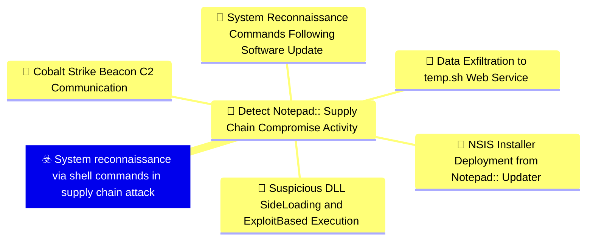
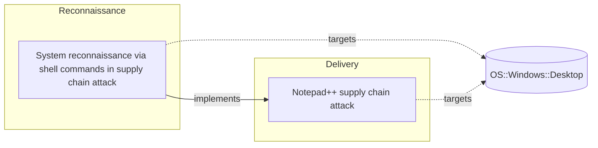

# ☣️ System reconnaissance via shell commands in supply chain attack

🔥 **Criticality:Medium** ❗ : A Medium priority incident may affect public health or safety, national security, economic security, foreign relations, civil liberties, or public confidence. 

🚦 **TLP:CLEAR** ⚪ : Recipients can spread this to the world, there is no limit on disclosure.


🗡️ **ATT&CK Techniques** [T1082 : System Information Discovery](https://attack.mitre.org/techniques/T1082 'An adversary may attempt to get detailed information about the operating system and hardware, including version, patches, hotfixes, service packs, and'), [T1016 : System Network Configuration Discovery](https://attack.mitre.org/techniques/T1016 'Adversaries may look for details about the network configuration and settings, such as IP andor MAC addresses, of systems they access or through infor'), [T1033 : System Owner/User Discovery](https://attack.mitre.org/techniques/T1033 'Adversaries may attempt to identify the primary user, currently logged in user, set of users that commonly uses a system, or whether a user is activel'), [T1057 : Process Discovery](https://attack.mitre.org/techniques/T1057 'Adversaries may attempt to get information about running processes on a system Information obtained could be used to gain an understanding of common s')


---

`🔑 UUID : bee6e973-b0d0-4735-a26a-003f39b8c08d` **|** `🏷️ Version : 1` **|** `🗓️ Creation Date : 2026-02-09` **|** `🗓️ Last Modification : 2026-02-09` **|** `Sharing Organisation : {'uuid': '56b0a0f0-b0bc-47d9-bb46-02f80ae2065a', 'name': 'EC DIGIT CSOC'}` **|** `🧱 Schema Identifier : tvm::2.1`


## 👁️ Description

> ## Executive Summary
> 
> In the Notepad++ supply chain attack investigation, Kaspersky's KEDR Expert detection 
> system identified systematic reconnaissance activities performed by threat actors 
> immediately after successful compromise. These activities consisted of chained Windows 
> command-line utilities executed to gather comprehensive system information, with 
> results redirected to text files for exfiltration or later analysis.
> 
> ## Attack Pattern
> 
> The reconnaissance activity follows a consistent pattern across both identified 
> infection chains, indicating a standardized post-exploitation playbook:
> 
> ### Chain #1 Reconnaissance (July-August 2025)
> 
> **Working Directory**: `%appdata%\ProShow`
> 
> **Command Executed**:
> ```
> cmd /c whoami&&tasklist > 1.txt
> ```
> 
> This command combination:
> - Identifies the current user context (whoami)
> - Enumerates all running processes (tasklist)
> - Redirects output to `1.txt` in the ProShow directory
> 
> ### Chain #2 Reconnaissance (September-October 2025)
> 
> **Working Directory**: `%APPDATA%\Adobe\Scripts`
> 
> The second chain demonstrates more comprehensive reconnaissance using two approaches:
> 
> #### Approach A - Single Chained Command:
> ```
> cmd /c "whoami&&tasklist&&systeminfo&&netstat -ano" > a.txt
> ```
> 
> #### Approach B - Individual Commands:
> ```
> cmd /c whoami > a.txt
> cmd /c tasklist > a.txt
> cmd /c systeminfo > a.txt
> cmd /c netstat -ano > a.txt
> ```
> 
> Both approaches gather identical information but differ in execution methodology.
> 
> ## Intelligence Gathered
> 
> The reconnaissance commands provide threat actors with critical information:
> 
> ### 1. User Context (`whoami`)
> 
> **Purpose**: Determine privilege level and user identity
> 
> **Information Obtained**:
> - Current username
> - Domain membership (if applicable)
> - Whether user has administrative privileges
> 
> **Attack Value**: Helps determine if privilege escalation is necessary and identifies 
> high-value targets (e.g., administrators, domain accounts)
> 
> **MITRE ATT&CK**: T1033 - System Owner/User Discovery
> 
> ### 2. Process Enumeration (`tasklist`)
> 
> **Purpose**: Identify running applications and security tools
> 
> **Information Obtained**:
> - Active processes and their PIDs
> - Memory usage per process
> - Session identifiers
> 
> **Attack Value**: 
> - Detect security software (EDR, antivirus, monitoring tools)
> - Identify valuable applications (browsers, email clients, development tools)
> - Find potential targets for process injection or credential harvesting
> 
> **MITRE ATT&CK**: T1057 - Process Discovery
> 
> ### 3. System Information (`systeminfo`)
> 
> **Purpose**: Profile the target system's configuration
> 
> **Information Obtained**:
> - Operating system version and build
> - System architecture (x86/x64)
> - Installed hotfixes and patches
> - System boot time and uptime
> - Domain information
> - Network card configurations
> 
> **Attack Value**:
> - Identify unpatched vulnerabilities for privilege escalation
> - Determine system capabilities for payload compatibility
> - Assess system criticality and potential value
> 
> **MITRE ATT&CK**: T1082 - System Information Discovery
> 
> ### 4. Network Connections (`netstat -ano`)
> 
> **Purpose**: Map active network connections and listening services
> 
> **Information Obtained**:
> - Active TCP/UDP connections with remote endpoints
> - Listening ports and associated processes (via PID)
> - Connection states (ESTABLISHED, LISTENING, TIME_WAIT, etc.)
> 
> **Attack Value**:
> - Identify network communication patterns for stealth
> - Discover additional attack surfaces (exposed services)
> - Map internal network topology
> - Identify potential lateral movement targets
> 
> **MITRE ATT&CK**: T1016 - System Network Configuration Discovery
> 
> ## Technical Analysis
> 
> ### Command Execution Characteristics
> 
> **Output Redirection Strategy**:
> - Results written to text files rather than console display
> - Enables offline analysis and reduces detection risk
> - Facilitates data exfiltration via C2 channels
> 
> **File Naming Convention**:
> - Simple filenames: `1.txt`, `a.txt`
> - Non-descriptive to avoid raising suspicion
> - Located in seemingly legitimate application directories
> 
> **Directory Selection**:
> - `%appdata%\ProShow` - Legitimate media presentation software directory
> - `%appdata%\Adobe\Scripts` - Legitimate Adobe application scripts directory
> - Both locations appear innocuous and are unlikely to trigger alerts
> 
> ### Execution Flow
> 
> ```
> Initial Access
>      |
>      v
> cmd.exe spawned
>      |
>      v
> Reconnaissance commands executed
>      |
>      v
> Output redirected to text file
>      |
>      v
> Results exfiltrated or parsed locally
>      |
>      v
> Next stage of attack (lateral movement/data collection)
> ```
> 
> ## Detection Opportunities
> 
> ### 1. KEDR Expert Behavioral Detection
> 
> Kaspersky's KEDR Expert system successfully detected this activity through 
> behavioral signatures:
> 
> - `system_owner_user_discovery`
> - `using_whoami_to_check_that_current_user_is_admin`
> - `system_information_discovery_win`
> - `system_network_connections_discovery_via_standard_windows_utilities`
> 
> ### 2. Command-Line Monitoring
> 
> **Detection Pattern**: Monitor for cmd.exe executing multiple reconnaissance 
> commands in rapid succession, especially with output redirection.
> 
> **Indicators**:
> ```
> Process: cmd.exe
> Command Line: /c whoami&&tasklist&&systeminfo&&netstat -ano
> Parent Process: [Suspicious executable or NSIS installer]
> Output Redirection: > [filename].txt
> Working Directory: %appdata%\[application]\
> ```
> 
> ### 3. File System Monitoring
> 
> **Detection Pattern**: Creation of text files in AppData subdirectories containing 
> system reconnaissance output.
> 
> **Indicators**:
> - File creation: `%appdata%\ProShow\1.txt`
> - File creation: `%appdata%\Adobe\Scripts\a.txt`
> - File content contains output from whoami, tasklist, systeminfo, or netstat
> 
> ### 4. Process Tree Analysis
> 
> **Detection Pattern**: Unusual parent-child process relationships
> 
> **Suspicious Chains**:
> ```
> NSIS installer/updater.exe
>   └─> cmd.exe
>       └─> whoami.exe
>       └─> tasklist.exe
>       └─> systeminfo.exe
>       └─> netstat.exe
> ```
> 
> ### 5. Timeline Analysis
> 
> **Detection Pattern**: Rapid sequential execution of discovery commands
> 
> **Indicators**:
> - Multiple discovery commands executed within seconds
> - Executed from same parent process
> - Consistent output redirection pattern
> 
> ### 6. Behavioral Analytics
> 
> **Anomaly Detection**: Development workstations executing reconnaissance commands 
> from non-administrative contexts, particularly when spawned by software installers 
> or updaters.
> 
> **Baseline Deviation**:
> - Discovery commands typically executed by administrators or IT staff
> - Execution from updater processes is highly unusual
> - Output redirection to application directories deviates from normal usage
> 
> ## Detection Logic Examples
> 
> ### Sigma Rule Concepts
> 
> ```yaml
> # Detect chained reconnaissance commands
> detection:
>   selection_cmd:
>     Image|endswith: '\cmd.exe'
>     CommandLine|contains|all:
>       - 'whoami'
>       - 'tasklist'
>   selection_output:
>     CommandLine|contains: '>'
>   condition: selection_cmd and selection_output
> ```
> 
> ### Sysmon Event Correlation
> 
> **Event ID 1 (Process Creation)**:
> - Correlation of multiple EventID 1 events
> - Same ParentProcessId
> - Image paths: whoami.exe, tasklist.exe, systeminfo.exe, netstat.exe
> - Short time window (< 60 seconds)
> - Parent process: cmd.exe
> - Grandparent process: suspicious installer/updater
> 
> ### EDR Detection Logic
> 
> ```
> IF Process.Name == "cmd.exe" 
>   AND CommandLine CONTAINS ("whoami" AND "tasklist")
>   OR (CommandLine CONTAINS "systeminfo" AND "netstat")
>   AND CommandLine CONTAINS ">"
>   AND Parent.Name IN (suspicious_installers_list)
> THEN
>   ALERT "Potential Post-Compromise Reconnaissance"
>   SEVERITY: Medium
>   CONFIDENCE: High
> ```
> 
> ## Mitigation Strategies
> 
> ### 1. Application Whitelisting
> 
> Restrict execution of reconnaissance utilities:
> - Implement AppLocker or Windows Defender Application Control (WDAC)
> - Limit cmd.exe execution contexts
> - Control access to whoami, systeminfo, netstat from non-administrative contexts
> 
> ### 2. Command-Line Auditing
> 
> Enable comprehensive command-line logging:
> - Enable Process Creation auditing (Event ID 4688)
> - Enable PowerShell script block logging
> - Deploy Sysmon with robust configuration for command-line capture
> 
> ### 3. EDR Deployment
> 
> Deploy endpoint detection and response solutions capable of:
> - Detecting behavior-based reconnaissance patterns
> - Monitoring process chain relationships
> - Alerting on suspicious parent-child process trees
> 
> ### 4. Network Segmentation
> 
> Limit the value of reconnaissance:
> - Segment networks to restrict lateral movement
> - Implement zero-trust architecture
> - Enforce least-privilege access
> 
> ### 5. User Behavior Analytics
> 
> Monitor for anomalous activities:
> - Baseline normal reconnaissance command usage per user/role
> - Alert on deviations from established patterns
> - Correlate with other suspicious indicators
> 
> ## Threat Actor Objectives
> 
> The reconnaissance phase serves multiple attacker objectives:
> 
> 1. **Situational Awareness**: Understanding the compromised environment
> 2. **Target Validation**: Confirming the value of the compromised host
> 3. **Attack Planning**: Determining next steps based on system capabilities
> 4. **Privilege Assessment**: Identifying need for escalation
> 5. **Defense Mapping**: Identifying security tools that must be evaded
> 6. **Network Mapping**: Planning lateral movement paths
> 
> ## Community Intelligence
> 
> The specific command patterns and behaviors were documented by community member 
> `soft-parsley` on the Notepad++ community forums, providing valuable intelligence 
> that aided in the investigation and response to this supply chain compromise.
> 
> ## Risk Assessment
> 
> **Criticality: Medium** - While reconnaissance itself doesn't cause immediate harm, 
> it is a critical precursor to more damaging activities such as lateral movement, 
> privilege escalation, and data exfiltration.
> 
> **Viability: Likely** - These reconnaissance techniques are standard practice across 
> numerous threat actor groups and are observed frequently in post-compromise scenarios.
> 
> **Severity: Moderate Incident** - Detection of these activities indicates an active 
> breach requiring immediate investigation and response. However, early detection at 
> this stage provides opportunities to prevent more severe impacts.
> 
> ## Response Actions
> 
> Upon detection of this reconnaissance pattern:
> 
> 1. **Immediate Isolation**: Isolate the affected system from the network
> 2. **Forensic Collection**: Preserve reconnaissance output files for analysis
> 3. **Memory Dump**: Capture system memory for malware analysis
> 4. **Process Investigation**: Identify parent processes and investigate infection vector
> 5. **Network Analysis**: Review network connections for C2 communication
> 6. **Lateral Movement Check**: Investigate if attacker has moved beyond initial host
> 7. **Credential Reset**: Reset credentials for affected user accounts
> 8. **Patch Verification**: Ensure systems are patched and verify update sources
> 
> ## Conclusion
> 
> System reconnaissance via shell commands represents a critical phase in the attack 
> lifecycle where defenders have high-confidence detection opportunities. The specific 
> patterns observed in the Notepad++ supply chain attack demonstrate that even 
> sophisticated threat actors rely on standard Windows utilities for post-compromise 
> reconnaissance, providing defenders with reliable behavioral indicators for detection 
> and response.
> 
> The combination of command-line monitoring, behavioral analytics, and process tree 
> analysis provides robust detection capabilities against this threat vector. Organizations 
> should prioritize detection of these patterns as part of their broader supply chain 
> risk management strategy.
> 


## 🖥️ Terrain 

 > Following successful exploitation via a compromised software supply chain, threat 
> actors execute a series of standard Windows reconnaissance commands to gather 
> information about the compromised system. This activity is typically observed 
> immediately after initial access is established, as attackers assess the value 
> of the compromised host and determine next steps for lateral movement or data 
> exfiltration. The reconnaissance commands are executed through cmd.exe with output 
> redirection to text files stored in seemingly legitimate application directories.
> 

---

## 🕸️ Relations


### 🌊 OpenTide Objects




 **Descendants** 

| 🎯 Detection Objectives                                                                                                                                                                                                                                                                                        | 📡 Detection Objective Signals (5)                                                                                                                                                                                                                                                                                                                                                                                                                                                                                                                                                                                                                                                                                                                                                                                                                                                                                                                                                                                                                                                                                                                                                                                                                                                                                                                                                                                                                                                                                                                                                                                                                                                                                                                                                                                                                                                                                                  | 🛡️ Detection Models    | 🚨 Detection Rules    |
|:--------------------------------------------------------------------------------------------------------------------------------------------------------------------------------------------------------------------------------------------------------------------------------------------------------------|:-----------------------------------------------------------------------------------------------------------------------------------------------------------------------------------------------------------------------------------------------------------------------------------------------------------------------------------------------------------------------------------------------------------------------------------------------------------------------------------------------------------------------------------------------------------------------------------------------------------------------------------------------------------------------------------------------------------------------------------------------------------------------------------------------------------------------------------------------------------------------------------------------------------------------------------------------------------------------------------------------------------------------------------------------------------------------------------------------------------------------------------------------------------------------------------------------------------------------------------------------------------------------------------------------------------------------------------------------------------------------------------------------------------------------------------------------------------------------------------------------------------------------------------------------------------------------------------------------------------------------------------------------------------------------------------------------------------------------------------------------------------------------------------------------------------------------------------------------------------------------------------------------------------------------------------|:-----------------------|:---------------------|
| [Detect Notepad++ Supply Chain Compromise Activity](../Detection%20Objectives/🎯%20Detect%20Notepad++%20Supply%20Chain%20Compromise%20Activity.md 'This detection objective addresses the sophisticated supply chain compromiseof Notepad update infrastructure that occurred between July and October 20...') | [Detect Notepad++ Supply Chain Compromise Activity::System Reconnaissance Commands Following Software Update](Detect%20Notepad++%20Supply%20Chain%20Compromise%20Activity#system-reconnaissance-commands-following-software-update.md 'Detects sequences of system reconnaissance commands characteristic of theNotepad supply chain attack discovery phase Attackers executed combinationsof...')<br>[Detect Notepad++ Supply Chain Compromise Activity::Suspicious DLL Side-Loading and Exploit-Based Execution](Detect%20Notepad++%20Supply%20Chain%20Compromise%20Activity#suspicious-dll-side-loading-and-exploit-based-execution.md 'Detects malicious execution via legitimate software abuse, including DLLside-loading and exploitation of vulnerable legitimate executables TheNotepad ...')<br>[Detect Notepad++ Supply Chain Compromise Activity::Data Exfiltration to temp.sh Web Service](Detect%20Notepad++%20Supply%20Chain%20Compromise%20Activity#data-exfiltration-to-temp.sh-web-service.md 'Detects data exfiltration to the tempsh temporary file sharing service,used by attackers to stage reconnaissance data and avoid direct C2 communicatio...')<br>[Detect Notepad++ Supply Chain Compromise Activity::NSIS Installer Deployment from Notepad++ Updater](Detect%20Notepad++%20Supply%20Chain%20Compromise%20Activity#nsis-installer-deployment-from-notepad++-updater.md 'Detects the execution of NSIS Nullsoft Scriptable Install System installerslaunched by GUPexe, the legitimate Notepad update component The maliciousup...')<br>[Detect Notepad++ Supply Chain Compromise Activity::Cobalt Strike Beacon C2 Communication](Detect%20Notepad++%20Supply%20Chain%20Compromise%20Activity#cobalt-strike-beacon-c2-communication.md 'Detects network communication to known Cobalt Strike C2 infrastructureassociated with the Notepad supply chain campaign All observed infectionchains u...') | ❌ No Detection Models  | ❌ No Detection Rules |


 --- 

### ⛓️ Threat Chaining




<details>
<summary>Expand chaining data</summary>

| ☣️ Vector                                                                                                                                                                                                                                                                                                                                  | ⛓️ Link                 | 🎯 Target                                                                                                                                                                                                                                                     | ⛰️ Terrain                                                                                                                                                                                                                                                                                                                                                                                                    | 🗡️ ATT&CK                                                                                                                                                                                                                                                                                                                                                                                                                                                                                                                                                                                                                                                                                                                                                                                                                                                                                                                                                                                                       |
|:-------------------------------------------------------------------------------------------------------------------------------------------------------------------------------------------------------------------------------------------------------------------------------------------------------------------------------------------|:------------------------|:-------------------------------------------------------------------------------------------------------------------------------------------------------------------------------------------------------------------------------------------------------------|:--------------------------------------------------------------------------------------------------------------------------------------------------------------------------------------------------------------------------------------------------------------------------------------------------------------------------------------------------------------------------------------------------------------|:----------------------------------------------------------------------------------------------------------------------------------------------------------------------------------------------------------------------------------------------------------------------------------------------------------------------------------------------------------------------------------------------------------------------------------------------------------------------------------------------------------------------------------------------------------------------------------------------------------------------------------------------------------------------------------------------------------------------------------------------------------------------------------------------------------------------------------------------------------------------------------------------------------------------------------------------------------------------------------------------------------------|
| [System reconnaissance via shell commands in supply chain attack](../Threat%20Vectors/☣️%20System%20reconnaissance%20via%20shell%20commands%20in%20supply%20chain%20attack.md '## Executive SummaryIn the Notepad supply chain attack investigation, Kasperskys KEDR Expert detection system identified systematic reconnaissance act...') | `atomicity::implements` | [Notepad++ supply chain attack](../Threat%20Vectors/☣️%20Notepad++%20supply%20chain%20attack.md '## Executive SummaryOn February 2, 2026, Notepad developers disclosed a critical supply chain compromise affecting their update infrastructure The att...') | Organizations and individuals using Notepad++ text editor on Windows systems,  particularly those with automatic update mechanisms enabled. The attack targeted  the legitimate update infrastructure, delivering malicious payloads disguised  as authentic software updates. Victims were distributed globally across multiple  sectors including government, financial services, and IT service providers. | [T1195.002 : Supply Chain Compromise: Compromise Software Supply Chain](https://attack.mitre.org/techniques/T1195/002 'Adversaries may manipulate application software prior to receipt by a final consumer for the purpose of data or system compromise Supply chain comprom'), [T1071 : Application Layer Protocol](https://attack.mitre.org/techniques/T1071 'Adversaries may communicate using OSI application layer protocols to avoid detectionnetwork filtering by blending in with existing traffic Commands to'), [T1059 : Command and Scripting Interpreter](https://attack.mitre.org/techniques/T1059 'Adversaries may abuse command and script interpreters to execute commands, scripts, or binaries These interfaces and languages provide ways of interac'), [T1574 : Hijack Execution Flow](https://attack.mitre.org/techniques/T1574 'Adversaries may execute their own malicious payloads by hijacking the way operating systems run programs Hijacking execution flow can be for the purpo') |

</details>
&nbsp; 


---

## Model Data

#### **⛓️ Cyber Kill Chain**

 > Cyber attacks are typically phased progressions towards strategic objectives. The Unified Kill Chains provides insight into the tactics that hackers employ to attain these objectives. This provides a solid basis to develop (or realign) defensive strategies to raise cyber resilience.

 [`🔭 Reconnaissance`](https://www.unifiedkillchain.com/assets/The-Unified-Kill-Chain.pdf) : Researching, identifying and selecting targets using active or passive reconnaissance.

---

#### **💣 Severity**

 > The severity summarizes the overall danger of incident the vector will provoke, and is to be derived (WIP) from impact, leverage, and difficulty to execute.

 [`🧨 Moderate incident`](https://www.ncsc.gov.uk/news/new-cyber-attack-categorisation-system-improve-uk-response-incidents) : A cyber attack on a small organisation, or which poses a considerable risk to a medium-sized organisation, or preliminary indications of cyber activity against a large organisation or the government.

---

#### **🪄 Leverage acquisition**

 > Technical aftermath of the attack from the target perspective, differentiated from impact as it does not consider the value of the consequence, only what increased control the vector execution provides to the adversary.

 [`👁️‍🗨️ Information Disclosure`](https://owasp.org/www-community/Threat_Modeling_Process#stride) : Threat action intending to read a file that one was not granted access to, or to read data in transit.

---

#### **💥 Impact**

 > Analysis of the threat vector from the organizational perspective, in non technical term. This aims at putting a clear denomination on what the attacker will actually be able to act upon if the threat vector is realized.

  - [`🔓 Data Breach`](http://veriscommunity.net/enums.html#section-impact) : Non-public information has been accessed from the outside, and successfully extracted.
 - [`🛑 Business disruption`](http://veriscommunity.net/enums.html#section-impact) : Business disruption

---

#### **🎲 Vector Viability**

 > Described with estimative language (likelyhood probability), describes how likely the analyst believes the vector to actually be realized on the organization infrastructure. Estimative language describes quality and credibility of underlying sources, data, and methodologies based Intelligence Community Directive 203 (ICD 203) and JP 2-0, Joint Intelligence.

 [`🧐 Likely`](https://www.dni.gov/files/documents/ICD/ICD%20203%20Analytic%20Standards.pdf) : Probable (probably) - 55-80%

---


## 🌐 Threat Surface

- ` OS::Windows::Desktop` — Microsoft Windows desktop editions


### 🔗 References


**🕊️ Publicly available resources**

- [_1_] https://securelist.com/notepad-supply-chain-attack/115382/
- [_2_] https://community.notepad-plus-plus.org/user/soft-parsley

[1]: https://securelist.com/notepad-supply-chain-attack/115382/
[2]: https://community.notepad-plus-plus.org/user/soft-parsley

---

#### 🏷️ Tags

#-, #-, #-, #
, #
, ##, ##, ##, ##, # , #🏷, #️, # , #T, #a, #g, #s, #
, #


