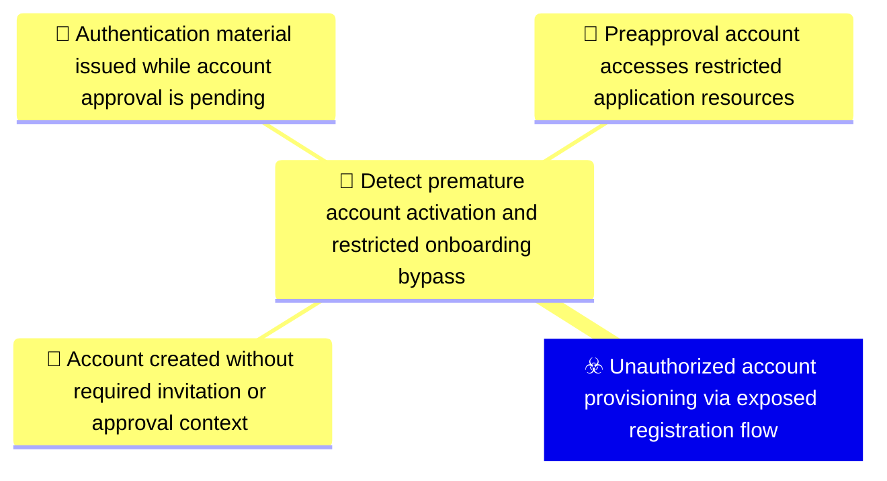
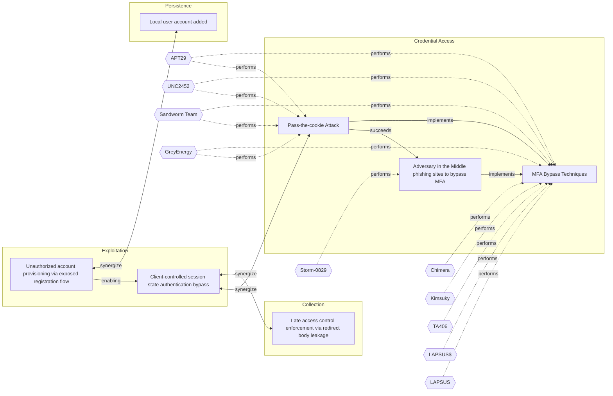

# ☣️ Unauthorized account provisioning via exposed registration flow

🔥 **Criticality:High** ⚠️ : A High priority incident is likely to result in a demonstrable impact to public health or safety, national security, economic security, foreign relations, civil liberties, or public confidence. 

🚦 **TLP:CLEAR** ⚪ : Recipients can spread this to the world, there is no limit on disclosure.

🗡️ **ATT&CK Techniques** [T1190 : Exploit Public-Facing Application](https://attack.mitre.org/techniques/T1190 'Adversaries may attempt to exploit a weakness in an Internet-facing host or system to initially access a network The weakness in the system can be a s'), [T1136 : Create Account](https://attack.mitre.org/techniques/T1136 'Adversaries may create an account to maintain access to victim systemsCitation Symantec WastedLocker June 2020 With a sufficient level of access, crea')

---

`🔑 UUID : 3d7dada6-5f9d-4f67-952e-faa2ab794fde` **|** `🏷️ Version : 1` **|** `🗓️ Creation Date : 2026-05-04` **|** `🗓️ Last Modification : 2026-05-04` **|** `Sharing Organisation : {'uuid': '56b0a0f0-b0bc-47d9-bb46-02f80ae2065a', 'name': 'EC DIGIT CSOC'}` **|** `🧱 Schema Identifier : tvm::2.1`

## 👁️ Description

> An adversary provisions an unauthorised account through exposed registration or account lifecycle
> endpoints despite intended onboarding restrictions. The application may hide or remove the
> registration UI, but backend routes such as /register, /signup, API registration endpoints,
> password reset, or token issuance flows remain active and insufficiently gated.
> 
> The flawed workflow creates an account object before approval, invite validation, or domain
> eligibility is enforced. Approval may be implemented only as a notification to a reviewer or a
> manual delete process rather than as a blocking state transition. Once the account exists, related
> flows may allow password reset, login, or token issuance for the unapproved account. Depending on
> default role assignment and access checks, the adversary may gain partial or full access to the
> application UI or APIs.
> 
> Detection and validation require replaying the lifecycle end to end: submit a registration request,
> confirm account creation before approval, attempt password reset, and test whether a session or
> token can be issued. The exposure may be systemic across deployments because registration paths
> and account-state checks are reused across environments, cloud-hosted instances, or tenants.
> 
> The vector enables bypass of onboarding controls, internal enumeration from a trusted application
> context, and a foothold for additional abuse. Severity should be finalised from evidence of the
> endpoint, request and response pairs, reset behaviour, token issuance, and access level achieved.
> 

## 🖥️ Terrain 

 > External web applications with registration, signup, password-reset, or token issuance endpoints
> that remain reachable even when the user interface is hidden or onboarding is intended to be
> invite-only, partner-only, domain-restricted, or approval-based. The weak terrain is account
> lifecycle logic where account records are created before approval is enforced and downstream
> authentication, password reset, or session issuance does not consistently check approval state.
> 

---

## 🕸️ Relations

### 🌊 OpenTide Objects

 **Descendants** 

| 🎯 Detection Objectives                                                                                                                                                                                                                                                                                                                                  | 📡 Detection Objective Signals (3)                                                                                                                                                                                                                                                                                                                                                                                                                                                                                                                                                                                                                                                                                                                                                                                                                                                                                                                                                                                                                                                                                                                                                                                                                                                                                                                                                      | 🛡️ Detection Models    | 🚨 Detection Rules    |
|:--------------------------------------------------------------------------------------------------------------------------------------------------------------------------------------------------------------------------------------------------------------------------------------------------------------------------------------------------------|:---------------------------------------------------------------------------------------------------------------------------------------------------------------------------------------------------------------------------------------------------------------------------------------------------------------------------------------------------------------------------------------------------------------------------------------------------------------------------------------------------------------------------------------------------------------------------------------------------------------------------------------------------------------------------------------------------------------------------------------------------------------------------------------------------------------------------------------------------------------------------------------------------------------------------------------------------------------------------------------------------------------------------------------------------------------------------------------------------------------------------------------------------------------------------------------------------------------------------------------------------------------------------------------------------------------------------------------------------------------------------------------|:-----------------------|:---------------------|
| [Detect premature account activation and restricted onboarding bypass](../Detection%20Objectives/🎯%20Detect%20premature%20account%20activation%20and%20restricted%20onboarding%20bypass.md 'Detect account lifecycle control failures where an identity becomes usable before the intendedapproval, invitation, or eligibility gate is complete Th...') | [Detect premature account activation and restricted onboarding bypass::Account created without required invitation or approval context](Detect%20premature%20account%20activation%20and%20restricted%20onboarding%20bypass#account-created-without-required-invitation-or-approval-context.md 'Alert when a registration endpoint creates an account without a valid invitation, approveddomain, reviewer approval, or expected onboarding source Req...') [Detect premature account activation and restricted onboarding bypass::Pre-approval account accesses restricted application resources](Detect%20premature%20account%20activation%20and%20restricted%20onboarding%20bypass#pre-approval-account-accesses-restricted-application-resources.md 'Alert when a newly created account accesses UI pages or APIs before approval, invitationvalidation, or domain eligibility checks are complete Required...') [Detect premature account activation and restricted onboarding bypass::Authentication material issued while account approval is pending](Detect%20premature%20account%20activation%20and%20restricted%20onboarding%20bypass#authentication-material-issued-while-account-approval-is-pending.md 'Alert when password reset, login, session creation, or token issuance succeeds for an accountwhose lifecycle state is pending, unapproved, unverified,...') | ❌ No Detection Models  | ❌ No Detection Rules |

 --- 

### ⛓️ Threat Chaining

Expand chaining data

| ☣️ Vector                                                                                                                                                                                                                                                                                                                              | ⛓️ Link                 | 🎯 Target                                                                                                                                                                                                                                                                                                                     | ⛰️ Terrain                                                                                                                                                                                                                                                                                                                                                                                                                                                                                                                                                                                                                                                                                                                                                                                                   | 🗡️ ATT&CK                                                                                                                                                                                                                                                                                                                                                                                                                                                                                                                                                                                                                                                                                                                                                                                                                                                                                                                                                                                                                                                                               |
|:---------------------------------------------------------------------------------------------------------------------------------------------------------------------------------------------------------------------------------------------------------------------------------------------------------------------------------------|:------------------------|:-----------------------------------------------------------------------------------------------------------------------------------------------------------------------------------------------------------------------------------------------------------------------------------------------------------------------------|:-------------------------------------------------------------------------------------------------------------------------------------------------------------------------------------------------------------------------------------------------------------------------------------------------------------------------------------------------------------------------------------------------------------------------------------------------------------------------------------------------------------------------------------------------------------------------------------------------------------------------------------------------------------------------------------------------------------------------------------------------------------------------------------------------------------|:----------------------------------------------------------------------------------------------------------------------------------------------------------------------------------------------------------------------------------------------------------------------------------------------------------------------------------------------------------------------------------------------------------------------------------------------------------------------------------------------------------------------------------------------------------------------------------------------------------------------------------------------------------------------------------------------------------------------------------------------------------------------------------------------------------------------------------------------------------------------------------------------------------------------------------------------------------------------------------------------------------------------------------------------------------------------------------------|
| [Unauthorized account provisioning via exposed registration flow](../Threat%20Vectors/☣️%20Unauthorized%20account%20provisioning%20via%20exposed%20registration%20flow.md 'An adversary provisions an unauthorised account through exposed registration or account lifecycleendpoints despite intended onboarding restrictions Th...') | `support::enabling`     | [Client-controlled session state authentication bypass](../Threat%20Vectors/☣️%20Client-controlled%20session%20state%20authentication%20bypass.md 'An adversary bypasses authentication or authorisation by injecting or modifying client-controlledsession state in HTTP requests The application treats...')               | External web applications that derive authentication or authorisation state from client-supplied cookies, Authorization headers, or other request variables without strong server-side validation. The vulnerable terrain may be shared middleware or framework logic rather than a single endpoint. The server accepts the presence of values, simple strings, usernames, role flags, or fabricated bearer values instead of verifying cryptographic integrity, server-issued session binding, token signature, expiry, and privilege state.                                                                                                                                                                                                                                                                | [T1190 : Exploit Public-Facing Application](https://attack.mitre.org/techniques/T1190 'Adversaries may attempt to exploit a weakness in an Internet-facing host or system to initially access a network The weakness in the system can be a s')                                                                                                                                                                                                                                                                                                                                                                                                                                                                                                                                                                                                                                                                                                                                                                                                                                         |
| [Unauthorized account provisioning via exposed registration flow](../Threat%20Vectors/☣️%20Unauthorized%20account%20provisioning%20via%20exposed%20registration%20flow.md 'An adversary provisions an unauthorised account through exposed registration or account lifecycleendpoints despite intended onboarding restrictions Th...') | `support::synergize`    | [Local user account added](../Threat%20Vectors/☣️%20Local%20user%20account%20added.md 'Threat actors may add or modify local user accounts on compromised systems to establish persistence, maintain unauthorized access, and potentially esc...')                                                                           | Adversary must have existing administrative privileges on a compromised host  within the targeted infrastructure to create or modify local user accounts.                                                                                                                                                                                                                                                                                                                                                                                                                                                                                                                                                                                                                                                    | [T1136.001 : Create Account: Local Account](https://attack.mitre.org/techniques/T1136/001 'Adversaries may create a local account to maintain access to victim systems Local accounts are those configured by an organization for use by users, r')                                                                                                                                                                                                                                                                                                                                                                                                                                                                                                                                                                                                                                                                                                                                                                                                                                     |
| [Client-controlled session state authentication bypass](../Threat%20Vectors/☣️%20Client-controlled%20session%20state%20authentication%20bypass.md 'An adversary bypasses authentication or authorisation by injecting or modifying client-controlledsession state in HTTP requests The application treats...')                         | `support::synergize`    | [Pass-the-cookie Attack](../Threat%20Vectors/☣️%20Pass-the-cookie%20Attack.md 'Pass-The-Cookie PTC, also known as token compromise, is a common attack techniqueemployed by threat actors in SaaS environments A PTC is a type of att...')                                                                                   | Attacker must compromise a user endpoint and exfiltrate the browser cookies. Cookies can be found on disk, in the process memory of the browser, and in network traffic to remote systems.  Additionally, other applications on the user endpoint machine might store sensitive authentication cookies in memory (e.g. apps which authenticate to cloud services).                                                                                                                                                                                                                                                                                                                                                                                                                                           | [T1111 : Multi-Factor Authentication Interception](https://attack.mitre.org/techniques/T1111 'Adversaries may target multi-factor authentication MFA mechanisms, ie, smart cards, token generators, etc to gain access to credentials that can be us')                                                                                                                                                                                                                                                                                                                                                                                                                                                                                                                                                                                                                                                                                                                                                                                                                                  |
| [Client-controlled session state authentication bypass](../Threat%20Vectors/☣️%20Client-controlled%20session%20state%20authentication%20bypass.md 'An adversary bypasses authentication or authorisation by injecting or modifying client-controlledsession state in HTTP requests The application treats...')                         | `support::synergize`    | [Late access control enforcement via redirect body leakage](../Threat%20Vectors/☣️%20Late%20access%20control%20enforcement%20via%20redirect%20body%20leakage.md 'An adversary exploits a broken access control pattern in a web applicationwhere the server constructs and includes the full rendered page content inth...') | A web application that performs access control checks late in the request processing pipeline, after the response body has already been constructed. The application must use HTTP redirects (typically 302 Found) for access control enforcement rather than blocking the request outright or returning a minimal error response. The response body includes the full rendered protected page content alongside the redirect Location header. This pattern typically arises in framework-level middleware or filter configurations where page rendering occurs before authentication and authorisation gates are evaluated. The vulnerability is systemic rather than endpoint-specific, affecting multiple authenticated or role-restricted routes that share the same flawed request processing pipeline. | [T1190 : Exploit Public-Facing Application](https://attack.mitre.org/techniques/T1190 'Adversaries may attempt to exploit a weakness in an Internet-facing host or system to initially access a network The weakness in the system can be a s')                                                                                                                                                                                                                                                                                                                                                                                                                                                                                                                                                                                                                                                                                                                                                                                                                                         |
| [Pass-the-cookie Attack](../Threat%20Vectors/☣️%20Pass-the-cookie%20Attack.md 'Pass-The-Cookie PTC, also known as token compromise, is a common attack techniqueemployed by threat actors in SaaS environments A PTC is a type of att...')                                                                                             | `sequence::succeeds`    | [Adversary in the Middle phishing sites to bypass MFA](../Threat%20Vectors/☣️%20Adversary%20in%20the%20Middle%20phishing%20sites%20to%20bypass%20MFA.md 'Threat actors use malicious attachments to send the users to redirection site, which hosts a fake MFA login pageThe MitM page completes the authentica...')         | An adversary needs to target companies and contacts  to distribute the malware, it's used a massive distrigution  technique on a random principle.                                                                                                                                                                                                                                                                                                                                                                                                                                                                                                                                                                                                                                                           | [T1566.002](https://attack.mitre.org/techniques/T1566/002 'Adversaries may send spearphishing emails with a malicious link in an attempt to gain access to victim systems Spearphishing with a link is a specific'), [T1557](https://attack.mitre.org/techniques/T1557 'Adversaries may attempt to position themselves between two or more networked devices using an adversary-in-the-middle AiTM technique to support follow'), [T1539](https://attack.mitre.org/techniques/T1539 'An adversary may steal web application or service session cookies and use them to gain access to web applications or Internet services as an authentic'), [T1556](https://attack.mitre.org/techniques/T1556 'Adversaries may modify authentication mechanisms and processes to access user credentials or enable otherwise unwarranted access to accounts The authe'), [T1078.004](https://attack.mitre.org/techniques/T1078/004 'Valid accounts in cloud environments may allow adversaries to perform actions to achieve Initial Access, Persistence, Privilege Escalation, or Defense')         |
| [Pass-the-cookie Attack](../Threat%20Vectors/☣️%20Pass-the-cookie%20Attack.md 'Pass-The-Cookie PTC, also known as token compromise, is a common attack techniqueemployed by threat actors in SaaS environments A PTC is a type of att...')                                                                                             | `atomicity::implements` | [MFA Bypass Techniques](../Threat%20Vectors/☣️%20MFA%20Bypass%20Techniques.md 'MFA is a technique that requires more than one piece of evidence to authorize the user to access a resource If two pieces of evidence are needed to ve...')                                                                                   | Sufficient reconnaissance to identify a target account and MFA technologies being used.                                                                                                                                                                                                                                                                                                                                                                                                                                                                                                                                                                                                                                                                                                                      | [T1111](https://attack.mitre.org/techniques/T1111 'Adversaries may target multi-factor authentication MFA mechanisms, ie, smart cards, token generators, etc to gain access to credentials that can be us'), [T1621](https://attack.mitre.org/techniques/T1621 'Adversaries may attempt to bypass multi-factor authentication MFA mechanisms and gain access to accounts by generating MFA requests sent to usersAdver'), [T1566.001](https://attack.mitre.org/techniques/T1566/001 'Adversaries may send spearphishing emails with a malicious attachment in an attempt to gain access to victim systems Spearphishing attachment is a spe'), [T1566.002](https://attack.mitre.org/techniques/T1566/002 'Adversaries may send spearphishing emails with a malicious link in an attempt to gain access to victim systems Spearphishing with a link is a specific'), [T1566.004](https://attack.mitre.org/techniques/T1566/004 'Adversaries may use voice communications to ultimately gain access to victim systems Spearphishing voice is a specific variant of spearphishing It is ') |
| [Adversary in the Middle phishing sites to bypass MFA](../Threat%20Vectors/☣️%20Adversary%20in%20the%20Middle%20phishing%20sites%20to%20bypass%20MFA.md 'Threat actors use malicious attachments to send the users to redirection site, which hosts a fake MFA login pageThe MitM page completes the authentica...')                   | `atomicity::implements` | [MFA Bypass Techniques](../Threat%20Vectors/☣️%20MFA%20Bypass%20Techniques.md 'MFA is a technique that requires more than one piece of evidence to authorize the user to access a resource If two pieces of evidence are needed to ve...')                                                                                   | Sufficient reconnaissance to identify a target account and MFA technologies being used.                                                                                                                                                                                                                                                                                                                                                                                                                                                                                                                                                                                                                                                                                                                      | [T1111](https://attack.mitre.org/techniques/T1111 'Adversaries may target multi-factor authentication MFA mechanisms, ie, smart cards, token generators, etc to gain access to credentials that can be us'), [T1621](https://attack.mitre.org/techniques/T1621 'Adversaries may attempt to bypass multi-factor authentication MFA mechanisms and gain access to accounts by generating MFA requests sent to usersAdver'), [T1566.001](https://attack.mitre.org/techniques/T1566/001 'Adversaries may send spearphishing emails with a malicious attachment in an attempt to gain access to victim systems Spearphishing attachment is a spe'), [T1566.002](https://attack.mitre.org/techniques/T1566/002 'Adversaries may send spearphishing emails with a malicious link in an attempt to gain access to victim systems Spearphishing with a link is a specific'), [T1566.004](https://attack.mitre.org/techniques/T1566/004 'Adversaries may use voice communications to ultimately gain access to victim systems Spearphishing voice is a specific variant of spearphishing It is ') |

&nbsp; 

---

## Model Data

#### **⛓️ Cyber Kill Chain**

 > Cyber attacks are typically phased progressions towards strategic objectives. The Unified Kill Chains provides insight into the tactics that hackers employ to attain these objectives. This provides a solid basis to develop (or realign) defensive strategies to raise cyber resilience.

 [`💥 Exploitation`](https://www.unifiedkillchain.com/assets/The-Unified-Kill-Chain.pdf) : Techniques to exploit vulnerabilities in systems that may, amongst others, result in code execution.

---

#### **💣 Severity**

 > The severity summarizes the overall danger of incident the vector will provoke, and is to be derived (WIP) from impact, leverage, and difficulty to execute.

 [`🔥 Substantial incident`](https://www.ncsc.gov.uk/news/new-cyber-attack-categorisation-system-improve-uk-response-incidents) : A cyber attack which has a serious impact on a medium-sized organisation, or which poses a considerable risk to a large organisation or wider / local government.

---

#### **🪄 Leverage acquisition**

 > Technical aftermath of the attack from the target perspective, differentiated from impact as it does not consider the value of the consequence, only what increased control the vector execution provides to the adversary.

  - [`🔐 New Accounts`](https://owasp.org/www-community/Threat_Modeling_Process#stride) : Ability to create new arbitrary user accounts.
 - [`💅 Elevation of privilege`](https://owasp.org/www-community/Threat_Modeling_Process#stride) : Capacity to augment leverage over the target system by upgrading the compromised access rights
 - [`👁️‍🗨️ Information Disclosure`](https://owasp.org/www-community/Threat_Modeling_Process#stride) : Threat action intending to read a file that one was not granted access to, or to read data in transit.

---

#### **💥 Impact**

 > Analysis of the threat vector from the organizational perspective, in non technical term. This aims at putting a clear denomination on what the attacker will actually be able to act upon if the threat vector is realized.

  - [`🔓 Data Breach`](http://veriscommunity.net/enums.html#section-impact) : Non-public information has been accessed from the outside, and successfully extracted.
 - [`🥸 Identity Theft`](http://veriscommunity.net/enums.html#section-impact) : Acquisition of sufficient information and privileges to profess as a given individual, for the purpose of abusing and deceiving human trust relationships.
 - [`🛑 Business disruption`](http://veriscommunity.net/enums.html#section-impact) : Business disruption
 - [`⚖️ Legal and regulatory`](http://veriscommunity.net/enums.html#section-impact) : Legal and regulatory costs

---

#### **🎲 Vector Viability**

 > Described with estimative language (likelyhood probability), describes how likely the analyst believes the vector to actually be realized on the organization infrastructure. Estimative language describes quality and credibility of underlying sources, data, and methodologies based Intelligence Community Directive 203 (ICD 203) and JP 2-0, Joint Intelligence.

 [`🧐 Likely`](https://www.dni.gov/files/documents/ICD/ICD%20203%20Analytic%20Standards.pdf) : Probable (probably) - 55-80%

---

### 🔗 References

**🕊️ Publicly available resources**

- [_1_] https://owasp.org/Top10/A01_2021-Broken_Access_Control/
- [_2_] https://owasp.org/Top10/A07_2021-Identification_and_Authentication_Failures/
- [_3_] https://cwe.mitre.org/data/definitions/306.html
- [_4_] https://cwe.mitre.org/data/definitions/287.html
- [_5_] https://cwe.mitre.org/data/definitions/284.html

[1]: https://owasp.org/Top10/A01_2021-Broken_Access_Control/
[2]: https://owasp.org/Top10/A07_2021-Identification_and_Authentication_Failures/
[3]: https://cwe.mitre.org/data/definitions/306.html
[4]: https://cwe.mitre.org/data/definitions/287.html
[5]: https://cwe.mitre.org/data/definitions/284.html

---

#### 🏷️ Tags

#-, #-, #-, #
, #
, ##, ##, ##, ##, # , #🏷, #️, # , #T, #a, #g, #s, #
, #

