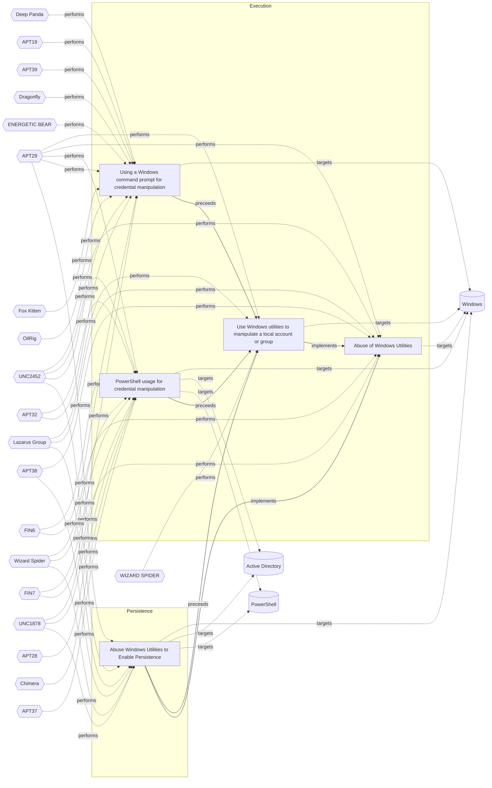

# ☣️ Use Windows utilities to manipulate a local account or group

🔥 **Criticality:Medium** ❗ : A Medium priority incident may affect public health or safety, national security, economic security, foreign relations, civil liberties, or public confidence. 

🚦 **TLP:CLEAR** ⚪ : Recipients can spread this to the world, there is no limit on disclosure.


🗡️ **ATT&CK Techniques** [T1546 : Event Triggered Execution](https://attack.mitre.org/techniques/T1546 'Adversaries may establish persistence andor elevate privileges using system mechanisms that trigger execution based on specific events Various operati'), [T1562.001 : Impair Defenses: Disable or Modify Tools](https://attack.mitre.org/techniques/T1562/001 'Adversaries may modify andor disable security tools to avoid possible detection of their malwaretools and activities This may take many forms, such as'), [T1078.003 : Valid Accounts: Local Accounts](https://attack.mitre.org/techniques/T1078/003 'Adversaries may obtain and abuse credentials of a local account as a means of gaining Initial Access, Persistence, Privilege Escalation, or Defense Ev'), [T1136.001 : Create Account: Local Account](https://attack.mitre.org/techniques/T1136/001 'Adversaries may create a local account to maintain access to victim systems Local accounts are those configured by an organization for use by users, r'), [T1087.001 : Account Discovery: Local Account](https://attack.mitre.org/techniques/T1087/001 'Adversaries may attempt to get a listing of local system accounts This information can help adversaries determine which local accounts exist on a syst'), [T1098.007 : Account Manipulation: Additional Local or Domain Groups](https://attack.mitre.org/techniques/T1098/007 'An adversary may add additional local or domain groups to an adversary-controlled account to maintain persistent access to a system or domainOn Window')


---

`🔑 UUID : 596d294a-9aa8-41b2-9507-5c9d605de6b4` **|** `🏷️ Version : 3` **|** `🗓️ Creation Date : 2024-11-06` **|** `🗓️ Last Modification : 2025-02-10` **|** `Sharing Organisation : {'uuid': '56b0a0f0-b0bc-47d9-bb46-02f80ae2065a', 'name': 'EC DIGIT CSOC'}` **|** `🧱 Schema Identifier : tvm::2.1`


## 👁️ Description

> Local account manipulation involves creating, modifying, or exploiting local 
> user accounts on a computer system, typically for malicious purposes. Local 
> accounts are user accounts stored and managed locally on a specific computer 
> device.
> 
> ### Utilities Related to Local Account Manipulation:
> 
> #### 1. net.exe
> **Description**: A command-line utility used for network administration tasks, 
> including managing user accounts and network shares. Threat actors can use 
> it to create new user accounts and add them to privileged groups.
> 
> Example:
> 
> ```bash
> net user attacker P@ssw0rd! /add
> net localgroup administrators attacker /add
> ```
> This sequence creates a new user named "attacker" and adds them to the local 
> administrators group, granting full system access.
> 
> #### PowerShell Cmdlets
> ##### New-LocalUser 
> The New-LocalUser cmdlet is used to create a new local 
> user account on a Windows machine.
> `New-LocalUser -Name "username" -Password (ConvertTo-SecureString "P@ssw0rd!"
>  -AsPlainText -Force) -Description "Description" -FullName "Full Name"`
> 
> Parameters:
> -Name: Specifies the name of the new local user.
> -Password: Assigns a password to the new user account. The password must be 
> provided as a **secure string.**
> -Description: (Optional) Adds a description for the user account.
> -FullName: (Optional) Provides the full name of the user.
> 
> ##### Add-LocalGroupMember
> The Add-LocalGroupMember cmdlet adds a user to a local group, which can be 
> used to grant the user additional privileges.
> `Add-LocalGroupMember -Group "Administrators" -Member "username"`
> 
> Parameters:
> -Group: Specifies the local group to which the user will be added.
> -Member: Specifies the user account to add to the group.
> 
> 
> #### Changing a Local Password
> Using net.exe: The net.exe utility can be used to change a user's 
> password.  
> 
> `net user username newpassword``
> 
> Using PowerShell: PowerShell can also be used to change a 
> local user's password.  
> 
> ```
> $user = [ADSI]("WinNT://./username,user")
> $user.SetPassword("NewP@ssw0rd!")
> 


## 🖥️ Terrain 

 > Threat actors must have access to a Windows system with sufficient privileges 
> to execute administrative utilities.
> 

---

## 🕸️ Relations


### 🐲 Actors sightings 

| Actor         | Description                                                                                                                                                                                                                                                                                                                                                                                                                                                                                                                                                                                                                                                                                                                                                                                                                                                                                                                                                                                                                                                                                                                                                                                                                                                                                                                                                                                                                                                                                                                                                                                                                                                                                                                                                                                                                                                                                                                                                                                                                                                                                                                                                                                                                                                                                                        | Aliases                                                                                                                                                                                                                                                                                                                                                                                                                                                                                                                                                | Source                     | Sighting               | Reference                |
|:--------------|:-------------------------------------------------------------------------------------------------------------------------------------------------------------------------------------------------------------------------------------------------------------------------------------------------------------------------------------------------------------------------------------------------------------------------------------------------------------------------------------------------------------------------------------------------------------------------------------------------------------------------------------------------------------------------------------------------------------------------------------------------------------------------------------------------------------------------------------------------------------------------------------------------------------------------------------------------------------------------------------------------------------------------------------------------------------------------------------------------------------------------------------------------------------------------------------------------------------------------------------------------------------------------------------------------------------------------------------------------------------------------------------------------------------------------------------------------------------------------------------------------------------------------------------------------------------------------------------------------------------------------------------------------------------------------------------------------------------------------------------------------------------------------------------------------------------------------------------------------------------------------------------------------------------------------------------------------------------------------------------------------------------------------------------------------------------------------------------------------------------------------------------------------------------------------------------------------------------------------------------------------------------------------------------------------------------------|:-------------------------------------------------------------------------------------------------------------------------------------------------------------------------------------------------------------------------------------------------------------------------------------------------------------------------------------------------------------------------------------------------------------------------------------------------------------------------------------------------------------------------------------------------------|:---------------------------|:-----------------------|:-------------------------|
| WIZARD SPIDER | Wizard Spider is reportedly associated with Grim Spider and Lunar Spider.The WIZARD SPIDER threat group is the Russia-based operator of the TrickBot banking malware. This group represents a growing criminal enterprise of which GRIM SPIDER appears to be a subset. The LUNAR SPIDER threat group is the Eastern European-based operator and developer of the commodity banking malware called BokBot (aka IcedID), which was first observed in April 2017. The BokBot malware provides LUNAR SPIDER affiliates with a variety of capabilities to enable credential theft and wire fraud, through the use of webinjects and a malware distribution function.GRIM SPIDER is a sophisticated eCrime group that has been operating the Ryuk ransomware since August 2018, targeting large organizations for a high-ransom return. This methodology, known as “big game hunting,” signals a shift in operations for WIZARD SPIDER, a criminal enterprise of which GRIM SPIDER appears to be a cell. The WIZARD SPIDER threat group, known as the Russia-based operator of the TrickBot banking malware, had focused primarily on wire fraud in the past.                                                                                                                                                                                                                                                                                                                                                                                                                                                                                                                                                                                                                                                                                                                                                                                                                                                                                                                                                                                                                                                                                                                                                            | TEMP.MixMaster, GOLD BLACKBURN, FIN12, Periwinkle Tempest, DEV-0193, Storm-0193, Trickbot LLC, UNC2053, Pistachio Tempest, DEV-0237, Storm-0230                                                                                                                                                                                                                                                                                                                                                                                                        | 🌌 MISP Threat Actor Galaxy | No documented sighting | No documented references |
| APT29         | A 2015 report by F-Secure describe APT29 as: 'The Dukes are a well-resourced, highly dedicated and organized cyberespionage group that we believe has been working for the Russian Federation since at least 2008 to collect intelligence in support of foreign and security policy decision-making. The Dukes show unusual confidence in their ability to continue successfully compromising their targets, as well as in their ability to operate with impunity. The Dukes primarily target Western governments and related organizations, such as government ministries and agencies, political think tanks, and governmental subcontractors. Their targets have also included the governments of members of the Commonwealth of Independent States;Asian, African, and Middle Eastern governments;organizations associated with Chechen extremism;and Russian speakers engaged in the illicit trade of controlled substances and drugs. The Dukes are known to employ a vast arsenal of malware toolsets, which we identify as MiniDuke, CosmicDuke, OnionDuke, CozyDuke, CloudDuke, SeaDuke, HammerDuke, PinchDuke, and GeminiDuke. In recent years, the Dukes have engaged in apparently biannual large - scale spear - phishing campaigns against hundreds or even thousands of recipients associated with governmental institutions and affiliated organizations. These campaigns utilize a smash - and - grab approach involving a fast but noisy breakin followed by the rapid collection and exfiltration of as much data as possible.If the compromised target is discovered to be of value, the Dukes will quickly switch the toolset used and move to using stealthier tactics focused on persistent compromise and long - term intelligence gathering. This threat actor targets government ministries and agencies in the West, Central Asia, East Africa, and the Middle East; Chechen extremist groups; Russian organized crime; and think tanks. It is suspected to be behind the 2015 compromise of unclassified networks at the White House, Department of State, Pentagon, and the Joint Chiefs of Staff. The threat actor includes all of the Dukes tool sets, including MiniDuke, CosmicDuke, OnionDuke, CozyDuke, SeaDuke, CloudDuke (aka MiniDionis), and HammerDuke (aka Hammertoss). ' | Group 100, COZY BEAR, The Dukes, Minidionis, SeaDuke, YTTRIUM, IRON HEMLOCK, Grizzly Steppe, G0016, ATK7, Cloaked Ursa, TA421, Blue Kitsune, ITG11, BlueBravo, Nobelium, UAC-0029                                                                                                                                                                                                                                                                                                                                                                      | 🌌 MISP Threat Actor Galaxy | No documented sighting | No documented references |
| Lazarus Group | Since 2009, HIDDEN COBRA actors have leveraged their capabilities to target and compromise a range of victims; some intrusions have resulted in the exfiltration of data while others have been disruptive in nature. Commercial reporting has referred to this activity as Lazarus Group and Guardians of Peace. Tools and capabilities used by HIDDEN COBRA actors include DDoS botnets, keyloggers, remote access tools (RATs), and wiper malware. Variants of malware and tools used by HIDDEN COBRA actors include Destover, Duuzer, and Hangman.                                                                                                                                                                                                                                                                                                                                                                                                                                                                                                                                                                                                                                                                                                                                                                                                                                                                                                                                                                                                                                                                                                                                                                                                                                                                                                                                                                                                                                                                                                                                                                                                                                                                                                                                                             | Operation DarkSeoul, Dark Seoul, Hidden Cobra, Hastati Group, Andariel, Unit 121, Bureau 121, NewRomanic Cyber Army Team, Bluenoroff, Subgroup: Bluenoroff, Group 77, Labyrinth Chollima, Operation Troy, Operation GhostSecret, Operation AppleJeus, APT38, APT 38, Stardust Chollima, Whois Hacking Team, Zinc, Appleworm, Nickel Academy, APT-C-26, NICKEL GLADSTONE, COVELLITE, ATK3, G0032, ATK117, G0082, Citrine Sleet, DEV-0139, DEV-1222, Diamond Sleet, ZINC, Sapphire Sleet, COPERNICIUM, TA404, Lazarus group, BeagleBoyz, Moonstone Sleet | 🌌 MISP Threat Actor Galaxy | No documented sighting | No documented references |

### 🌊 OpenTide Objects
🚫 No related OpenTide objects indexed.


 --- 

### ⛓️ Threat Chaining




<details>
<summary>Expand chaining data</summary>

| ☣️ Vector                                                                                                                                                                                                                                                                                                                              | ⛓️ Link                 | 🎯 Target                                                                                                                                                                                                                                                                                                                       | ⛰️ Terrain                                                                                                                                                                                          | 🗡️ ATT&CK                                                                                                                                                                                                                                                                                                                                                                                                                                                                                                                                                                                                                                                                                                                                                                                                                                                                                                                                                                                                                                                                                                                                                                                                                                                                                                                                                                                                                                                                                                         |
|:---------------------------------------------------------------------------------------------------------------------------------------------------------------------------------------------------------------------------------------------------------------------------------------------------------------------------------------|:------------------------|:-------------------------------------------------------------------------------------------------------------------------------------------------------------------------------------------------------------------------------------------------------------------------------------------------------------------------------|:----------------------------------------------------------------------------------------------------------------------------------------------------------------------------------------------------|:------------------------------------------------------------------------------------------------------------------------------------------------------------------------------------------------------------------------------------------------------------------------------------------------------------------------------------------------------------------------------------------------------------------------------------------------------------------------------------------------------------------------------------------------------------------------------------------------------------------------------------------------------------------------------------------------------------------------------------------------------------------------------------------------------------------------------------------------------------------------------------------------------------------------------------------------------------------------------------------------------------------------------------------------------------------------------------------------------------------------------------------------------------------------------------------------------------------------------------------------------------------------------------------------------------------------------------------------------------------------------------------------------------------------------------------------------------------------------------------------------------------|
| [Use Windows utilities to manipulate a local account or group](../Threat%20Vectors/☣️%20Use%20Windows%20utilities%20to%20manipulate%20a%20local%20account%20or%20group.md 'Local account manipulation involves creating, modifying, or exploiting local user accounts on a computer system, typically for malicious purposes Loca...') | `atomicity::implements` | [Abuse of Windows Utilities](../Threat%20Vectors/☣️%20Abuse%20of%20Windows%20Utilities.md 'Advanced threat actors frequently abuse legitimate Windows utilities to execute malicious code, evade detection, and maintain persistence This techniq...')                                                                         | Adversaries must have access to a Windows environment where they can execute  built-in utilities. Limited user privileges may suffice,  but administrative privileges enhance the potential impact. | [T1218](https://attack.mitre.org/techniques/T1218 'Adversaries may bypass process andor signature-based defenses by proxying execution of malicious content with signed, or otherwise trusted, binaries B'), [T1197](https://attack.mitre.org/techniques/T1197 'Adversaries may abuse BITS jobs to persistently execute code and perform various background tasks Windows Background Intelligent Transfer Service BITS'), [T1218.004](https://attack.mitre.org/techniques/T1218/004 'Adversaries may use InstallUtil to proxy execution of code through a trusted Windows utility InstallUtil is a command-line utility that allows for ins'), [T1563](https://attack.mitre.org/techniques/T1563 'Adversaries may take control of preexisting sessions with remote services to move laterally in an environment Users may use valid credentials to log i'), [T1140](https://attack.mitre.org/techniques/T1140 'Adversaries may use Obfuscated Files or InformationhttpsattackmitreorgtechniquesT1027 to hide artifacts of an intrusion from analysis They may require'), [T1218.010](https://attack.mitre.org/techniques/T1218/010 'Adversaries may abuse Regsvr32exe to proxy execution of malicious code Regsvr32exe is a command-line program used to register and unregister object li'), [T1218.005](https://attack.mitre.org/techniques/T1218/005 'Adversaries may abuse mshtaexe to proxy execution of malicious hta files and Javascript or VBScript through a trusted Windows utility There are severa') |
| [Use Windows utilities to manipulate a local account or group](../Threat%20Vectors/☣️%20Use%20Windows%20utilities%20to%20manipulate%20a%20local%20account%20or%20group.md 'Local account manipulation involves creating, modifying, or exploiting local user accounts on a computer system, typically for malicious purposes Loca...') | `sequence::preceeds`    | [PowerShell usage for credential manipulation](../Threat%20Vectors/☣️%20PowerShell%20usage%20for%20credential%20manipulation.md 'Threat actors are using different methods to manipulate users credentialsOne example of credential manipulation is by using PowerShell commands orscri...')                                   | Requires an already compromised Windows endpoint and in some cases administrative privilege access to a PowerShell console.                                                                         | [T1098.001 : Account Manipulation: Additional Cloud Credentials](https://attack.mitre.org/techniques/T1098/001 'Adversaries may add adversary-controlled credentials to a cloud account to maintain persistent access to victim accounts and instances within the envi'), [T1059.001 : Command and Scripting Interpreter: PowerShell](https://attack.mitre.org/techniques/T1059/001 'Adversaries may abuse PowerShell commands and scripts for execution PowerShell is a powerful interactive command-line interface and scripting environm')                                                                                                                                                                                                                                                                                                                                                                                                                                                                                                                                                                                                                                                                                                                                                                                                                                                                                                                                                                     |
| [Use Windows utilities to manipulate a local account or group](../Threat%20Vectors/☣️%20Use%20Windows%20utilities%20to%20manipulate%20a%20local%20account%20or%20group.md 'Local account manipulation involves creating, modifying, or exploiting local user accounts on a computer system, typically for malicious purposes Loca...') | `sequence::preceeds`    | [Using a Windows command prompt for credential manipulation](../Threat%20Vectors/☣️%20Using%20a%20Windows%20command%20prompt%20for%20credential%20manipulation.md 'Threat actors may use Windows commad prompt commands to search for, accessin order to manipulate create, modify, delete, read users credentialslocally...') | Requires an already compromised Windows endpoint and in some cases elevated administrator privileges to command prompt interface.                                                                   | [T1059.003 : Command and Scripting Interpreter: Windows Command Shell](https://attack.mitre.org/techniques/T1059/003 'Adversaries may abuse the Windows command shell for execution The Windows command shell cmdhttpsattackmitreorgsoftwareS0106 is the primary command pro'), [T1098.001 : Account Manipulation: Additional Cloud Credentials](https://attack.mitre.org/techniques/T1098/001 'Adversaries may add adversary-controlled credentials to a cloud account to maintain persistent access to victim accounts and instances within the envi')                                                                                                                                                                                                                                                                                                                                                                                                                                                                                                                                                                                                                                                                                                                                                                                                                                                                                                                                                          |
| [Use Windows utilities to manipulate a local account or group](../Threat%20Vectors/☣️%20Use%20Windows%20utilities%20to%20manipulate%20a%20local%20account%20or%20group.md 'Local account manipulation involves creating, modifying, or exploiting local user accounts on a computer system, typically for malicious purposes Loca...') | `sequence::preceeds`    | [Abuse Windows Utilities to Enable Persistence](../Threat%20Vectors/☣️%20Abuse%20Windows%20Utilities%20to%20Enable%20Persistence.md '1 MsdeployexeDescription The Microsoft Web Deployment Tool used for syncing contentand configurations Threat actors can deploy web shells or malicious...')                               | Adversary must have administrative privileges on Windows systems within  the enterprise network.                                                                                                    | [T1547.001 : Boot or Logon Autostart Execution: Registry Run Keys / Startup Folder](https://attack.mitre.org/techniques/T1547/001 'Adversaries may achieve persistence by adding a program to a startup folder or referencing it with a Registry run key Adding an entry to the run keys '), [T1218 : System Binary Proxy Execution](https://attack.mitre.org/techniques/T1218 'Adversaries may bypass process andor signature-based defenses by proxying execution of malicious content with signed, or otherwise trusted, binaries B')                                                                                                                                                                                                                                                                                                                                                                                                                                                                                                                                                                                                                                                                                                                                                                                                                                                                                                                                                                          |
| [Abuse Windows Utilities to Enable Persistence](../Threat%20Vectors/☣️%20Abuse%20Windows%20Utilities%20to%20Enable%20Persistence.md '1 MsdeployexeDescription The Microsoft Web Deployment Tool used for syncing contentand configurations Threat actors can deploy web shells or malicious...')                                       | `atomicity::implements` | [Abuse of Windows Utilities](../Threat%20Vectors/☣️%20Abuse%20of%20Windows%20Utilities.md 'Advanced threat actors frequently abuse legitimate Windows utilities to execute malicious code, evade detection, and maintain persistence This techniq...')                                                                         | Adversaries must have access to a Windows environment where they can execute  built-in utilities. Limited user privileges may suffice,  but administrative privileges enhance the potential impact. | [T1218](https://attack.mitre.org/techniques/T1218 'Adversaries may bypass process andor signature-based defenses by proxying execution of malicious content with signed, or otherwise trusted, binaries B'), [T1197](https://attack.mitre.org/techniques/T1197 'Adversaries may abuse BITS jobs to persistently execute code and perform various background tasks Windows Background Intelligent Transfer Service BITS'), [T1218.004](https://attack.mitre.org/techniques/T1218/004 'Adversaries may use InstallUtil to proxy execution of code through a trusted Windows utility InstallUtil is a command-line utility that allows for ins'), [T1563](https://attack.mitre.org/techniques/T1563 'Adversaries may take control of preexisting sessions with remote services to move laterally in an environment Users may use valid credentials to log i'), [T1140](https://attack.mitre.org/techniques/T1140 'Adversaries may use Obfuscated Files or InformationhttpsattackmitreorgtechniquesT1027 to hide artifacts of an intrusion from analysis They may require'), [T1218.010](https://attack.mitre.org/techniques/T1218/010 'Adversaries may abuse Regsvr32exe to proxy execution of malicious code Regsvr32exe is a command-line program used to register and unregister object li'), [T1218.005](https://attack.mitre.org/techniques/T1218/005 'Adversaries may abuse mshtaexe to proxy execution of malicious hta files and Javascript or VBScript through a trusted Windows utility There are severa') |

</details>
&nbsp; 


---

## Model Data

#### **⛓️ Cyber Kill Chain**

 > Cyber attacks are typically phased progressions towards strategic objectives. The Unified Kill Chains provides insight into the tactics that hackers employ to attain these objectives. This provides a solid basis to develop (or realign) defensive strategies to raise cyber resilience.

 [`⚡ Execution`](https://www.unifiedkillchain.com/assets/The-Unified-Kill-Chain.pdf) : Techniques that result in execution of attacker-controlled code on a local or remote system.

---

#### **🛰️ Domains**

 > Infrastructure technologies domain of interest to attackers.

 `🏢 Enterprise` : Generic databases, applications, machines and systems that are usually on premises or on Cloud traditional VMs.

---

#### **🎯 Targets**

 > Granular delimited technical entities holding a value to the organization, that are targeted by adversaries. They might be also involved in the detection coverage as the target of log collection. Partially inspired by Veris.

  - [`🖥️ Workstations`](http://veriscommunity.net/enums.html#section-asset) : Placeholder
 - [`💻 Laptop`](http://veriscommunity.net/enums.html#section-asset) : User Device - Laptop
 - [`📂 Directory`](http://veriscommunity.net/enums.html#section-asset) : Server - Directory (LDAP, AD)
 - [`👤 Customer`](http://veriscommunity.net/enums.html#section-asset) : People - Customer
 - [`👤 End-user`](http://veriscommunity.net/enums.html#section-asset) : People - End-user
 - [`🛠️ Code Repositories`](http://veriscommunity.net/enums.html#section-asset) : Code repositories provide a centralized location for storing and managing source code, enabling version control, collaboration, and code sharing among developers.
 - [` Other`](http://veriscommunity.net/enums.html#section-asset) : Media - Other/Unknown

---

#### **💿 Platforms concerned**

 > Actual technologies used by the organization that will be exploited by adversaries during a successful attack, and eventually of relevance for detection. Are named by commercial designation.

 ` Windows` : Placeholder

---

#### **💣 Severity**

 > The severity summarizes the overall danger of incident the vector will provoke, and is to be derived (WIP) from impact, leverage, and difficulty to execute.

 [`⚠️ Significant incident`](https://www.ncsc.gov.uk/news/new-cyber-attack-categorisation-system-improve-uk-response-incidents) : A cyber attack which has a serious impact on a large organisation or on wider / local government, or which poses a considerable risk to central government or (inter)national essential services.

---

#### **🪄 Leverage acquisition**

 > Technical aftermath of the attack from the target perspective, differentiated from impact as it does not consider the value of the consequence, only what increased control the vector execution provides to the adversary.

  - [`💅 Elevation of privilege`](https://owasp.org/www-community/Threat_Modeling_Process#stride) : Capacity to augment leverage over the target system by upgrading the compromised access rights
 - [`⚙️ Modify configuration`](https://owasp.org/www-community/Threat_Modeling_Process#stride) : Modify configuration or services
 - [`🔐 New Accounts`](https://owasp.org/www-community/Threat_Modeling_Process#stride) : Ability to create new arbitrary user accounts.
 - [`👁️‍🗨️ Information Disclosure`](https://owasp.org/www-community/Threat_Modeling_Process#stride) : Threat action intending to read a file that one was not granted access to, or to read data in transit.
 - [`💀 Infrastructure Compromise`](https://owasp.org/www-community/Threat_Modeling_Process#stride) : The compromised target is likely to be used to further expand the sphere of influence of the attacker and allow more potent vectors to be executed.
 - [`🦠 Dwelling`](https://owasp.org/www-community/Threat_Modeling_Process#stride) : Active or passive extended presence in the target, which performs adversarial operations continuously.
 - [`🐒 Tampering`](https://owasp.org/www-community/Threat_Modeling_Process#stride) : Threat action intending to maliciously change or modify persistent data, such as records in a database, and the alteration of data in transit between two computers over an open network, such as the Internet.

---

#### **💥 Impact**

 > Analysis of the threat vector from the organizational perspective, in non technical term. This aims at putting a clear denomination on what the attacker will actually be able to act upon if the threat vector is realized.

  - [`🔓 Data Breach`](http://veriscommunity.net/enums.html#section-impact) : Non-public information has been accessed from the outside, and successfully extracted.
 - [`🌍 Reputational Damages`](http://veriscommunity.net/enums.html#section-impact) : Damages to the organization public view may be achieved by using directly the access gained, or indirectly with data gathered.
 - [`🛑 Business disruption`](http://veriscommunity.net/enums.html#section-impact) : Business disruption
 - [`💲 Operating costs`](http://veriscommunity.net/enums.html#section-impact) : Increased operating costs

---

#### **🎲 Vector Viability**

 > Described with estimative language (likelyhood probability), describes how likely the analyst believes the vector to actually be realized on the organization infrastructure. Estimative language describes quality and credibility of underlying sources, data, and methodologies based Intelligence Community Directive 203 (ICD 203) and JP 2-0, Joint Intelligence.

 [`🧐 Likely`](https://www.dni.gov/files/documents/ICD/ICD%20203%20Analytic%20Standards.pdf) : Probable (probably) - 55-80%

---


### 🔗 References


**🕊️ Publicly available resources**

- [_1_] https://www.manageengine.com/products/eventlog/cyber-security/account-manipulation.html
- [_2_] https://d3fend.mitre.org/offensive-technique/attack/T1098/

[1]: https://www.manageengine.com/products/eventlog/cyber-security/account-manipulation.html
[2]: https://d3fend.mitre.org/offensive-technique/attack/T1098/

---

#### 🏷️ Tags

#-, #-, #-, #
, #
, ##, ##, ##, ##, # , #🏷, #️, # , #T, #a, #g, #s, #
, #


