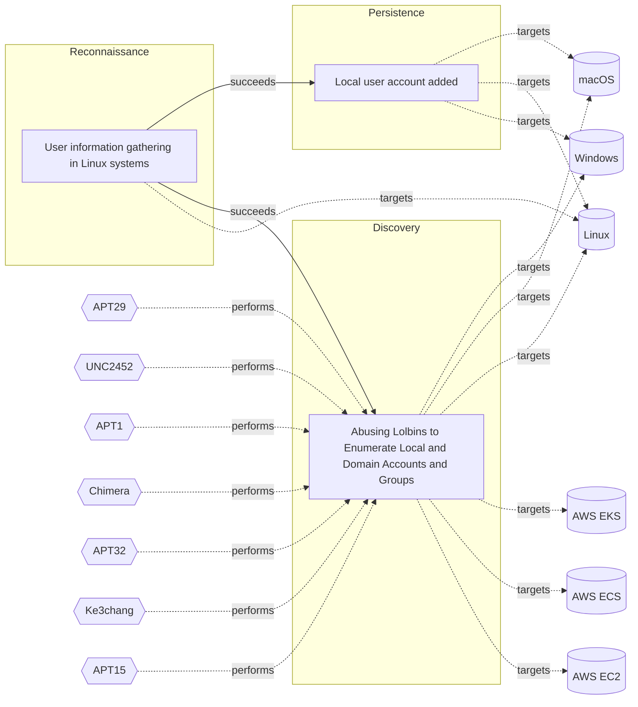

# ☣️ User information gathering in Linux systems

🔥 **Criticality:Medium** ❗ : A Medium priority incident may affect public health or safety, national security, economic security, foreign relations, civil liberties, or public confidence. 

🚦 **TLP:CLEAR** ⚪ : Recipients can spread this to the world, there is no limit on disclosure.

🗡️ **ATT&CK Techniques** [T1589 : Gather Victim Identity Information](https://attack.mitre.org/techniques/T1589 'Adversaries may gather information about the victims identity that can be used during targeting Information about identities may include a variety of ')

---

`🔑 UUID : 8bc82ff8-e106-4377-98f1-2cb912631ffa` **|** `🏷️ Version : 1` **|** `🗓️ Creation Date : 2025-08-07` **|** `🗓️ Last Modification : 2025-08-12` **|** `Sharing Organisation : {'uuid': '56b0a0f0-b0bc-47d9-bb46-02f80ae2065a', 'name': 'EC DIGIT CSOC'}` **|** `🧱 Schema Identifier : tvm::2.1`

## 👁️ Description

> Threat actors use various methods and tools to collect user data on Linux
> systems. Some of them are given below.
> 
> ### Common methods used for gathering of user's information on Linux
> 
> Examples:
> 
> - Current user: for reconnaissance purposes on a Linux system threat actors
>   are using commands like `whoami` to retrieve the current username running
>   on the system. Threat actors can use and `lslogins` to list an information
>   about known users in the system, which typically includes details such as
>   the username, UID (User ID), GID (Group ID), home directory, shell, last
>   login time, and more, depending on the options used and the system
>   configuration ref [1].  
> - User list: a threat actor group can use a `getent` command with an option
>   `passwd` or `cat /etc/passwd` command to retrieve a list of all users on
>   the system ref [1].
> - User ID and group ID: the `id` command can be used to retrieve the user ID
>   and a group ID of the current user ref [2].
> - Group list: a command `groups` <group_name> can be used in Linux to view
>   user's group membership. Or with other command `getent group` or cat
>   `/etc/group` thereat actors can retrieve a list of all groups on the
>   system ref [1],[4].  
> - Other user's information: commands like `who` can show an information for
>   the current logged-in user. A threat actor may use and `users` command
>   to display the list of currently logged-in users on the Linux system
>   ref [1].
> - Linux user's activity: `w` coomand executed on Linux shows the current
>   logged users activity on the system ref [1]. 
> - User shell: a threat actor may run the command `getent passwd <username>`
>   to retrieve the user's shell. The command output lists the user details
>   from the 'passwd' database, including the username, user ID, group ID,
>   home directory, and default shell ref [5].  
> - Last login: an adversary can use the `lastlog` command to retrieve
>   information about the last user's login ref [6]. 
> - Failed login attempts: with the `faillog` command a threat actor may
>   retrieve information about failed login attempts ref [7].
> 
> ### Some of the known tools used for Linux user's information collection
> 
> - `Metasploit`: A penetration testing framework that includes tools for
>   collecting user data and exploiting vulnerabilities.
> - `Linux.Ekoms`: This is a custom tool that can collect user data, including
>   login credentials and credit card numbers.
> - `Linux.Mumblehard`: it's a malware that collects user data and uses it for
>   spamming and phishing campaigns.
> - `TsarSapphire`: This utility can collect user data, including login
>   credentials and sensitive information.
> - `Remaiten`: A payload for Linux which collects user data and uses it for
>   malicious activities.
> - `Kaiten`: A Linux malware that collects user data and potentially can use
>   it further for distributed denial-of-service (DDoS) attacks.
> - `Linux.Keylogger`: A keylogger that collects user keystrokes, including
>   login credentials and sensitive information.
> - `Mayhem`: This is a malware that can collect user data on Linux, including
>   login credentials and sensitive information, and uses it for malicious
>   activities.

## 🖥️ Terrain 

 > Requires an initial access to a Linux system with sufficient
> rights to execute commands. 
> 

---

## 🕸️ Relations

### 🌊 OpenTide Objects
🚫 No related OpenTide objects indexed.

 --- 

### ⛓️ Threat Chaining

Expand chaining data

| ☣️ Vector                                                                                                                                                                                                                                                                                    | ⛓️ Link              | 🎯 Target                                                                                                                                                                                                                                                                                                                                         | ⛰️ Terrain                                                                                                                                                | 🗡️ ATT&CK                                                                                                                                                                                                                                                                                                                                                                                                                                                                                                                                                                                                                                                                                                                                                                                                                                                                                                                                                                                                                                          |
|:---------------------------------------------------------------------------------------------------------------------------------------------------------------------------------------------------------------------------------------------------------------------------------------------|:---------------------|:-------------------------------------------------------------------------------------------------------------------------------------------------------------------------------------------------------------------------------------------------------------------------------------------------------------------------------------------------|:----------------------------------------------------------------------------------------------------------------------------------------------------------|:---------------------------------------------------------------------------------------------------------------------------------------------------------------------------------------------------------------------------------------------------------------------------------------------------------------------------------------------------------------------------------------------------------------------------------------------------------------------------------------------------------------------------------------------------------------------------------------------------------------------------------------------------------------------------------------------------------------------------------------------------------------------------------------------------------------------------------------------------------------------------------------------------------------------------------------------------------------------------------------------------------------------------------------------------|
| [User information gathering in Linux systems](../Threat%20Vectors/☣️%20User%20information%20gathering%20in%20Linux%20systems.md 'Threat actors use various methods and tools to collect user data on Linuxsystems Some of them are given below### Common methods used for gathering of ...') | `sequence::succeeds` | [Abusing Lolbins to Enumerate Local and Domain Accounts and Groups](../Threat%20Vectors/☣️%20Abusing%20Lolbins%20to%20Enumerate%20Local%20and%20Domain%20Accounts%20and%20Groups.md 'Adversaries may attempt to enumerate the environment and list alllocal system and domain accounts or groups  To achieve this purpose, they can use var...') | Adversaries can take advantage of already compromised system (Windows or  Linux OS or OSX) to run commands.                                               | [T1087.001 : Account Discovery: Local Account](https://attack.mitre.org/techniques/T1087/001 'Adversaries may attempt to get a listing of local system accounts This information can help adversaries determine which local accounts exist on a syst'), [T1087.002 : Account Discovery: Domain Account](https://attack.mitre.org/techniques/T1087/002 'Adversaries may attempt to get a listing of domain accounts This information can help adversaries determine which domain accounts exist to aid in foll'), [T1069.001 : Permission Groups Discovery: Local Groups](https://attack.mitre.org/techniques/T1069/001 'Adversaries may attempt to find local system groups and permission settings The knowledge of local system permission groups can help adversaries deter'), [T1069.002 : Permission Groups Discovery: Domain Groups](https://attack.mitre.org/techniques/T1069/002 'Adversaries may attempt to find domain-level groups and permission settings The knowledge of domain-level permission groups can help adversaries deter') |
| [User information gathering in Linux systems](../Threat%20Vectors/☣️%20User%20information%20gathering%20in%20Linux%20systems.md 'Threat actors use various methods and tools to collect user data on Linuxsystems Some of them are given below### Common methods used for gathering of ...') | `sequence::succeeds` | [Local user account added](../Threat%20Vectors/☣️%20Local%20user%20account%20added.md 'Threat actors may add or modify local user accounts on compromised systems to establish persistence, maintain unauthorized access, and potentially esc...')                                                                                               | Adversary must have existing administrative privileges on a compromised host  within the targeted infrastructure to create or modify local user accounts. | [T1136.001 : Create Account: Local Account](https://attack.mitre.org/techniques/T1136/001 'Adversaries may create a local account to maintain access to victim systems Local accounts are those configured by an organization for use by users, r')                                                                                                                                                                                                                                                                                                                                                                                                                                                                                                                                                                                                                                                                                                                                                                                                |

&nbsp; 

---

## Model Data

#### **⛓️ Cyber Kill Chain**

 > Cyber attacks are typically phased progressions towards strategic objectives. The Unified Kill Chains provides insight into the tactics that hackers employ to attain these objectives. This provides a solid basis to develop (or realign) defensive strategies to raise cyber resilience.

 [`🔭 Reconnaissance`](https://www.unifiedkillchain.com/assets/The-Unified-Kill-Chain.pdf) : Researching, identifying and selecting targets using active or passive reconnaissance.

---

#### **🛰️ Domains**

 > Infrastructure technologies domain of interest to attackers.

 `🏢 Enterprise` : Generic databases, applications, machines and systems that are usually on premises or on Cloud traditional VMs.

---

#### **🎯 Targets**

 > Granular delimited technical entities holding a value to the organization, that are targeted by adversaries. They might be also involved in the detection coverage as the target of log collection. Partially inspired by Veris.

  - [`👤 End-user`](http://veriscommunity.net/enums.html#section-asset) : People - End-user
 - [`👤 Customer`](http://veriscommunity.net/enums.html#section-asset) : People - Customer

---

#### **💿 Platforms concerned**

 > Actual technologies used by the organization that will be exploited by adversaries during a successful attack, and eventually of relevance for detection. Are named by commercial designation.

 ` Linux` : Placeholder

---

#### **💣 Severity**

 > The severity summarizes the overall danger of incident the vector will provoke, and is to be derived (WIP) from impact, leverage, and difficulty to execute.

 [`🧨 Moderate incident`](https://www.ncsc.gov.uk/news/new-cyber-attack-categorisation-system-improve-uk-response-incidents) : A cyber attack on a small organisation, or which poses a considerable risk to a medium-sized organisation, or preliminary indications of cyber activity against a large organisation or the government.

---

#### **🪄 Leverage acquisition**

 > Technical aftermath of the attack from the target perspective, differentiated from impact as it does not consider the value of the consequence, only what increased control the vector execution provides to the adversary.

 [`👁️‍🗨️ Information Disclosure`](https://owasp.org/www-community/Threat_Modeling_Process#stride) : Threat action intending to read a file that one was not granted access to, or to read data in transit.

---

#### **💥 Impact**

 > Analysis of the threat vector from the organizational perspective, in non technical term. This aims at putting a clear denomination on what the attacker will actually be able to act upon if the threat vector is realized.

 [`🔓 Data Breach`](http://veriscommunity.net/enums.html#section-impact) : Non-public information has been accessed from the outside, and successfully extracted.

---

#### **🎲 Vector Viability**

 > Described with estimative language (likelyhood probability), describes how likely the analyst believes the vector to actually be realized on the organization infrastructure. Estimative language describes quality and credibility of underlying sources, data, and methodologies based Intelligence Community Directive 203 (ICD 203) and JP 2-0, Joint Intelligence.

 [`🧐 Likely`](https://www.dni.gov/files/documents/ICD/ICD%20203%20Analytic%20Standards.pdf) : Probable (probably) - 55-80%

---

### 🔗 References

**🕊️ Publicly available resources**

- [_1_] https://www.tecmint.com/check-user-in-linux
- [_2_] https://docs.rtlcopymemory.com/privilege-escalation/linux-privilege-escalation/information-gathering
- [_3_] https://medium.com/@velmuruganofficial/top-15-advanced-and-best-information-gathering-tools-67f07550e502
- [_4_] https://linuxsimply.com/getent-command-in-linux/
- [_5_] https://www.geeksforgeeks.org/linux-unix/getent-command-in-linux-with-examples
- [_6_] https://www.man7.org/linux/man-pages/man8/lastlog.8.html
- [_7_] https://www.cyberciti.biz/faq/faillog-in-linux-command

[1]: https://www.tecmint.com/check-user-in-linux
[2]: https://docs.rtlcopymemory.com/privilege-escalation/linux-privilege-escalation/information-gathering
[3]: https://medium.com/@velmuruganofficial/top-15-advanced-and-best-information-gathering-tools-67f07550e502
[4]: https://linuxsimply.com/getent-command-in-linux/
[5]: https://www.geeksforgeeks.org/linux-unix/getent-command-in-linux-with-examples
[6]: https://www.man7.org/linux/man-pages/man8/lastlog.8.html
[7]: https://www.cyberciti.biz/faq/faillog-in-linux-command

---

#### 🏷️ Tags

#-, #-, #-, #
, #
, ##, ##, ##, ##, # , #🏷, #️, # , #T, #a, #g, #s, #
, #

