# ☣️ VBS script creates a scheduled task

🔥 **Criticality:High** ⚠️ : A High priority incident is likely to result in a demonstrable impact to public health or safety, national security, economic security, foreign relations, civil liberties, or public confidence. 

🚦 **TLP:CLEAR** ⚪ : Recipients can spread this to the world, there is no limit on disclosure.


🗡️ **ATT&CK Techniques** [T1569.002 : System Services: Service Execution](https://attack.mitre.org/techniques/T1569/002 'Adversaries may abuse the Windows service control manager to execute malicious commands or payloads The Windows service control manager codeservicesex'), [T1053 : Scheduled Task/Job](https://attack.mitre.org/techniques/T1053 'Adversaries may abuse task scheduling functionality to facilitate initial or recurring execution of malicious code Utilities exist within all major op'), [T1082 : System Information Discovery](https://attack.mitre.org/techniques/T1082 'An adversary may attempt to get detailed information about the operating system and hardware, including version, patches, hotfixes, service packs, and'), [T1005 : Data from Local System](https://attack.mitre.org/techniques/T1005 'Adversaries may search local system sources, such as file systems, configuration files, local databases, or virtual machine files, to find files of in'), [T1112 : Modify Registry](https://attack.mitre.org/techniques/T1112 'Adversaries may interact with the Windows Registry as part of a variety of other techniques to aid in defense evasion, persistence, and executionAcces'), [T1053.005 : Scheduled Task/Job: Scheduled Task](https://attack.mitre.org/techniques/T1053/005 'Adversaries may abuse the Windows Task Scheduler to perform task scheduling for initial or recurring execution of malicious code There are multiple wa')


---

`🔑 UUID : 53ca52ed-a7e7-4094-95ec-b4ef522dc689` **|** `🏷️ Version : 1` **|** `🗓️ Creation Date : 2025-06-25` **|** `🗓️ Last Modification : 2025-07-08` **|** `Sharing Organisation : {'uuid': '56b0a0f0-b0bc-47d9-bb46-02f80ae2065a', 'name': 'EC DIGIT CSOC'}` **|** `🧱 Schema Identifier : tvm::2.1`


## 👁️ Description

> Threat actors often use Visual Basic Scripting (VBS) to create scheduled
> tasks on compromised Windows systems. VBS is a built-in scripting language
> on Windows systems, making it an attractive choice for threat actors. It
> allows the threat actors to execute code without relying on external tools
> or binaries, reducing the risk of detection.    
> 
> Once executed by the victim, the VBScript establishes persistence on
> infected machines by creating scheduled tasks and modifying the Windows
> Registry.
> 
> ### Creating a scheduled task using a VBS script
> 
> To create a scheduled task using VBS, threat actors typically follow the
> steps provided below:
> 1. An initial VBS script creation - the attacker creates a VBS script that
> contains the malicious code. This script can be embedded in an email
> attachment, downloaded from a compromised website, or created locally on
> the compromised system.  
> 2. The created VBS script uses `schtasks` - the VBS script uses the
> `schtasks` to create a new scheduled task. The `SchTasks` command is a
> built-in Windows utility that allows users to create, delete, and manage
> scheduled tasks.
> 3. Task details: The VBS script specifies the task details, including the
> task name, description, and the command or script to be executed.
> 4. Set a task trigger - the VBS script may set a task trigger, which defines
> when the task should be executed. This can be a specific time, daily,
> weekly, or on system startup.
> 5. A task preservation - the VBS scrip
> 
> ### Some of the techniques used to achieve VBS persistence and
> obfuscation
> 
> - Obfuscation: Threat actors often obfuscate their VBS scripts to evade
> detection by security software. They use techniques like random variable
> names, fake function calls or garbage code to hide the function of the
> malicious code.  
> 
> - Scheduled task chaining: Threat actors create as tasks under the current
> user or if allowed under SYSTEM to elevate privileges and maintain foothold
> onto the system.  
> 
> ### An example for a VBS script which creates a scheduled task
> 
> Below is given an example of a VBS (Visual Basic Scripting) script that
> creates a scheduled task to run a command or application at a specified
> time. This script uses the Windows Task Scheduler to schedule the task.  
> 
> ```visualbasic
> 
> ' Create a new task
> Dim sch, task
> Set sch = CreateObject("Schedule.Service")
> sch.Connect()
> 
> ' Define the task
> Dim taskDefinition
> Set taskDefinition = sch.CreateNewTask(0)
> 
> ' Set task registration info
> taskDefinition.RegistrationInfo.Description = "This is a test task created by VBS script"
> taskDefinition.RegistrationInfo.Author = "Your Name"
> 
> ' Set task principal (who runs the task)
> Dim principal
> Set principal = taskDefinition.Principal
> principal.LogonType = 3 ' Interactive or 3 for S4U
> principal.UserId = "NT AUTHORITY\SYSTEM" ' You can change this to a different user
> 
> ' Set task trigger (when to run the task)
> Dim trigger
> Set trigger = taskDefinition.Triggers.Create(_
> TaskTriggerType2.Daily)
> trigger.StartTime = "08:00:00" ' 8 AM daily
> trigger.Id = "DailyTrigger"
> 
> ' Set task action (what to run)
> Dim action
> Set action = taskDefinition.Actions.Create(_
> TaskActionType.Exec)
> action.Path = "C:\Windows\System32\notepad.exe" ' Path to the application to run
> action.Arguments = "" ' Arguments if any
> 
> ' Register the task
> Dim taskFolder
> Set taskFolder = sch.GetFolder("\")
> taskFolder.RegisterTaskDefinition "TestVBS Task", taskDefinition, 6, , , 3, , , task
> 
> ```
> 


## 🖥️ Terrain 

 > A threat actor needs to entice an end user to execute VBScript loader to
> gain an initial access to the system. Some of these techniques include
> social engineering and targeted (spear-phishing) or mass-spread phishing
> campaigns.  
> 

---

## 🕸️ Relations


### 🐲 Actors sightings 

| Actor               | Description                                                                                                                                                                                                                                                                                                                                                                                                                                                                                                                                                                                                                                                                                                                                                                                                                                                                                                                                                                                                                                                                                                                                                                                                                                                                                                                                                                                                                                                                                                                                                                                                                                                                                                                                                                                                                                                                                                                                                                                                                                                                                                                                                                                                                                                                                                        | Aliases                                                                                                                                                                                                                                                                                                                                                                                                                                                                                                                                                | Source                     | Sighting                                                                                                                                                                                                                                             | Reference                                                                                                                                          |
|:--------------------|:-------------------------------------------------------------------------------------------------------------------------------------------------------------------------------------------------------------------------------------------------------------------------------------------------------------------------------------------------------------------------------------------------------------------------------------------------------------------------------------------------------------------------------------------------------------------------------------------------------------------------------------------------------------------------------------------------------------------------------------------------------------------------------------------------------------------------------------------------------------------------------------------------------------------------------------------------------------------------------------------------------------------------------------------------------------------------------------------------------------------------------------------------------------------------------------------------------------------------------------------------------------------------------------------------------------------------------------------------------------------------------------------------------------------------------------------------------------------------------------------------------------------------------------------------------------------------------------------------------------------------------------------------------------------------------------------------------------------------------------------------------------------------------------------------------------------------------------------------------------------------------------------------------------------------------------------------------------------------------------------------------------------------------------------------------------------------------------------------------------------------------------------------------------------------------------------------------------------------------------------------------------------------------------------------------------------|:-------------------------------------------------------------------------------------------------------------------------------------------------------------------------------------------------------------------------------------------------------------------------------------------------------------------------------------------------------------------------------------------------------------------------------------------------------------------------------------------------------------------------------------------------------|:---------------------------|:-----------------------------------------------------------------------------------------------------------------------------------------------------------------------------------------------------------------------------------------------------|:---------------------------------------------------------------------------------------------------------------------------------------------------|
| [ICS] FIN7          | [FIN7](https://attack.mitre.org/groups/G0046) is a financially-motivated threat group that has been active since 2013. [FIN7](https://attack.mitre.org/groups/G0046) has primarily targeted the retail, restaurant, hospitality, software, consulting, financial services, medical equipment, cloud services, media, food and beverage, transportation, and utilities industries in the U.S. A portion of [FIN7](https://attack.mitre.org/groups/G0046) was run out of a front company called Combi Security and often used point-of-sale malware for targeting efforts. Since 2020, [FIN7](https://attack.mitre.org/groups/G0046) shifted operations to a big game hunting (BGH) approach including use of [REvil](https://attack.mitre.org/software/S0496) ransomware and their own Ransomware as a Service (RaaS), Darkside. FIN7 may be linked to the [Carbanak](https://attack.mitre.org/groups/G0008) Group, but there appears to be several groups using [Carbanak](https://attack.mitre.org/software/S0030) malware and are therefore tracked separately.(Citation: FireEye FIN7 March 2017)(Citation: FireEye FIN7 April 2017)(Citation: FireEye CARBANAK June 2017)(Citation: FireEye FIN7 Aug 2018)(Citation: CrowdStrike Carbon Spider August 2021)(Citation: Mandiant FIN7 Apr 2022)                                                                                                                                                                                                                                                                                                                                                                                                                                                                                                                                                                                                                                                                                                                                                                                                                                                                                                                                                                                                                  | Carbon Spider, ELBRUS, GOLD NIAGARA, ITG14, Sangria Tempest                                                                                                                                                                                                                                                                                                                                                                                                                                                                                            | 🗡️ MITRE ATT&CK Groups     | No documented sighting                                                                                                                                                                                                                               | No documented references                                                                                                                           |
| FIN7                | Groups targeting financial organizations or people with significant financial assets.                                                                                                                                                                                                                                                                                                                                                                                                                                                                                                                                                                                                                                                                                                                                                                                                                                                                                                                                                                                                                                                                                                                                                                                                                                                                                                                                                                                                                                                                                                                                                                                                                                                                                                                                                                                                                                                                                                                                                                                                                                                                                                                                                                                                                              | CARBON SPIDER, GOLD NIAGARA, Calcium, ATK32, G0046, G0008, Coreid, Carbanak, Sangria Tempest, ELBRUS, Carbon Spider, JokerStash                                                                                                                                                                                                                                                                                                                                                                                                                        | 🌌 MISP Threat Actor Galaxy | FIN7 threat actor group has been observed using VBS scripts to createscheduled tasks for persistence, lateral movement and financial gainref [5].                                                                                                    | https://cloud.google.com/blog/topics/threat-intelligence/fin7-phishing-lnk                                                                         |
| [ICS] Lazarus Group | [Lazarus Group](https://attack.mitre.org/groups/G0032) is a North Korean state-sponsored cyber threat group that has been attributed to the Reconnaissance General Bureau.(Citation: US-CERT HIDDEN COBRA June 2017)(Citation: Treasury North Korean Cyber Groups September 2019) The group has been active since at least 2009 and was reportedly responsible for the November 2014 destructive wiper attack against Sony Pictures Entertainment as part of a campaign named Operation Blockbuster by Novetta. Malware used by [Lazarus Group](https://attack.mitre.org/groups/G0032) correlates to other reported campaigns, including Operation Flame, Operation 1Mission, Operation Troy, DarkSeoul, and Ten Days of Rain.(Citation: Novetta Blockbuster)North Korean group definitions are known to have significant overlap, and some security researchers report all North Korean state-sponsored cyber activity under the name [Lazarus Group](https://attack.mitre.org/groups/G0032) instead of tracking clusters or subgroups, such as [Andariel](https://attack.mitre.org/groups/G0138), [APT37](https://attack.mitre.org/groups/G0067), [APT38](https://attack.mitre.org/groups/G0082), and [Kimsuky](https://attack.mitre.org/groups/G0094).                                                                                                                                                                                                                                                                                                                                                                                                                                                                                                                                                                                                                                                                                                                                                                                                                                                                                                                                                                                                                                                          | Diamond Sleet, Guardians of Peace, HIDDEN COBRA, Labyrinth Chollima, NICKEL ACADEMY, ZINC                                                                                                                                                                                                                                                                                                                                                                                                                                                              | 🗡️ MITRE ATT&CK Groups     | No documented sighting                                                                                                                                                                                                                               | No documented references                                                                                                                           |
| Lazarus Group       | Since 2009, HIDDEN COBRA actors have leveraged their capabilities to target and compromise a range of victims; some intrusions have resulted in the exfiltration of data while others have been disruptive in nature. Commercial reporting has referred to this activity as Lazarus Group and Guardians of Peace. Tools and capabilities used by HIDDEN COBRA actors include DDoS botnets, keyloggers, remote access tools (RATs), and wiper malware. Variants of malware and tools used by HIDDEN COBRA actors include Destover, Duuzer, and Hangman.                                                                                                                                                                                                                                                                                                                                                                                                                                                                                                                                                                                                                                                                                                                                                                                                                                                                                                                                                                                                                                                                                                                                                                                                                                                                                                                                                                                                                                                                                                                                                                                                                                                                                                                                                             | Operation DarkSeoul, Dark Seoul, Hidden Cobra, Hastati Group, Andariel, Unit 121, Bureau 121, NewRomanic Cyber Army Team, Bluenoroff, Subgroup: Bluenoroff, Group 77, Labyrinth Chollima, Operation Troy, Operation GhostSecret, Operation AppleJeus, APT38, APT 38, Stardust Chollima, Whois Hacking Team, Zinc, Appleworm, Nickel Academy, APT-C-26, NICKEL GLADSTONE, COVELLITE, ATK3, G0032, ATK117, G0082, Citrine Sleet, DEV-0139, DEV-1222, Diamond Sleet, ZINC, Sapphire Sleet, COPERNICIUM, TA404, Lazarus group, BeagleBoyz, Moonstone Sleet | 🌌 MISP Threat Actor Galaxy | A North Korean state-sponsored threat actor group that has been linkedto various high-profile attacks, including the 2014 Sony Pictures hack.They have used VBS scripts to create scheduled tasks for malwareexecution and persistence ref [6], [7]. | https://www.virusbulletin.com/virusbulletin/2018/11/vb2018-paper-hacking-sony-pictures, https://www.kaspersky.com/blog/operation-blockbuster/11407 |
| [Enterprise] APT29  | [APT29](https://attack.mitre.org/groups/G0016) is threat group that has been attributed to Russia's Foreign Intelligence Service (SVR).(Citation: White House Imposing Costs RU Gov April 2021)(Citation: UK Gov Malign RIS Activity April 2021) They have operated since at least 2008, often targeting government networks in Europe and NATO member countries, research institutes, and think tanks. [APT29](https://attack.mitre.org/groups/G0016) reportedly compromised the Democratic National Committee starting in the summer of 2015.(Citation: F-Secure The Dukes)(Citation: GRIZZLY STEPPE JAR)(Citation: Crowdstrike DNC June 2016)(Citation: UK Gov UK Exposes Russia SolarWinds April 2021)In April 2021, the US and UK governments attributed the [SolarWinds Compromise](https://attack.mitre.org/campaigns/C0024) to the SVR; public statements included citations to [APT29](https://attack.mitre.org/groups/G0016), Cozy Bear, and The Dukes.(Citation: NSA Joint Advisory SVR SolarWinds April 2021)(Citation: UK NSCS Russia SolarWinds April 2021) Industry reporting also referred to the actors involved in this campaign as UNC2452, NOBELIUM, StellarParticle, Dark Halo, and SolarStorm.(Citation: FireEye SUNBURST Backdoor December 2020)(Citation: MSTIC NOBELIUM Mar 2021)(Citation: CrowdStrike SUNSPOT Implant January 2021)(Citation: Volexity SolarWinds)(Citation: Cybersecurity Advisory SVR TTP May 2021)(Citation: Unit 42 SolarStorm December 2020)                                                                                                                                                                                                                                                                                                                                                                                                                                                                                                                                                                                                                                                                                                                                                                                                                       | Blue Kitsune, Cozy Bear, CozyDuke, Dark Halo, IRON HEMLOCK, IRON RITUAL, Midnight Blizzard, NOBELIUM, NobleBaron, SolarStorm, The Dukes, UNC2452, UNC3524, YTTRIUM                                                                                                                                                                                                                                                                                                                                                                                     | 🗡️ MITRE ATT&CK Groups     | No documented sighting                                                                                                                                                                                                                               | No documented references                                                                                                                           |
| APT29               | A 2015 report by F-Secure describe APT29 as: 'The Dukes are a well-resourced, highly dedicated and organized cyberespionage group that we believe has been working for the Russian Federation since at least 2008 to collect intelligence in support of foreign and security policy decision-making. The Dukes show unusual confidence in their ability to continue successfully compromising their targets, as well as in their ability to operate with impunity. The Dukes primarily target Western governments and related organizations, such as government ministries and agencies, political think tanks, and governmental subcontractors. Their targets have also included the governments of members of the Commonwealth of Independent States;Asian, African, and Middle Eastern governments;organizations associated with Chechen extremism;and Russian speakers engaged in the illicit trade of controlled substances and drugs. The Dukes are known to employ a vast arsenal of malware toolsets, which we identify as MiniDuke, CosmicDuke, OnionDuke, CozyDuke, CloudDuke, SeaDuke, HammerDuke, PinchDuke, and GeminiDuke. In recent years, the Dukes have engaged in apparently biannual large - scale spear - phishing campaigns against hundreds or even thousands of recipients associated with governmental institutions and affiliated organizations. These campaigns utilize a smash - and - grab approach involving a fast but noisy breakin followed by the rapid collection and exfiltration of as much data as possible.If the compromised target is discovered to be of value, the Dukes will quickly switch the toolset used and move to using stealthier tactics focused on persistent compromise and long - term intelligence gathering. This threat actor targets government ministries and agencies in the West, Central Asia, East Africa, and the Middle East; Chechen extremist groups; Russian organized crime; and think tanks. It is suspected to be behind the 2015 compromise of unclassified networks at the White House, Department of State, Pentagon, and the Joint Chiefs of Staff. The threat actor includes all of the Dukes tool sets, including MiniDuke, CosmicDuke, OnionDuke, CozyDuke, SeaDuke, CloudDuke (aka MiniDionis), and HammerDuke (aka Hammertoss). ' | Group 100, COZY BEAR, The Dukes, Minidionis, SeaDuke, YTTRIUM, IRON HEMLOCK, Grizzly Steppe, G0016, ATK7, Cloaked Ursa, TA421, Blue Kitsune, ITG11, BlueBravo, Nobelium, UAC-0029                                                                                                                                                                                                                                                                                                                                                                      | 🌌 MISP Threat Actor Galaxy | A Russian state-sponsored threat actor group that has been linked tovarious cyber espionage campaigns. They have been observed using VBSscripts to create scheduled tasks for malware execution and persistence.                                     | https://malpedia.caad.fkie.fraunhofer.de/actor/apt29                                                                                               |

### 🌊 OpenTide Objects
🚫 No related OpenTide objects indexed.


 --- 

### ⛓️ Threat Chaining

```mermaid

flowchart LR

53ca52ed-a7e7-4094-95ec-b4ef522dc689[VBS script creates a scheduled task]
dd5d942c-bac4-4000-b9a6-ca4fef6cfb84[Spearphishing Attachment]
c7ed4fad-a58f-47da-9938-4a673526b3f4[HTML smuggling technique]
1a68b5eb-0112-424d-a21f-88dda0b6b8df[Spearphishing Link]

subgraph Persistence
53ca52ed-a7e7-4094-95ec-b4ef522dc689
end
subgraph Delivery
dd5d942c-bac4-4000-b9a6-ca4fef6cfb84
1a68b5eb-0112-424d-a21f-88dda0b6b8df
end
subgraph Defense Evasion
c7ed4fad-a58f-47da-9938-4a673526b3f4
end

Windows[(Windows)]
Office365[(Office 365)]
Android[(Android)]
iOS[(iOS)]
Github[(Github)]
Gitlab[(Gitlab)]
FIN7{{FIN7}}
LazarusGroup{{Lazarus Group}}
APT29{{APT29}}
UNC2452{{UNC2452}}
WizardSpider{{Wizard Spider}}
UNC1878{{UNC1878}}
GamaredonGroup{{Gamaredon Group}}
APT28{{APT28}}
MustangPanda{{Mustang Panda}}
RedDelta{{RedDelta}}
TA505{{TA505}}
RomCom{{RomCom}}
APT42{{APT42}}

53ca52ed-a7e7-4094-95ec-b4ef522dc689 -.->|targets| Windows
dd5d942c-bac4-4000-b9a6-ca4fef6cfb84 -.->|targets| Windows
dd5d942c-bac4-4000-b9a6-ca4fef6cfb84 -.->|targets| Office365
dd5d942c-bac4-4000-b9a6-ca4fef6cfb84 -.->|targets| Android
dd5d942c-bac4-4000-b9a6-ca4fef6cfb84 -.->|targets| iOS
c7ed4fad-a58f-47da-9938-4a673526b3f4 -.->|targets| Windows
c7ed4fad-a58f-47da-9938-4a673526b3f4 -.->|targets| iOS
c7ed4fad-a58f-47da-9938-4a673526b3f4 -.->|targets| Android
1a68b5eb-0112-424d-a21f-88dda0b6b8df -.->|targets| Windows
1a68b5eb-0112-424d-a21f-88dda0b6b8df -.->|targets| Office365
1a68b5eb-0112-424d-a21f-88dda0b6b8df -.->|targets| Android
1a68b5eb-0112-424d-a21f-88dda0b6b8df -.->|targets| iOS
1a68b5eb-0112-424d-a21f-88dda0b6b8df -.->|targets| Github
1a68b5eb-0112-424d-a21f-88dda0b6b8df -.->|targets| Gitlab
FIN7 -.-> |performs| 53ca52ed-a7e7-4094-95ec-b4ef522dc689
LazarusGroup -.-> |performs| 53ca52ed-a7e7-4094-95ec-b4ef522dc689
APT29 -.-> |performs| 53ca52ed-a7e7-4094-95ec-b4ef522dc689
APT29 -.-> |performs| dd5d942c-bac4-4000-b9a6-ca4fef6cfb84
UNC2452 -.-> |performs| dd5d942c-bac4-4000-b9a6-ca4fef6cfb84
WizardSpider -.-> |performs| dd5d942c-bac4-4000-b9a6-ca4fef6cfb84
UNC1878 -.-> |performs| dd5d942c-bac4-4000-b9a6-ca4fef6cfb84
GamaredonGroup -.-> |performs| dd5d942c-bac4-4000-b9a6-ca4fef6cfb84
APT28 -.-> |performs| dd5d942c-bac4-4000-b9a6-ca4fef6cfb84
MustangPanda -.-> |performs| dd5d942c-bac4-4000-b9a6-ca4fef6cfb84
RedDelta -.-> |performs| dd5d942c-bac4-4000-b9a6-ca4fef6cfb84
TA505 -.-> |performs| dd5d942c-bac4-4000-b9a6-ca4fef6cfb84
RomCom -.-> |performs| dd5d942c-bac4-4000-b9a6-ca4fef6cfb84
APT29 -.-> |performs| c7ed4fad-a58f-47da-9938-4a673526b3f4
APT42 -.-> |performs| 1a68b5eb-0112-424d-a21f-88dda0b6b8df

53ca52ed-a7e7-4094-95ec-b4ef522dc689 -->|succeeds| dd5d942c-bac4-4000-b9a6-ca4fef6cfb84
53ca52ed-a7e7-4094-95ec-b4ef522dc689 -->|succeeds| c7ed4fad-a58f-47da-9938-4a673526b3f4
c7ed4fad-a58f-47da-9938-4a673526b3f4 -->|succeeds| 1a68b5eb-0112-424d-a21f-88dda0b6b8df
c7ed4fad-a58f-47da-9938-4a673526b3f4 -->|succeeds| dd5d942c-bac4-4000-b9a6-ca4fef6cfb84

```




<details>
<summary>Expand chaining data</summary>

| ☣️ Vector                                                                                                                                                                                                                                                                    | ⛓️ Link              | 🎯 Target                                                                                                                                                                                                                                         | ⛰️ Terrain                                                                                                                                                                                                                                                                                                                                                                                                                                                                                                                                                                                                                                                                                                                                                                                                                                                | 🗡️ ATT&CK                                                                                                                                                                                                                                                                                                                                                                                                                                                                                                                                                                                                                                                                                                                                                                                                                                                                                                                                                                               |
|:-----------------------------------------------------------------------------------------------------------------------------------------------------------------------------------------------------------------------------------------------------------------------------|:---------------------|:-------------------------------------------------------------------------------------------------------------------------------------------------------------------------------------------------------------------------------------------------|:----------------------------------------------------------------------------------------------------------------------------------------------------------------------------------------------------------------------------------------------------------------------------------------------------------------------------------------------------------------------------------------------------------------------------------------------------------------------------------------------------------------------------------------------------------------------------------------------------------------------------------------------------------------------------------------------------------------------------------------------------------------------------------------------------------------------------------------------------------|:----------------------------------------------------------------------------------------------------------------------------------------------------------------------------------------------------------------------------------------------------------------------------------------------------------------------------------------------------------------------------------------------------------------------------------------------------------------------------------------------------------------------------------------------------------------------------------------------------------------------------------------------------------------------------------------------------------------------------------------------------------------------------------------------------------------------------------------------------------------------------------------------------------------------------------------------------------------------------------------|
| [VBS script creates a scheduled task](../Threat%20Vectors/☣️%20VBS%20script%20creates%20a%20scheduled%20task.md 'Threat actors often use Visual Basic Scripting VBS to create scheduledtasks on compromised Windows systems VBS is a built-in scripting languageon Wind...') | `sequence::succeeds` | [Spearphishing Attachment](../Threat%20Vectors/☣️%20Spearphishing%20Attachment.md 'Spearphishing messages are often crafted using pernicious social engineeringtechniquesIn Spearphishing Attachment attacks, recipients receive emails t...')   | Spear phishing requires more preparation and time to achieve success  than a phishing attack. That is because spear-phishing attackers attempt to obtain vast amounts of personal information about their victims.   Attackers can get the personal information they need using different ways:   - to compromise an email or messaging system trough other means, - to use OSINT, sourcing Social Media or glean personal information from the user's online presence. They want to craft emails that look as legitimate and attractive as possible  to increase the chances of fooling their targets, for instance sending a malicious  attachment where the filename references a topic the recipient is interested in. The highly personalized nature of spear-phishing attacks makes it more  difficult to identity than widescale phishing attacks. | [T1566.001 : Phishing: Spearphishing Attachment](https://attack.mitre.org/techniques/T1566/001 'Adversaries may send spearphishing emails with a malicious attachment in an attempt to gain access to victim systems Spearphishing attachment is a spe')                                                                                                                                                                                                                                                                                                                                                                                                                                                                                                                                                                                                                                                                                                                                |
| [VBS script creates a scheduled task](../Threat%20Vectors/☣️%20VBS%20script%20creates%20a%20scheduled%20task.md 'Threat actors often use Visual Basic Scripting VBS to create scheduledtasks on compromised Windows systems VBS is a built-in scripting languageon Wind...') | `sequence::succeeds` | [HTML smuggling technique](../Threat%20Vectors/☣️%20HTML%20smuggling%20technique.md 'HTML smuggling is a technique used by attackers to embed a maliciouscode within HTML files, which are then smuggled past security controls,such as fir...') | A threat actor uses a legitimate and native features of web page scripting languages as HTML, CSS, JavaScript and others. This vulnerability in the page can lead to an initial access to a targeted system.                                                                                                                                                                                                                                                                                                                                                                                                                                                                                                                                                                                                                                              | [T1190 : Exploit Public-Facing Application](https://attack.mitre.org/techniques/T1190 'Adversaries may attempt to exploit a weakness in an Internet-facing host or system to initially access a network The weakness in the system can be a s'), [T1189 : Drive-by Compromise](https://attack.mitre.org/techniques/T1189 'Adversaries may gain access to a system through a user visiting a website over the normal course of browsing Multiple ways of delivering exploit code '), [T1204 : User Execution](https://attack.mitre.org/techniques/T1204 'An adversary may rely upon specific actions by a user in order to gain execution Users may be subjected to social engineering to get them to execute m'), [T1027.006 : Obfuscated Files or Information: HTML Smuggling](https://attack.mitre.org/techniques/T1027/006 'Adversaries may smuggle data and files past content filters by hiding malicious payloads inside of seemingly benign HTML files HTML documents can stor') |
| [HTML smuggling technique](../Threat%20Vectors/☣️%20HTML%20smuggling%20technique.md 'HTML smuggling is a technique used by attackers to embed a maliciouscode within HTML files, which are then smuggled past security controls,such as fir...')                             | `sequence::succeeds` | [Spearphishing Link](../Threat%20Vectors/☣️%20Spearphishing%20Link.md 'Adversaries may send spearphishing emails with a malicious link in anattempt to gain access to victim systems This sub-technique employsthe use of lin...')               | Spear phishing requires more preparation and time to achieve success than a phishing attack. That is because spear-phishing attackers attempt to obtain vast amounts of personal information about their victims,   the entities their work for, or their areas of interest.    Attackers can get the personal information they need using different ways: to compromise an email or messaging system trough other means, to use OSINT, scouring Social Media or glean personal information from the user's online presence.                                                                                                                                                                                                                                                                                                                              | [T1566.002 : Phishing: Spearphishing Link](https://attack.mitre.org/techniques/T1566/002 'Adversaries may send spearphishing emails with a malicious link in an attempt to gain access to victim systems Spearphishing with a link is a specific'), [T1036 : Masquerading](https://attack.mitre.org/techniques/T1036 'Adversaries may attempt to manipulate features of their artifacts to make them appear legitimate or benign to users andor security tools Masquerading '), [T1656 : Impersonation](https://attack.mitre.org/techniques/T1656 'Adversaries may impersonate a trusted person or organization in order to persuade and trick a target into performing some action on their behalf For e')                                                                                                                                                                                                                                                                             |
| [HTML smuggling technique](../Threat%20Vectors/☣️%20HTML%20smuggling%20technique.md 'HTML smuggling is a technique used by attackers to embed a maliciouscode within HTML files, which are then smuggled past security controls,such as fir...')                             | `sequence::succeeds` | [Spearphishing Attachment](../Threat%20Vectors/☣️%20Spearphishing%20Attachment.md 'Spearphishing messages are often crafted using pernicious social engineeringtechniquesIn Spearphishing Attachment attacks, recipients receive emails t...')   | Spear phishing requires more preparation and time to achieve success  than a phishing attack. That is because spear-phishing attackers attempt to obtain vast amounts of personal information about their victims.   Attackers can get the personal information they need using different ways:   - to compromise an email or messaging system trough other means, - to use OSINT, sourcing Social Media or glean personal information from the user's online presence. They want to craft emails that look as legitimate and attractive as possible  to increase the chances of fooling their targets, for instance sending a malicious  attachment where the filename references a topic the recipient is interested in. The highly personalized nature of spear-phishing attacks makes it more  difficult to identity than widescale phishing attacks. | [T1566.001 : Phishing: Spearphishing Attachment](https://attack.mitre.org/techniques/T1566/001 'Adversaries may send spearphishing emails with a malicious attachment in an attempt to gain access to victim systems Spearphishing attachment is a spe')                                                                                                                                                                                                                                                                                                                                                                                                                                                                                                                                                                                                                                                                                                                                |

</details>
&nbsp; 


---

## Model Data

#### **⛓️ Cyber Kill Chain**

 > Cyber attacks are typically phased progressions towards strategic objectives. The Unified Kill Chains provides insight into the tactics that hackers employ to attain these objectives. This provides a solid basis to develop (or realign) defensive strategies to raise cyber resilience.

 [`🔐 Persistence`](https://www.unifiedkillchain.com/assets/The-Unified-Kill-Chain.pdf) : Any access, action or change to a system that gives an attacker persistent presence on the system.

---

#### **🛰️ Domains**

 > Infrastructure technologies domain of interest to attackers.

 `🏢 Enterprise` : Generic databases, applications, machines and systems that are usually on premises or on Cloud traditional VMs.

---

#### **🎯 Targets**

 > Granular delimited technical entities holding a value to the organization, that are targeted by adversaries. They might be also involved in the detection coverage as the target of log collection. Partially inspired by Veris.

  - [`👤 Customer`](http://veriscommunity.net/enums.html#section-asset) : People - Customer
 - [`👤 End-user`](http://veriscommunity.net/enums.html#section-asset) : People - End-user
 - [`🖥️ Workstations`](http://veriscommunity.net/enums.html#section-asset) : Placeholder
 - [` Other`](http://veriscommunity.net/enums.html#section-asset) : Media - Other/Unknown
 - [`💻 Laptop`](http://veriscommunity.net/enums.html#section-asset) : User Device - Laptop
 - [`🕹️ Remote access`](http://veriscommunity.net/enums.html#section-asset) : Server - Remote access

---

#### **💿 Platforms concerned**

 > Actual technologies used by the organization that will be exploited by adversaries during a successful attack, and eventually of relevance for detection. Are named by commercial designation.

 ` Windows` : Placeholder

---

#### **💣 Severity**

 > The severity summarizes the overall danger of incident the vector will provoke, and is to be derived (WIP) from impact, leverage, and difficulty to execute.

 [`⚠️ Significant incident`](https://www.ncsc.gov.uk/news/new-cyber-attack-categorisation-system-improve-uk-response-incidents) : A cyber attack which has a serious impact on a large organisation or on wider / local government, or which poses a considerable risk to central government or (inter)national essential services.

---

#### **🪄 Leverage acquisition**

 > Technical aftermath of the attack from the target perspective, differentiated from impact as it does not consider the value of the consequence, only what increased control the vector execution provides to the adversary.

  - [`💅 Elevation of privilege`](https://owasp.org/www-community/Threat_Modeling_Process#stride) : Capacity to augment leverage over the target system by upgrading the compromised access rights
 - [`💀 Infrastructure Compromise`](https://owasp.org/www-community/Threat_Modeling_Process#stride) : The compromised target is likely to be used to further expand the sphere of influence of the attacker and allow more potent vectors to be executed.
 - [`👁️‍🗨️ Information Disclosure`](https://owasp.org/www-community/Threat_Modeling_Process#stride) : Threat action intending to read a file that one was not granted access to, or to read data in transit.
 - [`🐒 Tampering`](https://owasp.org/www-community/Threat_Modeling_Process#stride) : Threat action intending to maliciously change or modify persistent data, such as records in a database, and the alteration of data in transit between two computers over an open network, such as the Internet.

---

#### **💥 Impact**

 > Analysis of the threat vector from the organizational perspective, in non technical term. This aims at putting a clear denomination on what the attacker will actually be able to act upon if the threat vector is realized.

  - [`🩼 Impairement`](http://veriscommunity.net/enums.html#section-impact) : Incapacitation of a particular key system that will cause disruptions in day-to-day operations, and eventually service delivery.
 - [`🔓 Data Breach`](http://veriscommunity.net/enums.html#section-impact) : Non-public information has been accessed from the outside, and successfully extracted.
 - [`🤬 Lose Capabilities`](http://veriscommunity.net/enums.html#section-impact) : Vector execution will remove key functions to the organization, which will not be easily circumvented. Most day-to-day is heavily impaired, but processes can reorganize at a loss.

---

#### **🎲 Vector Viability**

 > Described with estimative language (likelyhood probability), describes how likely the analyst believes the vector to actually be realized on the organization infrastructure. Estimative language describes quality and credibility of underlying sources, data, and methodologies based Intelligence Community Directive 203 (ICD 203) and JP 2-0, Joint Intelligence.

 [`🧐 Likely`](https://www.dni.gov/files/documents/ICD/ICD%20203%20Analytic%20Standards.pdf) : Probable (probably) - 55-80%

---


### 🔗 References


**🕊️ Publicly available resources**

- [_1_] https://stackoverflow.com/questions/31549393/vbscript-for-creating-a-scheduled-task
- [_2_] https://www.picussecurity.com/resource/blog/picus-10-critical-mitre-attck-techniques-t1060-registry-run-keys-startup-folder
- [_3_] https://www.tek-tips.com/threads/create-scheduled-task-using-vbscript.1802745
- [_4_] https://www.itninja.com/question/vbscript-to-create-a-scheduled-task
- [_5_] https://cloud.google.com/blog/topics/threat-intelligence/fin7-phishing-lnk
- [_6_] https://www.virusbulletin.com/virusbulletin/2018/11/vb2018-paper-hacking-sony-pictures
- [_7_] https://www.kaspersky.com/blog/operation-blockbuster/11407

[1]: https://stackoverflow.com/questions/31549393/vbscript-for-creating-a-scheduled-task
[2]: https://www.picussecurity.com/resource/blog/picus-10-critical-mitre-attck-techniques-t1060-registry-run-keys-startup-folder
[3]: https://www.tek-tips.com/threads/create-scheduled-task-using-vbscript.1802745
[4]: https://www.itninja.com/question/vbscript-to-create-a-scheduled-task
[5]: https://cloud.google.com/blog/topics/threat-intelligence/fin7-phishing-lnk
[6]: https://www.virusbulletin.com/virusbulletin/2018/11/vb2018-paper-hacking-sony-pictures
[7]: https://www.kaspersky.com/blog/operation-blockbuster/11407

---

#### 🏷️ Tags

#-, #-, #-, #
, #
, ##, ##, ##, ##, # , #🏷, #️, # , #T, #a, #g, #s, #
, #


