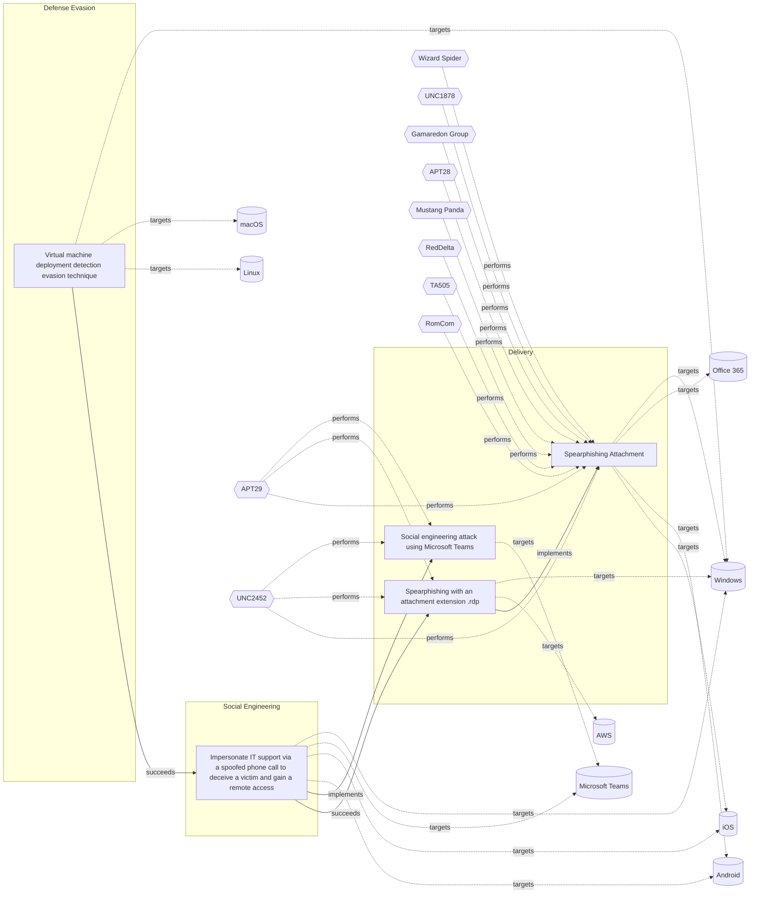

# ☣️ Virtual machine deployment detection evasion technique

🔥 **Criticality:Medium** ❗ : A Medium priority incident may affect public health or safety, national security, economic security, foreign relations, civil liberties, or public confidence. 

🚦 **TLP:CLEAR** ⚪ : Recipients can spread this to the world, there is no limit on disclosure.

🗡️ **ATT&CK Techniques** [T1497 : Virtualization/Sandbox Evasion](https://attack.mitre.org/techniques/T1497 'Adversaries may employ various means to detect and avoid virtualization and analysis environments This may include changing behaviors based on the res')

---

`🔑 UUID : 60bd6a35-3a71-47c2-8110-4562fb40976c` **|** `🏷️ Version : 1` **|** `🗓️ Creation Date : 2025-06-02` **|** `🗓️ Last Modification : 2025-07-04` **|** `Sharing Organisation : {'uuid': '56b0a0f0-b0bc-47d9-bb46-02f80ae2065a', 'name': 'EC DIGIT CSOC'}` **|** `🧱 Schema Identifier : tvm::2.1`

## 👁️ Description

> A threat actor can use virtualisation platforms and utilities
> to compromise an environment. For example, an installed virtual
> machine can be used for an entry point to the rest of the
> environment or as an entry point for reconnaissance and
> pivoting to the system host and further potentially to
> other systems in the environment.  
> 
> The goal is to establish persistence on the victim's system. 
> Once inside, the threat actor deploy's virtual machine using
> any virtualisation technology, which may contain a backdoor, allowing
> them to maintain a covert presence on the network in days, weeks or
> even longer ref [1].     
> 
> ### Possible platforms for virtualisation used for detection evasion
> 
> A threat actor can deploy a virtual machine using one of the virtualisation
> platforms below:
> 
> - Hyper-V
> - EXS/ESXi (VMware virtualisation)
> - QEMU virtualisation
> - Virtual box
> 
> Once deployed, the virtual machine may contain a backdoor or another
> type of a malware (example: QDoor backdoor). This technique allows
> a threat actor to maintain a covert channel on the network for unnoticed
> period of time. During this period, they can escalate privileges, move
> laterally across the environment, and exfiltrate valuable or sensitive
> organisational data using data-exfiltration tools. For example, such
> data-exfiltration tool can be `GoodSync` tool ref [1], [2].      
> 

## 🖥️ Terrain 

 > A threat actor needs an initial privileged access
> to already compromised host system.  
> 

---

## 🕸️ Relations

### 🌊 OpenTide Objects
🚫 No related OpenTide objects indexed.

 --- 

### ⛓️ Threat Chaining

Expand chaining data

| ☣️ Vector                                                                                                                                                                                                                                                                                                                                                                                                            | ⛓️ Link                 | 🎯 Target                                                                                                                                                                                                                                                                                                                                                                                                             | ⛰️ Terrain                                                                                                                                                                                                                                                                                                                                                                                                                                                                                                                                                                                                                                                                                                                                                                                                                                                | 🗡️ ATT&CK                                                                                                                                                                                                                                                                                                                                                                                                                                                                                                                                                                                                                                                                                                                                                                                                                                                                                                                                                                                                                                                                                                                                                                                                                                                                                                                                                                                                                                                                                                                                                                                                                                                                                                                                                                                                                                                                                                                   |
|:---------------------------------------------------------------------------------------------------------------------------------------------------------------------------------------------------------------------------------------------------------------------------------------------------------------------------------------------------------------------------------------------------------------------|:------------------------|:---------------------------------------------------------------------------------------------------------------------------------------------------------------------------------------------------------------------------------------------------------------------------------------------------------------------------------------------------------------------------------------------------------------------|:----------------------------------------------------------------------------------------------------------------------------------------------------------------------------------------------------------------------------------------------------------------------------------------------------------------------------------------------------------------------------------------------------------------------------------------------------------------------------------------------------------------------------------------------------------------------------------------------------------------------------------------------------------------------------------------------------------------------------------------------------------------------------------------------------------------------------------------------------------|:----------------------------------------------------------------------------------------------------------------------------------------------------------------------------------------------------------------------------------------------------------------------------------------------------------------------------------------------------------------------------------------------------------------------------------------------------------------------------------------------------------------------------------------------------------------------------------------------------------------------------------------------------------------------------------------------------------------------------------------------------------------------------------------------------------------------------------------------------------------------------------------------------------------------------------------------------------------------------------------------------------------------------------------------------------------------------------------------------------------------------------------------------------------------------------------------------------------------------------------------------------------------------------------------------------------------------------------------------------------------------------------------------------------------------------------------------------------------------------------------------------------------------------------------------------------------------------------------------------------------------------------------------------------------------------------------------------------------------------------------------------------------------------------------------------------------------------------------------------------------------------------------------------------------------|
| [Virtual machine deployment detection evasion technique](../Threat%20Vectors/☣️%20Virtual%20machine%20deployment%20detection%20evasion%20technique.md 'A threat actor can use virtualisation platforms and utilitiesto compromise an environment For example, an installed virtualmachine can be used for an ...')                                                                                                   | `sequence::succeeds`    | [Impersonate IT support via a spoofed phone call to deceive a victim and gain a remote access](../Threat%20Vectors/☣️%20Impersonate%20IT%20support%20via%20a%20spoofed%20phone%20call%20to%20deceive%20a%20victim%20and%20gain%20a%20remote%20access.md 'IT support impersonation via spoofed phone calls is a common socialengineering technique used by attackers to gain initial access to anorganisations n...') | A threat actor needs initial user's interaction to gain access to the platform. For example assistance, accept invitation to a fake technical support or other "assistance".                                                                                                                                                                                                                                                                                                                                                                                                                                                                                                                                                                                                                                                                              | [T1624](https://attack.mitre.org/techniques/T1624 'Adversaries may establish persistence using system mechanisms that trigger execution based on specific events Mobile operating systems have means to s'), [T1566](https://attack.mitre.org/techniques/T1566 'Adversaries may send phishing messages to gain access to victim systems All forms of phishing are electronically delivered social engineering Phishing'), [T1566.004](https://attack.mitre.org/techniques/T1566/004 'Adversaries may use voice communications to ultimately gain access to victim systems Spearphishing voice is a specific variant of spearphishing It is '), [T1210](https://attack.mitre.org/techniques/T1210 'Adversaries may exploit remote services to gain unauthorized access to internal systems once inside of a network Exploitation of a software vulnerabil'), [T1033](https://attack.mitre.org/techniques/T1033 'Adversaries may attempt to identify the primary user, currently logged in user, set of users that commonly uses a system, or whether a user is activel'), [T1016](https://attack.mitre.org/techniques/T1016 'Adversaries may look for details about the network configuration and settings, such as IP andor MAC addresses, of systems they access or through infor'), [T1219](https://attack.mitre.org/techniques/T1219 'An adversary may use legitimate remote access tools to establish an interactive command and control channel within a network Remote access tools creat'), [T1078](https://attack.mitre.org/techniques/T1078 'Adversaries may obtain and abuse credentials of existing accounts as a means of gaining Initial Access, Persistence, Privilege Escalation, or Defense '), [T1105](https://attack.mitre.org/techniques/T1105 'Adversaries may transfer tools or other files from an external system into a compromised environment Tools or files may be copied from an external adv') |
| [Impersonate IT support via a spoofed phone call to deceive a victim and gain a remote access](../Threat%20Vectors/☣️%20Impersonate%20IT%20support%20via%20a%20spoofed%20phone%20call%20to%20deceive%20a%20victim%20and%20gain%20a%20remote%20access.md 'IT support impersonation via spoofed phone calls is a common socialengineering technique used by attackers to gain initial access to anorganisations n...') | `atomicity::implements` | [Social engineering attack using Microsoft Teams](../Threat%20Vectors/☣️%20Social%20engineering%20attack%20using%20Microsoft%20Teams.md 'Adversaries are using compromised Microsoft 365 tenants to create technicalsupport-themed domains and send tech support lures via Microsoft Teams, att...')                                                                                                                 | Attacker has compromised a valid Microsoft 365 tenant to host the lures, and valid valid credentials in targeted M365 tenant too. Targeted organizations must use an app like Microsoft Authenticator as second factor (app taking the code received after successful authentication granted by  the victim, the user, in previous step).                                                                                                                                                                                                                                                                                                                                                                                                                                                                                                                 | [T1199 : Trusted Relationship](https://attack.mitre.org/techniques/T1199 'Adversaries may breach or otherwise leverage organizations who have access to intended victims Access through trusted third party relationship abuses ')                                                                                                                                                                                                                                                                                                                                                                                                                                                                                                                                                                                                                                                                                                                                                                                                                                                                                                                                                                                                                                                                                                                                                                                                                                                                                                                                                                                                                                                                                                                                                                                                                                                                                          |
| [Impersonate IT support via a spoofed phone call to deceive a victim and gain a remote access](../Threat%20Vectors/☣️%20Impersonate%20IT%20support%20via%20a%20spoofed%20phone%20call%20to%20deceive%20a%20victim%20and%20gain%20a%20remote%20access.md 'IT support impersonation via spoofed phone calls is a common socialengineering technique used by attackers to gain initial access to anorganisations n...') | `sequence::succeeds`    | [Spearphishing with an attachment extension .rdp](../Threat%20Vectors/☣️%20Spearphishing%20with%20an%20attachment%20extension%20.rdp.md 'Spearphishing with an attachment extension rdp refers to a targetedcyberattack where a malicious actor sends an email containing a filewith the file e...')                                                                                                                 | A threat actor relies on an email attachment lure. In this case a malicious file is masquerading as a RDP file in an attempt to deceive a victim about their identity and true nature of the file. The spear-phishing attachment provides a threat actor an initial access to the system.                                                                                                                                                                                                                                                                                                                                                                                                                                                                                                                                                                 | [T1566.001 : Phishing: Spearphishing Attachment](https://attack.mitre.org/techniques/T1566/001 'Adversaries may send spearphishing emails with a malicious attachment in an attempt to gain access to victim systems Spearphishing attachment is a spe'), [T1204.002 : User Execution: Malicious File](https://attack.mitre.org/techniques/T1204/002 'An adversary may rely upon a user opening a malicious file in order to gain execution Users may be subjected to social engineering to get them to open'), [T1036 : Masquerading](https://attack.mitre.org/techniques/T1036 'Adversaries may attempt to manipulate features of their artifacts to make them appear legitimate or benign to users andor security tools Masquerading ')                                                                                                                                                                                                                                                                                                                                                                                                                                                                                                                                                                                                                                                                                                                                                                                                                                                                                                                                                                                                                                                                                                                                                                                  |
| [Spearphishing with an attachment extension .rdp](../Threat%20Vectors/☣️%20Spearphishing%20with%20an%20attachment%20extension%20.rdp.md 'Spearphishing with an attachment extension rdp refers to a targetedcyberattack where a malicious actor sends an email containing a filewith the file e...')                                                                                                                 | `atomicity::implements` | [Spearphishing Attachment](../Threat%20Vectors/☣️%20Spearphishing%20Attachment.md 'Spearphishing messages are often crafted using pernicious social engineeringtechniquesIn Spearphishing Attachment attacks, recipients receive emails t...')                                                                                                                                                                       | Spear phishing requires more preparation and time to achieve success  than a phishing attack. That is because spear-phishing attackers attempt to obtain vast amounts of personal information about their victims.   Attackers can get the personal information they need using different ways:   - to compromise an email or messaging system trough other means, - to use OSINT, sourcing Social Media or glean personal information from the user's online presence. They want to craft emails that look as legitimate and attractive as possible  to increase the chances of fooling their targets, for instance sending a malicious  attachment where the filename references a topic the recipient is interested in. The highly personalized nature of spear-phishing attacks makes it more  difficult to identity than widescale phishing attacks. | [T1566.001 : Phishing: Spearphishing Attachment](https://attack.mitre.org/techniques/T1566/001 'Adversaries may send spearphishing emails with a malicious attachment in an attempt to gain access to victim systems Spearphishing attachment is a spe')                                                                                                                                                                                                                                                                                                                                                                                                                                                                                                                                                                                                                                                                                                                                                                                                                                                                                                                                                                                                                                                                                                                                                                                                                                                                                                                                                                                                                                                                                                                                                                                                                                                                    |

&nbsp; 

---

## Model Data

#### **⛓️ Cyber Kill Chain**

 > Cyber attacks are typically phased progressions towards strategic objectives. The Unified Kill Chains provides insight into the tactics that hackers employ to attain these objectives. This provides a solid basis to develop (or realign) defensive strategies to raise cyber resilience.

 [`🏃🏽 Defense Evasion`](https://www.unifiedkillchain.com/assets/The-Unified-Kill-Chain.pdf) : Techniques an attacker may specifically use for evading detection or avoiding other defenses.

---

#### **🛰️ Domains**

 > Infrastructure technologies domain of interest to attackers.

  - `🏢 Enterprise` : Generic databases, applications, machines and systems that are usually on premises or on Cloud traditional VMs.
 - `☁️ Private Cloud` : Infrastructure hosted at a third party, but based on custom specification and managed on a platform level.
 - `☁️ Public Cloud` : Infrastructure handled by a commercial cloud provider. Managed mostly on a service level, and connected over the internet.

---

#### **🎯 Targets**

 > Granular delimited technical entities holding a value to the organization, that are targeted by adversaries. They might be also involved in the detection coverage as the target of log collection. Partially inspired by Veris.

  - [`👤 End-user`](http://veriscommunity.net/enums.html#section-asset) : People - End-user
 - [`🖥️ Workstations`](http://veriscommunity.net/enums.html#section-asset) : Placeholder
 - [`👤 Customer`](http://veriscommunity.net/enums.html#section-asset) : People - Customer
 - [`🛠️ Virtual Machines`](http://veriscommunity.net/enums.html#section-asset) : Placeholder
 - [`🖥️ Virtual Machines Host`](http://veriscommunity.net/enums.html#section-asset) : Server - Virtual Host

---

#### **💿 Platforms concerned**

 > Actual technologies used by the organization that will be exploited by adversaries during a successful attack, and eventually of relevance for detection. Are named by commercial designation.

  - ` Windows` : Placeholder
 - ` macOS` : Placeholder
 - ` Linux` : Placeholder

---

#### **💣 Severity**

 > The severity summarizes the overall danger of incident the vector will provoke, and is to be derived (WIP) from impact, leverage, and difficulty to execute.

 [`🧨 Moderate incident`](https://www.ncsc.gov.uk/news/new-cyber-attack-categorisation-system-improve-uk-response-incidents) : A cyber attack on a small organisation, or which poses a considerable risk to a medium-sized organisation, or preliminary indications of cyber activity against a large organisation or the government.

---

#### **🪄 Leverage acquisition**

 > Technical aftermath of the attack from the target perspective, differentiated from impact as it does not consider the value of the consequence, only what increased control the vector execution provides to the adversary.

  - [`💀 Infrastructure Compromise`](https://owasp.org/www-community/Threat_Modeling_Process#stride) : The compromised target is likely to be used to further expand the sphere of influence of the attacker and allow more potent vectors to be executed.
 - [`💅 Elevation of privilege`](https://owasp.org/www-community/Threat_Modeling_Process#stride) : Capacity to augment leverage over the target system by upgrading the compromised access rights
 - [`👁️‍🗨️ Information Disclosure`](https://owasp.org/www-community/Threat_Modeling_Process#stride) : Threat action intending to read a file that one was not granted access to, or to read data in transit.
 - [`📦 Software installation`](https://owasp.org/www-community/Threat_Modeling_Process#stride) : Software installation or code modification
 - [`🐒 Tampering`](https://owasp.org/www-community/Threat_Modeling_Process#stride) : Threat action intending to maliciously change or modify persistent data, such as records in a database, and the alteration of data in transit between two computers over an open network, such as the Internet.

---

#### **💥 Impact**

 > Analysis of the threat vector from the organizational perspective, in non technical term. This aims at putting a clear denomination on what the attacker will actually be able to act upon if the threat vector is realized.

  - [`🩼 Impairement`](http://veriscommunity.net/enums.html#section-impact) : Incapacitation of a particular key system that will cause disruptions in day-to-day operations, and eventually service delivery.
 - [`🔓 Data Breach`](http://veriscommunity.net/enums.html#section-impact) : Non-public information has been accessed from the outside, and successfully extracted.
 - [`🛑 Business disruption`](http://veriscommunity.net/enums.html#section-impact) : Business disruption
 - [`🌍 Reputational Damages`](http://veriscommunity.net/enums.html#section-impact) : Damages to the organization public view may be achieved by using directly the access gained, or indirectly with data gathered.
 - [`😤 Nuisance`](http://veriscommunity.net/enums.html#section-impact) : Small and mostly inconsequential to day to day operations, but noticed.

---

#### **🎲 Vector Viability**

 > Described with estimative language (likelyhood probability), describes how likely the analyst believes the vector to actually be realized on the organization infrastructure. Estimative language describes quality and credibility of underlying sources, data, and methodologies based Intelligence Community Directive 203 (ICD 203) and JP 2-0, Joint Intelligence.

 [`🧐 Likely`](https://www.dni.gov/files/documents/ICD/ICD%20203%20Analytic%20Standards.pdf) : Probable (probably) - 55-80%

---

### 🔗 References

**🕊️ Publicly available resources**

- [_1_] https://news.sophos.com/en-us/2025/05/20/a-familiar-playbook-with-a-twist-3am-ransomware-actors-dropped-virtual-machine-with-vishing-and-quick-assist
- [_2_] https://www.bleepingcomputer.com/news/security/3am-ransomware-uses-spoofed-it-calls-email-bombing-to-breach-networks/
- [_3_] https://www.intrinsec.com/wp-content/uploads/2024/01/TLP-CLEAR-2024-01-09-ThreeAM-EN-Information-report.pdf
- [_4_] https://www.security.com/threat-intelligence/3am-ransomware-lockbit
- [_5_] https://www.ransomlook.io/group/3am

[1]: https://news.sophos.com/en-us/2025/05/20/a-familiar-playbook-with-a-twist-3am-ransomware-actors-dropped-virtual-machine-with-vishing-and-quick-assist
[2]: https://www.bleepingcomputer.com/news/security/3am-ransomware-uses-spoofed-it-calls-email-bombing-to-breach-networks/
[3]: https://www.intrinsec.com/wp-content/uploads/2024/01/TLP-CLEAR-2024-01-09-ThreeAM-EN-Information-report.pdf
[4]: https://www.security.com/threat-intelligence/3am-ransomware-lockbit
[5]: https://www.ransomlook.io/group/3am

---

#### 🏷️ Tags

#-, #-, #-, #
, #
, ##, ##, ##, ##, # , #🏷, #️, # , #T, #a, #g, #s, #
, #

